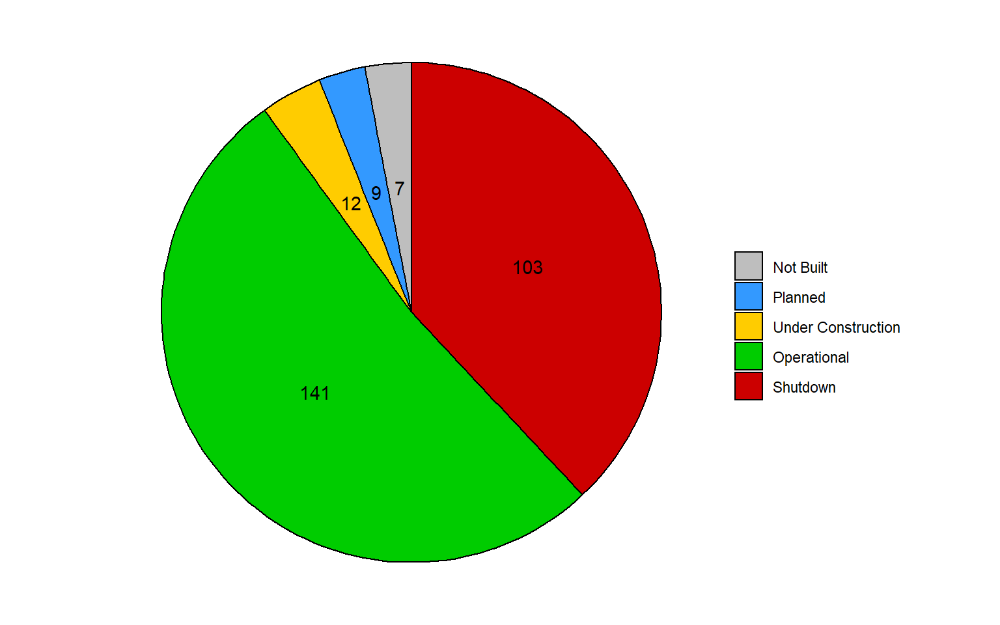
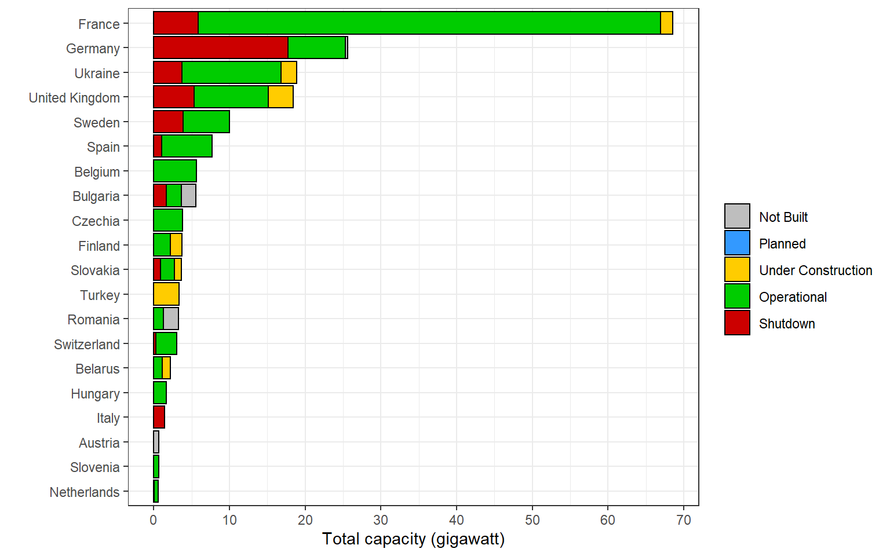
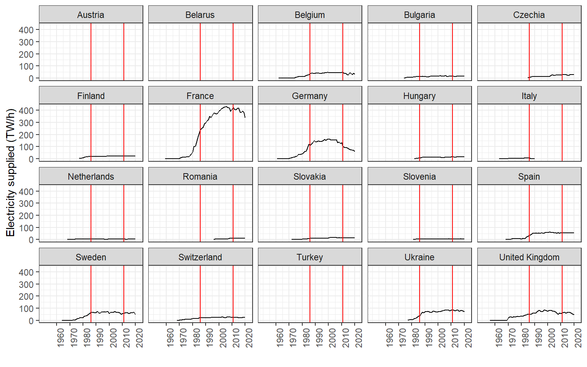
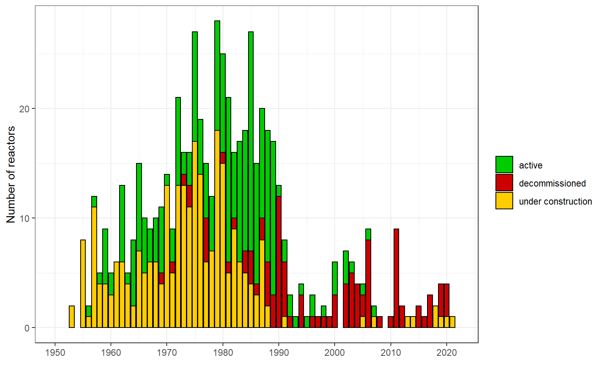
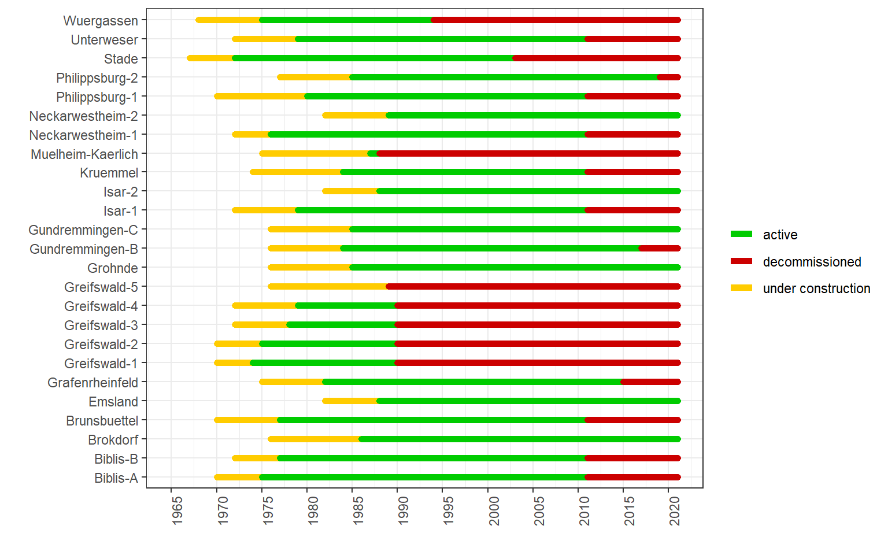
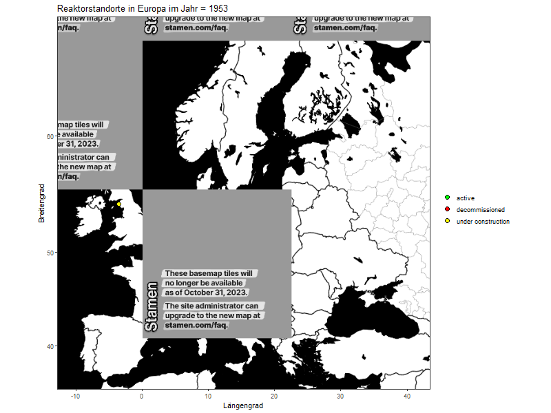

<script src="index_files/libs/kePrint-0.0.1/kePrint.js"></script>


Benötigte R-Pakete:

``` r
library(tidyverse)
library(ggmap)
library(gganimate)
library(rvest)
```

## **Datenbeschaffung**

Die Internationale Atomenergie-Organisation (*IAEA*) unterhält auf ihrer Webseite eine Datenbank, in der sich detallierte Angaben zu allen Atomreaktoren weltweit befinden - das [Power Reactor Information System (PRIS)](https://pris.iaea.org/PRIS/home.aspx). Auf GitHub habe ich einen [Auszug](https://github.com/cristianst85/GeoNuclearData) aus dieser Datenbank (Stand 21.06.2021) gefunden, den ich für die Auswertungen in diesem Artikel verwende. Die Daten befinden sich im .CSV Format und müssen nur in R eingelesen werden.

Der Datenbestand umfasst allerdings nur allgemeine Angaben zu den Reaktoren und ich möchte diese um die ins Netz eingespeiste Energiemenge erweitern. Diese Angaben findet man ebenfalls für jeden Reaktor im *PRIS* unter der Rubrik [Operating History](https://pris.iaea.org/PRIS/CountryStatistics/ReactorDetails.aspx?current=85), welche jährlich vom Betreiber gepflegt wird (sofern dieser Daten an die IAEA übermittelt). Mittels Webscraping extrahiere ich dabei die Spalte `Electricity Supplied [GW.h]` von jedem Reaktor. Jeder Reaktor besitzt in der Datenbank eine ID, welche auch auf der Webseite verwendet wird. Unten findet man den Code für die Extraktion der Daten. Die Liste der relevanten Reaktor-IDs ergibt sich aus dem ersten Datenbestand von GitHub. Ich verwende die Funktion `tryCatch()` um mögliche Fehlermeldungen zu überspringen, falls eine Reaktor-ID nicht mehr auf der Webseite verfügbar ist.

``` r
scraper_pris <- function(url){
  
  # Vectors
  reactor_name <- vector(mode = "character")
  year <- vector(mode = "double")
  electricity <- vector(mode = "double")
  
  # Name
  tryCatch(
    reactor_name <-
      url %>%
      read_html() %>%
      html_nodes("#MainContent_MainContent_lblReactorName") %>%
      html_text(),
    error = function(e){NA})  
    
  # Year
  tryCatch(
    year <- 
      url %>%
      read_html() %>%
      html_nodes(".active td:nth-child(1)") %>%
      html_text() %>%
      str_replace_all("\r\n","") %>%
      str_trim() %>%
      as.numeric(),
    error = function(e){NA})  
    
  # Electricity supplied
  tryCatch(
    electricity <- 
      url %>%
      read_html() %>%
      html_nodes(".active td:nth-child(2)") %>%
      html_text() %>%
      str_replace_all("\r\n","") %>%
      str_trim() %>%
      as.numeric(),
    error = function(e){NA}) 
    
  # Data
    scraped_data <- tibble(
      reactor_name, year, electricity
    )

  return(scraped_data)
}
```

## **Datenaufbereitung**

Im Datenbankauszug mit den allgemeinen Reaktorangaben gibt es 3 .CSV Dateien, die Schlüsseltabellen für die Länderkürzel, den Reaktorstatus sowie den Reaktortyp enthalten.

``` r
data_countries <-
  read_delim(
    file = "data/1-countries.csv", 
    delim = ","
    ) %>%
  rename("CountryCode" = Code, "CountryName" = Name)

data_status <- 
  read_delim(
    file = "data/2-nuclear_power_plant_status_type.csv", 
    delim = ","
    ) %>%
  rename("StatusId" = Id, "StatusType" = Type)

data_reactors <- 
  read_delim(
    file = "data/3-nuclear_reactor_type.csv", 
    delim = ","
    ) %>%
  rename("ReactorTypeId" = Id, "ReactorType" = Type)
```

Die 4. .CSV Datei enthält die Grunddaten für die einzelnen Atomreaktoren. Jede Zeile dieses Datensatzes repräsentiert einen Reaktor. Am Standort eines Atomkraftwerks kann es mehrere Reaktoren geben. Die Grunddaten der Reaktoren verknüpfe ich mit den drei zuvor eingelesenen Schlüsseltabellen.

``` r
data_raw <- 
  read_delim(
    file = "data/4-nuclear_power_plants.csv", 
    delim = ",")

data_wide <-  
  data_raw %>%
  left_join(data_status,  by = "StatusId") %>%
  left_join(data_reactors,  by = "ReactorTypeId") %>%
  left_join(data_countries,  by = "CountryCode") %>%
  select(-c(StatusId, ReactorTypeId, Id)) 
```

Die Daten sehen so aus:

<br>

<div style="border: 1px solid #ddd; padding: 0px; overflow-y: scroll; height:300px; overflow-x: scroll; width:100%; ">

| Name                           |  Latitude | Longitude | CountryCode | ReactorModel         | ConstructionStartAt | OperationalFrom | OperationalTo | Capacity | Source               | LastUpdatedAt       | IAEAId | StatusType             | ReactorType | Description                     | CountryName          |
|:-------------------------------|----------:|----------:|:------------|:---------------------|:--------------------|:----------------|:--------------|---------:|:---------------------|:--------------------|-------:|:-----------------------|:------------|:--------------------------------|:---------------------|
| Ågesta                         |  59.20600 |  18.08290 | SE          | NA                   | 1957-12-01          | 1964-05-01      | 1974-06-02    |        9 | WNA/IAEA             | 2015-05-24 01:51:37 |    528 | Shutdown               | PHWR        | Pressurized Heavy Water Reactor | Sweden               |
| Akademik Lomonosov-1           |  69.70958 | 170.30625 | RU          | KLT-40S \'Floating\' | 2007-04-15          | 2020-05-22      | NA            |       30 | WNA/IAEA/Google Maps | 2021-05-31 00:00:00 |    895 | Operational            | PWR         | Pressurized Water Reactor       | Russia               |
| Akademik Lomonosov-2           |  69.70958 | 170.30625 | RU          | KLT-40S \'Floating\' | 2007-04-15          | 2020-05-22      | NA            |       30 | WNA/IAEA/Google Maps | 2021-05-31 00:00:00 |    896 | Operational            | PWR         | Pressurized Water Reactor       | Russia               |
| Akhvaz-1                       |        NA |        NA | IR          | NA                   | NA                  | NA              | NA            |       NA | WNA                  | NA                  |     NA | Planned                | NA          | NA                              | Iran                 |
| Akhvaz-2                       |        NA |        NA | IR          | NA                   | NA                  | NA              | NA            |       NA | WNA                  | NA                  |     NA | Planned                | NA          | NA                              | Iran                 |
| Akkuyu-1                       |  36.14444 |  33.54111 | TR          | VVER V-509           | 2018-04-03          | NA              | NA            |     1114 | WNA/Wikipedia/IAEA   | 2018-06-30 22:21:08 |    553 | Under Construction     | PWR         | Pressurized Water Reactor       | Turkey               |
| Akkuyu-2                       |  36.14444 |  33.54111 | TR          | VVER V-509           | 2020-04-08          | NA              | NA            |     1114 | Wikipedia/IAEA       | 2020-08-30 22:39:56 |   1080 | Under Construction     | PWR         | Pressurized Water Reactor       | Turkey               |
| Akkuyu-3                       |  36.14444 |  33.54111 | TR          | VVER V-509           | 2021-03-10          | NA              | NA            |     1114 | Wikipedia/IAEA       | 2021-04-19 23:47:37 |   1081 | Under Construction     | PWR         | Pressurized Water Reactor       | Turkey               |
| Akkuyu-4                       |  36.14444 |  33.54111 | TR          | NA                   | NA                  | NA              | NA            |       NA | Wikipedia            | NA                  |     NA | Planned                | PWR         | Pressurized Water Reactor       | Turkey               |
| Aktau (Shevchenko)             |  43.60700 |  51.28300 | KZ          | BN-350               | 1964-10-01          | NA              | 1999-04-22    |       52 | WNA/IAEA             | 2021-04-19 23:47:37 |    414 | Shutdown               | FBR         | Fast Breeder Reactor            | Kazakhstan           |
| Almaraz-1                      |  39.80700 |  -5.69800 | ES          | WH 3LP               | 1973-07-03          | 1983-09-01      | NA            |      900 | WNA/IAEA             | 2017-02-10 21:56:15 |    153 | Operational            | PWR         | Pressurized Water Reactor       | Spain                |
| Almaraz-2                      |  39.80700 |  -5.69800 | ES          | WH 3LP               | 1973-07-03          | 1984-07-01      | NA            |      900 | WNA/IAEA             | 2019-06-02 17:17:55 |    154 | Operational            | PWR         | Pressurized Water Reactor       | Spain                |
| Angra-1                        | -23.00800 | -44.45700 | BR          | WH 2LP               | 1971-05-01          | 1985-01-01      | NA            |      609 | WNA/IAEA             | 2021-02-14 01:47:53 |     24 | Operational            | PWR         | Pressurized Water Reactor       | Brazil               |
| Angra-2                        | -23.00800 | -44.45700 | BR          | PRE KONVOI           | 1976-01-01          | 2001-02-01      | NA            |     1245 | WNA/IAEA             | 2015-05-24 01:50:19 |     25 | Operational            | PWR         | Pressurized Water Reactor       | Brazil               |
| Angra-3                        | -23.01000 | -44.47000 | BR          | PRE KONVOI           | 2010-06-01          | NA              | NA            |     1340 | WNA/IAEA             | 2018-06-30 22:21:29 |     26 | Under Construction     | PWR         | Pressurized Water Reactor       | Brazil               |
| APS-1 Obninsk                  |  55.08400 |  36.57000 | RU          | AM-1                 | 1951-01-01          | 1954-12-01      | 2002-04-29    |        5 | WNA/IAEA             | 2015-05-24 01:51:32 |    447 | Shutdown               | LWGR        | Light Water Graphite Reactor    | Russia               |
| Arkansas Nuclear One-1 (ANO-1) |  35.31000 | -93.23000 | US          | B&W LLP (DRYAMB)     | 1968-10-01          | 1974-12-19      | NA            |      850 | WNA/IAEA             | 2017-02-10 21:58:30 |    652 | Operational            | PWR         | Pressurized Water Reactor       | United States        |
| Arkansas Nuclear One-2 (ANO-2) |  35.31000 | -93.22900 | US          | CE 2LP (DRYAMB)      | 1968-12-06          | 1980-03-26      | NA            |      912 | WNA/IAEA             | 2017-02-10 21:58:53 |    689 | Operational            | PWR         | Pressurized Water Reactor       | United States        |
| Armenian-1                     |  40.18200 |  44.14700 | AM          | VVER V-270           | 1969-07-01          | 1977-10-06      | 1989-02-25    |      376 | WNA/IAEA             | 2021-06-07 00:00:00 |      1 | Shutdown               | PWR         | Pressurized Water Reactor       | Armenia              |
| Armenian-2                     |  40.18200 |  44.14700 | AM          | VVER V-270           | 1975-07-01          | 1980-05-03      | NA            |      375 | WNA/IAEA             | 2021-06-28 21:12:17 |      2 | Operational            | PWR         | Pressurized Water Reactor       | Armenia              |
| Armenian-3                     |  40.18080 |  44.14720 | AM          | NA                   | NA                  | NA              | NA            |       NA | WNA                  | 2021-06-07 00:00:00 |     NA | Planned                | PWR         | Pressurized Water Reactor       | Armenia              |
| Asco-1                         |  41.20200 |   0.57100 | ES          | WH 3LP               | 1974-05-16          | 1984-12-10      | NA            |      995 | WNA/IAEA             | 2021-01-05 23:19:47 |    155 | Operational            | PWR         | Pressurized Water Reactor       | Spain                |
| Asco-2                         |  41.20200 |   0.57100 | ES          | WH 3LP               | 1975-03-07          | 1986-03-31      | NA            |      997 | WNA/IAEA             | 2021-04-19 23:47:37 |    156 | Operational            | PWR         | Pressurized Water Reactor       | Spain                |
| Atucha-1                       | -33.96700 | -59.20900 | AR          | PHWR KWU             | 1968-06-01          | 1974-06-24      | NA            |      340 | WNA/IAEA             | 2021-02-14 01:47:53 |      3 | Operational            | PHWR        | Pressurized Heavy Water Reactor | Argentina            |
| Atucha-2                       | -33.96700 | -59.20900 | AR          | PHWR KWU             | 1981-07-14          | 2016-05-26      | NA            |      692 | WNA/IAEA             | 2017-09-25 00:19:13 |      5 | Operational            | PHWR        | Pressurized Heavy Water Reactor | Argentina            |
| Balakovo-1                     |  52.09200 |  47.95200 | RU          | VVER V-320           | 1980-12-01          | 1986-05-23      | NA            |      950 | WNA/IAEA             | 2015-05-24 01:51:36 |    524 | Operational            | PWR         | Pressurized Water Reactor       | Russia               |
| Balakovo-2                     |  52.09200 |  47.95200 | RU          | VVER V-320           | 1981-08-01          | 1988-01-18      | NA            |      950 | WNA/IAEA             | 2015-05-24 01:51:36 |    525 | Operational            | PWR         | Pressurized Water Reactor       | Russia               |
| Balakovo-3                     |  52.09200 |  47.95200 | RU          | VVER V-320           | 1982-11-01          | 1989-04-08      | NA            |      950 | WNA/IAEA             | 2015-05-24 01:51:36 |    526 | Operational            | PWR         | Pressurized Water Reactor       | Russia               |
| Balakovo-4                     |  52.09200 |  47.95200 | RU          | VVER V-320           | 1984-04-01          | 1993-12-22      | NA            |      950 | WNA/IAEA             | 2015-05-24 01:51:36 |    527 | Operational            | PWR         | Pressurized Water Reactor       | Russia               |
| Baltic-1                       |  54.93900 |  22.16200 | RU          | VVER V-491           | 2012-02-22          | NA              | NA            |     1109 | WNA/IAEA             | 2015-05-24 01:51:57 |    968 | Under Construction     | PWR         | Pressurized Water Reactor       | Russia               |
| Barakah-1 (Braka)              |  23.95275 |  52.19330 | AE          | APR-1400             | 2012-07-19          | 2021-04-01      | NA            |     1345 | WNA/IAEA             | 2021-05-30 14:38:32 |   1050 | Operational            | PWR         | Pressurized Water Reactor       | United Arab Emirates |
| Barakah-2 (Braka)              |  23.95275 |  52.19330 | AE          | APR-1400             | 2013-04-16          | NA              | NA            |     1345 | WNA/IAEA             | 2015-12-27 15:05:52 |   1051 | Under Construction     | PWR         | Pressurized Water Reactor       | United Arab Emirates |
| Barakah-3 (Braka)              |  23.95275 |  52.20330 | AE          | APR-1400             | 2014-09-24          | NA              | NA            |     1345 | WNA/IAEA             | 2015-05-24 01:51:58 |   1052 | Under Construction     | PWR         | Pressurized Water Reactor       | United Arab Emirates |
| Chutka-1                       |        NA |        NA | IN          | NA                   | NA                  | NA              | NA            |       NA | WNA                  | 2021-06-07 00:00:00 |     NA | Planned                | PHWR        | Pressurized Heavy Water Reactor | India                |
| Chutka-2                       |        NA |        NA | IN          | NA                   | NA                  | NA              | NA            |       NA | WNA                  | 2021-06-07 00:00:00 |     NA | Planned                | PHWR        | Pressurized Heavy Water Reactor | India                |
| Barseback-1                    |  55.74500 |  12.92600 | SE          | AA-II                | 1971-02-01          | 1975-07-01      | 1999-11-30    |      570 | WNA/IAEA             | 2018-03-10 12:52:00 |    538 | Shutdown               | BWR         | Boiling Water Reactor           | Sweden               |
| Barseback-2                    |  55.74500 |  12.92600 | SE          | AA-II                | 1973-01-01          | 1977-07-01      | 2005-05-31    |      570 | WNA/IAEA             | 2018-03-10 12:52:02 |    540 | Shutdown               | BWR         | Boiling Water Reactor           | Sweden               |
| Beaver Valley-1                |  40.62400 | -80.43200 | US          | WH 3LP (DRYSUB)      | 1970-06-26          | 1976-10-01      | NA            |      835 | WNA/IAEA             | 2017-02-10 21:58:44 |    669 | Operational            | PWR         | Pressurized Water Reactor       | United States        |
| Beaver Valley-2                |  40.62400 | -80.43200 | US          | WH 3LP (DRYSUB)      | 1974-05-03          | 1987-11-17      | NA            |      836 | WNA/IAEA             | 2017-02-10 21:58:59 |    712 | Operational            | PWR         | Pressurized Water Reactor       | United States        |
| Belarusian-1                   |  54.76667 |  26.11667 | BY          | VVER V-491           | 2013-11-08          | NA              | NA            |     1110 | IAEA                 | 2021-01-05 23:19:47 |   1056 | Operational            | PWR         | Pressurized Water Reactor       | Belarus              |
| Belarusian-2                   |  54.76667 |  26.11667 | BY          | VVER V-491           | 2014-04-27          | NA              | NA            |     1110 | IAEA                 | 2018-03-10 12:54:39 |   1061 | Under Construction     | PWR         | Pressurized Water Reactor       | Belarus              |
| Belene-1                       |  43.62453 |  25.18675 | BG          | NA                   | 1987-01-01          | NA              | NA            |      953 | WNA/IAEA             | 2021-02-13 22:57:00 |     NA | Cancelled Construction | PWR         | Pressurized Water Reactor       | Bulgaria             |
| Belene-2                       |  43.62453 |  25.18650 | BG          | NA                   | 1987-03-31          | NA              | NA            |      953 | WNA/IAEA             | 2021-02-13 22:57:00 |     NA | Cancelled Construction | PWR         | Pressurized Water Reactor       | Bulgaria             |
| Belleville-1                   |  47.51100 |   2.87100 | FR          | P4 REP 1300          | 1980-05-01          | 1988-06-01      | NA            |     1310 | WNA/IAEA             | 2015-05-24 01:51:02 |    211 | Operational            | PWR         | Pressurized Water Reactor       | France               |
| Belleville-2                   |  47.51100 |   2.87100 | FR          | P4 REP 1300          | 1980-08-01          | 1989-01-01      | NA            |     1310 | WNA/IAEA             | 2015-05-24 01:51:02 |    212 | Operational            | PWR         | Pressurized Water Reactor       | France               |
| Beloyarsk-1                    |  56.84200 |  61.32100 | RU          | AMB-100              | 1958-06-01          | 1964-04-26      | 1983-01-01    |      102 | WNA/IAEA             | 2015-05-24 01:51:34 |    488 | Shutdown               | LWGR        | Light Water Graphite Reactor    | Russia               |
| Beloyarsk-2                    |  56.84200 |  61.32100 | RU          | AMB-200              | 1962-01-01          | 1969-12-01      | 1990-01-01    |      146 | WNA/IAEA             | 2015-05-24 01:51:35 |    503 | Shutdown               | LWGR        | Light Water Graphite Reactor    | Russia               |
| Beloyarsk-3                    |  56.84200 |  61.32100 | RU          | BN-600               | 1969-01-01          | 1981-11-01      | NA            |      560 | WNA/IAEA             | 2015-05-24 01:51:34 |    484 | Operational            | FBR         | Fast Breeder Reactor            | Russia               |
| Beloyarsk-4                    |  56.84200 |  61.32100 | RU          | BN-800               | 2006-07-18          | 2016-10-31      | NA            |      820 | WNA/IAEA             | 2017-09-25 00:19:53 |    451 | Operational            | FBR         | Fast Breeder Reactor            | Russia               |
| Beloyarsk-5                    |  56.84200 |  61.32100 | RU          | BN-1200              | NA                  | NA              | NA            |       NA | WNA/Wikipedia        | NA                  |     NA | Planned                | FBR         | Fast Breeder Reactor            | Russia               |

</div>

In diesem Datensatz existieren die Spalten `ConstructionStartAt`, `OperationalFrom` und `OperationalTo`, welche den Zeitpunkt markieren an dem der Bau, der Betrieb und die Stilllegung des Reaktors stattfand. Später möchte ich eine animierte Karte erstellen, bei der sich diese fixen Datumsangaben wie eine Zeitreihe verhalten - d.h. ab dem Zeitpunkt an dem der Bau beginnt, befindet sich das AKW solange im Bau bis sich der Status ändert (bspw. wenn ein Reaktor in Betrieb gesetzt wird). Hierfür transformiere ich den Datensatz und fasse das Ereignis, das jede Spalte repräsentiert, in der Spalte (`TimeEvent`) zusammen und hinterlege das jeweilige Datum in der Spalte (`Date`). Ist ein Ereignis für einen Reaktor noch nicht eingetreten so wird es entfernt.

``` r
data_long <-
  data_wide %>%
  pivot_longer(cols = c("ConstructionStartAt", "OperationalFrom", "OperationalTo"), 
               names_to = "TimeEvent", 
               values_to = "Date") %>%
  mutate(Year = lubridate::year(Date),
         TimeEvent_Animation = case_when(
           TimeEvent == "ConstructionStartAt" ~ "under construction",
           TimeEvent == "OperationalFrom" ~ "active",
           TimeEvent == "OperationalTo" ~ "decommissioned"
         )) %>%
  filter(!is.na(Date))
```

Die transformierten Daten (ausgewählte Spalten) sehen so aus:

<br>

<div style="border: 1px solid #ddd; padding: 0px; overflow-y: scroll; height:300px; overflow-x: scroll; width:100%; ">

| Name                           | TimeEvent           | Date       | TimeEvent_Animation |
|:-------------------------------|:--------------------|:-----------|:--------------------|
| Ågesta                         | ConstructionStartAt | 1957-12-01 | under construction  |
| Ågesta                         | OperationalFrom     | 1964-05-01 | active              |
| Ågesta                         | OperationalTo       | 1974-06-02 | decommissioned      |
| Akademik Lomonosov-1           | ConstructionStartAt | 2007-04-15 | under construction  |
| Akademik Lomonosov-1           | OperationalFrom     | 2020-05-22 | active              |
| Akademik Lomonosov-2           | ConstructionStartAt | 2007-04-15 | under construction  |
| Akademik Lomonosov-2           | OperationalFrom     | 2020-05-22 | active              |
| Akkuyu-1                       | ConstructionStartAt | 2018-04-03 | under construction  |
| Akkuyu-2                       | ConstructionStartAt | 2020-04-08 | under construction  |
| Akkuyu-3                       | ConstructionStartAt | 2021-03-10 | under construction  |
| Aktau (Shevchenko)             | ConstructionStartAt | 1964-10-01 | under construction  |
| Aktau (Shevchenko)             | OperationalTo       | 1999-04-22 | decommissioned      |
| Almaraz-1                      | ConstructionStartAt | 1973-07-03 | under construction  |
| Almaraz-1                      | OperationalFrom     | 1983-09-01 | active              |
| Almaraz-2                      | ConstructionStartAt | 1973-07-03 | under construction  |
| Almaraz-2                      | OperationalFrom     | 1984-07-01 | active              |
| Angra-1                        | ConstructionStartAt | 1971-05-01 | under construction  |
| Angra-1                        | OperationalFrom     | 1985-01-01 | active              |
| Angra-2                        | ConstructionStartAt | 1976-01-01 | under construction  |
| Angra-2                        | OperationalFrom     | 2001-02-01 | active              |
| Angra-3                        | ConstructionStartAt | 2010-06-01 | under construction  |
| APS-1 Obninsk                  | ConstructionStartAt | 1951-01-01 | under construction  |
| APS-1 Obninsk                  | OperationalFrom     | 1954-12-01 | active              |
| APS-1 Obninsk                  | OperationalTo       | 2002-04-29 | decommissioned      |
| Arkansas Nuclear One-1 (ANO-1) | ConstructionStartAt | 1968-10-01 | under construction  |
| Arkansas Nuclear One-1 (ANO-1) | OperationalFrom     | 1974-12-19 | active              |
| Arkansas Nuclear One-2 (ANO-2) | ConstructionStartAt | 1968-12-06 | under construction  |
| Arkansas Nuclear One-2 (ANO-2) | OperationalFrom     | 1980-03-26 | active              |
| Armenian-1                     | ConstructionStartAt | 1969-07-01 | under construction  |
| Armenian-1                     | OperationalFrom     | 1977-10-06 | active              |
| Armenian-1                     | OperationalTo       | 1989-02-25 | decommissioned      |
| Armenian-2                     | ConstructionStartAt | 1975-07-01 | under construction  |
| Armenian-2                     | OperationalFrom     | 1980-05-03 | active              |
| Asco-1                         | ConstructionStartAt | 1974-05-16 | under construction  |
| Asco-1                         | OperationalFrom     | 1984-12-10 | active              |
| Asco-2                         | ConstructionStartAt | 1975-03-07 | under construction  |
| Asco-2                         | OperationalFrom     | 1986-03-31 | active              |
| Atucha-1                       | ConstructionStartAt | 1968-06-01 | under construction  |
| Atucha-1                       | OperationalFrom     | 1974-06-24 | active              |
| Atucha-2                       | ConstructionStartAt | 1981-07-14 | under construction  |
| Atucha-2                       | OperationalFrom     | 2016-05-26 | active              |
| Balakovo-1                     | ConstructionStartAt | 1980-12-01 | under construction  |
| Balakovo-1                     | OperationalFrom     | 1986-05-23 | active              |
| Balakovo-2                     | ConstructionStartAt | 1981-08-01 | under construction  |
| Balakovo-2                     | OperationalFrom     | 1988-01-18 | active              |
| Balakovo-3                     | ConstructionStartAt | 1982-11-01 | under construction  |
| Balakovo-3                     | OperationalFrom     | 1989-04-08 | active              |
| Balakovo-4                     | ConstructionStartAt | 1984-04-01 | under construction  |
| Balakovo-4                     | OperationalFrom     | 1993-12-22 | active              |
| Baltic-1                       | ConstructionStartAt | 2012-02-22 | under construction  |

</div>

Zum Schluss erweitere ich noch die Grunddaten um die eingespeiste Energiemenge. Zunächst erstelle ich einen Vektor mit den relevanten Reaktor-IDs. Diese werden jeweils an die URL der PRIS-Datenbank angehangen, sodass der jeweilige Reaktor aufgerufen wird. Anschließend fasse ich alle extrahierten Daten im Tibble `operatingHistory` zusammen.

``` r
# relevante Reaktoren (IEAD ID)
reactor_ids <- 
  data_wide %>%
  select(IAEAId) %>%
  filter(!is.na(IAEAId)) %>%
  arrange(IAEAId) %>%
  pull()

pages <- tibble(
  IAEAId = reactor_ids,
  url = str_c("https://pris.iaea.org/PRIS/CountryStatistics/ReactorDetails.aspx?current=",
              reactor_ids),
  running_id = 1:length(reactor_ids)
  )

operatingHistory <- purrr::map_dfr(.x = pages$url, 
                                   .f = ~scraper_pris(url = .x), 
                                   .id = "IAEAId") 

operatingHistory <- operatingHistory %>%
  mutate(running_id = as.numeric(running_id)) %>%
  left_join(pages, by="running_id")
```

Die extrahierten Daten werden dann mit den Basisdaten der Reaktoren verknüpft und sehen so aus (ausgewählte Spalten):

``` r
data_oH <-
  data_wide %>%
  left_join(operatingHistory, by = "IAEAId")
```

<br>

<div style="border: 1px solid #ddd; padding: 0px; overflow-y: scroll; height:300px; overflow-x: scroll; width:100%; ">

| Name                 | Latitude | Longitude | Capacity | year | electricity |
|:---------------------|---------:|----------:|---------:|-----:|------------:|
| Ågesta               | 59.20600 |   18.0829 |        9 | 1971 |       30.00 |
| Ågesta               | 59.20600 |   18.0829 |        9 | 1972 |       49.00 |
| Ågesta               | 59.20600 |   18.0829 |        9 | 1973 |       43.50 |
| Ågesta               | 59.20600 |   18.0829 |        9 | 1974 |       18.10 |
| Akademik Lomonosov-1 | 69.70958 |  170.3063 |       30 | 2019 |        0.68 |
| Akademik Lomonosov-1 | 69.70958 |  170.3063 |       30 | 2020 |       64.93 |
| Akademik Lomonosov-2 | 69.70958 |  170.3063 |       30 | 2019 |        2.12 |
| Akademik Lomonosov-2 | 69.70958 |  170.3063 |       30 | 2020 |       51.44 |
| Aktau (Shevchenko)   | 43.60700 |   51.2830 |       52 | 1992 |      463.94 |
| Aktau (Shevchenko)   | 43.60700 |   51.2830 |       52 | 1993 |      444.11 |
| Aktau (Shevchenko)   | 43.60700 |   51.2830 |       52 | 1994 |      378.07 |
| Aktau (Shevchenko)   | 43.60700 |   51.2830 |       52 | 1995 |       83.19 |
| Aktau (Shevchenko)   | 43.60700 |   51.2830 |       52 | 1996 |       89.58 |
| Aktau (Shevchenko)   | 43.60700 |   51.2830 |       52 | 1997 |      302.75 |
| Aktau (Shevchenko)   | 43.60700 |   51.2830 |       52 | 1998 |       91.16 |
| Aktau (Shevchenko)   | 43.60700 |   51.2830 |       52 | 1999 |        0.00 |
| Almaraz-1            | 39.80700 |   -5.6980 |      900 | 1981 |     1888.90 |
| Almaraz-1            | 39.80700 |   -5.6980 |      900 | 1982 |     2322.60 |
| Almaraz-1            | 39.80700 |   -5.6980 |      900 | 1983 |     3713.90 |
| Almaraz-1            | 39.80700 |   -5.6980 |      900 | 1984 |     4820.50 |
| Almaraz-1            | 39.80700 |   -5.6980 |      900 | 1985 |     4825.17 |
| Almaraz-1            | 39.80700 |   -5.6980 |      900 | 1986 |     5425.02 |
| Almaraz-1            | 39.80700 |   -5.6980 |      900 | 1987 |     7193.69 |
| Almaraz-1            | 39.80700 |   -5.6980 |      900 | 1988 |     5879.59 |
| Almaraz-1            | 39.80700 |   -5.6980 |      900 | 1989 |     6562.18 |
| Almaraz-1            | 39.80700 |   -5.6980 |      900 | 1990 |     6460.66 |
| Almaraz-1            | 39.80700 |   -5.6980 |      900 | 1991 |     7481.71 |
| Almaraz-1            | 39.80700 |   -5.6980 |      900 | 1992 |     6379.06 |
| Almaraz-1            | 39.80700 |   -5.6980 |      900 | 1993 |     6530.85 |
| Almaraz-1            | 39.80700 |   -5.6980 |      900 | 1994 |     7448.60 |
| Almaraz-1            | 39.80700 |   -5.6980 |      900 | 1995 |     6588.46 |
| Almaraz-1            | 39.80700 |   -5.6980 |      900 | 1996 |     5904.30 |
| Almaraz-1            | 39.80700 |   -5.6980 |      900 | 1997 |     6642.83 |
| Almaraz-1            | 39.80700 |   -5.6980 |      900 | 1998 |     8032.46 |
| Almaraz-1            | 39.80700 |   -5.6980 |      900 | 1999 |     6988.63 |
| Almaraz-1            | 39.80700 |   -5.6980 |      900 | 2000 |     7471.57 |
| Almaraz-1            | 39.80700 |   -5.6980 |      900 | 2001 |     8151.39 |
| Almaraz-1            | 39.80700 |   -5.6980 |      900 | 2002 |     7427.99 |
| Almaraz-1            | 39.80700 |   -5.6980 |      900 | 2003 |     7499.11 |
| Almaraz-1            | 39.80700 |   -5.6980 |      900 | 2004 |     8185.69 |
| Almaraz-1            | 39.80700 |   -5.6980 |      900 | 2005 |     7519.43 |
| Almaraz-1            | 39.80700 |   -5.6980 |      900 | 2006 |     7152.42 |
| Almaraz-1            | 39.80700 |   -5.6980 |      900 | 2007 |     8189.80 |
| Almaraz-1            | 39.80700 |   -5.6980 |      900 | 2008 |     7190.76 |
| Almaraz-1            | 39.80700 |   -5.6980 |      900 | 2009 |     6880.10 |
| Almaraz-1            | 39.80700 |   -5.6980 |      900 | 2010 |     7884.25 |
| Almaraz-1            | 39.80700 |   -5.6980 |      900 | 2011 |     7519.49 |
| Almaraz-1            | 39.80700 |   -5.6980 |      900 | 2012 |     7346.07 |
| Almaraz-1            | 39.80700 |   -5.6980 |      900 | 2013 |     7695.84 |
| Almaraz-1            | 39.80700 |   -5.6980 |      900 | 2014 |     7252.45 |

</div>

Für die Datenanalyse möchte ich ausschließlich Reaktoren berücksichtigen, die sich in Europa befinden und reduziere die Datensätze auf die relevanten Länder.

``` r
data_wide_eu <-
  data_wide %>%
  filter(CountryName %in% c(
    "Austria","Belarus","Belgium","Bulgaria",
    "Czechia","Finland","France","Germany","Hungary",
    "Italy","Lithunia","Netherlands","Romania",
    "Slovakia","Slovenia","Spain","Sweden",
    "Switzerland","Turkey","Ukraine","United Kingdom")
    ) %>%
  mutate(StatusType = ifelse(
    StatusType %in% c("Cancelled Construction",
                      "Never Commissioned",
                      "Suspended Construction",
                      "Unknown"), 
    "Not Built", StatusType),
    StatusType = fct_relevel(StatusType, 
                             "Not Built", "Planned",
                             "Under Construction",
                             "Operational", "Shutdown")
    )

data_long_eu <-
  data_long %>%
  filter(CountryName %in% c(
    "Austria","Belarus","Belgium","Bulgaria",
    "Czechia","Finland","France","Germany","Hungary",
    "Italy","Lithunia","Netherlands","Romania",
    "Slovakia","Slovenia","Spain","Sweden",
    "Switzerland","Turkey","Ukraine","United Kingdom")
    )

data_oH_eu <- 
  data_oH %>%
  filter(CountryName %in% c(
    "Austria","Belarus","Belgium","Bulgaria",
    "Czechia","Finland","France","Germany","Hungary",
    "Italy","Lithunia","Netherlands","Romania",
    "Slovakia","Slovenia","Spain","Sweden",
    "Switzerland","Turkey","Ukraine","United Kingdom")
    )
```

## **Datenanalyse**

Unten findet man eine Übersicht der europäischen Atomreaktoren. 103 Reaktoren wurden bereits stillgelegt und 7 Reaktoren sind nie in Betrieb gegangen bzw. haben das Planungsstadium verlassen. Dennoch befinden sich noch 141 Reaktoren in Betrieb und sogar 12 Reaktoren in Bau bzw. 9 in Planung.

``` r
data_wide_eu %>%
  group_by(StatusType) %>%
  summarise(anzahl = n()) %>%
  mutate(anteil = round(anzahl / sum(anzahl), digits = 2)) %>%
  ggplot(data = ., aes(x = "", y = anteil, fill = StatusType)) +
  geom_col(color = "black") +
  geom_text(aes(label = anzahl),
            position = position_stack(vjust = 0.5)) +
  coord_polar(theta = "y") +
  scale_fill_manual(values = c("grey", "#3399FF","#FFCC00","#00CC00","#CC0000")) +
  labs(fill = "") +
  theme_void()
```



------------------------------------------------------------------------

Für jedes europäische Land ist die geplante bzw. realisierte Leistung aller Reaktoren nachfolgend dargestellt. Besonders in Deutschland wurden bereits viele Reaktoren vom Netz genommen, während sich in Frankreich der Großteil der Reaktoren noch im Betrieb befindet.

``` r
data_wide_eu %>%
  group_by(CountryName) %>%
  summarise(tot_capa_country = sum(Capacity, na.rm = TRUE)/1000) %>%
  left_join(data_wide_eu %>%
              group_by(CountryName, StatusType) %>%
              summarise(tot_capa_status = sum(Capacity, na.rm = TRUE)/1000), 
            by = "CountryName") %>%
  ggplot(data = ., aes(x = reorder(CountryName, tot_capa_country), 
                       y = tot_capa_status, 
                       fill =StatusType)) +
  geom_bar(stat = "identity", color = "black") +
  coord_flip() +
  scale_y_continuous(breaks = seq(0,70,10)) +
  scale_fill_manual(values = c("grey", "#3399FF","#FFCC00","#00CC00","#CC0000")) +
  labs(x = "", y = "Total capacity (gigawatt)", fill = "")
```



------------------------------------------------------------------------

Als Nächstes betrachte ich die ins Netz eingespeiste Energiemenge der europäischen Atommeiler. Auf der x-Achse habe ich die Reaktorunfälle von Tschernobyl im Jahr 1986 und Fukushima im Jahr 2011 in rot hervorgehoben. Nur Italien ist im Anchschluss an Tschernobyl vollständig aus der Kernergie ausgestiegen. Bei den anderen europäischen Ländern ist kein Rückgang der Nutzung der Atomkraft zu erkennen - in Frankreich ist diese sogar deutlich gestiegen. In Deutschland ist ein starker Rückgang der eingespeisten Energiemenge nach dem Reaktorunglück von Fukushima zu erkennen.

``` r
data_oH_eu %>%
  group_by(CountryName, year) %>%
  summarise(sum_ele_europe = sum(electricity, na.rm = T)/1000) %>%
  ggplot(data =., aes(x= year, y = sum_ele_europe, group = CountryName)) +
  geom_line() +
  geom_vline(xintercept=1986, color = "red") +
  geom_vline(xintercept = 2011, color = "red") +
  facet_wrap(. ~ CountryName) +
  scale_x_continuous(limits = c(1950, 2022),
                     breaks = seq(1960,2020,10)) +
  labs(x = "", y = "Electricity supplied (TW/h)") +
  theme(axis.text.x = element_text(angle = 90))
```



------------------------------------------------------------------------

Zum Schluss möchte ich mir einen Überblick verschaffen, wie sich der Ausbau der Kernergie in Europa im Zeitverlauf verändert hat. Dazu nutze ich den Datensatz `datal_long_eu`, in welchem ich die Reaktordaten so transfomiert hatte, dass sich der Zeitpunkt des Baus, der Inbetriebesetzung oder der Stilllegung wie eine Zeitreihe verhält. Unten ist dargestellt bei wie vielen Reaktoren in einem Jahr mit dem Bau begonnen wurde bzw. wie viele Reaktoren in Betrieb gesetzt oder stillgelegt wurden. Zwischen 1970 und 1990 wurden die meisten Reaktoren gebaut bzw. in Betrieb genommen. Ab 1990 wurden zunehmend Reaktoren stillgelegt.

``` r
data_long_eu %>%
  ggplot(aes(x = Year, fill = TimeEvent_Animation)) +
  geom_bar(color = "black") +
  scale_x_continuous(limits = c(1950, 2022),
                     breaks = seq(1950,2022,10)) +
  scale_fill_manual(name = "", values = c("#00CC00","#CC0000","#FFCC00")) +
  labs(x = "", y = "Number of reactors")
```



------------------------------------------------------------------------

Unten habe ich für Deutschland die Entwicklung der Atomreaktoren mit einer Leistung von mindestens 300 Megawatt auf einem Zeitstrahl dargestellt. Dafür nutze ich die Funktion `geom_segment()` mit der eine gerade Linie zwischen zwei Punkten gezeichnet werden kann. Das Ende des jeweiligen Ereignisses auf dem Zeitstrahl begrenze ich mithilfe der Funktion `lead()` auf das nächstfolgende Ereignis. Aktuell sind in Deutschland noch 7 Reaktoren am Netz. Besonders interessant finde ich das Kernkraftwerk Mülheim-Kärlich, welches nach seiner Inbetriebnahme nur etwa 1 Jahr am Netz war. Auch die nach dem Reaktorunglück von Fukushima (2011) stillgelegten Reaktoren können dieser Darstellung entnommen werden.

``` r
data_long_eu %>%
  group_by(Name) %>%
  mutate(End = lead(Year),
         End = ifelse(is.na(End),2021,End)) %>%
  filter(CountryName =="Germany" & Capacity >= 300) %>%
  ggplot() +
  geom_segment(aes(x = Year, xend = End, 
                   y = Name, yend = Name, 
                   col = TimeEvent_Animation), 
               lineend = "round", size = 2) +
  scale_color_manual(name = "", values = c("#00CC00","#CC0000","#FFCC00")) +
  scale_x_continuous(limits = c(1965, 2021),
                     breaks = seq(1965,2020,5)) +
  labs(x = "", y = "") +
  theme(axis.text.x = element_text(angle = 90))
```



------------------------------------------------------------------------

Mit einer animierten Karte möchte ich diese Informationen für ganz Europa darstellen. Mit der Funktion `shadow_mark()` aus dem R-Paket `ggmaps` kann man steuern, dass Punkte, die ein mal auf einer Karte hinterlegt wurden, auch im Zeitverlauf auf der Karte verbleiben. So bleibt der Status eines Reaktors so lange gültig bis ein anderer Status eintritt. Da es am Standort eines Atomkraftwerks meist mehrere Reaktoren gibt, ist diese Darstellung nicht vollständig präzise, da die Reaktoren nicht unbedingt zur selben Zeit gebaut oder in Betrieb genommen werden. So kann ein zweiter (dritter, vierter, ...) Reaktor an einem Standort den Status des ersten Reaktors überscheiben.

``` r
Get_Map_Country <- get_map(location = "Europe", zoom = 4, 
                           maptype = "stamen_toner_background", 
                           filename = "ggmapTemp", color = "bw", source = "stadia")

karte_europa <- ggmap(ggmap = Get_Map_Country)

karte_animation <- karte_europa + 
  geom_point(data = data_long_eu, 
             aes(x = Longitude, 
                 y = Latitude, 
                 fill = TimeEvent_Animation,
                 group = Year), 
             shape = 21, size = 3, alpha = 1.0) +
  transition_time(Year) +
  scale_fill_manual(values = c("#00FF00","#FF0000","#FFFF00")) +
  labs(title = "Reaktorstandorte in Europa im Jahr = {as.integer(frame_time)}",
       x = "Längengrad", 
       y = "Breitengrad",
       fill = "") +
  shadow_mark(past = TRUE) 

animate(karte_animation, nframes = 100, fps = 2,
        width = 800,
        height = 600)
```


