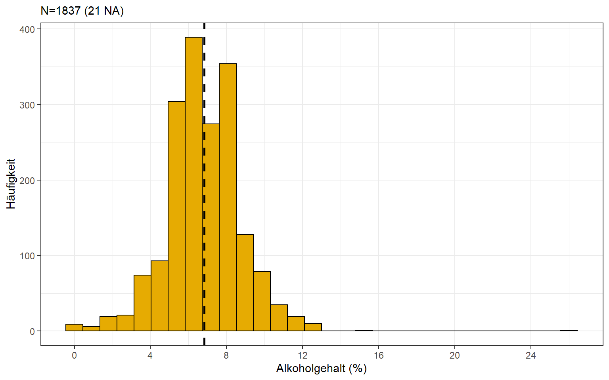
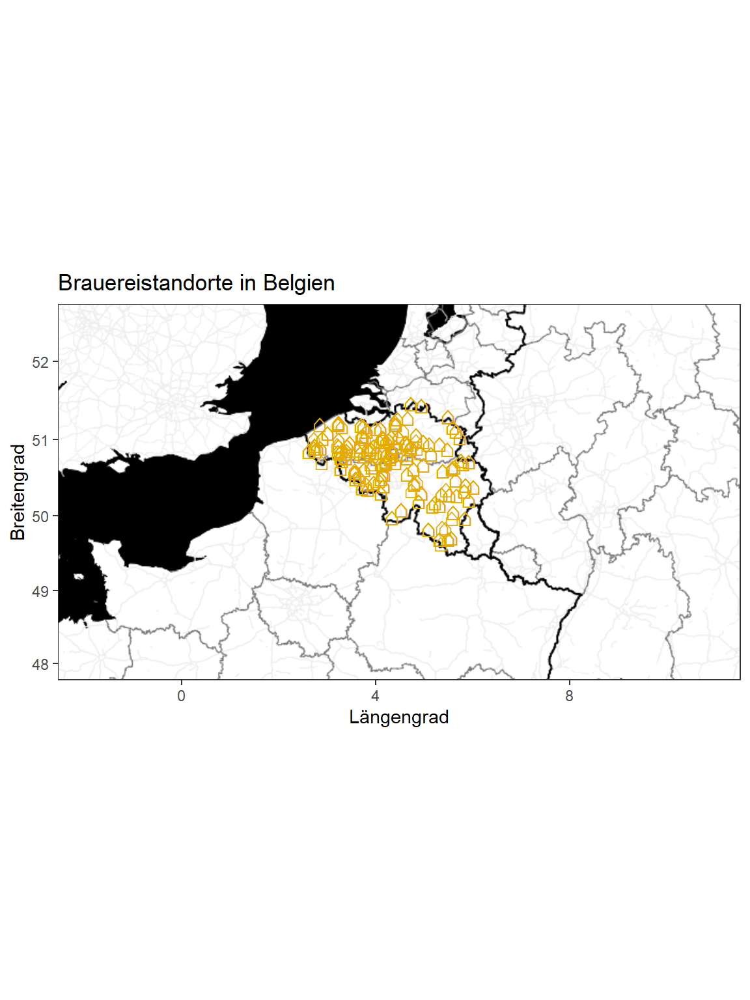

<script src="index_files/libs/kePrint-0.0.1/kePrint.js"></script>


Beck's, Krombacher, Warsteiner und Bitburger. In Deutschland dominieren große Brauereien das Angebot in Supermärkten und Gaststätten. In den letzten Jahren entstanden aber auch mehr und mehr kleine (Craftbier)-Brauereien und bieten eine Vielzahl interessanter Sorten neben dem guten alten Pils an. Bis ich hier auf den Geschmack gekommen bin, hat es eine ganze Weile gedauert. Alles fing mit einem Aufenthalt in der belgischen Hauptstadt anfang des Jahres an. Die Belgier und Belgierinnen brauen Bier? Wusste ich gar nicht. Aber hier gab es in jeder Bar eine Bierauswahl im Format einer Restaurant-Speisekarte. Wow! Welches soll man probieren? Was verbirgt sich hinter den Sorten Saison, Dubbel und Tripel? Gut, dass ich damals jemanden vor Ort hatte, der mich etwas in die Szene einführen konnte. Später habe ich mich gefragt:

-   Wie viele Brauereien gibt es in Belgien?
-   Welche Sorten werden am häufigsten gebraut?
-   Wie hoch ist der durchschnittliche Alkoholgehalt?
-   Wie sieht es in Deutschland aus?

## **Datenbeschaffung**

Im französischen Wikipedia gibt es eine eine umfangreiche tabellarische Auflistung belgischer Biersorten, welche ich zunächst mit der Funktion `htmltab()` extrahiert habe.

``` r
bier_liste <- list()
for (i in 2:28) {
  bier_liste[[i]] <- htmltab(
    doc = "https://fr.wikipedia.org/wiki/Liste_des_bi%C3%A8res_belges", 
    which = i, colNames = c("name","sorte","alkoholgehalt", "brauerei"), 
    encoding = "UTF-8"
    )
  }
```

## **Datenaufbereitung**

Die Daten werden dann in einen *Data Frame* umgewandelt und beinhalten den Namen des Bieres, die Sorte, den Alkoholgehalt sowie die Brauerei. Die gewonnen Daten werden dann bereinigt und formatiert. Fertig ist der *Bier-Datensatz* für eine Analyse.

``` r
# Liste in Dataframe umwandeln
bier_df <- do.call("rbind", bier_liste)

# Spalten encoden
bier_df <- mutate_if(bier_df, is.character, 
                     .funs = function(x){return(`Encoding<-`(x, "UTF-8"))}
                     )

# Alkoholgehalt bereinigen und formatieren
bier_df$alkoholgehalt <- bier_df$alkoholgehalt %>%
  str_remove("%") %>%
  str_replace("\\?", "") %>%
  str_replace(",","\\.") %>%
  str_remove("[a-z]") %>%
  str_trim() %>%
  as.numeric(.)
```

Es gibt eine Vielzahl von `Sorten` und teilweise sind diese nicht ganz eindeutig voneinander abgrenzbar. Ich versuche daher aus den vorhanden Einträgen eine grobe Klassifizierung im Merkmal `Stil` abzuleiten. Bspw. fasse ich die Ausprägungen `abbaye` und `Abbey` zu `Abtei-Bier` zusammen. Ebenso verfahre ich mit `brune` und `noire` und erstelle die Kategorie `Dunkelbier`. Hierzu verwende ich die Funktion `str_detect()` aus dem R-Paket `stringr`. Kommen unterschiedliche Typen für das gleiche Bier vor, so erfolgt die Klassifizierung entlang der programmierten Reihenfolge.

``` r
bier_df$sorte <- str_to_lower(bier_df$sorte)
bier_df %>%
  mutate(stil = case_when(
    str_detect(sorte, "india pale ale|ipa") ~ "Indian Pale Ale",
    str_detect(sorte, "fermentation haute") ~ "Obergäriges Bier",
    str_detect(sorte, "fermentation basse") ~ "Untergäriges Bier",
    str_detect(sorte, "stout") ~ "Stout",
    str_detect(sorte, "ambrée") ~ "Amberbier",
    str_detect(sorte, "pils") ~ "Pils",
    str_detect(sorte, "blanche") ~ "Weißbier",
    str_detect(sorte, "trappiste") ~ "Trappistenbier",
    str_detect(sorte, "abbaye|Abbey") ~ "Abteibier",
    str_detect(sorte, "triple|quadruple") ~ "Belgisches Starkbier",
    str_detect(sorte, "saison|faro|lambic|gueuze") ~ "Sauerbier/Fruchtbier",
    str_detect(sorte, "kriek|fruitée|bière au miel|panaché") ~ "Sauerbier/Fruchtbier",
    str_detect(sorte, "brune|noire|double|rouge|porter") ~ "Dunkelbier",
    str_detect(sorte, "blonde|ale|lager") ~ "Helles",
    str_detect(sorte, "spéciale|noël|christmas") ~ "Spezialbier",
    str_detect(sorte, "bière de table") ~ "Dünnbier",
    TRUE ~ "Sonstige Biere")
    ) -> bier_df
```

Unten findet man einen Ausschnitt des Datensatzes.

<div style="border: 1px solid #ddd; padding: 0px; overflow-y: scroll; height:300px; overflow-x: scroll; width:100%; ">

| name                          | sorte                    | alkoholgehalt | brauerei                                            | stil             |
|:------------------------------|:-------------------------|--------------:|:----------------------------------------------------|:-----------------|
| La 44 Brune                   | fermentation haute brune |           5.5 | Brasserie de la Gleize                              | Obergäriges Bier |
| Abbaye de Saint-Martin Blonde | abbaye                   |           7.0 | Brasserie de Brunehaut                              | Abteibier        |
| Achel 8 Bruin                 | trappiste, brune         |           8.0 | Abbaye d\'Achel                                     | Trappistenbier   |
| Alvinne Lex\'ke               | blonde                   |           6.3 | Brasserie Alvinne                                   | Helles           |
| Ardenne Stout                 | stout                    |           8.0 | Brasserie de Bastogne                               | Stout            |
| L\'Attrait Impérial           | india pale ale           |           8.3 | Brasserie L\'Attrait                                | Indian Pale Ale  |
| Belgoo Arboo                  | triple, ambrée           |           8.1 | Brasserie La Binchoise pour la Brasserie Belgoobeer | Amberbier        |

</div>

## **Datenanalyse**

Zuerst betrachte ich die Verteilung des Alkoholgehalts der Biere. Für 21 Biere waren auf Wikipedia keine Angaben hinterlegt (`NA`). Der durchschnittliche Alkoholgehalt der belgischen Biere liegt bei 6,8%. Ganz schön stark!

``` r
# Histogramm erstellen
ggplot(bier_df, aes(x = alkoholgehalt)) + 
  geom_histogram(color = "black", fill = "#E6AB02") +
  geom_vline(aes(xintercept = mean(alkoholgehalt, na.rm = TRUE)),
             color = "black", linetype = "dashed", size = 1) +
  scale_x_continuous(breaks = c(0, 4, 8, 12, 16, 20, 24, 28)) +
  labs(subtitle = paste(
         "N=",dim(bier_df)[1]," (",sum(is.na(bier_df$alkoholgehalt))," NA)", sep = ""
         ),
       x = "Alkoholgehalt (%)", 
       y = "Häufigkeit")
```



------------------------------------------------------------------------

Unten findet sich eine Häufigkeitstabelle mit dem Merkmal `Stil`. Pro Ausprägung hae ich zusätzlich den durchschnittlichen Alkoholgehalt berechnet. Bei 39 Bieren fehlt die Angabe zur `Sorte` und 83 Biere wurden in die Restkategorie einsortiert. Für diese kann man möglicherweise noch einige Unterkategorien bilden oder einer bestehenden (passenden) Kategorie zuordnen. Betrachtet man den durchschnittlichen Alkoholgehalt pro Biersorte, so scheint die Klassifikation ziemlich stimmig zu sein. Je dunkler/heller das Bier desto höher/niedriger der Alkoholgehalt. Auch die belgischen Starkbiere (Tripel, Quadrupel) haben neben dem Stout den höchsten Alkoholgehalt.

<div style="border: 1px solid #ddd; padding: 0px; overflow-y: scroll; height:300px; overflow-x: scroll; width:100%; ">

| stil                 | alkoholgehalt_mean |   n |
|:---------------------|-------------------:|----:|
| Stout                |               8.97 |  39 |
| Belgisches Starkbier |               8.56 | 134 |
| Trappistenbier       |               8.24 |  16 |
| Spezialbier          |               8.18 |  25 |
| Indian Pale Ale      |               7.64 |  29 |
| Abteibier            |               7.55 | 104 |
| Dunkelbier           |               7.43 | 180 |
| Obergäriges Bier     |               7.40 | 438 |
| Amberbier            |               7.15 |  97 |
| Helles               |               6.70 | 257 |
| Sonstige Biere       |               6.05 |  83 |
| Sauerbier/Fruchtbier |               5.18 | 260 |
| Weißbier             |               5.17 |  80 |
| Pils                 |               4.96 |  56 |
| Untergäriges Bier    |               4.88 |  20 |
| Dünnbier             |               1.89 |  19 |

</div>

------------------------------------------------------------------------

Zuletzt wird der Name der Brauerei genutzt, um eine Karte von Belgien zu erstellen und dort alle Brauereistandorte einzuzeichnen. Die Adressangabe wird dabei mit der Google Geocoding API in Koordinaten umgewandelt. Es gibt 369 verschiedene Brauereien im Datensatz sowie 10 Biersorten ohne Angabe zur Braustätte. Für 98 Brauereien konnten keine Koordinaten gefunden werden.

``` r
# Extrahierte Koordinaten verknüpfen
karte_df <- left_join(bier_df, brauerei_koordinaten, by = "brauerei")

# Basiskarte Belgien
Get_Map_Country <- get_map(location = "Belgium", zoom = 6, maptype = "stamen_toner_background", 
                           filename = "ggmapTemp", color = "bw", source = "stadia")

karte_belgien <- ggmap(ggmap = Get_Map_Country)

karte_belgien + 
  geom_point(data=karte_df, aes(x =longitude, y=latitude), 
             shape = "\u2302" ,size = 5, color = "#E6AB02") +
  labs(title = "Brauereistandorte in Belgien", 
       x = "Längengrad", 
       y = "Breitengrad") +
  scale_y_continuous(limits = c(48,52.5))
```


