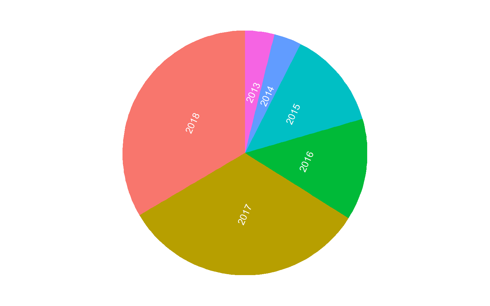
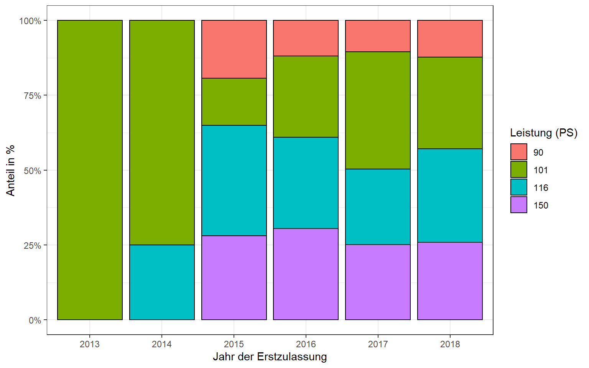
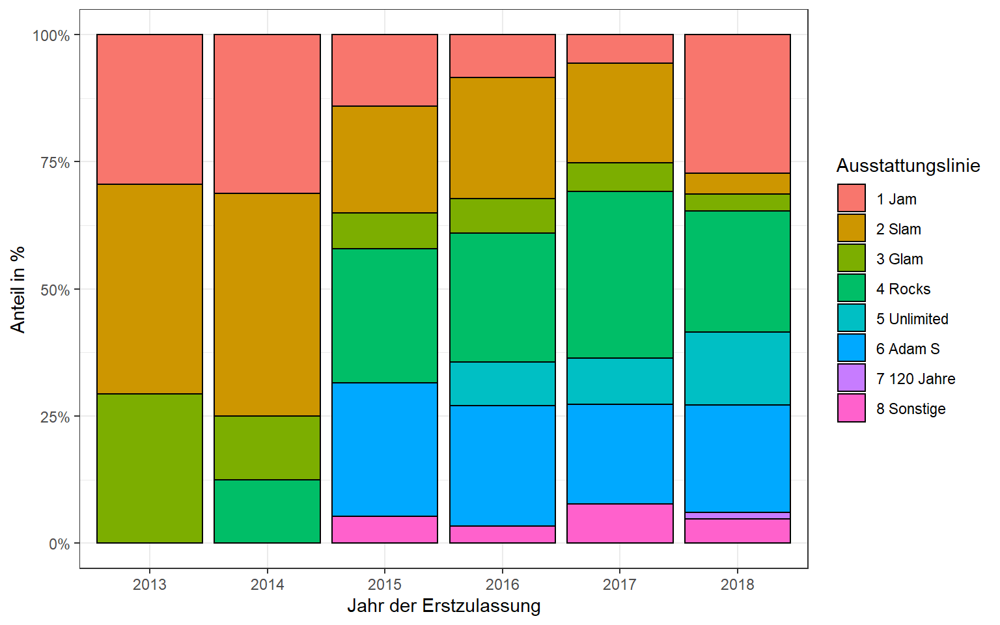
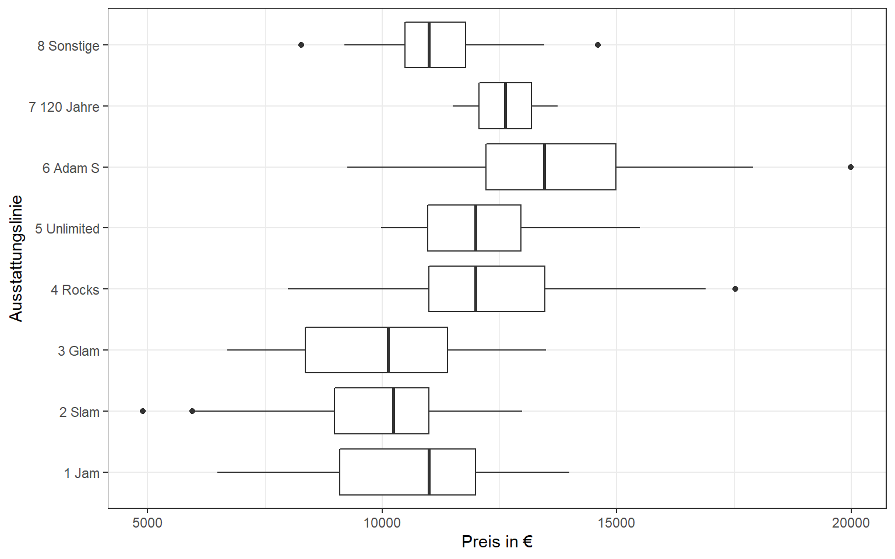
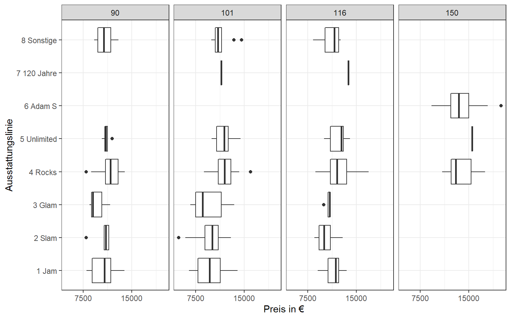
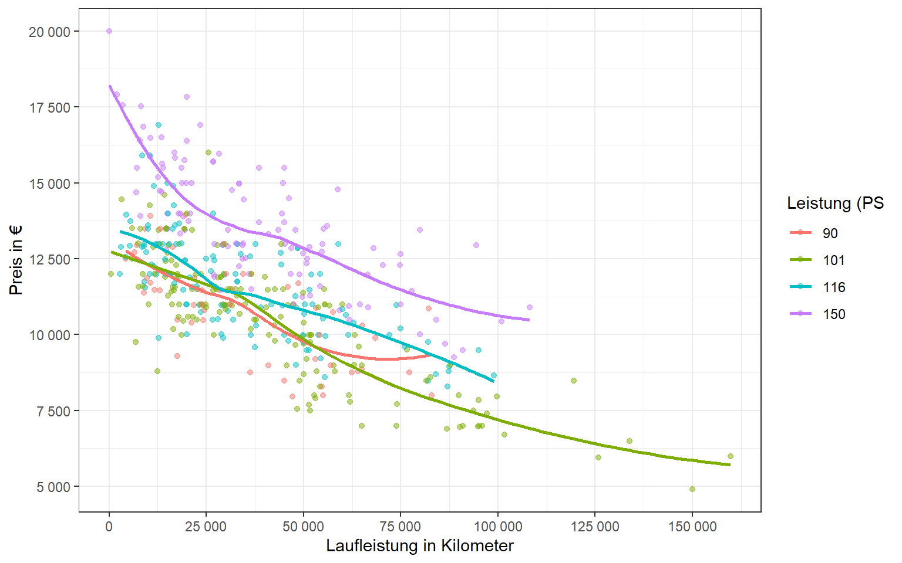
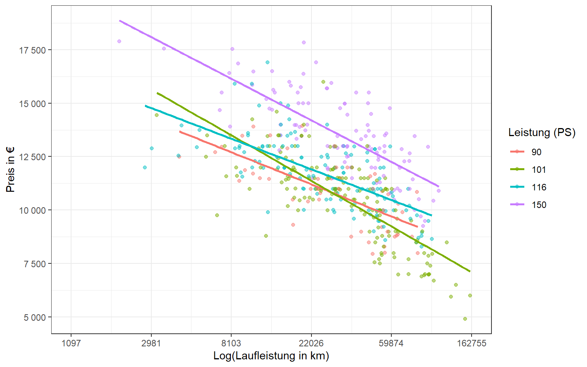
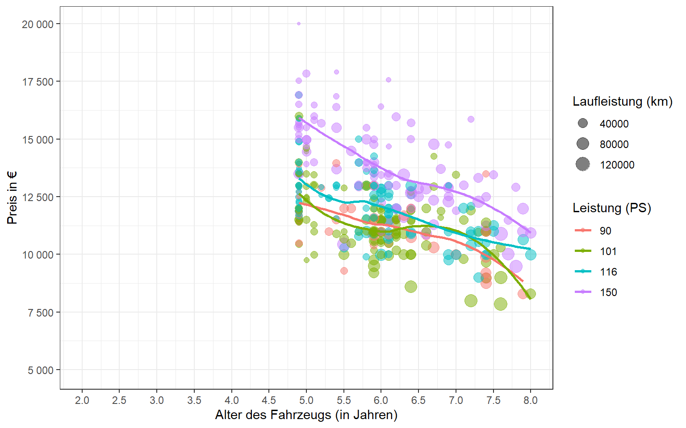
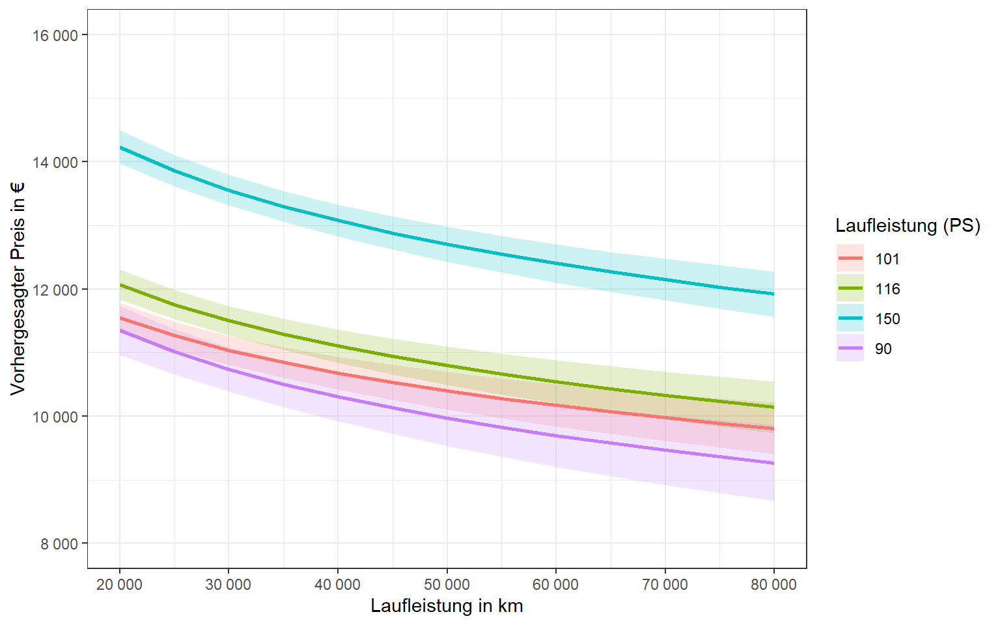
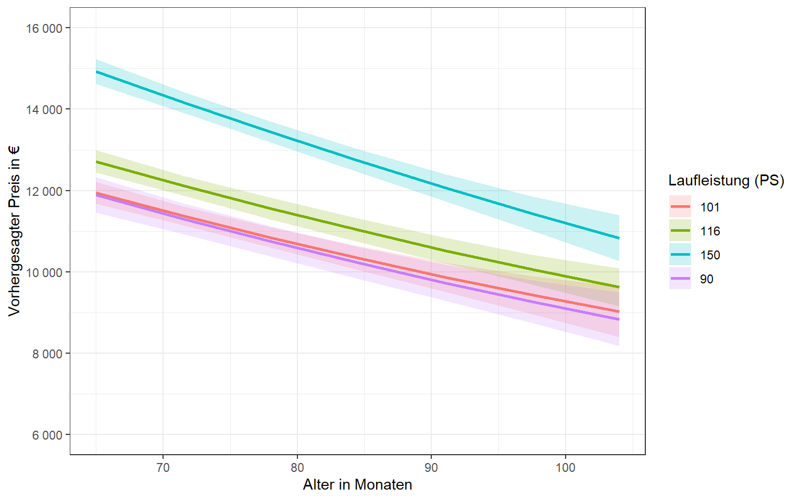

<script src="index_files/libs/kePrint-0.0.1/kePrint.js"></script>


Das Internet bringt uns im Großen und Ganzen eine ganze Menge Erleichterungen. Nahezu alles kann man sich online bestellen oder, bei größeren Anschaffungen, zumindest schon mal von zu Hause aus in aller Ruhe begutachten. Da unser Auto über die Weihnachtsfeiertage zum wiederholten Male gestreikt hat, haben wir uns entschieden, dass ein neues (gebrauchtes) Auto angeschafft werden muss. Die beiden größten Internetportale für die Automobilsuche [autoscout24.de](https://www.autoscout24.de/) und [mobile.de](https://www.mobile.de/) haben sehr detaillierte Suchmasken, sodass man sich das gewünschte Auto ziemlich genau *konfigurieren* kann.

Doch genau hier beginnt auch ein Problem. Selbst wenn man sich auf einen Hersteller und ein Modell festgelegt hat, wird die Suche aufgrund der Vielzahl von Anzeigen schnell unübersichtlich. Zwar bieten die beiden Portale auch eine *unabhängige* Preisbewertung der Inserate an, also ob das Auto relativ zu vergleichbaren Inseraten im Segment eher teuer oder günstig ist, jedoch werden dabei viele Faktoren nicht berücksicht. Auf Bagatellschäden wird in der Anzeige meistens nicht hingewiesen und die Nachfrage nach der Unfallfreiheit des PKW, sofern diese nicht explizit im Inserat bestätigt ist, ergibt häufig eine negative Antwort bei vermeintlich besonders günstigen Angeboten. Auch ist selten erkennbar, ob der PKW privat oder gewerblich genutzt wurde. Ein neuer Anbieter names [Autohero](https://www.autohero.com/de/), bei dem man sich den Gebrauchtwagen direkt nach Hause liefern lassen kann, ist hier transparenter und führt zumindest die Eigenschaft *Gewerbliche Nutzung* auf.

Insgesamt erscheint mir als Laie der Gebrauchtwagenmarkt ziemlich schwer zu durchblicken. Für ein bestimmtes Modell eines Herstellers gibt es oft zahlreiche Ausstattungsvarianten, die einen objektiven Vergleich ziemlich erschweren. Am besten man informiert sich hier bereits vorab anhand von [ADAC Testberichten](https://www.adac.de/rund-ums-fahrzeug/tests/) oder Ähnlichem, um herauszufinden, was man eigentlich braucht. Aber es heisst ja auch nicht umsonst Ge*braucht*wagen. Doch nun weiter zur Datenanalyse.

## **Datenbeschaffung**

Die Suchergebnisseiten der oben erwähnten Gebrauchtwagenportale bieten eine gut strukturierte Oberfläche, um mittels *Webscraping* automatisiert die Eckdaten eines Inserats zu extrahieren. Dies funktioniert (Stand Februar 2021) bei mir nur auf der Webseite von *autoscout24.de*. Generell sind die Suchergebnisse auf den beiden Webseiten sehr ähnlich und insbesondere Händler schalten ihre Inserate meist auf beiden Portalen.

Unten findet sich eine Funktion, mit welcher ich die relevanten Inseratsinformationen von einer Seite der Suchergebnisse gewinne. Ich extrahiere den `preis`, den Inseratstitel, welcher aus zwei Elementen (`titel1`, `titel2`) besteht, die Laufleistung (`km`), das Datum der Erstzulassung (`ez`), die Anzahl der bisherigen Fahrzeughalter (`halter`), die Motorleistung (`ps`) und den Standort des Gebrauchtwagens (`ort`). Jedes Element wird dabei so aufbereitet, dass es für datenanalytische Zwecke sinnvoll verwendet werden kann. Die Funktion gibt zum Schluss einen *Data Frame* mit 8 Spalten zurück, der in der Regeln 20 Zeilen lang ist. Eine Suchseite auf autoscout24.de umfasst nämlich genau 20 Inserate.

``` r
library(tidyverse)
library(rvest)

scraper_autoscout24 <- function(page){
  
  preis <- page %>%
    html_nodes(".sc-font-xl") %>%
    html_text() %>%
    str_match_all("€ *.*") %>%
    unlist() %>%
    str_remove_all("\\.|,-|€") %>%
    as.numeric() %>%
    `length<-` (20) %>%
    as_tibble_col("preis")
  
  titel1 <- page %>%
    html_nodes("#cldt-ot-summary .sc-font-bold") %>%
    html_text() %>%
    `length<-` (20) %>%
    as_tibble_col("titel1")
  
  titel2 <- page %>%
    html_nodes(".cldt-summary-version") %>%
    html_text() %>%
    `length<-` (20) %>%
    as_tibble_col("titel2") %>%
    mutate(id = 1:20)
  
  km <- page %>%
    html_nodes("li:nth-child(1)") %>%
    html_text() %>%
    str_match_all("[0-9].+ km") %>%
    unlist() %>%
    str_remove_all("\\.| km") %>%
    as.numeric() %>%
    `length<-` (20) %>%
    as_tibble_col("km")
  
  ez <- page %>%
    html_nodes("li:nth-child(2)") %>%
    html_text() %>%
    str_match_all(".*[0-9]/[0-9]*|.*Erstzulassung") %>%
    unlist() %>%
    str_remove_all("-/- \\(Erstzulassung") %>%
    `length<-` (20) %>%
    as_tibble_col("ez") %>%
    separate(col = ez, into = c("monat", "jahr"), sep = "/", remove = FALSE)
  
  halter <- page %>%
    html_nodes("li:nth-child(5)") %>%
    html_text() %>% 
    str_match_all(".*Fahrzeughalter") %>%
    unlist() %>%
    str_remove_all(" Fahrzeughalter|-/- \\(Fahrzeughalter") %>%
    as.numeric() %>%
    `length<-` (20) %>%
    as_tibble_col("halter")
  
  ps <- page %>%
    html_nodes("li:nth-child(3)") %>%
    html_text() %>% 
    str_match_all(".[0-9]* PS") %>%
    unlist() %>%
    str_remove_all(" PS|\\(") %>%
    as.numeric() %>%
    `length<-` (20) %>%
    as_tibble_col("ps")
  
  ort <- page %>%
    html_nodes(".cldf-summary-seller-contact-zip-city") %>%
    html_text() %>%
    `length<-` (20) %>%
    as_tibble_col("ort") %>%
    separate(col = ort, into = c("plz", "stadt"), sep = " ", remove = FALSE)
  
  scraped_data <- tibble(
    titel1, titel2, 
    preis, km, ez, 
    halter, ps, ort
  )
  
  return(scraped_data)
  
}
```

Nun habe ich die Qual der Wahl und muss meine Suche für ein bestimmtes Auto spezifizieren. Wir haben uns vorab für einen Opel Adam entschieden und für meine Auswertung verwende ich die folgenden Spezifikationen:

-   Erstzulassung zwischen Anfang 2013 und Ende 2018
-   keine Beschränkung der Laufleistung (km)
-   ab 90 PS (Benziner)
-   maximal 2 Fahrzeughalter
-   scheckheftgepflegt
-   keine Privatangebote

Am 09.02.2021 wurden dabei 439 Inserate gefunden. Die Webseite autoscout24.de begrenzt die Anzahl abrufbarer Suchseiten automatisch auf 20 (= 400 Inserate). D.h. wenn mehr Inserate gefunden werden, kann man diese sich weder manuell anzeigen lassen noch automatisiert abrufen. Dies kann umgangen werden, indem man die Angebote nach ihrem Preis filtert. D.h. wenn ich die Suchergebnisse aufsteigend nach dem Preis sortiere und die ersten 400 Inserate extrahiere, kann ich nach dem letzten Inserat auf Seite 20 (Inserat 400) den Preis als Mindestpreis für die nächste Suche festlegen und erhalte so die verbleibenden Inserate.

Technisch muss man zunächst eine leere Liste (`pages`) erstellen, in welcher für jede Seite der Suchergebnisse der Webseiteninhalt, ausgelesen mit der Funktion `read_html()`, gespeichert wird. Die for-Schleife läuft dann von Seite 1 bis maximal Seite 20. Der Link der Webseite wird am URL-Bestandteil `page=` geteilt. Danach verwende ich die Funktion `map_dfr()` aus dem R-Paket `purrr` und wende die oben codierte Funktion auf jedes Listenelement von `pages` an. Fertig ist ein Datensatz mit Gebrauchtwageninseraten!

``` r
# Seiten
pages <- list()

# Suchseiten 1:X
for (i in 1:20) {
  
  url <- paste0("https://www.autoscout24.de/lst/opel/adam?sort=price&desc=0&custtype=D&prevownersid=2&eq=49&fuel=B&ustate=N%2CU&size=20&page="
                ,i,
                "&powerfrom=66&powertype=hp&cy=D&fregto=2018&fregfrom=2013&atype=C&fc=25&qry=&") 
  pages[[i]] <- read_html(url)
}

# Mappen und NA entfernen
inserate <- map_dfr(.x = pages, .f = ~scraper_autoscout24(page = .x)) %>%
  filter(ez != "") 
```

Die Daten sehen so aus:

<br>

<div style="border: 1px solid #ddd; padding: 0px; overflow-y: scroll; height:300px; overflow-x: scroll; width:100%; ">

| titel1    | titel2                                             |  id | preis |     km | ez      | monat | jahr | halter |  ps | ort                           | plz   | stadt                   |
|:----------|:---------------------------------------------------|----:|------:|-------:|:--------|:------|:-----|-------:|----:|:------------------------------|:------|:------------------------|
| Opel Adam | 1,4 SLAM ecoFLEX S/S Panorama                      |   1 |  4900 | 150000 | 07/2013 | 07    | 2013 |      1 | 101 | 71679 Asperg                  | 71679 | Asperg                  |
| Opel Adam | Slam ecoFlex                                       |   2 |  5950 | 125897 | 07/2013 | 07    | 2013 |      2 | 101 | 84088 Neufahrn                | 84088 | Neufahrn                |
| Opel Adam | 1.4 Slam \*101PS\*TEILLEDER\*SOUNDSYSTEM\*1.HD\*   |   3 |  5990 | 159750 | 04/2014 | 04    | 2014 |      1 | 101 | 31275 Lehrte                  | 31275 | Lehrte                  |
| Opel Adam | 1.4 Jam\*2Hd\*Panorama\*Garantie\*SH\*LH\*Eu5\*TOP |   4 |  6490 | 133900 | 04/2013 | 04    | 2013 |      2 | 101 | 67549 Worms                   | 67549 | Worms                   |
| Opel Adam | Glam~Lradhzg~Parkaut~Klimaaut.~Sihzg~Tempom        |   5 |  6699 | 101700 | 03/2014 | 03    | 2014 |      1 | 101 | 07629 Hermsdorf               | 07629 | Hermsdorf               |
| Opel Adam | GLAM 1.4 SHZ/PANO/UNFALLFREI!                      |   6 |  6890 |  86934 | 05/2013 | 05    | 2013 |      2 | 101 | 99310 Arnstadt                | 99310 | Arnstadt                |
| Opel Adam | 1.4 Jam Panoramadach+Scheckheft+Sitzheizung        |   7 |  6950 |  90154 | 11/2014 | 11    | 2014 |      2 | 101 | 41063 Mönchengladbach         | 41063 | Mönchengladbach         |
| Opel Adam | Glam Panoramadach Sitzheizung PDC                  |   8 |  6980 |  94900 | 06/2013 | 06    | 2013 |      2 | 101 | 91522 Ansbach                 | 91522 | Ansbach                 |
| Opel Adam | Glam ecoFlex \*Panorama/Lenkradheizung\*           |   9 |  6990 |  65000 | 05/2013 | 05    | 2013 |      2 | 101 | 45881 Gelsenkirchen           | 45881 | Gelsenkirchen           |
| Opel Adam | Slam ecoFlex                                       |  10 |  6990 |  95200 | 03/2015 | 03    | 2015 |      2 | 101 | 93104 Sünching                | 93104 | Sünching                |
| Opel Adam | Slam 1,4 ecoFlex 1.Hand \*Panoramadach\*           |  11 |  6999 |  96000 | 04/2013 | 04    | 2013 |      1 | 101 | 55252 Mainz-Kastel            | 55252 | Mainz-Kastel            |
| Opel Adam | Slam ecoFlex Sportpaket NAVI~SHZ~KLIMA~USB         |  12 |  6999 |  91000 | 10/2013 | 10    | 2013 |      1 | 101 | 70173 Stuttgart               | 70173 | Stuttgart               |
| Opel Adam | 1.4 Slam,Alu 17Zoll,Sportfahrwerk,Top Zustand      |  13 |  6999 |  73900 | 11/2013 | 11    | 2013 |      1 | 101 | 94469 Deggendorf              | 94469 | Deggendorf              |
| Opel Adam | 1.4 Jam 8 fach Bereift                             |  14 |  7400 |  97144 | 09/2014 | 09    | 2014 |      1 | 101 | 31234 Edemissen / Abbensen    | 31234 | Edemissen               |
| Opel Adam | 1.4 Glam                                           |  15 |  7500 |  51667 | 07/2013 | 07    | 2013 |      1 | 101 | 01723 Wilsdruff               | 01723 | Wilsdruff               |
| Opel Adam | Jam\'2.Hand\'93.602KM\'Klima\'8-fach\'             |  16 |  7500 |  93602 | 08/2013 | 08    | 2013 |      2 | 101 | 45772 Marl                    | 45772 | Marl                    |
| Opel Adam | 1.4 Glam \*Pano\*Tempo\*IntelliLink\*PDC\*Klima\*  |  17 |  7560 |  48357 | 07/2015 | 07    | 2015 |      1 | 101 | 65936 Frankfurt am Main       | 65936 | Frankfurt               |
| Opel Adam | Jam                                                |  18 |  7690 |  51400 | 05/2013 | 05    | 2013 |      2 | 101 | 42327 Wuppertal               | 42327 | Wuppertal               |
| Opel Adam | 1.4 Jam 1.Hand unfallfrei 17\'\'LM Bluetooth AUX   |  19 |  7700 |  74000 | 04/2013 | 04    | 2013 |      1 | 101 | 61350 Bad Homburg             | 61350 | Bad                     |
| Opel Adam | 1.4 Jam IntelliLink/Klimaauto./SHZ/LHZ/PDC         |  20 |  7790 |  62000 | 12/2014 | 12    | 2014 |      1 | 101 | 91154 Roth                    | 91154 | Roth                    |
| Opel Adam | Slam ecoFlex                                       |   1 |  7850 |  95007 | 03/2016 | 03    | 2016 |      2 | 101 | 84088 Neufahrn                | 84088 | Neufahrn                |
| Opel Adam | Jam                                                |   2 |  7900 |  53000 | 04/2014 | 04    | 2014 |      1 | 101 | 74743 Seckach-Großeicholzheim | 74743 | Seckach-Großeicholzheim |
| Opel Adam | Slam ( Schnäppchen / unbedingt lesen )             |   3 |  7950 |  47200 | 04/2015 | 04    | 2015 |      2 |  90 | 26655 Westerstede             | 26655 | Westerstede             |
| Opel Adam | 1.4 Slam / DAB / SHZ / PDC / NAVI / SPORT          |   4 |  7950 |  99720 | 10/2013 | 10    | 2013 |      2 | 101 | 84032 Altdorf                 | 84032 | Altdorf                 |
| Opel Adam | Rocks ecoFlex S +Schiebdach+Alufelgen              |   5 |  7990 |  82900 | 06/2015 | 06    | 2015 |      2 |  90 | 88499 Riedlingen              | 88499 | Riedlingen              |
| Opel Adam | 1.4 Glam Pano PDC Lenkradh. Sportsitze App         |   6 |  7990 |  61625 | 01/2014 | 01    | 2014 |      2 | 101 | 36251 Bad Hersfeld            | 36251 | Bad                     |
| Opel Adam | Jam ecoFlex\*Klima\*Leder\*PDC\*SHZ\*SternLED\*    |   7 |  7990 |  52725 | 04/2013 | 04    | 2013 |      2 | 101 | 63165 Mühlheim / Main         | 63165 | Mühlheim                |
| Opel Adam | Jam                                                |   8 |  7990 |  89900 | 08/2016 | 08    | 2016 |      2 | 101 | 38302 Wolfenbüttel            | 38302 | Wolfenbüttel            |
| Opel Adam | ADAM JAM ECOFLEX \"BILDHÜBSCH UND NEUWERTIG\"      |   9 |  7999 |  55000 | 04/2015 | 04    | 2015 |      1 |  90 | 55129 Mainz                   | 55129 | Mainz                   |
| Opel Adam | 1.0 Start/Stop - Sondermodell                      |  10 |  8280 |  86985 | 03/2015 | 03    | 2015 |      1 | 116 | 78315 Radolfzell-Böhringen    | 78315 | Radolfzell-Böhringen    |

</div>

## **Datenaufbereitung**

Die Daten sind zwar durch die Scraping-Funktion schon relativ sauber, allerdings möchte ich noch einige zusätzliche Merkmale für die folgende Analyse erstellen. Zunächst nutze ich das Merkmal `ez` (Datum der Erstzulassung), um das Alter des Gebrauchtwagens in Tagen/Monaten/Jahren zu berechnen. Hierzu verwende ich die Funktionen `today()` und `mdy()` aus dem R-Paket `lubridate`. Vom Opel Adam gibt es (leider) eine Vielzahl von Ausstattungsvarianten, die sich in unterschiedlichster Form auf den Preis niederschlagen könnten. Um dies in der Analyse berücksichtigen zu können, erstelle ich das Merkmal `linie`, welches durch Textabgleich mit `titel2` erstellt wird. Hierbei suche ich den Inseratstitel nach den Ausstattungsvarianten ab (Slam, Jam, Glam, usw.). Bei einigen Inseraten lässt der Titel keine eindeutige Zuweisung einer Ausstattungsvariante zu, sodass ich eine Restkategorie (`"8 Sonstige"`) erstellen musste.

``` r
library(lubridate)

cars <- inserate %>%
  mutate(alter_d = today() - mdy(ez),
         alter_m = round(as.numeric(alter_d)/30, digits = 0),
         alter_y = round(as.numeric(alter_d)/365, digits = 1),
         titel2 = tolower(titel2),
         linie = case_when(
           str_detect(titel2, "jam") == TRUE ~ "1 Jam",
           str_detect(titel2, "slam") == TRUE ~ "2 Slam",
           str_detect(titel2, "glam") == TRUE ~ "3 Glam",
           str_detect(titel2, "rocks|open air") == TRUE ~ "4 Rocks",
           str_detect(titel2, "unlimited") == TRUE ~ "5 Unlimited",
           str_detect(titel2, "s 1.4|1.4 turbo s") == TRUE & ps == 150 ~ "6 Adam S",
           str_detect(titel2, "s") == TRUE & ps == 150 ~ "6 Adam S",
           str_detect(titel2, "120") == TRUE ~ "7 120 Jahre",
           TRUE ~ "8 Sonstige"))
```

Die Standortangabe des Gebrauchtwagens (PLZ und Stadt) nutze ich, um das Inserat einem Bundesland zuzuordnen. Dafür verwende ich einen Schlüssel aus dem Internet und verknüpfe die beiden Dateien.

``` r
plz_data<- readr::read_delim("data/plz_zuordnung.csv", delim = ";",
                              locale = locale(encoding = "latin1")) %>%
  mutate(plz = ifelse(nchar(plz) == 4, paste0("0", plz),plz))

cars <- left_join(cars, plz_data, by = "plz")
```

Die Daten sehen nun so aus und sind bereit für die Auswertung.

<br>

<div style="border: 1px solid #ddd; padding: 0px; overflow-y: scroll; height:300px; overflow-x: scroll; width:100%; ">

| titel1    | titel2                                             |  id | preis |     km | ez      | monat | jahr | halter |  ps | ort                           | plz   | stadt                   | alter_d   | alter_m | alter_y | linie      | bundesland          | kreis                            | typ   |
|:----------|:---------------------------------------------------|----:|------:|-------:|:--------|:------|:-----|-------:|----:|:------------------------------|:------|:------------------------|:----------|--------:|--------:|:-----------|:--------------------|:---------------------------------|:------|
| Opel Adam | 1,4 slam ecoflex s/s panorama                      |   1 |  4900 | 150000 | 07/2013 | 07    | 2013 |      1 | 101 | 71679 Asperg                  | 71679 | Asperg                  | 3753 days |     125 |    10.3 | 2 Slam     | Baden-Württemberg   | Ludwigsburg                      | Kreis |
| Opel Adam | slam ecoflex                                       |   2 |  5950 | 125897 | 07/2013 | 07    | 2013 |      2 | 101 | 84088 Neufahrn                | 84088 | Neufahrn                | 3753 days |     125 |    10.3 | 2 Slam     | Bayern              | Landshut                         | Kreis |
| Opel Adam | 1.4 slam \*101ps\*teilleder\*soundsystem\*1.hd\*   |   3 |  5990 | 159750 | 04/2014 | 04    | 2014 |      1 | 101 | 31275 Lehrte                  | 31275 | Lehrte                  | 3479 days |     116 |     9.5 | 2 Slam     | Niedersachsen       | Hannover                         | Kreis |
| Opel Adam | 1.4 jam\*2hd\*panorama\*garantie\*sh\*lh\*eu5\*top |   4 |  6490 | 133900 | 04/2013 | 04    | 2013 |      2 | 101 | 67549 Worms                   | 67549 | Worms                   | 3844 days |     128 |    10.5 | 1 Jam      | Rheinland-Pfalz     | Worms                            | Stadt |
| Opel Adam | glam~lradhzg~parkaut~klimaaut.~sihzg~tempom        |   5 |  6699 | 101700 | 03/2014 | 03    | 2014 |      1 | 101 | 07629 Hermsdorf               | 07629 | Hermsdorf               | 3510 days |     117 |     9.6 | 3 Glam     | Thüringen           | Saale-Holzland-Kreis             | Kreis |
| Opel Adam | glam 1.4 shz/pano/unfallfrei!                      |   6 |  6890 |  86934 | 05/2013 | 05    | 2013 |      2 | 101 | 99310 Arnstadt                | 99310 | Arnstadt                | 3814 days |     127 |    10.4 | 3 Glam     | Thüringen           | Ilm-Kreis                        | Kreis |
| Opel Adam | 1.4 jam panoramadach+scheckheft+sitzheizung        |   7 |  6950 |  90154 | 11/2014 | 11    | 2014 |      2 | 101 | 41063 Mönchengladbach         | 41063 | Mönchengladbach         | 3265 days |     109 |     8.9 | 1 Jam      | Nordrhein-Westfalen | Mönchengladbach                  | Stadt |
| Opel Adam | glam panoramadach sitzheizung pdc                  |   8 |  6980 |  94900 | 06/2013 | 06    | 2013 |      2 | 101 | 91522 Ansbach                 | 91522 | Ansbach                 | 3783 days |     126 |    10.4 | 3 Glam     | Bayern              | Ansbach                          | Stadt |
| Opel Adam | glam ecoflex \*panorama/lenkradheizung\*           |   9 |  6990 |  65000 | 05/2013 | 05    | 2013 |      2 | 101 | 45881 Gelsenkirchen           | 45881 | Gelsenkirchen           | 3814 days |     127 |    10.4 | 3 Glam     | Nordrhein-Westfalen | Gelsenkirchen                    | Stadt |
| Opel Adam | slam ecoflex                                       |  10 |  6990 |  95200 | 03/2015 | 03    | 2015 |      2 | 101 | 93104 Sünching                | 93104 | Sünching                | 3145 days |     105 |     8.6 | 2 Slam     | Bayern              | Regensburg                       | Kreis |
| Opel Adam | slam 1,4 ecoflex 1.hand \*panoramadach\*           |  11 |  6999 |  96000 | 04/2013 | 04    | 2013 |      1 | 101 | 55252 Mainz-Kastel            | 55252 | Mainz-Kastel            | 3844 days |     128 |    10.5 | 2 Slam     | Hessen              | Wiesbaden                        | Stadt |
| Opel Adam | slam ecoflex sportpaket navi~shz~klima~usb         |  12 |  6999 |  91000 | 10/2013 | 10    | 2013 |      1 | 101 | 70173 Stuttgart               | 70173 | Stuttgart               | 3661 days |     122 |    10.0 | 2 Slam     | Baden-Württemberg   | Stuttgart                        | Stadt |
| Opel Adam | 1.4 slam,alu 17zoll,sportfahrwerk,top zustand      |  13 |  6999 |  73900 | 11/2013 | 11    | 2013 |      1 | 101 | 94469 Deggendorf              | 94469 | Deggendorf              | 3630 days |     121 |     9.9 | 2 Slam     | Bayern              | Deggendorf                       | Kreis |
| Opel Adam | 1.4 jam 8 fach bereift                             |  14 |  7400 |  97144 | 09/2014 | 09    | 2014 |      1 | 101 | 31234 Edemissen / Abbensen    | 31234 | Edemissen               | 3326 days |     111 |     9.1 | 1 Jam      | Niedersachsen       | Peine                            | Kreis |
| Opel Adam | 1.4 glam                                           |  15 |  7500 |  51667 | 07/2013 | 07    | 2013 |      1 | 101 | 01723 Wilsdruff               | 01723 | Wilsdruff               | 3753 days |     125 |    10.3 | 3 Glam     | Sachsen             | Sächsische Schweiz-Osterzgebirge | Kreis |
| Opel Adam | jam\'2.hand\'93.602km\'klima\'8-fach\'             |  16 |  7500 |  93602 | 08/2013 | 08    | 2013 |      2 | 101 | 45772 Marl                    | 45772 | Marl                    | 3722 days |     124 |    10.2 | 1 Jam      | Nordrhein-Westfalen | Recklinghausen                   | Kreis |
| Opel Adam | 1.4 glam \*pano\*tempo\*intellilink\*pdc\*klima\*  |  17 |  7560 |  48357 | 07/2015 | 07    | 2015 |      1 | 101 | 65936 Frankfurt am Main       | 65936 | Frankfurt               | 3023 days |     101 |     8.3 | 3 Glam     | Hessen              | Frankfurt am Main                | Stadt |
| Opel Adam | jam                                                |  18 |  7690 |  51400 | 05/2013 | 05    | 2013 |      2 | 101 | 42327 Wuppertal               | 42327 | Wuppertal               | 3814 days |     127 |    10.4 | 1 Jam      | Nordrhein-Westfalen | Wuppertal                        | Stadt |
| Opel Adam | 1.4 jam 1.hand unfallfrei 17\'\'lm bluetooth aux   |  19 |  7700 |  74000 | 04/2013 | 04    | 2013 |      1 | 101 | 61350 Bad Homburg             | 61350 | Bad                     | 3844 days |     128 |    10.5 | 1 Jam      | Hessen              | Hochtaunuskreis                  | Kreis |
| Opel Adam | 1.4 jam intellilink/klimaauto./shz/lhz/pdc         |  20 |  7790 |  62000 | 12/2014 | 12    | 2014 |      1 | 101 | 91154 Roth                    | 91154 | Roth                    | 3235 days |     108 |     8.9 | 1 Jam      | Bayern              | Roth                             | Kreis |
| Opel Adam | slam ecoflex                                       |   1 |  7850 |  95007 | 03/2016 | 03    | 2016 |      2 | 101 | 84088 Neufahrn                | 84088 | Neufahrn                | 2779 days |      93 |     7.6 | 2 Slam     | Bayern              | Landshut                         | Kreis |
| Opel Adam | jam                                                |   2 |  7900 |  53000 | 04/2014 | 04    | 2014 |      1 | 101 | 74743 Seckach-Großeicholzheim | 74743 | Seckach-Großeicholzheim | 3479 days |     116 |     9.5 | 1 Jam      | Baden-Württemberg   | Neckar-Odenwald-Kreis            | Kreis |
| Opel Adam | slam ( schnäppchen / unbedingt lesen )             |   3 |  7950 |  47200 | 04/2015 | 04    | 2015 |      2 |  90 | 26655 Westerstede             | 26655 | Westerstede             | 3114 days |     104 |     8.5 | 2 Slam     | Niedersachsen       | Ammerland                        | Kreis |
| Opel Adam | 1.4 slam / dab / shz / pdc / navi / sport          |   4 |  7950 |  99720 | 10/2013 | 10    | 2013 |      2 | 101 | 84032 Altdorf                 | 84032 | Altdorf                 | 3661 days |     122 |    10.0 | 2 Slam     | Bayern              | Landshut                         | Kreis |
| Opel Adam | rocks ecoflex s +schiebdach+alufelgen              |   5 |  7990 |  82900 | 06/2015 | 06    | 2015 |      2 |  90 | 88499 Riedlingen              | 88499 | Riedlingen              | 3053 days |     102 |     8.4 | 4 Rocks    | Baden-Württemberg   | Alb-Donau-Kreis                  | Kreis |
| Opel Adam | 1.4 glam pano pdc lenkradh. sportsitze app         |   6 |  7990 |  61625 | 01/2014 | 01    | 2014 |      2 | 101 | 36251 Bad Hersfeld            | 36251 | Bad                     | 3569 days |     119 |     9.8 | 3 Glam     | Hessen              | Hersfeld-Rotenburg               | Kreis |
| Opel Adam | jam ecoflex\*klima\*leder\*pdc\*shz\*sternled\*    |   7 |  7990 |  52725 | 04/2013 | 04    | 2013 |      2 | 101 | 63165 Mühlheim / Main         | 63165 | Mühlheim                | 3844 days |     128 |    10.5 | 1 Jam      | Hessen              | Offenbach                        | Kreis |
| Opel Adam | jam                                                |   8 |  7990 |  89900 | 08/2016 | 08    | 2016 |      2 | 101 | 38302 Wolfenbüttel            | 38302 | Wolfenbüttel            | 2626 days |      88 |     7.2 | 1 Jam      | Niedersachsen       | Wolfenbüttel                     | Kreis |
| Opel Adam | adam jam ecoflex \"bildhübsch und neuwertig\"      |   9 |  7999 |  55000 | 04/2015 | 04    | 2015 |      1 |  90 | 55129 Mainz                   | 55129 | Mainz                   | 3114 days |     104 |     8.5 | 1 Jam      | Rheinland-Pfalz     | Mainz                            | Stadt |
| Opel Adam | 1.0 start/stop - sondermodell                      |  10 |  8280 |  86985 | 03/2015 | 03    | 2015 |      1 | 116 | 78315 Radolfzell-Böhringen    | 78315 | Radolfzell-Böhringen    | 3145 days |     105 |     8.6 | 8 Sonstige | Baden-Württemberg   | Konstanz                         | Kreis |

</div>

## **Datenanalyse**

Im Folgenden zeige ich einige Eckwerte des Datensatzes. Über die Hälfte der Inserate stammen aus dem Jahr 2017 und 2018. Immerhin ein Viertel stammt aus den Jahren 2015 und 2016. Für die Jahre 2013 und 2014 ist die Datenlage eher dürftig - hier gibt es insgesamt nur 33 Inserate.

``` r
cars %>%
  group_by(jahr) %>%
  summarise(n = n()) %>%
  mutate(freq = n / sum(n) * 100) %>%
  mutate(ypos = cumsum(freq)- 0.5*freq ) %>%
  ggplot(data = .,
      aes(x= "", y = freq, fill = forcats::fct_rev(jahr))) +
  geom_col(width = 1)  + 
  coord_polar(theta = "y", start = 0) +
  geom_text(aes(y = ypos, label = jahr), color = "white", size = 4, angle = 65) +
  theme_void() +
  theme(legend.position="none")
```



------------------------------------------------------------------------

Im Balkendiagramm unten sieht man, dass bei den Inserate mit einer Erstzulassung in den Jahren 2013 und 2014 nicht alle Motorvarianten des Opel Adam vorliegen. In den folgenden Jahren sind die Anteile relativ ausgeglichen, wodurch ich mich bei der späteren Analyse wohl auf diese 4 Jahre beschränken muss.

``` r
ggplot(data = cars,
      aes(x= factor(jahr), fill=factor(ps))) +
  geom_bar(position = "fill", color = "black") +
  scale_y_continuous(labels = scales::percent) +
  labs(x = "Jahr der Erstzulassung", 
       y = "Anteil in %",
       fill = "Leistung (PS)")
```



------------------------------------------------------------------------

Auch bei den Ausstattungslinien gibt es für die Erstzulassungen in 2013 und 2014 nicht alle Varianten. In den folgenden Jahren ist das Verhältnis wieder einigermaßen ausgeglichen, wobei gemessen an der Anzahl verfügbarer Inserate, die absoluten Fallzahlen pro Kategorie relativ niedrig sein werden.

``` r
ggplot(data = cars,
      aes(x= factor(jahr), fill=factor(linie))) +
  geom_bar(position = "fill", color = "black") +
  scale_y_continuous(labels = scales::percent) +
  labs(x = "Jahr der Erstzulassung", 
       y = "Anteil in %",
       fill = "Ausstattungslinie")
```



------------------------------------------------------------------------

Die Boxplots zeigen die Verteilung des Verkaufspreises nach dem Jahr der Erstzulassung und der Leistung der Inserate. Der Opel Adam mit 150 PS weist ab EZ 2015 den höchsten Median-Preis auf. Bei der Variante mit 116 PS Variante liegt der Median Preis für EZ in 2018 und 2017 über den beiden Modellen mit dem kleineren Motor. Für Modelle mit EZ 2016 ist der Median-Preis zur 101 PS Variante nahezu identisch. Die Motorausführungen mit 90 PS und 101 PS unterscheiden sich preislich nur für Inserate mit EZ 2016.

``` r
ggplot(data = cars,
       aes(x = factor(jahr), y = preis, fill = factor(ps))) +
  geom_boxplot() +
  scale_y_continuous(breaks = seq(2500,20000,2500),
                     labels = scales::number_format()) +
  labs(x = "Jahr der Erstzulassung", 
       y = "Preis in Euro", 
       fill = "Leistung (PS)")
```


------------------------------------------------------------------------

Hinsichtlich der Ausstattungsvarianten gibt es ebenfalls preisliche Unterschiede. Allerdings muss berücksichtigt werden, dass manche Ausstattungslinien wie der *Adam S* stellvertretend für die Motorvariante mit 150 PS stehen und nicht für die anderen Motorvarianten verfügbar sind. Die Linie *120 Jahre* scheint es laut den Daten nur für die Motorisierung mit 101 PS und 116 PS zu geben.

``` r
ggplot(data = cars,
       aes(x=factor(linie), y =preis)) +
  geom_boxplot() +
  coord_flip() +
  labs(x = "Ausstattungslinie", y = "Preis in €")
```



Berücksichtigt man die Motorisierung, sind die preislichen Unterschiede zwischen den Ausstattungslinien deutlich geringer.

``` r
ggplot(data = cars,
       aes(x=factor(linie), y =preis)) +
  geom_boxplot() +
  coord_flip() +
  facet_grid(.~ps) +
  scale_y_continuous(breaks = c(7500, 15000)) +
  labs(x = "Ausstattungslinie", y = "Preis in €")
```



------------------------------------------------------------------------

In der nächsten Grafik ist der Zusammenhang zwischen dem Verkaufspreis und der Laufleistung in Kilometern dargstellt. Die 150 PS und 116 PS Motorvarianten weisen in den ersten 25.000 Kilometern den stärksten Wertverfall auf. Die 101 PS Motorvariante ist in diesem Intervall wertstabiler, wobei nach 25.000 Kilometern der Preis stärker sinkt.

``` r
ggplot(data = cars,
       aes(x=km, y =preis, col = factor(ps))) +
  geom_point(alpha = 0.5) +
  geom_smooth(method = "loess",se = FALSE) +
  scale_x_continuous(breaks = seq(0,175000,25000),labels = scales::number_format()) +
  scale_y_continuous(breaks = seq(2500,20000,2500),labels = scales::number_format()) +
  labs(x = "Laufleistung in Kilometer",
       y = "Preis in €",
       col = "Leistung (PS")
```



------------------------------------------------------------------------

Da die Laufleistung der Fahrzeuge deutlich rechtsschief verteilt ist, erstelle ich die Grafik erneut mit der logarithmierten Laufleistung und entferne aus Gründen der Übersichtlickeit zwei Inserate mit einer Laufleistung von unter 1000 Kilometern. In dieser Darstellung wirkt sich jeder zusätzlich gefahrene Kilometer besonders negativ auf den Verkaufspreis der 150 PS und 101 PS Variante aus.

``` r
cars %>%
  filter(km > 1000) %>%
ggplot(data = .,
         aes(x=log(km), y =preis, col = factor(ps))) +
  geom_point(alpha = 0.5) +
  geom_smooth(method = "lm",se = F) +
  scale_x_continuous(limits = c(7,12),
                     breaks=c(7:12), 
                     labels=c(round(exp(7:12)))) +
  scale_y_continuous(breaks = seq(2500,20000,2500),labels = scales::number_format()) +
  labs(x = "Log(Laufleistung in km)",
       y = "Preis in €",
       col = "Leistung (PS)")
```



------------------------------------------------------------------------

Die vorherigen beiden Grafiken berücksichtigen die Laufleistung, jedoch nicht das Alter der Gebrauchtwagen. Unten ist daher der Zusammenhang von Verkaufspreis und dem Alter des Gebrauchtwagen in Monaten abgebildet. Je größer ein Punkt im Steudiagramm ist, um so höher die Laufleistung des Autos. Auch das Alter wirkt sich negativ auf den Verkaufspreis aus und man erkennt ähnliche Muster wie in der vorherigen Darstellung.

``` r
ggplot(data = cars,
         aes(x=alter_y, y =preis, col = factor(ps))) +
  geom_point(aes(size = km), alpha = 0.5) +
  geom_smooth(se = F) +
  scale_x_continuous(limits = c(2, 8), breaks = c(seq(2, 8, 0.5))) +
  scale_y_continuous(breaks = seq(2500,20000,2500),labels = scales::number_format()) +
  labs(x = "Alter des Fahrzeugs (in Jahren)",
       y = "Preis in €",
       col = "Leistung (PS)", size = "Laufleistung (km)")
```



------------------------------------------------------------------------

Num zum spannenden Teil dieses Artikels: mittels linearer Regression (OLS) möchte den Einfluss verschiedener Charakteristiken des Autos auf seinen Verkaufspreis schätzen. Bspw. um herauszufinden, welche der 4 Motorvarianten den stärksten Wertverlust mit steigendem Alter und stegender Laufleistung aufweist. Ich beschränke diese Analyse auf Modelle mit Erstzulassungen in den Jahren 2015 bis 2018.

**Basis Modell**: Als Regressoren verwende ich die Laufleistung pro 10.000 gefahrene Kilometer, sowie das Jahr der Erstzulassung und die Motorvariante als Kontrollvariablen.

``` r
model1 <- lm(preis ~  I(km/10000) + factor(jahr) + factor(ps), 
            data = cars, subset = jahr %in% c(2015:2018))
```

    ## # A tibble: 8 x 5
    ##   term             estimate std.error statistic   p.value
    ##   <chr>               <dbl>     <dbl>     <dbl>     <dbl>
    ## 1 (Intercept)       10885.      277.     39.2   7.94e-139
    ## 2 I(km/10000)        -360.       32.4   -11.1   4.10e- 25
    ## 3 factor(jahr)2016    800.      211.      3.80  1.70e-  4
    ## 4 factor(jahr)2017   1388.      194.      7.15  4.29e- 12
    ## 5 factor(jahr)2018   2003.      219.      9.14  3.33e- 18
    ## 6 factor(ps)101        60.1     185.      0.324 7.46e-  1
    ## 7 factor(ps)116       743.      185.      4.02  7.06e-  5
    ## 8 factor(ps)150      2797.      189.     14.8   7.41e- 40

Der Koeffizient von `I(km/10000)` zeigt, dass der Verkaufspreis pro 10.000 gefahrene Kilometer im Durchschnitt um 360 Euro sinkt. Die Koeffizienten der Faktorvariablen Jahr der Erstzulassung geben an, dass relativ zum Basisjahr 2015, Modelle zugelassen in 2016, 2017, 2018 im Durchschnitt einen 800, 1388, 2000 Euro höheren Verkaufspreis aufweisen (unabhängig von der Motorvariante). Der Preisunterschied der Motorvariante 101 PS im Vergleich zur Basis 90 PS liegt bei nur durchschnittlich 60 Euro. Der Preisunterschied bzgl. der 116 PS und 150 PS Variante fällt höher aus - im Durchschnitt 743 bzw. 2797 Euro.

------------------------------------------------------------------------

**Erweitertes Modell**: Nun füge ich weitere Merkmale wie die Anzahl der Fahrzeughalter, die Ausstattungslinie und den Standort des Wagen (Bundesland) als Kontrollvariablen hinzu.

``` r
model2 <- lm(preis ~ I(km/10000) + factor(jahr) + factor(ps) + 
               factor(halter) + factor(linie) + factor(bundesland), 
            data = cars, subset = jahr %in% c(2015:2018))
```

    ## # A tibble: 30 x 5
    ##    term                estimate std.error statistic   p.value
    ##    <chr>                  <dbl>     <dbl>     <dbl>     <dbl>
    ##  1 (Intercept)         10204.       284.    36.0    1.09e-123
    ##  2 I(km/10000)          -367.        29.4  -12.5    3.76e- 30
    ##  3 factor(jahr)2016      733.       191.     3.85   1.39e-  4
    ##  4 factor(jahr)2017     1263.       176.     7.19   3.53e- 12
    ##  5 factor(jahr)2018     2033.       198.    10.3    5.60e- 22
    ##  6 factor(ps)101          -2.30     171.    -0.0135 9.89e-  1
    ##  7 factor(ps)116         649.       166.     3.91   1.08e-  4
    ##  8 factor(ps)150        2088.       274.     7.62   2.15e- 13
    ##  9 factor(halter)2      -335.       106.    -3.15   1.76e-  3
    ## 10 factor(linie)2 Slam  1054.       196.     5.38   1.31e-  7
    ## # ... with 20 more rows

Der Einfluss der Laufleistung auf den Verkaufspreis hat sich nur geringfügig verändert - von 360 auf 367 Euro Wertverlust pro 10.000 gefahrene Kilometer. Der Einfluss dieser zusätzlichen Kontrollvariablen scheint also nur von geringer Bedeutung zu sein.

------------------------------------------------------------------------

**Interaktions-Modell 1**:

Nicht untersucht wurde bisher, ob der Einfluss der Laufleistung auf den Verkaufspreis von der Motorvariante abhängt. Dies ist eine sog. Interkation der beiden Regressoren, Ich logarithmiere zudem nun die Laufleistung. Um die Schätzergebnisse zu veranschaulichen verwende ich einen Conditional Effects Plot (CEP).

``` r
model_cep1 <- lm(preis ~ log(km/10000)*factor(ps), 
                 data = cars, subset = jahr %in% c(2015:2018))
```

    ## # A tibble: 8 x 5
    ##   term                        estimate std.error statistic   p.value
    ##   <chr>                          <dbl>     <dbl>     <dbl>     <dbl>
    ## 1 (Intercept)                  12391.       306.   40.5    3.53e-143
    ## 2 log(km/10000)                -1503.       240.   -6.27   9.25e- 10
    ## 3 factor(ps)101                   24.1      358.    0.0675 9.46e-  1
    ## 4 factor(ps)116                  638.       355.    1.80   7.28e-  2
    ## 5 factor(ps)150                 2997.       359.    8.35   1.16e- 15
    ## 6 log(km/10000):factor(ps)101    251.       284.    0.884  3.77e-  1
    ## 7 log(km/10000):factor(ps)116    115.       282.    0.407  6.84e-  1
    ## 8 log(km/10000):factor(ps)150   -162.       274.   -0.592  5.54e-  1

Unten findet man den CEP für dieses Modell.

``` r
tibble(
  km = rep(seq(from = 20000, to = 80000, by = 5000), 4),
  ps = factor(rep(c("90", "101","116","150"), each = 13))
  ) %>%
  mutate(fit = predict(model_cep1, 
                       newdata = ., 
                       type = "response"),
         se = predict(model_cep1, 
                      newdata = ., 
                      type = "response",
                      se = TRUE)$se.fit,
         ll = fit - (1.96 * se),
         ul = fit + (1.96 * se)) %>%
  ggplot(data = ., 
         aes(x = km, y = fit)) + 
  geom_ribbon(aes(ymin = ll,
                  ymax = ul, fill = ps), alpha = 0.2) + 
  geom_line(aes(colour = ps),
            size = 1) +
  scale_x_continuous(limits = c(20000,80000),
                     breaks = seq(20000,80000,10000), labels =scales::number_format()) +
  scale_y_continuous(limits = c(8000,16000),
                     breaks = seq(8000,16000,2000),labels = scales::number_format()) +
  labs(x = "Laufleistung in km",
       y = "Vorhergesagter Preis in €", 
       fill = "Laufleistung (PS)", col = "Laufleistung (PS)")
```



Die Koeffizienten der Interaktionsterme und der CEP zeigen, dass es nur geringe, aber signifikante Unterschiede zwischen dem Einfluss der Laufleistung auf den Verkaufspreis in Abhängigkeit der Motorvariante gibt. Verdoppelt man die Laufleistung, so ist der Verkaufspreis für die 101 PS Variante höher als bei der 90 PS oder 150 PS Variante. Die 116 PS Variante liegt ebenfalls hinter der 101 PS Variante zurück, schlägt aber ebenso die 90 PS oder 150 PS Variante.

------------------------------------------------------------------------

**Interaktions-Modell 2**:

Für das nächste Modell interagiere ich analog zum vorherigen Modell das Alter des PKWs in Monaten und die Motorvariante. Zusätzlich nehme ich als Regressor das quadrierte Alter auf, um zu überprüfen, ob sich der Wertverfall mit steigendem Alter des Gebrauchtwagens beschleunigt oder nicht.

``` r
model_cep2 <- lm(preis ~ alter_m*factor(ps) + I(alter_m^2),
                data = cars, subset = jahr %in% c(2015:2018))
```

    ## # A tibble: 9 x 5
    ##   term                   estimate std.error statistic  p.value
    ##   <chr>                     <dbl>     <dbl>     <dbl>    <dbl>
    ## 1 (Intercept)           19483.     2212.       8.81   4.00e-17
    ## 2 alter_m                -141.       53.1     -2.65   8.47e- 3
    ## 3 factor(ps)101          -189.     1093.      -0.173  8.63e- 1
    ## 4 factor(ps)116           876.     1035.       0.846  3.98e- 1
    ## 5 factor(ps)150          4769.     1103.       4.32   1.94e- 5
    ## 6 I(alter_m^2)              0.368     0.319    1.15   2.51e- 1
    ## 7 alter_m:factor(ps)101     3.62     14.0      0.258  7.96e- 1
    ## 8 alter_m:factor(ps)116    -0.861    13.0     -0.0660 9.47e- 1
    ## 9 alter_m:factor(ps)150   -26.7      13.9     -1.92   5.60e- 2

Der Koeffizient des Alters ist negativ und der Koeffizient des quadrierten Alters ist positiv. Somit ist der Wertverfall des PKW in den ersten Jahren besonders hoch und wird mit zunehmendem Alter geringer. Dies erkennt man auch im CEP anhand den abflachenden Kurven. Für die 150 PS Variante ist der Wertverfall über das Alter hinweg erneut am höchsten - relativ zu den anderen 3 Motorvarianten.

``` r
tibble(
  alter_m = rep(seq(from = min(cars$alter_m)+6, to = max(cars$alter_m)-24, length.out = 7), 4),
  ps = factor(rep(c("90", "101","116","150"), each = 7))
  ) %>%
  mutate(fit = predict(model_cep2, 
                       newdata = ., 
                       type = "response"),
         se = predict(model_cep2, 
                      newdata = ., 
                      type = "response",
                      se = TRUE)$se.fit,
         ll = fit - (1.96 * se),
         ul = fit + (1.96 * se)) %>%
  ggplot(data = ., 
         aes(x = alter_m, y = fit)) + 
  geom_ribbon(aes(ymin = ll,
                  ymax = ul, fill = ps), alpha = 0.2) + 
  geom_line(aes(colour = ps),
            size = 1)  +
  scale_y_continuous(limits = c(6000,16000),
                     breaks = seq(6000,16000,2000),labels = scales::number_format()) +
  labs(x = "Alter in Monaten",
       y = "Vorhergesagter Preis in €", 
       fill = "Laufleistung (PS)", col = "Laufleistung (PS)")
```



------------------------------------------------------------------------

**Vorhersage:**

Zum Schluss möchte ich für ein gegebenes Baujahr und Modell die zukünftige Verkaufspreisentwicklung vorhersagen. Ich habe einen Opel Adam mit 116 PS, erstmalig zugelassen im September 2017 und einer Laufleistung von aktuell 33.000 Kilometern in die engere Auswahl genommen. Ich möchte das Auto nun 4 Jahre lang halten und im Jahr etwa 14.000 Kilometer fahren. Das zukünftige Alter des Autos (in Monaten) ergibt sich somit aus dem aktuellen Alter und den 4 von mir genutzten Jahren (*41 + 48 = 89*). Die zukünftige Laufleistung ergibt sich aus dem aktuellen Kilometerstand und den in 4 Jahren von mir gefahrenen Kilometern (*33.000 + 56.000 = 89.000*).

``` r
model_vorhersage <- lm(preis ~ alter_m + I(alter_m^2) + log(km),
                       data = cars, subset = ps == 116)

vorhersagen <- tibble(
  alter_m = c(41, 89),
  km = c(33000, 89000)
  ) %>%
  mutate(fit = predict(model_vorhersage, 
                       newdata = ., 
                       type = "response"),
         se = predict(model_vorhersage, 
                      newdata = ., 
                      type = "response",
                      se = TRUE)$se.fit,
         ll = fit - (1.96 * se),
         ul = fit + (1.96 * se))
```

Unten findet man die Ergebnisse des Modells. Der aktuelle Verkaufspreis liegt bei durchschnittlich 11.812 Euro, wobei hier die Ausstattungslinie keine Berücksichtigung findet. In 4 Jahren und 56.000 gefahrenen Kilometern würde laut dem Modell der durchschnittliche Verkaufspreis noch bei 8275 Euro liegen. Dies entspricht einem durchschnittlichen Wertverlust von rund 884 Euro pro Jahr.

<br>

<div style="border: 1px solid #ddd; padding: 5px; overflow-x: scroll; width:100%; ">

| alter_m |    km |      fit |       se |       ll |       ul |
|--------:|------:|---------:|---------:|---------:|---------:|
|      41 | 33000 | 13825.23 | 876.6929 | 12106.91 | 15543.54 |
|      89 | 89000 | 10391.43 | 198.1450 | 10003.06 | 10779.79 |

</div>
