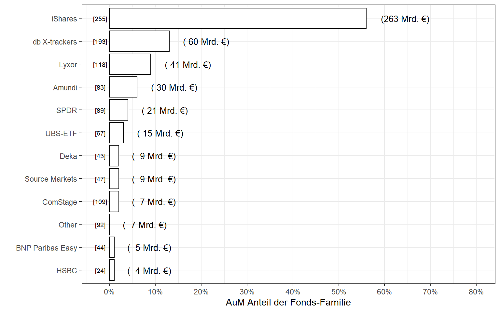
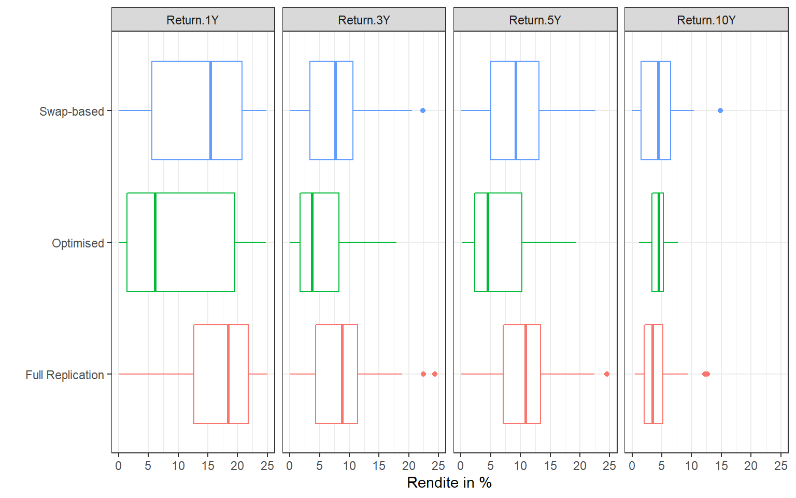
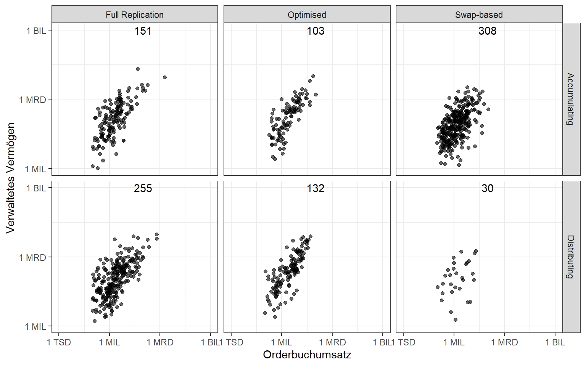
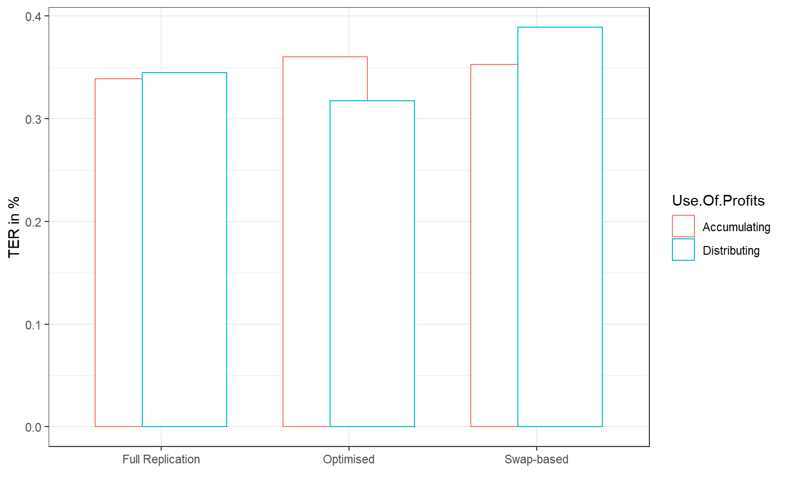
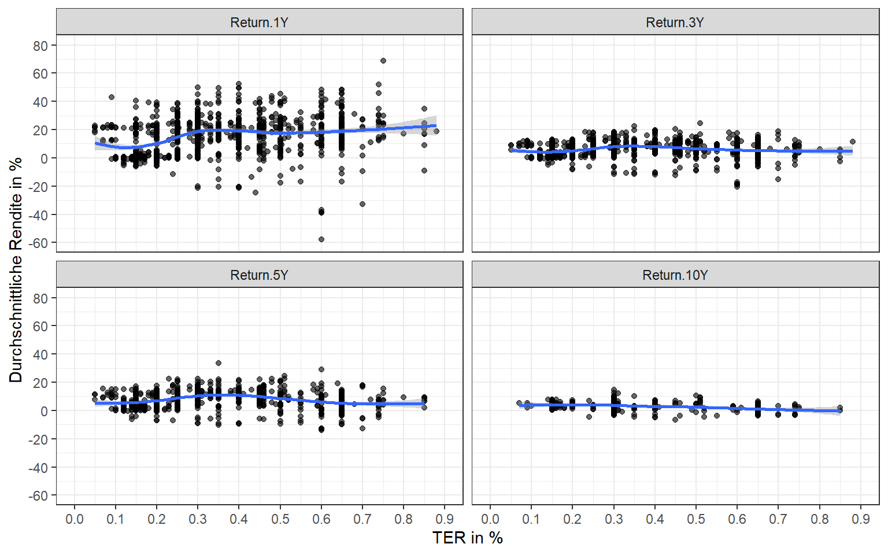
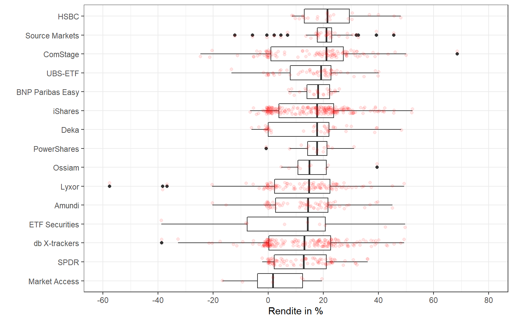

<script src="index_files/libs/kePrint-0.0.1/kePrint.js"></script>
<script src="index_files/libs/htmlwidgets-1.5.1/htmlwidgets.js"></script>
<script src="index_files/libs/plotly-binding-4.9.2.1/plotly.js"></script>
<script src="index_files/libs/typedarray-0.1/typedarray.min.js"></script>
<script src="index_files/libs/jquery-1.11.3/jquery.min.js"></script>
<link href="index_files/libs/crosstalk-1.1.0.1/css/crosstalk.css" rel="stylesheet" />
<script src="index_files/libs/crosstalk-1.1.0.1/js/crosstalk.min.js"></script>
<link href="index_files/libs/plotly-htmlwidgets-css-1.52.2/plotly-htmlwidgets.css" rel="stylesheet" />
<script src="index_files/libs/plotly-main-1.52.2/plotly-latest.min.js"></script>


In Zeiten von Niedrigzinspolitik werden [börsengehandelte Fonds](https://de.wikipedia.org/wiki/B%C3%B6rsengehandelter_Fonds) (ETFs) schon länger als Anlagemöglichkeit für die Sparerin vorgeschlagen. Am Markt gibt es mittlerweile eine hohe Anzahl Fonds mit verschiedensten Anlageausrichtungen und Marktabdeckungen. Auch von [Finanzratgebern](https://www.finanztip.de/indexfonds-etf/) werden ETFs gegenüber aktiv gemanagten Fonds und Aktien dem Kleinanleger empfohlen - besonders aufgrund der niedrigen laufenden Kosten. Wie so oft gibt es gegenüber diesem Finanzinstrument allerdings auch begründete [Vorbehalte](https://www.zeit.de/2017/38/etfs-indexfonds-aktien-finanzmarkt-banken-geldanlage).

Wie gestaltet sich aktuell der Markt für ETFs? Welche Anbieter sind besonders dominant? Und wie unterscheidet sich die Performance von ETFs, wenn nur noch ein Algorithmus über die Anlagestrategie entscheidet?

## **Datenbeschaffung**

Zunächst habe ich mir einen Überblick über die aktuell angebotenen ETFs verschafft. Die Deutsche Börse bietet über den Handelsplatz [XETRA](https://www.xetra.com/xetra-en/instruments/instruments) hierzu eine Excel-Tabelle an (Stand: September 2017). Ich habe aus diesem Dokument alle ETFs entnommen und in ein separates .CSV Dokument kopiert, die Spaltennamen leicht verändert und dann in RStudio eingelesen. Die `ISIN` ist der zentrale Identifikator für jeden ETF. XETRA bietet allerdings nur allgemeine Informationen über die ETFs, wie bspw. den Anbieter (`Family`), die Total Expense Ratio (`TER`) oder die Assests under Management (`AuM`). Nach einiger Recherche bin ich auf die Webseite der Direktbank ING-DiBa gestoßen, welche eine umfangreiche [Analyseplattform](https://wertpapiere.ing.de/Investieren/Fonds/Analyse/IE0008470928) für ETFs anbietet. Für jede `ISIN` der XETRA-Liste habe ich dann mit dem R-Paket `rvest` von dieser Webseite Finanzkennzahlen wie Rendite, den maximalen Verlust und die Sharpe Ratio für unterschiedliche Zeiträume extrahiert.

## **Datenaufbereitung**

Die beiden Datenbestände werden dann anhand der `ISIN` miteinander verknüpft. Anschließend bereinige ich noch die Ausprägungen des Merkmals `Use of Profits`.

``` r
library(tidyverse)

etf_data <-
  etf_data %>%
  mutate(Use.Of.Profits = ifelse(
    Use.Of.Profits == "Distribution",
    "Distributing",
    Use.Of.Profits)
    )  
```

Es gibt insgesamt 1.164 ETFs in meinem Datensatz. Unten befindet sich ein Ausschnitt der Daten.

<div style="border: 1px solid #ddd; padding: 0px; overflow-y: scroll; height:300px; overflow-x: scroll; width:100%; ">

| ID  | Name                                                             | ISIN         | Family           | Listing.Date | Management.Fee |    TER | Use.Of.Profits | Replication.Method | Fund.Currency | MQV           | Max.Spread | Benchmark                                          | Order.Book.Turnover |        AuM | Homepage                   | Name.ING                                                         | Max.Loss.1Y | Max.Loss.3Y | Max.Loss.5Y | Sharpe.Ratio.1Y | Sharpe.Ratio.3Y | Sharpe.Ratio.5Y | Return.1Y | Return.3Y | Return.5Y | Return.10Y |
|:----|:-----------------------------------------------------------------|:-------------|:-----------------|:-------------|---------------:|-------:|:---------------|:-------------------|:--------------|:--------------|-----------:|:---------------------------------------------------|--------------------:|-----------:|:---------------------------|:-----------------------------------------------------------------|------------:|------------:|------------:|----------------:|----------------:|----------------:|----------:|----------:|----------:|-----------:|
| 1   | iShares STOXX Europe 50 UCITS ETF                                | IE0008470928 | iShares          | 2000-04-11   |         0.0035 | 0.0035 | Distributing   | Full Replication   | EUR           | 100.000 EUR   |     0.0100 | STOXX Europe 50 Index                              |        4.261995e+07 |  899693877 | www.ishares.com            | iShares STOXX Europe 50 UCITS ETF                                |       -2.83 |       -9.02 |       -9.02 |            1.35 |           -0.07 |            0.22 |     15.71 |      5.65 |      8.28 |       1.99 |
| 2   | iShares EURO STOXX 50 UCITS ETF (Dist)                           | IE0008471009 | iShares          | 2000-04-11   |         0.0015 | 0.0035 | Distributing   | Full Replication   | EUR           | 100.000 EUR   |     0.0100 | EURO STOXX 50 Index                                |        1.818907e+08 | 5435063898 | www.ishares.com            | iShares EURO STOXX 50 UCITS ETF Inc                              |       -2.93 |       -9.14 |       -9.14 |            1.52 |            0.11 |            0.32 |     20.99 |      8.93 |     11.18 |       1.70 |
| 3   | iShares STOXX Europe 50 UCITS ETF (DE)                           | DE0005933949 | iShares          | 2001-01-03   |         0.0050 | 0.0052 | Distributing   | Full Replication   | EUR           | 100.000 EUR   |     0.0100 | STOXX Europe 50 Index                              |        3.190316e+07 |  196855710 | www.ishares.com            | iShares STOXX Europe 50 UCITS ETF (DE)                           |       -2.84 |       -8.97 |       -8.97 |            1.21 |            0.12 |            0.26 |     14.61 |      5.28 |      7.83 |       1.77 |
| 4   | iShares EURO STOXX 50 UCITS ETF (DE)                             | DE0005933956 | iShares          | 2001-01-03   |         0.0015 | 0.0016 | Distributing   | Full Replication   | EUR           | 100.000 EUR   |     0.0100 | EURO STOXX 50 Index                                |        6.418726e+08 | 9311182120 | www.ishares.com            | iShares EURO STOXX 50 UCITS ETF (DE)                             |       -2.93 |       -9.14 |       -9.14 |            1.57 |            0.32 |            0.53 |     21.01 |      8.94 |     11.44 |       2.01 |
| 5   | iShares Core DAX UCITS ETF (DE)                                  | DE0005933931 | iShares          | 2001-01-03   |         0.0015 | 0.0016 | Accumulating   | Full Replication   | EUR           | 100.000 EUR   |     0.0100 | DAX Index                                          |        1.977886e+09 | 8801924169 | www.ishares.com            | iShares Core DAX® UCITS ETF (DE)                                 |       -2.31 |       -9.30 |       -9.30 |            1.70 |            0.44 |            0.54 |     23.63 |     11.67 |     12.34 |       4.95 |
| 6   | iShares SLI UCITS ETF (DE)                                       | DE0005933964 | iShares          | 2001-04-04   |         0.0050 | 0.0051 | Distributing   | Full Replication   | CHF           | 100.000 EUR   |     0.0100 | SLI Swiss Leader Index                             |        2.043565e+06 |  225164377 | www.ishares.com            | iShares SLI UCITS ETF (DE)                                       |       -1.68 |       -8.11 |       -8.11 |            3.31 |            0.24 |            0.37 |     23.92 |      6.89 |     10.40 |       3.82 |
| 7   | iShares MDAX UCITS ETF (DE)                                      | DE0005933923 | iShares          | 2001-04-25   |         0.0050 | 0.0051 | Accumulating   | Full Replication   | EUR           | 100.000 EUR   |     0.0150 | MDAX Index                                         |        9.265784e+07 | 2275879183 | www.ishares.com            | iShares MDAX (R) UCITS ETF (DE)                                  |       -2.73 |       -6.28 |       -6.28 |            2.18 |            0.88 |            0.82 |     27.61 |     16.81 |     17.41 |       9.36 |
| 8   | iShares EURO STOXX Banks 30-15 UCITS ETF (DE)                    | DE0006289309 | iShares          | 2001-05-04   |         0.0050 | 0.0052 | Distributing   | Full Replication   | EUR           | 100.000 EUR   |     0.0150 | EURO STOXX Banks 30-15 Index                       |        2.289618e+08 | 2700045218 | www.ishares.com            | iShares EURO STOXX Banks 30-15 UCITS ETF (DE)                    |       -3.27 |      -21.03 |      -21.03 |            1.31 |           -0.11 |            0.14 |     23.05 |      1.05 |      7.12 |      -4.52 |
| 9   | iShares EURO STOXX Telecommunications 30-15 UCITS ETF (DE)       | DE0006289317 | iShares          | 2001-05-04   |         0.0050 | 0.0052 | Distributing   | Full Replication   | EUR           | 100.000 EUR   |     0.0150 | EURO STOXX Telecommunications 30-15 Index          |        1.012725e+06 |   34482316 | www.ishares.com            | iShares EURO STOXX Telecommunications UCITS ETF (DE)             |       -6.87 |       -7.50 |       -9.45 |            0.18 |            0.11 |            0.18 |      5.15 |      4.40 |      9.78 |      -0.51 |
| 10  | iShares Dow Jones Global Titans 50 UCITS ETF (DE)                | DE0006289382 | iShares          | 2001-08-17   |         0.0050 | 0.0051 | Distributing   | Full Replication   | EUR           | 100.000 EUR   |     0.0150 | Dow Jones Global Titans 50 Index                   |        5.386347e+06 |  198532055 | www.ishares.com            | iShares Dow Jones Global Titans 50 UCITS ETF (DE)                |       -1.86 |       -8.19 |       -8.19 |            1.08 |            0.40 |            0.63 |     13.80 |     10.68 |     12.85 |       6.63 |
| 11  | iShares Dow Jones Industrial Average UCITS ETF (DE)              | DE0006289390 | iShares          | 2001-09-24   |         0.0050 | 0.0051 | Distributing   | Full Replication   | USD           | 100.000 EUR   |     0.0150 | Dow Jones Industrial Average Index                 |        3.174839e+06 |  228240719 | www.ishares.com            | iShares Dow Jones Industrial Average UCITS ETF (DE)              |       -0.67 |       -8.67 |       -8.67 |            3.43 |            0.25 |            0.42 |     27.63 |     11.45 |     14.13 |       7.47 |
| 12  | UBS ETF (LU) FTSE 100 UCITS ETF (GBP) A-dis                      | LU0136242590 | UBS-ETF          | 2002-03-19   |         0.0020 | 0.0020 | Distributing   | Full Replication   | GBP           | 100.000 EUR   |     0.0200 | FTSE 100 Index                                     |        1.195771e+05 |  117169034 | www.ubs.com/etf            | UBS ETF (LU) FTSE 100 UCITS ETF A                                |       -2.44 |       -6.42 |       -6.42 |            0.88 |            0.47 |            0.51 |     12.52 |      8.32 |      9.07 |       5.03 |
| 13  | UBS ETF (LU) EURO STOXX 50 UCITS ETF (EUR) A-dis                 | LU0136234068 | UBS-ETF          | 2002-03-19   |         0.0015 | 0.0015 | Distributing   | Full Replication   | EUR           | 100.000 EUR   |     0.0200 | EURO STOXX 50 Index                                |        7.227707e+05 |  720924997 | www.ubs.com/etf            | UBS-ETF EURO STOXX 50 UCITS ETF A                                |       -2.92 |       -9.13 |       -9.13 |            1.65 |            0.33 |            0.53 |     21.83 |      9.04 |     11.34 |       1.42 |
| 14  | UBS ETF (LU) MSCI USA UCITS ETF (USD) A-dis                      | LU0136234654 | UBS-ETF          | 2002-03-19   |         0.0014 | 0.0014 | Distributing   | Full Replication   | USD           | 100.000 EUR   |     0.0200 | MSCI USA Index                                     |        1.559595e+06 |  500091171 | www.ubs.com/etf            | UBS ETF (LU) MSCI USA UCITS ETF A                                |          NA |       -6.14 |       -6.14 |            4.26 |            0.59 |            1.03 |     21.00 |      9.67 |     14.76 |       7.83 |
| 15  | UBS ETF (LU) MSCI EMU UCITS ETF (EUR) A-dis                      | LU0147308422 | UBS-ETF          | 2002-09-27   |         0.0018 | 0.0018 | Distributing   | Full Replication   | EUR           | 100.000 EUR   |     0.0200 | MSCI EMU Index                                     |        2.300994e+07 | 2347847486 | www.ubs.com/etf            | UBS ETF (LU) MSCI EMU UCITS ETF (EUR)A-dis                       |       -2.48 |       -8.45 |       -8.45 |            1.90 |            0.48 |            0.66 |     22.91 |     11.12 |     12.74 |       2.15 |
| 16  | Lyxor EURO STOXX 50 (DR) UCITS ETF D-EUR                         | FR0007054358 | Lyxor            | 2002-11-29   |         0.0020 | 0.0025 | Distributing   | Full Replication   | EUR           | 10.000 shares |     0.0500 | EURO STOXX 50 Index                                |        2.664413e+07 | 7770657507 | www.lyxoretf.de            | Lyxor ETF Euro Stoxx 50 - D-EUR                                  |       -2.94 |       -9.13 |       -9.13 |            1.29 |            0.25 |            0.44 |     20.41 |      8.12 |     10.74 |       1.37 |
| 17  | iShares eb.rexx Government Germany UCITS ETF (DE)                | DE0006289465 | iShares          | 2003-02-06   |         0.0015 | 0.0016 | Distributing   | Optimised          | EUR           | 100.000 EUR   |     0.0015 | eb.rexx Government Germany Index                   |        4.859574e+06 |  269359741 | www.ishares.com            | iShares eb.rexx (R) Government Germany UCITS ETF (DE)            |       -1.06 |       -1.08 |       -1.58 |           -1.58 |           -1.06 |           -0.79 |     -0.38 |      1.06 |      1.49 |       3.61 |
| 18  | UBS ETF (LU) MSCI Japan UCITS ETF (JPY) A-dis                    | LU0136240974 | UBS-ETF          | 2003-02-20   |         0.0035 | 0.0035 | Distributing   | Full Replication   | JPY           | 100.000 EUR   |     0.0300 | MSCI Japan Index                                   |        5.081190e+06 |  899832024 | www.ubs.com/etf            | UBS-ETF MSCI Japan UCITS ETF A                                   |       -0.81 |       -9.79 |       -9.79 |            2.62 |            0.38 |            0.88 |     40.08 |     10.10 |     20.80 |      -4.36 |
| 19  | Lyxor NASDAQ-100 UCITS ETF                                       | FR0007063177 | Lyxor            | 2003-03-12   |         0.0030 | 0.0030 | Distributing   | Swap-based         | EUR           | 10.000 shares |     0.0500 | Nasdaq 100 Index                                   |        5.216639e+06 |  479548463 | www.lyxoretf.de            | Lyxor ETF Nasdaq-100 D-€                                         |       -3.79 |       -8.04 |       -8.04 |            1.93 |            0.89 |            1.35 |     24.08 |     18.26 |     22.57 |      14.81 |
| 20  | iShares Euro Corp Bond Large Cap UCITS ETF (Dist)                | IE0032523478 | iShares          | 2003-03-19   |         0.0020 | 0.0020 | Distributing   | Optimised          | EUR           | 100.000 EUR   |     0.0150 | Markit iBoxx EUR Liquid Corporates Large Cap Index |        2.337431e+07 | 4433815440 | www.ishares.com            | iShares Euro Corporate Bond Large Cap UCITS ETF                  |       -1.02 |       -1.91 |       -1.91 |           -0.88 |           -0.64 |           -0.13 |      1.37 |      1.88 |      3.02 |       4.46 |
| 21  | iShares TecDAX UCITS ETF (DE)                                    | DE0005933972 | iShares          | 2003-03-24   |         0.0050 | 0.0051 | Accumulating   | Full Replication   | EUR           | 100.000 EUR   |     0.0150 | TecDAX Index                                       |        4.308842e+07 |  613927408 | www.ishares.com            | iShares TecDAX (R) UCITS ETF (DE)                                |       -4.44 |       -7.80 |       -7.80 |            2.81 |            1.33 |            1.41 |     40.00 |     24.42 |     24.55 |       9.04 |
| 22  | iShares S&P 500 UCITS ETF USD (Dist)                             | IE0031442068 | iShares          | 2003-04-25   |         0.0040 | 0.0040 | Distributing   | Full Replication   | USD           | 100.000 EUR   |     0.0150 | S&P 500 Index                                      |        4.953104e+07 | 6690364166 | www.ishares.com            | iShares S&P 500 UCITS ETF (Dist)                                 |          NA |       -6.11 |       -6.11 |            4.02 |            0.38 |            0.89 |     20.76 |      9.78 |     14.92 |       7.45 |
| 23  | iShares eb.rexx Government Germany 5.5-10.5yr UCITS ETF (DE)     | DE0006289499 | iShares          | 2003-06-30   |         0.0015 | 0.0016 | Distributing   | Optimised          | EUR           | 100.000 EUR   |     0.0015 | eb.rexx Government Germany 5.5-10.5 Index          |        6.981716e+06 |  240052709 | www.ishares.com            | iShares eb.rexx (R) Government Germany 5.5-10.5 UCITS ETF (DE)   |       -1.42 |       -1.82 |       -2.31 |           -1.07 |           -0.43 |           -0.19 |     -0.38 |      1.79 |      2.64 |       5.09 |
| 24  | iShares eb.rexx Government Germany 2.5-5.5yr UCITS ETF (DE)      | DE0006289481 | iShares          | 2003-06-30   |         0.0015 | 0.0016 | Distributing   | Optimised          | EUR           | 100.000 EUR   |     0.0015 | eb.rexx Government Germany 2.5-5.5 Index           |        5.676279e+06 |  165327150 | www.ishares.com            | iShares eb.rexx (R) Government Germany 2.5-5.5 UCITS ETF (DE)    |       -0.85 |       -0.85 |       -1.29 |           -1.98 |           -2.16 |           -1.64 |     -0.24 |      0.50 |      0.74 |       2.95 |
| 25  | iShares eb.rexx Government Germany 1.5-2.5yr UCITS ETF (DE)      | DE0006289473 | iShares          | 2003-06-30   |         0.0015 | 0.0016 | Distributing   | Optimised          | EUR           | 100.000 EUR   |     0.0015 | eb.rexx Government Germany 1.5-2.5 Index           |        4.210920e+06 |  281055951 | www.ishares.com            | iShares eb.rexx (R) Government Germany 1.5-2.5 UCITS ETF (DE)    |       -0.37 |       -0.37 |       -0.49 |           -5.66 |           -6.79 |           -6.21 |     -0.59 |     -0.15 |     -0.08 |       1.42 |
| 26  | iShares Pfandbriefe UCITS ETF (DE)                               | DE0002635265 | iShares          | 2004-12-09   |         0.0009 | 0.0010 | Distributing   | Optimised          | EUR           | 100.000 EUR   |     0.0030 | iBoxx Pfandbriefe Index                            |        1.421782e+07 |  815736211 | www.ishares.com            | iShares Pfandbriefe UCITS ETF (DE)                               |       -0.62 |       -0.81 |       -0.81 |           -2.61 |           -1.83 |           -1.42 |     -0.14 |      0.67 |      1.41 |       3.02 |
| 27  | PowerShares EQQQ Nasdaq-100 UCITS ETF                            | IE0032077012 | PowerShares      | 2005-01-12   |         0.0030 | 0.0030 | Distributing   | Full Replication   | USD           | 5.000 shares  |     0.0150 | Nasdaq 100 Index                                   |        5.122050e+06 | 1495620500 | www.invescopowershares.net | PowerShares EQQQ Nasdaq-100 UCITS ETF                            |       -2.64 |       -6.82 |       -6.82 |            2.97 |            0.79 |            1.28 |     31.17 |     15.60 |     20.41 |      12.66 |
| 28  | iShares EURO STOXX Small UCITS ETF (Dist)                        | IE00B02KXM00 | iShares          | 2005-02-22   |         0.0040 | 0.0040 | Distributing   | Optimised          | EUR           | 100.000 EUR   |     0.0150 | EURO STOXX Small Index                             |        1.757141e+07 |  857657194 | www.ishares.com            | iShares EURO STOXX Small UCITS ETF                               |       -1.90 |       -8.88 |       -8.88 |            2.31 |            0.41 |            0.55 |     27.41 |     12.52 |     12.91 |       3.78 |
| 29  | iShares MSCI Japan UCITS ETF USD (Dist)                          | IE00B02KXH56 | iShares          | 2005-02-22   |         0.0059 | 0.0059 | Distributing   | Optimised          | USD           | 100.000 EUR   |     0.0200 | MSCI Japan Index                                   |        9.026410e+06 | 1663945174 | www.ishares.com            | iShares MSCI Japan UCITS ETF Dist                                |       -1.56 |       -8.04 |       -8.04 |            2.04 |            0.26 |            0.52 |     28.55 |     10.32 |     12.53 |       2.41 |
| 30  | iShares FTSEurofirst 80 UCITS ETF EUR (Dist)                     | IE0004855221 | iShares          | 2005-02-22   |         0.0040 | 0.0040 | Distributing   | Full Replication   | EUR           | 100.000 EUR   |     0.0150 | FTSEurofirst 80 Index                              |        2.257339e+05 |   30582931 | www.ishares.com            | iShares FTSEurofirst 80 UCITS ETF                                |       -2.36 |       -9.06 |       -9.06 |            1.75 |            0.20 |            0.40 |     23.84 |     10.57 |     12.33 |       2.36 |
| 31  | iShares China Large Cap UCITS ETF USD (Dist)                     | IE00B02KXK85 | iShares          | 2005-02-22   |         0.0074 | 0.0074 | Distributing   | Full Replication   | USD           | 100.000 EUR   |     0.0300 | FTSE China 50 Index                                |        2.476942e+06 |  502810095 | www.ishares.com            | iShares China Large Cap UCITS ETF                                |       -4.08 |      -12.55 |      -12.55 |            1.53 |           -0.06 |            0.13 |     30.00 |      8.03 |      7.30 |      -0.20 |
| 32  | iShares EURO STOXX Mid UCITS ETF (Dist)                          | IE00B02KXL92 | iShares          | 2005-02-22   |         0.0040 | 0.0040 | Distributing   | Optimised          | EUR           | 100.000 EUR   |     0.0150 | EURO STOXX Mid Index                               |        7.280084e+06 |  625462500 | www.ishares.com            | iShares EURO STOXX Mid UCITS ETF                                 |       -2.67 |       -7.06 |       -7.06 |            2.33 |            0.61 |            0.83 |     27.28 |     15.48 |     16.42 |       4.67 |
| 33  | iShares FTSEurofirst 100 UCITS ETF EUR (Dist)                    | IE0030974079 | iShares          | 2005-02-22   |         0.0040 | 0.0040 | Distributing   | Full Replication   | EUR           | 100.000 EUR   |     0.0150 | FTSEurofirst 100 Index                             |        1.790354e+04 |   29214854 | www.ishares.com            | iShares FTSEurofirst 100 UCITS ETF                               |       -2.84 |       -9.45 |       -9.45 |            1.53 |            0.01 |            0.28 |     17.79 |      7.00 |      9.38 |       2.41 |
| 34  | iShares STOXX Europe Mid 200 UCITS ETF (DE)                      | DE0005933998 | iShares          | 2005-04-11   |         0.0019 | 0.0020 | Distributing   | Full Replication   | EUR           | 100.000 EUR   |     0.0150 | STOXX Europe Mid 200 Index                         |        6.395306e+06 |  328381915 | www.ishares.com            | iShares STOXX Europe Mid 200 UCITS ETF (DE)                      |       -3.03 |       -7.63 |       -7.63 |            2.48 |            0.67 |            0.90 |     22.31 |     12.61 |     14.64 |       6.24 |
| 35  | iShares STOXX Europe Small 200 UCITS ETF (DE)                    | DE000A0D8QZ7 | iShares          | 2005-04-11   |         0.0019 | 0.0020 | Distributing   | Full Replication   | EUR           | 100.000 EUR   |     0.0150 | STOXX Europe Small 200 Index                       |        1.190736e+07 |  523988269 | www.ishares.com            | iShares STOXX Europe Small 200 UCITS ETF (DE)                    |       -2.48 |       -8.34 |       -8.34 |            2.29 |            0.59 |            0.74 |     21.95 |     11.67 |     13.10 |       5.53 |
| 36  | iShares STOXX Europe Large 200 UCITS ETF (DE)                    | DE0005933980 | iShares          | 2005-04-11   |         0.0019 | 0.0020 | Distributing   | Full Replication   | EUR           | 100.000 EUR   |     0.0150 | STOXX Europe Large 200 Index                       |        9.036558e+05 |   67464726 | www.ishares.com            | iShares STOXX Europe Large 200 UCITS ETF (DE)                    |       -2.44 |       -8.63 |       -8.63 |            1.49 |            0.24 |            0.52 |     15.61 |      6.87 |      9.76 |       3.20 |
| 37  | iShares DivDAX UCITS ETF (DE)                                    | DE0002635273 | iShares          | 2005-04-11   |         0.0030 | 0.0031 | Distributing   | Full Replication   | EUR           | 100.000 EUR   |     0.0150 | DivDAX Index                                       |        1.760117e+07 |  686699173 | www.ishares.com            | iShares DivDAX® UCITS ETF (DE)                                   |       -2.10 |       -9.74 |       -9.74 |            1.83 |            0.43 |            0.58 |     25.14 |     11.80 |     13.77 |       4.69 |
| 38  | iShares STOXX Europe 600 UCITS ETF (DE)                          | DE0002635307 | iShares          | 2005-04-11   |         0.0019 | 0.0020 | Distributing   | Full Replication   | EUR           | 100.000 EUR   |     0.0150 | STOXX Europe 600 Index                             |        6.590347e+08 | 6256223183 | www.ishares.com            | iShares STOXX Europe 600 UCITS ETF (DE)                          |       -2.53 |       -8.22 |       -8.22 |            1.70 |            0.33 |            0.60 |     17.06 |      7.96 |     10.64 |       3.60 |
| 39  | iShares EURO STOXX Select Dividend 30 UCITS ETF (DE)             | DE0002635281 | iShares          | 2005-05-12   |         0.0030 | 0.0031 | Distributing   | Full Replication   | EUR           | 100.000 EUR   |     0.0150 | EURO STOXX Select Dividend 30 Index                |        1.561785e+07 |  653465979 | www.ishares.com            | iShares EURO STOXX Select Dividend 30 (DE)                       |       -3.48 |       -7.15 |       -7.15 |            1.30 |            0.58 |            0.75 |     17.61 |     11.88 |     13.57 |       0.94 |
| 40  | iShares STOXX Europe Select Dividend 30 UCITS ETF (DE)           | DE0002635299 | iShares          | 2005-05-12   |         0.0030 | 0.0031 | Distributing   | Full Replication   | EUR           | 100.000 EUR   |     0.0150 | STOXX Europe Select Dividend 30 Index              |        1.180488e+07 |  428014573 | www.ishares.com            | iShares STOXX Europe Select Dividend 30 UCITS ETF (DE)           |       -3.53 |       -7.70 |       -7.70 |            0.99 |            0.32 |            0.55 |     12.52 |      7.64 |      9.99 |      -0.25 |
| 41  | iShares EURO STOXX UCITS ETF (DE)                                | DE000A0D8Q07 | iShares          | 2005-05-12   |         0.0019 | 0.0020 | Distributing   | Full Replication   | EUR           | 100.000 EUR   |     0.0150 | EURO STOXX Index                                   |        4.297422e+07 | 1789567732 | www.ishares.com            | iShares EURO STOXX UCITS ETF (DE)                                |       -2.56 |       -8.27 |       -8.27 |            1.83 |            0.48 |            0.67 |     22.57 |     11.16 |     12.88 |       2.74 |
| 42  | iShares eb.rexx Government Germany 10.5+yr UCITS ETF (DE)        | DE000A0D8Q31 | iShares          | 2005-10-07   |         0.0015 | 0.0016 | Distributing   | Optimised          | EUR           | 100.000 EUR   |     0.0030 | eb.rexx Government Germany 10.5+ Index             |        5.550882e+06 |   24682658 | www.ishares.com            | iShares eb.rexx (R) Government Germany 10.5+ UCITS ETF (DE)      |       -3.20 |       -6.21 |       -6.21 |           -1.11 |            0.05 |            0.28 |     -4.26 |      4.06 |      4.91 |       7.62 |
| 43  | iShares Dow Jones U.S. Select Dividend UCITS ETF (DE)            | DE000A0D8Q49 | iShares          | 2005-10-07   |         0.0030 | 0.0031 | Distributing   | Full Replication   | USD           | 100.000 EUR   |     0.0150 | Dow Jones US Select Dividend Index                 |        5.771581e+06 |  317373113 | www.ishares.com            | iShares Dow Jones U.S. Select Dividend UCITS ETF (DE)            |       -0.81 |       -3.97 |       -4.27 |            2.23 |            0.41 |            0.45 |     14.24 |      8.78 |     13.28 |       6.53 |
| 44  | Lyxor China Enterprise (HSCEI) UCITS ETF                         | FR0010204081 | Lyxor            | 2006-01-19   |         0.0065 | 0.0065 | Accumulating   | Swap-based         | EUR           | 2.000 shares  |     0.0200 | Hang Seng China Enterprise Index                   |        3.577787e+06 |  411609695 | www.lyxoretf.de            | LYXOR ETF CHINA ENTERPRISE (HSCEI) C-EUR                         |       -4.03 |      -14.83 |      -14.83 |            1.13 |            0.21 |            0.23 |     19.84 |      7.95 |      6.42 |       0.09 |
| 45  | Lyxor Eastern Europe (CECE NTR EUR) UCITS ETF                    | FR0010204073 | Lyxor            | 2006-01-19   |         0.0050 | 0.0050 | Accumulating   | Swap-based         | EUR           | 200.000 EUR   |     0.0200 | CECE Composite Index                               |        2.995221e+06 |  243209818 | www.lyxoretf.de            | Lyxor ETF Eastern Europe (CECE NTR EUR) - C-EUR                  |       -4.51 |       -9.05 |       -9.05 |            2.08 |            0.00 |           -0.31 |     37.41 |      6.48 |      4.70 |      -1.11 |
| 46  | BNP Paribas Easy FTSE EPRA/NAREIT Eurozone Capped UCITS ETF QD D | LU0192223062 | BNP Paribas Easy | 2006-02-10   |         0.0038 | 0.0050 | Distributing   | Full Replication   | EUR           | 100.000 EUR   |     0.0300 | FTSE EPRA/NAREIT Eurozone Capped (NTR) index       |        2.093599e+05 |  336936736 | www.easy.bnpparibas.com    | BNP Paribas Easy FTSE EPRA/NAREIT Eurozone Capped - UCITS ETF QD |       -4.24 |       -6.64 |       -6.98 |            0.83 |            0.61 |            0.61 |     13.63 |     12.52 |     12.28 |       4.76 |
| 47  | iShares MSCI Eastern Europe Capped UCITS ETF USD (Dist)          | IE00B0M63953 | iShares          | 2006-02-23   |         0.0074 | 0.0074 | Distributing   | Optimised          | USD           | 100.000 EUR   |     0.0300 | MSCI Eastern European Index                        |        9.827117e+06 |  220838132 | www.ishares.com            | iShares MSCI Eastern Europe Capped UCITS ETF                     |       -3.15 |      -14.32 |      -14.32 |            1.21 |           -0.09 |           -0.36 |     26.49 |      5.23 |      0.51 |      -3.17 |
| 48  | iShares Euro Total Market Value Large UCITS ETF (Dist)           | IE00B0M62T89 | iShares          | 2006-02-23   |         0.0040 | 0.0040 | Distributing   | Full Replication   | EUR           | 100.000 EUR   |     0.0120 | EURO STOXX Total Market Value Large Index          |        3.664637e+05 |   70804325 | www.ishares.com            | iShares EURO Total Market Value Large UCITS ETF                  |       -1.95 |       -8.67 |       -8.67 |            1.66 |            0.11 |            0.14 |     24.44 |      8.82 |     12.32 |       0.46 |
| 49  | iShares MSCI Brazil UCITS ETF USD (Dist)                         | IE00B0M63516 | iShares          | 2006-02-23   |         0.0074 | 0.0074 | Distributing   | Full Replication   | USD           | 100.000 EUR   |     0.0300 | MSCI Brazil Index                                  |        4.268931e+06 |  337866198 | www.ishares.com            | iShares MSCI Brazil UCITS ETF Dist                               |      -13.27 |      -14.23 |      -19.28 |            0.53 |           -0.02 |           -0.14 |     12.22 |      1.12 |     -2.72 |      -3.11 |
| 50  | iShares Euro Total Market Growth Large UCITS ETF (Dist)          | IE00B0M62V02 | iShares          | 2006-02-23   |         0.0040 | 0.0040 | Distributing   | Full Replication   | EUR           | 100.000 EUR   |     0.0120 | EURO STOXX Total Market Growth Large Index         |        1.409888e+05 |   93487652 | www.ishares.com            | iShares EURO Total Market Growth Large UCITS ETF                 |       -3.56 |       -8.81 |       -8.81 |            1.47 |            0.20 |            0.05 |     19.63 |     10.33 |     11.05 |       3.61 |

</div>

## **Datenanalyse**

Zuerst möchte ich wissen, welche Anbieter es am Markt gibt und wie hoch das verwaltete Vermögen innerhalb der ETFs ist. Ebenso berechne ich den Anteil eines ETF am gesamten verwalteten Vermögen aller in meinem Datensatz vorhandenen ETFs. Hat eine Fonds-Familie einen Anteil von weniger als 1%, so habe ich diese in der Kategorie `Other` zusammengefasst. An der Y-Achse findet man den Namen der Fonds-Familie und an der X-Achse den Anteil des verwalteten Fondsvermögens am gesamten verwalteten Vermögen aller ETFs. Die Anzahl der ETF-Produkte pro Fonds-Familie ist in eckigen Klammern links neben den Balken dargestellt. Das absolute verwaltete Vermögen der Fonds-Familie ist in Milliarden Euro in Klammern rechts neben den Balken dargestellt. Die Fonds-Familie *iShares* von BlackRock dominiert das ETF-Angebot mit einem Marktanteil von über 50%. Deutlich abgeschlagen dahinter folgen dann *db X-trackers* (Deutsche Bank) sowie ETFs von *Lyxor* und *Amundi*.

``` r
etf_data %>%
  group_by(Family) %>%
  summarise(count = n(), AuM.Family = round(sum(AuM))) %>%
  mutate(AuM.Total = sum(AuM.Family), 
         AuM.Family.Share = round(AuM.Family/AuM.Total, digits = 2),
         Family = ifelse(AuM.Family.Share < 0.01, "Other", Family)) %>% 
  group_by(Family) %>% 
  summarise(count = sum(count), 
            AuM.Family = round(sum(AuM.Family)), 
            AuM.Total=max(AuM.Total),
            AuM.Family.Share = sum(AuM.Family.Share)) %>%
  ggplot(data = .,) + 
  aes(x = reorder(Family, AuM.Family), y = AuM.Family.Share) + 
  geom_bar(fill="white", color = "black", stat = "identity", position = "dodge") +
  geom_text(aes(label=paste0("[",count,"]")), y=-0.02, size=2.5) +
  geom_text(aes(label=paste0("(",
                             format(round(AuM.Family/1000000000, digits = 0)),
                             " Mrd. €)")), hjust=-.3, size=3.5) +
  coord_flip() +
  scale_y_continuous(breaks = c(0,0.10,0.20,0.30,0.40,0.50,0.60,0.70,0.80), 
                     limits = c(-0.02,0.8), labels = scales::percent) +
  labs(x = "",
       y = "AuM Anteil der Fonds-Familie")
```



------------------------------------------------------------------------

Nun wird die Rendite der ETFs über verschiedene Anlagezeiträume und zwischen den Replikationsmethoden verglichen. An der Y-Achse findet man das Merkmal `Replication.Method` und an der X-Achse die `Rendite` in %. Die Boxplots sind nach den Anlagezeiträumen von 1, 3, 5 und 10 Jahren gruppiert. ETFs mit der Replikationsmethode `Full Replication` weisen, abgesehen vom Anlagezeitraum von 10 Jahren, die höchste durchschnittliche Rendite auf.

``` r
etf_data %>%
  select(Replication.Method, starts_with("Return")) %>%
  gather(value = "value", key="variable", -Replication.Method) %>%
  mutate(variable = fct_relevel(variable, 
                                 "Return.1Y", "Return.3Y",
                                 "Return.5Y", "Return.10Y")) %>%
  ggplot(data = .) +
  aes(x = Replication.Method, y = value, color = Replication.Method) + 
  geom_boxplot() +
  coord_flip() +
  facet_grid(. ~ variable) +
  scale_y_continuous(breaks = c(0,5,10,15,20,25), limits = c(0,25)) +
  labs(color="Replication Method", y = "Rendite in %", x = "") +
  scale_color_discrete(guide = F) 
```



------------------------------------------------------------------------

Für die nächste Darstellung habe ich besonders kleine ETFs mit einem verwalteten Vermögen von weniger als 500.000 € sowie einem Orderbuchumsatz von weniger als 100.000 € ausgeschlossen. An der X-Achse findet sich der Orderbuchumsatz und an der Y-Achse das verwaltete Vermögen der Fonds. Die beiden Merkmale sind positiv korreliert. Zusätzlich habe ich nun den Scatterplot nach den Merkmalen `Replication.Method` und `Use of Profits`gruppiert. Die Anzahl der ETFs pro Kombination aus Replikationsmethode und Ertragsverwendung ist in jedem Panel angegeben. Bei der swap-basierten Replikationsmethode dominierem ETFs mit thesaurierender Ertragsverwendung. Thesaurierend bedeutet, dass Erträge direkt wieder in die Fonds-Anlage fließen und nicht an den Anleger ausgeschüttet werden. Bei voll-replizierten und optimierten ETFs dominiert hingegen die ausschüttende Ertragsverwendung.

``` r
nobs <- etf_data %>%
  filter(AuM >= 500000 & Order.Book.Turnover >= 100000)  %>%
  group_by(Replication.Method, Use.Of.Profits) %>%
  dplyr::summarise(count = n())

etf_data %>%
  filter(AuM >= 500000 & Order.Book.Turnover >= 100000)  %>%
    ggplot(., aes(x=Order.Book.Turnover, y=AuM)) +
      geom_point(alpha=0.6) + 
      geom_text(data=nobs, aes(x=100000000, y= 1000000000000, label=count), inherit.aes = F) +
      scale_x_continuous(trans = "log",breaks = c(1000,1000000,1000000000,1000000000000), 
                         limits = c(1000,1000000000000),
                         labels = c("1 TSD","1 MIL", "1 MRD", "1 BIL")) +
      scale_y_continuous(trans = "log",breaks = c(1000000,1000000000,1000000000000), 
                         limits = c(1000000,1000000000000),
                         labels = c("1 MIL", "1 MRD", "1 BIL")) +
      facet_grid(Use.Of.Profits~Replication.Method) +
      labs(x = "Orderbuchumsatz",
           y = "Verwaltetes Vermögen")
```



------------------------------------------------------------------------

Die Total Expense Ratio (TER) ist eine Maßzahl für die gesamten laufenden Kosten des Fonds. Bei ETFs sind diese im Gegensatz zu aktiv gemanagten Fonds besonders niedrig. Nichtsdestotrotz möchte ich die TER der ETFs miteinander vergleichen. Analog zur vorherigen Darstellung werden auch hier besonders kleine ETFs ausgeschlossen. Ich berechne die durchschnittliche TER für alle ETFs getrennt nach der Replikationsmethode und Ertragsverwendung. Swap-basierte ETFs sind im Vergleich zu den beiden anderen Replikationsmethoden geringfügig teurer. Hinsichtlich der Ertragsverwendung gibt es deutliche Unterschiede bei optimierten und swap-basierten ETFs.

``` r
etf_data %>%
  group_by(Use.Of.Profits, Replication.Method) %>%
  summarise(mean.TER = mean(TER, na.rm = T) * 100) %>%
  ggplot(aes(x = Replication.Method, y = mean.TER, col = Use.Of.Profits)) +
  geom_bar(fill = "white",
           stat = "identity",
           position = position_dodge(width = 0.5)) +
  labs(y = "TER in %",
       x = "")
```



------------------------------------------------------------------------

Gibt es einen Zusammenhang zwischen den laufenden Kosten eines ETFs und seiner Performance? Ich verwende dafür die Mittelwerte der Fondsrenditen für die verfügbaren Anlagehorizonte. Obwohl zwischen einer TER von 0,1% und 0,3% ein leichter Aufwärtstrend in der Performance zu erkennen ist, zeigt der Scatterplot keinen eindeutigen Zusammenhang zwischen Kosten und Performance. Beim Anlagezeitraum von 10 Jahren ist der Zusammenhang sogar schwach negativ, wobei hier nur wenige Datenpunkte vorliegen. Teuer muss also nicht unbedingt gut sein.

``` r
etf_data %>%
  select(TER, starts_with("Return")) %>%
  gather(value = "value", key="variable", -TER) %>%
  mutate(variable = fct_relevel(variable, 
                                 "Return.1Y", "Return.3Y",
                                 "Return.5Y", "Return.10Y")) %>%
  ggplot(data = .) +
  aes(x = TER*100, y = value) +
  geom_point(alpha = 0.6) +
  geom_smooth(method = "loess") +
  facet_wrap(.~variable) +
  scale_x_continuous(breaks = c(0,0.1,0.2,0.3,0.4,0.5,0.6,0.7,0.8,0.9),
                     limits = c(0,0.9)) +
  scale_y_continuous(limits = c(-60,80), breaks = c(-60,-40,-20,0,20,40,60,80)) +
  labs(x = "TER in %",
       y = "Durchschnittliche Rendite in %")
```



------------------------------------------------------------------------

Weiterhin führe ich einen Perfomancevergleich zwischen den ETF-Anbietern durch und erstelle Boxplots für den Anlagezeitrum von einem Jahr.

``` r
etf_data %>%
  filter(!(
    Family %in% c("ZyFin","WisdomTree","Unicredit ETF",
                  "Market Vectors","Franklin LibertyShares",
                  "First Trust","Fidelity ETF","BOCI Commerzbank"
                  ))) %>%
  ggplot(data = .) +
  aes(x = reorder(Family, Return.1Y, FUN = median, na.rm = T),
      y = Return.1Y) +
  geom_boxplot() +
  geom_jitter(position = position_jitter(0.2),
              alpha = 0.1,
              col = "red") +
  coord_flip() +
  scale_y_continuous(limits = c(-60,80), breaks = c(-60,-40,-20,0,20,40,60,80)) +
  labs(x = "",
       y = "Rendite in %")
```



------------------------------------------------------------------------

Die ETFs können mit dem R-Paket `plotly` interaktiv visualisiert werden. Welche ETFs weisen mittelfristig die höchste Rendite auf? Unten sind die Renditen für die Anlagezeiträume von 3 und 5 Jahren dargestellt. Fährt man mit der Maus über einen Punkt im Scatterplot wird der Name des ETFs sowie auch die Risikokennzahl `Sharpe Ratio` angezeigt. Je höher dieser Wert ist, desto besser war die Wertentwicklung des ETF in Bezug auf das eingegangene Risiko.

``` r
library(plotly)

plot_ly(data = etf_data, x = ~Return.5Y, y = ~Return.3Y, hoverinfo = 'text',
        text = ~paste('</br> ETF: ', Name,
                      '</br> Sharpe Ratio 3 Jahre: ', Sharpe.Ratio.3Y,
                      '</br> Sharpe Ratio 5 Jahre: ', Sharpe.Ratio.5Y))
```

<div id="htmlwidget-6be78e4cfda8721550b5" style="width:768px;height:480px;" class="plotly html-widget"></div>
<script type="application/json" data-for="htmlwidget-6be78e4cfda8721550b5">{"x":{"visdat":{"1c6c575f4a24":["function () ","plotlyVisDat"]},"cur_data":"1c6c575f4a24","attrs":{"1c6c575f4a24":{"x":{},"y":{},"hoverinfo":"text","text":{},"alpha_stroke":1,"sizes":[10,100],"spans":[1,20]}},"layout":{"margin":{"b":40,"l":60,"t":25,"r":10},"xaxis":{"domain":[0,1],"automargin":true,"title":"Return.5Y"},"yaxis":{"domain":[0,1],"automargin":true,"title":"Return.3Y"},"hovermode":"closest","showlegend":false},"source":"A","config":{"showSendToCloud":false},"data":[{"x":[8.28,11.18,7.83,11.44,12.34,10.4,17.41,7.12,9.78,12.85,14.13,9.07,11.34,14.76,12.74,10.74,1.49,20.8,22.57,3.02,24.55,14.92,2.64,0.74,-0.08,1.41,20.41,12.91,12.53,12.33,7.3,16.42,9.38,14.64,13.1,9.76,13.77,10.64,13.57,9.99,12.88,4.91,13.28,6.42,4.7,12.28,0.51,12.32,-2.72,11.05,7.89,3.33,11.88,7.47,14.19,4.24,9.91,8.64,12.58,1.57,19.85,11.79,5.1,10.96,11.36,10.31,7.47,-5.85,2.26,4.27,3.3,0.76,16.93,12.5,21.7,22.3,4,-5.38,15.27,8.9,14.04,17.28,14.01,0.36,11.88,3.3,1.4,0.7,-3.67,-2.99,18.08,18.2,13.95,10.26,13.05,3.48,15.06,10.85,8.31,17.2,6.99,11.44,8.03,11.64,4.65,16.05,3.98,16.83,11.93,11.35,12.56,12.33,8.27,10.88,15.22,8.74,10.89,9.24,9.05,9.99,-3.18,-0.24,3.64,2.63,-4.85,8.09,4.71,0.97,7.98,6.51,7.24,-5.74,-1.96,-9.44,-5.37,18.1,-9.36,10.09,-9.09,14.06,9.08,4,2.31,0.81,-0.23,2.49,5.47,8.33,8.51,7.16,4.22,3.21,7.87,8.11,10.54,4.36,-2.91,-2.68,9.79,0.28,9.47,4.07,13.65,-1.83,12.88,6.92,3.89,17.9,-7.11,3.48,10.27,10.84,8.08,8.04,1.71,7.85,7.28,8.44,-6.1,-1.4,6.31,3.1,17.94,12.47,12.15,5.54,2.86,14.2,15.43,2.48,10.13,10.18,9.67,14.07,14.62,17.06,-7.12,0.17,0.23,1.27,16.6,10.23,14.35,-1.23,-9.32,8.77,11.07,8.57,6.65,9.86,-0.17,-3.15,8.79,10.76,12.65,1.84,11.41,14.69,13.09,12.81,13.92,-0.23,-4.2,2.13,14.21,12.79,-9.01,-12.68,-0.34,11.8,-7.39,9.62,20.22,14.48,11.35,16.09,10.35,14.6,18.06,3.49,18.15,20.41,13.96,6.99,17.11,3.86,8.16,22.12,16.55,10.67,12.61,11.23,13.86,-0.25,0.17,8.15,4.55,13,14.82,11.18,10.93,11.67,12.83,12.53,-1.44,10.15,-0.2,10.03,7.68,14.27,8.23,7.59,10.41,14.19,21.01,-9.04,0.25,9.77,11.11,1.28,14.23,11.08,14.22,12.56,12,10.57,15.14,5.61,18.97,14.2,10.58,10.72,5.32,12.77,2.03,8.03,7.96,3.95,4.35,1.06,2.53,5.69,0.96,3.58,15.69,3.05,5.11,2.91,15.44,4.51,1.1,-0.44,-0.16,2.43,0.69,11.94,12.39,14.22,14.97,14.22,10.64,11.24,10.2,12.8,11.88,8.75,9.49,-0.85,3.73,-0.13,3.62,-5.17,2.62,-7.76,14.43,14.25,13.41,20.47,21.27,10.22,-7.03,10.55,12.09,3.77,10.21,13.18,3.61,3.27,12.47,14.56,18.41,10.71,17.75,7.14,15.44,7,16.65,15.86,7.18,20.95,-12.99,9.89,4.46,4.23,7.4,12.19,13.36,2.7,10.2,4.66,4.75,0.37,4.97,2.61,2.65,1.16,8.97,4.52,4.17,8.08,5.81,7.02,12.01,10.29,8.34,5.46,5.47,0.39,0.96,3.03,1.28,14.66,18.52,14.55,1.01,7.63,1.87,3.41,2.18,1.08,-0.06,-0.2,2.12,-0.07,3.85,12.68,14.17,9.27,17.1,33.52,10.33,7.48,18.02,15.27,11.29,7.03,12.52,-8.98,14.34,2.34,2.95,11.43,5.53,22.41,14.96,8.71,20.44,10.98,9.21,12.73,14.88,3.2,5.53,7.7,14.28,13.07,10.04,12.6,8.11,14.52,2.69,4.32,13.35,9.99,2.3,8.23,7.68,7.41,0.81,4.02,10.08,-0.24,9.1,10.64,10.86,2.93,1.15,2.26,3.4,-6.02,10.73,11.07,4.8,11.55,14.04,6.49,10.27,8.16,-4.04,2.59,29.13,22.02,-12.74,-12.92,-6.01,15.14,3.18,-9.91,-2.34,15.4,9.03,12.69,11.58,17.55,5.66,5.67,15.31,-7.15,-12.85,11,8.83,4.72,12.45,1.15,9.17,10.86,3.87,-2.23,-2.64,7.41,8.21,-0.56,22.65,13.11,6.03,12.46,17.32,1.16,3.81,15.72,8.68,16.34,11.5,14.03,7.65,15.12,11.08,2.63,22,6.19,2.36,9.34,11.43,14.98,4.36,9.03,10.36,-4.27,-7.08,12.52,5.38,15.28,8.58,-2.59,2.05,2.61,10.14,10.26,16.24,10.11,5.03,7.91,12.91,4.98,4.7,0.37,0.02,2.24,-0.19,2.12,19.38,12.73,14,5.23,6.6,5.02,2.71,4.87,2.99,8.63,17.68,13.53,9.98,-9.26,11.32,-2.68,4.74,8.31,11.91,0.38,5.1,-1.8,4.5,3.84,3.81,2.59,12.93,16.71,16.24,18.03,8.13,3.71,10.97,10.32,18.16,3.32,4.39,13.9,8.07,6.62,17.1,10.57,9.75,11.8,14.69,1.07,1.78,9.26,13.53,12.56,2.6,2.9,10.29,-2.08,10.39,4.89,-2.69,-0.55,7.37,10.72,1.72,12.89,11.73,10.31,14.85,-2.17,14.36,13.31,4.78,18.46,0.82,4.23,9.22,10.29,14.04,0.81,2.31,1.39,2.34,7.28,13.13,11.35,14.57,6.07,7.34,1.26,-0.11,2.77,0.4,11.8,10.06,7.73,4.45,15.17,0.8,1.06,0.04,2.16,9.08,-8.51,5.62,-4.27,10.97,3.1,-0.83,0.99,7.13,5.93,3.98,15.05,11.56,13.42,14.9,-0.76,3.15,7.2,3.16,6.12,2.07,10.74,0.23,4,19.25,4.19,7.09,9.46,3.29,4.94,5.95,0.19,7.86,13.57,13.21,6.68,2.02,-0.53,1.07,8.58,-14.02,-5.79,19.99,-2.78,0.48,10.86,10.89,3.18,-4.68,-2.69,11.61,-2.24,1.52,9.33,3.8,-10.24,9.24,8.46,10.25,0.44,8.87,10.26],"y":[5.65,8.93,5.28,8.94,11.67,6.89,16.81,1.05,4.4,10.68,11.45,8.32,9.04,9.67,11.12,8.12,1.06,10.1,18.26,1.88,24.42,9.78,1.79,0.5,-0.15,0.67,15.6,12.52,10.32,10.57,8.03,15.48,7,12.61,11.67,6.87,11.8,7.96,11.88,7.64,11.16,4.06,8.78,7.95,6.48,12.52,5.23,8.82,1.12,10.33,9.57,3.88,8.01,12.77,12.64,6.22,9.07,4.39,13.37,1.72,15.13,9.45,4.28,11.63,17.71,7.91,4.22,-7.27,1.13,2.52,2.37,0.16,14.58,11.83,19.58,11.81,2.25,-7.74,14.56,10.02,10.69,12.59,9.14,0.31,9.62,2.31,0.53,8.49,-3.29,-2.23,17.93,13.27,14.55,9.92,13.13,7.61,10.65,4.15,3.78,12.28,2.41,4.49,1.23,10.9,2.9,10.75,5.16,15.33,8.22,9.1,11.93,10.44,5.47,8.44,10.21,3.68,12.25,6.14,14.87,7.68,3.65,1.37,3.82,1.36,-5.09,4.1,3.01,1.54,4.97,4.16,2.34,-9.93,2.93,6.65,-3.95,16.25,-11.88,7.19,-10.62,12.6,8.27,2.01,1.16,0.21,-0.39,2.97,3.19,5.51,5.94,4.05,2.47,2.27,9.09,9.91,10.14,6.42,-1.11,1.37,8.81,7.58,9.37,6.51,11.54,-0.76,12.99,2.38,5.15,17.78,-6.92,7.6,9.93,4.21,3.66,1.33,0.78,4.29,12.71,4.82,-6.83,1.1,8.8,1.7,12.6,8.53,8.22,7.68,1,7.78,8.93,5.03,6.4,7.66,-2,11.82,13.7,13.25,-6.35,0.31,0.2,0.57,12.98,6.58,12.31,6.19,-9.07,4.71,8.74,4.03,-2.3,5.69,-0.3,-1.67,4.9,4.21,11.27,5.31,9.16,13.34,14.74,12.2,14.07,-0.39,-3.48,2.81,12.59,12.24,-10.46,-17.32,-0.54,7.99,-8.62,7.06,9.56,9.65,9.11,10.82,9.93,11.91,17.9,7.56,13.16,15.71,12.19,2.37,12.06,4.83,3.59,11.75,15.08,8.1,11.9,4.25,14.37,-0.41,0.29,1.32,2.79,13.05,10.36,8.8,4.19,10.89,11.34,12.62,-4.45,6.48,-0.43,11.8,6.25,9.01,5.38,4.6,6.28,12.15,11.07,-10.49,8.69,8.31,17.4,7.78,8.52,8.73,7.72,10.67,8.24,8.49,10.03,4.57,13.57,9.37,10.13,8.22,4.33,12.37,1.66,9.42,4.84,2.09,2.06,0.29,1.09,3.19,1.51,5.07,10.49,1.06,3.86,1.09,16.44,3.43,0.6,-0.68,-0.31,1.61,0.4,11.19,10.42,8.96,9.85,12.29,8.15,8.94,7.79,11.5,8.18,5.94,7.02,1.2,2.21,-0.41,2.5,-6.07,1.79,11.43,9.35,7.93,11.67,9.88,10.92,7.86,-7.59,3.33,12.28,1.72,9.79,13.32,5.26,6.6,12.36,10.12,16.24,4.25,12.13,0.24,10.1,1.72,12.46,14.23,2.78,19.69,-18.76,6.99,6.61,2.48,4.21,8.36,11.76,2.1,7.82,3.56,5.46,0.21,4.06,1.8,1.28,0.45,5.63,2.31,2.41,5.14,3.38,4.2,8.89,7.89,5.46,4.42,3.27,0.41,0.52,1.6,2.12,13.79,17.9,9.14,1.52,5.5,1.29,2.37,1.39,0.26,-0.3,-0.33,1.61,-0.18,2.55,11.06,10.5,6.19,12.34,22.39,7.93,9.33,12.65,11.45,8.99,6.4,11.65,-10.4,12.8,1.83,1.6,9.16,4.58,11.84,9.8,7.78,15.69,8.57,8.48,11.08,12.12,2.24,3.18,1.03,9.75,12.78,10.06,9.25,3.24,10.64,1.89,2.5,8.21,5.93,1.12,3.62,10.87,4.13,0.16,1.94,2.5,-0.49,7.14,7.22,7.45,2.11,0.41,0.99,1.7,-4.78,8.21,8.02,6.34,8.54,10.38,3.42,6.04,4.94,-3.18,-1.7,17.49,19.65,-15.25,-18.76,-6.53,10.14,1.48,4.76,-6.1,10.43,5.51,11.95,8.69,12.88,4.49,5.09,10.23,-8.05,-18.57,8.67,9.95,5.95,11.78,0.41,8.38,14.06,5.8,-6.09,1.28,12.72,9.94,6.5,18.3,12.38,2.93,12.37,12.6,0.07,2.45,7.63,3.83,12.22,8.75,10.37,10.24,12.05,7.63,-1.64,20.52,3.15,1.65,8.26,8.94,9.82,3.82,8.03,7.77,-4.54,-7.98,10.61,4.3,10.14,11.1,1.35,1.68,1.96,2.62,7.89,14.38,10.16,5.82,11.13,9.62,3.45,6.73,3.87,2.32,3.46,-1.49,1.12,8.8,8.11,8.61,3.65,9.16,5.82,1.94,3.76,1.52,2.49,18.91,11.44,5.26,-11.67,8.25,-0.97,6.33,9.72,8.54,-0.93,6.01,1.86,2.5,2.44,2.26,0.64,12.94,11.74,10.73,17.94,1.27,4.78,4.27,9.97,13.28,7.51,2.69,14.41,3.48,1.83,15.62,3.19,6.24,11.05,10.35,1.58,2.11,8.19,9.15,10.51,1.83,2.04,7.08,-1.03,7.09,4.52,-5.86,-3.8,3.91,13.79,3.26,7.98,8.05,8.46,14.72,-1.36,9.49,12.89,6.81,17.85,0.21,2.47,3.15,12.57,10.66,0.2,1.16,1.56,6.35,5.53,10.38,17.83,9.58,4.74,10.88,2.07,-0.22,2,0.44,11.06,9.06,3.53,3.63,10.03,0.53,0.66,-0.08,1.36,5.56,9.4,4.53,-9.17,7.84,2.15,0.03,1.33,9.18,6.37,5.31,9.86,7.78,7.49,9.67,1.89,3.96,2.93,2.15,3.06,1.58,14.2,0.55,2.68,8.97,0.55,4.55,0.27,2.89,2.62,3.15,-0.17,9.25,10.07,9.85,3.3,2.02,-0.41,-0.05,6.17,-20.53,-10.78,10.31,-1.12,3.95,13.71,10.66,1.3,-4.77,-5.93,7.67,-6.1,0.1,6.22,3.95,-11.54,6.84,5.9,6.33,0.52,8.02,4.38],"hoverinfo":["text","text","text","text","text","text","text","text","text","text","text","text","text","text","text","text","text","text","text","text","text","text","text","text","text","text","text","text","text","text","text","text","text","text","text","text","text","text","text","text","text","text","text","text","text","text","text","text","text","text","text","text","text","text","text","text","text","text","text","text","text","text","text","text","text","text","text","text","text","text","text","text","text","text","text","text","text","text","text","text","text","text","text","text","text","text","text","text","text","text","text","text","text","text","text","text","text","text","text","text","text","text","text","text","text","text","text","text","text","text","text","text","text","text","text","text","text","text","text","text","text","text","text","text","text","text","text","text","text","text","text","text","text","text","text","text","text","text","text","text","text","text","text","text","text","text","text","text","text","text","text","text","text","text","text","text","text","text","text","text","text","text","text","text","text","text","text","text","text","text","text","text","text","text","text","text","text","text","text","text","text","text","text","text","text","text","text","text","text","text","text","text","text","text","text","text","text","text","text","text","text","text","text","text","text","text","text","text","text","text","text","text","text","text","text","text","text","text","text","text","text","text","text","text","text","text","text","text","text","text","text","text","text","text","text","text","text","text","text","text","text","text","text","text","text","text","text","text","text","text","text","text","text","text","text","text","text","text","text","text","text","text","text","text","text","text","text","text","text","text","text","text","text","text","text","text","text","text","text","text","text","text","text","text","text","text","text","text","text","text","text","text","text","text","text","text","text","text","text","text","text","text","text","text","text","text","text","text","text","text","text","text","text","text","text","text","text","text","text","text","text","text","text","text","text","text","text","text","text","text","text","text","text","text","text","text","text","text","text","text","text","text","text","text","text","text","text","text","text","text","text","text","text","text","text","text","text","text","text","text","text","text","text","text","text","text","text","text","text","text","text","text","text","text","text","text","text","text","text","text","text","text","text","text","text","text","text","text","text","text","text","text","text","text","text","text","text","text","text","text","text","text","text","text","text","text","text","text","text","text","text","text","text","text","text","text","text","text","text","text","text","text","text","text","text","text","text","text","text","text","text","text","text","text","text","text","text","text","text","text","text","text","text","text","text","text","text","text","text","text","text","text","text","text","text","text","text","text","text","text","text","text","text","text","text","text","text","text","text","text","text","text","text","text","text","text","text","text","text","text","text","text","text","text","text","text","text","text","text","text","text","text","text","text","text","text","text","text","text","text","text","text","text","text","text","text","text","text","text","text","text","text","text","text","text","text","text","text","text","text","text","text","text","text","text","text","text","text","text","text","text","text","text","text","text","text","text","text","text","text","text","text","text","text","text","text","text","text","text","text","text","text","text","text","text","text","text","text","text","text","text","text","text","text","text","text","text","text","text","text","text","text","text","text","text","text","text","text","text","text","text","text","text","text","text","text","text","text","text","text","text","text","text","text","text","text","text","text","text","text","text","text","text","text","text","text","text","text","text","text","text","text","text","text","text","text","text","text","text","text","text","text","text","text","text","text","text","text","text","text","text","text","text","text","text","text","text","text","text","text","text","text","text","text","text","text","text","text","text","text","text","text","text","text","text","text","text","text","text","text","text","text","text","text","text","text","text","text","text","text","text","text","text","text","text","text","text","text","text","text","text","text","text","text","text","text","text","text","text","text","text","text","text","text","text","text","text","text","text","text","text","text","text","text","text","text","text","text","text","text"],"text":["<\/br> ETF:  iShares STOXX Europe 50 UCITS ETF <\/br> Sharpe Ratio 3 Jahre:  -0.07 <\/br> Sharpe Ratio 5 Jahre:  0.22","<\/br> ETF:  iShares EURO STOXX 50 UCITS ETF (Dist) <\/br> Sharpe Ratio 3 Jahre:  0.11 <\/br> Sharpe Ratio 5 Jahre:  0.32","<\/br> ETF:  iShares STOXX Europe 50 UCITS ETF (DE) <\/br> Sharpe Ratio 3 Jahre:  0.12 <\/br> Sharpe Ratio 5 Jahre:  0.26","<\/br> ETF:  iShares EURO STOXX 50 UCITS ETF (DE) <\/br> Sharpe Ratio 3 Jahre:  0.32 <\/br> Sharpe Ratio 5 Jahre:  0.53","<\/br> ETF:  iShares Core DAX UCITS ETF (DE) <\/br> Sharpe Ratio 3 Jahre:  0.44 <\/br> Sharpe Ratio 5 Jahre:  0.54","<\/br> ETF:  iShares SLI UCITS ETF (DE) <\/br> Sharpe Ratio 3 Jahre:  0.24 <\/br> Sharpe Ratio 5 Jahre:  0.37","<\/br> ETF:  iShares MDAX UCITS ETF (DE) <\/br> Sharpe Ratio 3 Jahre:  0.88 <\/br> Sharpe Ratio 5 Jahre:  0.82","<\/br> ETF:  iShares EURO STOXX Banks 30-15 UCITS ETF (DE) <\/br> Sharpe Ratio 3 Jahre:  -0.11 <\/br> Sharpe Ratio 5 Jahre:  0.14","<\/br> ETF:  iShares EURO STOXX Telecommunications 30-15 UCITS ETF (DE) <\/br> Sharpe Ratio 3 Jahre:  0.11 <\/br> Sharpe Ratio 5 Jahre:  0.18","<\/br> ETF:  iShares Dow Jones Global Titans 50 UCITS ETF (DE) <\/br> Sharpe Ratio 3 Jahre:  0.4 <\/br> Sharpe Ratio 5 Jahre:  0.63","<\/br> ETF:  iShares Dow Jones Industrial Average UCITS ETF (DE) <\/br> Sharpe Ratio 3 Jahre:  0.25 <\/br> Sharpe Ratio 5 Jahre:  0.42","<\/br> ETF:  UBS ETF (LU) FTSE 100 UCITS ETF (GBP) A-dis <\/br> Sharpe Ratio 3 Jahre:  0.47 <\/br> Sharpe Ratio 5 Jahre:  0.51","<\/br> ETF:  UBS ETF (LU) EURO STOXX 50 UCITS ETF (EUR) A-dis <\/br> Sharpe Ratio 3 Jahre:  0.33 <\/br> Sharpe Ratio 5 Jahre:  0.53","<\/br> ETF:  UBS ETF (LU) MSCI USA UCITS ETF (USD) A-dis <\/br> Sharpe Ratio 3 Jahre:  0.59 <\/br> Sharpe Ratio 5 Jahre:  1.03","<\/br> ETF:  UBS ETF (LU) MSCI EMU UCITS ETF (EUR) A-dis <\/br> Sharpe Ratio 3 Jahre:  0.48 <\/br> Sharpe Ratio 5 Jahre:  0.66","<\/br> ETF:  Lyxor EURO STOXX 50 (DR) UCITS ETF D-EUR <\/br> Sharpe Ratio 3 Jahre:  0.25 <\/br> Sharpe Ratio 5 Jahre:  0.44","<\/br> ETF:  iShares eb.rexx Government Germany UCITS ETF (DE) <\/br> Sharpe Ratio 3 Jahre:  -1.06 <\/br> Sharpe Ratio 5 Jahre:  -0.79","<\/br> ETF:  UBS ETF (LU) MSCI Japan UCITS ETF (JPY) A-dis <\/br> Sharpe Ratio 3 Jahre:  0.38 <\/br> Sharpe Ratio 5 Jahre:  0.88","<\/br> ETF:  Lyxor NASDAQ-100 UCITS ETF <\/br> Sharpe Ratio 3 Jahre:  0.89 <\/br> Sharpe Ratio 5 Jahre:  1.35","<\/br> ETF:  iShares Euro Corp Bond Large Cap UCITS ETF (Dist) <\/br> Sharpe Ratio 3 Jahre:  -0.64 <\/br> Sharpe Ratio 5 Jahre:  -0.13","<\/br> ETF:  iShares TecDAX UCITS ETF (DE) <\/br> Sharpe Ratio 3 Jahre:  1.33 <\/br> Sharpe Ratio 5 Jahre:  1.41","<\/br> ETF:  iShares S&P 500 UCITS ETF USD (Dist) <\/br> Sharpe Ratio 3 Jahre:  0.38 <\/br> Sharpe Ratio 5 Jahre:  0.89","<\/br> ETF:  iShares eb.rexx Government Germany 5.5-10.5yr UCITS ETF (DE) <\/br> Sharpe Ratio 3 Jahre:  -0.43 <\/br> Sharpe Ratio 5 Jahre:  -0.19","<\/br> ETF:  iShares eb.rexx Government Germany 2.5-5.5yr UCITS ETF (DE) <\/br> Sharpe Ratio 3 Jahre:  -2.16 <\/br> Sharpe Ratio 5 Jahre:  -1.64","<\/br> ETF:  iShares eb.rexx Government Germany 1.5-2.5yr UCITS ETF (DE) <\/br> Sharpe Ratio 3 Jahre:  -6.79 <\/br> Sharpe Ratio 5 Jahre:  -6.21","<\/br> ETF:  iShares Pfandbriefe UCITS ETF (DE) <\/br> Sharpe Ratio 3 Jahre:  -1.83 <\/br> Sharpe Ratio 5 Jahre:  -1.42","<\/br> ETF:  PowerShares EQQQ Nasdaq-100 UCITS ETF <\/br> Sharpe Ratio 3 Jahre:  0.79 <\/br> Sharpe Ratio 5 Jahre:  1.28","<\/br> ETF:  iShares EURO STOXX Small UCITS ETF (Dist) <\/br> Sharpe Ratio 3 Jahre:  0.41 <\/br> Sharpe Ratio 5 Jahre:  0.55","<\/br> ETF:  iShares MSCI Japan UCITS ETF USD (Dist) <\/br> Sharpe Ratio 3 Jahre:  0.26 <\/br> Sharpe Ratio 5 Jahre:  0.52","<\/br> ETF:  iShares FTSEurofirst 80 UCITS ETF EUR (Dist) <\/br> Sharpe Ratio 3 Jahre:  0.2 <\/br> Sharpe Ratio 5 Jahre:  0.4","<\/br> ETF:  iShares China Large Cap UCITS ETF USD (Dist) <\/br> Sharpe Ratio 3 Jahre:  -0.06 <\/br> Sharpe Ratio 5 Jahre:  0.13","<\/br> ETF:  iShares EURO STOXX Mid UCITS ETF (Dist) <\/br> Sharpe Ratio 3 Jahre:  0.61 <\/br> Sharpe Ratio 5 Jahre:  0.83","<\/br> ETF:  iShares FTSEurofirst 100 UCITS ETF EUR (Dist) <\/br> Sharpe Ratio 3 Jahre:  0.01 <\/br> Sharpe Ratio 5 Jahre:  0.28","<\/br> ETF:  iShares STOXX Europe Mid 200 UCITS ETF (DE) <\/br> Sharpe Ratio 3 Jahre:  0.67 <\/br> Sharpe Ratio 5 Jahre:  0.9","<\/br> ETF:  iShares STOXX Europe Small 200 UCITS ETF (DE) <\/br> Sharpe Ratio 3 Jahre:  0.59 <\/br> Sharpe Ratio 5 Jahre:  0.74","<\/br> ETF:  iShares STOXX Europe Large 200 UCITS ETF (DE) <\/br> Sharpe Ratio 3 Jahre:  0.24 <\/br> Sharpe Ratio 5 Jahre:  0.52","<\/br> ETF:  iShares DivDAX UCITS ETF (DE) <\/br> Sharpe Ratio 3 Jahre:  0.43 <\/br> Sharpe Ratio 5 Jahre:  0.58","<\/br> ETF:  iShares STOXX Europe 600 UCITS ETF (DE) <\/br> Sharpe Ratio 3 Jahre:  0.33 <\/br> Sharpe Ratio 5 Jahre:  0.6","<\/br> ETF:  iShares EURO STOXX Select Dividend 30 UCITS ETF (DE) <\/br> Sharpe Ratio 3 Jahre:  0.58 <\/br> Sharpe Ratio 5 Jahre:  0.75","<\/br> ETF:  iShares STOXX Europe Select Dividend 30 UCITS ETF (DE) <\/br> Sharpe Ratio 3 Jahre:  0.32 <\/br> Sharpe Ratio 5 Jahre:  0.55","<\/br> ETF:  iShares EURO STOXX UCITS ETF (DE) <\/br> Sharpe Ratio 3 Jahre:  0.48 <\/br> Sharpe Ratio 5 Jahre:  0.67","<\/br> ETF:  iShares eb.rexx Government Germany 10.5+yr UCITS ETF (DE) <\/br> Sharpe Ratio 3 Jahre:  0.05 <\/br> Sharpe Ratio 5 Jahre:  0.28","<\/br> ETF:  iShares Dow Jones U.S. Select Dividend UCITS ETF (DE) <\/br> Sharpe Ratio 3 Jahre:  0.41 <\/br> Sharpe Ratio 5 Jahre:  0.45","<\/br> ETF:  Lyxor China Enterprise (HSCEI) UCITS ETF <\/br> Sharpe Ratio 3 Jahre:  0.21 <\/br> Sharpe Ratio 5 Jahre:  0.23","<\/br> ETF:  Lyxor Eastern Europe (CECE NTR EUR) UCITS ETF <\/br> Sharpe Ratio 3 Jahre:  0 <\/br> Sharpe Ratio 5 Jahre:  -0.31","<\/br> ETF:  BNP Paribas Easy FTSE EPRA/NAREIT Eurozone Capped UCITS ETF QD D <\/br> Sharpe Ratio 3 Jahre:  0.61 <\/br> Sharpe Ratio 5 Jahre:  0.61","<\/br> ETF:  iShares MSCI Eastern Europe Capped UCITS ETF USD (Dist) <\/br> Sharpe Ratio 3 Jahre:  -0.09 <\/br> Sharpe Ratio 5 Jahre:  -0.36","<\/br> ETF:  iShares Euro Total Market Value Large UCITS ETF (Dist) <\/br> Sharpe Ratio 3 Jahre:  0.11 <\/br> Sharpe Ratio 5 Jahre:  0.14","<\/br> ETF:  iShares MSCI Brazil UCITS ETF USD (Dist) <\/br> Sharpe Ratio 3 Jahre:  -0.02 <\/br> Sharpe Ratio 5 Jahre:  -0.14","<\/br> ETF:  iShares Euro Total Market Growth Large UCITS ETF (Dist) <\/br> Sharpe Ratio 3 Jahre:  0.2 <\/br> Sharpe Ratio 5 Jahre:  0.05","<\/br> ETF:  iShares MSCI AC Far East ex-Japan UCITS ETF USD (Dist) <\/br> Sharpe Ratio 3 Jahre:  0.04 <\/br> Sharpe Ratio 5 Jahre:  0.25","<\/br> ETF:  iShares USD Corp Bond UCITS ETF (Dist) <\/br> Sharpe Ratio 3 Jahre:  0.03 <\/br> Sharpe Ratio 5 Jahre:  -0.07","<\/br> ETF:  iShares MSCI World UCITS ETF USD (Dist) <\/br> Sharpe Ratio 3 Jahre:  0.18 <\/br> Sharpe Ratio 5 Jahre:  0.56","<\/br> ETF:  iShares MSCI Korea UCITS ETF USD (Dist) <\/br> Sharpe Ratio 3 Jahre:  0.4 <\/br> Sharpe Ratio 5 Jahre:  -0.21","<\/br> ETF:  iShares Euro Dividend UCITS ETF EUR (Dist) <\/br> Sharpe Ratio 3 Jahre:  0.4 <\/br> Sharpe Ratio 5 Jahre:  0.41","<\/br> ETF:  iShares MSCI EM UCITS ETF USD (Dist) <\/br> Sharpe Ratio 3 Jahre:  -0.12 <\/br> Sharpe Ratio 5 Jahre:  -0.12","<\/br> ETF:  iShares MSCI Taiwan UCITS ETF USD (Dist) <\/br> Sharpe Ratio 3 Jahre:  0.19 <\/br> Sharpe Ratio 5 Jahre:  0.29","<\/br> ETF:  iShares UK Dividend UCITS ETF GBP (Dist) <\/br> Sharpe Ratio 3 Jahre:  0 <\/br> Sharpe Ratio 5 Jahre:  0.02","<\/br> ETF:  iShares European Property Yield UCITS ETF EUR (Dist) <\/br> Sharpe Ratio 3 Jahre:  0.48 <\/br> Sharpe Ratio 5 Jahre:  0.43","<\/br> ETF:  iShares Euro Inflation Linked Govt Bond UCITS ETF (Acc) <\/br> Sharpe Ratio 3 Jahre:  -0.55 <\/br> Sharpe Ratio 5 Jahre:  -0.57","<\/br> ETF:  iShares NASDAQ-100 UCITS ETF (DE) <\/br> Sharpe Ratio 3 Jahre:  0.36 <\/br> Sharpe Ratio 5 Jahre:  0.63","<\/br> ETF:  iShares Dow Jones Eurozone Sustainability Screened UCITS ETF (DE) <\/br> Sharpe Ratio 3 Jahre:  0.36 <\/br> Sharpe Ratio 5 Jahre:  0.27","<\/br> ETF:  iShares Dow Jones Asia Pacific Select Dividend 30 UCITS ETF (DE) <\/br> Sharpe Ratio 3 Jahre:  0 <\/br> Sharpe Ratio 5 Jahre:  0.07","<\/br> ETF:  iShares Dow Jones China Offshore 50 UCITS ETF (DE) <\/br> Sharpe Ratio 3 Jahre:  0.06 <\/br> Sharpe Ratio 5 Jahre:  -0.05","<\/br> ETF:  iShares ATX UCITS ETF (DE) <\/br> Sharpe Ratio 3 Jahre:  0.79 <\/br> Sharpe Ratio 5 Jahre:  0.24","<\/br> ETF:  Lyxor MSCI Europe UCITS ETF <\/br> Sharpe Ratio 3 Jahre:  0.34 <\/br> Sharpe Ratio 5 Jahre:  0.59","<\/br> ETF:  Lyxor EuroMTS 10-15Y Investment Grade (DR) UCITS ETF <\/br> Sharpe Ratio 3 Jahre:  0.1 <\/br> Sharpe Ratio 5 Jahre:  0.73","<\/br> ETF:  Market Access Jim Rogers International Commodity Index ETF <\/br> Sharpe Ratio 3 Jahre:  -0.74 <\/br> Sharpe Ratio 5 Jahre:  -1.08","<\/br> ETF:  Lyxor EuroMTS 3-5Y Investment Grade (DR) UCITS ETF <\/br> Sharpe Ratio 3 Jahre:  -1.78 <\/br> Sharpe Ratio 5 Jahre:  -0.62","<\/br> ETF:  Lyxor EuroMTS All-Maturity Investment Grade (DR) UCITS ETF <\/br> Sharpe Ratio 3 Jahre:  -0.22 <\/br> Sharpe Ratio 5 Jahre:  0.29","<\/br> ETF:  Lyxor EuroMTS Inflation Linked Investment Grade (DR) UCITS ETF <\/br> Sharpe Ratio 3 Jahre:  -0.31 <\/br> Sharpe Ratio 5 Jahre:  -0.08","<\/br> ETF:  Lyxor EuroMTS 1-3Y Investment Grade (DR) UCITS ETF <\/br> Sharpe Ratio 3 Jahre:  -7.04 <\/br> Sharpe Ratio 5 Jahre:  -4.43","<\/br> ETF:  Lyxor Dow Jones Industrial Average UCITS ETF <\/br> Sharpe Ratio 3 Jahre:  0.8 <\/br> Sharpe Ratio 5 Jahre:  1.07","<\/br> ETF:  Lyxor DAX (DR) UCITS ETF <\/br> Sharpe Ratio 3 Jahre:  0.21 <\/br> Sharpe Ratio 5 Jahre:  0.3","<\/br> ETF:  Lyxor Daily LevDAX UCITS ETF <\/br> Sharpe Ratio 3 Jahre:  0.34 <\/br> Sharpe Ratio 5 Jahre:  0.4","<\/br> ETF:  iShares Nikkei 225 UCITS ETF (DE) <\/br> Sharpe Ratio 3 Jahre:  0.43 <\/br> Sharpe Ratio 5 Jahre:  0.48","<\/br> ETF:  iShares Euro Government Bond Capped 1.5-10.5yr UCITS ETF (DE) <\/br> Sharpe Ratio 3 Jahre:  -0.36 <\/br> Sharpe Ratio 5 Jahre:  -0.04","<\/br> ETF:  Lyxor Commodities CRB Thomson Reuters/CoreCommodity UCITS ETF C-EUR <\/br> Sharpe Ratio 3 Jahre:  -0.99 <\/br> Sharpe Ratio 5 Jahre:  -0.93","<\/br> ETF:  Lyxor Japan (TOPIX) (DR) UCITS ETF D-EUR <\/br> Sharpe Ratio 3 Jahre:  0.52 <\/br> Sharpe Ratio 5 Jahre:  0.72","<\/br> ETF:  Lyxor MSCI AC Asia Pacific Ex Japan UCITS ETF C-EUR <\/br> Sharpe Ratio 3 Jahre:  0.36 <\/br> Sharpe Ratio 5 Jahre:  0.27","<\/br> ETF:  Lyxor MSCI World UCITS ETF D-EUR <\/br> Sharpe Ratio 3 Jahre:  0.57 <\/br> Sharpe Ratio 5 Jahre:  0.98","<\/br> ETF:  Lyxor MSCI USA UCITS ETF D-EUR <\/br> Sharpe Ratio 3 Jahre:  0.71 <\/br> Sharpe Ratio 5 Jahre:  1.12","<\/br> ETF:  iShares MSCI North America UCITS ETF USD (Dist) <\/br> Sharpe Ratio 3 Jahre:  0.31 <\/br> Sharpe Ratio 5 Jahre:  0.58","<\/br> ETF:  iShares USD Treasury Bond 1-3yr UCITS ETF (Dist) <\/br> Sharpe Ratio 3 Jahre:  -3.76 <\/br> Sharpe Ratio 5 Jahre:  -4.27","<\/br> ETF:  iShares MSCI Europe ex-UK UCITS ETF EUR (Dist) <\/br> Sharpe Ratio 3 Jahre:  0.2 <\/br> Sharpe Ratio 5 Jahre:  0.19","<\/br> ETF:  iShares Asia Pacific Dividend UCITS ETF USD (Dist) <\/br> Sharpe Ratio 3 Jahre:  -0.34 <\/br> Sharpe Ratio 5 Jahre:  -0.12","<\/br> ETF:  iShares Euro Govt Bond 1-3yr UCITS ETF (Dist) <\/br> Sharpe Ratio 3 Jahre:  -5.17 <\/br> Sharpe Ratio 5 Jahre:  -2.51","<\/br> ETF:  Lyxor Russia (Dow Jones Russia GDR) UCITS ETF C-EUR <\/br> Sharpe Ratio 3 Jahre:  -0.07 <\/br> Sharpe Ratio 5 Jahre:  -0.43","<\/br> ETF:  Lyxor Turkey (DJ Turkey Titans 20) UCITS ETF <\/br> Sharpe Ratio 3 Jahre:  -0.36 <\/br> Sharpe Ratio 5 Jahre:  -0.2","<\/br> ETF:  Lyxor Commodities CRB Ex-Energy Thomson Reuters/CoreCommodity UCITS ETF C-EUR <\/br> Sharpe Ratio 3 Jahre:  -0.82 <\/br> Sharpe Ratio 5 Jahre:  -0.81","<\/br> ETF:  Lyxor STOXX Europe 600 Technology UCITS ETF <\/br> Sharpe Ratio 3 Jahre:  0.78 <\/br> Sharpe Ratio 5 Jahre:  0.74","<\/br> ETF:  Lyxor STOXX Europe 600 Financial Services UCITS ETF <\/br> Sharpe Ratio 3 Jahre:  0.6 <\/br> Sharpe Ratio 5 Jahre:  0.69","<\/br> ETF:  Lyxor STOXX Europe 600 Personal & Household Goods UCITS ETF <\/br> Sharpe Ratio 3 Jahre:  0.77 <\/br> Sharpe Ratio 5 Jahre:  0.63","<\/br> ETF:  Lyxor STOXX Europe 600 Food & Beverage UCITS ETF <\/br> Sharpe Ratio 3 Jahre:  0.48 <\/br> Sharpe Ratio 5 Jahre:  0.36","<\/br> ETF:  Lyxor STOXX Europe 600 Industrial Goods & Services UCITS ETF <\/br> Sharpe Ratio 3 Jahre:  0.65 <\/br> Sharpe Ratio 5 Jahre:  0.46","<\/br> ETF:  Lyxor STOXX Europe 600 Basic Resources UCITS ETF <\/br> Sharpe Ratio 3 Jahre:  0.15 <\/br> Sharpe Ratio 5 Jahre:  0.02","<\/br> ETF:  Lyxor STOXX Europe 600 Travel & Leisure UCITS ETF <\/br> Sharpe Ratio 3 Jahre:  0.47 <\/br> Sharpe Ratio 5 Jahre:  0.61","<\/br> ETF:  Lyxor STOXX Europe 600 Healthcare UCITS ETF <\/br> Sharpe Ratio 3 Jahre:  0.07 <\/br> Sharpe Ratio 5 Jahre:  0.39","<\/br> ETF:  Lyxor STOXX Europe 600 Utilities UCITS ETF <\/br> Sharpe Ratio 3 Jahre:  -0.04 <\/br> Sharpe Ratio 5 Jahre:  0.26","<\/br> ETF:  Lyxor STOXX Europe 600 Automobiles & Parts UCITS ETF <\/br> Sharpe Ratio 3 Jahre:  0.32 <\/br> Sharpe Ratio 5 Jahre:  0.38","<\/br> ETF:  Lyxor STOXX Europe 600 Banks UCITS ETF <\/br> Sharpe Ratio 3 Jahre:  -0.07 <\/br> Sharpe Ratio 5 Jahre:  0.2","<\/br> ETF:  Lyxor STOXX Europe 600 Media UCITS ETF <\/br> Sharpe Ratio 3 Jahre:  0.13 <\/br> Sharpe Ratio 5 Jahre:  0.3","<\/br> ETF:  Lyxor STOXX Europe 600 Telecommunications UCITS ETF <\/br> Sharpe Ratio 3 Jahre:  -0.1 <\/br> Sharpe Ratio 5 Jahre:  0.13","<\/br> ETF:  Lyxor STOXX Europe 600 Chemicals UCITS ETF <\/br> Sharpe Ratio 3 Jahre:  0.4 <\/br> Sharpe Ratio 5 Jahre:  0.35","<\/br> ETF:  Lyxor STOXX Europe 600 Retail UCITS ETF <\/br> Sharpe Ratio 3 Jahre:  0.07 <\/br> Sharpe Ratio 5 Jahre:  -0.16","<\/br> ETF:  Lyxor STOXX Europe 600 Insurance UCITS ETF <\/br> Sharpe Ratio 3 Jahre:  0.4 <\/br> Sharpe Ratio 5 Jahre:  0.63","<\/br> ETF:  Lyxor STOXX Europe 600 Oil & Gas UCITS ETF <\/br> Sharpe Ratio 3 Jahre:  0.06 <\/br> Sharpe Ratio 5 Jahre:  -0.08","<\/br> ETF:  Lyxor STOXX Europe 600 Construction & Materials UCITS ETF <\/br> Sharpe Ratio 3 Jahre:  0.83 <\/br> Sharpe Ratio 5 Jahre:  0.6","<\/br> ETF:  db x-trackers MSCI World Index UCITS ETF 1C <\/br> Sharpe Ratio 3 Jahre:  0.41 <\/br> Sharpe Ratio 5 Jahre:  0.53","<\/br> ETF:  db x-trackers EURO STOXX 50 UCITS ETF (DR) 1D <\/br> Sharpe Ratio 3 Jahre:  0.34 <\/br> Sharpe Ratio 5 Jahre:  0.49","<\/br> ETF:  db x-trackers DAX UCITS ETF (DR) 1C <\/br> Sharpe Ratio 3 Jahre:  0.35 <\/br> Sharpe Ratio 5 Jahre:  0.19","<\/br> ETF:  db x-trackers MSCI Japan Index UCITS ETF (DR) 1C <\/br> Sharpe Ratio 3 Jahre:  0.16 <\/br> Sharpe Ratio 5 Jahre:  0.11","<\/br> ETF:  db x-trackers MSCI Europe Index UCITS ETF (DR) 1C <\/br> Sharpe Ratio 3 Jahre:  0.15 <\/br> Sharpe Ratio 5 Jahre:  0.09","<\/br> ETF:  db x-trackers FTSE MIB UCITS ETF (DR) 1D <\/br> Sharpe Ratio 3 Jahre:  0.03 <\/br> Sharpe Ratio 5 Jahre:  0.02","<\/br> ETF:  db x-trackers MSCI USA Index UCITS ETF 1C <\/br> Sharpe Ratio 3 Jahre:  0.63 <\/br> Sharpe Ratio 5 Jahre:  0.86","<\/br> ETF:  db x-trackers Swiss Large Cap UCITS ETF (DR) 1D <\/br> Sharpe Ratio 3 Jahre:  -0.33 <\/br> Sharpe Ratio 5 Jahre:  -0.2","<\/br> ETF:  Lyxor Hong Kong (HSI) UCITS ETF D-EUR <\/br> Sharpe Ratio 3 Jahre:  0.45 <\/br> Sharpe Ratio 5 Jahre:  0.54","<\/br> ETF:  Lyxor MSCI India UCITS ETF <\/br> Sharpe Ratio 3 Jahre:  0.15 <\/br> Sharpe Ratio 5 Jahre:  0.39","<\/br> ETF:  Lyxor MSCI Korea UCITS ETF C-EUR <\/br> Sharpe Ratio 3 Jahre:  0.62 <\/br> Sharpe Ratio 5 Jahre:  0.11","<\/br> ETF:  Lyxor STOXX Europe Select Dividend 30 UCITS ETF <\/br> Sharpe Ratio 3 Jahre:  0.33 <\/br> Sharpe Ratio 5 Jahre:  0.52","<\/br> ETF:  Lyxor Brazil (Ibovespa) UCITS ETF C-EUR <\/br> Sharpe Ratio 3 Jahre:  -0.1 <\/br> Sharpe Ratio 5 Jahre:  -0.35","<\/br> ETF:  iShares USD TIPS UCITS ETF (Acc) <\/br> Sharpe Ratio 3 Jahre:  -0.64 <\/br> Sharpe Ratio 5 Jahre:  -0.7","<\/br> ETF:  iShares Asia Property Yield UCITS ETF USD (Dist) <\/br> Sharpe Ratio 3 Jahre:  -0.3 <\/br> Sharpe Ratio 5 Jahre:  -0.04","<\/br> ETF:  iShares Euro Govt Bond 3-5yr UCITS ETF (Dist) <\/br> Sharpe Ratio 3 Jahre:  -1.66 <\/br> Sharpe Ratio 5 Jahre:  -0.55","<\/br> ETF:  iShares MSCI Turkey UCITS ETF USD (Dist) <\/br> Sharpe Ratio 3 Jahre:  -0.57 <\/br> Sharpe Ratio 5 Jahre:  -0.32","<\/br> ETF:  iShares US Property Yield UCITS ETF USD (Dist) <\/br> Sharpe Ratio 3 Jahre:  -0.15 <\/br> Sharpe Ratio 5 Jahre:  0.24","<\/br> ETF:  iShares Euro Govt Bond 7-10yr UCITS ETF (Dist) <\/br> Sharpe Ratio 3 Jahre:  -0.18 <\/br> Sharpe Ratio 5 Jahre:  0.33","<\/br> ETF:  iShares USD Treasury Bond 7-10yr UCITS ETF (Dist) <\/br> Sharpe Ratio 3 Jahre:  -0.37 <\/br> Sharpe Ratio 5 Jahre:  -0.37","<\/br> ETF:  iShares Euro Govt Bond 15-30yr UCITS ETF (Dist) <\/br> Sharpe Ratio 3 Jahre:  0.05 <\/br> Sharpe Ratio 5 Jahre:  0.48","<\/br> ETF:  iShares Developed Markets Property Yield UCITS ETF USD (Dist) <\/br> Sharpe Ratio 3 Jahre:  -0.19 <\/br> Sharpe Ratio 5 Jahre:  0.49","<\/br> ETF:  iShares Global Infrastructure UCITS ETF USD (Dist) <\/br> Sharpe Ratio 3 Jahre:  -0.3 <\/br> Sharpe Ratio 5 Jahre:  0.57","<\/br> ETF:  Lyxor FTSE ATHEX Large Cap UCITS ETF <\/br> Sharpe Ratio 3 Jahre:  -0.61 <\/br> Sharpe Ratio 5 Jahre:  -0.42","<\/br> ETF:  Market Access RICI-Metals Index ETF <\/br> Sharpe Ratio 3 Jahre:  0.06 <\/br> Sharpe Ratio 5 Jahre:  -0.47","<\/br> ETF:  Market Access NYSE Arca Gold BUGS Index ETF <\/br> Sharpe Ratio 3 Jahre:  0.12 <\/br> Sharpe Ratio 5 Jahre:  -0.56","<\/br> ETF:  Market Access RICI-Agriculture Index ETF <\/br> Sharpe Ratio 3 Jahre:  -0.37 <\/br> Sharpe Ratio 5 Jahre:  -0.68","<\/br> ETF:  Lyxor PRIVEX UCITS ETF <\/br> Sharpe Ratio 3 Jahre:  0.88 <\/br> Sharpe Ratio 5 Jahre:  1.04","<\/br> ETF:  db x-trackers ShortDAX Daily UCITS ETF 1C <\/br> Sharpe Ratio 3 Jahre:  -1.34 <\/br> Sharpe Ratio 5 Jahre:  -1.16","<\/br> ETF:  db x-trackers STOXX Global Select Dividend 100 UCITS ETF 1D <\/br> Sharpe Ratio 3 Jahre:  0.31 <\/br> Sharpe Ratio 5 Jahre:  0.51","<\/br> ETF:  db x-trackers EURO STOXX 50 Short Daily UCITS ETF 1C <\/br> Sharpe Ratio 3 Jahre:  -1.21 <\/br> Sharpe Ratio 5 Jahre:  -1.14","<\/br> ETF:  db x-trackers EURO STOXX Select Dividend 30 UCITS ETF (DR) 1D <\/br> Sharpe Ratio 3 Jahre:  0.63 <\/br> Sharpe Ratio 5 Jahre:  0.57","<\/br> ETF:  db x-trackers FTSE 100 UCITS ETF (DR) - Income 1D <\/br> Sharpe Ratio 3 Jahre:  0.25 <\/br> Sharpe Ratio 5 Jahre:  0.38","<\/br> ETF:  db x-trackers II iBoxx Sovereigns Eurozone 5-7 UCITS ETF 1C <\/br> Sharpe Ratio 3 Jahre:  -0.73 <\/br> Sharpe Ratio 5 Jahre:  -0.12","<\/br> ETF:  db x-trackers II iBoxx Sovereigns Eurozone 3-5 UCITS ETF 1C <\/br> Sharpe Ratio 3 Jahre:  -1.81 <\/br> Sharpe Ratio 5 Jahre:  -1.05","<\/br> ETF:  db x-trackers II iBoxx Sovereigns Eurozone 1-3 UCITS ETF 1C <\/br> Sharpe Ratio 3 Jahre:  -7.15 <\/br> Sharpe Ratio 5 Jahre:  -4.84","<\/br> ETF:  db x-trackers II EONIA UCITS ETF 1C <\/br> Sharpe Ratio 3 Jahre:  -76.8 <\/br> Sharpe Ratio 5 Jahre:  -53.14","<\/br> ETF:  db x-trackers II iBoxx Global Inflation-Linked UCITS ETF 1C (EUR hedged) <\/br> Sharpe Ratio 3 Jahre:  -0.25 <\/br> Sharpe Ratio 5 Jahre:  -0.25","<\/br> ETF:  db x-trackers II iBoxx Sovereigns Eurozone 7-10 UCITS ETF 1C <\/br> Sharpe Ratio 3 Jahre:  -0.25 <\/br> Sharpe Ratio 5 Jahre:  0.2","<\/br> ETF:  db x-trackers II iBoxx Sovereigns Eurozone 15+ UCITS ETF 1C <\/br> Sharpe Ratio 3 Jahre:  -0.03 <\/br> Sharpe Ratio 5 Jahre:  0.29","<\/br> ETF:  db x-trackers II iBoxx Sovereigns Eurozone 25+ UCITS ETF 1C <\/br> Sharpe Ratio 3 Jahre:  -0.03 <\/br> Sharpe Ratio 5 Jahre:  0.25","<\/br> ETF:  db x-trackers II iBoxx Sovereigns Eurozone 10-15 UCITS ETF 1C <\/br> Sharpe Ratio 3 Jahre:  -0.11 <\/br> Sharpe Ratio 5 Jahre:  0.35","<\/br> ETF:  db x-trackers II iBoxx Sovereigns Eurozone UCITS ETF 1C <\/br> Sharpe Ratio 3 Jahre:  -0.4 <\/br> Sharpe Ratio 5 Jahre:  -0.03","<\/br> ETF:  db x-trackers II iBoxx Euro Inflation-Linked UCITS ETF 1C <\/br> Sharpe Ratio 3 Jahre:  -0.55 <\/br> Sharpe Ratio 5 Jahre:  -0.37","<\/br> ETF:  db x-trackers FTSE China 50 UCITS ETF (DR) 1C <\/br> Sharpe Ratio 3 Jahre:  0.23 <\/br> Sharpe Ratio 5 Jahre:  0.2","<\/br> ETF:  db x-trackers MSCI EM Asia Index UCITS ETF 1C <\/br> Sharpe Ratio 3 Jahre:  0.31 <\/br> Sharpe Ratio 5 Jahre:  0.18","<\/br> ETF:  db x-trackers MSCI Taiwan Index UCITS ETF (DR) 1C <\/br> Sharpe Ratio 3 Jahre:  0.52 <\/br> Sharpe Ratio 5 Jahre:  0.51","<\/br> ETF:  db x-trackers MSCI Emerging Markets Index UCITS ETF 1C <\/br> Sharpe Ratio 3 Jahre:  0.08 <\/br> Sharpe Ratio 5 Jahre:  -0.08","<\/br> ETF:  db x-trackers MSCI EM LatAm Index UCITS ETF 1C <\/br> Sharpe Ratio 3 Jahre:  -0.23 <\/br> Sharpe Ratio 5 Jahre:  -0.34","<\/br> ETF:  db x-trackers MSCI Brazil Index UCITS ETF (DR) 1C <\/br> Sharpe Ratio 3 Jahre:  -0.13 <\/br> Sharpe Ratio 5 Jahre:  -0.36","<\/br> ETF:  db x-trackers FTSE All-Share UCITS ETF (DR) 1D <\/br> Sharpe Ratio 3 Jahre:  0.34 <\/br> Sharpe Ratio 5 Jahre:  0.18","<\/br> ETF:  Market Access DAXglobal Russia UCITS ETF <\/br> Sharpe Ratio 3 Jahre:  -0.12 <\/br> Sharpe Ratio 5 Jahre:  -0.33","<\/br> ETF:  Market Access DAXglobal Asia UCITS ETF <\/br> Sharpe Ratio 3 Jahre:  0.23 <\/br> Sharpe Ratio 5 Jahre:  0.3","<\/br> ETF:  Market Access DAXglobal BRIC UCITS ETF <\/br> Sharpe Ratio 3 Jahre:  -0.01 <\/br> Sharpe Ratio 5 Jahre:  -0.28","<\/br> ETF:  db x-trackers FTSE 250 UCITS ETF (DR) 1D <\/br> Sharpe Ratio 3 Jahre:  0.64 <\/br> Sharpe Ratio 5 Jahre:  0.84","<\/br> ETF:  db x-trackers MSCI EM EMEA Index UCITS ETF 1C <\/br> Sharpe Ratio 3 Jahre:  -0.32 <\/br> Sharpe Ratio 5 Jahre:  -0.52","<\/br> ETF:  db x-trackers STOXX Europe 600 Industrial Goods UCITS ETF 1C <\/br> Sharpe Ratio 3 Jahre:  0.64 <\/br> Sharpe Ratio 5 Jahre:  0.35","<\/br> ETF:  db x-trackers STOXX Europe 600 Banks UCITS ETF 1C <\/br> Sharpe Ratio 3 Jahre:  -0.07 <\/br> Sharpe Ratio 5 Jahre:  -0.02","<\/br> ETF:  db x-trackers STOXX Europe 600 Oil & Gas UCITS ETF 1C <\/br> Sharpe Ratio 3 Jahre:  0.06 <\/br> Sharpe Ratio 5 Jahre:  -0.09","<\/br> ETF:  db x-trackers STOXX Europe 600 Technology UCITS ETF 1C <\/br> Sharpe Ratio 3 Jahre:  0.77 <\/br> Sharpe Ratio 5 Jahre:  0.62","<\/br> ETF:  db x-trackers DBLCI OY Balanced UCITS ETF 1C (EUR hedged) <\/br> Sharpe Ratio 3 Jahre:  -0.97 <\/br> Sharpe Ratio 5 Jahre:  -1.2","<\/br> ETF:  db x-trackers STOXX Europe 600 Basic Resources UCITS ETF 1C <\/br> Sharpe Ratio 3 Jahre:  0.15 <\/br> Sharpe Ratio 5 Jahre:  -0.15","<\/br> ETF:  db x-trackers STOXX Europe 600 Food & Beverage UCITS ETF 1C <\/br> Sharpe Ratio 3 Jahre:  0.48 <\/br> Sharpe Ratio 5 Jahre:  0.58","<\/br> ETF:  db x-trackers STOXX Europe 600 Health Care UCITS ETF 1C <\/br> Sharpe Ratio 3 Jahre:  0.08 <\/br> Sharpe Ratio 5 Jahre:  0.4","<\/br> ETF:  db x-trackers STOXX Europe 600 Utilities UCITS ETF 1C <\/br> Sharpe Ratio 3 Jahre:  -0.05 <\/br> Sharpe Ratio 5 Jahre:  0.2","<\/br> ETF:  db x-trackers STOXX Europe 600 Telecommunications UCITS ETF 1C <\/br> Sharpe Ratio 3 Jahre:  -0.1 <\/br> Sharpe Ratio 5 Jahre:  0.1","<\/br> ETF:  db x-trackers II iTraxx Europe UCITS ETF 1C <\/br> Sharpe Ratio 3 Jahre:  -1.86 <\/br> Sharpe Ratio 5 Jahre:  -1.51","<\/br> ETF:  db x-trackers II iTraxx Crossover UCITS ETF 1C <\/br> Sharpe Ratio 3 Jahre:  -0.1 <\/br> Sharpe Ratio 5 Jahre:  0.28","<\/br> ETF:  db x-trackers MSCI Korea Index UCITS ETF (DR) 1C <\/br> Sharpe Ratio 3 Jahre:  0.27 <\/br> Sharpe Ratio 5 Jahre:  -0.06","<\/br> ETF:  db x-trackers Nifty 50 UCITS ETF 1C <\/br> Sharpe Ratio 3 Jahre:  -0.09 <\/br> Sharpe Ratio 5 Jahre:  0.25","<\/br> ETF:  iShares Diversified Commodity Swap UCITS ETF (DE) <\/br> Sharpe Ratio 3 Jahre:  -1.04 <\/br> Sharpe Ratio 5 Jahre:  -0.92","<\/br> ETF:  Lyxor MSCI EM Latin America UCITS ETF C-EUR <\/br> Sharpe Ratio 3 Jahre:  -0.15 <\/br> Sharpe Ratio 5 Jahre:  -0.19","<\/br> ETF:  Lyxor MSCI Emerging Markets UCITS ETF <\/br> Sharpe Ratio 3 Jahre:  0.27 <\/br> Sharpe Ratio 5 Jahre:  0.22","<\/br> ETF:  Lyxor South Africa(FTSE JSE TOP 40) UCITS ETF <\/br> Sharpe Ratio 3 Jahre:  -0.13 <\/br> Sharpe Ratio 5 Jahre:  -0.07","<\/br> ETF:  Lyxor EURO STOXX 50 Daily Leverage UCITS ETF <\/br> Sharpe Ratio 3 Jahre:  0.26 <\/br> Sharpe Ratio 5 Jahre:  0.43","<\/br> ETF:  iShares Global Water UCITS ETF USD (Dist) <\/br> Sharpe Ratio 3 Jahre:  0.26 <\/br> Sharpe Ratio 5 Jahre:  0.46","<\/br> ETF:  iShares Listed Private Equity UCITS ETF USD (Dist) <\/br> Sharpe Ratio 3 Jahre:  0.24 <\/br> Sharpe Ratio 5 Jahre:  0.34","<\/br> ETF:  iShares BRIC 50 UCITS ETF USD (Dist) <\/br> Sharpe Ratio 3 Jahre:  -0.09 <\/br> Sharpe Ratio 5 Jahre:  0.19","<\/br> ETF:  Lyxor EuroMTS Covered Bond Aggregate UCITS ETF <\/br> Sharpe Ratio 3 Jahre:  -1.62 <\/br> Sharpe Ratio 5 Jahre:  -0.27","<\/br> ETF:  PowerShares FTSE RAFI US 1000 UCITS ETF <\/br> Sharpe Ratio 3 Jahre:  0.41 <\/br> Sharpe Ratio 5 Jahre:  1.01","<\/br> ETF:  PowerShares Dynamic US Market UCITS ETF <\/br> Sharpe Ratio 3 Jahre:  0.48 <\/br> Sharpe Ratio 5 Jahre:  1.03","<\/br> ETF:  PowerShares FTSE RAFI Emerging Markets UCITS ETF <\/br> Sharpe Ratio 3 Jahre:  0.01 <\/br> Sharpe Ratio 5 Jahre:  -0.04","<\/br> ETF:  PowerShares FTSE RAFI Europe UCITS ETF <\/br> Sharpe Ratio 3 Jahre:  0.19 <\/br> Sharpe Ratio 5 Jahre:  0.55","<\/br> ETF:  iShares MSCI Europe UCITS ETF EUR (Dist) <\/br> Sharpe Ratio 3 Jahre:  0.08 <\/br> Sharpe Ratio 5 Jahre:  0.36","<\/br> ETF:  iShares Global Clean Energy UCITS ETF USD (Dist) <\/br> Sharpe Ratio 3 Jahre:  -0.43 <\/br> Sharpe Ratio 5 Jahre:  0.24","<\/br> ETF:  PowerShares FTSE RAFI Europe Mid-Small UCITS ETF <\/br> Sharpe Ratio 3 Jahre:  0.63 <\/br> Sharpe Ratio 5 Jahre:  0.92","<\/br> ETF:  Lyxor New Energy UCITS ETF <\/br> Sharpe Ratio 3 Jahre:  0.57 <\/br> Sharpe Ratio 5 Jahre:  0.63","<\/br> ETF:  Lyxor World Water UCITS ETF <\/br> Sharpe Ratio 3 Jahre:  0.81 <\/br> Sharpe Ratio 5 Jahre:  1.08","<\/br> ETF:  db x-trackers II iTraxx Crossover Short Daily UCITS ETF 1C <\/br> Sharpe Ratio 3 Jahre:  -1.63 <\/br> Sharpe Ratio 5 Jahre:  -2.2","<\/br> ETF:  db x-trackers II Fed Funds Effective Rate UCITS ETF 1C <\/br> Sharpe Ratio 3 Jahre:  -28.36 <\/br> Sharpe Ratio 5 Jahre:  -29.45","<\/br> ETF:  db x-trackers II Sterling Cash UCITS ETF 1D <\/br> Sharpe Ratio 3 Jahre:  -81 <\/br> Sharpe Ratio 5 Jahre:  -81","<\/br> ETF:  db x-trackers II iBoxx Germany Covered UCITS ETF 1C <\/br> Sharpe Ratio 3 Jahre:  -2 <\/br> Sharpe Ratio 5 Jahre:  -1.4","<\/br> ETF:  db x-trackers LPX MM Private Equity UCITS ETF 1C <\/br> Sharpe Ratio 3 Jahre:  0.69 <\/br> Sharpe Ratio 5 Jahre:  0.71","<\/br> ETF:  db x-trackers SLI UCITS ETF 1D <\/br> Sharpe Ratio 3 Jahre:  -0.16 <\/br> Sharpe Ratio 5 Jahre:  0.05","<\/br> ETF:  db x-trackers MSCI Europe Small Cap Index UCITS ETF (DR) 1C <\/br> Sharpe Ratio 3 Jahre:  0.59 <\/br> Sharpe Ratio 5 Jahre:  0.47","<\/br> ETF:  db x-trackers MSCI Russia Capped Index UCITS ETF 1C <\/br> Sharpe Ratio 3 Jahre:  -0.13 <\/br> Sharpe Ratio 5 Jahre:  -0.36","<\/br> ETF:  db x-trackers S&P 500 Inverse Daily UCITS ETF 1C <\/br> Sharpe Ratio 3 Jahre:  -1.59 <\/br> Sharpe Ratio 5 Jahre:  -1.94","<\/br> ETF:  db x-trackers S&P Global Infrastructure UCITS ETF 1C <\/br> Sharpe Ratio 3 Jahre:  0.07 <\/br> Sharpe Ratio 5 Jahre:  0.43","<\/br> ETF:  db x-trackers MSCI Europe Mid Cap Index UCITS ETF (DR) 1C <\/br> Sharpe Ratio 3 Jahre:  0.4 <\/br> Sharpe Ratio 5 Jahre:  0.32","<\/br> ETF:  db x-trackers S&P/ASX 200 UCITS ETF (DR) 1C <\/br> Sharpe Ratio 3 Jahre:  -0.01 <\/br> Sharpe Ratio 5 Jahre:  0.2","<\/br> ETF:  db x-trackers FTSE Vietnam UCITS ETF 1C <\/br> Sharpe Ratio 3 Jahre:  -0.41 <\/br> Sharpe Ratio 5 Jahre:  0.08","<\/br> ETF:  db x-trackers S&P Select Frontier UCITS ETF 1C <\/br> Sharpe Ratio 3 Jahre:  0.06 <\/br> Sharpe Ratio 5 Jahre:  0.37","<\/br> ETF:  Lyxor Euro Cash UCITS ETF <\/br> Sharpe Ratio 3 Jahre:  -64 <\/br> Sharpe Ratio 5 Jahre:  -53.14","<\/br> ETF:  iShares MSCI EM Latin America UCITS ETF USD (Dist) <\/br> Sharpe Ratio 3 Jahre:  -0.28 <\/br> Sharpe Ratio 5 Jahre:  -0.37","<\/br> ETF:  iShares MSCI World Islamic UCITS ETF USD (Dist) <\/br> Sharpe Ratio 3 Jahre:  -0.09 <\/br> Sharpe Ratio 5 Jahre:  0.2","<\/br> ETF:  iShares MSCI USA Islamic UCITS ETF USD (Dist) <\/br> Sharpe Ratio 3 Jahre:  -0.13 <\/br> Sharpe Ratio 5 Jahre:  0.35","<\/br> ETF:  iShares Global Timber & Forestry UCITS ETF USD (Dist) <\/br> Sharpe Ratio 3 Jahre:  0.31 <\/br> Sharpe Ratio 5 Jahre:  0.37","<\/br> ETF:  iShares MSCI EM Islamic UCITS ETF USD (Dist) <\/br> Sharpe Ratio 3 Jahre:  -0.15 <\/br> Sharpe Ratio 5 Jahre:  -0.08","<\/br> ETF:  Deka EURO STOXX 50 UCITS ETF <\/br> Sharpe Ratio 3 Jahre:  0.33 <\/br> Sharpe Ratio 5 Jahre:  0.54","<\/br> ETF:  Deka STOXX Europe Strong Value 20 UCITS ETF <\/br> Sharpe Ratio 3 Jahre:  0.57 <\/br> Sharpe Ratio 5 Jahre:  0.73","<\/br> ETF:  Deka STOXX Europe Strong Growth 20 UCITS ETF <\/br> Sharpe Ratio 3 Jahre:  0.93 <\/br> Sharpe Ratio 5 Jahre:  0.89","<\/br> ETF:  Deka DAX UCITS ETF <\/br> Sharpe Ratio 3 Jahre:  0.46 <\/br> Sharpe Ratio 5 Jahre:  0.57","<\/br> ETF:  Deka STOXX Europe Strong Style Composite 40 UCITS ETF <\/br> Sharpe Ratio 3 Jahre:  0.83 <\/br> Sharpe Ratio 5 Jahre:  0.92","<\/br> ETF:  db x-trackers II EONIA UCITS ETF 1D <\/br> Sharpe Ratio 3 Jahre:  -76.8 <\/br> Sharpe Ratio 5 Jahre:  -53.14","<\/br> ETF:  db x-trackers II Short iBoxx EUR Sovereigns Eurozone Daily UCITS ETF 1C <\/br> Sharpe Ratio 3 Jahre:  -1.36 <\/br> Sharpe Ratio 5 Jahre:  -2.04","<\/br> ETF:  db x-trackers II Emerging Markets USD Bond UCITS ETF 1C (DR) <\/br> Sharpe Ratio 3 Jahre:  -0.06 <\/br> Sharpe Ratio 5 Jahre:  0.34","<\/br> ETF:  Deka EURO STOXX Select Dividend 30 UCITS ETF <\/br> Sharpe Ratio 3 Jahre:  0.64 <\/br> Sharpe Ratio 5 Jahre:  0.81","<\/br> ETF:  Deka DAX (ausschuettend) UCITS ETF <\/br> Sharpe Ratio 3 Jahre:  0.47 <\/br> Sharpe Ratio 5 Jahre:  0.57","<\/br> ETF:  Lyxor EURO STOXX 50 Daily Short UCITS ETF <\/br> Sharpe Ratio 3 Jahre:  -1.18 <\/br> Sharpe Ratio 5 Jahre:  -1.38","<\/br> ETF:  Lyxor EURO STOXX 50 Daily Double Short UCITS ETF <\/br> Sharpe Ratio 3 Jahre:  -1.14 <\/br> Sharpe Ratio 5 Jahre:  -1.34","<\/br> ETF:  iShares eb.rexx Money Market UCITS ETF (DE) <\/br> Sharpe Ratio 3 Jahre:  -27.2 <\/br> Sharpe Ratio 5 Jahre:  -24","<\/br> ETF:  UBS ETF (LU) MSCI World UCITS ETF (USD) A-dis <\/br> Sharpe Ratio 3 Jahre:  0.39 <\/br> Sharpe Ratio 5 Jahre:  0.74","<\/br> ETF:  db x-trackers FTSE 100 Short Daily UCITS ETF 1C <\/br> Sharpe Ratio 3 Jahre:  -1.25 <\/br> Sharpe Ratio 5 Jahre:  -1.31","<\/br> ETF:  Deka MSCI Europe LC UCITS ETF <\/br> Sharpe Ratio 3 Jahre:  0.25 <\/br> Sharpe Ratio 5 Jahre:  0.52","<\/br> ETF:  Deka MSCI Japan LC UCITS ETF <\/br> Sharpe Ratio 3 Jahre:  0.33 <\/br> Sharpe Ratio 5 Jahre:  0.84","<\/br> ETF:  Deka MSCI USA LC UCITS ETF <\/br> Sharpe Ratio 3 Jahre:  0.54 <\/br> Sharpe Ratio 5 Jahre:  0.95","<\/br> ETF:  db x-trackers EURO STOXX 50 UCITS ETF (DR) 1C <\/br> Sharpe Ratio 3 Jahre:  0.34 <\/br> Sharpe Ratio 5 Jahre:  0.4","<\/br> ETF:  ComStage STOXX Europe 600 Insurance NR UCITS ETF <\/br> Sharpe Ratio 3 Jahre:  0.2 <\/br> Sharpe Ratio 5 Jahre:  0.39","<\/br> ETF:  ComStage STOXX Europe 600 Food & Beverage NR UCITS ETF <\/br> Sharpe Ratio 3 Jahre:  0.58 <\/br> Sharpe Ratio 5 Jahre:  0.59","<\/br> ETF:  ComStage Dow Jones Industrial Average UCITS ETF <\/br> Sharpe Ratio 3 Jahre:  0.33 <\/br> Sharpe Ratio 5 Jahre:  0.47","<\/br> ETF:  ComStage STOXX Europe 600 Technology NR UCITS ETF <\/br> Sharpe Ratio 3 Jahre:  0.69 <\/br> Sharpe Ratio 5 Jahre:  0.53","<\/br> ETF:  ComStage STOXX Europe 600 Basic Resources NR UCITS ETF <\/br> Sharpe Ratio 3 Jahre:  -0.24 <\/br> Sharpe Ratio 5 Jahre:  -0.16","<\/br> ETF:  ComStage STOXX Europe 600 Financial Services NR UCITS ETF <\/br> Sharpe Ratio 3 Jahre:  0.34 <\/br> Sharpe Ratio 5 Jahre:  0.46","<\/br> ETF:  ComStage NASDAQ-100 UCITS ETF <\/br> Sharpe Ratio 3 Jahre:  0.42 <\/br> Sharpe Ratio 5 Jahre:  0.77","<\/br> ETF:  ComStage EURO STOXX Select Dividend 30 NR UCITS ETF <\/br> Sharpe Ratio 3 Jahre:  0.69 <\/br> Sharpe Ratio 5 Jahre:  0.85","<\/br> ETF:  ComStage STOXX Europe 600 Banks NR UCITS ETF <\/br> Sharpe Ratio 3 Jahre:  -0.37 <\/br> Sharpe Ratio 5 Jahre:  -0.19","<\/br> ETF:  ComStage STOXX Europe 600 Automobiles & Parts NR UCITS ETF <\/br> Sharpe Ratio 3 Jahre:  0.09 <\/br> Sharpe Ratio 5 Jahre:  0.17","<\/br> ETF:  ComStage STOXX Europe 600 Oil & Gas NR UCITS ETF <\/br> Sharpe Ratio 3 Jahre:  -0.01 <\/br> Sharpe Ratio 5 Jahre:  0.01","<\/br> ETF:  ComStage STOXX Europe 600 Utilities NR UCITS ETF <\/br> Sharpe Ratio 3 Jahre:  -0.02 <\/br> Sharpe Ratio 5 Jahre:  0.37","<\/br> ETF:  ComStage Nikkei 225 UCITS ETF <\/br> Sharpe Ratio 3 Jahre:  0.43 <\/br> Sharpe Ratio 5 Jahre:  0.47","<\/br> ETF:  ComStage STOXX Europe 600 Construction & Materials NR UCITS ETF <\/br> Sharpe Ratio 3 Jahre:  0.59 <\/br> Sharpe Ratio 5 Jahre:  0.61","<\/br> ETF:  ComStage STOXX Europe 600 NR UCITS ETF <\/br> Sharpe Ratio 3 Jahre:  0.17 <\/br> Sharpe Ratio 5 Jahre:  0.3","<\/br> ETF:  ComStage DAX TR UCITS ETF <\/br> Sharpe Ratio 3 Jahre:  0.43 <\/br> Sharpe Ratio 5 Jahre:  0.5","<\/br> ETF:  ComStage STOXX Europe 600 Media NR UCITS ETF <\/br> Sharpe Ratio 3 Jahre:  0.13 <\/br> Sharpe Ratio 5 Jahre:  0.3","<\/br> ETF:  ComStage STOXX Europe 600 Personal & Household Goods NR UCITS ETF <\/br> Sharpe Ratio 3 Jahre:  0.75 <\/br> Sharpe Ratio 5 Jahre:  0.59","<\/br> ETF:  ComStage Commerzbank EONIA Index TR UCITS ETF <\/br> Sharpe Ratio 3 Jahre:  -66 <\/br> Sharpe Ratio 5 Jahre:  -48","<\/br> ETF:  ComStage Commerzbank FED Funds Effective Rate TR UCITS ETF <\/br> Sharpe Ratio 3 Jahre:  -36 <\/br> Sharpe Ratio 5 Jahre:  -40.5","<\/br> ETF:  ComStage STOXX Europe 600 Telecommunications NR UCITS ETF <\/br> Sharpe Ratio 3 Jahre:  -0.07 <\/br> Sharpe Ratio 5 Jahre:  0.13","<\/br> ETF:  ComStage STOXX Europe 600 Retail NR UCITS ETF <\/br> Sharpe Ratio 3 Jahre:  0.07 <\/br> Sharpe Ratio 5 Jahre:  -0.08","<\/br> ETF:  ComStage STOXX Europe 600 Industrial Goods & Services NR UCITS ETF <\/br> Sharpe Ratio 3 Jahre:  0.42 <\/br> Sharpe Ratio 5 Jahre:  0.35","<\/br> ETF:  ComStage STOXX Europe 600 Travel & Leisure NR UCITS ETF <\/br> Sharpe Ratio 3 Jahre:  0.38 <\/br> Sharpe Ratio 5 Jahre:  0.54","<\/br> ETF:  ComStage EURO STOXX 50 NR UCITS ETF <\/br> Sharpe Ratio 3 Jahre:  0.31 <\/br> Sharpe Ratio 5 Jahre:  0.39","<\/br> ETF:  ComStage STOXX Europe 600 Health Care NR UCITS ETF <\/br> Sharpe Ratio 3 Jahre:  0.04 <\/br> Sharpe Ratio 5 Jahre:  0.36","<\/br> ETF:  ComStage STOXX Europe 600 Chemicals NR UCITS ETF <\/br> Sharpe Ratio 3 Jahre:  0.26 <\/br> Sharpe Ratio 5 Jahre:  0.23","<\/br> ETF:  Lyxor MSCI EMU (DR) UCITS ETF <\/br> Sharpe Ratio 3 Jahre:  0.47 <\/br> Sharpe Ratio 5 Jahre:  0.61","<\/br> ETF:  Lyxor MSCI Taiwan UCITS ETF C-EUR <\/br> Sharpe Ratio 3 Jahre:  0.59 <\/br> Sharpe Ratio 5 Jahre:  0.82","<\/br> ETF:  Lyxor MSCI Malaysia UCITS ETF <\/br> Sharpe Ratio 3 Jahre:  -0.59 <\/br> Sharpe Ratio 5 Jahre:  -0.3","<\/br> ETF:  ComStage STOXX Europe 600 Real Estate NR UCITS ETF <\/br> Sharpe Ratio 3 Jahre:  0.19 <\/br> Sharpe Ratio 5 Jahre:  0.49","<\/br> ETF:  PowerShares EuroMTS Cash 3 Months UCITS ETF <\/br> Sharpe Ratio 3 Jahre:  -49.5 <\/br> Sharpe Ratio 5 Jahre:  -33.82","<\/br> ETF:  Lyxor MSCI AC Asia Ex Japan UCITS ETF <\/br> Sharpe Ratio 3 Jahre:  0.46 <\/br> Sharpe Ratio 5 Jahre:  0.61","<\/br> ETF:  db x-trackers Portfolio Total Return UCITS ETF (DR) <\/br> Sharpe Ratio 3 Jahre:  0.24 <\/br> Sharpe Ratio 5 Jahre:  0.73","<\/br> ETF:  ETFS Russell 2000 US Small Cap GO UCITS ETF <\/br> Sharpe Ratio 3 Jahre:  0.58 <\/br> Sharpe Ratio 5 Jahre:  0.6","<\/br> ETF:  ComStage MSCI Europe TRN UCITS ETF <\/br> Sharpe Ratio 3 Jahre:  0.05 <\/br> Sharpe Ratio 5 Jahre:  -0.03","<\/br> ETF:  ComStage MSCI Europe Large Cap TRN UCITS ETF <\/br> Sharpe Ratio 3 Jahre:  0 <\/br> Sharpe Ratio 5 Jahre:  -0.07","<\/br> ETF:  ComStage Dow Jones Switzerland Titans 30 Net TR UCITS ETF <\/br> Sharpe Ratio 3 Jahre:  -0.09 <\/br> Sharpe Ratio 5 Jahre:  0.07","<\/br> ETF:  ComStage MSCI Europe Small Cap TRN UCITS ETF <\/br> Sharpe Ratio 3 Jahre:  0.36 <\/br> Sharpe Ratio 5 Jahre:  0.25","<\/br> ETF:  ComStage TOPIX UCITS ETF <\/br> Sharpe Ratio 3 Jahre:  0.43 <\/br> Sharpe Ratio 5 Jahre:  0.46","<\/br> ETF:  ComStage EURO STOXX 50 Daily Short GR UCITS ETF <\/br> Sharpe Ratio 3 Jahre:  -1.12 <\/br> Sharpe Ratio 5 Jahre:  -1.24","<\/br> ETF:  ComStage MSCI Russia 30% Capped TRN UCITS ETF <\/br> Sharpe Ratio 3 Jahre:  -0.14 <\/br> Sharpe Ratio 5 Jahre:  -0.4","<\/br> ETF:  ComStage MSCI Pacific TRN UCITS ETF <\/br> Sharpe Ratio 3 Jahre:  0.05 <\/br> Sharpe Ratio 5 Jahre:  0.03","<\/br> ETF:  ComStage ATX UCITS ETF <\/br> Sharpe Ratio 3 Jahre:  0.59 <\/br> Sharpe Ratio 5 Jahre:  0.29","<\/br> ETF:  ComStage MSCI EM Eastern Europe TRN UCITS ETF <\/br> Sharpe Ratio 3 Jahre:  -0.1 <\/br> Sharpe Ratio 5 Jahre:  -0.36","<\/br> ETF:  ComStage MSCI USA Small Cap TRN UCITS ETF <\/br> Sharpe Ratio 3 Jahre:  0.1 <\/br> Sharpe Ratio 5 Jahre:  0.28","<\/br> ETF:  ComStage MSCI Europe Mid Cap TRN UCITS ETF <\/br> Sharpe Ratio 3 Jahre:  0.25 <\/br> Sharpe Ratio 5 Jahre:  0.14","<\/br> ETF:  ComStage MSCI USA Mid Cap TRN UCITS ETF <\/br> Sharpe Ratio 3 Jahre:  0.03 <\/br> Sharpe Ratio 5 Jahre:  0.31","<\/br> ETF:  ComStage MSCI Japan TRN UCITS ETF <\/br> Sharpe Ratio 3 Jahre:  0.28 <\/br> Sharpe Ratio 5 Jahre:  0.05","<\/br> ETF:  ComStage MSCI World TRN UCITS ETF <\/br> Sharpe Ratio 3 Jahre:  0.13 <\/br> Sharpe Ratio 5 Jahre:  0.2","<\/br> ETF:  ComStage MSCI EMU TRN UCITS ETF <\/br> Sharpe Ratio 3 Jahre:  0.22 <\/br> Sharpe Ratio 5 Jahre:  0.08","<\/br> ETF:  ComStage MSCI USA TRN UCITS ETF <\/br> Sharpe Ratio 3 Jahre:  0.23 <\/br> Sharpe Ratio 5 Jahre:  0.45","<\/br> ETF:  ComStage MSCI Pacific ex Japan TRN UCITS ETF <\/br> Sharpe Ratio 3 Jahre:  -0.25 <\/br> Sharpe Ratio 5 Jahre:  -0.12","<\/br> ETF:  ComStage EURO STOXX 50 Daily Leverage UCITS ETF <\/br> Sharpe Ratio 3 Jahre:  0.28 <\/br> Sharpe Ratio 5 Jahre:  0.43","<\/br> ETF:  ComStage MSCI North America TRN UCITS ETF <\/br> Sharpe Ratio 3 Jahre:  0.18 <\/br> Sharpe Ratio 5 Jahre:  0.39","<\/br> ETF:  ComStage MSCI Taiwan TRN UCITS ETF <\/br> Sharpe Ratio 3 Jahre:  0.37 <\/br> Sharpe Ratio 5 Jahre:  0.44","<\/br> ETF:  db x-trackers STOXX Europe 600 UCITS ETF (DR) 1C <\/br> Sharpe Ratio 3 Jahre:  0.36 <\/br> Sharpe Ratio 5 Jahre:  0.55","<\/br> ETF:  db x-trackers MSCI Pacific ex Japan Index UCITS ETF (DR) 1C <\/br> Sharpe Ratio 3 Jahre:  -0.03 <\/br> Sharpe Ratio 5 Jahre:  0.11","<\/br> ETF:  db x-trackers CAC 40 UCITS ETF (DR) 1D <\/br> Sharpe Ratio 3 Jahre:  0.58 <\/br> Sharpe Ratio 5 Jahre:  0.62","<\/br> ETF:  db x-trackers II Global Government Bond UCITS ETF (DR) 1C (EUR hedged) <\/br> Sharpe Ratio 3 Jahre:  -0.65 <\/br> Sharpe Ratio 5 Jahre:  -0.31","<\/br> ETF:  db x-trackers MSCI AC Asia ex Japan Index UCITS ETF 1C <\/br> Sharpe Ratio 3 Jahre:  0.46 <\/br> Sharpe Ratio 5 Jahre:  0.5","<\/br> ETF:  Deka iBoxx EUR Liquid Sovereign Diversified 10+ UCITS ETF <\/br> Sharpe Ratio 3 Jahre:  0.1 <\/br> Sharpe Ratio 5 Jahre:  0.5","<\/br> ETF:  Deka iBoxx EUR Liquid Sovereign Diversified 1-10 UCITS ETF <\/br> Sharpe Ratio 3 Jahre:  -0.42 <\/br> Sharpe Ratio 5 Jahre:  0.14","<\/br> ETF:  Deka iBoxx EUR Liquid Sovereign Diversified 5-7 UCITS ETF <\/br> Sharpe Ratio 3 Jahre:  -0.49 <\/br> Sharpe Ratio 5 Jahre:  0.32","<\/br> ETF:  Deka iBoxx EUR Liquid Sovereign Diversified 1-3 UCITS ETF <\/br> Sharpe Ratio 3 Jahre:  -5.38 <\/br> Sharpe Ratio 5 Jahre:  -3.88","<\/br> ETF:  Deka iBoxx EUR Liquid Sovereign Diversified 3-5 UCITS ETF <\/br> Sharpe Ratio 3 Jahre:  -1.57 <\/br> Sharpe Ratio 5 Jahre:  -0.57","<\/br> ETF:  Deka iBoxx EUR Liquid Sovereign Diversified 7-10 UCITS ETF <\/br> Sharpe Ratio 3 Jahre:  -0.08 <\/br> Sharpe Ratio 5 Jahre:  0.53","<\/br> ETF:  iShares Global Inflation Linked Govt Bond UCITS ETF USD (Acc) <\/br> Sharpe Ratio 3 Jahre:  -0.52 <\/br> Sharpe Ratio 5 Jahre:  -0.25","<\/br> ETF:  iShares J.P. Morgan USD EM Bond UCITS ETF (Dist) <\/br> Sharpe Ratio 3 Jahre:  0 <\/br> Sharpe Ratio 5 Jahre:  0.4","<\/br> ETF:  iShares S&P Small Cap 600 UCITS ETF USD (Dist) <\/br> Sharpe Ratio 3 Jahre:  0.37 <\/br> Sharpe Ratio 5 Jahre:  0.49","<\/br> ETF:  iShares EM Infrastructure UCITS ETF USD (Dist) <\/br> Sharpe Ratio 3 Jahre:  -0.35 <\/br> Sharpe Ratio 5 Jahre:  -0.08","<\/br> ETF:  iShares MSCI AC Far East ex-Japan Small Cap UCITS ETF USD (Dist) <\/br> Sharpe Ratio 3 Jahre:  -0.25 <\/br> Sharpe Ratio 5 Jahre:  0.11","<\/br> ETF:  iShares Euro Covered Bond UCITS ETF (Dist) <\/br> Sharpe Ratio 3 Jahre:  -1.45 <\/br> Sharpe Ratio 5 Jahre:  -0.39","<\/br> ETF:  iShares MSCI Japan Small Cap UCITS ETF USD (Dist) <\/br> Sharpe Ratio 3 Jahre:  0.89 <\/br> Sharpe Ratio 5 Jahre:  0.82","<\/br> ETF:  Deka Deutsche Boerse EUROGOV Germany 10+ UCITS ETF <\/br> Sharpe Ratio 3 Jahre:  0 <\/br> Sharpe Ratio 5 Jahre:  0.29","<\/br> ETF:  Deka Deutsche Boerse EUROGOV Germany UCITS ETF <\/br> Sharpe Ratio 3 Jahre:  -1.48 <\/br> Sharpe Ratio 5 Jahre:  -1.07","<\/br> ETF:  Deka Deutsche Boerse EUROGOV Germany Money Market UCITS ETF <\/br> Sharpe Ratio 3 Jahre:  -20 <\/br> Sharpe Ratio 5 Jahre:  -19.8","<\/br> ETF:  Deka Deutsche Boerse EUROGOV Germany 1-3 UCITS ETF <\/br> Sharpe Ratio 3 Jahre:  -7.15 <\/br> Sharpe Ratio 5 Jahre:  -6.55","<\/br> ETF:  Deka Deutsche Boerse EUROGOV Germany 5-10 UCITS ETF <\/br> Sharpe Ratio 3 Jahre:  -0.53 <\/br> Sharpe Ratio 5 Jahre:  -0.11","<\/br> ETF:  Deka Deutsche Boerse EUROGOV Germany 3-5 UCITS ETF <\/br> Sharpe Ratio 3 Jahre:  -2.16 <\/br> Sharpe Ratio 5 Jahre:  -1.63","<\/br> ETF:  Deka DAXplus Maximum Dividend UCITS ETF <\/br> Sharpe Ratio 3 Jahre:  0.53 <\/br> Sharpe Ratio 5 Jahre:  0.62","<\/br> ETF:  Source MSCI Japan UCITS ETF <\/br> Sharpe Ratio 3 Jahre:  0.15 <\/br> Sharpe Ratio 5 Jahre:  0.08","<\/br> ETF:  Source Russell 2000 UCITS ETF <\/br> Sharpe Ratio 3 Jahre:  0.55 <\/br> Sharpe Ratio 5 Jahre:  0.58","<\/br> ETF:  Source MSCI USA UCITS ETF <\/br> Sharpe Ratio 3 Jahre:  0.74 <\/br> Sharpe Ratio 5 Jahre:  1.08","<\/br> ETF:  Source STOXX Europe Mid 200 UCITS ETF <\/br> Sharpe Ratio 3 Jahre:  0.9 <\/br> Sharpe Ratio 5 Jahre:  0.98","<\/br> ETF:  Source STOXX Europe 600 UCITS ETF <\/br> Sharpe Ratio 3 Jahre:  0.66 <\/br> Sharpe Ratio 5 Jahre:  0.78","<\/br> ETF:  Source EURO STOXX 50 UCITS ETF A <\/br> Sharpe Ratio 3 Jahre:  0.66 <\/br> Sharpe Ratio 5 Jahre:  0.78","<\/br> ETF:  Source MSCI Europe UCITS ETF <\/br> Sharpe Ratio 3 Jahre:  0.64 <\/br> Sharpe Ratio 5 Jahre:  0.76","<\/br> ETF:  Source STOXX Europe Small 200 UCITS ETF <\/br> Sharpe Ratio 3 Jahre:  0.8 <\/br> Sharpe Ratio 5 Jahre:  0.83","<\/br> ETF:  Source MSCI World UCITS ETF <\/br> Sharpe Ratio 3 Jahre:  0.58 <\/br> Sharpe Ratio 5 Jahre:  0.8","<\/br> ETF:  Deka STOXX Europe 50 UCITS ETF <\/br> Sharpe Ratio 3 Jahre:  0.17 <\/br> Sharpe Ratio 5 Jahre:  0.38","<\/br> ETF:  db x-trackers MSCI Pan-Euro Index UCITS ETF (DR) 1C <\/br> Sharpe Ratio 3 Jahre:  0.26 <\/br> Sharpe Ratio 5 Jahre:  0.46","<\/br> ETF:  iShares Global Govt Bond UCITS ETF USD (Dist) <\/br> Sharpe Ratio 3 Jahre:  -0.43 <\/br> Sharpe Ratio 5 Jahre:  -0.53","<\/br> ETF:  iShares Euro Aggregate Bond UCITS ETF (Dist) <\/br> Sharpe Ratio 3 Jahre:  -0.44 <\/br> Sharpe Ratio 5 Jahre:  0.28","<\/br> ETF:  iShares Euro Govt Bond 0-1yr UCITS ETF (Dist) <\/br> Sharpe Ratio 3 Jahre:  -38.4 <\/br> Sharpe Ratio 5 Jahre:  -26.57","<\/br> ETF:  iShares Core Euro Corp Bond UCITS ETF (Dist) <\/br> Sharpe Ratio 3 Jahre:  -0.42 <\/br> Sharpe Ratio 5 Jahre:  0.22","<\/br> ETF:  ComStage Commerzbank Commodity ex-Agriculture EW Index TR UCITS ETF <\/br> Sharpe Ratio 3 Jahre:  -0.94 <\/br> Sharpe Ratio 5 Jahre:  -0.84","<\/br> ETF:  Lyxor Euro Corporate Bond UCITS ETF <\/br> Sharpe Ratio 3 Jahre:  -0.67 <\/br> Sharpe Ratio 5 Jahre:  -0.05","<\/br> ETF:  ETFS DAXglobal Gold Mining GO UCITS ETF <\/br> Sharpe Ratio 3 Jahre:  0.18 <\/br> Sharpe Ratio 5 Jahre:  -0.13","<\/br> ETF:  Deka MSCI USA UCITS ETF <\/br> Sharpe Ratio 3 Jahre:  0.51 <\/br> Sharpe Ratio 5 Jahre:  0.85","<\/br> ETF:  Deka MSCI USA MC UCITS ETF <\/br> Sharpe Ratio 3 Jahre:  0.36 <\/br> Sharpe Ratio 5 Jahre:  0.64","<\/br> ETF:  Deka MSCI Europe MC UCITS ETF <\/br> Sharpe Ratio 3 Jahre:  0.62 <\/br> Sharpe Ratio 5 Jahre:  0.73","<\/br> ETF:  Deka MSCI Japan UCITS ETF <\/br> Sharpe Ratio 3 Jahre:  0.36 <\/br> Sharpe Ratio 5 Jahre:  0.4","<\/br> ETF:  Deka MSCI Japan MC UCITS ETF <\/br> Sharpe Ratio 3 Jahre:  0.43 <\/br> Sharpe Ratio 5 Jahre:  0.48","<\/br> ETF:  Deka MSCI Europe UCITS ETF <\/br> Sharpe Ratio 3 Jahre:  0.32 <\/br> Sharpe Ratio 5 Jahre:  0.49","<\/br> ETF:  db x-trackers db Commodity Booster Bloomberg UCITS ETF 2C (EUR hedged) <\/br> Sharpe Ratio 3 Jahre:  -1.08 <\/br> Sharpe Ratio 5 Jahre:  -1.16","<\/br> ETF:  Source STOXX Europe 600 Optimised Media UCITS ETF <\/br> Sharpe Ratio 3 Jahre:  0.32 <\/br> Sharpe Ratio 5 Jahre:  0.51","<\/br> ETF:  Source STOXX Europe 600 Optimised Chemicals UCITS ETF <\/br> Sharpe Ratio 3 Jahre:  0.74 <\/br> Sharpe Ratio 5 Jahre:  0.69","<\/br> ETF:  Source STOXX Europe 600 Optimised Retail UCITS ETF <\/br> Sharpe Ratio 3 Jahre:  0.21 <\/br> Sharpe Ratio 5 Jahre:  0.1","<\/br> ETF:  Source STOXX Europe 600 Optimised Food & Beverage UCITS ETF <\/br> Sharpe Ratio 3 Jahre:  0.59 <\/br> Sharpe Ratio 5 Jahre:  0.62","<\/br> ETF:  Source STOXX Europe 600 Optimised Personal & Household Goods UCITS ETF <\/br> Sharpe Ratio 3 Jahre:  0.9 <\/br> Sharpe Ratio 5 Jahre:  0.82","<\/br> ETF:  Source STOXX Europe 600 Optimised Oil & Gas UCITS ETF <\/br> Sharpe Ratio 3 Jahre:  0.42 <\/br> Sharpe Ratio 5 Jahre:  0.34","<\/br> ETF:  Source STOXX Europe 600 Optimised Basic Resources UCITS ETF <\/br> Sharpe Ratio 3 Jahre:  -0.08 <\/br> Sharpe Ratio 5 Jahre:  -0.07","<\/br> ETF:  Source STOXX Europe 600 Optimised Industrial Goods & Services UCITS ETF <\/br> Sharpe Ratio 3 Jahre:  0.81 <\/br> Sharpe Ratio 5 Jahre:  0.69","<\/br> ETF:  Source STOXX Europe 600 Optimised Travel & Leisure UCITS ETF <\/br> Sharpe Ratio 3 Jahre:  0.55 <\/br> Sharpe Ratio 5 Jahre:  0.69","<\/br> ETF:  Source STOXX Europe 600 Optimised Technology UCITS ETF <\/br> Sharpe Ratio 3 Jahre:  0.78 <\/br> Sharpe Ratio 5 Jahre:  0.75","<\/br> ETF:  Source STOXX Europe 600 Optimised Health Care UCITS ETF <\/br> Sharpe Ratio 3 Jahre:  0.45 <\/br> Sharpe Ratio 5 Jahre:  0.71","<\/br> ETF:  Source STOXX Europe 600 Optimised Financial Services UCITS ETF <\/br> Sharpe Ratio 3 Jahre:  0.7 <\/br> Sharpe Ratio 5 Jahre:  0.86","<\/br> ETF:  Source STOXX Europe 600 Optimised Telecommunications UCITS ETF <\/br> Sharpe Ratio 3 Jahre:  0.06 <\/br> Sharpe Ratio 5 Jahre:  0.35","<\/br> ETF:  Source STOXX Europe 600 Optimised Insurance UCITS ETF <\/br> Sharpe Ratio 3 Jahre:  0.6 <\/br> Sharpe Ratio 5 Jahre:  0.86","<\/br> ETF:  Source STOXX Europe 600 Optimised Banks UCITS ETF <\/br> Sharpe Ratio 3 Jahre:  0.22 <\/br> Sharpe Ratio 5 Jahre:  0.41","<\/br> ETF:  Source STOXX Europe 600 Optimised Automobiles & Parts UCITS ETF <\/br> Sharpe Ratio 3 Jahre:  0.37 <\/br> Sharpe Ratio 5 Jahre:  0.43","<\/br> ETF:  Source STOXX Europe 600 Optimised Construction & Materials UCITS ETF <\/br> Sharpe Ratio 3 Jahre:  0.99 <\/br> Sharpe Ratio 5 Jahre:  0.95","<\/br> ETF:  Source STOXX Europe 600 Optimised Utilities UCITS ETF <\/br> Sharpe Ratio 3 Jahre:  0.16 <\/br> Sharpe Ratio 5 Jahre:  0.57","<\/br> ETF:  ETFS DAX Daily 2x Long GO UCITS ETF <\/br> Sharpe Ratio 3 Jahre:  0.61 <\/br> Sharpe Ratio 5 Jahre:  0.6","<\/br> ETF:  ETFS DAX Daily 2x Short GO UCITS ETF <\/br> Sharpe Ratio 3 Jahre:  -1.42 <\/br> Sharpe Ratio 5 Jahre:  -1.48","<\/br> ETF:  iShares STOXX Global Select Dividend 100 UCITS ETF (DE) <\/br> Sharpe Ratio 3 Jahre:  0.28 <\/br> Sharpe Ratio 5 Jahre:  0.48","<\/br> ETF:  iShares MSCI EM UCITS ETF USD (Acc) <\/br> Sharpe Ratio 3 Jahre:  -0.2 <\/br> Sharpe Ratio 5 Jahre:  -0.22","<\/br> ETF:  iShares Core Euro Govt Bond UCITS ETF (Dist) <\/br> Sharpe Ratio 3 Jahre:  -0.29 <\/br> Sharpe Ratio 5 Jahre:  0.37","<\/br> ETF:  iShares Euro Govt Bond 10-15yr UCITS ETF (Dist) <\/br> Sharpe Ratio 3 Jahre:  0.02 <\/br> Sharpe Ratio 5 Jahre:  0.75","<\/br> ETF:  iShares Core MSCI World UCITS ETF USD (Acc) <\/br> Sharpe Ratio 3 Jahre:  0.21 <\/br> Sharpe Ratio 5 Jahre:  0.47","<\/br> ETF:  iShares Core MSCI Japan IMI UCITS ETF USD (Acc) <\/br> Sharpe Ratio 3 Jahre:  0.39 <\/br> Sharpe Ratio 5 Jahre:  0.39","<\/br> ETF:  iShares Euro Govt Bond 5-7yr UCITS ETF (Dist) <\/br> Sharpe Ratio 3 Jahre:  -0.58 <\/br> Sharpe Ratio 5 Jahre:  0","<\/br> ETF:  iShares MSCI Europe UCITS ETF EUR (Acc) <\/br> Sharpe Ratio 3 Jahre:  0.09 <\/br> Sharpe Ratio 5 Jahre:  0.32","<\/br> ETF:  iShares MSCI Pacific ex-Japan UCITS ETF USD (Dist) <\/br> Sharpe Ratio 3 Jahre:  -0.3 <\/br> Sharpe Ratio 5 Jahre:  0.09","<\/br> ETF:  iShares MSCI EM Small Cap UCITS ETF USD (Dist) <\/br> Sharpe Ratio 3 Jahre:  -0.14 <\/br> Sharpe Ratio 5 Jahre:  0.06","<\/br> ETF:  ComStage iBoxx EUR Sovereigns Germany Capped 1-5 TR UCITS ETF <\/br> Sharpe Ratio 3 Jahre:  -3.55 <\/br> Sharpe Ratio 5 Jahre:  -3.14","<\/br> ETF:  ComStage iBoxx EUR Sovereigns Germany Capped 10+ TR UCITS ETF <\/br> Sharpe Ratio 3 Jahre:  0.22 <\/br> Sharpe Ratio 5 Jahre:  0.5","<\/br> ETF:  ComStage iBoxx EUR Sovereigns Germany Capped 5-10 TR UCITS ETF <\/br> Sharpe Ratio 3 Jahre:  -0.31 <\/br> Sharpe Ratio 5 Jahre:  0.14","<\/br> ETF:  ComStage iBoxx EUR Liquid Sovereigns Diversified 3-5 TR UCITS ETF <\/br> Sharpe Ratio 3 Jahre:  -1.37 <\/br> Sharpe Ratio 5 Jahre:  -0.28","<\/br> ETF:  ComStage iBoxx EUR Liquid Sovereigns Diversified 1-3 TR UCITS ETF <\/br> Sharpe Ratio 3 Jahre:  -5.45 <\/br> Sharpe Ratio 5 Jahre:  -3.58","<\/br> ETF:  ComStage iBoxx EUR Liquid Sovereigns Diversified 25+ TR UCITS ETF <\/br> Sharpe Ratio 3 Jahre:  0.3 <\/br> Sharpe Ratio 5 Jahre:  0.62","<\/br> ETF:  ComStage iBoxx EUR Liquid Sovereigns Diversified 5-7 TR UCITS ETF <\/br> Sharpe Ratio 3 Jahre:  -0.25 <\/br> Sharpe Ratio 5 Jahre:  0.52","<\/br> ETF:  ComStage iBoxx EUR Liquid Sovereigns Diversified Overall TR UCITS ETF <\/br> Sharpe Ratio 3 Jahre:  -0.16 <\/br> Sharpe Ratio 5 Jahre:  0.4","<\/br> ETF:  ComStage iBoxx EUR Liquid Sovereigns Diversified 15+ TR UCITS ETF <\/br> Sharpe Ratio 3 Jahre:  0.29 <\/br> Sharpe Ratio 5 Jahre:  0.65","<\/br> ETF:  ComStage iBoxx EUR Liquid Sovereigns Diversified 7-10 TR UCITS ETF <\/br> Sharpe Ratio 3 Jahre:  0.13 <\/br> Sharpe Ratio 5 Jahre:  0.74","<\/br> ETF:  ComStage iBoxx EUR Liquid Sovereigns Diversified 10-15 TR UCITS ETF <\/br> Sharpe Ratio 3 Jahre:  0.26 <\/br> Sharpe Ratio 5 Jahre:  0.77","<\/br> ETF:  UBS ETF (LU) MSCI EMU Value UCITS ETF (EUR) A-dis <\/br> Sharpe Ratio 3 Jahre:  0.31 <\/br> Sharpe Ratio 5 Jahre:  0.54","<\/br> ETF:  UBS ETF (LU) MSCI Europe UCITS ETF (EUR) A-dis <\/br> Sharpe Ratio 3 Jahre:  0.34 <\/br> Sharpe Ratio 5 Jahre:  0.52","<\/br> ETF:  UBS ETF (LU) MSCI Canada UCITS ETF (CAD) A-dis <\/br> Sharpe Ratio 3 Jahre:  0.24 <\/br> Sharpe Ratio 5 Jahre:  0.55","<\/br> ETF:  UBS ETF (LU) MSCI Pacific (ex Japan) UCITS ETF (USD) A-dis <\/br> Sharpe Ratio 3 Jahre:  0.09 <\/br> Sharpe Ratio 5 Jahre:  0.19","<\/br> ETF:  iShares Euro Government Bond 7-10 UCITS ETF (Acc) <\/br> Sharpe Ratio 3 Jahre:  -0.13 <\/br> Sharpe Ratio 5 Jahre:  0.47","<\/br> ETF:  iShares USD Government Bond 1-3 UCITS ETF (Acc) <\/br> Sharpe Ratio 3 Jahre:  -4.33 <\/br> Sharpe Ratio 5 Jahre:  -4.55","<\/br> ETF:  iShares Euro Government Bond 1-3 UCITS ETF (Acc) <\/br> Sharpe Ratio 3 Jahre:  -5.17 <\/br> Sharpe Ratio 5 Jahre:  -4.26","<\/br> ETF:  iShares Euro Government Bond 3-7 UCITS ETF (Acc) <\/br> Sharpe Ratio 3 Jahre:  -1.06 <\/br> Sharpe Ratio 5 Jahre:  -0.24","<\/br> ETF:  iShares USD Government Bond 7-10 UCITS ETF (Acc) <\/br> Sharpe Ratio 3 Jahre:  -0.27 <\/br> Sharpe Ratio 5 Jahre:  -0.2","<\/br> ETF:  iShares MSCI UK Small Cap UCITS ETF <\/br> Sharpe Ratio 3 Jahre:  0.8 <\/br> Sharpe Ratio 5 Jahre:  0.7","<\/br> ETF:  iShares MSCI EMU Small Cap UCITS ETF <\/br> Sharpe Ratio 3 Jahre:  0.78 <\/br> Sharpe Ratio 5 Jahre:  0.79","<\/br> ETF:  iShares MSCI USA Small Cap UCITS ETF <\/br> Sharpe Ratio 3 Jahre:  0.29 <\/br> Sharpe Ratio 5 Jahre:  0.47","<\/br> ETF:  iShares USD Government Bond 3-7 UCITS ETF (Acc) <\/br> Sharpe Ratio 3 Jahre:  -0.69 <\/br> Sharpe Ratio 5 Jahre:  -0.72","<\/br> ETF:  Source EURO STOXX 50 Distributing UCITS ETF B <\/br> Sharpe Ratio 3 Jahre:  0.43 <\/br> Sharpe Ratio 5 Jahre:  0.53","<\/br> ETF:  iShares Euro Corp Bond ex-Financials 1-5yr UCITS ETF (Dist) <\/br> Sharpe Ratio 3 Jahre:  -1.75 <\/br> Sharpe Ratio 5 Jahre:  -1.18","<\/br> ETF:  iShares Euro Corp Bond ex-Financials UCITS ETF (Dist) <\/br> Sharpe Ratio 3 Jahre:  -0.41 <\/br> Sharpe Ratio 5 Jahre:  0.16","<\/br> ETF:  iShares Euro Corp Bond 1-5yr UCITS ETF (Dist) <\/br> Sharpe Ratio 3 Jahre:  -1.91 <\/br> Sharpe Ratio 5 Jahre:  -0.94","<\/br> ETF:  Deka iBoxx EUR Liquid Ger. Covered Diversified UCITS ETF <\/br> Sharpe Ratio 3 Jahre:  -1.9 <\/br> Sharpe Ratio 5 Jahre:  -1.38","<\/br> ETF:  ComStage iBoxx EUR Liquid Sovereigns Diversified 3m-1 TR UCITS ETF <\/br> Sharpe Ratio 3 Jahre:  -33.82 <\/br> Sharpe Ratio 5 Jahre:  -27.69","<\/br> ETF:  ComStage iBoxx EUR Sovereigns Germany Capped 3m-2 TR UCITS ETF <\/br> Sharpe Ratio 3 Jahre:  -13.71 <\/br> Sharpe Ratio 5 Jahre:  -13.85","<\/br> ETF:  db x-trackers II Germany Government Bond UCITS ETF (DR) 1D <\/br> Sharpe Ratio 3 Jahre:  -0.54 <\/br> Sharpe Ratio 5 Jahre:  -0.24","<\/br> ETF:  db x-trackers II Germany Government Bond 1-3 UCITS ETF (DR) 1D <\/br> Sharpe Ratio 3 Jahre:  -7.29 <\/br> Sharpe Ratio 5 Jahre:  -7.06","<\/br> ETF:  ComStage iBoxx EUR Sovereigns Inflation-Linked Euro-Inflation TR UCITS ETF <\/br> Sharpe Ratio 3 Jahre:  -0.12 <\/br> Sharpe Ratio 5 Jahre:  0.24","<\/br> ETF:  Amundi ETF MSCI EMU UCITS ETF <\/br> Sharpe Ratio 3 Jahre:  0.48 <\/br> Sharpe Ratio 5 Jahre:  0.65","<\/br> ETF:  Amundi ETF MSCI World ex EMU UCITS ETF <\/br> Sharpe Ratio 3 Jahre:  0.55 <\/br> Sharpe Ratio 5 Jahre:  0.9","<\/br> ETF:  Amundi ETF MSCI India UCITS ETF - EUR <\/br> Sharpe Ratio 3 Jahre:  0.15 <\/br> Sharpe Ratio 5 Jahre:  0.56","<\/br> ETF:  Amundi ETF MSCI USA UCITS ETF - EUR <\/br> Sharpe Ratio 3 Jahre:  0.69 <\/br> Sharpe Ratio 5 Jahre:  1.12","<\/br> ETF:  Amundi ETF Leveraged MSCI USA Daily UCITS ETF - EUR <\/br> Sharpe Ratio 3 Jahre:  0.69 <\/br> Sharpe Ratio 5 Jahre:  1.13","<\/br> ETF:  Amundi ETF MSCI Europe UCITS ETF <\/br> Sharpe Ratio 3 Jahre:  0.34 <\/br> Sharpe Ratio 5 Jahre:  0.51","<\/br> ETF:  Amundi ETF MSCI China UCITS ETF - EUR <\/br> Sharpe Ratio 3 Jahre:  0.19 <\/br> Sharpe Ratio 5 Jahre:  0.27","<\/br> ETF:  Amundi ETF Leveraged EURO STOXX 50 Daily UCITS ETF <\/br> Sharpe Ratio 3 Jahre:  0.27 <\/br> Sharpe Ratio 5 Jahre:  0.41","<\/br> ETF:  Amundi ETF MSCI World ex Europe UCITS ETF - EUR <\/br> Sharpe Ratio 3 Jahre:  0.61 <\/br> Sharpe Ratio 5 Jahre:  0.98","<\/br> ETF:  Amundi ETF EURO STOXX 50 UCITS ETF (C) <\/br> Sharpe Ratio 3 Jahre:  0.33 <\/br> Sharpe Ratio 5 Jahre:  0.48","<\/br> ETF:  Amundi ETF MSCI Pacific ex Japan UCITS ETF - EUR <\/br> Sharpe Ratio 3 Jahre:  0.11 <\/br> Sharpe Ratio 5 Jahre:  0.26","<\/br> ETF:  Amundi ETF MSCI Germany UCITS ETF <\/br> Sharpe Ratio 3 Jahre:  0.44 <\/br> Sharpe Ratio 5 Jahre:  0.47","<\/br> ETF:  Amundi ETF Short EURO STOXX 50 Daily UCITS ETF <\/br> Sharpe Ratio 3 Jahre:  -1.18 <\/br> Sharpe Ratio 5 Jahre:  -1.36","<\/br> ETF:  Amundi ETF MSCI Japan UCITS ETF - EUR <\/br> Sharpe Ratio 3 Jahre:  0.55 <\/br> Sharpe Ratio 5 Jahre:  0.45","<\/br> ETF:  db x-trackers EUR Corporate Bond UCITS ETF (DR) <\/br> Sharpe Ratio 3 Jahre:  -0.81 <\/br> Sharpe Ratio 5 Jahre:  -0.38","<\/br> ETF:  Deka iBoxx EUR Liquid Corporates Diversified UCITS ETF <\/br> Sharpe Ratio 3 Jahre:  -0.59 <\/br> Sharpe Ratio 5 Jahre:  0","<\/br> ETF:  iShares Core EURO STOXX 50 UCITS ETF <\/br> Sharpe Ratio 3 Jahre:  0.12 <\/br> Sharpe Ratio 5 Jahre:  0.3","<\/br> ETF:  iShares Core MSCI Pacific ex Japan UCITS ETF <\/br> Sharpe Ratio 3 Jahre:  -0.24 <\/br> Sharpe Ratio 5 Jahre:  -0.11","<\/br> ETF:  iShares Nikkei 225 UCITS ETF <\/br> Sharpe Ratio 3 Jahre:  0.28 <\/br> Sharpe Ratio 5 Jahre:  0.35","<\/br> ETF:  iShares MSCI USA UCITS ETF <\/br> Sharpe Ratio 3 Jahre:  0.38 <\/br> Sharpe Ratio 5 Jahre:  0.76","<\/br> ETF:  iShares MSCI UK UCITS ETF <\/br> Sharpe Ratio 3 Jahre:  0.18 <\/br> Sharpe Ratio 5 Jahre:  0.28","<\/br> ETF:  iShares NASDAQ-100 UCITS ETF <\/br> Sharpe Ratio 3 Jahre:  0.61 <\/br> Sharpe Ratio 5 Jahre:  0.99","<\/br> ETF:  iShares FTSE MIB UCITS ETF (Acc) <\/br> Sharpe Ratio 3 Jahre:  0.07 <\/br> Sharpe Ratio 5 Jahre:  0.29","<\/br> ETF:  iShares FTSE 100 UCITS ETF (Acc) <\/br> Sharpe Ratio 3 Jahre:  0.25 <\/br> Sharpe Ratio 5 Jahre:  0.34","<\/br> ETF:  iShares MSCI EMU UCITS ETF <\/br> Sharpe Ratio 3 Jahre:  0.26 <\/br> Sharpe Ratio 5 Jahre:  0.41","<\/br> ETF:  iShares Dow Jones Industrial Average UCITS ETF <\/br> Sharpe Ratio 3 Jahre:  0.53 <\/br> Sharpe Ratio 5 Jahre:  0.75","<\/br> ETF:  Amundi ETF EURO Inflation UCITS ETF (C) <\/br> Sharpe Ratio 3 Jahre:  -0.34 <\/br> Sharpe Ratio 5 Jahre:  0.08","<\/br> ETF:  Amundi ETF Govt Bond EuroMTS Broad Investment Grade 7-10 UCITS ETF (C) <\/br> Sharpe Ratio 3 Jahre:  -0.03 <\/br> Sharpe Ratio 5 Jahre:  0.62","<\/br> ETF:  Amundi ETF MSCI Europe Telecom Services UCITS ETF <\/br> Sharpe Ratio 3 Jahre:  -0.14 <\/br> Sharpe Ratio 5 Jahre:  0.14","<\/br> ETF:  Amundi ETF S&P Global Luxury UCITS ETF - EUR <\/br> Sharpe Ratio 3 Jahre:  0.41 <\/br> Sharpe Ratio 5 Jahre:  0.63","<\/br> ETF:  Amundi ETF MSCI Europe Industrials UCITS ETF <\/br> Sharpe Ratio 3 Jahre:  0.66 <\/br> Sharpe Ratio 5 Jahre:  0.62","<\/br> ETF:  Amundi ETF MSCI Europe Consumer Staples UCITS ETF <\/br> Sharpe Ratio 3 Jahre:  0.46 <\/br> Sharpe Ratio 5 Jahre:  0.51","<\/br> ETF:  Amundi ETF MSCI Europe Consumer Discretionary UCITS ETF <\/br> Sharpe Ratio 3 Jahre:  0.39 <\/br> Sharpe Ratio 5 Jahre:  0.47","<\/br> ETF:  Amundi ETF MSCI Europe Banks UCITS ETF <\/br> Sharpe Ratio 3 Jahre:  -0.02 <\/br> Sharpe Ratio 5 Jahre:  0.19","<\/br> ETF:  Amundi ETF MSCI EMU High Dividend UCITS ETF <\/br> Sharpe Ratio 3 Jahre:  0.5 <\/br> Sharpe Ratio 5 Jahre:  0.76","<\/br> ETF:  Amundi ETF EURO Corporates UCITS ETF (C) <\/br> Sharpe Ratio 3 Jahre:  -0.56 <\/br> Sharpe Ratio 5 Jahre:  -0.1","<\/br> ETF:  Amundi ETF Govt Bond EuroMTS Broad Investment Grade UCITS ETF (C) <\/br> Sharpe Ratio 3 Jahre:  -0.13 <\/br> Sharpe Ratio 5 Jahre:  0.37","<\/br> ETF:  Amundi ETF MSCI Europe Minimum Volatility UCITS ETF <\/br> Sharpe Ratio 3 Jahre:  0.41 <\/br> Sharpe Ratio 5 Jahre:  0.59","<\/br> ETF:  Amundi ETF MSCI Europe High Dividend UCITS ETF <\/br> Sharpe Ratio 3 Jahre:  0.21 <\/br> Sharpe Ratio 5 Jahre:  0.5","<\/br> ETF:  Amundi ETF Govt Bond EuroMTS Broad Investment Grade 3-5 UCITS ETF (C) <\/br> Sharpe Ratio 3 Jahre:  -1.66 <\/br> Sharpe Ratio 5 Jahre:  -0.61","<\/br> ETF:  Amundi ETF MSCI Europe Utilities UCITS ETF <\/br> Sharpe Ratio 3 Jahre:  -0.05 <\/br> Sharpe Ratio 5 Jahre:  0.37","<\/br> ETF:  Amundi ETF MSCI Europe Materials UCITS ETF <\/br> Sharpe Ratio 3 Jahre:  0.4 <\/br> Sharpe Ratio 5 Jahre:  0.35","<\/br> ETF:  Amundi ETF Govt Bond EuroMTS Broad Investment Grade 10-15 UCITS ETF (C) <\/br> Sharpe Ratio 3 Jahre:  0.13 <\/br> Sharpe Ratio 5 Jahre:  0.71","<\/br> ETF:  Amundi ETF Govt Bond EuroMTS Broad Investment Grade 1-3 UCITS ETF (C) <\/br> Sharpe Ratio 3 Jahre:  -7.2 <\/br> Sharpe Ratio 5 Jahre:  -4.47","<\/br> ETF:  Amundi ETF Govt Bond EuroMTS Broad Investment Grade 5-7 UCITS ETF (C) <\/br> Sharpe Ratio 3 Jahre:  -0.54 <\/br> Sharpe Ratio 5 Jahre:  0.34","<\/br> ETF:  Amundi ETF MSCI Europe Healthcare UCITS ETF <\/br> Sharpe Ratio 3 Jahre:  -0.03 <\/br> Sharpe Ratio 5 Jahre:  0.32","<\/br> ETF:  Amundi ETF Cash 3 Months EuroMTS Investment Grade UCITS ETF (C) <\/br> Sharpe Ratio 3 Jahre:  -49.5 <\/br> Sharpe Ratio 5 Jahre:  -34.91","<\/br> ETF:  Lyxor FTSE EPRA/NAREIT Global Developed UCITS ETF D-EUR <\/br> Sharpe Ratio 3 Jahre:  0.18 <\/br> Sharpe Ratio 5 Jahre:  0.49","<\/br> ETF:  Lyxor FTSE EPRA/NAREIT Developed Europe UCITS ETF <\/br> Sharpe Ratio 3 Jahre:  0.2 <\/br> Sharpe Ratio 5 Jahre:  0.68","<\/br> ETF:  Lyxor FTSE EPRA/NAREIT United States UCITS ETF D-EUR <\/br> Sharpe Ratio 3 Jahre:  0.17 <\/br> Sharpe Ratio 5 Jahre:  0.61","<\/br> ETF:  Lyxor Euro Corporate Bond Ex Financials UCITS ETF <\/br> Sharpe Ratio 3 Jahre:  -0.36 <\/br> Sharpe Ratio 5 Jahre:  0.13","<\/br> ETF:  ComStage iBoxx EUR Germany Covered Capped 3-5 TR UCITS ETF <\/br> Sharpe Ratio 3 Jahre:  -2.88 <\/br> Sharpe Ratio 5 Jahre:  -1.71","<\/br> ETF:  ComStage iBoxx EUR Germany Covered Capped 5-7 TR UCITS ETF <\/br> Sharpe Ratio 3 Jahre:  -1.04 <\/br> Sharpe Ratio 5 Jahre:  -0.22","<\/br> ETF:  ComStage iBoxx EUR Germany Covered Capped 7-10 TR UCITS ETF <\/br> Sharpe Ratio 3 Jahre:  -0.37 <\/br> Sharpe Ratio 5 Jahre:  0.3","<\/br> ETF:  Amundi ETF Short Govt Bond EuroMTS Broad Investment Grade 10-15 Daily UCITS ETF (C) <\/br> Sharpe Ratio 3 Jahre:  -1.26 <\/br> Sharpe Ratio 5 Jahre:  -1.92","<\/br> ETF:  Amundi ETF STOXX Europe 600 UCITS ETF <\/br> Sharpe Ratio 3 Jahre:  0.36 <\/br> Sharpe Ratio 5 Jahre:  0.53","<\/br> ETF:  Amundi ETF MSCI Nordic UCITS ETF <\/br> Sharpe Ratio 3 Jahre:  0.38 <\/br> Sharpe Ratio 5 Jahre:  0.63","<\/br> ETF:  Amundi ETF MSCI Eastern Europe ex Russia UCITS ETF - EUR <\/br> Sharpe Ratio 3 Jahre:  0.15 <\/br> Sharpe Ratio 5 Jahre:  0.19","<\/br> ETF:  Amundi ETF FTSE EPRA Europe Real Estate UCITS ETF <\/br> Sharpe Ratio 3 Jahre:  0.29 <\/br> Sharpe Ratio 5 Jahre:  0.55","<\/br> ETF:  Amundi ETF MSCI World Financials UCITS ETF - EUR <\/br> Sharpe Ratio 3 Jahre:  0.44 <\/br> Sharpe Ratio 5 Jahre:  0.67","<\/br> ETF:  Amundi ETF MSCI UK UCITS ETF <\/br> Sharpe Ratio 3 Jahre:  0.03 <\/br> Sharpe Ratio 5 Jahre:  0.24","<\/br> ETF:  Amundi ETF MSCI Switzerland UCITS ETF - EUR <\/br> Sharpe Ratio 3 Jahre:  0.18 <\/br> Sharpe Ratio 5 Jahre:  0.38","<\/br> ETF:  Amundi ETF MSCI Europe ex EMU UCITS ETF <\/br> Sharpe Ratio 3 Jahre:  0.15 <\/br> Sharpe Ratio 5 Jahre:  0.37","<\/br> ETF:  Amundi ETF Short Govt Bond EuroMTS Broad Investment Grade Daily UCITS ETF (C) <\/br> Sharpe Ratio 3 Jahre:  -1.55 <\/br> Sharpe Ratio 5 Jahre:  -2.21","<\/br> ETF:  Amundi ETF MSCI World Energy UCITS ETF - EUR <\/br> Sharpe Ratio 3 Jahre:  -0.33 <\/br> Sharpe Ratio 5 Jahre:  -0.11","<\/br> ETF:  db x-trackers S&P 500 2x Leveraged Daily UCITS ETF 1C <\/br> Sharpe Ratio 3 Jahre:  0.64 <\/br> Sharpe Ratio 5 Jahre:  1.03","<\/br> ETF:  db x-trackers LevDAX Daily UCITS ETF 1C <\/br> Sharpe Ratio 3 Jahre:  0.55 <\/br> Sharpe Ratio 5 Jahre:  0.53","<\/br> ETF:  db x-trackers S&P 500 2x Inverse Daily UCITS ETF 1C <\/br> Sharpe Ratio 3 Jahre:  -1.51 <\/br> Sharpe Ratio 5 Jahre:  -1.93","<\/br> ETF:  db x-trackers ShortDAX x2 Daily UCITS ETF 1C <\/br> Sharpe Ratio 3 Jahre:  -1.36 <\/br> Sharpe Ratio 5 Jahre:  -1.37","<\/br> ETF:  ETFS Longer Dated All Commodities GO UCITS ETF <\/br> Sharpe Ratio 3 Jahre:  -0.89 <\/br> Sharpe Ratio 5 Jahre:  -0.94","<\/br> ETF:  ComStage S&P 500 UCITS ETF <\/br> Sharpe Ratio 3 Jahre:  0.25 <\/br> Sharpe Ratio 5 Jahre:  0.55","<\/br> ETF:  db x-trackers MSCI Canada Index UCITS ETF 1C <\/br> Sharpe Ratio 3 Jahre:  -0.19 <\/br> Sharpe Ratio 5 Jahre:  -0.03","<\/br> ETF:  ComStage NYSE Arca Gold BUGS UCITS ETF <\/br> Sharpe Ratio 3 Jahre:  0.16 <\/br> Sharpe Ratio 5 Jahre:  0.01","<\/br> ETF:  db x-trackers MSCI Mexico Index UCITS ETF (DR) 1C <\/br> Sharpe Ratio 3 Jahre:  -0.63 <\/br> Sharpe Ratio 5 Jahre:  -0.41","<\/br> ETF:  db x-trackers S&P 500 UCITS ETF 1C <\/br> Sharpe Ratio 3 Jahre:  0.66 <\/br> Sharpe Ratio 5 Jahre:  1.03","<\/br> ETF:  db x-trackers MSCI Europe Value Index UCITS ETF 1C <\/br> Sharpe Ratio 3 Jahre:  0.14 <\/br> Sharpe Ratio 5 Jahre:  0.41","<\/br> ETF:  ComStage CAC 40 UCITS ETF <\/br> Sharpe Ratio 3 Jahre:  0.58 <\/br> Sharpe Ratio 5 Jahre:  0.53","<\/br> ETF:  db x-trackers FTSE EPRA/NAREIT Developed Europe Real Estate UCITS ETF (DR) 1C <\/br> Sharpe Ratio 3 Jahre:  0.3 <\/br> Sharpe Ratio 5 Jahre:  0.68","<\/br> ETF:  Lyxor S&P 500 UCITS ETF D-EUR <\/br> Sharpe Ratio 3 Jahre:  1.05 <\/br> Sharpe Ratio 5 Jahre:  1.42","<\/br> ETF:  Lyxor Canada (S&P/TSX 60) UCITS ETF D-EUR <\/br> Sharpe Ratio 3 Jahre:  0.14 <\/br> Sharpe Ratio 5 Jahre:  0.32","<\/br> ETF:  Lyxor Australia (S&P/ASX 200) UCITS ETF D-EUR <\/br> Sharpe Ratio 3 Jahre:  0.37 <\/br> Sharpe Ratio 5 Jahre:  0.43","<\/br> ETF:  iShares Core S&P 500 UCITS ETF <\/br> Sharpe Ratio 3 Jahre:  0.41 <\/br> Sharpe Ratio 5 Jahre:  0.8","<\/br> ETF:  Lyxor Daily Double Short BUND UCITS ETF <\/br> Sharpe Ratio 3 Jahre:  -1.84 <\/br> Sharpe Ratio 5 Jahre:  -1.99","<\/br> ETF:  Lyxor Daily ShortDAX x2 UCITS ETF <\/br> Sharpe Ratio 3 Jahre:  -1.06 <\/br> Sharpe Ratio 5 Jahre:  -1.07","<\/br> ETF:  ComStage FR EURO STOXX 50 UCITS ETF <\/br> Sharpe Ratio 3 Jahre:  0.3 <\/br> Sharpe Ratio 5 Jahre:  0.44","<\/br> ETF:  ComStage HSI UCITS ETF <\/br> Sharpe Ratio 3 Jahre:  0.14 <\/br> Sharpe Ratio 5 Jahre:  0.17","<\/br> ETF:  ComStage HSCEI UCITS ETF <\/br> Sharpe Ratio 3 Jahre:  -0.15 <\/br> Sharpe Ratio 5 Jahre:  -0.15","<\/br> ETF:  ComStage FR DAX UCITS ETF <\/br> Sharpe Ratio 3 Jahre:  0.43 <\/br> Sharpe Ratio 5 Jahre:  0.49","<\/br> ETF:  ComStage iBoxx EUR Germany Covered Capped Overall TR UCITS ETF <\/br> Sharpe Ratio 3 Jahre:  -1.49 <\/br> Sharpe Ratio 5 Jahre:  -1.07","<\/br> ETF:  ComStage FTSE 100 TR UCITS ETF <\/br> Sharpe Ratio 3 Jahre:  0.24 <\/br> Sharpe Ratio 5 Jahre:  0.26","<\/br> ETF:  Deka MSCI China UCITS ETF <\/br> Sharpe Ratio 3 Jahre:  0.38 <\/br> Sharpe Ratio 5 Jahre:  0.38","<\/br> ETF:  Deka MSCI Emerging Markets UCITS ETF <\/br> Sharpe Ratio 3 Jahre:  0.05 <\/br> Sharpe Ratio 5 Jahre:  -0.01","<\/br> ETF:  iShares MSCI Mexico Capped UCITS ETF <\/br> Sharpe Ratio 3 Jahre:  -0.74 <\/br> Sharpe Ratio 5 Jahre:  -0.47","<\/br> ETF:  iShares MSCI Brazil UCITS ETF (Acc) <\/br> Sharpe Ratio 3 Jahre:  -0.13 <\/br> Sharpe Ratio 5 Jahre:  -0.17","<\/br> ETF:  iShares MSCI Korea UCITS ETF (Acc) <\/br> Sharpe Ratio 3 Jahre:  0.4 <\/br> Sharpe Ratio 5 Jahre:  0.26","<\/br> ETF:  iShares MSCI EM Asia UCITS ETF <\/br> Sharpe Ratio 3 Jahre:  0.09 <\/br> Sharpe Ratio 5 Jahre:  0.18","<\/br> ETF:  iShares MSCI Russia ADR/GDR UCITS ETF <\/br> Sharpe Ratio 3 Jahre:  -0.12 <\/br> Sharpe Ratio 5 Jahre:  -0.29","<\/br> ETF:  Amundi ETF NASDAQ-100 UCITS ETF - EUR <\/br> Sharpe Ratio 3 Jahre:  0.9 <\/br> Sharpe Ratio 5 Jahre:  1.32","<\/br> ETF:  Amundi ETF CAC 40 UCITS ETF (C) <\/br> Sharpe Ratio 3 Jahre:  0.58 <\/br> Sharpe Ratio 5 Jahre:  0.69","<\/br> ETF:  Amundi ETF Govt Bond Lowest Rated EuroMTS Investment Grade UCITS ETF (C) <\/br> Sharpe Ratio 3 Jahre:  -0.08 <\/br> Sharpe Ratio 5 Jahre:  0.59","<\/br> ETF:  Amundi ETF EURO STOXX Small Cap UCITS ETF <\/br> Sharpe Ratio 3 Jahre:  0.61 <\/br> Sharpe Ratio 5 Jahre:  0.58","<\/br> ETF:  Amundi ETF S&P 500 UCITS ETF - EUR <\/br> Sharpe Ratio 3 Jahre:  0.71 <\/br> Sharpe Ratio 5 Jahre:  1.14","<\/br> ETF:  iShares MSCI South Africa UCITS ETF USD (Acc) <\/br> Sharpe Ratio 3 Jahre:  -0.34 <\/br> Sharpe Ratio 5 Jahre:  -0.16","<\/br> ETF:  iShares MSCI Australia UCITS ETF USD (Acc) <\/br> Sharpe Ratio 3 Jahre:  -0.33 <\/br> Sharpe Ratio 5 Jahre:  -0.14","<\/br> ETF:  Lyxor MSCI World Health Care TR UCITS ETF C-EUR <\/br> Sharpe Ratio 3 Jahre:  0.69 <\/br> Sharpe Ratio 5 Jahre:  1.11","<\/br> ETF:  Lyxor MSCI World Telecommunication Services TR UCITS ETF C-EUR <\/br> Sharpe Ratio 3 Jahre:  0.47 <\/br> Sharpe Ratio 5 Jahre:  0.83","<\/br> ETF:  Lyxor MSCI World Consumer Discretionary TR UCITS ETF C-EUR <\/br> Sharpe Ratio 3 Jahre:  1 <\/br> Sharpe Ratio 5 Jahre:  1.31","<\/br> ETF:  Lyxor MSCI World Consumer Staples TR UCITS ETF C-EUR <\/br> Sharpe Ratio 3 Jahre:  0.89 <\/br> Sharpe Ratio 5 Jahre:  1.03","<\/br> ETF:  Lyxor MSCI World Financials TR UCITS ETF <\/br> Sharpe Ratio 3 Jahre:  0.65 <\/br> Sharpe Ratio 5 Jahre:  1.08","<\/br> ETF:  Lyxor MSCI World Materials TR UCITS ETF C-EUR <\/br> Sharpe Ratio 3 Jahre:  0.69 <\/br> Sharpe Ratio 5 Jahre:  0.67","<\/br> ETF:  Lyxor MSCI World Industrials TR UCITS ETF C-EUR <\/br> Sharpe Ratio 3 Jahre:  1.03 <\/br> Sharpe Ratio 5 Jahre:  1.25","<\/br> ETF:  Lyxor MSCI World Utilities TR UCITS ETF C-EUR <\/br> Sharpe Ratio 3 Jahre:  0.64 <\/br> Sharpe Ratio 5 Jahre:  0.89","<\/br> ETF:  Lyxor MSCI World Energy TR UCITS ETF C-EUR <\/br> Sharpe Ratio 3 Jahre:  -0.15 <\/br> Sharpe Ratio 5 Jahre:  -0.07","<\/br> ETF:  Lyxor MSCI World Information Technology TR UCITS ETF C-EUR <\/br> Sharpe Ratio 3 Jahre:  1.26 <\/br> Sharpe Ratio 5 Jahre:  1.53","<\/br> ETF:  db x-trackers II iBoxx Sovereigns Eurozone Yield Plus UCITS ETF 1C <\/br> Sharpe Ratio 3 Jahre:  -0.33 <\/br> Sharpe Ratio 5 Jahre:  0.41","<\/br> ETF:  db x-trackers II iBoxx Sovereigns Eurozone AAA UCITS ETF 1C <\/br> Sharpe Ratio 3 Jahre:  -0.54 <\/br> Sharpe Ratio 5 Jahre:  -0.18","<\/br> ETF:  HSBC FTSE 100 UCITS ETF <\/br> Sharpe Ratio 3 Jahre:  0.25 <\/br> Sharpe Ratio 5 Jahre:  0.38","<\/br> ETF:  HSBC EURO STOXX 50 UCITS ETF <\/br> Sharpe Ratio 3 Jahre:  -0.06 <\/br> Sharpe Ratio 5 Jahre:  0.24","<\/br> ETF:  HSBC MSCI USA UCITS ETF <\/br> Sharpe Ratio 3 Jahre:  0.38 <\/br> Sharpe Ratio 5 Jahre:  0.89","<\/br> ETF:  ComStage Commerzbank Bund-Future TR UCITS ETF <\/br> Sharpe Ratio 3 Jahre:  0.25 <\/br> Sharpe Ratio 5 Jahre:  0.6","<\/br> ETF:  ComStage Commerzbank Bund-Future Leveraged TR UCITS ETF <\/br> Sharpe Ratio 3 Jahre:  0.62 <\/br> Sharpe Ratio 5 Jahre:  0.99","<\/br> ETF:  HSBC MSCI Europe UCITS ETF <\/br> Sharpe Ratio 3 Jahre:  -0.09 <\/br> Sharpe Ratio 5 Jahre:  0.23","<\/br> ETF:  ComStage Commerzbank Bund-Future Short TR UCITS ETF <\/br> Sharpe Ratio 3 Jahre:  -1.97 <\/br> Sharpe Ratio 5 Jahre:  -2.32","<\/br> ETF:  ComStage Commerzbank Bund-Future Double Short TR UCITS ETF <\/br> Sharpe Ratio 3 Jahre:  -1.58 <\/br> Sharpe Ratio 5 Jahre:  -1.93","<\/br> ETF:  HSBC MSCI Japan UCITS ETF <\/br> Sharpe Ratio 3 Jahre:  -0.11 <\/br> Sharpe Ratio 5 Jahre:  0.19","<\/br> ETF:  HSBC MSCI Pacific ex Japan UCITS ETF <\/br> Sharpe Ratio 3 Jahre:  -0.19 <\/br> Sharpe Ratio 5 Jahre:  -0.04","<\/br> ETF:  HSBC S&P 500 UCITS ETF <\/br> Sharpe Ratio 3 Jahre:  0.42 <\/br> Sharpe Ratio 5 Jahre:  0.94","<\/br> ETF:  HSBC MSCI EM Far East UCITS ETF <\/br> Sharpe Ratio 3 Jahre:  0.1 <\/br> Sharpe Ratio 5 Jahre:  0.12","<\/br> ETF:  HSBC MSCI Brazil UCITS ETF <\/br> Sharpe Ratio 3 Jahre:  -0.33 <\/br> Sharpe Ratio 5 Jahre:  -0.33","<\/br> ETF:  db x-trackers II EUR Corporate Bond ex Financials UCITS ETF (DR) 1C <\/br> Sharpe Ratio 3 Jahre:  -0.74 <\/br> Sharpe Ratio 5 Jahre:  -0.46","<\/br> ETF:  db x-trackers ESG EUR Corporate Bond UCITS ETF (DR) 1C <\/br> Sharpe Ratio 3 Jahre:  -0.87 <\/br> Sharpe Ratio 5 Jahre:  -0.18","<\/br> ETF:  SPDR MSCI Europe Health Care UCITS ETF <\/br> Sharpe Ratio 3 Jahre:  -0.17 <\/br> Sharpe Ratio 5 Jahre:  0.4","<\/br> ETF:  SPDR MSCI Europe UCITS ETF <\/br> Sharpe Ratio 3 Jahre:  0.14 <\/br> Sharpe Ratio 5 Jahre:  0.43","<\/br> ETF:  SPDR MSCI Europe Small Cap UCITS ETF <\/br> Sharpe Ratio 3 Jahre:  0.78 <\/br> Sharpe Ratio 5 Jahre:  0.99","<\/br> ETF:  SPDR MSCI Europe Consumer Staples UCITS ETF <\/br> Sharpe Ratio 3 Jahre:  0.43 <\/br> Sharpe Ratio 5 Jahre:  0.51","<\/br> ETF:  SPDR MSCI Europe Energy UCITS ETF <\/br> Sharpe Ratio 3 Jahre:  -0.08 <\/br> Sharpe Ratio 5 Jahre:  -0.06","<\/br> ETF:  SPDR MSCI Europe Materials UCITS ETF <\/br> Sharpe Ratio 3 Jahre:  0.16 <\/br> Sharpe Ratio 5 Jahre:  0.09","<\/br> ETF:  SPDR MSCI Europe Consumer Discretionary UCITS ETF <\/br> Sharpe Ratio 3 Jahre:  0.24 <\/br> Sharpe Ratio 5 Jahre:  0.52","<\/br> ETF:  iShares Euro High Yield Corp Bond UCITS ETF (Dist) <\/br> Sharpe Ratio 3 Jahre:  -0.06 <\/br> Sharpe Ratio 5 Jahre:  0.27","<\/br> ETF:  UBS ETF (LU) MSCI Emerging Markets UCITS ETF (USD) A-dis <\/br> Sharpe Ratio 3 Jahre:  0.11 <\/br> Sharpe Ratio 5 Jahre:  0.05","<\/br> ETF:  db x-trackers MSCI Indonesia Index UCITS ETF 1C <\/br> Sharpe Ratio 3 Jahre:  -0.09 <\/br> Sharpe Ratio 5 Jahre:  0.02","<\/br> ETF:  ComStage PSI 20 Leverage UCITS ETF <\/br> Sharpe Ratio 3 Jahre:  0.16 <\/br> Sharpe Ratio 5 Jahre:  -0.01","<\/br> ETF:  ComStage PSI 20 UCITS ETF <\/br> Sharpe Ratio 3 Jahre:  0.21 <\/br> Sharpe Ratio 5 Jahre:  0.03","<\/br> ETF:  UBS ETF (IE) HFRX Global Hedge Fund Index SF UCITS ETF (EUR) A-acc <\/br> Sharpe Ratio 3 Jahre:  -1.2 <\/br> Sharpe Ratio 5 Jahre:  -0.97","<\/br> ETF:  Deka Deutsche Boerse EUROGOV France UCITS ETF <\/br> Sharpe Ratio 3 Jahre:  -1.12 <\/br> Sharpe Ratio 5 Jahre:  -0.5","<\/br> ETF:  iShares MSCI Japan EUR Hedged UCITS ETF (Acc) <\/br> Sharpe Ratio 3 Jahre:  0.12 <\/br> Sharpe Ratio 5 Jahre:  0.66","<\/br> ETF:  iShares MSCI World EUR Hedged UCITS ETF (Acc) <\/br> Sharpe Ratio 3 Jahre:  0.21 <\/br> Sharpe Ratio 5 Jahre:  0.69","<\/br> ETF:  iShares S&P 500 EUR Hedged UCITS ETF <\/br> Sharpe Ratio 3 Jahre:  0.28 <\/br> Sharpe Ratio 5 Jahre:  0.8","<\/br> ETF:  Lyxor iBoxx EUR Liquid High Yield 30 Ex-Financial UCITS ETF <\/br> Sharpe Ratio 3 Jahre:  0.06 <\/br> Sharpe Ratio 5 Jahre:  0.29","<\/br> ETF:  Amundi ETF MSCI Emerging Markets UCITS ETF - EUR <\/br> Sharpe Ratio 3 Jahre:  0.21 <\/br> Sharpe Ratio 5 Jahre:  0.22","<\/br> ETF:  Amundi ETF MSCI Europe Energy UCITS ETF <\/br> Sharpe Ratio 3 Jahre:  0.07 <\/br> Sharpe Ratio 5 Jahre:  0.03","<\/br> ETF:  Amundi ETF Govt Bond Highest Rated EuroMTS Investment Grade UCITS ETF (C) <\/br> Sharpe Ratio 3 Jahre:  -0.26 <\/br> Sharpe Ratio 5 Jahre:  0.21","<\/br> ETF:  db x-trackers Portfolio Income UCITS ETF 1D <\/br> Sharpe Ratio 3 Jahre:  0.27 <\/br> Sharpe Ratio 5 Jahre:  0.35","<\/br> ETF:  Deka iBoxx EUR Liquid Non-Financials Diversified UCITS ETF <\/br> Sharpe Ratio 3 Jahre:  -0.52 <\/br> Sharpe Ratio 5 Jahre:  -0.1","<\/br> ETF:  Source EURO STOXX Optimised Banks UCITS ETF <\/br> Sharpe Ratio 3 Jahre:  0.27 <\/br> Sharpe Ratio 5 Jahre:  0.41","<\/br> ETF:  ComStage SDAX TR UCITS ETF <\/br> Sharpe Ratio 3 Jahre:  1.01 <\/br> Sharpe Ratio 5 Jahre:  0.85","<\/br> ETF:  ComStage DivDAX TR UCITS ETF <\/br> Sharpe Ratio 3 Jahre:  0.43 <\/br> Sharpe Ratio 5 Jahre:  0.41","<\/br> ETF:  ComStage SPI TR UCITS ETF <\/br> Sharpe Ratio 3 Jahre:  -0.14 <\/br> Sharpe Ratio 5 Jahre:  0.04","<\/br> ETF:  ComStage ShortDAX TR UCITS ETF <\/br> Sharpe Ratio 3 Jahre:  -1.13 <\/br> Sharpe Ratio 5 Jahre:  -1.12","<\/br> ETF:  SPDR MSCI ACWI UCITS ETF <\/br> Sharpe Ratio 3 Jahre:  0.51 <\/br> Sharpe Ratio 5 Jahre:  0.67","<\/br> ETF:  SPDR MSCI EM Latin America UCITS ETF <\/br> Sharpe Ratio 3 Jahre:  -0.37 <\/br> Sharpe Ratio 5 Jahre:  -0.37","<\/br> ETF:  SPDR MSCI Emerging Markets UCITS ETF <\/br> Sharpe Ratio 3 Jahre:  -0.07 <\/br> Sharpe Ratio 5 Jahre:  -0.04","<\/br> ETF:  SPDR MSCI EM Asia UCITS ETF <\/br> Sharpe Ratio 3 Jahre:  0.23 <\/br> Sharpe Ratio 5 Jahre:  0.27","<\/br> ETF:  SPDR MSCI ACWI IMI UCITS ETF <\/br> Sharpe Ratio 3 Jahre:  0.56 <\/br> Sharpe Ratio 5 Jahre:  0.75","<\/br> ETF:  SPDR Barclays Emerging Markets Local Bond UCITS ETF <\/br> Sharpe Ratio 3 Jahre:  -0.79 <\/br> Sharpe Ratio 5 Jahre:  -0.45","<\/br> ETF:  SPDR MSCI Emerging Markets Small Cap UCITS ETF <\/br> Sharpe Ratio 3 Jahre:  -0.03 <\/br> Sharpe Ratio 5 Jahre:  0","<\/br> ETF:  SPDR MSCI EM Europe UCITS ETF <\/br> Sharpe Ratio 3 Jahre:  -0.29 <\/br> Sharpe Ratio 5 Jahre:  -0.45","<\/br> ETF:  SPDR Barclays Euro Government Bond UCITS ETF <\/br> Sharpe Ratio 3 Jahre:  -0.16 <\/br> Sharpe Ratio 5 Jahre:  0.42","<\/br> ETF:  SPDR Barclays Euro Corporate Bond UCITS ETF <\/br> Sharpe Ratio 3 Jahre:  -0.46 <\/br> Sharpe Ratio 5 Jahre:  0.08","<\/br> ETF:  SPDR Barclays Euro Aggregate Bond UCITS ETF <\/br> Sharpe Ratio 3 Jahre:  -0.31 <\/br> Sharpe Ratio 5 Jahre:  0.25","<\/br> ETF:  iShares MSCI Poland UCITS ETF USD (Acc) <\/br> Sharpe Ratio 3 Jahre:  -0.21 <\/br> Sharpe Ratio 5 Jahre:  -0.09","<\/br> ETF:  iShares STOXX Europe 600 Industrial Goods & Services UCITS ETF (DE) <\/br> Sharpe Ratio 3 Jahre:  0.63 <\/br> Sharpe Ratio 5 Jahre:  0.61","<\/br> ETF:  iShares STOXX Europe 600 Automobiles & Parts UCITS ETF (DE) <\/br> Sharpe Ratio 3 Jahre:  0.3 <\/br> Sharpe Ratio 5 Jahre:  0.27","<\/br> ETF:  iShares STOXX Europe 600 Insurance UCITS ETF (DE) <\/br> Sharpe Ratio 3 Jahre:  0.4 <\/br> Sharpe Ratio 5 Jahre:  0.69","<\/br> ETF:  iShares STOXX Europe 600 Technology UCITS ETF (DE) <\/br> Sharpe Ratio 3 Jahre:  0.77 <\/br> Sharpe Ratio 5 Jahre:  0.89","<\/br> ETF:  iShares STOXX Europe 600 Telecommunications UCITS ETF (DE) <\/br> Sharpe Ratio 3 Jahre:  -0.1 <\/br> Sharpe Ratio 5 Jahre:  0.05","<\/br> ETF:  iShares STOXX Europe 600 Oil & Gas UCITS ETF (DE) <\/br> Sharpe Ratio 3 Jahre:  0.03 <\/br> Sharpe Ratio 5 Jahre:  0.02","<\/br> ETF:  iShares STOXX Europe 600 Health Care UCITS ETF (DE) <\/br> Sharpe Ratio 3 Jahre:  0.08 <\/br> Sharpe Ratio 5 Jahre:  0.59","<\/br> ETF:  iShares STOXX Europe 600 Food & Beverage UCITS ETF (DE) <\/br> Sharpe Ratio 3 Jahre:  0.46 <\/br> Sharpe Ratio 5 Jahre:  0.46","<\/br> ETF:  iShares STOXX Europe 600 Financial Services UCITS ETF (DE) <\/br> Sharpe Ratio 3 Jahre:  0.59 <\/br> Sharpe Ratio 5 Jahre:  0.86","<\/br> ETF:  iShares STOXX Europe 600 Basic Resources UCITS ETF (DE) <\/br> Sharpe Ratio 3 Jahre:  0.15 <\/br> Sharpe Ratio 5 Jahre:  -0.07","<\/br> ETF:  iShares STOXX Europe 600 Retail UCITS ETF (DE) <\/br> Sharpe Ratio 3 Jahre:  0.06 <\/br> Sharpe Ratio 5 Jahre:  -0.21","<\/br> ETF:  iShares STOXX Europe 600 Personal & Household Goods UCITS ETF (DE) <\/br> Sharpe Ratio 3 Jahre:  0.75 <\/br> Sharpe Ratio 5 Jahre:  0.83","<\/br> ETF:  iShares STOXX Europe 600 Utilities UCITS ETF (DE) <\/br> Sharpe Ratio 3 Jahre:  -0.08 <\/br> Sharpe Ratio 5 Jahre:  0.33","<\/br> ETF:  iShares STOXX Europe 600 Banks UCITS ETF (DE) <\/br> Sharpe Ratio 3 Jahre:  -0.09 <\/br> Sharpe Ratio 5 Jahre:  -0.01","<\/br> ETF:  iShares STOXX Europe 600 Construction & Materials UCITS ETF (DE) <\/br> Sharpe Ratio 3 Jahre:  0.84 <\/br> Sharpe Ratio 5 Jahre:  0.68","<\/br> ETF:  iShares STOXX Europe 600 Media UCITS ETF (DE) <\/br> Sharpe Ratio 3 Jahre:  0.02 <\/br> Sharpe Ratio 5 Jahre:  0.29","<\/br> ETF:  iShares STOXX Europe 600 Real Estate UCITS ETF (DE) <\/br> Sharpe Ratio 3 Jahre:  0.12 <\/br> Sharpe Ratio 5 Jahre:  0.37","<\/br> ETF:  iShares STOXX Europe 600 Chemicals UCITS ETF (DE) <\/br> Sharpe Ratio 3 Jahre:  0.4 <\/br> Sharpe Ratio 5 Jahre:  0.4","<\/br> ETF:  iShares STOXX Europe 600 Travel & Leisure UCITS ETF (DE) <\/br> Sharpe Ratio 3 Jahre:  0.43 <\/br> Sharpe Ratio 5 Jahre:  0.73","<\/br> ETF:  SPDR Barclays US Treasury Bond UCITS ETF <\/br> Sharpe Ratio 3 Jahre:  -0.53 <\/br> Sharpe Ratio 5 Jahre:  -0.54","<\/br> ETF:  SPDR Barclays US Aggregate Bond UCITS ETF <\/br> Sharpe Ratio 3 Jahre:  -0.43 <\/br> Sharpe Ratio 5 Jahre:  -0.36","<\/br> ETF:  Lyxor Daily Leveraged Bund UCITS ETF <\/br> Sharpe Ratio 3 Jahre:  0.92 <\/br> Sharpe Ratio 5 Jahre:  0.98","<\/br> ETF:  Ossiam US Minimum Variance NR UCITS ETF 1C-EUR <\/br> Sharpe Ratio 3 Jahre:  0.54 <\/br> Sharpe Ratio 5 Jahre:  0.9","<\/br> ETF:  Ossiam STOXX Europe 600 Equal Weight NR UCITS ETF 1C-EUR <\/br> Sharpe Ratio 3 Jahre:  0.53 <\/br> Sharpe Ratio 5 Jahre:  0.74","<\/br> ETF:  Amundi ETF EURO Corporate Financials iBoxx UCITS ETF (C) <\/br> Sharpe Ratio 3 Jahre:  -0.54 <\/br> Sharpe Ratio 5 Jahre:  0.05","<\/br> ETF:  Amundi ETF EURO Corporate ex Financials iBoxx UCITS ETF (C) <\/br> Sharpe Ratio 3 Jahre:  -0.42 <\/br> Sharpe Ratio 5 Jahre:  0.13","<\/br> ETF:  iShares Dow Jones Global Sustainability Screened UCITS ETF USD (Acc) <\/br> Sharpe Ratio 3 Jahre:  0.05 <\/br> Sharpe Ratio 5 Jahre:  0.34","<\/br> ETF:  iShares J.P. Morgan EM Local Govt Bond UCITS ETF <\/br> Sharpe Ratio 3 Jahre:  -0.58 <\/br> Sharpe Ratio 5 Jahre:  -0.45","<\/br> ETF:  iShares MSCI Europe SRI UCITS ETF EUR (Acc) <\/br> Sharpe Ratio 3 Jahre:  0.26 <\/br> Sharpe Ratio 5 Jahre:  0.58","<\/br> ETF:  db x-trackers MSCI Thailand Index UCITS ETF (DR) 1C <\/br> Sharpe Ratio 3 Jahre:  0.16 <\/br> Sharpe Ratio 5 Jahre:  0.12","<\/br> ETF:  db x-trackers MSCI Malaysia Index UCITS ETF (DR) 1C <\/br> Sharpe Ratio 3 Jahre:  -0.78 <\/br> Sharpe Ratio 5 Jahre:  -0.58","<\/br> ETF:  db x-trackers MSCI EFM Africa TOP 50 Capped Index UCITS ETF 1C <\/br> Sharpe Ratio 3 Jahre:  -0.52 <\/br> Sharpe Ratio 5 Jahre:  -0.36","<\/br> ETF:  db x-trackers MSCI India Index UCITS ETF 1C <\/br> Sharpe Ratio 3 Jahre:  0.02 <\/br> Sharpe Ratio 5 Jahre:  0.36","<\/br> ETF:  db x-trackers MSCI China Index UCITS ETF (DR) 1C <\/br> Sharpe Ratio 3 Jahre:  0.37 <\/br> Sharpe Ratio 5 Jahre:  0.35","<\/br> ETF:  Lyxor iBoxx USD Liquid Emerging Markets Sovereigns UCITS ETF <\/br> Sharpe Ratio 3 Jahre:  0.02 <\/br> Sharpe Ratio 5 Jahre:  -0.14","<\/br> ETF:  UBS ETF (LU) MSCI USA Socially Responsible UCITS ETF (USD) A-dis <\/br> Sharpe Ratio 3 Jahre:  0.43 <\/br> Sharpe Ratio 5 Jahre:  0.64","<\/br> ETF:  UBS ETF (LU) MSCI World Socially Responsible UCITS ETF (USD) A-dis <\/br> Sharpe Ratio 3 Jahre:  0.4 <\/br> Sharpe Ratio 5 Jahre:  0.53","<\/br> ETF:  UBS ETF (LU) MSCI Pacific Socially Responsible UCITS ETF (USD) A-dis <\/br> Sharpe Ratio 3 Jahre:  0.25 <\/br> Sharpe Ratio 5 Jahre:  0.29","<\/br> ETF:  UBS ETF (LU) MSCI EMU Socially Responsible UCITS ETF (EUR) A-dis <\/br> Sharpe Ratio 3 Jahre:  0.81 <\/br> Sharpe Ratio 5 Jahre:  0.81","<\/br> ETF:  SPDR S&P Emerging Markets Dividend UCITS ETF <\/br> Sharpe Ratio 3 Jahre:  -0.49 <\/br> Sharpe Ratio 5 Jahre:  -0.42","<\/br> ETF:  SPDR S&P US Dividend Aristocrats UCITS ETF <\/br> Sharpe Ratio 3 Jahre:  0.47 <\/br> Sharpe Ratio 5 Jahre:  0.89","<\/br> ETF:  ComStage F.A.Z. Index UCITS ETF <\/br> Sharpe Ratio 3 Jahre:  0.53 <\/br> Sharpe Ratio 5 Jahre:  0.51","<\/br> ETF:  ComStage MSCI Emerging Markets TRN UCITS ETF <\/br> Sharpe Ratio 3 Jahre:  0.03 <\/br> Sharpe Ratio 5 Jahre:  -0.01","<\/br> ETF:  UBS ETF (LU) MSCI EMU Small Cap UCITS ETF (EUR) A-dis <\/br> Sharpe Ratio 3 Jahre:  0.98 <\/br> Sharpe Ratio 5 Jahre:  0.89","<\/br> ETF:  SPDR Barclays 1-3 Year Euro Government Bond UCITS ETF <\/br> Sharpe Ratio 3 Jahre:  -7.53 <\/br> Sharpe Ratio 5 Jahre:  -4.55","<\/br> ETF:  db x-trackers II Eurozone Government Bond UCITS ETF (DR) 1D <\/br> Sharpe Ratio 3 Jahre:  -0.4 <\/br> Sharpe Ratio 5 Jahre:  0.13","<\/br> ETF:  Amundi ETF MSCI Spain UCITS ETF <\/br> Sharpe Ratio 3 Jahre:  -0.02 <\/br> Sharpe Ratio 5 Jahre:  0.21","<\/br> ETF:  Amundi ETF MSCI EM Asia UCITS ETF - EUR <\/br> Sharpe Ratio 3 Jahre:  0.47 <\/br> Sharpe Ratio 5 Jahre:  0.53","<\/br> ETF:  Amundi ETF MSCI World UCITS ETF - EUR <\/br> Sharpe Ratio 3 Jahre:  0.56 <\/br> Sharpe Ratio 5 Jahre:  0.83","<\/br> ETF:  db x-trackers II Eurozone Government Bond 1-3 UCITS ETF (DR) 1D <\/br> Sharpe Ratio 3 Jahre:  -7.15 <\/br> Sharpe Ratio 5 Jahre:  -4.31","<\/br> ETF:  db x-trackers II Eurozone Government Bond 3-5 UCITS ETF (DR) 1D <\/br> Sharpe Ratio 3 Jahre:  -1.82 <\/br> Sharpe Ratio 5 Jahre:  -0.76","<\/br> ETF:  iShares US Aggregate Bond UCITS ETF USD (Dist) <\/br> Sharpe Ratio 3 Jahre:  -0.62 <\/br> Sharpe Ratio 5 Jahre:  -0.68","<\/br> ETF:  Lyxor MSCI Indonesia UCITS ETF <\/br> Sharpe Ratio 3 Jahre:  0.06 <\/br> Sharpe Ratio 5 Jahre:  0.24","<\/br> ETF:  Lyxor Thailand (SET50 NET TR) UCITS ETF <\/br> Sharpe Ratio 3 Jahre:  0.37 <\/br> Sharpe Ratio 5 Jahre:  0.59","<\/br> ETF:  Lyxor MSCI All Country World UCITS ETF C-EUR <\/br> Sharpe Ratio 3 Jahre:  0.54 <\/br> Sharpe Ratio 5 Jahre:  0.93","<\/br> ETF:  db x-trackers ATX UCITS ETF (DR) 1C <\/br> Sharpe Ratio 3 Jahre:  0.5 <\/br> Sharpe Ratio 5 Jahre:  0.38","<\/br> ETF:  SPDR S&P 400 US Mid Cap UCITS ETF <\/br> Sharpe Ratio 3 Jahre:  0.36 <\/br> Sharpe Ratio 5 Jahre:  0.64","<\/br> ETF:  SPDR Barclays Euro High Yield Bond UCITS ETF <\/br> Sharpe Ratio 3 Jahre:  0.11 <\/br> Sharpe Ratio 5 Jahre:  0.5","<\/br> ETF:  ComStage MSCI Emerging Markets Leveraged 2x Daily TRN UCITS ETF <\/br> Sharpe Ratio 3 Jahre:  0.05 <\/br> Sharpe Ratio 5 Jahre:  0.02","<\/br> ETF:  UBS ETF (LU) Bloomberg Barclays US 7-10 Year Treasury Bond UCITS ETF (USD) A-dis <\/br> Sharpe Ratio 3 Jahre:  -0.28 <\/br> Sharpe Ratio 5 Jahre:  -0.17","<\/br> ETF:  UBS ETF (LU) Markit iBoxx EUR Germany 1-3 UCITS ETF (EUR) A-dis <\/br> Sharpe Ratio 3 Jahre:  -7.59 <\/br> Sharpe Ratio 5 Jahre:  -7.2","<\/br> ETF:  UBS ETF (LU) Markit iBoxx EUR Liquid Corporates UCITS ETF (EUR) A-dis <\/br> Sharpe Ratio 3 Jahre:  -0.45 <\/br> Sharpe Ratio 5 Jahre:  -0.05","<\/br> ETF:  UBS ETF (LU) Bloomberg Barclays US 1-3 Year Treasury Bond UCITS ETF (USD) A-dis <\/br> Sharpe Ratio 3 Jahre:  -3.9 <\/br> Sharpe Ratio 5 Jahre:  -4.29","<\/br> ETF:  SPDR S&P Euro Dividend Aristocrats UCITS ETF <\/br> Sharpe Ratio 3 Jahre:  0.33 <\/br> Sharpe Ratio 5 Jahre:  0.36","<\/br> ETF:  SPDR FTSE UK All Share UCITS ETF <\/br> Sharpe Ratio 3 Jahre:  0.36 <\/br> Sharpe Ratio 5 Jahre:  0.51","<\/br> ETF:  SPDR S&P UK Dividend Aristocrats UCITS ETF <\/br> Sharpe Ratio 3 Jahre:  -0.07 <\/br> Sharpe Ratio 5 Jahre:  0.13","<\/br> ETF:  Ossiam Emerging Markets Minimum Variance NR UCITS ETF 1C-EUR <\/br> Sharpe Ratio 3 Jahre:  -0.04 <\/br> Sharpe Ratio 5 Jahre:  0.16","<\/br> ETF:  SPDR S&P 500 UCITS ETF <\/br> Sharpe Ratio 3 Jahre:  0.39 <\/br> Sharpe Ratio 5 Jahre:  0.96","<\/br> ETF:  db x-trackers II iBoxx Germany 3-5 UCITS ETF 1D <\/br> Sharpe Ratio 3 Jahre:  -2.18 <\/br> Sharpe Ratio 5 Jahre:  -1.78","<\/br> ETF:  Lyxor EuroMTS Highest Rated Macro-Weighted Govt Bond 3-5Y (DR) UCITS ETF <\/br> Sharpe Ratio 3 Jahre:  -2.13 <\/br> Sharpe Ratio 5 Jahre:  -1.17","<\/br> ETF:  Lyxor EuroMTS Highest Rated Macro-Weighted Govt Bond 1-3Y (DR) UCITS ETF <\/br> Sharpe Ratio 3 Jahre:  -7.25 <\/br> Sharpe Ratio 5 Jahre:  -5.89","<\/br> ETF:  Lyxor EuroMTS Highest Rated Macro-Weighted Govt Bond 5-7Y (DR) UCITS ETF <\/br> Sharpe Ratio 3 Jahre:  -0.87 <\/br> Sharpe Ratio 5 Jahre:  -0.13","<\/br> ETF:  Source MSCI Europe Value UCITS ETF <\/br> Sharpe Ratio 3 Jahre:  0.5 <\/br> Sharpe Ratio 5 Jahre:  0.61","<\/br> ETF:  iShares Gold Producers UCITS ETF USD (Acc) <\/br> Sharpe Ratio 3 Jahre:  0.2 <\/br> Sharpe Ratio 5 Jahre:  -0.39","<\/br> ETF:  iShares Agribusiness UCITS ETF USD (Acc) <\/br> Sharpe Ratio 3 Jahre:  -0.05 <\/br> Sharpe Ratio 5 Jahre:  -0.08","<\/br> ETF:  iShares Oil & Gas Exploration & Production UCITS ETF USD (Acc) <\/br> Sharpe Ratio 3 Jahre:  -0.7 <\/br> Sharpe Ratio 5 Jahre:  -0.5","<\/br> ETF:  iShares MSCI ACWI UCITS ETF USD (Acc) <\/br> Sharpe Ratio 3 Jahre:  0.15 <\/br> Sharpe Ratio 5 Jahre:  0.4","<\/br> ETF:  db x-trackers II iBoxx Germany 7-10 UCITS ETF 1D <\/br> Sharpe Ratio 3 Jahre:  -0.42 <\/br> Sharpe Ratio 5 Jahre:  -0.14","<\/br> ETF:  SPDR Citi Asia Local Government Bond UCITS ETF <\/br> Sharpe Ratio 3 Jahre:  -0.76 <\/br> Sharpe Ratio 5 Jahre:  -0.74","<\/br> ETF:  SPDR Barclays 1 - 5 Year Gilt UCITS ETF <\/br> Sharpe Ratio 3 Jahre:  -1.17 <\/br> Sharpe Ratio 5 Jahre:  -1.49","<\/br> ETF:  SPDR Barclays 15+ Year Gilt UCITS ETF <\/br> Sharpe Ratio 3 Jahre:  0.41 <\/br> Sharpe Ratio 5 Jahre:  0.31","<\/br> ETF:  SPDR Barclays Sterling Corporate Bond UCITS ETF <\/br> Sharpe Ratio 3 Jahre:  0.37 <\/br> Sharpe Ratio 5 Jahre:  0.36","<\/br> ETF:  SPDR Barclays UK Gilt UCITS ETF <\/br> Sharpe Ratio 3 Jahre:  0.24 <\/br> Sharpe Ratio 5 Jahre:  0.1","<\/br> ETF:  UBS ETF (IE) S&P 500 UCITS ETF (USD) A-dis <\/br> Sharpe Ratio 3 Jahre:  0.7 <\/br> Sharpe Ratio 5 Jahre:  1.13","<\/br> ETF:  UBS ETF (IE) MSCI World UCITS ETF (USD) A-dis <\/br> Sharpe Ratio 3 Jahre:  0.41 <\/br> Sharpe Ratio 5 Jahre:  0.74","<\/br> ETF:  UBS ETF (IE) MSCI USA Value UCITS ETF (USD) A-dis <\/br> Sharpe Ratio 3 Jahre:  0.53 <\/br> Sharpe Ratio 5 Jahre:  0.97","<\/br> ETF:  UBS ETF (IE) MSCI USA UCITS ETF (USD) A-dis <\/br> Sharpe Ratio 3 Jahre:  0.68 <\/br> Sharpe Ratio 5 Jahre:  1.11","<\/br> ETF:  iShares EM Dividend UCITS ETF USD (Dist) <\/br> Sharpe Ratio 3 Jahre:  -0.31 <\/br> Sharpe Ratio 5 Jahre:  -0.26","<\/br> ETF:  iShares J.P. Morgan USD EM Corp Bond UCITS ETF (Dist) <\/br> Sharpe Ratio 3 Jahre:  -0.07 <\/br> Sharpe Ratio 5 Jahre:  -0.14","<\/br> ETF:  iShares Spain Govt Bond UCITS ETF EUR (Dist) <\/br> Sharpe Ratio 3 Jahre:  -0.14 <\/br> Sharpe Ratio 5 Jahre:  0.73","<\/br> ETF:  iShares France Govt Bond UCITS ETF EUR (Dist) <\/br> Sharpe Ratio 3 Jahre:  -0.33 <\/br> Sharpe Ratio 5 Jahre:  -0.03","<\/br> ETF:  iShares Italy Govt Bond UCITS ETF EUR (Dist) <\/br> Sharpe Ratio 3 Jahre:  -0.15 <\/br> Sharpe Ratio 5 Jahre:  0.48","<\/br> ETF:  iShares Germany Govt Bond UCITS ETF EUR (Dist) <\/br> Sharpe Ratio 3 Jahre:  -0.48 <\/br> Sharpe Ratio 5 Jahre:  -0.37","<\/br> ETF:  db x-trackers CSI300 UCITS ETF 1C <\/br> Sharpe Ratio 3 Jahre:  0.31 <\/br> Sharpe Ratio 5 Jahre:  0.3","<\/br> ETF:  iShares Emerging Asia Local Govt Bond UCITS ETF USD (Dist) <\/br> Sharpe Ratio 3 Jahre:  -0.43 <\/br> Sharpe Ratio 5 Jahre:  -0.38","<\/br> ETF:  iShares USD High Yield Corp Bond UCITS ETF (Dist) <\/br> Sharpe Ratio 3 Jahre:  -0.22 <\/br> Sharpe Ratio 5 Jahre:  0.02","<\/br> ETF:  db x-trackers MSCI Japan Index UCITS ETF (DR) 4C (EUR hedged) <\/br> Sharpe Ratio 3 Jahre:  0.08 <\/br> Sharpe Ratio 5 Jahre:  0.5","<\/br> ETF:  db x-trackers MSCI Philippines IM Index UCITS ETF (DR) 1C <\/br> Sharpe Ratio 3 Jahre:  -0.38 <\/br> Sharpe Ratio 5 Jahre:  -0.02","<\/br> ETF:  db x-trackers MSCI Bangladesh IM Index UCITS ETF 1C <\/br> Sharpe Ratio 3 Jahre:  -0.11 <\/br> Sharpe Ratio 5 Jahre:  0.23","<\/br> ETF:  db x-trackers MSCI Pakistan IM Index UCITS ETF 1C <\/br> Sharpe Ratio 3 Jahre:  -0.2 <\/br> Sharpe Ratio 5 Jahre:  0.04","<\/br> ETF:  db x-trackers MSCI Singapore IM Index UCITS ETF (DR) 1C <\/br> Sharpe Ratio 3 Jahre:  -0.08 <\/br> Sharpe Ratio 5 Jahre:  0.01","<\/br> ETF:  db x-trackers II MTS Ex-Bank of Italy Aggregate UCITS ETF 1D <\/br> Sharpe Ratio 3 Jahre:  -0.41 <\/br> Sharpe Ratio 5 Jahre:  0.23","<\/br> ETF:  db x-trackers II Italy Government Bond UCITS ETF (DR) 1D <\/br> Sharpe Ratio 3 Jahre:  -0.28 <\/br> Sharpe Ratio 5 Jahre:  0.38","<\/br> ETF:  db x-trackers II MTS Ex-Bank of Italy BOT UCITS ETF 1C <\/br> Sharpe Ratio 3 Jahre:  -37.2 <\/br> Sharpe Ratio 5 Jahre:  -15.27","<\/br> ETF:  UBS ETF (IE) MSCI AC Asia Ex Japan SF UCITS ETF (USD) A-acc <\/br> Sharpe Ratio 3 Jahre:  0.18 <\/br> Sharpe Ratio 5 Jahre:  0.21","<\/br> ETF:  SPDR S&P 500 Low Volatility UCITS ETF <\/br> Sharpe Ratio 3 Jahre:  0.62 <\/br> Sharpe Ratio 5 Jahre:  0.78","<\/br> ETF:  Ossiam World Minimum Variance NR UCITS ETF 1C-EUR <\/br> Sharpe Ratio 3 Jahre:  0.58 <\/br> Sharpe Ratio 5 Jahre:  0.84","<\/br> ETF:  SPDR Dow Jones Global Real Estate UCITS ETF <\/br> Sharpe Ratio 3 Jahre:  0.09 <\/br> Sharpe Ratio 5 Jahre:  0.32","<\/br> ETF:  iShares Global Corp Bond UCITS ETF USD (Dist) <\/br> Sharpe Ratio 3 Jahre:  -0.41 <\/br> Sharpe Ratio 5 Jahre:  -0.34","<\/br> ETF:  iShares Global AAA-AA Govt Bond UCITS ETF USD (Dist) <\/br> Sharpe Ratio 3 Jahre:  -0.71 <\/br> Sharpe Ratio 5 Jahre:  -0.72","<\/br> ETF:  iShares Euro Corp Bond Interest Rate Hedged UCITS ETF (Dist) <\/br> Sharpe Ratio 3 Jahre:  -1.52 <\/br> Sharpe Ratio 5 Jahre:  -1.19","<\/br> ETF:  Lyxor SG Global Quality Income NTR UCITS ETF D-EUR <\/br> Sharpe Ratio 3 Jahre:  0.69 <\/br> Sharpe Ratio 5 Jahre:  0.92","<\/br> ETF:  Lyxor S&P 500 VIX Futures Enhanced Roll (Lux) UCITS ETF <\/br> Sharpe Ratio 3 Jahre:  -0.81 <\/br> Sharpe Ratio 5 Jahre:  -1.24","<\/br> ETF:  UBS ETF (IE) Solactive Global Oil Equities UCITS ETF (USD) A-dis <\/br> Sharpe Ratio 3 Jahre:  -0.55 <\/br> Sharpe Ratio 5 Jahre:  -0.41","<\/br> ETF:  Amundi ETF Japan Topix EUR Hedged Daily UCITS ETF <\/br> Sharpe Ratio 3 Jahre:  0.38 <\/br> Sharpe Ratio 5 Jahre:  0.8","<\/br> ETF:  HSBC MSCI EM Latin America UCITS ETF <\/br> Sharpe Ratio 3 Jahre:  -0.38 <\/br> Sharpe Ratio 5 Jahre:  -0.37","<\/br> ETF:  HSBC MSCI Indonesia UCITS ETF <\/br> Sharpe Ratio 3 Jahre:  -0.31 <\/br> Sharpe Ratio 5 Jahre:  -0.31","<\/br> ETF:  HSBC MSCI China UCITS ETF <\/br> Sharpe Ratio 3 Jahre:  0.34 <\/br> Sharpe Ratio 5 Jahre:  0.3","<\/br> ETF:  HSBC MSCI Taiwan UCITS ETF <\/br> Sharpe Ratio 3 Jahre:  0.58 <\/br> Sharpe Ratio 5 Jahre:  0.66","<\/br> ETF:  HSBC MSCI Canada UCITS ETF <\/br> Sharpe Ratio 3 Jahre:  -0.37 <\/br> Sharpe Ratio 5 Jahre:  -0.19","<\/br> ETF:  HSBC MSCI Turkey UCITS ETF <\/br> Sharpe Ratio 3 Jahre:  -0.47 <\/br> Sharpe Ratio 5 Jahre:  -0.36","<\/br> ETF:  HSBC MSCI Malaysia UCITS ETF <\/br> Sharpe Ratio 3 Jahre:  -0.81 <\/br> Sharpe Ratio 5 Jahre:  -0.55","<\/br> ETF:  HSBC MSCI World UCITS ETF <\/br> Sharpe Ratio 3 Jahre:  0.14 <\/br> Sharpe Ratio 5 Jahre:  0.54","<\/br> ETF:  HSBC MSCI Mexico Capped UCITS ETF <\/br> Sharpe Ratio 3 Jahre:  -0.7 <\/br> Sharpe Ratio 5 Jahre:  -0.48","<\/br> ETF:  HSBC MSCI South Africa UCITS ETF <\/br> Sharpe Ratio 3 Jahre:  -0.35 <\/br> Sharpe Ratio 5 Jahre:  -0.18","<\/br> ETF:  db x-trackers EUR Liquid Corporate 12.5 UCITS ETF 1C <\/br> Sharpe Ratio 3 Jahre:  0.36 <\/br> Sharpe Ratio 5 Jahre:  0.62","<\/br> ETF:  db x-trackers II Australia Government Bond UCITS ETF (DR) 1C <\/br> Sharpe Ratio 3 Jahre:  0.07 <\/br> Sharpe Ratio 5 Jahre:  0.07","<\/br> ETF:  Amundi ETF Short MSCI USA Daily UCITS ETF <\/br> Sharpe Ratio 3 Jahre:  -1.67 <\/br> Sharpe Ratio 5 Jahre:  -2.12","<\/br> ETF:  Amundi ETF MSCI Italy UCITS ETF <\/br> Sharpe Ratio 3 Jahre:  0.11 <\/br> Sharpe Ratio 5 Jahre:  0.22","<\/br> ETF:  Amundi ETF STOXX Europe 50 UCITS ETF <\/br> Sharpe Ratio 3 Jahre:  0.18 <\/br> Sharpe Ratio 5 Jahre:  0.36","<\/br> ETF:  PowerShares FTSE RAFI All-World 3000 UCITS ETF <\/br> Sharpe Ratio 3 Jahre:  0.21 <\/br> Sharpe Ratio 5 Jahre:  0.55","<\/br> ETF:  db x-trackers iBoxx USD Treasuries UCITS ETF (DR) 1D <\/br> Sharpe Ratio 3 Jahre:  -0.74 <\/br> Sharpe Ratio 5 Jahre:  -0.57","<\/br> ETF:  iShares Core FTSE 100 UCITS ETF (Dist) <\/br> Sharpe Ratio 3 Jahre:  0.2 <\/br> Sharpe Ratio 5 Jahre:  0.34","<\/br> ETF:  db x-trackers Spanish Equity UCITS ETF (DR) 1C <\/br> Sharpe Ratio 3 Jahre:  0.05 <\/br> Sharpe Ratio 5 Jahre:  0.43"],"type":"scatter","mode":"markers","marker":{"color":"rgba(31,119,180,1)","line":{"color":"rgba(31,119,180,1)"}},"error_y":{"color":"rgba(31,119,180,1)"},"error_x":{"color":"rgba(31,119,180,1)"},"line":{"color":"rgba(31,119,180,1)"},"xaxis":"x","yaxis":"y","frame":null}],"highlight":{"on":"plotly_click","persistent":false,"dynamic":false,"selectize":false,"opacityDim":0.2,"selected":{"opacity":1},"debounce":0},"shinyEvents":["plotly_hover","plotly_click","plotly_selected","plotly_relayout","plotly_brushed","plotly_brushing","plotly_clickannotation","plotly_doubleclick","plotly_deselect","plotly_afterplot","plotly_sunburstclick"],"base_url":"https://plot.ly"},"evals":[],"jsHooks":[]}</script>
