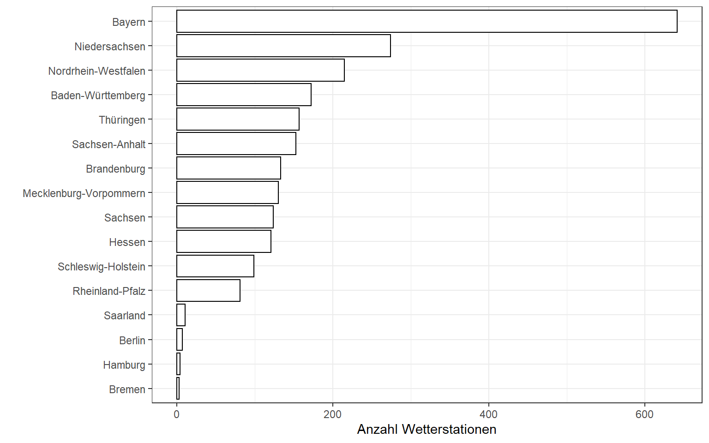
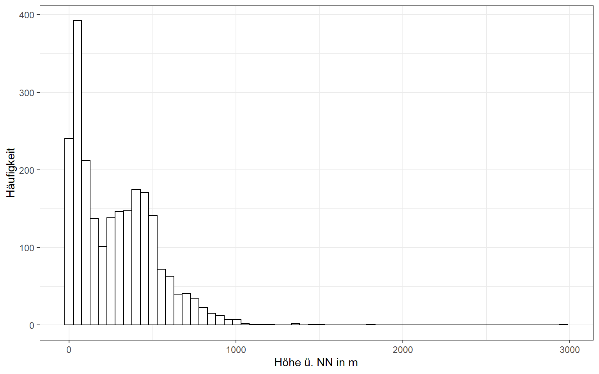
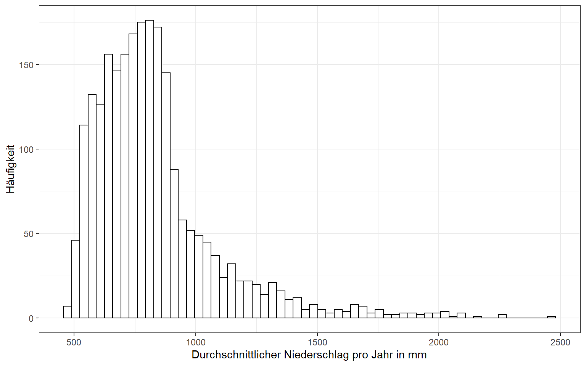
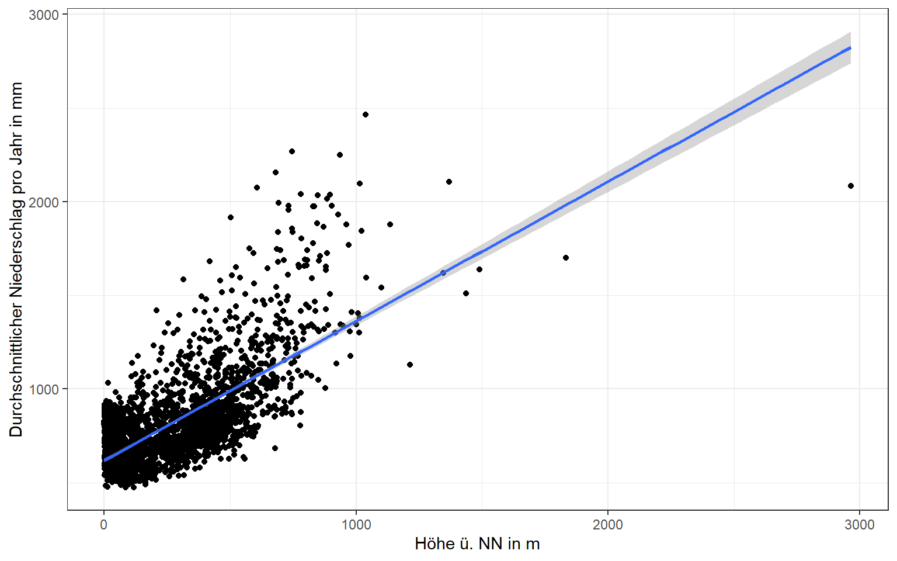
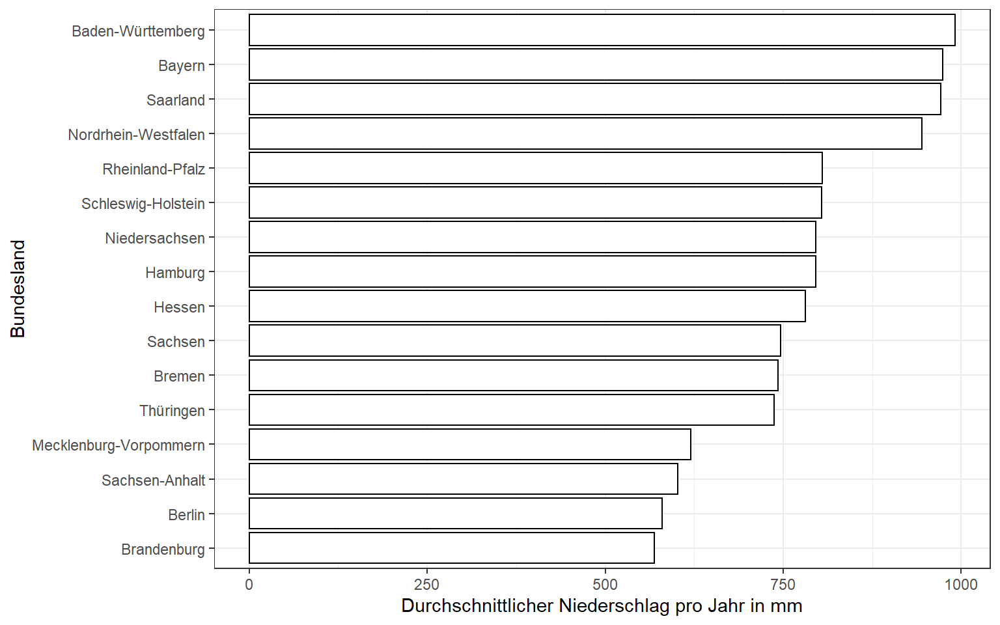
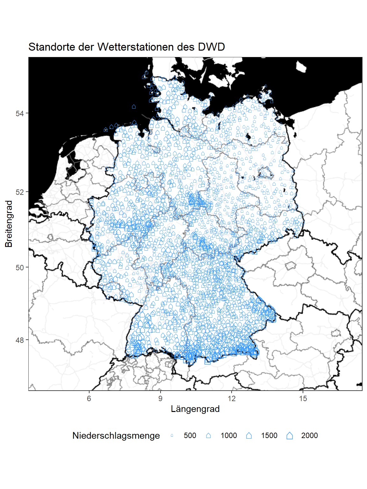

<script src="index_files/libs/htmlwidgets-1.5.1/htmlwidgets.js"></script>
<script src="index_files/libs/pymjs-1.3.2/pym.v1.js"></script>
<script src="index_files/libs/widgetframe-binding-0.3.1/widgetframe.js"></script>


Auf der Website des Deutschen Wetterdienstes (DWD) sind jährliche Niederschlagsmengen im Zeitraum von 1981 bis 2010 abrufbar. Das Datenangebot wirkt jedoch etwas *trocken*, da die Daten lediglich in einer HTML-Tabelle zur Verfügung gestellt werden. Mit RStudio will ich diese Tabelle von der DWD-Website extrahieren und anschließend visuell ansprechend aufbereiten.

## **Datenbeschaffung**

Die [Tabelle mit den Niederschlagswerten](https://www.dwd.de/DE/leistungen/klimadatendeutschland/mittelwerte/nieder_8110_fest_html.html;jsessionid=293831BFFB0310E74947D18B892C8858.live31094?view=nasPublication&nn=16102) enthält nach einer kurzen Überprüfung sehr ungenaue Angaben zu den Standorten der Wetterstationen, welche ich später für eine Kartierung benutzen möchte. Es gibt jedoch auch ein sog. [Stationslexikon](https://www.dwd.de/DE/leistungen/klimadatendeutschland/statliste/statlex_html.html?view=nasPublication&nn=16102), welches genauere Standortangaben enthält. Zunächst werden beiden Tabellen mit den R-Paketen `rvest` und `xml2` extrahiert und als *Liste* gespeichert.

## **Datenaufbereitung**

Anschließend wandle ich die *Liste* in einen *Data Frame* um und bereinige diesen. Über das Merkmal `Stations_ID` können beide Datenbestände miteinander verknüpft werden, sodass die unpräzisen Standortangaben im Datensatz mit den Niederschlagswerten ersetzt werden.

``` r
# Benötigte R-Pakete
library(tidyverse)
library(rvest)
library(xml2)

# DWD: Niederschlag: vieljährige Mittelwerte 1981-2010 (ungenaue Standortangaben)
url_niederschlag <- "https://www.dwd.de/DE/leistungen/klimadatendeutschland/
mittelwerte/nieder_8110_fest_html.html;
jsessionid=293831BFFB0310E74947D18B892C8858.live31094?view=nasPublication&nn=16102"

# DWD: Stationslexikon (genaue Standortangaben)
url_stationen <- "https://www.dwd.de/DE/leistungen/klimadatendeutschland/
statliste/statlex_html.html?view=nasPublication&nn=16102"

# HTML Tabelle jeweils extrahieren
daten_niederschlag <- url_niederschlag %>%
  xml2::read_html() %>%
  rvest::html_nodes(xpath='/html/body/font/table[2]') %>%
  rvest::html_table(fill = T)

daten_stationen <- url_stationen %>%
  xml2::read_html() %>%
  rvest::html_nodes(xpath='/html/body/font/table') %>%
  rvest::html_table(fill = T)

# Listen zu Data Frame konvertieren
df.niederschlag <- do.call(rbind.data.frame, daten_niederschlag)
df.stationen <- do.call(rbind.data.frame, daten_stationen)

# Stationslexikon aufbereiten
my.names <- df.stationen[1,] # erste Zeile enthält hier die Spaltennamen
colnames(df.stationen) <- my.names # alte Spaltennamen ersetzen
df.stationen <- df.stationen[-1,] # erste Zeile löschen
df.stationen <- select(df.stationen, Stations_ID, Breite, Länge) # relevante Merkmale
df.stationen <- unique(df.stationen[,1:3]) # Duplikate entfernen
df.stationen$Stations_ID <- as.numeric(df.stationen$Stations_ID) # Konvertieren

# Niederschlagsdaten aufbereiten
df.niederschlag$`Höhe ü. NN` <- df.niederschlag$`Höhe ü. NN` %>%
  str_replace(",","\\.") %>%
  as.numeric()

df.niederschlag$Jahr <- df.niederschlag$Jahr %>%
  str_replace(",","\\.") %>%
  as.numeric()

# Unpräzise Standortangaben entfernen
df.niederschlag <- select(df.niederschlag, -Breite,-Länge)

# Niederschlagsdaten mit Stationsdaten verknüpfen
df.merged <- left_join(df.niederschlag, df.stationen, by="Stations_ID")

# Breite und Länge in numerisches Format umwandeln
df.merged$Breite <- df.merged$Breite %>%
  str_replace("°","\\.") %>%
  str_replace("'","") %>%
  str_replace_all(fixed(" "), "") %>%
  as.numeric()

df.merged$Länge <- df.merged$Länge %>%
  str_replace("°","\\.") %>%
  str_replace("'","") %>%
  str_replace_all(fixed(" "), "") %>%
  as.numeric()
```

## **Datenanalyse**

Zunächst erstelle ich ein Ranking, in welchem Bundesland die meisten Wetterstationen des DWD zu finden sind. Bayern ist mit über 600 Stationen Spitzenreiter, flächenmäßig aber auch das größte Bundesland. Thüringen hat eine ziemlich hohe Dichte an Wetterstationen, gemessen an ihrer Gesamtfläche.

``` r
ggplot(df.merged, aes(x = fct_rev(fct_infreq(Bundesland)))) +
  geom_bar(fill="white", color="black") +
  coord_flip() +
  labs(x = "",
       y = "Anzahl Wetterstationen")
```



------------------------------------------------------------------------

Anschließend betrachte ich die Verteilung der Höhenlagen der Wetterstationen sowie die Verteilung der jährlichen Niederschlagsmengen pro Station. Einige Wetterstationen befinden sich auf über 1000m Höhe, während der Großteil sich unter 500 Höhenmetern befindet.

``` r
ggplot(df.merged, aes(x = `Höhe ü. NN`)) +
  geom_histogram(fill = "white", color = "black", bins = 60) +
  labs(x = "Höhe ü. NN in m",
       y = "Häufigkeit")
```



------------------------------------------------------------------------

Am Großteil der Wetterstationen beträgt der jährliche Niederschlag zwischen 500mm und 1000mm.

``` r
ggplot(df.merged, aes(x = Jahr)) +
  geom_histogram(fill = "white", color = "black", bins = 60) +
  labs(x = "Durchschnittlicher Niederschlag pro Jahr in mm",
       y = "Häufigkeit")
```



------------------------------------------------------------------------

Gibt es einen Zusammenhang zwischen der Höhenlage der Wetterstation und der jährlichen Niederschlagsmenge? Ein Scatterplot kann hier erste Einblicke liefern. Tatsächlich steigt die durchschnittliche Niederschlagsmenge mit zunehmender Höhenlage der Wetterstation an.

``` r
ggplot(df.merged, aes(x = `Höhe ü. NN`, y = Jahr)) +
  geom_point() +
  geom_smooth(method = "lm") + 
  labs(x = "Höhe ü. NN in m",
       y = "Durchschnittlicher Niederschlag pro Jahr in mm")
```



------------------------------------------------------------------------

In welchem Bundesland fällt der meiste Niederschlag im Jahr? Zunächst bilde ich die Mittelwerte der Jahresniederschlagsmengen aller Wetterstationen pro Bundesland und vergleichen diese anschließend in einem Balkendiagramm miteinander. Die Bundesländer im Nordosten Deutschlands weisen geringere Niederschlagsmengen auf als die südlich gelegenen Bundesländer.

``` r
df.merged %>%
  group_by(Bundesland) %>%
  summarise(mean_jahr = mean(Jahr)) %>%
  ggplot(aes(x=reorder(Bundesland, mean_jahr), y=mean_jahr)) +
  geom_bar(stat="identity", fill="white", color="black") +
  labs(x = "Bundesland",
       y = "Durchschnittlicher Niederschlag pro Jahr in mm") +
  coord_flip()
```



------------------------------------------------------------------------

Nun werden mit den Koordinaten aus dem Stationslexikon die Standorte der Wetterstationen auf einer Karte visualisiert. Zusätzlich habe ich die Größe der Symbole an die jährliche Niederschlagsmenge gekoppelt. Man erkennt erneut, dass im Süden Deutschlands höhere Niederschlagsmengen vorhanden sind, während im Nordosten Deutschlands diese deutlich geringer ausfallen. Auch fallen einige Gebirge ins Auge wie bspw. der Harz und Thüringer Wald in Mitteldeutschland sowie der Schwarzwald, Bayrische Wald und die Alpen im Süden Deutschlands.

``` r
library(ggmap)

Get_Map_Country <- get_map(location = "Germany", zoom = 6, maptype = "stamen_toner_background", 
                           filename = "ggmapTemp", color = "bw", source = "stadia")

map_germany <- ggmap(ggmap = Get_Map_Country)

map_germany + 
  geom_point(data=df.merged, 
             aes(x = as.numeric(Länge), y = as.numeric(Breite), size=Jahr), 
             shape = "\u2302", color = "#3399FF", alpha=0.9) +
  scale_size_continuous(name="Niederschlagsmenge") + 
  labs(title = "Standorte der Wetterstationen des DWD", 
       x = "Längengrad", 
       y = "Breitengrad") +
  theme(legend.position="bottom")
```



------------------------------------------------------------------------

Die Standorte der Wetterstationen können auch interaktiv visualisiert werden. Fährt man mit der Maus über einen Punkt auf der Karte wird sowohl der Name der Wetterstation als auch die durchschnittliche jährliche Niederschlagsmenge angezeigt.

``` r
library(maps)
library(widgetframe)
library(rbokeh)

plot <- figure(width = 800, height = 600, padding_factor = 0) %>%
  ly_map("world", regions = "germany", col = "gray") %>%
  ly_points(Länge, Breite, data = df.merged, size = 5,
            hover = c(`Name der Station`, Jahr))

frameWidget(plot, width=800,height=600)
```

<div id="htmlwidget-503b14859d53b3e41fb4" style="width:800px;height:600px;" class="widgetframe html-widget"></div>
<script type="application/json" data-for="htmlwidget-503b14859d53b3e41fb4">{"x":{"url":"index.markdown_strict_files/figure-markdown_strict//widgets/widget_interaktiv.html","options":{"xdomain":"*","allowfullscreen":false,"lazyload":false}},"evals":[],"jsHooks":[]}</script>
