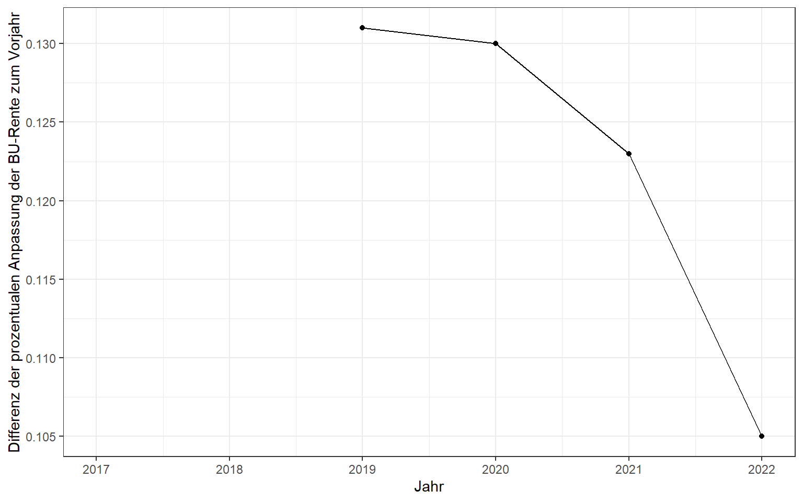
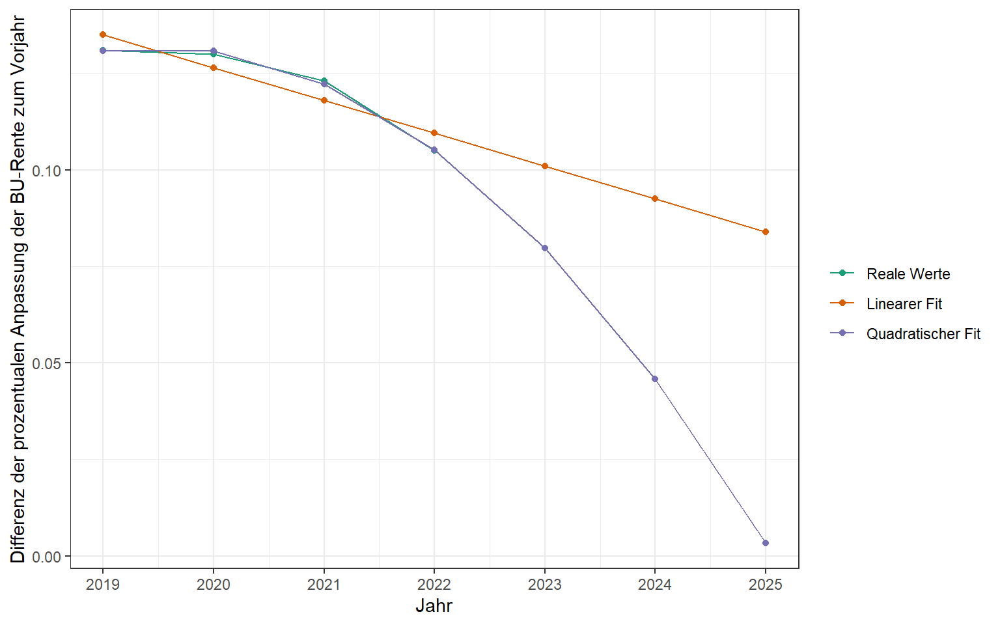

<script src="index_files/libs/kePrint-0.0.1/kePrint.js"></script>


Benötigte R-Pakete:

``` r
library(tidyverse)
```

## **Datenbeschaffung**

Anfang 2017 hatte ich eine Berufsunfähigkeitsversicherung abgeschlossen bei der eine jährliche Anpassung zum Inflationsausgleich (sog. **Dynamik**) von 6 % vereinbart ist. Da ich damals gerade meinen ersten Job nach dem Studium angetreten hatte, habe ich mich bei Abschluss der Versicherung relativ wenig mit den Versicherungsbedingungen auseinandergesetzt. Die Möglichkeit die Rente im Zeitverlauf dynamisch anzupassen zu können, erschien mir recht sinnvoll, da ich ein etwas geringeres Rentenniveau zur Absicherung gewählt hatte, als in Relation zum Nettoeinkommen angeraten wird (bspw. [hier](https://www.dieversicherer.de/versicherer/beruf-freizeit/news/berufsunfaehigkeit-ursachen-33756) ca. 70-80 %).

Im Angebot meines Versicherers fand sich zur Dynamikanpassung der folgende Hinweis:

> Durch den vereinbarten Dynamikplan mit planmäßiger Beitragserhöhung erhöhen sich die angegeben Leistungen zusätzlich.

Ohne mir weiter darüber Gedanken zu machen, hatte ich damals angenommen, dass sich die Beitragserhöhung von 6 % proportional zur Rentenanpassung verhält - d.h. 6 % Beitragserhöhung entspricht 6 % Rentenerhöhung. Sollten mir die Beitrage irgendwann zu hoch erscheinen oder ich ein Rentenniveau erreichen, welches ich als ausreichend erachte, so würde ich der Dynamik widersprechen. Das geht bei meiner Versicherung bis zu zwei Mal hintereinander.

Im ersten Jahr der Dynamikanpassung stieg mein Beitrag um 6 % an und die versicherte BU-Rente um 6,026%. Damit war meine Vermutung zunächst bestätigt, dass sich die Anpassung ungefähr proportional verhält. In 2019 betrug der Anstieg der Rente jedoch nur noch 5,895 % in Bezug auf 2018, woraufhin ich den Berater angerufen habe, der mir die Versicherung vermittelt hatte. Dieser war zunächst sehr amüsiert darüber, dass ich mir die Arbeit mache die Dynamikanpassung nachzurechnen und versicherte mir, dass es bei den Versicherern immer mal zu *Rundungsabweichungen* kommen könne und davon auszugehen ist, dass im nächsten Jahr die Anpassung wieder bei etwa 6 % liegt. Nun ja, 2020 betrug der Rentenzuwachs dann nur noch 5,764%. Zum Dynamikplan meiner Versicherung gibt es separate AVB, die ich nicht mehr finden konnte (oder möglicherweise auch bei Versicherungsabschluss nicht erhalten hatte). Darin findet sich dann folgende Angabe:

> Die Versicherungsleistungen erhöhen sich nicht im gleichen Verhältnis wie die Tarifbeiträge. Die Erhöhung der Versicherungsleistungen errechnet sich nach dem am Erhöhungstermin erreichten Alter der versicherten Person, der restlichen Beitragszahlungsdauer und einem eventuell vereinbarten Beitragszuschlag.

Obwohl damit der Sachverhalt für mich geklärt war, wollte ich trotzdem versuchen nachzuvollziehen, mit welchen Abschlägen auf die Anpassung der Rentenerhöhung ich in Zukunft rechnen kann.

## **Datenaufbereitung**

Da ich in diesem Beitrag keine Empfehlung abgeben möchte, wie hoch eine monatliche BU-Rente mindestens ausfallen sollte, da dies sehr von den persönlichen Verhältnissen und dem ausgeübten Beruf abhängt, habe ich fiktive Daten generiert, bei denen jedoch die prozentuale Anpassung der Rente pro Jahr mit meinen tatsächlichen Versicherungsdaten übereinstimmt.

Im Jahr 2017 wurde daher eine fiktive monatliche BU-Rente von 1250,00 € bei einem monatlichen Beitrag von 65,24 € versichert. In den darauffolgenden Jahren erhöht sich der monatliche Beitrag um jeweils 6 % im Vergleich zum Vorjahresniveau. Die prozentuale Erhöhung der BU-Rente ist in der Spalte `delta_rente` hinterlegt.

<br>

| jahr | beitrag |   rente | delta_rente |
|-----:|--------:|--------:|------------:|
| 2017 |   65.24 | 1250.00 |          NA |
| 2018 |   69.15 | 1325.33 |     0.06026 |
| 2019 |   73.30 | 1403.45 |     0.05895 |
| 2020 |   77.70 | 1484.35 |     0.05764 |
| 2021 |   82.36 | 1568.09 |     0.05641 |
| 2022 |   87.31 | 1654.90 |     0.05536 |

Um abschätzen zu können, wie sich die Reduzierung der Anpassung der Rente fortsetzt, habe ich zudem für jedes Jahr die Differenz zwischen der prozentualen Anpassung der BU-Rente zu berechnet. Diese Differenz wird im nächsten Abschnitt genauer analysiert.

<br>

| jahr | beitrag |   rente | delta_rente | differenz_delta_rente |
|-----:|--------:|--------:|------------:|----------------------:|
| 2017 |   65.24 | 1250.00 |          NA |                    NA |
| 2018 |   69.15 | 1325.33 |     0.06026 |                    NA |
| 2019 |   73.30 | 1403.45 |     0.05895 |                 0.131 |
| 2020 |   77.70 | 1484.35 |     0.05764 |                 0.130 |
| 2021 |   82.36 | 1568.09 |     0.05641 |                 0.123 |
| 2022 |   87.31 | 1654.90 |     0.05536 |                 0.105 |

## **Datenanalyse**

Grafisch zeigt die Entwicklung der Differenz der Rentenanpassungen in Prozentpunkten einen nicht linearen Verlauf.

``` r
ggplot(bu_daten, aes(x = jahr, y = differenz_delta_rente)) +
  geom_point() +
  geom_line() +
  labs(x = "Jahr", y = "Differenz der prozentualen Anpassung der BU-Rente zum Vorjahr") 
```



Wie setzt sich dieser Verlauf nun in 2023 und den folgenden Jahren bei Inanspruchnahme der Dynamikanpassung fort? Um dies zu ermitteln habe ich zwei lineare Regressionsmodelle aufgestellt. Beide Modelle erklären die Differenz der Rentenanpassung durch den Zeitverlauf (bzw. mein Alter). Im zweiten Modell verwende ich zusätzlich einen quadrierten Term, um einen nicht linearen Zusammenhang zu modellieren.

``` r
model1 <- lm(differenz_delta_rente ~ jahr, data = bu_daten)
model2 <- lm(differenz_delta_rente ~ poly(jahr, degrees = 2), data = bu_daten)
```

Mit diesen Modellen können wir nun versuchen die Rentendifferenz für die künftigen Zeiträume (ab 2023) zu prognostizieren.

``` r
tibble(jahr = c(2019,2020,2021,2022,2023,2024,2025),
       differenz_delta_rente = c(0.131, 0.130,0.123,0.105, NA,NA,NA)) %>%
  mutate(fit1 = predict(model1, newdata = .),
         fit2 = predict(model2, newdata = .)) %>%
  pivot_longer(cols = -jahr, names_to = "type", values_to = "value") %>%
  ggplot(aes(x=jahr, y = value, color = type)) +
  geom_line() + geom_point() +
  scale_x_continuous(breaks = seq(2019,2027,1)) +
  scale_color_brewer(name = "",
                     palette = "Dark2",
                     labels = c("Reale Werte","Linearer Fit","Quadratischer Fit")
                     ) +
  labs(x = "Jahr", y = "Differenz der prozentualen Anpassung der BU-Rente zum Vorjahr") 
```



Man erkennt hier gut, dass das Modell mit dem quadratischen Term die tatsächlichen Werte sehr gut beschreibt. Unklar ist jedoch wie es nach 2025 weitergeht. Laut dem zweiten Modell würde die Differenz ab 2026 negativ werden, d.h. die prozentuale Anpassung würde also wieder steigen und nicht weiter abnehmen.

Mit dem Modell kann ich nun die Entwicklung der monatlichen BU-Rente für die nächsten Jahre vorhersagen.

<br>

| jahr | beitrag |   rente |
|-----:|--------:|--------:|
| 2023 |   92.55 | 1745.19 |
| 2024 |   98.10 | 1839.61 |
| 2025 |  103.99 | 1939.08 |

Ich werde diesen Artikel daher in Zukunft fortlaufend aktualisieren und ggf. mein Prognosemodell anpassen.
