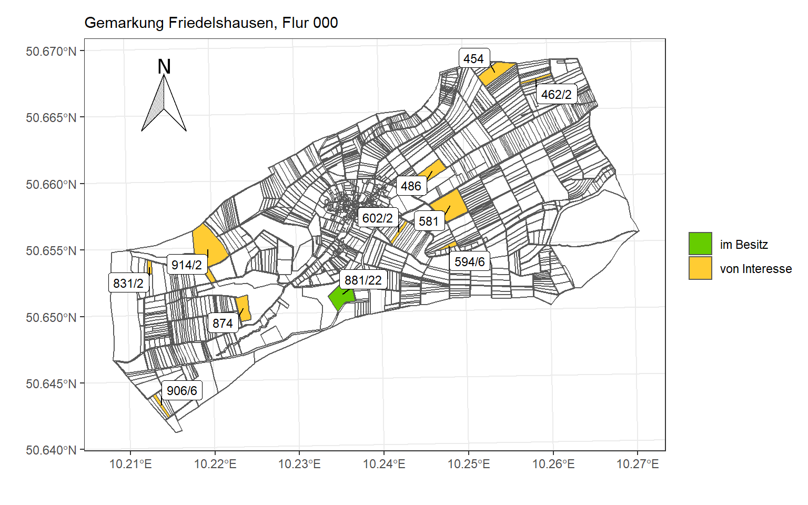
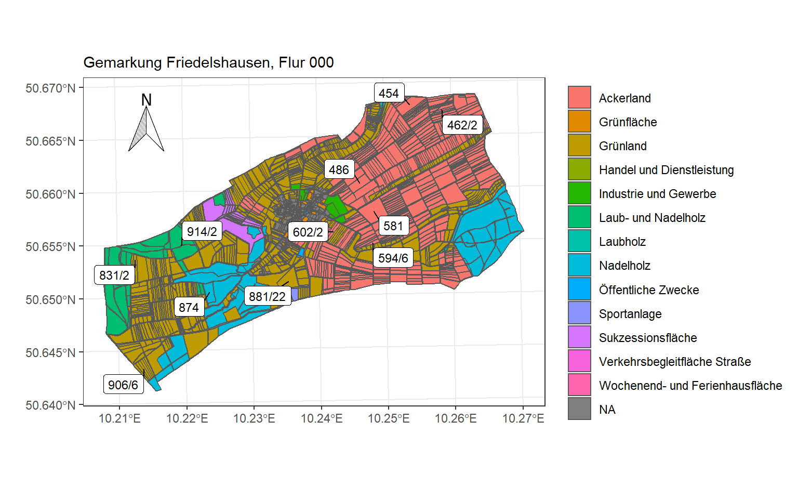
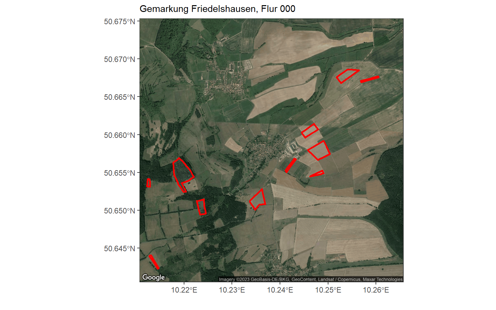

Benötigte R-Pakete:

``` r
library(tidyverse)
library(sf)
library(ggsn)
library(ggmap)
```

## **Datenbeschaffung**

Digitalisierung sei Dank muss man heute nicht mehr auf das Grundbuchamt um sich über Bodenrichtwerte und Flurstücke zu informieren. Die meisten Bundesländer bieten dafür GIS-Anwendungen an, mit denen man interaktiv das Land erkunden kann. In Thüringen funktioniert das z.B. mit [BORIS-TH](https://thueringenviewer.thueringen.de/thviewer/boris.html#). Je weiter man in die Karte hereinzoomt, um so detaillierte Informationen zu den Flurstücken werden eingeblendet. Dennoch vermisse ich in dieser Darstellung die Nutzungsart eines Flurstücks. Also ob es sich bei Flächen, die nicht als Bauland ausgewiesen sind, z.B. um Acker- oder Grünland handelt. Daher kam mir die Idee selbst so eine Karte mit R zu erstellen.

Auf der Webseite [Geodatenportal Thüringen](https://www.geoportal-th.de/de-de/Downloadbereiche/Download-Offene-Geodaten-Th%C3%BCringen/Download-ALKIS-flurweise) kann man sich Daten aus dem *Amtlichen Liegenschaftskataster-Informationssystem (ALKIS)* (wer hat sich diese tollen Akronyme eigentlich ausgedacht?!) herunterladen. In der .zip Datei gibt es mehrere sog. *Shapefiles*, in denen Geometriedaten gespeichert sind. Für meine Karte benötige ich die Dateien `3438-000_flurstueck.shp` und `3438-000_nutzungFlurstueck.shp`. Die erste Datei enthält Angaben zu den Grenzen der jeweiligen Flurstücke in der gewählten Gemarkung und der zweite Datensatz enthält Angaben zur Nutzungsart der Flurstücke. Mit der Funktion `st_read()` aus dem R-Paket `sf` ist das Einlesen trivial.

``` r
flurstuecke <- st_read("3438-000_flurstueck.shp")
nutzung <- st_read("3438-000_nutzungFlurstueck.shp")
```

## **Datenaufbereitung**

Die eingelesenen Shapefiles sehen bis auf die Spalte `geometry` wie ein gewöhnlicher Datensatz aus. Jede Zeile repräsentiert ein Flurstück, welches über die Spalte `flurstnr` identifiziert werden kann. In der Spalte `geometry` befinden sich jedoch eine ganze Menge Informationen: nämlich wie ein Flurstück abzugrenzen ist. In einer Zeile dieser Spalte findet man meist mehrere Listenelemente, die so verschachtelt sind, dass sie in zwei Dimensionen dargestellt werden können. Eine Liste stellt hier ein sog. *Polygon* dar.

Die `geometry` Spalte bringt einige Eigenheiten mit sich, bspw. bei der Anwendung von Aggregationsfunktionen wie `summarise()` und `group_by()` aus dem R-Paket `dplyr`. Möchte ich überprüfen, ob jedes Flurstück tatsächlich nur ein mal im Datensatz vorkommt, muss ich zunächst mit der Funktion `st_set_geometry()` diese Spalte aus dem Datensatz entfernen.

``` r
checkData <- st_set_geometry(flurstuecke, NULL) 

checkData %>% 
  group_by(flurstnr) %>% 
  summarise(cases = n()) %>% 
  filter(cases > 1)
## # A tibble: 0 x 2
## # ... with 2 variables: flurstnr <chr>, cases <int>
```

Ich habe mir eine fiktive Liste von Flurstücken in der Gemarkung erstellt, die ich auf einer Karte hervorheben möchte. Hierzu lege ich die Spalte `indikator` an.

``` r
geoData <- 
  flurstuecke %>%
  mutate(indikator = case_when( # Flurstücke zuweisen
    flurstnr %in% c("874","581","462/2","454",
                    "486","594/6",
                    "602/2","914/2","831/2","906/6") ~ "von Interesse",
    flurstnr == "881/22" ~ "im Besitz")) 
```

Zum Schluss füge ich für jedes Flurstück den geometrischen Schwerpunkt (*Centroid*) hinzu, welcher eine Art Mittelpunkt des Polygons (Flurstücks) darstellt. Diesen Schwerpunkt kann ich später bspw. für das Hinzufügen von Labels der Flurstücke verwenden. Die Spalte `geometry` gibt lediglich Auskunft über die Grenzen bzw. Form des Flurstücks. Nach Anwendung der Funktion `st_centroid()` findet man den geometrischen Schwerpunkt eines Flurstücks durch die Spalten `X` und `Y`.

``` r
geoData <- cbind(geoData, st_coordinates(st_centroid(geoData))) 
```

## **Datenanalyse**

Nun erstelle ich eine Karte der Gemarkung Friedelshausen, die sich aus den Grenzen der einzelnen Flurstücke ergibt. Im R-Paket `ggplot2` gibt es die Funktion `geom_sf()` mit welcher sich die Informationen in der Spalte `geometry` visualisieren lassen. Mit der Funktion `geom_label_repel()` weise ich den einzelnen Flurstücken ihre Bezeichnung zu (hier wird der geometrische Schwerpunkt verwendet). Die Flurstücke von Interesse sind farblich hervorgehoben. Damit man sich auf dem Kartenausschnitt besser zurechtfindet, füge ich eine Kompassrose mit der Funktion `north()` aus dem R-Paket `ggsn` ein.

``` r
ggplot() + 
  geom_sf(data = geoData, aes(fill = indikator)) +
  ggrepel::geom_label_repel(data = filter(geoData, !is.na(indikator)), 
            aes(X, Y, label = flurstnr), size = 3, min.segment.length = 0) +
  scale_fill_manual(values = c("#66CC00", "#FFCC33","#CCCCC"),
                    na.translate = F) +
  labs(x = "",
       y = "",
       fill = "",
       subtitle = "Gemarkung Friedelshausen, Flur 000") +
  theme_bw() +
  ggsn::north(geoData, location = "topleft", scale = 0.2, symbol = 3)
```



------------------------------------------------------------------------

Nun ergänze ich die Nutzungsart der Flurstücke, die mir beim Suchen mit der GIS-Anwendung *BORIS-TH* fehlten. Hier erkennt man nun, ob es sich bei einem Flurstück um Ackerland, Grünland, Wald usw. handelt.

``` r
ggplot() + 
  geom_sf(data = nutzung, aes(fill = bez)) +
  ggrepel::geom_label_repel(data = filter(geoData, !is.na(indikator)), 
                            aes(X, Y, label = flurstnr), size = 3, min.segment.length = 0) +
  labs(x = "",
       y = "",
       fill = "",
       subtitle = "Gemarkung Friedelshausen, Flur 000") +
  theme_bw() +
  ggsn::north(geoData, location = "topleft", scale = 0.2, symbol = 3) +
  theme_bw()
```



------------------------------------------------------------------------

Zum Schluss möchte ich die Flurstücke auf einer Satellitenkarte darstellen. Zuerst muss der relevante Kartenausschnitt mit der Funktion `get_map()` aus dem R-Paket `ggmap` ausgewählt werden.

``` r
map <- get_map("Friedelshausen", 
               maptype = "satellite", 
               zoom = 14, source = "google")
```

Leider lassen sich die Flurstücke hier nicht so einfach in die Karte einzeichnen wie bei den vorherigen Karten. Durch unterschiedliche Koordinatenreferenzsystemen (*CRS*) zwischen der Satellitenkarte und den zugrundeliegenden Daten der Flurstücke würden die Flurstücksgrenzen nicht korrekt auf der Karte eingezeichnet werden. Das CRS der Satellitenkarte ist vom Typ *WGS 1984 (= EPSG: 4326)*, während die Flurstücke vom Typ *EPSG:3857* sind.

Die untenstehende Funktion ermöglicht das Anwenden von `geom_sf()` auf die Satellitenkarte. [Hier](https://stackoverflow.com/questions/47749078/how-to-put-a-geom-sf-produced-map-on-top-of-a-ggmap-produced-raster) findet man die Funktion sowie weiterführende Informationen.

``` r
ggmap_bbox <- function(map) {
  if (!inherits(map, "ggmap")) stop("map must be a ggmap object")

  map_bbox <- setNames(unlist(attr(map, "bb")), 
                       c("ymin", "xmin", "ymax", "xmax"))
  
  bbox_3857 <- st_bbox(st_transform(st_as_sfc(st_bbox(map_bbox, crs = 4326)), 3857))
  
  attr(map, "bb")$ll.lat <- bbox_3857["ymin"]
  attr(map, "bb")$ll.lon <- bbox_3857["xmin"]
  attr(map, "bb")$ur.lat <- bbox_3857["ymax"]
  attr(map, "bb")$ur.lon <- bbox_3857["xmax"]
  map
}
```

Die fertige Satellitenkarte sieht so aus:

``` r
geoDataSatellite <- ggmap_bbox(map)

geoData_3857 <- st_transform(geoData, 3857)

ggmap(geoDataSatellite) + 
  coord_sf(crs = st_crs(3857)) +
  geom_sf(data = filter(geoData_3857, !is.na(indikator)), 
          color = "red", size = 1, alpha=0.1, inherit.aes = FALSE) +
  labs(x = "",
       y = "",
       subtitle = "Gemarkung Friedelshausen, Flur 000")
```


