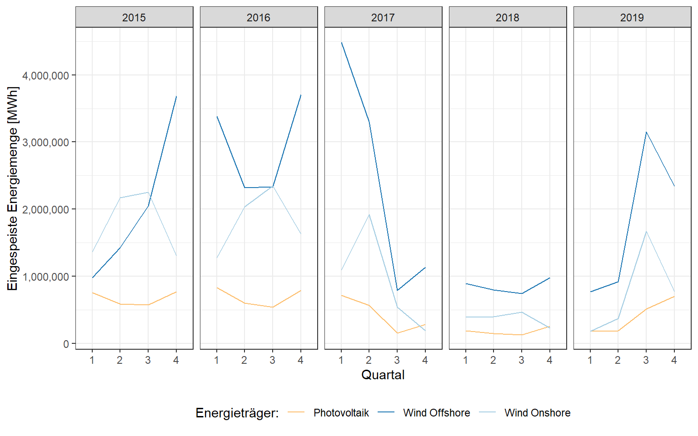

<script src="index_files/libs/kePrint-0.0.1/kePrint.js"></script>


In meinem letzten Beitrag hatte ich mich mit der Stromproduktion in Deutschland auseinandergesetzt - insbesondere wie viel Strom jeweils durch konventionelle bzw. alternative Energieträger erzeugt wird. Die Erkenntnisse dort bezogen sich immer auf ein gesamtes Jahr. Ich möchte nun der Frage nachgehen, wie sich die Stromproduktion innerhalb eines Jahres zusammensetzt und wie sich die Schwankung von regenarativen Energieträgern auswirkt.

## **Datenbeschaffung**

Die Bundesnetzagentur bietet via [SMARD](https://www.smard.de/home/46) Strommarktdaten an, die ich für den Zeitraum vom 01.01.2015 bis 31.12.2019 extrahiert habe. In den Daten liegt für jeden Tag eine Angabe zur eingepeisten Energiemenge pro Energieträger im 15 Minuten-Takt vor. Zunächst müssen die Daten wie üblich aufbereitet werden.

## **Datenaufbereitung**

Nachdem die Daten aus der .CSV Datei eingelesen wurden, werden fehlende Angaben, die in dieser Datei durch einen *.* gekennzeichnet sind, durch eine *0* ersetzt. Die Spalte mit der Datumsangabe wird in ein `Date Format` konvertiert

``` r
library(tidyverse)

# SMARD Daten: Erzeugte Energie
raw_erzeugung <- read_delim("data/smard_stromerzeugung.csv", 
                            delim=";",
                            locale=locale(decimal_mark = ","))

# Cleaning
raw_erzeugung %>%
  # Tibble
  as_tibble() %>%
  # . durch 0 ersetzen (NA)
  replace(is.na(.), 0) %>%
  # Character zu Numeric konvertieren
  mutate_at(vars(-c("Datum","Uhrzeit")), as.numeric) %>%
  # Datum formatieren
  mutate(datum_format = as.Date(Datum, "%d.%m.%Y")) %>%
  select(datum_format, everything(), -Datum) -> mod_erzeugung
```

Als nächstes werden zwei neue Merkmale erstellt, welche die einzelnen Energieträger in `Erneuerbare_Energien` bzw. `Konventionelle_Energien` einteilen. Hätte ich die fehlenden Werte im vorherigen Schritt nicht bereinigt, wäre es hier zu Problemen bei der Summenbildung gekommen. Die Datumsangabe zerlegen ich noch mit der Funktion `separate` aus dem R-Paket [dplyr](https://dplyr.tidyverse.org/) in die Merkmale `Tag`, `Monat` und `Jahr`.

``` r
mod_erzeugung %>%
  # Summen-Kategorien bilden
  mutate(`Erneuerbare_Energien` = `Biomasse` + 
                                  `Wasserkraft` + 
                                  `Wind Offshore` + `Wind Onshore` + 
                                  `Photovoltaik` + 
                                  `Sonstige Erneuerbare`,
         `Konventionelle_Energien` = `Kernenergie` + 
                                     `Braunkohle` + `Steinkohle` + 
                                     `Erdgas`+ `Pumpspeicher` + 
                                     `Sonstige Konventionelle`) %>%
  # Datum trennen
  separate(datum_format, into = c("jahr", "monat", "tag"), remove = F) -> mod_erzeugung
```

Unten befindet sich ein Auszug des Datensatzes:

<br>

<div style="border: 1px solid #ddd; padding: 0px; overflow-y: scroll; height:300px; overflow-x: scroll; width:100%; ">

| datum_format | jahr | monat | tag | Uhrzeit  | Biomasse | Wasserkraft | Wind Offshore | Wind Onshore | Photovoltaik | Sonstige Erneuerbare | Kernenergie | Braunkohle | Steinkohle | Erdgas | Pumpspeicher | Sonstige Konventionelle | Erneuerbare_Energien | Konventionelle_Energien |
|:-------------|:-----|:------|:----|:---------|---------:|------------:|--------------:|-------------:|-------------:|---------------------:|------------:|-----------:|-----------:|-------:|-------------:|------------------------:|---------------------:|------------------------:|
| 2015-01-01   | 2015 | 01    | 01  | 00:00:00 |    1.006 |         288 |           130 |        2.028 |            0 |                   33 |       2.686 |      3.977 |        686 |    262 |          368 |                   1.236 |              454.034 |                1323.899 |
| 2015-01-01   | 2015 | 01    | 01  | 00:15:00 |    1.007 |         288 |           129 |        2.023 |            0 |                   33 |       2.646 |      3.963 |        721 |    261 |          328 |                   1.214 |              453.030 |                1317.823 |
| 2015-01-01   | 2015 | 01    | 01  | 00:30:00 |    1.007 |         293 |           129 |        2.040 |            0 |                   33 |       2.661 |      3.925 |        696 |    259 |          360 |                   1.219 |              458.047 |                1322.805 |
| 2015-01-01   | 2015 | 01    | 01  | 00:45:00 |    1.005 |         290 |           129 |        2.037 |            0 |                   33 |       2.718 |      3.872 |        665 |    225 |          280 |                   1.243 |              455.042 |                1177.833 |
| 2015-01-01   | 2015 | 01    | 01  | 01:00:00 |  999.000 |         295 |           129 |        2.046 |            0 |                   33 |       2.772 |      3.899 |        521 |    190 |          185 |                   1.248 |             1458.046 |                 903.919 |
| 2015-01-01   | 2015 | 01    | 01  | 01:15:00 |  995.000 |         301 |           129 |        2.075 |            0 |                   32 |       2.775 |      3.891 |        465 |    108 |          220 |                   1.220 |             1459.075 |                 800.886 |
| 2015-01-01   | 2015 | 01    | 01  | 01:30:00 |  995.000 |         300 |           129 |        2.074 |            0 |                   29 |       2.774 |      3.820 |        465 |    101 |          231 |                   1.208 |             1455.074 |                 804.802 |
| 2015-01-01   | 2015 | 01    | 01  | 01:45:00 |  994.000 |         292 |           129 |        2.102 |            0 |                   27 |       2.765 |      3.754 |        466 |    101 |          213 |                   1.259 |             1444.102 |                 787.778 |
| 2015-01-01   | 2015 | 01    | 01  | 02:00:00 |    1.001 |         293 |           129 |        2.135 |            0 |                   26 |       2.774 |      3.775 |        449 |    101 |          174 |                   1.264 |              451.136 |                 731.813 |
| 2015-01-01   | 2015 | 01    | 01  | 02:15:00 |    1.006 |         284 |           129 |        2.134 |            0 |                   23 |       2.763 |      3.737 |        448 |    101 |          164 |                   1.258 |              439.140 |                 720.758 |
| 2015-01-01   | 2015 | 01    | 01  | 02:30:00 |    1.006 |         280 |           128 |        2.129 |            0 |                   21 |       2.750 |      3.697 |        449 |    100 |          135 |                   1.253 |              432.135 |                 691.700 |
| 2015-01-01   | 2015 | 01    | 01  | 02:45:00 |    1.007 |         282 |           128 |        2.143 |            0 |                   21 |       2.739 |      3.644 |        464 |    101 |          126 |                   1.269 |              434.150 |                 698.652 |
| 2015-01-01   | 2015 | 01    | 01  | 03:00:00 |    1.008 |         284 |           129 |        2.150 |            0 |                   21 |       2.759 |      3.574 |        484 |    101 |           33 |                   1.316 |              437.158 |                 625.649 |
| 2015-01-01   | 2015 | 01    | 01  | 03:15:00 |    1.011 |         280 |           130 |        2.125 |            0 |                   21 |       2.755 |      3.527 |        488 |    101 |           29 |                   1.287 |              434.136 |                 625.569 |
| 2015-01-01   | 2015 | 01    | 01  | 03:30:00 |    1.012 |         279 |           130 |        2.122 |            0 |                   21 |       2.761 |      3.505 |        488 |    101 |           29 |                   1.265 |              433.134 |                 625.531 |
| 2015-01-01   | 2015 | 01    | 01  | 03:45:00 |    1.011 |         279 |           130 |        2.156 |            0 |                   21 |       2.753 |      3.506 |        485 |    101 |           28 |                   1.218 |              433.167 |                 621.477 |
| 2015-01-01   | 2015 | 01    | 01  | 04:00:00 |    1.009 |         279 |           130 |        2.184 |            0 |                   21 |       2.767 |      3.540 |        470 |    101 |           58 |                   1.245 |              433.193 |                 636.552 |
| 2015-01-01   | 2015 | 01    | 01  | 04:15:00 |    1.010 |         278 |           130 |        2.181 |            0 |                   21 |       2.751 |      3.548 |        514 |    101 |           55 |                   1.249 |              432.191 |                 677.548 |
| 2015-01-01   | 2015 | 01    | 01  | 04:30:00 |    1.011 |         278 |           130 |        2.150 |            0 |                   21 |       2.736 |      3.537 |        512 |    101 |           55 |                   1.281 |              432.161 |                 675.554 |
| 2015-01-01   | 2015 | 01    | 01  | 04:45:00 |    1.009 |         277 |           130 |        2.129 |            0 |                   21 |       2.709 |      3.525 |        502 |    102 |           55 |                   1.298 |              431.138 |                 666.532 |
| 2015-01-01   | 2015 | 01    | 01  | 05:00:00 |    1.007 |         278 |           129 |        2.201 |            0 |                   21 |       2.704 |      3.469 |        433 |    102 |          209 |                   1.277 |              431.208 |                 751.450 |
| 2015-01-01   | 2015 | 01    | 01  | 05:15:00 |    1.009 |         277 |           130 |        2.187 |            0 |                   21 |       2.684 |      3.408 |        434 |    101 |          207 |                   1.267 |              431.196 |                 749.359 |
| 2015-01-01   | 2015 | 01    | 01  | 05:30:00 |    1.008 |         276 |           130 |        2.171 |            0 |                   21 |       2.668 |      3.353 |        433 |    101 |           21 |                   1.282 |              430.179 |                 562.303 |
| 2015-01-01   | 2015 | 01    | 01  | 05:45:00 |    1.005 |         277 |           131 |        2.154 |            0 |                   21 |       2.641 |      3.280 |        441 |    101 |          205 |                   1.273 |              432.159 |                 754.194 |
| 2015-01-01   | 2015 | 01    | 01  | 06:00:00 |    1.004 |         276 |           131 |        2.183 |            0 |                   21 |       2.631 |      3.164 |        454 |    101 |           19 |                   1.274 |              431.187 |                 581.069 |
| 2015-01-01   | 2015 | 01    | 01  | 06:15:00 |    1.003 |         278 |           131 |        2.236 |            0 |                   21 |       2.605 |      3.126 |        477 |    101 |          184 |                   1.279 |              433.239 |                 769.010 |
| 2015-01-01   | 2015 | 01    | 01  | 06:30:00 |    1.004 |         279 |           130 |        2.346 |            0 |                   21 |       2.562 |      3.085 |        478 |    101 |           18 |                   1.287 |              433.350 |                 603.934 |
| 2015-01-01   | 2015 | 01    | 01  | 06:45:00 |    1.003 |         278 |           130 |        2.403 |            0 |                   21 |       2.501 |      3.063 |        478 |    101 |          182 |                   1.315 |              432.406 |                 767.879 |
| 2015-01-01   | 2015 | 01    | 01  | 07:00:00 |    1.005 |         279 |           130 |        2.406 |            0 |                   21 |       2.470 |      3.033 |        505 |    101 |          189 |                   1.289 |              433.411 |                 801.792 |
| 2015-01-01   | 2015 | 01    | 01  | 07:15:00 |    1.005 |         279 |           130 |        2.437 |            0 |                   21 |       2.487 |      3.018 |        504 |    103 |           19 |                   1.290 |              433.442 |                 632.795 |

</div>

Momentan befinden sich die Daten im sog. *Wide Format*, d.h. dass sich jeder Energieträger in einer eigenen Spalte befindet, in welcher der zugehörige Wert pro Zeitpunkt eingetragen ist. Für einen Großteil der Funktionen der `tidyverse` R-Paketsammlung sind Daten im *Long Format* besser geeignet. Die Energieträger werden alle in der alphanumerischen Spalte `Energie_Typ` zusammengefasst und in einer weiteren Spalte wird der jeweilige `Wert` festgehalten. Jede Zeile in diesem Datensatz identifiziert nun genau einen Energieträger zu einem bestimmten Zeitpunkt. Vorher identifzierte eine Zeile einen bestimmten Zeitpunkt und lieferte Informationen zu allen Energieträgern. Seit kurzem stehen im R-Paket [tidyr](https://tidyr.tidyverse.org/) die Funktionen `pivot_longer` und `pivot_wider` zur Verfügung, welche die Funktionen `gather` und `spread` ablösen sollen und etwas intuitiver zu bedienen sind. Statt 175.000 Zeilen ist der Datensatz num um fast 2 Millionen Zeilen *länger* geworden!

``` r
mod_erzeugung %>%
  # Reshape ins Long Format
  pivot_longer(-c(jahr, monat, tag, datum_format, Uhrzeit),
               names_to = "energie_typ",
               values_to = "wert") %>%
  # Quartale generieren
  mutate(
    quartal = ifelse(monat %in% c("01","02","03"),"1",
                     ifelse(monat %in% c("04","05","06"),"2",
                            ifelse(monat %in% c("07","08","09"),"3",
                                   ifelse(monat %in% c("10","11","12"),"4","0"))))
  ) -> mod_erzeugung
```

Der Datensatz sieht nun so aus:

<br>

<div style="border: 1px solid #ddd; padding: 0px; overflow-y: scroll; height:300px; overflow-x: scroll; width:100%; ">

| datum_format | jahr | monat | tag | Uhrzeit  | energie_typ             |     wert | quartal |
|:-------------|:-----|:------|:----|:---------|:------------------------|---------:|:--------|
| 2015-01-01   | 2015 | 01    | 01  | 00:00:00 | Biomasse                |    1.006 | 1       |
| 2015-01-01   | 2015 | 01    | 01  | 00:00:00 | Wasserkraft             |  288.000 | 1       |
| 2015-01-01   | 2015 | 01    | 01  | 00:00:00 | Wind Offshore           |  130.000 | 1       |
| 2015-01-01   | 2015 | 01    | 01  | 00:00:00 | Wind Onshore            |    2.028 | 1       |
| 2015-01-01   | 2015 | 01    | 01  | 00:00:00 | Photovoltaik            |    0.000 | 1       |
| 2015-01-01   | 2015 | 01    | 01  | 00:00:00 | Sonstige Erneuerbare    |   33.000 | 1       |
| 2015-01-01   | 2015 | 01    | 01  | 00:00:00 | Kernenergie             |    2.686 | 1       |
| 2015-01-01   | 2015 | 01    | 01  | 00:00:00 | Braunkohle              |    3.977 | 1       |
| 2015-01-01   | 2015 | 01    | 01  | 00:00:00 | Steinkohle              |  686.000 | 1       |
| 2015-01-01   | 2015 | 01    | 01  | 00:00:00 | Erdgas                  |  262.000 | 1       |
| 2015-01-01   | 2015 | 01    | 01  | 00:00:00 | Pumpspeicher            |  368.000 | 1       |
| 2015-01-01   | 2015 | 01    | 01  | 00:00:00 | Sonstige Konventionelle |    1.236 | 1       |
| 2015-01-01   | 2015 | 01    | 01  | 00:00:00 | Erneuerbare_Energien    |  454.034 | 1       |
| 2015-01-01   | 2015 | 01    | 01  | 00:00:00 | Konventionelle_Energien | 1323.899 | 1       |
| 2015-01-01   | 2015 | 01    | 01  | 00:15:00 | Biomasse                |    1.007 | 1       |
| 2015-01-01   | 2015 | 01    | 01  | 00:15:00 | Wasserkraft             |  288.000 | 1       |
| 2015-01-01   | 2015 | 01    | 01  | 00:15:00 | Wind Offshore           |  129.000 | 1       |
| 2015-01-01   | 2015 | 01    | 01  | 00:15:00 | Wind Onshore            |    2.023 | 1       |
| 2015-01-01   | 2015 | 01    | 01  | 00:15:00 | Photovoltaik            |    0.000 | 1       |
| 2015-01-01   | 2015 | 01    | 01  | 00:15:00 | Sonstige Erneuerbare    |   33.000 | 1       |
| 2015-01-01   | 2015 | 01    | 01  | 00:15:00 | Kernenergie             |    2.646 | 1       |
| 2015-01-01   | 2015 | 01    | 01  | 00:15:00 | Braunkohle              |    3.963 | 1       |
| 2015-01-01   | 2015 | 01    | 01  | 00:15:00 | Steinkohle              |  721.000 | 1       |
| 2015-01-01   | 2015 | 01    | 01  | 00:15:00 | Erdgas                  |  261.000 | 1       |
| 2015-01-01   | 2015 | 01    | 01  | 00:15:00 | Pumpspeicher            |  328.000 | 1       |
| 2015-01-01   | 2015 | 01    | 01  | 00:15:00 | Sonstige Konventionelle |    1.214 | 1       |
| 2015-01-01   | 2015 | 01    | 01  | 00:15:00 | Erneuerbare_Energien    |  453.030 | 1       |
| 2015-01-01   | 2015 | 01    | 01  | 00:15:00 | Konventionelle_Energien | 1317.823 | 1       |
| 2015-01-01   | 2015 | 01    | 01  | 00:30:00 | Biomasse                |    1.007 | 1       |
| 2015-01-01   | 2015 | 01    | 01  | 00:30:00 | Wasserkraft             |  293.000 | 1       |

</div>

## **Datenanalyse**

Zunächst erstelle ich ein Histogramm der jeweils erzeugten Mengen pro Energieträger. Alle 15-Minuten Angaben pro Energieträger wurden dabei zu einem Tagesmittelwert zusammengefasst.

``` r
mod_erzeugung %>%
  group_by(energie_typ, jahr, monat, tag) %>%
  summarise(wert_durchschnitt = mean(wert, na.rm = T)) %>%
  filter(!(energie_typ %in% c("Erneuerbare_Energien",
                              "Konventionelle_Energien"))) %>%
  ggplot(aes(x=wert_durchschnitt)) +
  geom_histogram(color = "black", fill = "white") +
  facet_wrap(. ~ energie_typ) +
  labs(subtitle = "Zeitraum: 01.01.2015-31.12.2019",
       x = "Realisierte Erzeugung in MWh (Tagesmittelwert)",
       y = "Häufigkeit")
```


------------------------------------------------------------------------

Nun werden beispielhaft für das Jahr 2019 die erzeugten Mengen pro Energieträger für jeden Monat aufsummiert. In der Grafik unten erkennt man, dass die Wind- und Photovoltaikenergie saisonal stark schwankt. Während in den Wintermonaten nur wenig Strom durch Solarenergie erzeugt werden kann, wird dies durch einen höheren Ertrag an Windkraft kompensiert. In den Sommermonaten ist die Ausbeute an Windenergie dagegen gering, wobei dies durch die Solarenergie aufgrund mehr Sonnenstunden kompensiert wird. Die Stromerzeugung von Offshore Windananlagen ist im Verlauf eines Jahres konstanter, wenngleich auf einem nierdrigeren Niveau als die Onshore Windkraft.

``` r
mod_erzeugung %>%
  group_by(energie_typ, jahr, monat) %>%
  summarise(wert_aggregiert=sum(wert, na.rm=T)) %>%
  ungroup() %>%
  filter(energie_typ %in% c("Wind Onshore",
                            "Wind Offshore",
                            "Photovoltaik") & jahr == "2019") %>%
  ggplot(aes(x=monat, y=wert_aggregiert, group=energie_typ)) +
  geom_line(aes(color=energie_typ)) +
  geom_line(aes(color=energie_typ)) +
  scale_y_continuous(labels = scales::comma) +
  scale_color_manual(name = "Energieträger:",
                      values = farbskala) +
  labs(subtitle = "Zeitraum: 01.01.2019-31.12.2019",
       x = "Monat",
       y = "Eingespeiste Energiemenge [MWh]") +
  theme(legend.position = "bottom", legend.direction = "horizontal")
```


------------------------------------------------------------------------

Die nächste Grafik zeigt die Stromprpduktion im Zeitverlauf von 2015 bis 2019, wobei die erzeugten Mengen pro Quartal aufsummiert wurden. Im Zeitverlauf erkennt man eine Zunahme von erzeugtem Strom aus (Onshore) Windenergie und Solarenergie.

``` r
mod_erzeugung %>%
  group_by(energie_typ, jahr, quartal) %>%
  summarise(wert_aggregiert=sum(wert, na.rm=T)) %>%
  ungroup() %>%
  filter(energie_typ %in% c("Wind Onshore",
                            "Wind Offshore",
                            "Photovoltaik")) %>%
  ggplot(aes(x=quartal, y=wert_aggregiert, group=energie_typ)) +
  geom_line(aes(color=energie_typ)) +
  geom_line(aes(color=energie_typ)) +
  facet_grid(. ~ jahr) +
  scale_y_continuous(labels = scales::comma) +
  scale_color_manual(name = "Energieträger:",
                      values = farbskala) +
  labs(x = "Quartal",
       y = "Eingespeiste Energiemenge [MWh]") +
  theme(legend.position = "bottom", legend.direction = "horizontal")
```



------------------------------------------------------------------------

Abschließend folgt ein Vergleich zwischen konventionellen und regenerativen Energieträgern. Im Sommer fällt die Stromerzeugung durch konventionelle Energieträger deutlich niedriger aus als im Winter. Zum einen dürften private Haushalte im Sommer weniger Strom aufgrund mehr Sonnenstunden verbrauchen und zum anderen dürfte die kombinierte Stromproduktion aus Wind- und Solarkfraft höher ausfallen als im Winter. Man erkennt, dass sich die jeweils erzeugten Energiemengen im Zeitverlauf annähern, wobei die Stromproduktion aus konventionellen Energieträgern ab und die Stromproduktion aus erneuerbaren Energieträgern zunimmt.

``` r
mod_erzeugung %>%
  group_by(energie_typ, jahr, quartal) %>%
  summarise(wert_aggregiert=sum(wert, na.rm=T)) %>%
  ungroup() %>%
  filter(energie_typ %in% c("Erneuerbare_Energien",
                            "Konventionelle_Energien")) %>%
  ggplot(aes(x=quartal, y=wert_aggregiert, group=energie_typ)) +
  geom_line(aes(color=energie_typ)) +
  geom_line(aes(color=energie_typ)) +
  scale_y_continuous(labels = scales::comma) +
  scale_color_manual(name = "Energieträger:",
                     values = c("#33A02C","#E31A1C")) +
  facet_grid(. ~ jahr) +
  labs(x = "Quartal",
       y = "Eingespeiste Energiemenge [MWh]") +
  theme(legend.position="bottom", legend.direction = "horizontal") 
```


