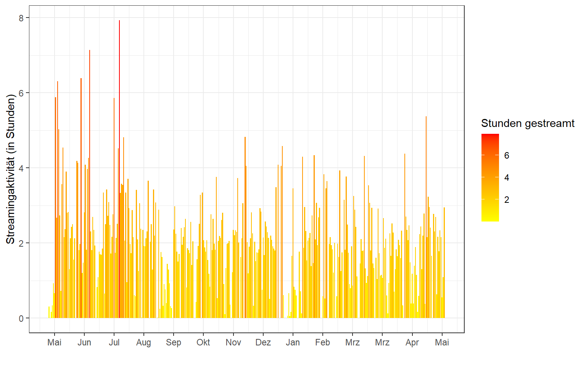
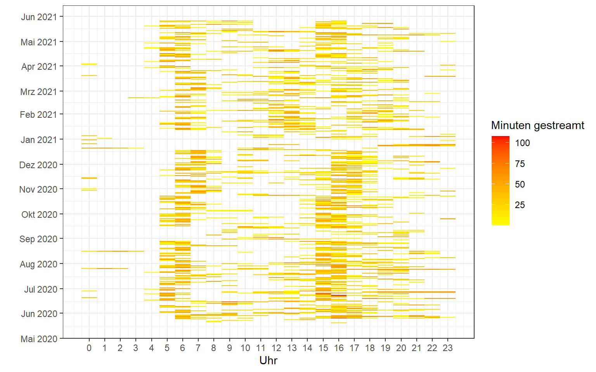

<script src="index_files/libs/kePrint-0.0.1/kePrint.js"></script>


Benötigte R-Pakete:

``` r
library(tidyverse)
library(jsonlite)
library(lubridate)
library(gghighlight)
```

## **Datenbeschaffung**

Vor kurzem hat meine Freundin beim Musikstreaminganbieter *Spotify* ihre Nutzerdaten beantragt und heruntergeladen. Eine Schritt-für-Schritt-Anleitung wie das funktioniert, findet man in seinen Account-Einstellungen unter [Datenschutz](https://www.spotify.com/de/account/privacy/). Laut Spotify umfasst der Downlad:

> "\[...\] eine Kopie deiner Playlists, deiner Suchanfragen, deines Streaming-Verlaufs des letzten Jahres, eine Liste der in deiner Bibliothek gespeicherten Elemente, die Zahl deiner Follower, die Zahl und die Namen der anderen Nutzer\*innen und Künstler\*innen, denen du folgst, sowie deine Zahlungs- und Abodaten."

Von Spotify bekommt man nach etwa 30 Tagen einen Link zu einer *.zip* Datei zur Verfügung gestellt, die ein Readme-PDF sowie mehrere *.json* Dateien enthält. Für die meisten Spotify-Nutzer\*innen ist das wahrscheinlich nicht das geläufigste Dateiformat. Die Dateien können zwar mit einem Texteditor betrachtet werden, jedoch lässt sich bspw. der *Streaming-Verlauf* aufgrund seiner Größe nicht gerade leicht erfassen.

<br>


Aus diesem Grund habe ich ein R-Skript erstellt, mit welchem die von Spotify zur Verfügung gestellten Dateien ausgewertet werden können.

## **Datenaufbereitung**

Zunächst lese ich den Streaming-Verlauf mit der Funktion `fromJSON()` aus dem R-Paket `jsonlite` ein. Abhängig von den eigenen Hörgewohnheiten kann es eine oder mehrere Dateien für den Streaming-Verlauf geben. Nach dem Einlesen der Dateien kombiniere ich die Verläufe zu einem einzigen Datenbestand.

``` r
streamVerlauf1 <- fromJSON("data/StreamingHistory0.json", flatten = TRUE)
streamVerlauf2 <- fromJSON("data/StreamingHistory1.json", flatten = TRUE)
streamVerlauf3 <- fromJSON("data/StreamingHistory2.json", flatten = TRUE)

streamVerlauf_spotify <- bind_rows(streamVerlauf1,
                                   streamVerlauf2,
                                   streamVerlauf3)
```

Unten ist ein Ausschnitt der Daten dargestellt, an dem man erkennt, dass jede Zeile in diesem Datensatz einen Zeitpunkt (`endTime`) repräsentiert an dem ein Musiktitel (`trackName`) eines Interpreten (`artistName`) abgespielt wurde. Auch die Abspieldauer des jeweiligen Titels vorhanden (`msPlayed`).

<br>

<div style="border: 1px solid #ddd; padding: 0px; overflow-y: scroll; height:300px; overflow-x: scroll; width:100%; ">

| endTime          | artistName            | trackName                                                                                 | msPlayed |
|:-----------------|:----------------------|:------------------------------------------------------------------------------------------|---------:|
| 2021-01-15 17:40 | Kate Bush             | Wuthering Heights                                                                         |   269066 |
| 2021-01-15 17:44 | Kate Nash             | Mariella                                                                                  |   255546 |
| 2021-01-15 17:47 | Maisie Peters         | In My Head                                                                                |   187827 |
| 2021-01-15 17:51 | Yeah Yeah Yeahs       | Heads Will Roll                                                                           |   221000 |
| 2021-01-15 17:54 | SUNMI                 | Siren                                                                                     |   199133 |
| 2021-01-15 17:58 | Stromae               | sommeil                                                                                   |   218653 |
| 2021-01-15 18:03 | Wir Sind Helden       | Ein Elefant für dich                                                                      |   282653 |
| 2021-01-15 18:05 | St. Vincent           | New York                                                                                  |   123035 |
| 2021-01-16 10:55 | Lorde                 | Hard Feelings/Loveless                                                                    |   367391 |
| 2021-01-16 10:58 | David Bowie           | Life on Mars? - 2015 Remaster                                                             |   133913 |
| 2021-01-16 11:14 | David Bowie           | Life on Mars? - 2015 Remaster                                                             |   235986 |
| 2021-01-16 11:17 | Ezra Furman           | Love You So Bad                                                                           |   219000 |
| 2021-01-16 11:21 | Frog                  | Judy Garland                                                                              |   217177 |
| 2021-01-16 11:24 | Wings                 | Live And Let Die                                                                          |   194613 |
| 2021-01-16 11:29 | Chappell Roan         | Pink Pony Club                                                                            |   258034 |
| 2021-01-16 11:32 | Kate Bush             | Babooshka - 2018 Remaster                                                                 |   199226 |
| 2021-01-16 11:33 | Dominic Fike          | 10x Stronger                                                                              |    75585 |
| 2021-01-16 11:37 | Lorde                 | Writer In The Dark                                                                        |   216610 |
| 2021-01-16 11:40 | BTS                   | Fly To My Room                                                                            |   222242 |
| 2021-01-16 11:44 | Halsey                | I HATE EVERYBODY                                                                          |   171015 |
| 2021-01-16 11:48 | Kate Bush             | Wuthering Heights                                                                         |   269066 |
| 2021-01-16 11:52 | Kate Nash             | Mariella                                                                                  |   255546 |
| 2021-01-16 11:56 | Maisie Peters         | In My Head                                                                                |   187827 |
| 2021-01-16 11:59 | Yeah Yeah Yeahs       | Heads Will Roll                                                                           |   221000 |
| 2021-01-16 12:03 | SUNMI                 | Siren                                                                                     |   199133 |
| 2021-01-16 12:06 | Stromae               | sommeil                                                                                   |   218653 |
| 2021-01-16 12:07 | Wir Sind Helden       | Ein Elefant für dich                                                                      |    50533 |
| 2021-01-16 12:11 | Wir Sind Helden       | Wenn es passiert                                                                          |   212360 |
| 2021-01-16 12:15 | Wir Sind Helden       | Echolot                                                                                   |   271386 |
| 2021-01-16 12:19 | Wir Sind Helden       | Von hier an blind                                                                         |   210666 |
| 2021-01-16 12:22 | Wir Sind Helden       | Zuhälter                                                                                  |   210306 |
| 2021-01-16 12:27 | Wir Sind Helden       | Ein Elefant für dich                                                                      |   282653 |
| 2021-01-16 12:30 | Wir Sind Helden       | Darf ich das behalten                                                                     |   198466 |
| 2021-01-16 12:36 | Wir Sind Helden       | Wütend genug                                                                              |   269386 |
| 2021-01-16 12:37 | Wir Sind Helden       | Geht auseinander                                                                          |    26645 |
| 2021-01-16 12:40 | Wir Sind Helden       | Gekommen um zu bleiben                                                                    |   190120 |
| 2021-01-16 12:44 | Wir Sind Helden       | Nur ein Wort                                                                              |   236200 |
| 2021-01-16 12:47 | Wir Sind Helden       | Ich werde ein Leben lang üben, dich so zu lieben, wie ich dich lieben will, wenn du gehst |   172240 |
| 2021-01-16 12:51 | Wir Sind Helden       | Bist du nicht müde                                                                        |   233653 |
| 2021-01-16 13:02 | BTS                   | Trivia \<U+8F49\> : Seesaw                                                                |   246334 |
| 2021-01-16 13:05 | j-hope                | P.O.P (Piece Of Peace) Pt. 1                                                              |   181113 |
| 2021-01-16 13:08 | Agust D               | People                                                                                    |   197000 |
| 2021-01-16 13:12 | BTS                   | Trivia \<U+627F\> : Love                                                                  |   225697 |
| 2021-01-16 13:16 | BTS                   | 134340                                                                                    |   230063 |
| 2021-01-16 13:17 | j-hope                | Blue Side (Outro)                                                                         |    90539 |
| 2021-01-16 13:21 | RM                    | everythingoes                                                                             |   222493 |
| 2021-01-16 13:25 | BTS                   | Go Go                                                                                     |   235779 |
| 2021-01-16 13:28 | BTS                   | Moon                                                                                      |   191346 |
| 2021-01-16 14:01 | Taylor Swift          | the 1                                                                                     |   101263 |
| 2021-01-17 12:18 | The Ronettes          | Be My Baby                                                                                |   160906 |
| 2021-01-17 12:22 | Eurythmics            | Sweet Dreams (Are Made of This) - Remastered                                              |   216933 |
| 2021-01-17 12:26 | Blondie               | Heart Of Glass                                                                            |   252186 |
| 2021-01-17 12:29 | The Beach Boys        | God Only Knows - Remastered 1997 / Mono                                                   |   173040 |
| 2021-01-17 12:31 | Bill Withers          | Ain\'t No Sunshine                                                                        |   125093 |
| 2021-01-17 12:36 | Paul Simon            | You Can Call Me Al                                                                        |   280000 |
| 2021-01-17 12:40 | Iggy Pop              | The Passenger                                                                             |   283360 |
| 2021-01-17 12:44 | Earth, Wind & Fire    | September                                                                                 |   215093 |
| 2021-01-17 12:48 | Jimi Hendrix          | All Along the Watchtower                                                                  |   240800 |
| 2021-01-17 12:51 | Solomon Burke         | Cry to Me                                                                                 |   154906 |
| 2021-01-17 12:53 | The Monkees           | I\'m a Believer - 2006 Remaster                                                           |   136933 |
| 2021-01-17 12:54 | The Monkees           | I\'m a Believer - 2006 Remaster                                                           |    30458 |
| 2021-01-17 12:56 | The Beach Boys        | Wouldn\'t It Be Nice - Stereo / Remastered                                                |   153205 |
| 2021-01-17 12:59 | Van Morrison          | Brown Eyed Girl                                                                           |   183506 |
| 2021-01-17 13:02 | The Mamas & The Papas | California Dreamin\' - Single Version                                                     |   162373 |
| 2021-01-17 13:05 | The Monkees           | Daydream Believer                                                                         |   179613 |
| 2021-01-17 13:07 | Little Peggy March    | I Will Follow Him                                                                         |   148160 |
| 2021-01-17 13:11 | Sonny & Cher          | I Got You Babe                                                                            |   190080 |
| 2021-01-17 13:14 | Steve Miller Band     | The Joker                                                                                 |   213480 |
| 2021-01-17 13:17 | Bruce Springsteen     | Hungry Heart                                                                              |   198973 |
| 2021-01-17 13:20 | Roy Orbison           | Oh, Pretty Woman                                                                          |   176840 |
| 2021-01-17 13:23 | The Archies           | Sugar Sugar                                                                               |   167213 |
| 2021-01-17 13:27 | The Who               | My Generation - Stereo Version                                                            |   198706 |
| 2021-01-17 13:31 | John Cale             | Paris 1919                                                                                |   246799 |
| 2021-01-17 13:34 | B.J. Thomas           | Raindrops Keep Fallin\' on My Head - Rerecorded                                           |   178146 |
| 2021-01-17 13:37 | The Monkees           | Daydream Believer                                                                         |   179613 |
| 2021-01-17 13:45 | Don McLean            | American Pie                                                                              |   516893 |
| 2021-01-17 13:48 | Johnny Nash           | I Can See Clearly Now - Edit                                                              |   164733 |
| 2021-01-18 05:02 | BTS                   | Life Goes On                                                                              |   207481 |
| 2021-01-18 05:06 | BTS                   | Fly To My Room                                                                            |   222242 |
| 2021-01-18 05:10 | BTS                   | Blue & Grey                                                                               |   254950 |
| 2021-01-18 05:14 | BTS                   | Telepathy                                                                                 |   202313 |
| 2021-01-18 05:18 | BTS                   | Dis-ease                                                                                  |   239722 |
| 2021-01-18 05:21 | BTS                   | Stay                                                                                      |   204800 |
| 2021-01-18 05:24 | BTS                   | Dynamite                                                                                  |   199053 |
| 2021-01-18 05:36 | BTS                   | Life Goes On                                                                              |   207481 |
| 2021-01-18 05:40 | BTS                   | Fly To My Room                                                                            |   222242 |
| 2021-01-18 05:44 | BTS                   | Blue & Grey                                                                               |   254950 |
| 2021-01-18 05:47 | BTS                   | Telepathy                                                                                 |   155572 |
| 2021-01-18 05:47 | BTS                   | Telepathy                                                                                 |    46756 |
| 2021-01-18 05:51 | BTS                   | Stay                                                                                      |   204800 |
| 2021-01-18 05:56 | BTS                   | Blue & Grey                                                                               |   254950 |
| 2021-01-18 05:59 | BTS                   | Life Goes On                                                                              |   207481 |
| 2021-01-18 06:02 | BTS                   | Fly To My Room                                                                            |   159413 |
| 2021-01-18 15:20 | BTS                   | Fly To My Room                                                                            |    62845 |
| 2021-01-18 15:20 | BTS                   | Telepathy                                                                                 |    36469 |
| 2021-01-18 15:25 | Epik High             | Rosario                                                                                   |   302323 |
| 2021-01-18 15:30 | Son Lux               | Easy (Switch Screens) \[feat. Lorde\]                                                     |   262521 |
| 2021-01-18 15:30 | Ezra Furman           | Restless Year                                                                             |    37458 |
| 2021-01-18 15:31 | Troye Sivan           | Easy (with Kacey Musgraves feat. Mark Ronson)                                             |    19904 |
| 2021-01-18 15:31 | JACKBOYS              | GATTI                                                                                     |    34534 |
| 2021-01-18 15:34 | Maisie Peters         | Maybe Don\'t (feat. JP Saxe) - HONNE Remix                                                |   175997 |

</div>

Bevor ich mit der Auswertung beginne, möchte ich noch die Datums- und Zeitangaben anpassen. Zum einen sollen die Spalte `endTime` getrennt werden, sodass ich je eine Spalte für das Datum und die Uhrzeit erhalte. Hierfür nutze ich die Funktion `ymd_hm()` aus dem R-Paket `lubridate`. Die Uhrzeit ist in den Rohdaten in der Zeitzone *UTC+0* codiert (@Spotify: das wäre eine nützliche Angabe im Readme gewesen), sodass ich noch eine Stunde für die Umwandlung in die *Mitteleuropäische Zeitzone (UTC+1)* addieren muss. Mit der Funktion `floor_date()` wird dann die Datums-/Zeitangabe auf den jeweiligen Tag gerundet. Die Abspieldauer wird zudem in Minuten umgewandelt (`mPlayed`).

``` r
streamVerlauf_spotify <- 
  streamVerlauf_spotify %>% 
  as_tibble() %>% 
  mutate(endTime_mez = ymd_hm(endTime) + hours(1),
         date = as_date(floor_date(endTime_mez, "day")), 
         mPlayed = round(msPlayed / (1000*60), digits = 2))
```

Die fertig aufbereiteten Daten sehen so aus:

<br>

<div style="border: 1px solid #ddd; padding: 0px; overflow-y: scroll; height:300px; overflow-x: scroll; width:100%; ">

| endTime          | artistName            | trackName                                                                                 | msPlayed | endTime_mez         | date       | mPlayed |
|:-----------------|:----------------------|:------------------------------------------------------------------------------------------|---------:|:--------------------|:-----------|--------:|
| 2021-01-15 17:40 | Kate Bush             | Wuthering Heights                                                                         |   269066 | 2021-01-15 18:40:00 | 2021-01-15 |    4.48 |
| 2021-01-15 17:44 | Kate Nash             | Mariella                                                                                  |   255546 | 2021-01-15 18:44:00 | 2021-01-15 |    4.26 |
| 2021-01-15 17:47 | Maisie Peters         | In My Head                                                                                |   187827 | 2021-01-15 18:47:00 | 2021-01-15 |    3.13 |
| 2021-01-15 17:51 | Yeah Yeah Yeahs       | Heads Will Roll                                                                           |   221000 | 2021-01-15 18:51:00 | 2021-01-15 |    3.68 |
| 2021-01-15 17:54 | SUNMI                 | Siren                                                                                     |   199133 | 2021-01-15 18:54:00 | 2021-01-15 |    3.32 |
| 2021-01-15 17:58 | Stromae               | sommeil                                                                                   |   218653 | 2021-01-15 18:58:00 | 2021-01-15 |    3.64 |
| 2021-01-15 18:03 | Wir Sind Helden       | Ein Elefant für dich                                                                      |   282653 | 2021-01-15 19:03:00 | 2021-01-15 |    4.71 |
| 2021-01-15 18:05 | St. Vincent           | New York                                                                                  |   123035 | 2021-01-15 19:05:00 | 2021-01-15 |    2.05 |
| 2021-01-16 10:55 | Lorde                 | Hard Feelings/Loveless                                                                    |   367391 | 2021-01-16 11:55:00 | 2021-01-16 |    6.12 |
| 2021-01-16 10:58 | David Bowie           | Life on Mars? - 2015 Remaster                                                             |   133913 | 2021-01-16 11:58:00 | 2021-01-16 |    2.23 |
| 2021-01-16 11:14 | David Bowie           | Life on Mars? - 2015 Remaster                                                             |   235986 | 2021-01-16 12:14:00 | 2021-01-16 |    3.93 |
| 2021-01-16 11:17 | Ezra Furman           | Love You So Bad                                                                           |   219000 | 2021-01-16 12:17:00 | 2021-01-16 |    3.65 |
| 2021-01-16 11:21 | Frog                  | Judy Garland                                                                              |   217177 | 2021-01-16 12:21:00 | 2021-01-16 |    3.62 |
| 2021-01-16 11:24 | Wings                 | Live And Let Die                                                                          |   194613 | 2021-01-16 12:24:00 | 2021-01-16 |    3.24 |
| 2021-01-16 11:29 | Chappell Roan         | Pink Pony Club                                                                            |   258034 | 2021-01-16 12:29:00 | 2021-01-16 |    4.30 |
| 2021-01-16 11:32 | Kate Bush             | Babooshka - 2018 Remaster                                                                 |   199226 | 2021-01-16 12:32:00 | 2021-01-16 |    3.32 |
| 2021-01-16 11:33 | Dominic Fike          | 10x Stronger                                                                              |    75585 | 2021-01-16 12:33:00 | 2021-01-16 |    1.26 |
| 2021-01-16 11:37 | Lorde                 | Writer In The Dark                                                                        |   216610 | 2021-01-16 12:37:00 | 2021-01-16 |    3.61 |
| 2021-01-16 11:40 | BTS                   | Fly To My Room                                                                            |   222242 | 2021-01-16 12:40:00 | 2021-01-16 |    3.70 |
| 2021-01-16 11:44 | Halsey                | I HATE EVERYBODY                                                                          |   171015 | 2021-01-16 12:44:00 | 2021-01-16 |    2.85 |
| 2021-01-16 11:48 | Kate Bush             | Wuthering Heights                                                                         |   269066 | 2021-01-16 12:48:00 | 2021-01-16 |    4.48 |
| 2021-01-16 11:52 | Kate Nash             | Mariella                                                                                  |   255546 | 2021-01-16 12:52:00 | 2021-01-16 |    4.26 |
| 2021-01-16 11:56 | Maisie Peters         | In My Head                                                                                |   187827 | 2021-01-16 12:56:00 | 2021-01-16 |    3.13 |
| 2021-01-16 11:59 | Yeah Yeah Yeahs       | Heads Will Roll                                                                           |   221000 | 2021-01-16 12:59:00 | 2021-01-16 |    3.68 |
| 2021-01-16 12:03 | SUNMI                 | Siren                                                                                     |   199133 | 2021-01-16 13:03:00 | 2021-01-16 |    3.32 |
| 2021-01-16 12:06 | Stromae               | sommeil                                                                                   |   218653 | 2021-01-16 13:06:00 | 2021-01-16 |    3.64 |
| 2021-01-16 12:07 | Wir Sind Helden       | Ein Elefant für dich                                                                      |    50533 | 2021-01-16 13:07:00 | 2021-01-16 |    0.84 |
| 2021-01-16 12:11 | Wir Sind Helden       | Wenn es passiert                                                                          |   212360 | 2021-01-16 13:11:00 | 2021-01-16 |    3.54 |
| 2021-01-16 12:15 | Wir Sind Helden       | Echolot                                                                                   |   271386 | 2021-01-16 13:15:00 | 2021-01-16 |    4.52 |
| 2021-01-16 12:19 | Wir Sind Helden       | Von hier an blind                                                                         |   210666 | 2021-01-16 13:19:00 | 2021-01-16 |    3.51 |
| 2021-01-16 12:22 | Wir Sind Helden       | Zuhälter                                                                                  |   210306 | 2021-01-16 13:22:00 | 2021-01-16 |    3.51 |
| 2021-01-16 12:27 | Wir Sind Helden       | Ein Elefant für dich                                                                      |   282653 | 2021-01-16 13:27:00 | 2021-01-16 |    4.71 |
| 2021-01-16 12:30 | Wir Sind Helden       | Darf ich das behalten                                                                     |   198466 | 2021-01-16 13:30:00 | 2021-01-16 |    3.31 |
| 2021-01-16 12:36 | Wir Sind Helden       | Wütend genug                                                                              |   269386 | 2021-01-16 13:36:00 | 2021-01-16 |    4.49 |
| 2021-01-16 12:37 | Wir Sind Helden       | Geht auseinander                                                                          |    26645 | 2021-01-16 13:37:00 | 2021-01-16 |    0.44 |
| 2021-01-16 12:40 | Wir Sind Helden       | Gekommen um zu bleiben                                                                    |   190120 | 2021-01-16 13:40:00 | 2021-01-16 |    3.17 |
| 2021-01-16 12:44 | Wir Sind Helden       | Nur ein Wort                                                                              |   236200 | 2021-01-16 13:44:00 | 2021-01-16 |    3.94 |
| 2021-01-16 12:47 | Wir Sind Helden       | Ich werde ein Leben lang üben, dich so zu lieben, wie ich dich lieben will, wenn du gehst |   172240 | 2021-01-16 13:47:00 | 2021-01-16 |    2.87 |
| 2021-01-16 12:51 | Wir Sind Helden       | Bist du nicht müde                                                                        |   233653 | 2021-01-16 13:51:00 | 2021-01-16 |    3.89 |
| 2021-01-16 13:02 | BTS                   | Trivia \<U+8F49\> : Seesaw                                                                |   246334 | 2021-01-16 14:02:00 | 2021-01-16 |    4.11 |
| 2021-01-16 13:05 | j-hope                | P.O.P (Piece Of Peace) Pt. 1                                                              |   181113 | 2021-01-16 14:05:00 | 2021-01-16 |    3.02 |
| 2021-01-16 13:08 | Agust D               | People                                                                                    |   197000 | 2021-01-16 14:08:00 | 2021-01-16 |    3.28 |
| 2021-01-16 13:12 | BTS                   | Trivia \<U+627F\> : Love                                                                  |   225697 | 2021-01-16 14:12:00 | 2021-01-16 |    3.76 |
| 2021-01-16 13:16 | BTS                   | 134340                                                                                    |   230063 | 2021-01-16 14:16:00 | 2021-01-16 |    3.83 |
| 2021-01-16 13:17 | j-hope                | Blue Side (Outro)                                                                         |    90539 | 2021-01-16 14:17:00 | 2021-01-16 |    1.51 |
| 2021-01-16 13:21 | RM                    | everythingoes                                                                             |   222493 | 2021-01-16 14:21:00 | 2021-01-16 |    3.71 |
| 2021-01-16 13:25 | BTS                   | Go Go                                                                                     |   235779 | 2021-01-16 14:25:00 | 2021-01-16 |    3.93 |
| 2021-01-16 13:28 | BTS                   | Moon                                                                                      |   191346 | 2021-01-16 14:28:00 | 2021-01-16 |    3.19 |
| 2021-01-16 14:01 | Taylor Swift          | the 1                                                                                     |   101263 | 2021-01-16 15:01:00 | 2021-01-16 |    1.69 |
| 2021-01-17 12:18 | The Ronettes          | Be My Baby                                                                                |   160906 | 2021-01-17 13:18:00 | 2021-01-17 |    2.68 |
| 2021-01-17 12:22 | Eurythmics            | Sweet Dreams (Are Made of This) - Remastered                                              |   216933 | 2021-01-17 13:22:00 | 2021-01-17 |    3.62 |
| 2021-01-17 12:26 | Blondie               | Heart Of Glass                                                                            |   252186 | 2021-01-17 13:26:00 | 2021-01-17 |    4.20 |
| 2021-01-17 12:29 | The Beach Boys        | God Only Knows - Remastered 1997 / Mono                                                   |   173040 | 2021-01-17 13:29:00 | 2021-01-17 |    2.88 |
| 2021-01-17 12:31 | Bill Withers          | Ain\'t No Sunshine                                                                        |   125093 | 2021-01-17 13:31:00 | 2021-01-17 |    2.08 |
| 2021-01-17 12:36 | Paul Simon            | You Can Call Me Al                                                                        |   280000 | 2021-01-17 13:36:00 | 2021-01-17 |    4.67 |
| 2021-01-17 12:40 | Iggy Pop              | The Passenger                                                                             |   283360 | 2021-01-17 13:40:00 | 2021-01-17 |    4.72 |
| 2021-01-17 12:44 | Earth, Wind & Fire    | September                                                                                 |   215093 | 2021-01-17 13:44:00 | 2021-01-17 |    3.58 |
| 2021-01-17 12:48 | Jimi Hendrix          | All Along the Watchtower                                                                  |   240800 | 2021-01-17 13:48:00 | 2021-01-17 |    4.01 |
| 2021-01-17 12:51 | Solomon Burke         | Cry to Me                                                                                 |   154906 | 2021-01-17 13:51:00 | 2021-01-17 |    2.58 |
| 2021-01-17 12:53 | The Monkees           | I\'m a Believer - 2006 Remaster                                                           |   136933 | 2021-01-17 13:53:00 | 2021-01-17 |    2.28 |
| 2021-01-17 12:54 | The Monkees           | I\'m a Believer - 2006 Remaster                                                           |    30458 | 2021-01-17 13:54:00 | 2021-01-17 |    0.51 |
| 2021-01-17 12:56 | The Beach Boys        | Wouldn\'t It Be Nice - Stereo / Remastered                                                |   153205 | 2021-01-17 13:56:00 | 2021-01-17 |    2.55 |
| 2021-01-17 12:59 | Van Morrison          | Brown Eyed Girl                                                                           |   183506 | 2021-01-17 13:59:00 | 2021-01-17 |    3.06 |
| 2021-01-17 13:02 | The Mamas & The Papas | California Dreamin\' - Single Version                                                     |   162373 | 2021-01-17 14:02:00 | 2021-01-17 |    2.71 |
| 2021-01-17 13:05 | The Monkees           | Daydream Believer                                                                         |   179613 | 2021-01-17 14:05:00 | 2021-01-17 |    2.99 |
| 2021-01-17 13:07 | Little Peggy March    | I Will Follow Him                                                                         |   148160 | 2021-01-17 14:07:00 | 2021-01-17 |    2.47 |
| 2021-01-17 13:11 | Sonny & Cher          | I Got You Babe                                                                            |   190080 | 2021-01-17 14:11:00 | 2021-01-17 |    3.17 |
| 2021-01-17 13:14 | Steve Miller Band     | The Joker                                                                                 |   213480 | 2021-01-17 14:14:00 | 2021-01-17 |    3.56 |
| 2021-01-17 13:17 | Bruce Springsteen     | Hungry Heart                                                                              |   198973 | 2021-01-17 14:17:00 | 2021-01-17 |    3.32 |
| 2021-01-17 13:20 | Roy Orbison           | Oh, Pretty Woman                                                                          |   176840 | 2021-01-17 14:20:00 | 2021-01-17 |    2.95 |
| 2021-01-17 13:23 | The Archies           | Sugar Sugar                                                                               |   167213 | 2021-01-17 14:23:00 | 2021-01-17 |    2.79 |
| 2021-01-17 13:27 | The Who               | My Generation - Stereo Version                                                            |   198706 | 2021-01-17 14:27:00 | 2021-01-17 |    3.31 |
| 2021-01-17 13:31 | John Cale             | Paris 1919                                                                                |   246799 | 2021-01-17 14:31:00 | 2021-01-17 |    4.11 |
| 2021-01-17 13:34 | B.J. Thomas           | Raindrops Keep Fallin\' on My Head - Rerecorded                                           |   178146 | 2021-01-17 14:34:00 | 2021-01-17 |    2.97 |
| 2021-01-17 13:37 | The Monkees           | Daydream Believer                                                                         |   179613 | 2021-01-17 14:37:00 | 2021-01-17 |    2.99 |
| 2021-01-17 13:45 | Don McLean            | American Pie                                                                              |   516893 | 2021-01-17 14:45:00 | 2021-01-17 |    8.61 |
| 2021-01-17 13:48 | Johnny Nash           | I Can See Clearly Now - Edit                                                              |   164733 | 2021-01-17 14:48:00 | 2021-01-17 |    2.75 |
| 2021-01-18 05:02 | BTS                   | Life Goes On                                                                              |   207481 | 2021-01-18 06:02:00 | 2021-01-18 |    3.46 |
| 2021-01-18 05:06 | BTS                   | Fly To My Room                                                                            |   222242 | 2021-01-18 06:06:00 | 2021-01-18 |    3.70 |
| 2021-01-18 05:10 | BTS                   | Blue & Grey                                                                               |   254950 | 2021-01-18 06:10:00 | 2021-01-18 |    4.25 |
| 2021-01-18 05:14 | BTS                   | Telepathy                                                                                 |   202313 | 2021-01-18 06:14:00 | 2021-01-18 |    3.37 |
| 2021-01-18 05:18 | BTS                   | Dis-ease                                                                                  |   239722 | 2021-01-18 06:18:00 | 2021-01-18 |    4.00 |
| 2021-01-18 05:21 | BTS                   | Stay                                                                                      |   204800 | 2021-01-18 06:21:00 | 2021-01-18 |    3.41 |
| 2021-01-18 05:24 | BTS                   | Dynamite                                                                                  |   199053 | 2021-01-18 06:24:00 | 2021-01-18 |    3.32 |
| 2021-01-18 05:36 | BTS                   | Life Goes On                                                                              |   207481 | 2021-01-18 06:36:00 | 2021-01-18 |    3.46 |
| 2021-01-18 05:40 | BTS                   | Fly To My Room                                                                            |   222242 | 2021-01-18 06:40:00 | 2021-01-18 |    3.70 |
| 2021-01-18 05:44 | BTS                   | Blue & Grey                                                                               |   254950 | 2021-01-18 06:44:00 | 2021-01-18 |    4.25 |
| 2021-01-18 05:47 | BTS                   | Telepathy                                                                                 |   155572 | 2021-01-18 06:47:00 | 2021-01-18 |    2.59 |
| 2021-01-18 05:47 | BTS                   | Telepathy                                                                                 |    46756 | 2021-01-18 06:47:00 | 2021-01-18 |    0.78 |
| 2021-01-18 05:51 | BTS                   | Stay                                                                                      |   204800 | 2021-01-18 06:51:00 | 2021-01-18 |    3.41 |
| 2021-01-18 05:56 | BTS                   | Blue & Grey                                                                               |   254950 | 2021-01-18 06:56:00 | 2021-01-18 |    4.25 |
| 2021-01-18 05:59 | BTS                   | Life Goes On                                                                              |   207481 | 2021-01-18 06:59:00 | 2021-01-18 |    3.46 |
| 2021-01-18 06:02 | BTS                   | Fly To My Room                                                                            |   159413 | 2021-01-18 07:02:00 | 2021-01-18 |    2.66 |
| 2021-01-18 15:20 | BTS                   | Fly To My Room                                                                            |    62845 | 2021-01-18 16:20:00 | 2021-01-18 |    1.05 |
| 2021-01-18 15:20 | BTS                   | Telepathy                                                                                 |    36469 | 2021-01-18 16:20:00 | 2021-01-18 |    0.61 |
| 2021-01-18 15:25 | Epik High             | Rosario                                                                                   |   302323 | 2021-01-18 16:25:00 | 2021-01-18 |    5.04 |
| 2021-01-18 15:30 | Son Lux               | Easy (Switch Screens) \[feat. Lorde\]                                                     |   262521 | 2021-01-18 16:30:00 | 2021-01-18 |    4.38 |
| 2021-01-18 15:30 | Ezra Furman           | Restless Year                                                                             |    37458 | 2021-01-18 16:30:00 | 2021-01-18 |    0.62 |
| 2021-01-18 15:31 | Troye Sivan           | Easy (with Kacey Musgraves feat. Mark Ronson)                                             |    19904 | 2021-01-18 16:31:00 | 2021-01-18 |    0.33 |
| 2021-01-18 15:31 | JACKBOYS              | GATTI                                                                                     |    34534 | 2021-01-18 16:31:00 | 2021-01-18 |    0.58 |
| 2021-01-18 15:34 | Maisie Peters         | Maybe Don\'t (feat. JP Saxe) - HONNE Remix                                                |   175997 | 2021-01-18 16:34:00 | 2021-01-18 |    2.93 |

</div>

## **Datenanalyse**

Zuerst möchte ich mir den Streaming-Verlauf über den gesamten Zeitraum anschauen. Mittels `scale_fill_gradient()` kann man eine Farbskala erstellen, wobei rot eine relativ hohe und gelb eine relativ niedrige Streaming-Aktivität darstellt.

``` r
streamVerlauf_spotify %>% 
  group_by(date) %>%
  summarize(hours = sum(mPlayed) / 60) %>% 
  arrange(date) %>% 
  ggplot(aes(x = date, y = hours)) + 
  geom_col(aes(fill = hours)) +
  scale_fill_gradient(low = "yellow", high = "red") + 
  scale_x_date(date_breaks = "4 weeks", date_labels = "%b") +
  labs(x = "", y = "Streamingaktivität (in Stunden)", fill = "Stunden gestreamt")
```



Besonders interessant finde ich den Höchstwert im Juli. Ich vermute, dass dieser auf meine Geburtstagsfeier zurückgeht, da meine Freundin an diesem Abend als Spotify-DJ engagiert war. Unten schränke ich den Auswertungszeitraum auf den Monat Juli ein und ändere die Skalierung der x-Achse, sodass die einzelnen Tage erkennbar sind.

``` r
streamVerlauf_spotify %>% 
  filter(date >= "2020-07-01" & date <= "2020-07-31") %>%
  group_by(date) %>%
  summarize(hours = sum(mPlayed) / 60) %>% 
  arrange(date) %>% 
  ggplot(aes(x = date, y = hours)) + 
  geom_col(aes(fill = hours)) +
  scale_fill_gradient(low = "yellow", high = "red") + 
  scale_x_date(date_breaks = "2 days", date_labels = "%d") +
  labs(x = "Juli", y = "Streamingaktivität (in Stunden)", fill = "Stunden gestreamt")
```


Der 25. Juli war ein Samstag und hier fand meine Geburtstagsfeier statt - danke für die Erinnerung Spotify. Lässt sich mit den Daten auch rekonstruieren wie lange die Feier ging? Hierfür schränke ich die Daten weiter auf den 25. Juli 16 Uhr bis zum 26. Juli 9 Uhr ein und summiere die Streaming-Aktivität für jede Stunde.

``` r
streamVerlauf_spotify %>% 
  filter(endTime_mez >= "2020-07-25 15:00:00" & 
         endTime_mez <= "2020-07-26 09:00:00") %>%
  group_by(date, hour = hour(endTime_mez)) %>%
  summarize(hours = sum(mPlayed) / 60) %>% 
  ggplot(aes(x = hour, y = hours)) + 
  geom_col(fill = "white", color = "black") +
  facet_grid(. ~ date) +
  scale_x_continuous(breaks = seq(0,24,2)) +
  scale_y_continuous(breaks = seq(0,1,0.5)) +
  labs(x = "Uhr", y = "Streamingaktivität (in Stunden)")
```


------------------------------------------------------------------------

Meine Freundin war besonders daran interessiert zu sehen, welche Künstler\*innen und Lieder sie am häufigsten auf Spotify angehört hat. Hierzu summiere ich für jeden Künstler\*in (`artistName`) die gestreamten Minuten (`mPlayed`) im gesamten Zeitraum auf und werte unten die Top-15 aus.

``` r
streamVerlauf_spotify %>%
  group_by(artistName) %>%
  summarise(hours = sum(mPlayed, na.rm = T)/60) %>%
  arrange(desc(hours)) %>%
  slice(1:15) %>%
  ggplot(data = .,
         aes(x = reorder(artistName, hours), 
             y = hours)) +
  geom_bar(stat ="identity", fill = "white", color = "black") +
  coord_flip() +
  scale_y_continuous(breaks = seq(0,110,10)) +
  labs(x = "", y = "Streamingaktivität (in Stunden)") +
  theme(legend.position = "none")
```


Die K-Pop Gruppe *BTS* hat es ihr besonders angetan und ihnen wurden umgerechnet über 4 Tage durchgehender Musikkonsum gewidmet. Welcher Fan bietet mehr?

Als nächstes schaue ich mir die Top 15 der gestreamten Musiktitel an. Damit man als Laie die Titel dem jeweiligen Interpreten zuordnen kann, erstelle ich mit der Funktion `str_c()` eine kombinierte Spalte aus Titel-/ und Künstlername.

``` r
streamVerlauf_spotify %>%
  mutate(track.artistName = str_c(trackName, " {",artistName,"}")) %>%
  group_by(track.artistName) %>%
  summarise(hours = sum(mPlayed, na.rm = T)/60) %>%
  arrange(desc(hours)) %>%
  slice(1:15) %>%
  ggplot(aes(x = reorder(track.artistName, hours), 
             y = hours)) +
  geom_bar(stat ="identity", fill = "white", color = "black") +
  coord_flip() +
  scale_y_continuous(breaks = seq(0,7,1)) +
  labs(x = "", y = "Streamingaktivität (in Stunden)") +
  theme(legend.position = "none")
```


Auch hier sind einige Titel der Gruppe *BTS* mit über 6 Stunden Abspielzeit im betrachteten Zeitraum an der Chartspitze vertreten.

------------------------------------------------------------------------

Wie intensiv hört man einen Interpreten im Zeitverlauf? Mit dem R-Paket `gghighlight` kann man in einem Liniendiagramm bestimmte Gruppen (`artistName`) hervorheben. Oft wechselt sich dabei ein Liebglingsinterpret mit dem anderen ab.

``` r
streamVerlauf_spotify %>% 
  group_by(artistName, date = floor_date(date, "month")) %>% 
  summarize(hours = sum(mPlayed) / 60) %>% 
  ggplot(aes(x = date, y = hours, 
             group = artistName, 
             color = artistName)) + 
  geom_line() +
  gghighlight(artistName %in% c("BTS","Taylor Swift",
                                "Halsey", "Agust D",
                                "Lorde", "Domoinic Fike")
              ) +
  scale_x_date(date_breaks = "1 month", date_labels = "%b") +
  labs(x = "", 
       y = "Streamingaktivität (in Stunden)")
```


------------------------------------------------------------------------

Zu welchen Tageszeiten hört meine Freundin am häufigsten Musik? Auch das lässt sich mit einer geeigneten Darstellungsmethode leicht beantworten. Mit der Funktion `geom_tile()` aus dem R-Paket `ggplot2` erstelle ich Rechtecke, welche die gesamte Streamingaktivität für jede Stunde eines Tags repräsentieren.

``` r
streamVerlauf_spotify %>% 
  group_by(date, hour = hour(endTime_mez)) %>% 
  summarize(minutesListened = sum(mPlayed)) %>% 
  ggplot(aes(x = hour, y = date, fill = minutesListened)) + 
  geom_tile() + 
  scale_fill_gradient(low = "yellow", high = "red") + 
  scale_x_continuous(breaks = seq(0,23,1)) +
  scale_y_date(date_breaks = "1 month", date_labels = "%b") +
  labs(x = "Uhr", y = "", fill = "Minuten gestreamt") 
```



Kopfhörer auf und ab in die Bahn. Besonders gut zu erkennen sind die täglichen Pendelzeiten zwischen Wohnung und Arbeitsstelle. Diese liegen von Juni bis Ende Oktober am Morgen meist zwischen 5 und 6 Uhr und am Nachmittag zwischen 15 und 16 Uhr. Zwischen November und April verschiebt sich die Streamingaktivität am Morgen und am Nachmittag erkennbar um eine Stunde nach vorne (in der dunklen Jahreszeit kommt man einfach etwas schwerer aus dem Bett).

Interessant aber auch etwas gruselig, was sich aus dem Spotify-Nutzerverhalten so alles erkennen lässt!
