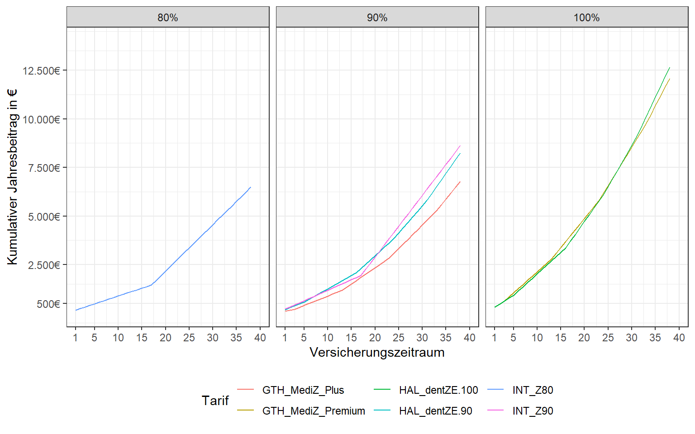
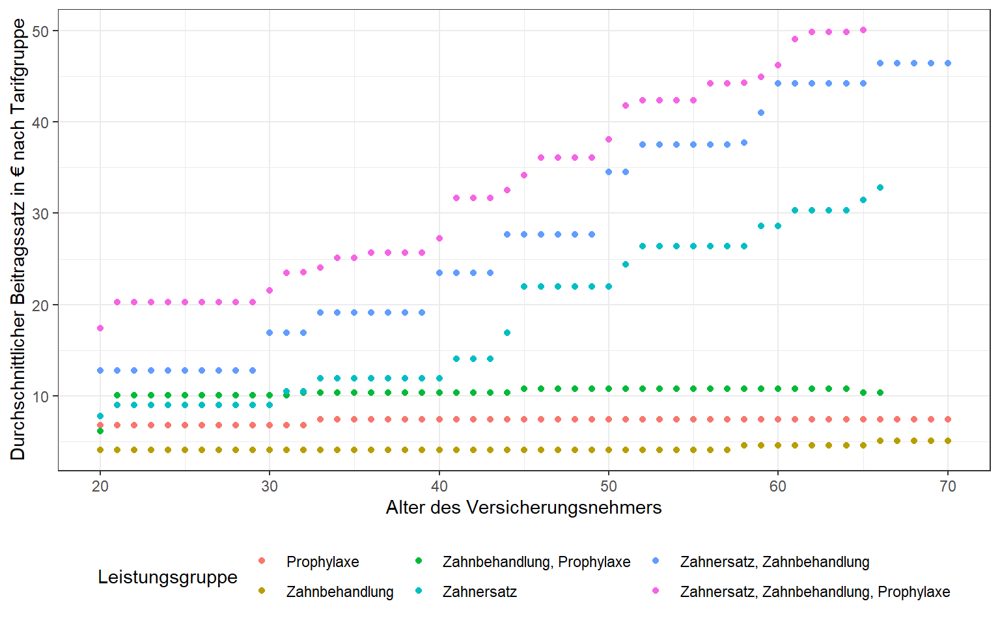

<script src="index_files/libs/kePrint-0.0.1/kePrint.js"></script>


Letztes Jahr hatte ich in einer Ausgabe der [Stiftung Warentest](https://www.test.de/) einen Artikel über *Zahnzusatzversicherungen* gelesen. Überzeugt von der Notwendigkeit dieser Versicherung, wollte ich mich mit einigen der im Test als gut befundenen Tarifen etwas genauer auseinandersetzen. Die Suche nach Details zu den einzelnen Tarifen gestaltete sich allerdings ziemlich aufwendig. Besonders gut versteckt sind dabei oft, die nach dem Alter des Versicherungsnehmers gestaffelten Beitragstabellen. Auch auf Wikipedia findet sich zu Zahnzusatzversicherungen folgender Eintrag:

> Auf dem deutschen Versicherungsmarkt gibt es über 300 unterschiedliche Zahnzusatzversicherungstarife.
> Die Ausgestaltung der Tarifdetails ist von Versicherer zu Versicherer so unterschiedlich, dass Vergleiche der Tarifgestaltungen für den Laien, aber auch für den Versicherungsmakler höchst schwierig sind.

Klare Worte von denen ich mich erst einmal nicht entmutigen lassen wollte! Bevor ich mit den Ausführungen zu meiner Analyse beginne, möchte ich darauf hinweisen, dass man die Entscheidung für oder gegen eine bestimmte Verischerung in erster Linie nach den eigenen Bedürfnissen ausrichten sollte. So kann bspw. nicht *nur* der monatliche Versicherungsbeitrag als Kriterium entscheident sein, wenn der Tarif dann eine bestimmte Komponente ausschließt, die für einen selbst besonders relevant ist. Andererseits unterscheidet sich die Leistung mancher Tarife auf den ersten Blick so wenig voneinander, dass auch die Kostenseite nicht vernachlässigt werden sollte. Ein anfänglich günstiger Tarif, besonders wenn man ihn in jungen Jahren abschließt, kann nach einigen Jahren bereits ziemlich teuer werden. Andere Tarife sind wiederum von Anfang an etwas teurer und steigen im Alter nur noch moderat an. Wie unterscheiden sich nun die Tarife im Preis für verschiedene Laufzeiten, bei sonst gleicher oder ähnlicher Leistung, voneinander?

## **Datenbeschaffung**

Ich habe zunächst die Tarifdetails verschiedener Anbieter im Internet recherhiert und die gefunden Informationen in eine Excel-Tabelle transferiert. Ein Tabellenblatt enthält dabei Allgemeines zum Tarif sowie das jeweilige Leistungsspektrum und ein weiteres Tabellenblatt die gestaffelten Beiträge nach Alter des Versicherungsnehmers pro Tarif.

## **Datenaufbereitung**

Meine recherhierten Informationen habe ich dann in zwei separaten .CSV Dateien gespeichert und in RStudio eingelesen. Unten finden sich allgemeine Informationen und das Leistungsspektrum der Versicherungstarife. Zudem habe ich versucht die Tarife anhand ihrer Leistung zu gruppieren (`Gruppe`). Weiterhin finden sich auch Informationen zu Sonderleistungen (`Veneers`) und bis zu welcher Kostenhöhe die Behandlung erstattungsfähig ist (`Grenze_Jahr_`).

<div style="border: 1px solid #ddd; padding: 0px; overflow-y: scroll; height:300px; overflow-x: scroll; width:100%; ">

| Versicherer               | Tarif                               | Gruppe                                 | Zahnersatz | Grenze_Jahr_1 | Grenze_Jahr_2 | Grenze_Jahr_3 | Grenze_Jahr_4 | Grenze_Jahr_5 | Wartezeit | Schmerzausschaltung | Kieferorthopädie | Veneers |
|:--------------------------|:------------------------------------|:---------------------------------------|:-----------|--------------:|--------------:|--------------:|--------------:|--------------:|:----------|:--------------------|:-----------------|:--------|
| inter Versicherungsgruppe | INT_Z90                             | Zahnersatz                             | 90%        |           750 |          1500 |          3000 |            NA |            NA | NA        | NA                  | ja               | nein    |
| inter Versicherungsgruppe | INT_Z80                             | Zahnersatz                             | 80%        |           750 |          1500 |          3000 |            NA |            NA | NA        | NA                  | ja               | nein    |
| inter Versicherungsgruppe | INT_ZPro                            | Zahnbehandlung, Prophylaxe             | NA         |           750 |          1500 |          3000 |            NA |            NA | NA        | ja                  | NA               | NA      |
| inter Versicherungsgruppe | INT_Z90_Zpro                        | Zahnersatz, Zahnbehandlung, Prophylaxe | 90%        |           750 |          1500 |          3000 |            NA |            NA | NA        | ja                  | ja               | nein    |
| inter Versicherungsgruppe | INT_Z80_Zpro                        | Zahnersatz, Zahnbehandlung, Prophylaxe | 80%        |            NA |            NA |            NA |            NA |            NA | NA        | NA                  | NA               | NA      |
| die Bayerische            | BAY_Zahn_Prestige                   | Zahnersatz, Zahnbehandlung, Prophylaxe | 100%       |          1250 |          2500 |          3750 |          5000 |            NA | keine     | ja                  | ja               | ja      |
| die Bayerische            | BAY_Zahn_Komfort                    | Zahnersatz, Zahnbehandlung, Prophylaxe | 90%        |          1250 |          2500 |          3750 |          5000 |            NA | 6 Monate  | ja                  | ja               | ja      |
| die Bayerische            | BAY_Zahn_Smart                      | Zahnersatz, Zahnbehandlung, Prophylaxe | 80%        |          1250 |          2500 |          3750 |          5000 |            NA | 6 Monate  | nein                | nein             | ja      |
| DKV                       | DKV_KDTP100                         | Zahnersatz, Zahnbehandlung             | 100%       |           600 |          1200 |          1800 |            NA |            NA | 8 Monate  | ja                  | NA               | ja      |
| DKV                       | DKV_KDT85                           | Zahnersatz, Zahnbehandlung             | 85%        |           500 |          1000 |          1500 |            NA |            NA | 8 Monate  | nein                | NA               | ja      |
| DKV                       | DKV_KDBE                            | Zahnbehandlung, Prophylaxe             | NA         |            NA |            NA |            NA |            NA |            NA | 8 Monate  | NA                  | ja               | NA      |
| DKV                       | DKV_KDTP100_KDBE                    | Zahnersatz, Zahnbehandlung, Prophylaxe | 100%       |           600 |          1200 |          1800 |            NA |            NA | NA        | ja                  | ja               | ja      |
| DKV                       | DKV_KDTP85_KDBE                     | Zahnersatz, Zahnbehandlung, Prophylaxe | 85%        |            NA |            NA |            NA |            NA |            NA | NA        | NA                  | NA               | NA      |
| Hallesche                 | HAL_dentZE.100                      | Zahnersatz                             | 100%       |          1000 |          2000 |          3000 |          4000 |          5000 | keine     | ja                  | NA               | nein    |
| Hallesche                 | HAL_dentZE.90                       | Zahnersatz                             | 90%        |          1000 |          2000 |          3000 |          4000 |          5000 | keine     | ja                  | NA               | nein    |
| Hallesche                 | HAL_dentZB.100                      | Zahnbehandlung                         | NA         |           500 |          1000 |          1500 |          2000 |          2500 | keine     | ja                  | ja               | NA      |
| Hallesche                 | HAL_dentPRO.80                      | Prophylaxe                             | NA         |            NA |            NA |            NA |            NA |            NA | keine     | NA                  | NA               | NA      |
| Hallesche                 | HAL_dentZE.100_dentZB.100_dentPRO80 | Zahnersatz, Zahnbehandlung, Prophylaxe | 100%       |            NA |            NA |            NA |            NA |            NA | NA        | NA                  | NA               | NA      |
| Hallesche                 | HAL_dentZE.100_dentZB.100           | Zahnersatz, Zahnbehandlung             | 100%       |            NA |            NA |            NA |            NA |            NA | NA        | NA                  | NA               | NA      |
| Hallesche                 | HAL_dentZE.90_dentZB.100_dentPRO80  | Zahnersatz, Zahnbehandlung, Prophylaxe | 90%        |            NA |            NA |            NA |            NA |            NA | NA        | NA                  | NA               | NA      |
| Hallesche                 | HAL_dentZE.90_dentZB.100            | Zahnersatz, Zahnbehandlung             | 90%        |            NA |            NA |            NA |            NA |            NA | NA        | NA                  | NA               | NA      |
| ARAG                      | ARA_Dent100                         | Zahnersatz, Zahnbehandlung, Prophylaxe | 100%       |          1500 |          3000 |          4500 |          6000 |          7500 | keine     | ja                  | ja               | nein    |
| ARAG                      | ARA_Dent90P                         | Zahnersatz, Zahnbehandlung, Prophylaxe | 90%        |          1000 |          2000 |          3000 |          4000 |          5000 | keine     | ja                  | nur bei Unfall   | nein    |
| ARAG                      | ARA_Dent90                          | Zahnersatz, Zahnbehandlung, Prophylaxe | 90%        |          1000 |          2000 |          3000 |          4000 |          5000 | keine     | nein                | nur bei Unfall   | nein    |
| ARAG                      | ARA_Dent70                          | Zahnersatz, Zahnbehandlung, Prophylaxe | 70%        |           500 |          1000 |          1500 |          2000 |          2500 | keine     | nein                | nein             | nein    |
| Allianz                   | ALL_DentalBest                      | Zahnersatz, Zahnbehandlung, Prophylaxe | 100%       |           900 |          1800 |          2700 |          3600 |            NA | 8 Monate  | ja                  | ja               | ja      |
| Allianz                   | ALL_DentalPlus                      | Zahnersatz, Zahnbehandlung, Prophylaxe | 90%        |           800 |          1600 |          2400 |          3200 |            NA | 8 Monate  | ja                  | ja               | ja      |
| DFV                       | DFV_Exklusiv                        | Zahnersatz, Zahnbehandlung, Prophylaxe | 100%       |          1000 |          2000 |          3000 |          4000 |            NA | keine     | ja                  | ja               | nein    |
| DFV                       | DFV_Premium                         | Zahnersatz, Zahnbehandlung, Prophylaxe | 90%        |           750 |          1500 |          2250 |          3000 |            NA | keine     | ja                  | ja               | nein    |
| Gothaer                   | GTH_MediZ_Premium                   | Zahnersatz                             | 100%       |           750 |           750 |          1500 |          2250 |            NA | keine     | nein                | ja               | ja      |
| Gothaer                   | GTH_MediZ_Plus                      | Zahnersatz                             | 90%        |            NA |            NA |            NA |            NA |            NA | keine     | nein                | nein             | nein    |
| Gothaer                   | GTH_Medi_Prophy                     | Zahnbehandlung, Prophylaxe             | NA         |            NA |            NA |            NA |            NA |            NA | keine     | nein                | NA               | NA      |
| Gothaer                   | GTH_MediZ_Premium_Medi_Prophy       | Zahnersatz, Zahnbehandlung, Prophylaxe | 100%       |            NA |            NA |            NA |            NA |            NA | NA        | NA                  | NA               | NA      |
| Gothaer                   | GTH_MediZ_Plus_Medi_Prophy          | Zahnersatz, Zahnbehandlung, Prophylaxe | 90%        |            NA |            NA |            NA |            NA |            NA | NA        | NA                  | NA               | NA      |
| UKV                       | UKV_Zahnprivat_Premium              | Zahnersatz, Zahnbehandlung, Prophylaxe | 90%        |          1000 |          3000 |          6000 |          9000 |            NA | keine     | ja                  | ja               | ja      |

</div>

------------------------------------------------------------------------

In der zweiten .CSV Datei habe ich die Beitragsentwicklung aller Tarife zwischen dem 20. und 70. Lebensjahr eingetragen.

<div style="border: 1px solid #ddd; padding: 0px; overflow-y: scroll; height:300px; overflow-x: scroll; width:100%; ">

| Alter | INT_Z90 | INT_Z80 | INT_ZPro | INT_Z90_Zpro | INT_Z80_Zpro | BAY_Zahn_Prestige | BAY_Zahn_Komfort | BAY_Zahn_Smart | DKV_KDTP100 | DKV_KDT85 | DKV_KDBE | DKV_KDTP100_KDBE | DKV_KDTP85_KDBE | HAL_dentZE.100 | HAL_dentZE.90 | HAL_dentZB.100 | HAL_dentPRO.80 | HAL_dentZE.100_dentZB.100_dentPRO80 | HAL_dentZE.100_dentZB.100 | HAL_dentZE.90_dentZB.100_dentPRO80 | HAL_dentZE.90_dentZB.100 | ARA_Dent100 | ARA_Dent90P | ARA_Dent90 | ARA_Dent70 | ALL_DentalBest | ALL_DentalPlus | DFV_Exklusiv | DFV_Premium | GTH_MediZ_Premium | GTH_MediZ_Plus | GTH_Medi_Prophy | GTH_MediZ_Premium_Medi_Prophy | GTH_MediZ_Plus_Medi_Prophy | UKV_Zahnprivat_Premium |
|------:|--------:|--------:|---------:|-------------:|-------------:|------------------:|-----------------:|---------------:|------------:|----------:|---------:|-----------------:|----------------:|---------------:|--------------:|---------------:|---------------:|------------------------------------:|--------------------------:|-----------------------------------:|-------------------------:|------------:|------------:|-----------:|-----------:|---------------:|---------------:|-------------:|------------:|------------------:|---------------:|----------------:|------------------------------:|---------------------------:|-----------------------:|
|    20 |    6.90 |    5.31 |     3.40 |        10.30 |         8.71 |              18.6 |             16.3 |            7.5 |       16.11 |      5.92 |     9.84 |            25.95 |           15.76 |           13.0 |           8.0 |            4.1 |            6.8 |                                23.9 |                      17.1 |                               18.9 |                     12.1 |       22.25 |       17.78 |      13.48 |      10.77 |          15.56 |          12.11 |         37.0 |        33.0 |             11.87 |           1.67 |            5.10 |                         16.97 |                       6.77 |                  16.64 |
|    21 |    9.00 |    6.75 |     9.83 |        18.83 |        16.58 |              25.0 |             21.5 |           14.3 |       16.11 |      5.92 |     9.84 |            25.95 |           15.76 |           13.0 |           8.0 |            4.1 |            6.8 |                                23.9 |                      17.1 |                               18.9 |                     12.1 |       37.36 |       20.47 |      18.43 |      11.19 |          21.92 |          14.68 |         23.5 |        21.5 |             13.00 |           4.39 |           10.45 |                         23.45 |                      14.84 |                  16.64 |
|    22 |    9.00 |    6.75 |     9.83 |        18.83 |        16.58 |              25.0 |             21.5 |           14.3 |       16.11 |      5.92 |     9.84 |            25.95 |           15.76 |           13.0 |           8.0 |            4.1 |            6.8 |                                23.9 |                      17.1 |                               18.9 |                     12.1 |       37.36 |       20.47 |      18.43 |      11.19 |          21.92 |          14.68 |         23.5 |        21.5 |             13.00 |           4.39 |           10.45 |                         23.45 |                      14.84 |                  16.64 |
|    23 |    9.00 |    6.75 |     9.83 |        18.83 |        16.58 |              25.0 |             21.5 |           14.3 |       16.11 |      5.92 |     9.84 |            25.95 |           15.76 |           13.0 |           8.0 |            4.1 |            6.8 |                                23.9 |                      17.1 |                               18.9 |                     12.1 |       37.36 |       20.47 |      18.43 |      11.19 |          21.92 |          14.68 |         23.5 |        21.5 |             13.00 |           4.39 |           10.45 |                         23.45 |                      14.84 |                  16.64 |
|    24 |    9.00 |    6.75 |     9.83 |        18.83 |        16.58 |              25.0 |             21.5 |           14.3 |       16.11 |      5.92 |     9.84 |            25.95 |           15.76 |           13.0 |           8.0 |            4.1 |            6.8 |                                23.9 |                      17.1 |                               18.9 |                     12.1 |       37.36 |       20.47 |      18.43 |      11.19 |          21.92 |          14.68 |         23.5 |        21.5 |             13.00 |           4.39 |           10.45 |                         23.45 |                      14.84 |                  16.64 |
|    25 |    9.00 |    6.75 |     9.83 |        18.83 |        16.58 |              25.0 |             21.5 |           14.3 |       16.11 |      5.92 |     9.84 |            25.95 |           15.76 |           13.0 |           8.0 |            4.1 |            6.8 |                                23.9 |                      17.1 |                               18.9 |                     12.1 |       37.36 |       20.47 |      18.43 |      11.19 |          21.92 |          14.68 |         23.5 |        21.5 |             13.00 |           4.39 |           10.45 |                         23.45 |                      14.84 |                  16.64 |
|    26 |    9.00 |    6.75 |     9.83 |        18.83 |        16.58 |              25.0 |             21.5 |           14.3 |       16.11 |      5.92 |     9.84 |            25.95 |           15.76 |           13.0 |           8.0 |            4.1 |            6.8 |                                23.9 |                      17.1 |                               18.9 |                     12.1 |       37.36 |       20.47 |      18.43 |      11.19 |          21.92 |          14.68 |         23.5 |        21.5 |             13.00 |           4.39 |           10.45 |                         23.45 |                      14.84 |                  16.64 |
|    27 |    9.00 |    6.75 |     9.83 |        18.83 |        16.58 |              25.0 |             21.5 |           14.3 |       16.11 |      5.92 |     9.84 |            25.95 |           15.76 |           13.0 |           8.0 |            4.1 |            6.8 |                                23.9 |                      17.1 |                               18.9 |                     12.1 |       37.36 |       20.47 |      18.43 |      11.19 |          21.92 |          14.68 |         23.5 |        21.5 |             13.00 |           4.39 |           10.45 |                         23.45 |                      14.84 |                  16.64 |
|    28 |    9.00 |    6.75 |     9.83 |        18.83 |        16.58 |              25.0 |             21.5 |           14.3 |       16.11 |      5.92 |     9.84 |            25.95 |           15.76 |           13.0 |           8.0 |            4.1 |            6.8 |                                23.9 |                      17.1 |                               18.9 |                     12.1 |       37.36 |       20.47 |      18.43 |      11.19 |          21.92 |          14.68 |         23.5 |        21.5 |             13.00 |           4.39 |           10.45 |                         23.45 |                      14.84 |                  16.64 |
|    29 |    9.00 |    6.75 |     9.83 |        18.83 |        16.58 |              25.0 |             21.5 |           14.3 |       16.11 |      5.92 |     9.84 |            25.95 |           15.76 |           13.0 |           8.0 |            4.1 |            6.8 |                                23.9 |                      17.1 |                               18.9 |                     12.1 |       37.36 |       20.47 |      18.43 |      11.19 |          21.92 |          14.68 |         23.5 |        21.5 |             13.00 |           4.39 |           10.45 |                         23.45 |                      14.84 |                  16.64 |
|    30 |    9.00 |    6.75 |     9.83 |        18.83 |        16.58 |              25.0 |             21.5 |           14.3 |       24.81 |     13.72 |     9.84 |            34.65 |           23.56 |           13.0 |           8.0 |            4.1 |            6.8 |                                23.9 |                      17.1 |                               18.9 |                     12.1 |       37.36 |       20.47 |      18.43 |      11.19 |          21.92 |          14.68 |         23.5 |        21.5 |             13.00 |           4.39 |           10.45 |                         23.45 |                      14.84 |                  26.85 |
|    31 |    9.00 |    6.75 |     9.83 |        18.83 |        16.58 |              32.6 |             21.5 |           14.3 |       24.81 |     13.72 |     9.84 |            34.65 |           23.56 |           13.0 |           8.0 |            4.1 |            6.8 |                                23.9 |                      17.1 |                               18.9 |                     12.1 |       37.36 |       20.47 |      18.43 |      11.19 |          21.92 |          14.68 |         34.5 |        32.0 |             18.00 |           8.07 |           10.45 |                         28.45 |                      18.52 |                  26.85 |
|    32 |    9.00 |    6.75 |     9.83 |        18.83 |        16.58 |              32.6 |             21.5 |           14.3 |       24.81 |     13.72 |     9.84 |            34.65 |           23.56 |           13.0 |           8.0 |            4.1 |            6.8 |                                23.9 |                      17.1 |                               18.9 |                     12.1 |       37.36 |       20.47 |      18.43 |      11.19 |          21.92 |          14.68 |         34.5 |        32.0 |             18.00 |           8.07 |           11.45 |                         29.45 |                      19.52 |                  26.85 |
|    33 |    9.00 |    6.75 |     9.83 |        18.83 |        16.58 |              32.6 |             21.5 |           14.3 |       24.81 |     13.72 |     9.84 |            34.65 |           23.56 |           18.4 |          11.4 |            4.1 |            7.4 |                                29.9 |                      22.5 |                               22.9 |                     15.5 |       37.36 |       20.47 |      18.43 |      11.19 |          21.92 |          14.68 |         34.5 |        32.0 |             18.00 |           8.07 |           11.45 |                         29.45 |                      19.52 |                  26.85 |
|    34 |    9.00 |    6.75 |     9.83 |        18.83 |        16.58 |              32.6 |             21.5 |           14.3 |       24.81 |     13.72 |     9.84 |            34.65 |           23.56 |           18.4 |          11.4 |            4.1 |            7.4 |                                29.9 |                      22.5 |                               22.9 |                     15.5 |       37.36 |       29.33 |      25.99 |      16.18 |          21.92 |          14.68 |         34.5 |        32.0 |             18.00 |           8.07 |           11.45 |                         29.45 |                      19.52 |                  26.85 |
|    35 |    9.00 |    6.75 |     9.83 |        18.83 |        16.58 |              32.6 |             21.5 |           14.3 |       24.81 |     13.72 |     9.84 |            34.65 |           23.56 |           18.4 |          11.4 |            4.1 |            7.4 |                                29.9 |                      22.5 |                               22.9 |                     15.5 |       37.36 |       29.33 |      25.99 |      16.18 |          21.92 |          14.68 |         34.5 |        32.0 |             18.00 |           8.07 |           11.45 |                         29.45 |                      19.52 |                  26.85 |
|    36 |    9.00 |    6.75 |     9.83 |        18.83 |        16.58 |              32.6 |             28.2 |           18.5 |       24.81 |     13.72 |     9.84 |            34.65 |           23.56 |           18.4 |          11.4 |            4.1 |            7.4 |                                29.9 |                      22.5 |                               22.9 |                     15.5 |       37.36 |       29.33 |      25.99 |      16.18 |          21.92 |          14.68 |         34.5 |        32.0 |             18.00 |           8.07 |           11.45 |                         29.45 |                      19.52 |                  26.85 |
|    37 |    9.00 |    6.75 |     9.83 |        18.83 |        16.58 |              32.6 |             28.2 |           18.5 |       24.81 |     13.72 |     9.84 |            34.65 |           23.56 |           18.4 |          11.4 |            4.1 |            7.4 |                                29.9 |                      22.5 |                               22.9 |                     15.5 |       37.36 |       29.33 |      25.99 |      16.18 |          21.92 |          14.68 |         34.5 |        32.0 |             18.00 |           8.07 |           11.45 |                         29.45 |                      19.52 |                  26.85 |
|    38 |    9.00 |    6.75 |     9.83 |        18.83 |        16.58 |              32.6 |             28.2 |           18.5 |       24.81 |     13.72 |     9.84 |            34.65 |           23.56 |           18.4 |          11.4 |            4.1 |            7.4 |                                29.9 |                      22.5 |                               22.9 |                     15.5 |       37.36 |       29.33 |      25.99 |      16.18 |          21.92 |          14.68 |         34.5 |        32.0 |             18.00 |           8.07 |           11.45 |                         29.45 |                      19.52 |                  26.85 |
|    39 |    9.00 |    6.75 |     9.83 |        18.83 |        16.58 |              32.6 |             28.2 |           18.5 |       24.81 |     13.72 |     9.84 |            34.65 |           23.56 |           18.4 |          11.4 |            4.1 |            7.4 |                                29.9 |                      22.5 |                               22.9 |                     15.5 |       37.36 |       29.33 |      25.99 |      16.18 |          21.92 |          14.68 |         34.5 |        32.0 |             18.00 |           8.07 |           11.45 |                         29.45 |                      19.52 |                  26.85 |
|    40 |    9.00 |    6.75 |     9.83 |        18.83 |        16.58 |              32.6 |             28.2 |           18.5 |       36.21 |     19.61 |     9.84 |            46.05 |           29.45 |           18.4 |          11.4 |            4.1 |            7.4 |                                29.9 |                      22.5 |                               22.9 |                     15.5 |       37.36 |       29.33 |      25.99 |      16.18 |          21.92 |          14.68 |         34.5 |        32.0 |             18.00 |           8.07 |           11.45 |                         29.45 |                      19.52 |                  40.68 |
|    41 |    9.00 |    6.75 |     9.83 |        18.83 |        16.58 |              41.4 |             31.9 |           20.9 |       36.21 |     19.61 |     9.84 |            46.05 |           29.45 |           18.4 |          11.4 |            4.1 |            7.4 |                                29.9 |                      22.5 |                               22.9 |                     15.5 |       53.44 |       35.75 |      31.37 |      19.71 |          30.93 |          20.71 |         43.0 |        38.0 |             25.00 |          13.87 |           11.45 |                         36.45 |                      25.32 |                  40.68 |
|    42 |    9.00 |    6.75 |     9.83 |        18.83 |        16.58 |              41.4 |             31.9 |           20.9 |       36.21 |     19.61 |     9.84 |            46.05 |           29.45 |           18.4 |          11.4 |            4.1 |            7.4 |                                29.9 |                      22.5 |                               22.9 |                     15.5 |       53.44 |       35.75 |      31.37 |      19.71 |          30.93 |          20.71 |         43.0 |        38.0 |             25.00 |          13.87 |           11.45 |                         36.45 |                      25.32 |                  40.68 |
|    43 |    9.00 |    6.75 |     9.83 |        18.83 |        16.58 |              41.4 |             31.9 |           20.9 |       36.21 |     19.61 |     9.84 |            46.05 |           29.45 |           18.4 |          11.4 |            4.1 |            7.4 |                                29.9 |                      22.5 |                               22.9 |                     15.5 |       53.44 |       35.75 |      31.37 |      19.71 |          30.93 |          20.71 |         43.0 |        38.0 |             25.00 |          13.87 |           11.45 |                         36.45 |                      25.32 |                  40.68 |
|    44 |    9.00 |    6.75 |     9.83 |        18.83 |        16.58 |              41.4 |             31.9 |           20.9 |       36.21 |     19.61 |     9.84 |            46.05 |           29.45 |           28.4 |          18.4 |            4.1 |            7.4 |                                39.9 |                      32.5 |                               29.9 |                     22.5 |       53.44 |       35.75 |      31.37 |      19.71 |          30.93 |          20.71 |         43.0 |        38.0 |             25.00 |          13.87 |           11.45 |                         36.45 |                      25.32 |                  40.68 |
|    45 |   26.45 |   19.88 |    11.07 |        37.52 |        30.95 |              41.4 |             31.9 |           20.9 |       36.21 |     19.61 |     9.84 |            46.05 |           29.45 |           28.4 |          18.4 |            4.1 |            7.4 |                                39.9 |                      32.5 |                               29.9 |                     22.5 |       53.44 |       35.75 |      31.37 |      19.71 |          30.93 |          20.71 |         43.0 |        38.0 |             25.00 |          13.87 |           11.45 |                         36.45 |                      25.32 |                  40.68 |
|    46 |   26.45 |   19.88 |    11.07 |        37.52 |        30.95 |              46.8 |             35.7 |           23.3 |       36.21 |     19.61 |     9.84 |            46.05 |           29.45 |           28.4 |          18.4 |            4.1 |            7.4 |                                39.9 |                      32.5 |                               29.9 |                     22.5 |       61.16 |       40.79 |      35.56 |      22.45 |          35.13 |          23.52 |         43.0 |        38.0 |             25.00 |          13.87 |           11.45 |                         36.45 |                      25.32 |                  40.68 |
|    47 |   26.45 |   19.88 |    11.07 |        37.52 |        30.95 |              46.8 |             35.7 |           23.3 |       36.21 |     19.61 |     9.84 |            46.05 |           29.45 |           28.4 |          18.4 |            4.1 |            7.4 |                                39.9 |                      32.5 |                               29.9 |                     22.5 |       61.16 |       40.79 |      35.56 |      22.45 |          35.13 |          23.52 |         43.0 |        38.0 |             25.00 |          13.87 |           11.45 |                         36.45 |                      25.32 |                  40.68 |
|    48 |   26.45 |   19.88 |    11.07 |        37.52 |        30.95 |              46.8 |             35.7 |           23.3 |       36.21 |     19.61 |     9.84 |            46.05 |           29.45 |           28.4 |          18.4 |            4.1 |            7.4 |                                39.9 |                      32.5 |                               29.9 |                     22.5 |       61.16 |       40.79 |      35.56 |      22.45 |          35.13 |          23.52 |         43.0 |        38.0 |             25.00 |          13.87 |           11.45 |                         36.45 |                      25.32 |                  40.68 |
|    49 |   26.45 |   19.88 |    11.07 |        37.52 |        30.95 |              46.8 |             35.7 |           23.3 |       36.21 |     19.61 |     9.84 |            46.05 |           29.45 |           28.4 |          18.4 |            4.1 |            7.4 |                                39.9 |                      32.5 |                               29.9 |                     22.5 |       61.16 |       40.79 |      35.56 |      22.45 |          35.13 |          23.52 |         43.0 |        38.0 |             25.00 |          13.87 |           11.45 |                         36.45 |                      25.32 |                  40.68 |
|    50 |   26.45 |   19.88 |    11.07 |        37.52 |        30.95 |              46.8 |             35.7 |           23.3 |       53.72 |     29.30 |     9.84 |            63.56 |           39.14 |           28.4 |          18.4 |            4.1 |            7.4 |                                39.9 |                      32.5 |                               29.9 |                     22.5 |       61.16 |       40.79 |      35.56 |      22.45 |          35.13 |          23.52 |         43.0 |        38.0 |             25.00 |          13.87 |           11.45 |                         36.45 |                      25.32 |                  53.42 |
|    51 |   26.45 |   19.88 |    11.07 |        37.52 |        30.95 |              54.4 |             41.0 |           26.6 |       53.72 |     29.30 |     9.84 |            63.56 |           39.14 |           28.4 |          18.4 |            4.1 |            7.4 |                                39.9 |                      32.5 |                               29.9 |                     22.5 |       69.13 |       45.93 |      39.79 |      25.23 |          38.71 |          25.92 |         51.5 |        47.0 |             33.00 |          20.31 |           11.45 |                         44.45 |                      31.76 |                  53.42 |
|    52 |   26.45 |   19.88 |    11.07 |        37.52 |        30.95 |              54.4 |             41.0 |           26.6 |       53.72 |     29.30 |     9.84 |            63.56 |           39.14 |           35.4 |          23.4 |            4.1 |            7.4 |                                46.9 |                      39.5 |                               34.9 |                     27.5 |       69.13 |       45.93 |      39.79 |      25.23 |          38.71 |          25.92 |         51.5 |        47.0 |             33.00 |          20.31 |           11.45 |                         44.45 |                      31.76 |                  53.42 |
|    53 |   26.45 |   19.88 |    11.07 |        37.52 |        30.95 |              54.4 |             41.0 |           26.6 |       53.72 |     29.30 |     9.84 |            63.56 |           39.14 |           35.4 |          23.4 |            4.1 |            7.4 |                                46.9 |                      39.5 |                               34.9 |                     27.5 |       69.13 |       45.93 |      39.79 |      25.23 |          38.71 |          25.92 |         51.5 |        47.0 |             33.00 |          20.31 |           11.45 |                         44.45 |                      31.76 |                  53.42 |
|    54 |   26.45 |   19.88 |    11.07 |        37.52 |        30.95 |              54.4 |             41.0 |           26.6 |       53.72 |     29.30 |     9.84 |            63.56 |           39.14 |           35.4 |          23.4 |            4.1 |            7.4 |                                46.9 |                      39.5 |                               34.9 |                     27.5 |       69.13 |       45.93 |      39.79 |      25.23 |          38.71 |          25.92 |         51.5 |        47.0 |             33.00 |          20.31 |           11.45 |                         44.45 |                      31.76 |                  53.42 |
|    55 |   26.45 |   19.88 |    11.07 |        37.52 |        30.95 |              54.4 |             41.0 |           26.6 |       53.72 |     29.30 |     9.84 |            63.56 |           39.14 |           35.4 |          23.4 |            4.1 |            7.4 |                                46.9 |                      39.5 |                               34.9 |                     27.5 |       69.13 |       45.93 |      39.79 |      25.23 |          38.71 |          25.92 |         51.5 |        47.0 |             33.00 |          20.31 |           11.45 |                         44.45 |                      31.76 |                  53.42 |
|    56 |   26.45 |   19.88 |    11.07 |        37.52 |        30.95 |              59.9 |             44.8 |           29.0 |       53.72 |     29.30 |     9.84 |            63.56 |           39.14 |           35.4 |          23.4 |            4.1 |            7.4 |                                46.9 |                      39.5 |                               34.9 |                     27.5 |       76.49 |       50.71 |      43.76 |      27.83 |          42.46 |          28.43 |         51.5 |        47.0 |             33.00 |          20.31 |           11.45 |                         44.45 |                      31.76 |                  53.42 |
|    57 |   26.45 |   19.88 |    11.07 |        37.52 |        30.95 |              59.9 |             44.8 |           29.0 |       53.72 |     29.30 |     9.84 |            63.56 |           39.14 |           35.4 |          23.4 |            4.1 |            7.4 |                                46.9 |                      39.5 |                               34.9 |                     27.5 |       76.49 |       50.71 |      43.76 |      27.83 |          42.46 |          28.43 |         51.5 |        47.0 |             33.00 |          20.31 |           11.45 |                         44.45 |                      31.76 |                  53.42 |
|    58 |   26.45 |   19.88 |    11.07 |        37.52 |        30.95 |              59.9 |             44.8 |           29.0 |       53.72 |     29.30 |     9.84 |            63.56 |           39.14 |           35.4 |          23.4 |            4.6 |            7.4 |                                47.4 |                      40.0 |                               35.4 |                     28.0 |       76.49 |       50.71 |      43.76 |      27.83 |          42.46 |          28.43 |         51.5 |        47.0 |             33.00 |          20.31 |           11.45 |                         44.45 |                      31.76 |                  53.42 |
|    59 |   26.45 |   19.88 |    11.07 |        37.52 |        30.95 |              59.9 |             44.8 |           29.0 |       53.72 |     29.30 |     9.84 |            63.56 |           39.14 |           42.9 |          28.9 |            4.6 |            7.4 |                                54.9 |                      47.5 |                               40.9 |                     33.5 |       76.49 |       50.71 |      43.76 |      27.83 |          42.46 |          28.43 |         51.5 |        47.0 |             33.00 |          20.31 |           11.45 |                         44.45 |                      31.76 |                  53.42 |
|    60 |   26.45 |   19.88 |    11.07 |        37.52 |        30.95 |              59.9 |             44.8 |           29.0 |       63.92 |     31.94 |     9.84 |            73.76 |           41.78 |           42.9 |          28.9 |            4.6 |            7.4 |                                54.9 |                      47.5 |                               40.9 |                     33.5 |       76.49 |       50.71 |      43.76 |      27.83 |          42.46 |          28.43 |         51.5 |        47.0 |             33.00 |          20.31 |           11.45 |                         44.45 |                      31.76 |                  66.03 |
|    61 |   26.45 |   19.88 |    11.07 |        37.52 |        30.95 |              50.5 |             49.1 |           31.7 |       63.92 |     31.94 |     9.84 |            73.76 |           41.78 |           42.9 |          28.9 |            4.6 |            7.4 |                                54.9 |                      47.5 |                               40.9 |                     33.5 |       84.76 |       56.12 |      48.37 |      30.80 |          44.77 |          29.98 |         64.0 |        58.5 |             39.00 |          24.96 |           11.45 |                         50.45 |                      36.41 |                  66.03 |
|    62 |   26.45 |   19.88 |    11.07 |        37.52 |        30.95 |              66.2 |             49.1 |           31.7 |       63.92 |     31.94 |     9.84 |            73.76 |           41.78 |           42.9 |          28.9 |            4.6 |            7.4 |                                54.9 |                      47.5 |                               40.9 |                     33.5 |       84.76 |       56.12 |      48.37 |      30.80 |          44.77 |          29.98 |         64.0 |        58.5 |             39.00 |          24.96 |           11.45 |                         50.45 |                      36.41 |                  66.03 |
|    63 |   26.45 |   19.88 |    11.07 |        37.52 |        30.95 |              66.2 |             49.1 |           31.7 |       63.92 |     31.94 |     9.84 |            73.76 |           41.78 |           42.9 |          28.9 |            4.6 |            7.4 |                                54.9 |                      47.5 |                               40.9 |                     33.5 |       84.76 |       56.12 |      48.37 |      30.80 |          44.77 |          29.98 |         64.0 |        58.5 |             39.00 |          24.96 |           11.45 |                         50.45 |                      36.41 |                  66.03 |
|    64 |   26.45 |   19.88 |    11.07 |        37.52 |        30.95 |              66.2 |             49.1 |           31.7 |       63.92 |     31.94 |     9.84 |            73.76 |           41.78 |           42.9 |          28.9 |            4.6 |            7.4 |                                54.9 |                      47.5 |                               40.9 |                     33.5 |       84.76 |       56.12 |      48.37 |      30.80 |          44.77 |          29.98 |         64.0 |        58.5 |             39.00 |          24.96 |           11.45 |                         50.45 |                      36.41 |                  66.03 |
|    65 |   29.73 |   23.32 |     9.69 |        39.42 |        33.01 |              66.2 |             49.1 |           31.7 |       63.92 |     31.94 |     9.84 |            73.76 |           41.78 |           42.9 |          28.9 |            4.6 |            7.4 |                                54.9 |                      47.5 |                               40.9 |                     33.5 |       84.76 |       56.12 |      48.37 |      30.80 |          44.77 |          29.98 |         64.0 |        58.5 |             39.00 |          24.96 |           11.45 |                         50.45 |                      36.41 |                  66.03 |
|    66 |   29.73 |   23.32 |     9.69 |        39.42 |        33.01 |              67.5 |             50.1 |           32.4 |       63.92 |     31.94 |     9.84 |            73.76 |           41.78 |           47.4 |          32.4 |            5.1 |            7.4 |                                59.9 |                      52.5 |                               44.9 |                     37.5 |          NA |          NA |         NA |         NA |          44.77 |          29.98 |         64.0 |        58.5 |             39.00 |          24.96 |           11.45 |                         50.45 |                      36.41 |                  66.03 |
|    67 |   29.73 |   23.32 |     9.69 |        39.42 |        33.01 |              67.5 |             50.1 |           32.4 |       63.92 |     31.94 |     9.84 |            73.76 |           41.78 |           47.4 |          32.4 |            5.1 |            7.4 |                                59.9 |                      52.5 |                               44.9 |                     37.5 |          NA |          NA |         NA |         NA |          44.77 |          29.98 |         64.0 |        58.5 |                NA |             NA |              NA |                            NA |                         NA |                  66.03 |
|    68 |   29.73 |   23.32 |     9.69 |        39.42 |        33.01 |              67.5 |             50.1 |           32.4 |       63.92 |     31.94 |     9.84 |            73.76 |           41.78 |           47.4 |          32.4 |            5.1 |            7.4 |                                59.9 |                      52.5 |                               44.9 |                     37.5 |          NA |          NA |         NA |         NA |          44.77 |          29.98 |         64.0 |        58.5 |                NA |             NA |              NA |                            NA |                         NA |                  66.03 |
|    69 |   29.73 |   23.32 |     9.69 |        39.42 |        33.01 |              67.5 |             50.1 |           32.4 |       63.92 |     31.94 |     9.84 |            73.76 |           41.78 |           47.4 |          32.4 |            5.1 |            7.4 |                                59.9 |                      52.5 |                               44.9 |                     37.5 |          NA |          NA |         NA |         NA |          44.77 |          29.98 |         64.0 |        58.5 |                NA |             NA |              NA |                            NA |                         NA |                  66.03 |
|    70 |   29.73 |   23.32 |     9.69 |        39.42 |        33.01 |              67.5 |             50.1 |           32.4 |       63.92 |     31.94 |     9.84 |            73.76 |           41.78 |           47.4 |          32.4 |            5.1 |            7.4 |                                59.9 |                      52.5 |                               44.9 |                     37.5 |          NA |          NA |         NA |         NA |          44.77 |          29.98 |         64.0 |        58.5 |                NA |             NA |              NA |                            NA |                         NA |                  66.03 |

</div>

Die Beiträge befinden sich im *Wide-Format* - also jede Spalte enthält einen Tarif mit dem Beitragssatz zum jeweiligen Alter der Versicherungsnehmerin. Für die weitere Analyse wandle ich den Datensatz ins *Long-Format* um. Weiterhin generiere ich eine Spalte für den jährlich fälligen Beitrag und ergänze den Datensatz mit den Beiträgen um einige allgemeine Tarifinformationen.

``` r
# Reshapen der Beitrage Wide to Long
Beitrag.Long <- gather(Beitrag.Wide, -Alter, 
                              key = "Tarif", 
                              value = "Beitrag")

# Jahresbeitrag generieren
Beitrag.Long <- Beitrag.Long %>%
  mutate(Beitrag_Jahr = Beitrag*12) 

# Allgemeine Tarifmerkmale anspielen
Tarife.Beitrag <- Tarife %>%
  select(Versicherer, Tarif, Gruppe, Zahnersatz) %>%
  left_join(Beitrag.Long, by="Tarif") %>%
  as_tibble()
```

Die Daten sehen nun so aus:

<div style="border: 1px solid #ddd; padding: 0px; overflow-y: scroll; height:300px; overflow-x: scroll; width:100%; ">

| Versicherer               | Tarif   | Gruppe     | Zahnersatz | Alter | Beitrag | Beitrag_Jahr |
|:--------------------------|:--------|:-----------|:-----------|------:|--------:|-------------:|
| inter Versicherungsgruppe | INT_Z90 | Zahnersatz | 90%        |    20 |    6.90 |        82.80 |
| inter Versicherungsgruppe | INT_Z90 | Zahnersatz | 90%        |    21 |    9.00 |       108.00 |
| inter Versicherungsgruppe | INT_Z90 | Zahnersatz | 90%        |    22 |    9.00 |       108.00 |
| inter Versicherungsgruppe | INT_Z90 | Zahnersatz | 90%        |    23 |    9.00 |       108.00 |
| inter Versicherungsgruppe | INT_Z90 | Zahnersatz | 90%        |    24 |    9.00 |       108.00 |
| inter Versicherungsgruppe | INT_Z90 | Zahnersatz | 90%        |    25 |    9.00 |       108.00 |
| inter Versicherungsgruppe | INT_Z90 | Zahnersatz | 90%        |    26 |    9.00 |       108.00 |
| inter Versicherungsgruppe | INT_Z90 | Zahnersatz | 90%        |    27 |    9.00 |       108.00 |
| inter Versicherungsgruppe | INT_Z90 | Zahnersatz | 90%        |    28 |    9.00 |       108.00 |
| inter Versicherungsgruppe | INT_Z90 | Zahnersatz | 90%        |    29 |    9.00 |       108.00 |
| inter Versicherungsgruppe | INT_Z90 | Zahnersatz | 90%        |    30 |    9.00 |       108.00 |
| inter Versicherungsgruppe | INT_Z90 | Zahnersatz | 90%        |    31 |    9.00 |       108.00 |
| inter Versicherungsgruppe | INT_Z90 | Zahnersatz | 90%        |    32 |    9.00 |       108.00 |
| inter Versicherungsgruppe | INT_Z90 | Zahnersatz | 90%        |    33 |    9.00 |       108.00 |
| inter Versicherungsgruppe | INT_Z90 | Zahnersatz | 90%        |    34 |    9.00 |       108.00 |
| inter Versicherungsgruppe | INT_Z90 | Zahnersatz | 90%        |    35 |    9.00 |       108.00 |
| inter Versicherungsgruppe | INT_Z90 | Zahnersatz | 90%        |    36 |    9.00 |       108.00 |
| inter Versicherungsgruppe | INT_Z90 | Zahnersatz | 90%        |    37 |    9.00 |       108.00 |
| inter Versicherungsgruppe | INT_Z90 | Zahnersatz | 90%        |    38 |    9.00 |       108.00 |
| inter Versicherungsgruppe | INT_Z90 | Zahnersatz | 90%        |    39 |    9.00 |       108.00 |
| inter Versicherungsgruppe | INT_Z90 | Zahnersatz | 90%        |    40 |    9.00 |       108.00 |
| inter Versicherungsgruppe | INT_Z90 | Zahnersatz | 90%        |    41 |    9.00 |       108.00 |
| inter Versicherungsgruppe | INT_Z90 | Zahnersatz | 90%        |    42 |    9.00 |       108.00 |
| inter Versicherungsgruppe | INT_Z90 | Zahnersatz | 90%        |    43 |    9.00 |       108.00 |
| inter Versicherungsgruppe | INT_Z90 | Zahnersatz | 90%        |    44 |    9.00 |       108.00 |
| inter Versicherungsgruppe | INT_Z90 | Zahnersatz | 90%        |    45 |   26.45 |       317.40 |
| inter Versicherungsgruppe | INT_Z90 | Zahnersatz | 90%        |    46 |   26.45 |       317.40 |
| inter Versicherungsgruppe | INT_Z90 | Zahnersatz | 90%        |    47 |   26.45 |       317.40 |
| inter Versicherungsgruppe | INT_Z90 | Zahnersatz | 90%        |    48 |   26.45 |       317.40 |
| inter Versicherungsgruppe | INT_Z90 | Zahnersatz | 90%        |    49 |   26.45 |       317.40 |
| inter Versicherungsgruppe | INT_Z90 | Zahnersatz | 90%        |    50 |   26.45 |       317.40 |
| inter Versicherungsgruppe | INT_Z90 | Zahnersatz | 90%        |    51 |   26.45 |       317.40 |
| inter Versicherungsgruppe | INT_Z90 | Zahnersatz | 90%        |    52 |   26.45 |       317.40 |
| inter Versicherungsgruppe | INT_Z90 | Zahnersatz | 90%        |    53 |   26.45 |       317.40 |
| inter Versicherungsgruppe | INT_Z90 | Zahnersatz | 90%        |    54 |   26.45 |       317.40 |
| inter Versicherungsgruppe | INT_Z90 | Zahnersatz | 90%        |    55 |   26.45 |       317.40 |
| inter Versicherungsgruppe | INT_Z90 | Zahnersatz | 90%        |    56 |   26.45 |       317.40 |
| inter Versicherungsgruppe | INT_Z90 | Zahnersatz | 90%        |    57 |   26.45 |       317.40 |
| inter Versicherungsgruppe | INT_Z90 | Zahnersatz | 90%        |    58 |   26.45 |       317.40 |
| inter Versicherungsgruppe | INT_Z90 | Zahnersatz | 90%        |    59 |   26.45 |       317.40 |
| inter Versicherungsgruppe | INT_Z90 | Zahnersatz | 90%        |    60 |   26.45 |       317.40 |
| inter Versicherungsgruppe | INT_Z90 | Zahnersatz | 90%        |    61 |   26.45 |       317.40 |
| inter Versicherungsgruppe | INT_Z90 | Zahnersatz | 90%        |    62 |   26.45 |       317.40 |
| inter Versicherungsgruppe | INT_Z90 | Zahnersatz | 90%        |    63 |   26.45 |       317.40 |
| inter Versicherungsgruppe | INT_Z90 | Zahnersatz | 90%        |    64 |   26.45 |       317.40 |
| inter Versicherungsgruppe | INT_Z90 | Zahnersatz | 90%        |    65 |   29.73 |       356.76 |
| inter Versicherungsgruppe | INT_Z90 | Zahnersatz | 90%        |    66 |   29.73 |       356.76 |
| inter Versicherungsgruppe | INT_Z90 | Zahnersatz | 90%        |    67 |   29.73 |       356.76 |
| inter Versicherungsgruppe | INT_Z90 | Zahnersatz | 90%        |    68 |   29.73 |       356.76 |
| inter Versicherungsgruppe | INT_Z90 | Zahnersatz | 90%        |    69 |   29.73 |       356.76 |
| inter Versicherungsgruppe | INT_Z90 | Zahnersatz | 90%        |    70 |   29.73 |       356.76 |
| inter Versicherungsgruppe | INT_Z80 | Zahnersatz | 80%        |    20 |    5.31 |        63.72 |
| inter Versicherungsgruppe | INT_Z80 | Zahnersatz | 80%        |    21 |    6.75 |        81.00 |
| inter Versicherungsgruppe | INT_Z80 | Zahnersatz | 80%        |    22 |    6.75 |        81.00 |
| inter Versicherungsgruppe | INT_Z80 | Zahnersatz | 80%        |    23 |    6.75 |        81.00 |
| inter Versicherungsgruppe | INT_Z80 | Zahnersatz | 80%        |    24 |    6.75 |        81.00 |
| inter Versicherungsgruppe | INT_Z80 | Zahnersatz | 80%        |    25 |    6.75 |        81.00 |
| inter Versicherungsgruppe | INT_Z80 | Zahnersatz | 80%        |    26 |    6.75 |        81.00 |
| inter Versicherungsgruppe | INT_Z80 | Zahnersatz | 80%        |    27 |    6.75 |        81.00 |
| inter Versicherungsgruppe | INT_Z80 | Zahnersatz | 80%        |    28 |    6.75 |        81.00 |
| inter Versicherungsgruppe | INT_Z80 | Zahnersatz | 80%        |    29 |    6.75 |        81.00 |
| inter Versicherungsgruppe | INT_Z80 | Zahnersatz | 80%        |    30 |    6.75 |        81.00 |
| inter Versicherungsgruppe | INT_Z80 | Zahnersatz | 80%        |    31 |    6.75 |        81.00 |
| inter Versicherungsgruppe | INT_Z80 | Zahnersatz | 80%        |    32 |    6.75 |        81.00 |
| inter Versicherungsgruppe | INT_Z80 | Zahnersatz | 80%        |    33 |    6.75 |        81.00 |
| inter Versicherungsgruppe | INT_Z80 | Zahnersatz | 80%        |    34 |    6.75 |        81.00 |
| inter Versicherungsgruppe | INT_Z80 | Zahnersatz | 80%        |    35 |    6.75 |        81.00 |
| inter Versicherungsgruppe | INT_Z80 | Zahnersatz | 80%        |    36 |    6.75 |        81.00 |
| inter Versicherungsgruppe | INT_Z80 | Zahnersatz | 80%        |    37 |    6.75 |        81.00 |
| inter Versicherungsgruppe | INT_Z80 | Zahnersatz | 80%        |    38 |    6.75 |        81.00 |
| inter Versicherungsgruppe | INT_Z80 | Zahnersatz | 80%        |    39 |    6.75 |        81.00 |
| inter Versicherungsgruppe | INT_Z80 | Zahnersatz | 80%        |    40 |    6.75 |        81.00 |
| inter Versicherungsgruppe | INT_Z80 | Zahnersatz | 80%        |    41 |    6.75 |        81.00 |
| inter Versicherungsgruppe | INT_Z80 | Zahnersatz | 80%        |    42 |    6.75 |        81.00 |
| inter Versicherungsgruppe | INT_Z80 | Zahnersatz | 80%        |    43 |    6.75 |        81.00 |
| inter Versicherungsgruppe | INT_Z80 | Zahnersatz | 80%        |    44 |    6.75 |        81.00 |
| inter Versicherungsgruppe | INT_Z80 | Zahnersatz | 80%        |    45 |   19.88 |       238.56 |
| inter Versicherungsgruppe | INT_Z80 | Zahnersatz | 80%        |    46 |   19.88 |       238.56 |
| inter Versicherungsgruppe | INT_Z80 | Zahnersatz | 80%        |    47 |   19.88 |       238.56 |
| inter Versicherungsgruppe | INT_Z80 | Zahnersatz | 80%        |    48 |   19.88 |       238.56 |
| inter Versicherungsgruppe | INT_Z80 | Zahnersatz | 80%        |    49 |   19.88 |       238.56 |
| inter Versicherungsgruppe | INT_Z80 | Zahnersatz | 80%        |    50 |   19.88 |       238.56 |
| inter Versicherungsgruppe | INT_Z80 | Zahnersatz | 80%        |    51 |   19.88 |       238.56 |
| inter Versicherungsgruppe | INT_Z80 | Zahnersatz | 80%        |    52 |   19.88 |       238.56 |
| inter Versicherungsgruppe | INT_Z80 | Zahnersatz | 80%        |    53 |   19.88 |       238.56 |
| inter Versicherungsgruppe | INT_Z80 | Zahnersatz | 80%        |    54 |   19.88 |       238.56 |
| inter Versicherungsgruppe | INT_Z80 | Zahnersatz | 80%        |    55 |   19.88 |       238.56 |
| inter Versicherungsgruppe | INT_Z80 | Zahnersatz | 80%        |    56 |   19.88 |       238.56 |
| inter Versicherungsgruppe | INT_Z80 | Zahnersatz | 80%        |    57 |   19.88 |       238.56 |
| inter Versicherungsgruppe | INT_Z80 | Zahnersatz | 80%        |    58 |   19.88 |       238.56 |
| inter Versicherungsgruppe | INT_Z80 | Zahnersatz | 80%        |    59 |   19.88 |       238.56 |
| inter Versicherungsgruppe | INT_Z80 | Zahnersatz | 80%        |    60 |   19.88 |       238.56 |
| inter Versicherungsgruppe | INT_Z80 | Zahnersatz | 80%        |    61 |   19.88 |       238.56 |
| inter Versicherungsgruppe | INT_Z80 | Zahnersatz | 80%        |    62 |   19.88 |       238.56 |
| inter Versicherungsgruppe | INT_Z80 | Zahnersatz | 80%        |    63 |   19.88 |       238.56 |
| inter Versicherungsgruppe | INT_Z80 | Zahnersatz | 80%        |    64 |   19.88 |       238.56 |
| inter Versicherungsgruppe | INT_Z80 | Zahnersatz | 80%        |    65 |   23.32 |       279.84 |
| inter Versicherungsgruppe | INT_Z80 | Zahnersatz | 80%        |    66 |   23.32 |       279.84 |
| inter Versicherungsgruppe | INT_Z80 | Zahnersatz | 80%        |    67 |   23.32 |       279.84 |
| inter Versicherungsgruppe | INT_Z80 | Zahnersatz | 80%        |    68 |   23.32 |       279.84 |

</div>

------------------------------------------------------------------------

Besonders relevant ist die Entwicklung der Beiträge im Zeitverlauf. Dafür wird der durchschnittliche Beitrag über eine gegebene Laufzeit berechnet. Man benötigt für diese Rechnung das Alter des Versicherungsnehmers bei Abschluss der Versicherung und eine maximale Altersgrenze - also ab wann die Versicherung ausläuft. Einige Tarife legen hier selbst eine Grenze fest. Ich nehme an, dass ich nach meinem 65. Geburtstag die Versicherung auflöse.

``` r
# Eingaben
alter_eintritt <- 27 # Eintrittsalter
alter_grenze <- 65 # Austrittsalter

# Berechnung: durchschnittlicher Monatlicher Beitrag über Versicherungszeitraum
Vers.Dauer.Mittel <- list()
for (i in alter_eintritt+1:alter_grenze){
  alter_austritt <- i
  Vers.Dauer.Mittel[[i]] <- Beitrag.Long %>%
    filter(Alter >= alter_eintritt & Alter <= alter_austritt) %>%
    group_by(Tarif) %>%
    summarise(Beitrag_Durchschnitt = round(mean(Beitrag), digits=2)) %>%
    mutate(Laufzeit = alter_austritt - alter_eintritt) 
}

# Liste zu Data Frame konvertieren
Vers.Dauer.Mittel <- bind_rows(Vers.Dauer.Mittel)

# Allgemeine Tarifmerkmale anspielen
Vers.Dauer.Mittel <- Tarife %>%
  select(Versicherer, Tarif, Gruppe, Zahnersatz) %>%
  left_join(Vers.Dauer.Mittel, by="Tarif")
```

Als nächstes wird die gleiche Herangehensweise zur Ermittlung des kumulativen Beitrags über die Laufzeit verwendet - also wie hoch die Gesamtsumme der gezahlten Versicherungsbeiträge für eine bestimmte Laufzeit ist.

``` r
# Eingaben
alter_eintritt <- 27
alter_grenze <- 65

# Berechnung: Kumulativer Jahresbeitrag über Versicherungszeitraum
Vers.Dauer.Kumulativ <- list()
for (i in 28:alter_grenze){
  alter_austritt <- i
  Vers.Dauer.Kumulativ[[i]] <- Beitrag.Long %>%
    filter(Alter >= alter_eintritt & Alter <= alter_austritt) %>%
    group_by(Tarif) %>%
    summarise(Beitrag_Gesamt = sum(Beitrag_Jahr)) %>%
    mutate(Laufzeit = alter_austritt - alter_eintritt) 
}

# Liste zu Data Frame konvertieren
Vers.Dauer.Kumulativ <- bind_rows(Vers.Dauer.Kumulativ)

# Allgemeine Tarifmerkmale anspielen
Vers.Dauer.Kumulativ <- Tarife %>%
  select(Versicherer, Tarif, Gruppe, Zahnersatz) %>%
  left_join(Vers.Dauer.Kumulativ, by="Tarif")
```

## **Datenanalyse**

Unten findet man eine Übersicht wie viele Tarife sich in den von mir erstellten Leistungsgruppen befinden.

| Leistungsgruppe                        | Freq |
|:---------------------------------------|-----:|
| Prophylaxe                             |    1 |
| Zahnbehandlung                         |    1 |
| Zahnbehandlung, Prophylaxe             |    3 |
| Zahnersatz                             |    6 |
| Zahnersatz, Zahnbehandlung             |    4 |
| Zahnersatz, Zahnbehandlung, Prophylaxe |   20 |

Ich werde mich zunächst auf Tarife beschränken, welche ausschließlich den Zahnersatz abdecken, da dies von der Stiftung Warentest als wichtigste Leistung angesehen wird. Es gibt auch Premium-Tarife, welche einen zusätzlichen Leistungsumfang wie Prophylaxe und Zahn- oder Wurzelbehandlung beinhalten. Diese sind aufgrund des Leistungsumfangs dann teurer. Da der Zahnersatz die größte potentielle Kostenposition darstellt, will ich nur diese versichern. Im ersten Plot unten ist eine Gegenüberstellung bzgl. der Beitragsentwicklung laut Angabe in der Tabelle des Versicherers dargestellt. Mit zunehmendem Lebensalter steigen die Beiträge an. Bei allen Tarifen geschieht dies stufenweise, sodass die Beiträge einige Jahre konstant sind, bevor sie sprunghaft ansteigen.

``` r
Tarife.Beitrag %>%
  mutate(Zahnersatz = fct_relevel(Zahnersatz,
                                  "70%","80%","85%","90%","100%")) %>%
  filter(Gruppe == "Zahnersatz") %>% 
  ggplot(aes(x = Alter, y = Beitrag, color = Tarif)) +
  geom_line() +
  facet_grid(. ~ Zahnersatz) +
  scale_y_continuous(breaks = c(0,10,20,30,40,50), limits = c(0,50)) +
  labs(x = "Alter des Versicherungsnehmers",
       y = "Monatlicher Beitragssatz in €") +
  theme(legend.position = "bottom", legend.direction = "horizontal")
```


------------------------------------------------------------------------

In der nächsten Darstellung sieht man die durchschnittliche Beitragslast über die Laufzeit. Bei den Tarifen mit 100%-Kostenerstattung erkennt man, dass der `dentZE.100` Tarif der Halleschen Versicherung bis zu einer Laufzeit von knapp 23 Jahren günstiger ist als der `MediZ-Premium` Tarif der Gothaer Versicherung. Über diese Laufzeit hinaus ist jedoch der Tarif der Halleschen Versicherung teurer. Bei den Tarifen mit 90%-Kostenerstattung ist der Tarif MediZ-Plus der Gothaer Versicherung am günstigsten.

``` r
Vers.Dauer.Mittel %>%
  mutate(Zahnersatz = fct_relevel(Zahnersatz,
                                  "70%","80%","85%","90%","100%")) %>%
  filter(Gruppe == "Zahnersatz") %>% 
  ggplot(aes(x=Laufzeit, y=Beitrag_Durchschnitt, color=Tarif)) + 
  geom_line() +
  facet_grid(. ~ Zahnersatz) +
  scale_x_continuous(breaks = c(1,5,10,15,20,25,30,35,40), limits = c(1,40)) +
  scale_y_continuous(breaks = c(0,5,10,15,20,25,30), limits = c(1,30)) +
  labs(x = "Versicherungszeitraum",
       y = "Durchschnittlicher Monatsbeitrag in €") +
  theme(legend.position = "bottom", legend.direction = "horizontal")
```


------------------------------------------------------------------------

Unten sieht man die kumulative Beitragslast, die anfallen würde, wenn man über die jeweilige Laufzeit versichert ist. Hier kann man sich orientieren, welche Kosten die Versicherung für eine bestimmte Laufzeit verursacht. Die Tarife mit 100%-Kostenerstattung verschlingen bspw. nach 12 Jahren Versicherungszeit gut 2.500 €.

``` r
Vers.Dauer.Kumulativ %>%
  mutate(Zahnersatz = fct_relevel(Zahnersatz,
                                  "70%","80%","85%","90%","100%")) %>%
  filter(Gruppe == "Zahnersatz") %>%
  ggplot(aes(x=Laufzeit, y=Beitrag_Gesamt, color=Tarif)) + 
  geom_line() +
  facet_grid(. ~ Zahnersatz) +
  scale_x_continuous(breaks = c(1,5,10,15,20,25,30,35,40), limits = c(1,40)) +
  scale_y_continuous(breaks = c(500,2500,5000,7500,10000,12500), 
                     limits = c(1,14000), 
                     labels = scales::dollar_format(big.mark = ".", decimal.mark = ",",
                                                    suffix = "€", prefix = "")) +
  labs(x = "Versicherungszeitraum",
       y = "Kumulativer Jahresbeitrag in €") +
  theme(legend.position = "bottom", legend.direction = "horizontal")
```



------------------------------------------------------------------------

Nun folgt ein Vergleich der reinen Zahnersatz-Tarife mit dem Premium-Segment. Ich habe dafür innerhalb der jeweiligen Leistungsgruppe den Mittelwert aller Tarife mit der gleichen prozentualen Kostenerstattung gebildet. Man erkennt, dass man für Prophylaxe und Zahnbehandlung zwischen 10 € und 15 € mehr im Monat zahlen muss. Ob sich dies lohnt, hängt bspw. davon ab, ob die eigene Krankenversicherung schon Prophylaxe-Leistungen übernimmt. Die Versicherung von Zahnbehandlung kann bspw. sinnvoll sein, wenn aufgrund von Vorerkrankungen mit häufigen Eingriffen an den Zähnen zu rechnen ist.

``` r
Tarife.Beitrag %>%
  mutate(Zahnersatz = fct_relevel(Zahnersatz,
                                  "70%","80%","85%","90%","100%")) %>%
  filter(Gruppe %in% c("Zahnersatz, Zahnbehandlung, Prophylaxe","Zahnersatz")) %>% 
  group_by(Alter, Gruppe, Zahnersatz) %>%
  summarise(mean_beitrag = mean(Beitrag, na.rm=T)) %>%
  ggplot(aes(x = Alter, y = mean_beitrag, color = Gruppe)) +
  geom_line() +
  facet_grid(. ~ Zahnersatz) +
  scale_y_continuous(breaks = c(0,10,20,30,40,50,60,70), limits = c(0,70)) +
  labs(x = "Alter des Versicherungsnehmers",
       y = "Monatlicher Beitragssatz in €",
       color = "Leistungsgruppe") +
  theme(legend.position = "bottom", legend.direction = "horizontal")
```


------------------------------------------------------------------------

Unten findet man die durchschnittliche Beitragslast getrennt nach den von mir erstellten Leistungsgruppen.

``` r
Tarife.Beitrag %>%
  group_by(Alter, Gruppe) %>%
  summarise(mean_Beitrag = mean(Beitrag)) %>%
  ggplot(aes(x = Alter, y = mean_Beitrag, color = Gruppe)) +
  geom_point() +
  labs(x = "Alter des Versicherungsnehmers",
       y = "Durchschnittlicher Beitragssatz in € nach Tarifgruppe",
       color = "Leistungsgruppe") +
  theme(legend.position = "bottom", legend.direction = "horizontal")
```



------------------------------------------------------------------------

Die Bundesanstalt für Finanzdienstleistungsaufsicht (BaFin) veröffentlicht jährlich eine [Beschwerdestatistik](https://www.bafin.de/DE/PublikationenDaten/Statistiken/Beschwerde/beschwerdestatistik_node.html) von Versicherungsunternehmen unterteilt nach der jeweiligen Versicherungsart. Diese beinhaltet die absolute Anzahl an eingegangen Beschwerden sowie die Anzahl der versicherten Personen. So kann man sich zusätzlich ein Bild über den Versicherungsdienstleister verschaffen, indem man bspw. die Anzahl Beschwerden pro 100.000 Versicherten berechnet und vergleicht.
