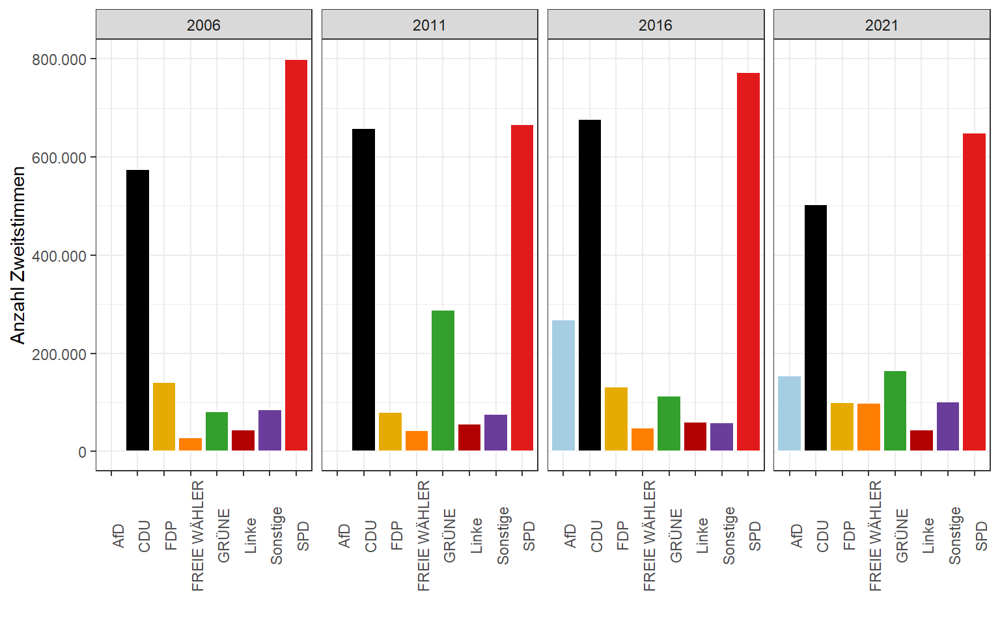
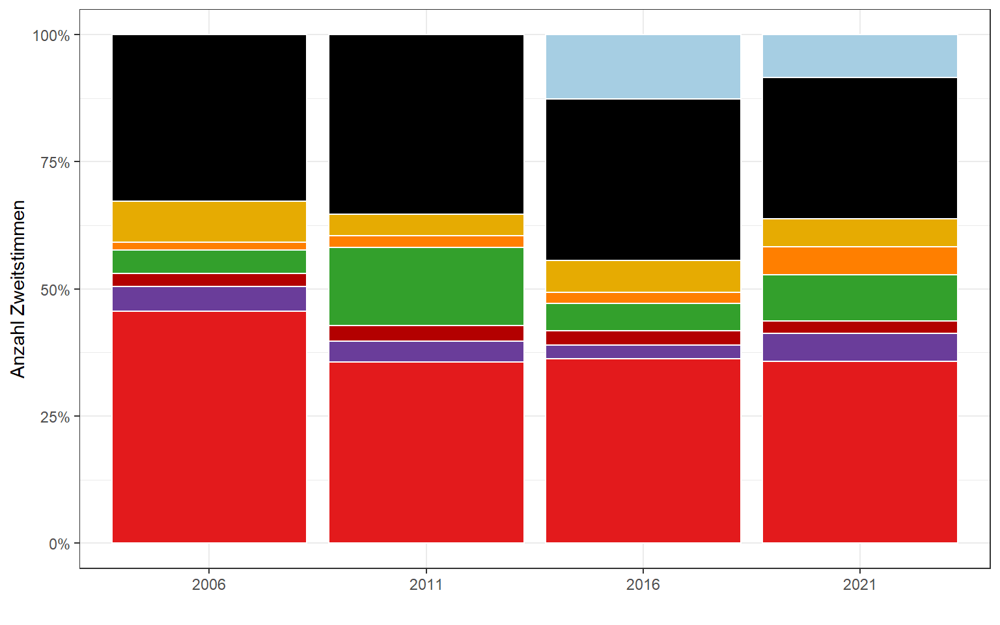
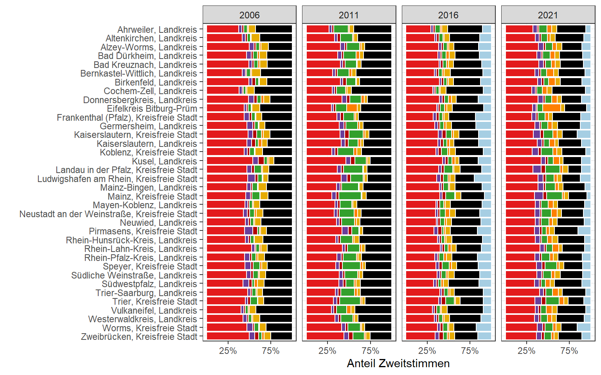
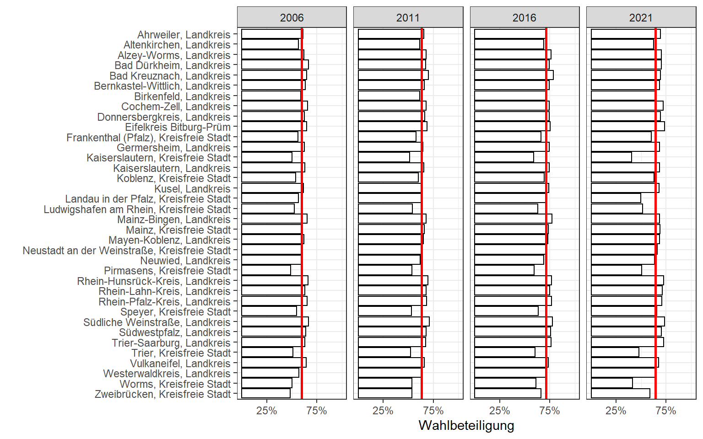
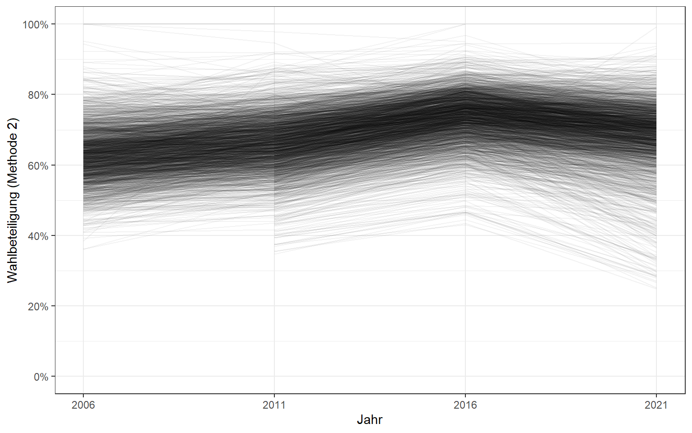
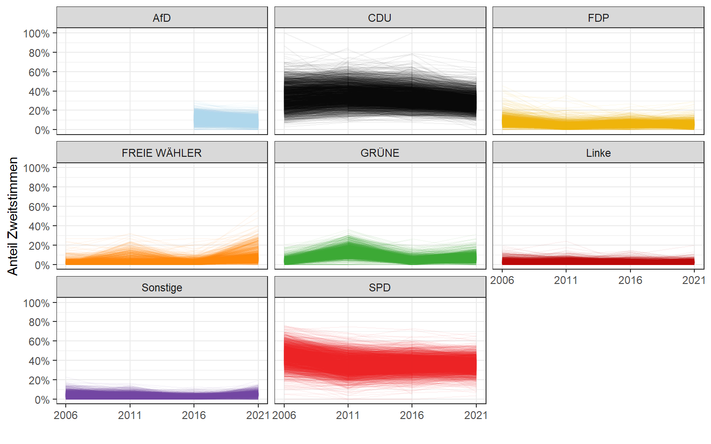
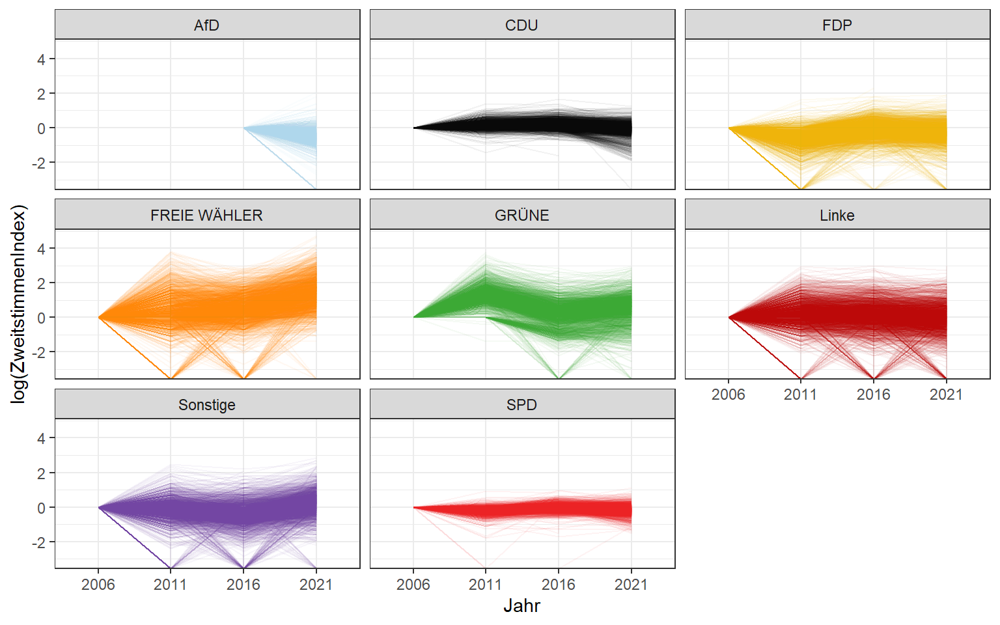

<script src="index_files/libs/kePrint-0.0.1/kePrint.js"></script>


Benötigte R-Pakete:

``` r
library(tidyverse)
```

## **Datenbeschaffung**

Wählen ist Bürgerpflicht. In den letzten Wochen habe ich mich neben den Wahlprogrammen der Parteien, die zur Landtagswahl 2021 in Rheinland-Pfalz antreten auch mit den Wahldaten selbst beschäftigt. Diese werden vom Landeswahlleiter bzw. dem Statistischen Landesamt Rheinland-Pfalz aufbereitet und veröffentlicht. Auf der Webseite des Statistischen Landesamtes stehen ab Wahljahr 2006 die Ergebnisse auch im .CSV Format zur Verfügung - bspw. [hier](https://wahlen2021.rlp.de/de/ltw/wahlen/2021/downloads/) für 2021.

Mit einem Klick auf "Alle Ergebnisse" erthält man dabei die Wahlergebnisse bis zur Tiefe von Ortsgemeinden bzw. Orts-/ und Stadtteilen. Leider sind in diesem Datenbestand sehr viele Teilergebnisse (Zwischenaggregate) enthalten und damit für eine Analyse mit statistischer Software nur bedingt geeignet. Für mich als Laien auf dem Gebiet von Wahldaten war es gar nicht so einfach herauszufinden, wie man diese vollständig entfernt. *Ziel soll es sein einen Datensatz zu erstellen, der ausschlißelich Gemeinden enthält und dennoch die Berechnung von Aggregaten zulässt.*

Zunächst muss man vor allem den *Gemeindeschlüssel Rheinland-Pfalz (GSRP)* verstehen, der jede Gebietseinheit mehr oder weniger eindeutig identifiziert. Auf der Webseite des Statistischen Landesamtes gibt es dazu [Erläuterungen](https://www.wahlen.rlp.de/de/landtagswahl/wahlen/2011/downloads/hinweise/erlaeuterungen/), ich habe aber versucht ein eigenes Schaubild anzufertigen. Dieses soll insb. zeigen, wie man mit dem Gebietsschlüssel, welche Gebiete bzw. Gebietsebenen identifizieren kann. Der Schlüssel besteht aus 10 Stellen und die ersten 3 Stellen enthalten Informationen zum Regierungsbezirk und Landkreis. Anhand der restlichen Stellen kann man weitere Gebietseinheiten ausfindig machen. Auf der linken Seite habe ich beschrieben, welche Gebietseinheiten, ich in meinem Datensatz als Variable hinterlegen möchte, um sowohl Ergebnisse auf Ebene der Gemeinden als auch auf Ebene des Landkreises erstellen zu können.

|  |
|:----------------------------------------------------------------------:|
|                       *Verwaltungsgliederung Rheinland-Pfalz inkl. Schlüsselsystematik. Eigene Darstellung.*                       |

## **Datenaufbereitung**

Unten lese ich die heruntergeladene Datei für das Jahr 2011 ein und zeige einen Ausschnitt der Daten vor der Bereinigung.

    ## New names:
    ## * `` -> ...31
    ## * `` -> ...32
    ## * `` -> ...33
    ## * `` -> ...34
    ## * `` -> ...35
    ## * ...

<br>

<div style="border: 1px solid #ddd; padding: 0px; overflow-y: scroll; height:300px; overflow-x: scroll; width:100%; ">

| Gebietsschlüssel | Gebietsbezeichnung                           | Wahlberechtigte | Wahlberechtigte ohne Sperrvermerk | Wahlberechtigte mit Sperrvermerk | Wahlberechtigte nach §19 |  Wähler | Wähler mit Wahlschein | Wahlbeteiligung | Berechnungsmethode Wahlbeteiligung | ungültige Erststimmen | gültige Erststimmen | ungültige Erststimmen in % | gültige Erstsstimmen in % | SPD Erststimmen | CDU Erststimmen | FDP Erststimmen | GRÜNE Erststimmen | Linke Erststimmen | REP Erststimmen | NPD Erststimmen | ödp Erststimmen | BüSo Erststimmen | ddp Erststimmen | FREIE WÄHLER Erststimmen | PIRATEN Erststimmen | Jansen Erststimmen | PBC Erststimmen | parteiunabhängig Erststimmen | Sonstige Erststimmen | \...31 | \...32 | \...33 | \...34 | \...35 | \...36 | \...37 | \...38 | \...39 | SPD Erststimmen in % | CDU Erststimmen in % | FDP Erststimmen in % | GRÜNE Erststimmen in % | Linke Erststimmen in % | REP Erststimmen in % | NPD Erststimmen in % | ödp Erststimmen in % | BüSo Erststimmen in % | ddp Erststimmen in % | FREIE WÄHLER Erststimmen in % | PIRATEN Erststimmen in % | Jansen Erststimmen in % | PBC Erststimmen in % | parteiunabhängig Erststimmen in % | Sonstige Erststimmen in % | \...56 | \...57 | \...58 | \...59 | \...60 | \...61 | \...62 | \...63 | \...64 | ungültige Zweitstimmen | gültige Zweitstimmen | ungültige Zweitstimmen in % | gültige Zweitstimmen in % | SPD Zweitstimmen | CDU Zweitstimmen | FDP Zweitstimmen | GRÜNE Zweitstimmen | Linke Zweitstimmen | REP Zweitstimmen | NPD Zweitstimmen | ödp Zweitstimmen | BüSo Zweitstimmen | ddp Zweitstimmen | FREIE WÄHLER Zweitstimmen | PIRATEN Zweitstimmen | Jansen Zweitstimmen | PBC Zweitstimmen | parteiunabhängig Zweitstimmen | Sonstige Zweitstimmen | \...85 | \...86 | \...87 | \...88 | \...89 | \...90 | \...91 | \...92 | \...93 | SPD Zweitstimmen in % | CDU Zweitstimmen in % | FDP Zweitstimmen in % | GRÜNE Zweitstimmen in % | Linke Zweitstimmen in % | REP Zweitstimmen in % | NPD Zweitstimmen in % | ödp Zweitstimmen in % | BüSo Zweitstimmen in % | ddp Zweitstimmen in % | FREIE WÄHLER Zweitstimmen in % | PIRATEN Zweitstimmen in % | Jansen Zweitstimmen in % | PBC Zweitstimmen in % | parteiunabhängig Zweitstimmen in % | Sonstige Zweitstimmen in % | \...110 | \...111 | \...112 | \...113 | \...114 | \...115 | \...116 | \...117 | \...118 | Gewählter Direktkandidat | Partei des Direktkandidaten | Anzahl Stimmbezirke | Anzahl ausgezählter Stimmbezirke | Zeitpunkt der letzten Änderung |
|:-----------------|:---------------------------------------------|----------------:|----------------------------------:|---------------------------------:|-------------------------:|--------:|----------------------:|----------------:|-----------------------------------:|----------------------:|--------------------:|---------------------------:|--------------------------:|----------------:|----------------:|----------------:|------------------:|------------------:|----------------:|----------------:|----------------:|-----------------:|:----------------|-------------------------:|--------------------:|-------------------:|----------------:|-----------------------------:|:---------------------|:-------|:-------|:-------|:-------|:-------|:-------|:-------|:-------|:-------|---------------------:|---------------------:|---------------------:|-----------------------:|-----------------------:|---------------------:|---------------------:|---------------------:|----------------------:|:---------------------|------------------------------:|-------------------------:|------------------------:|---------------------:|----------------------------------:|:--------------------------|:-------|:-------|:-------|:-------|:-------|:-------|:-------|:-------|:-------|-----------------------:|---------------------:|----------------------------:|--------------------------:|-----------------:|-----------------:|-----------------:|-------------------:|-------------------:|-----------------:|-----------------:|-----------------:|------------------:|-----------------:|--------------------------:|---------------------:|:--------------------|:-----------------|:------------------------------|:----------------------|:-------|:-------|:-------|:-------|:-------|:-------|:-------|:-------|:-------|----------------------:|----------------------:|----------------------:|------------------------:|------------------------:|----------------------:|----------------------:|----------------------:|-----------------------:|----------------------:|-------------------------------:|--------------------------:|:-------------------------|:----------------------|:-----------------------------------|:---------------------------|:--------|:--------|:--------|:--------|:--------|:--------|:--------|:--------|:--------|:-------------------------|:----------------------------|--------------------:|---------------------------------:|:-------------------------------|
| 0                | Landesergebnis Rheinland-Pfalz               |         3088199 |                           2605981 |                           482180 |                       38 | 1908734 |                458138 |            61.8 |                                  2 |                 53598 |             1855136 |                        2.8 |                      97.2 |          699572 |          684065 |           82340 |            263703 |             60044 |            7646 |            7282 |            4706 |              183 | NA              |                    35360 |                8806 |                413 |             279 |                          737 | NA                   | NA     | NA     | NA     | NA     | NA     | NA     | NA     | NA     | NA     |                 37.7 |                 36.9 |                  4.4 |                   14.2 |                    3.2 |                  0.4 |                  0.4 |                  0.3 |                   0.0 | NA                   |                           1.9 |                      0.5 |                     0.0 |                  0.0 |                               0.0 | NA                        | NA     | NA     | NA     | NA     | NA     | NA     | NA     | NA     | NA     |                  40547 |              1868187 |                         2.1 |                      97.9 |           666817 |           658474 |            79343 |             288489 |              56054 |            15600 |            20586 |             6997 |              1504 |             1656 |                     43348 |                29319 | NA                  | NA               | NA                            | NA                    | NA     | NA     | NA     | NA     | NA     | NA     | NA     | NA     | NA     |                  35.7 |                  35.2 |                   4.2 |                    15.4 |                     3.0 |                   0.8 |                   1.1 |                   0.4 |                    0.1 |                   0.1 |                            2.3 |                       1.6 | NA                       | NA                    | NA                                 | NA                         | NA      | NA      | NA      | NA      | NA      | NA      | NA      | NA      | NA      | NA                       | NA                          |                4866 |                             4866 | 01.04.2011 09:15               |
| 1110000000       | Koblenz, Kreisfreie Stadt                    |           82456 |                             66763 |                            15693 |                        0 |   47940 |                 14942 |            58.1 |                                  2 |                  1409 |               46531 |                        2.9 |                      97.1 |           14258 |           15908 |            3256 |              9749 |               410 |              NA |              NA |              NA |               NA | NA              |                     2950 |                  NA |                 NA |              NA |                           NA | NA                   | NA     | NA     | NA     | NA     | NA     | NA     | NA     | NA     | NA     |                 30.6 |                 34.2 |                  7.0 |                   21.0 |                    0.9 |                   NA |                   NA |                   NA |                    NA | NA                   |                           6.3 |                       NA |                      NA |                   NA |                                NA | NA                        | NA     | NA     | NA     | NA     | NA     | NA     | NA     | NA     | NA     |                    784 |                47156 |                         1.6 |                      98.4 |            14058 |            16712 |             2600 |               8863 |               1616 |              177 |              357 |              157 |                42 |               42 |                      1664 |                  868 | NA                  | NA               | NA                            | NA                    | NA     | NA     | NA     | NA     | NA     | NA     | NA     | NA     | NA     |                  29.8 |                  35.4 |                   5.5 |                    18.8 |                     3.4 |                   0.4 |                   0.8 |                   0.3 |                    0.1 |                   0.1 |                            3.5 |                       1.8 | NA                       | NA                    | NA                                 | NA                         | NA      | NA      | NA      | NA      | NA      | NA      | NA      | NA      | NA      | NA                       | NA                          |                 148 |                              148 | 30.03.2011 07:15               |
| 1310000000       | Ahrweiler, Landkreis                         |          100006 |                             84017 |                            15988 |                        1 |   61530 |                 12182 |            61.5 |                                  2 |                  1620 |               59910 |                        2.6 |                      97.4 |           16135 |           27418 |            4203 |             10278 |              1876 |              NA |              NA |              NA |               NA | NA              |                       NA |                  NA |                 NA |              NA |                           NA | NA                   | NA     | NA     | NA     | NA     | NA     | NA     | NA     | NA     | NA     |                 26.9 |                 45.8 |                  7.0 |                   17.2 |                    3.1 |                   NA |                   NA |                   NA |                    NA | NA                   |                            NA |                       NA |                      NA |                   NA |                                NA | NA                        | NA     | NA     | NA     | NA     | NA     | NA     | NA     | NA     | NA     |                   1095 |                60435 |                         1.8 |                      98.2 |            16099 |            27002 |             2879 |              10134 |               1552 |              230 |              579 |              257 |                39 |               55 |                       903 |                  706 | NA                  | NA               | NA                            | NA                    | NA     | NA     | NA     | NA     | NA     | NA     | NA     | NA     | NA     |                  26.6 |                  44.7 |                   4.8 |                    16.8 |                     2.6 |                   0.4 |                   1.0 |                   0.4 |                    0.1 |                   0.1 |                            1.5 |                       1.2 | NA                       | NA                    | NA                                 | NA                         | NA      | NA      | NA      | NA      | NA      | NA      | NA      | NA      | NA      | NA                       | NA                          |                 155 |                              155 | 01.04.2011 09:15               |
| 1320000000       | Altenkirchen, Landkreis                      |          102523 |                             89384 |                            13136 |                        3 |   59084 |                 12084 |            57.6 |                                  2 |                  1632 |               57452 |                        2.8 |                      97.2 |           20882 |           23773 |            3077 |              7275 |              2445 |              NA |              NA |              NA |               NA | NA              |                       NA |                  NA |                 NA |              NA |                           NA | NA                   | NA     | NA     | NA     | NA     | NA     | NA     | NA     | NA     | NA     |                 36.3 |                 41.4 |                  5.4 |                   12.7 |                    4.3 |                   NA |                   NA |                   NA |                    NA | NA                   |                            NA |                       NA |                      NA |                   NA |                                NA | NA                        | NA     | NA     | NA     | NA     | NA     | NA     | NA     | NA     | NA     |                   1165 |                57919 |                         2.0 |                      98.0 |            19256 |            23181 |             2586 |               8356 |               2056 |              294 |              669 |              138 |                57 |               47 |                       666 |                  613 | NA                  | NA               | NA                            | NA                    | NA     | NA     | NA     | NA     | NA     | NA     | NA     | NA     | NA     |                  33.2 |                  40.0 |                   4.5 |                    14.4 |                     3.5 |                   0.5 |                   1.2 |                   0.2 |                    0.1 |                   0.1 |                            1.1 |                       1.1 | NA                       | NA                    | NA                                 | NA                         | NA      | NA      | NA      | NA      | NA      | NA      | NA      | NA      | NA      | NA                       | NA                          |                 176 |                              176 | 29.03.2011 10:02               |
| 1330000000       | Bad Kreuznach, Landkreis                     |          121239 |                            102774 |                            18464 |                        1 |   77547 |                 17603 |            64.0 |                                  2 |                  1982 |               75565 |                        2.6 |                      97.4 |           30524 |           30193 |            2729 |              9533 |              2586 |              NA |              NA |              NA |               NA | NA              |                       NA |                  NA |                 NA |              NA |                           NA | NA                   | NA     | NA     | NA     | NA     | NA     | NA     | NA     | NA     | NA     |                 40.4 |                 40.0 |                  3.6 |                   12.6 |                    3.4 |                   NA |                   NA |                   NA |                    NA | NA                   |                            NA |                       NA |                      NA |                   NA |                                NA | NA                        | NA     | NA     | NA     | NA     | NA     | NA     | NA     | NA     | NA     |                   1528 |                76019 |                         2.0 |                      98.0 |            30222 |            27316 |             3288 |              10018 |               2060 |              330 |              724 |              208 |                41 |               31 |                       854 |                  927 | NA                  | NA               | NA                            | NA                    | NA     | NA     | NA     | NA     | NA     | NA     | NA     | NA     | NA     |                  39.8 |                  35.9 |                   4.3 |                    13.2 |                     2.7 |                   0.4 |                   1.0 |                   0.3 |                    0.1 |                   0.0 |                            1.1 |                       1.2 | NA                       | NA                    | NA                                 | NA                         | NA      | NA      | NA      | NA      | NA      | NA      | NA      | NA      | NA      | NA                       | NA                          |                 181 |                              181 | 31.03.2011 09:14               |
| 1340000000       | Birkenfeld, Landkreis                        |           67800 |                             60730 |                             7070 |                        0 |   37734 |                  6708 |            55.7 |                                  2 |                   933 |               36801 |                        2.5 |                      97.5 |           15072 |           12790 |            1821 |              4761 |              1944 |              NA |              NA |              NA |               NA | NA              |                       NA |                  NA |                413 |              NA |                           NA | NA                   | NA     | NA     | NA     | NA     | NA     | NA     | NA     | NA     | NA     |                 41.0 |                 34.8 |                  4.9 |                   12.9 |                    5.3 |                   NA |                   NA |                   NA |                    NA | NA                   |                            NA |                       NA |                     1.1 |                   NA |                                NA | NA                        | NA     | NA     | NA     | NA     | NA     | NA     | NA     | NA     | NA     |                    663 |                37071 |                         1.8 |                      98.2 |            14768 |            13999 |             1332 |               4077 |               1583 |              172 |              369 |               64 |                27 |               44 |                       315 |                  321 | NA                  | NA               | NA                            | NA                    | NA     | NA     | NA     | NA     | NA     | NA     | NA     | NA     | NA     |                  39.8 |                  37.8 |                   3.6 |                    11.0 |                     4.3 |                   0.5 |                   1.0 |                   0.2 |                    0.1 |                   0.1 |                            0.8 |                       0.9 | NA                       | NA                    | NA                                 | NA                         | NA      | NA      | NA      | NA      | NA      | NA      | NA      | NA      | NA      | NA                       | NA                          |                 147 |                              147 | 29.03.2011 11:25               |
| 1350000000       | Cochem-Zell, Landkreis                       |           51611 |                             45234 |                             6377 |                        0 |   33456 |                  6068 |            64.8 |                                  2 |                  1158 |               32298 |                        3.5 |                      96.5 |            9615 |           16900 |            1596 |              3250 |               937 |              NA |              NA |              NA |               NA | NA              |                       NA |                  NA |                 NA |              NA |                           NA | NA                   | NA     | NA     | NA     | NA     | NA     | NA     | NA     | NA     | NA     |                 29.8 |                 52.3 |                  4.9 |                   10.1 |                    2.9 |                   NA |                   NA |                   NA |                    NA | NA                   |                            NA |                       NA |                      NA |                   NA |                                NA | NA                        | NA     | NA     | NA     | NA     | NA     | NA     | NA     | NA     | NA     |                    892 |                32564 |                         2.7 |                      97.3 |             9920 |            15427 |             1590 |               3470 |                737 |              122 |              241 |               98 |                24 |               28 |                       557 |                  350 | NA                  | NA               | NA                            | NA                    | NA     | NA     | NA     | NA     | NA     | NA     | NA     | NA     | NA     |                  30.5 |                  47.4 |                   4.9 |                    10.7 |                     2.3 |                   0.4 |                   0.7 |                   0.3 |                    0.1 |                   0.1 |                            1.7 |                       1.1 | NA                       | NA                    | NA                                 | NA                         | NA      | NA      | NA      | NA      | NA      | NA      | NA      | NA      | NA      | NA                       | NA                          |                 113 |                              113 | 30.03.2011 13:33               |
| 1370000000       | Mayen-Koblenz, Landkreis                     |          166512 |                            141943 |                            24568 |                        1 |   99419 |                 23284 |            59.7 |                                  2 |                  2525 |               96894 |                        2.5 |                      97.5 |           33709 |           42977 |            3622 |             12573 |              3028 |             299 |              NA |             686 |               NA | NA              |                       NA |                  NA |                 NA |              NA |                           NA | NA                   | NA     | NA     | NA     | NA     | NA     | NA     | NA     | NA     | NA     |                 34.8 |                 44.4 |                  3.7 |                   13.0 |                    3.1 |                  0.3 |                   NA |                  0.7 |                    NA | NA                   |                            NA |                       NA |                      NA |                   NA |                                NA | NA                        | NA     | NA     | NA     | NA     | NA     | NA     | NA     | NA     | NA     |                   1742 |                97677 |                         1.8 |                      98.2 |            32937 |            40085 |             4068 |              13622 |               2475 |              410 |              741 |              429 |                55 |               74 |                      1558 |                 1223 | NA                  | NA               | NA                            | NA                    | NA     | NA     | NA     | NA     | NA     | NA     | NA     | NA     | NA     |                  33.7 |                  41.0 |                   4.2 |                    13.9 |                     2.5 |                   0.4 |                   0.8 |                   0.4 |                    0.1 |                   0.1 |                            1.6 |                       1.3 | NA                       | NA                    | NA                                 | NA                         | NA      | NA      | NA      | NA      | NA      | NA      | NA      | NA      | NA      | NA                       | NA                          |                 232 |                              232 | 29.03.2011 16:27               |
| 1380000000       | Neuwied, Landkreis                           |          138475 |                            116377 |                            22097 |                        1 |   82696 |                 21082 |            59.7 |                                  2 |                  2221 |               80475 |                        2.7 |                      97.3 |           31920 |           30410 |            3276 |             10414 |              2513 |              NA |              NA |              NA |               NA | NA              |                     1205 |                  NA |                 NA |              NA |                          737 | NA                   | NA     | NA     | NA     | NA     | NA     | NA     | NA     | NA     | NA     |                 39.7 |                 37.8 |                  4.1 |                   12.9 |                    3.1 |                   NA |                   NA |                   NA |                    NA | NA                   |                           1.5 |                       NA |                      NA |                   NA |                               0.9 | NA                        | NA     | NA     | NA     | NA     | NA     | NA     | NA     | NA     | NA     |                   1616 |                81080 |                         2.0 |                      98.0 |            28814 |            30253 |             3379 |              12374 |               2206 |              406 |              712 |              233 |                77 |               56 |                      1528 |                 1042 | NA                  | NA               | NA                            | NA                    | NA     | NA     | NA     | NA     | NA     | NA     | NA     | NA     | NA     |                  35.5 |                  37.3 |                   4.2 |                    15.3 |                     2.7 |                   0.5 |                   0.9 |                   0.3 |                    0.1 |                   0.1 |                            1.9 |                       1.3 | NA                       | NA                    | NA                                 | NA                         | NA      | NA      | NA      | NA      | NA      | NA      | NA      | NA      | NA      | NA                       | NA                          |                 196 |                              196 | 31.03.2011 09:00               |
| 1400000000       | Rhein-Hunsrück-Kreis, Landkreis              |           81173 |                             70370 |                            10803 |                        0 |   52300 |                 10241 |            64.4 |                                  2 |                  1553 |               50747 |                        3.0 |                      97.0 |           18413 |           20843 |            2993 |              6235 |              1680 |              NA |              NA |              NA |               NA | NA              |                      304 |                  NA |                 NA |             279 |                           NA | NA                   | NA     | NA     | NA     | NA     | NA     | NA     | NA     | NA     | NA     |                 36.3 |                 41.1 |                  5.9 |                   12.3 |                    3.3 |                   NA |                   NA |                   NA |                    NA | NA                   |                           0.6 |                       NA |                      NA |                  0.5 |                                NA | NA                        | NA     | NA     | NA     | NA     | NA     | NA     | NA     | NA     | NA     |                   1243 |                51057 |                         2.4 |                      97.6 |            17479 |            19423 |             3016 |               7201 |               1422 |              233 |              437 |              194 |                38 |               52 |                       946 |                  616 | NA                  | NA               | NA                            | NA                    | NA     | NA     | NA     | NA     | NA     | NA     | NA     | NA     | NA     |                  34.2 |                  38.0 |                   5.9 |                    14.1 |                     2.8 |                   0.5 |                   0.9 |                   0.4 |                    0.1 |                   0.1 |                            1.9 |                       1.2 | NA                       | NA                    | NA                                 | NA                         | NA      | NA      | NA      | NA      | NA      | NA      | NA      | NA      | NA      | NA                       | NA                          |                 193 |                              193 | 31.03.2011 09:04               |
| 1410000000       | Rhein-Lahn-Kreis, Landkreis                  |           97934 |                             83310 |                            14620 |                        4 |   60679 |                 13708 |            62.0 |                                  2 |                  1857 |               58822 |                        3.1 |                      96.9 |           29387 |           17578 |            1836 |              6573 |              1958 |              NA |              NA |              NA |               NA | NA              |                     1490 |                  NA |                 NA |              NA |                           NA | NA                   | NA     | NA     | NA     | NA     | NA     | NA     | NA     | NA     | NA     |                 50.0 |                 29.9 |                  3.1 |                   11.2 |                    3.3 |                   NA |                   NA |                   NA |                    NA | NA                   |                           2.5 |                       NA |                      NA |                   NA |                                NA | NA                        | NA     | NA     | NA     | NA     | NA     | NA     | NA     | NA     | NA     |                   1645 |                59034 |                         2.7 |                      97.3 |            24963 |            18475 |             2341 |               8332 |               1748 |              268 |              494 |              178 |                38 |               37 |                      1352 |                  808 | NA                  | NA               | NA                            | NA                    | NA     | NA     | NA     | NA     | NA     | NA     | NA     | NA     | NA     |                  42.3 |                  31.3 |                   4.0 |                    14.1 |                     3.0 |                   0.5 |                   0.8 |                   0.3 |                    0.1 |                   0.1 |                            2.3 |                       1.4 | NA                       | NA                    | NA                                 | NA                         | NA      | NA      | NA      | NA      | NA      | NA      | NA      | NA      | NA      | NA                       | NA                          |                 185 |                              185 | 29.03.2011 14:42               |
| 1430000000       | Westerwaldkreis, Landkreis                   |          154720 |                            131322 |                            23397 |                        1 |   94797 |                 22220 |            61.3 |                                  2 |                  2632 |               92165 |                        2.8 |                      97.2 |           35369 |           36654 |            4839 |             11860 |              3443 |              NA |              NA |              NA |               NA | NA              |                       NA |                  NA |                 NA |              NA |                           NA | NA                   | NA     | NA     | NA     | NA     | NA     | NA     | NA     | NA     | NA     |                 38.4 |                 39.8 |                  5.3 |                   12.9 |                    3.7 |                   NA |                   NA |                   NA |                    NA | NA                   |                            NA |                       NA |                      NA |                   NA |                                NA | NA                        | NA     | NA     | NA     | NA     | NA     | NA     | NA     | NA     | NA     |                   1962 |                92835 |                         2.1 |                      97.9 |            31222 |            36512 |             4113 |              13086 |               2886 |              441 |             1100 |              274 |                75 |               64 |                      1430 |                 1632 | NA                  | NA               | NA                            | NA                    | NA     | NA     | NA     | NA     | NA     | NA     | NA     | NA     | NA     |                  33.6 |                  39.3 |                   4.4 |                    14.1 |                     3.1 |                   0.5 |                   1.2 |                   0.3 |                    0.1 |                   0.1 |                            1.5 |                       1.8 | NA                       | NA                    | NA                                 | NA                         | NA      | NA      | NA      | NA      | NA      | NA      | NA      | NA      | NA      | NA                       | NA                          |                 257 |                              257 | 30.03.2011 09:51               |
| 2110000000       | Trier, Kreisfreie Stadt                      |           81445 |                             68548 |                            12897 |                        0 |   45875 |                 12489 |            56.3 |                                  2 |                   865 |               45010 |                        1.9 |                      98.1 |           18022 |           14575 |            1389 |              8291 |              1552 |              NA |             277 |              NA |               NA | NA              |                       NA |                 904 |                 NA |              NA |                           NA | NA                   | NA     | NA     | NA     | NA     | NA     | NA     | NA     | NA     | NA     |                 40.0 |                 32.4 |                  3.1 |                   18.4 |                    3.4 |                   NA |                  0.6 |                   NA |                    NA | NA                   |                            NA |                      2.0 |                      NA |                   NA |                                NA | NA                        | NA     | NA     | NA     | NA     | NA     | NA     | NA     | NA     | NA     |                    678 |                45197 |                         1.5 |                      98.5 |            14369 |            14051 |             1756 |              10964 |               1575 |               97 |              322 |              140 |                29 |               52 |                       764 |                 1078 | NA                  | NA               | NA                            | NA                    | NA     | NA     | NA     | NA     | NA     | NA     | NA     | NA     | NA     |                  31.8 |                  31.1 |                   3.9 |                    24.3 |                     3.5 |                   0.2 |                   0.7 |                   0.3 |                    0.1 |                   0.1 |                            1.7 |                       2.4 | NA                       | NA                    | NA                                 | NA                         | NA      | NA      | NA      | NA      | NA      | NA      | NA      | NA      | NA      | NA                       | NA                          |                  77 |                               77 | 30.03.2011 12:38               |
| 2310000000       | Bernkastel-Wittlich, Landkreis               |           89212 |                             77867 |                            11345 |                        0 |   55244 |                 10105 |            61.9 |                                  2 |                  2051 |               53193 |                        3.7 |                      96.3 |           15386 |           23245 |            2698 |              7176 |              1719 |              NA |              NA |              NA |               NA | NA              |                     2969 |                  NA |                 NA |              NA |                           NA | NA                   | NA     | NA     | NA     | NA     | NA     | NA     | NA     | NA     | NA     |                 28.9 |                 43.7 |                  5.1 |                   13.5 |                    3.2 |                   NA |                   NA |                   NA |                    NA | NA                   |                           5.6 |                       NA |                      NA |                   NA |                                NA | NA                        | NA     | NA     | NA     | NA     | NA     | NA     | NA     | NA     | NA     |                   1798 |                53446 |                         3.3 |                      96.7 |            16499 |            22217 |             2676 |               7184 |               1359 |              239 |              418 |              105 |                29 |              202 |                      1945 |                  573 | NA                  | NA               | NA                            | NA                    | NA     | NA     | NA     | NA     | NA     | NA     | NA     | NA     | NA     |                  30.9 |                  41.6 |                   5.0 |                    13.4 |                     2.5 |                   0.4 |                   0.8 |                   0.2 |                    0.1 |                   0.4 |                            3.6 |                       1.1 | NA                       | NA                    | NA                                 | NA                         | NA      | NA      | NA      | NA      | NA      | NA      | NA      | NA      | NA      | NA                       | NA                          |                 178 |                              178 | 29.03.2011 11:46               |
| 2320000000       | Eifelkreis Bitburg-Prüm                      |           73611 |                             63443 |                            10168 |                        0 |   45771 |                  9627 |            62.2 |                                  2 |                  2291 |               43480 |                        5.0 |                      95.0 |           13591 |           14422 |            2457 |              5836 |              1443 |              NA |              NA |              NA |               NA | NA              |                     5731 |                  NA |                 NA |              NA |                           NA | NA                   | NA     | NA     | NA     | NA     | NA     | NA     | NA     | NA     | NA     |                 31.3 |                 33.2 |                  5.7 |                   13.4 |                    3.3 |                   NA |                   NA |                   NA |                    NA | NA                   |                          13.2 |                       NA |                      NA |                   NA |                                NA | NA                        | NA     | NA     | NA     | NA     | NA     | NA     | NA     | NA     | NA     |                   1283 |                44488 |                         2.8 |                      97.2 |            13096 |            16098 |             1836 |               5801 |               1149 |              120 |              298 |               78 |                29 |               32 |                      5463 |                  488 | NA                  | NA               | NA                            | NA                    | NA     | NA     | NA     | NA     | NA     | NA     | NA     | NA     | NA     |                  29.4 |                  36.2 |                   4.1 |                    13.0 |                     2.6 |                   0.3 |                   0.7 |                   0.2 |                    0.1 |                   0.1 |                           12.3 |                       1.1 | NA                       | NA                    | NA                                 | NA                         | NA      | NA      | NA      | NA      | NA      | NA      | NA      | NA      | NA      | NA                       | NA                          |                 262 |                              262 | 30.03.2011 13:49               |
| 2330000000       | Vulkaneifel, Landkreis                       |           49442 |                             43391 |                             6051 |                        0 |   30036 |                  4735 |            60.7 |                                  2 |                   928 |               29108 |                        3.1 |                      96.9 |            9839 |           11510 |            1726 |              2805 |              1023 |              NA |              NA |              NA |               NA | NA              |                     2205 |                  NA |                 NA |              NA |                           NA | NA                   | NA     | NA     | NA     | NA     | NA     | NA     | NA     | NA     | NA     |                 33.8 |                 39.5 |                  5.9 |                    9.6 |                    3.5 |                   NA |                   NA |                   NA |                    NA | NA                   |                           7.6 |                       NA |                      NA |                   NA |                                NA | NA                        | NA     | NA     | NA     | NA     | NA     | NA     | NA     | NA     | NA     |                    742 |                29294 |                         2.5 |                      97.5 |             8592 |            12574 |             1360 |               3516 |                875 |              109 |              214 |               62 |                24 |               28 |                      1547 |                  393 | NA                  | NA               | NA                            | NA                    | NA     | NA     | NA     | NA     | NA     | NA     | NA     | NA     | NA     |                  29.3 |                  42.9 |                   4.6 |                    12.0 |                     3.0 |                   0.4 |                   0.7 |                   0.2 |                    0.1 |                   0.1 |                            5.3 |                       1.3 | NA                       | NA                    | NA                                 | NA                         | NA      | NA      | NA      | NA      | NA      | NA      | NA      | NA      | NA      | NA                       | NA                          |                 151 |                              151 | 30.03.2011 14:25               |
| 2350000000       | Trier-Saarburg, Landkreis                    |          110777 |                             96484 |                            14293 |                        0 |   71533 |                 13517 |            64.6 |                                  2 |                  2283 |               69250 |                        3.2 |                      96.8 |           23812 |           28030 |            2879 |             11182 |              2650 |              NA |              NA |              NA |               NA | NA              |                       NA |                 697 |                 NA |              NA |                           NA | NA                   | NA     | NA     | NA     | NA     | NA     | NA     | NA     | NA     | NA     |                 34.4 |                 40.5 |                  4.2 |                   16.1 |                    3.8 |                   NA |                   NA |                   NA |                    NA | NA                   |                            NA |                      1.0 |                      NA |                   NA |                                NA | NA                        | NA     | NA     | NA     | NA     | NA     | NA     | NA     | NA     | NA     |                   1590 |                69943 |                         2.2 |                      97.8 |            23870 |            25790 |             2458 |              11205 |               2245 |              229 |              539 |              142 |                50 |               60 |                      2134 |                 1221 | NA                  | NA               | NA                            | NA                    | NA     | NA     | NA     | NA     | NA     | NA     | NA     | NA     | NA     |                  34.1 |                  36.9 |                   3.5 |                    16.0 |                     3.2 |                   0.3 |                   0.8 |                   0.2 |                    0.1 |                   0.1 |                            3.1 |                       1.7 | NA                       | NA                    | NA                                 | NA                         | NA      | NA      | NA      | NA      | NA      | NA      | NA      | NA      | NA      | NA                       | NA                          |                 178 |                              178 | 31.03.2011 09:11               |
| 3110000000       | Frankenthal (Pfalz), Kreisfreie Stadt        |           33912 |                             29012 |                             4900 |                        0 |   19617 |                  4697 |            57.8 |                                  2 |                   472 |               19145 |                        2.4 |                      97.6 |            6484 |            8996 |             439 |              1974 |               807 |              NA |              NA |              NA |               NA | NA              |                      445 |                  NA |                 NA |              NA |                           NA | NA                   | NA     | NA     | NA     | NA     | NA     | NA     | NA     | NA     | NA     |                 33.9 |                 47.0 |                  2.3 |                   10.3 |                    4.2 |                   NA |                   NA |                   NA |                    NA | NA                   |                           2.3 |                       NA |                      NA |                   NA |                                NA | NA                        | NA     | NA     | NA     | NA     | NA     | NA     | NA     | NA     | NA     |                    427 |                19190 |                         2.2 |                      97.8 |             6827 |             7517 |              601 |               2389 |                709 |              206 |              249 |               29 |                17 |               15 |                       309 |                  322 | NA                  | NA               | NA                            | NA                    | NA     | NA     | NA     | NA     | NA     | NA     | NA     | NA     | NA     |                  35.6 |                  39.2 |                   3.1 |                    12.4 |                     3.7 |                   1.1 |                   1.3 |                   0.2 |                    0.1 |                   0.1 |                            1.6 |                       1.7 | NA                       | NA                    | NA                                 | NA                         | NA      | NA      | NA      | NA      | NA      | NA      | NA      | NA      | NA      | NA                       | NA                          |                  50 |                               50 | 29.03.2011 12:27               |
| 3120000000       | Kaiserslautern, Kreisfreie Stadt             |           73749 |                             64800 |                             8949 |                        0 |   39057 |                  8649 |            53.0 |                                  2 |                   941 |               38116 |                        2.4 |                      97.6 |           15268 |           10612 |            1649 |              5685 |              1893 |              NA |             520 |              NA |               NA | NA              |                     1412 |                1077 |                 NA |              NA |                           NA | NA                   | NA     | NA     | NA     | NA     | NA     | NA     | NA     | NA     | NA     |                 40.1 |                 27.8 |                  4.3 |                   14.9 |                    5.0 |                   NA |                  1.4 |                   NA |                    NA | NA                   |                           3.7 |                      2.8 |                      NA |                   NA |                                NA | NA                        | NA     | NA     | NA     | NA     | NA     | NA     | NA     | NA     | NA     |                    759 |                38298 |                         1.9 |                      98.1 |            15139 |            10206 |             1670 |               6391 |               1866 |              251 |              655 |              108 |                39 |               60 |                       937 |                  976 | NA                  | NA               | NA                            | NA                    | NA     | NA     | NA     | NA     | NA     | NA     | NA     | NA     | NA     |                  39.5 |                  26.6 |                   4.4 |                    16.7 |                     4.9 |                   0.7 |                   1.7 |                   0.3 |                    0.1 |                   0.2 |                            2.4 |                       2.5 | NA                       | NA                    | NA                                 | NA                         | NA      | NA      | NA      | NA      | NA      | NA      | NA      | NA      | NA      | NA                       | NA                          |                  78 |                               78 | 30.03.2011 09:26               |
| 3130000000       | Landau in der Pfalz, Kreisfreie Stadt        |           34037 |                             28896 |                             5141 |                        0 |   20469 |                  4879 |            60.1 |                                  2 |                   490 |               19979 |                        2.4 |                      97.6 |            7560 |            6698 |             598 |              4064 |               706 |             353 |              NA |              NA |               NA | NA              |                       NA |                  NA |                 NA |              NA |                           NA | NA                   | NA     | NA     | NA     | NA     | NA     | NA     | NA     | NA     | NA     |                 37.8 |                 33.5 |                  3.0 |                   20.3 |                    3.5 |                  1.8 |                   NA |                   NA |                    NA | NA                   |                            NA |                       NA |                      NA |                   NA |                                NA | NA                        | NA     | NA     | NA     | NA     | NA     | NA     | NA     | NA     | NA     |                    363 |                20106 |                         1.8 |                      98.2 |             7314 |             5782 |              813 |               4441 |                600 |              176 |              157 |               83 |                20 |               12 |                       271 |                  437 | NA                  | NA               | NA                            | NA                    | NA     | NA     | NA     | NA     | NA     | NA     | NA     | NA     | NA     |                  36.4 |                  28.8 |                   4.0 |                    22.1 |                     3.0 |                   0.9 |                   0.8 |                   0.4 |                    0.1 |                   0.1 |                            1.3 |                       2.2 | NA                       | NA                    | NA                                 | NA                         | NA      | NA      | NA      | NA      | NA      | NA      | NA      | NA      | NA      | NA                       | NA                          |                  36 |                               36 | 28.03.2011 14:27               |
| 3140000000       | Ludwigshafen am Rhein, Kreisfreie Stadt      |          103632 |                             88360 |                            15272 |                        0 |   56494 |                 14518 |            54.5 |                                  2 |                  1281 |               55213 |                        2.3 |                      97.7 |           23367 |           17196 |            1562 |              7289 |              2546 |            1673 |             982 |              NA |               NA | NA              |                       NA |                 598 |                 NA |              NA |                           NA | NA                   | NA     | NA     | NA     | NA     | NA     | NA     | NA     | NA     | NA     |                 42.3 |                 31.1 |                  2.8 |                   13.2 |                    4.6 |                  3.0 |                  1.8 |                   NA |                    NA | NA                   |                            NA |                      1.1 |                      NA |                   NA |                                NA | NA                        | NA     | NA     | NA     | NA     | NA     | NA     | NA     | NA     | NA     |                   1092 |                55402 |                         1.9 |                      98.1 |            22575 |            15876 |             1837 |               8118 |               2428 |             1366 |              964 |              134 |                53 |               60 |                       759 |                 1232 | NA                  | NA               | NA                            | NA                    | NA     | NA     | NA     | NA     | NA     | NA     | NA     | NA     | NA     |                  40.7 |                  28.7 |                   3.3 |                    14.7 |                     4.4 |                   2.5 |                   1.7 |                   0.2 |                    0.1 |                   0.1 |                            1.4 |                       2.2 | NA                       | NA                    | NA                                 | NA                         | NA      | NA      | NA      | NA      | NA      | NA      | NA      | NA      | NA      | NA                       | NA                          |                 147 |                              147 | 30.03.2011 10:01               |
| 3150000000       | Mainz, Kreisfreie Stadt                      |          142042 |                            115587 |                            26455 |                        0 |   92665 |                 25092 |            65.2 |                                  2 |                  1827 |               90838 |                        2.0 |                      98.0 |           30799 |           27972 |            4250 |             20329 |              2649 |              NA |              NA |            1566 |              183 | NA              |                      776 |                2314 |                 NA |              NA |                           NA | NA                   | NA     | NA     | NA     | NA     | NA     | NA     | NA     | NA     | NA     |                 33.9 |                 30.8 |                  4.7 |                   22.4 |                    2.9 |                   NA |                   NA |                  1.7 |                   0.2 | NA                   |                           0.9 |                      2.5 |                      NA |                   NA |                                NA | NA                        | NA     | NA     | NA     | NA     | NA     | NA     | NA     | NA     | NA     |                   1272 |                91393 |                         1.4 |                      98.6 |            27443 |            27243 |             4656 |              23877 |               2806 |             1166 |              320 |             1068 |                86 |               70 |                       759 |                 1899 | NA                  | NA               | NA                            | NA                    | NA     | NA     | NA     | NA     | NA     | NA     | NA     | NA     | NA     |                  30.0 |                  29.8 |                   5.1 |                    26.1 |                     3.1 |                   1.3 |                   0.4 |                   1.2 |                    0.1 |                   0.1 |                            0.8 |                       2.1 | NA                       | NA                    | NA                                 | NA                         | NA      | NA      | NA      | NA      | NA      | NA      | NA      | NA      | NA      | NA                       | NA                          |                 166 |                              166 | 31.03.2011 15:06               |
| 3160000000       | Neustadt an der Weinstraße, Kreisfreie Stadt |           41236 |                             33315 |                             7917 |                        4 |   26174 |                  7565 |            63.5 |                                  2 |                   664 |               25510 |                        2.5 |                      97.5 |            7642 |            9821 |             956 |              4206 |               629 |              NA |             420 |              NA |               NA | NA              |                     1836 |                  NA |                 NA |              NA |                           NA | NA                   | NA     | NA     | NA     | NA     | NA     | NA     | NA     | NA     | NA     |                 30.0 |                 38.5 |                  3.7 |                   16.5 |                    2.5 |                   NA |                  1.6 |                   NA |                    NA | NA                   |                           7.2 |                       NA |                      NA |                   NA |                                NA | NA                        | NA     | NA     | NA     | NA     | NA     | NA     | NA     | NA     | NA     |                    507 |                25667 |                         1.9 |                      98.1 |             8351 |             9212 |             1055 |               4475 |                563 |              127 |              338 |               69 |                24 |               16 |                      1057 |                  380 | NA                  | NA               | NA                            | NA                    | NA     | NA     | NA     | NA     | NA     | NA     | NA     | NA     | NA     |                  32.5 |                  35.9 |                   4.1 |                    17.4 |                     2.2 |                   0.5 |                   1.3 |                   0.3 |                    0.1 |                   0.1 |                            4.1 |                       1.5 | NA                       | NA                    | NA                                 | NA                         | NA      | NA      | NA      | NA      | NA      | NA      | NA      | NA      | NA      | NA                       | NA                          |                  49 |                               49 | 30.03.2011 11:19               |
| 3170000000       | Pirmasens, Kreisfreie Stadt                  |           32749 |                             28134 |                             4615 |                        0 |   17563 |                  4370 |            53.6 |                                  2 |                   908 |               16655 |                        5.2 |                      94.8 |            5964 |            5789 |            1363 |              1638 |               702 |             928 |             271 |              NA |               NA | NA              |                       NA |                  NA |                 NA |              NA |                           NA | NA                   | NA     | NA     | NA     | NA     | NA     | NA     | NA     | NA     | NA     |                 35.8 |                 34.8 |                  8.2 |                    9.8 |                    4.2 |                  5.6 |                  1.6 |                   NA |                    NA | NA                   |                            NA |                       NA |                      NA |                   NA |                                NA | NA                        | NA     | NA     | NA     | NA     | NA     | NA     | NA     | NA     | NA     |                    786 |                16777 |                         4.5 |                      95.5 |             6981 |             5674 |              621 |               1399 |                688 |              706 |              233 |               29 |                19 |               22 |                       182 |                  223 | NA                  | NA               | NA                            | NA                    | NA     | NA     | NA     | NA     | NA     | NA     | NA     | NA     | NA     |                  41.6 |                  33.8 |                   3.7 |                     8.3 |                     4.1 |                   4.2 |                   1.4 |                   0.2 |                    0.1 |                   0.1 |                            1.1 |                       1.3 | NA                       | NA                    | NA                                 | NA                         | NA      | NA      | NA      | NA      | NA      | NA      | NA      | NA      | NA      | NA                       | NA                          |                  60 |                               60 | 28.03.2011 11:20               |
| 3180000000       | Speyer, Kreisfreie Stadt                     |           36641 |                             30833 |                             5808 |                        0 |   21267 |                  5590 |            58.0 |                                  2 |                   417 |               20850 |                        2.0 |                      98.0 |            7187 |            7161 |             477 |              3874 |               773 |             534 |              NA |              NA |               NA | NA              |                      844 |                  NA |                 NA |              NA |                           NA | NA                   | NA     | NA     | NA     | NA     | NA     | NA     | NA     | NA     | NA     |                 34.5 |                 34.3 |                  2.3 |                   18.6 |                    3.7 |                  2.6 |                   NA |                   NA |                    NA | NA                   |                           4.0 |                       NA |                      NA |                   NA |                                NA | NA                        | NA     | NA     | NA     | NA     | NA     | NA     | NA     | NA     | NA     |                    354 |                20913 |                         1.7 |                      98.3 |             7160 |             6394 |              680 |               4396 |                720 |              404 |              132 |               79 |                12 |               10 |                       631 |                  295 | NA                  | NA               | NA                            | NA                    | NA     | NA     | NA     | NA     | NA     | NA     | NA     | NA     | NA     |                  34.2 |                  30.6 |                   3.3 |                    21.0 |                     3.4 |                   1.9 |                   0.6 |                   0.4 |                    0.1 |                   0.0 |                            3.0 |                       1.4 | NA                       | NA                    | NA                                 | NA                         | NA      | NA      | NA      | NA      | NA      | NA      | NA      | NA      | NA      | NA                       | NA                          |                  49 |                               49 | 28.03.2011 14:43               |
| 3190000000       | Worms, Kreisfreie Stadt                      |           59749 |                             51809 |                             7938 |                        2 |   33754 |                  7400 |            56.5 |                                  2 |                  1360 |               32394 |                        4.0 |                      96.0 |           14582 |           10450 |            1516 |              4599 |              1247 |              NA |              NA |              NA |               NA | NA              |                       NA |                  NA |                 NA |              NA |                           NA | NA                   | NA     | NA     | NA     | NA     | NA     | NA     | NA     | NA     | NA     |                 45.0 |                 32.3 |                  4.7 |                   14.2 |                    3.8 |                   NA |                   NA |                   NA |                    NA | NA                   |                            NA |                       NA |                      NA |                   NA |                                NA | NA                        | NA     | NA     | NA     | NA     | NA     | NA     | NA     | NA     | NA     |                    990 |                32764 |                         2.9 |                      97.1 |            13572 |            10403 |             1244 |               4887 |                927 |              320 |              525 |               77 |                29 |               27 |                       308 |                  445 | NA                  | NA               | NA                            | NA                    | NA     | NA     | NA     | NA     | NA     | NA     | NA     | NA     | NA     |                  41.4 |                  31.8 |                   3.8 |                    14.9 |                     2.8 |                   1.0 |                   1.6 |                   0.2 |                    0.1 |                   0.1 |                            0.9 |                       1.4 | NA                       | NA                    | NA                                 | NA                         | NA      | NA      | NA      | NA      | NA      | NA      | NA      | NA      | NA      | NA                       | NA                          |                  70 |                               70 | 29.03.2011 15:33               |
| 3200000000       | Zweibrücken, Kreisfreie Stadt                |           27112 |                             24238 |                             2874 |                        0 |   14214 |                  2651 |            52.4 |                                  2 |                   403 |               13811 |                        2.8 |                      97.2 |            5716 |            3515 |             795 |              1933 |               853 |              NA |             297 |             280 |               NA | NA              |                      422 |                  NA |                 NA |              NA |                           NA | NA                   | NA     | NA     | NA     | NA     | NA     | NA     | NA     | NA     | NA     |                 41.4 |                 25.5 |                  5.8 |                   14.0 |                    6.2 |                   NA |                  2.2 |                  2.0 |                    NA | NA                   |                           3.1 |                       NA |                      NA |                   NA |                                NA | NA                        | NA     | NA     | NA     | NA     | NA     | NA     | NA     | NA     | NA     |                    322 |                13892 |                         2.3 |                      97.7 |             6103 |             3496 |              730 |               1823 |                744 |               68 |              270 |              124 |                13 |               10 |                       242 |                  269 | NA                  | NA               | NA                            | NA                    | NA     | NA     | NA     | NA     | NA     | NA     | NA     | NA     | NA     |                  43.9 |                  25.2 |                   5.3 |                    13.1 |                     5.4 |                   0.5 |                   1.9 |                   0.9 |                    0.1 |                   0.1 |                            1.7 |                       1.9 | NA                       | NA                    | NA                                 | NA                         | NA      | NA      | NA      | NA      | NA      | NA      | NA      | NA      | NA      | NA                       | NA                          |                  37 |                               37 | 29.03.2011 15:11               |
| 3310000000       | Alzey-Worms, Landkreis                       |           96823 |                             80030 |                            16793 |                        0 |   62806 |                 15906 |            64.9 |                                  2 |                  1959 |               60847 |                        3.1 |                      96.9 |           26364 |           19232 |            2643 |              8462 |              1116 |              NA |             887 |             769 |               NA | NA              |                     1374 |                  NA |                 NA |              NA |                           NA | NA                   | NA     | NA     | NA     | NA     | NA     | NA     | NA     | NA     | NA     |                 43.3 |                 31.6 |                  4.3 |                   13.9 |                    1.8 |                   NA |                  1.5 |                  1.3 |                    NA | NA                   |                           2.3 |                       NA |                      NA |                   NA |                                NA | NA                        | NA     | NA     | NA     | NA     | NA     | NA     | NA     | NA     | NA     |                   1463 |                61343 |                         2.3 |                      97.7 |            24362 |            19442 |             2503 |               9260 |               1520 |              605 |             1086 |              355 |                54 |               57 |                      1176 |                  923 | NA                  | NA               | NA                            | NA                    | NA     | NA     | NA     | NA     | NA     | NA     | NA     | NA     | NA     |                  39.7 |                  31.7 |                   4.1 |                    15.1 |                     2.5 |                   1.0 |                   1.8 |                   0.6 |                    0.1 |                   0.1 |                            1.9 |                       1.5 | NA                       | NA                    | NA                                 | NA                         | NA      | NA      | NA      | NA      | NA      | NA      | NA      | NA      | NA      | NA                       | NA                          |                 137 |                              137 | 29.03.2011 16:02               |
| 3320000000       | Bad Dürkheim, Landkreis                      |          104668 |                             82733 |                            21935 |                        0 |   69907 |                 20900 |            66.8 |                                  2 |                  1675 |               68232 |                        2.4 |                      97.6 |           24780 |           23582 |            3047 |              9256 |              1936 |              NA |            1398 |              NA |               NA | NA              |                     4233 |                  NA |                 NA |              NA |                           NA | NA                   | NA     | NA     | NA     | NA     | NA     | NA     | NA     | NA     | NA     |                 36.3 |                 34.6 |                  4.5 |                   13.6 |                    2.8 |                   NA |                  2.0 |                   NA |                    NA | NA                   |                           6.2 |                       NA |                      NA |                   NA |                                NA | NA                        | NA     | NA     | NA     | NA     | NA     | NA     | NA     | NA     | NA     |                   1424 |                68483 |                         2.0 |                      98.0 |            25180 |            22625 |             3072 |              10039 |               1766 |              512 |             1100 |              163 |                67 |               46 |                      2801 |                 1112 | NA                  | NA               | NA                            | NA                    | NA     | NA     | NA     | NA     | NA     | NA     | NA     | NA     | NA     |                  36.8 |                  33.0 |                   4.5 |                    14.7 |                     2.6 |                   0.7 |                   1.6 |                   0.2 |                    0.1 |                   0.1 |                            4.1 |                       1.6 | NA                       | NA                    | NA                                 | NA                         | NA      | NA      | NA      | NA      | NA      | NA      | NA      | NA      | NA      | NA                       | NA                          |                 119 |                              119 | 28.03.2011 13:49               |
| 3330000000       | Donnersbergkreis, Landkreis                  |           59355 |                             49719 |                             9636 |                        0 |   36933 |                  8961 |            62.2 |                                  2 |                   823 |               36110 |                        2.2 |                      97.8 |           14352 |           12022 |            1012 |              4244 |              1285 |              NA |             994 |              NA |               NA | NA              |                     1444 |                 757 |                 NA |              NA |                           NA | NA                   | NA     | NA     | NA     | NA     | NA     | NA     | NA     | NA     | NA     |                 39.7 |                 33.3 |                  2.8 |                   11.8 |                    3.6 |                   NA |                  2.8 |                   NA |                    NA | NA                   |                           4.0 |                      2.1 |                      NA |                   NA |                                NA | NA                        | NA     | NA     | NA     | NA     | NA     | NA     | NA     | NA     | NA     |                    812 |                36121 |                         2.2 |                      97.8 |            15000 |            10279 |             1358 |               4943 |               1281 |              207 |              988 |               79 |                25 |               25 |                      1215 |                  721 | NA                  | NA               | NA                            | NA                    | NA     | NA     | NA     | NA     | NA     | NA     | NA     | NA     | NA     |                  41.5 |                  28.5 |                   3.8 |                    13.7 |                     3.5 |                   0.6 |                   2.7 |                   0.2 |                    0.1 |                   0.1 |                            3.4 |                       2.0 | NA                       | NA                    | NA                                 | NA                         | NA      | NA      | NA      | NA      | NA      | NA      | NA      | NA      | NA      | NA                       | NA                          |                 119 |                              119 | 30.03.2011 07:58               |
| 3340000000       | Germersheim, Landkreis                       |           93192 |                             76694 |                            16498 |                        0 |   57763 |                 15745 |            62.0 |                                  2 |                  1248 |               56515 |                        2.2 |                      97.8 |           21678 |           21144 |            2181 |              6078 |              1449 |            1755 |              NA |             471 |               NA | NA              |                     1759 |                  NA |                 NA |              NA |                           NA | NA                   | NA     | NA     | NA     | NA     | NA     | NA     | NA     | NA     | NA     |                 38.4 |                 37.4 |                  3.9 |                   10.8 |                    2.6 |                  3.1 |                   NA |                  0.8 |                    NA | NA                   |                           3.1 |                       NA |                      NA |                   NA |                                NA | NA                        | NA     | NA     | NA     | NA     | NA     | NA     | NA     | NA     | NA     |                   1123 |                56640 |                         1.9 |                      98.1 |            21731 |            19073 |             2144 |               7584 |               1369 |             1235 |              629 |              386 |                55 |               57 |                      1483 |                  894 | NA                  | NA               | NA                            | NA                    | NA     | NA     | NA     | NA     | NA     | NA     | NA     | NA     | NA     |                  38.4 |                  33.7 |                   3.8 |                    13.4 |                     2.4 |                   2.2 |                   1.1 |                   0.7 |                    0.1 |                   0.1 |                            2.6 |                       1.6 | NA                       | NA                    | NA                                 | NA                         | NA      | NA      | NA      | NA      | NA      | NA      | NA      | NA      | NA      | NA                       | NA                          |                 105 |                              105 | 30.03.2011 09:28               |
| 3350000000       | Kaiserslautern, Landkreis                    |           82472 |                             70066 |                            12406 |                        0 |   51907 |                 11782 |            62.9 |                                  2 |                  1650 |               50257 |                        3.2 |                      96.8 |           21415 |           17305 |            2080 |              5768 |              2332 |              NA |              NA |              NA |               NA | NA              |                     1008 |                 349 |                 NA |              NA |                           NA | NA                   | NA     | NA     | NA     | NA     | NA     | NA     | NA     | NA     | NA     |                 42.6 |                 34.4 |                  4.1 |                   11.5 |                    4.6 |                   NA |                   NA |                   NA |                    NA | NA                   |                           2.0 |                      0.7 |                      NA |                   NA |                                NA | NA                        | NA     | NA     | NA     | NA     | NA     | NA     | NA     | NA     | NA     |                   1212 |                50695 |                         2.3 |                      97.7 |            20691 |            16682 |             1718 |               5891 |               1752 |              463 |              884 |              131 |                53 |               54 |                      1575 |                  801 | NA                  | NA               | NA                            | NA                    | NA     | NA     | NA     | NA     | NA     | NA     | NA     | NA     | NA     |                  40.8 |                  32.9 |                   3.4 |                    11.6 |                     3.5 |                   0.9 |                   1.7 |                   0.3 |                    0.1 |                   0.1 |                            3.1 |                       1.6 | NA                       | NA                    | NA                                 | NA                         | NA      | NA      | NA      | NA      | NA      | NA      | NA      | NA      | NA      | NA                       | NA                          |                 132 |                              132 | 30.03.2011 08:40               |
| 3360000000       | Kusel, Landkreis                             |           59524 |                             52942 |                             6582 |                        0 |   36503 |                  6270 |            61.3 |                                  2 |                  1100 |               35403 |                        3.0 |                      97.0 |           17186 |            8841 |            1002 |              5457 |              2056 |              NA |              NA |              NA |               NA | NA              |                       NA |                 861 |                 NA |              NA |                           NA | NA                   | NA     | NA     | NA     | NA     | NA     | NA     | NA     | NA     | NA     |                 48.5 |                 25.0 |                  2.8 |                   15.4 |                    5.8 |                   NA |                   NA |                   NA |                    NA | NA                   |                            NA |                      2.4 |                      NA |                   NA |                                NA | NA                        | NA     | NA     | NA     | NA     | NA     | NA     | NA     | NA     | NA     |                    907 |                35596 |                         2.5 |                      97.5 |            16475 |             8961 |             1048 |               4737 |               1697 |              391 |              641 |               85 |                33 |               26 |                       677 |                  825 | NA                  | NA               | NA                            | NA                    | NA     | NA     | NA     | NA     | NA     | NA     | NA     | NA     | NA     |                  46.3 |                  25.2 |                   2.9 |                    13.3 |                     4.8 |                   1.1 |                   1.8 |                   0.2 |                    0.1 |                   0.1 |                            1.9 |                       2.3 | NA                       | NA                    | NA                                 | NA                         | NA      | NA      | NA      | NA      | NA      | NA      | NA      | NA      | NA      | NA                       | NA                          |                 123 |                              123 | 29.03.2011 10:23               |
| 3370000000       | Südliche Weinstraße, Landkreis               |           86778 |                             71023 |                            15755 |                        0 |   59291 |                 14991 |            68.3 |                                  2 |                  1488 |               57803 |                        2.5 |                      97.5 |           26806 |           19883 |            1910 |              6688 |              1326 |            1190 |              NA |              NA |               NA | NA              |                       NA |                  NA |                 NA |              NA |                           NA | NA                   | NA     | NA     | NA     | NA     | NA     | NA     | NA     | NA     | NA     |                 46.4 |                 34.4 |                  3.3 |                   11.6 |                    2.3 |                  2.1 |                   NA |                   NA |                    NA | NA                   |                            NA |                       NA |                      NA |                   NA |                                NA | NA                        | NA     | NA     | NA     | NA     | NA     | NA     | NA     | NA     | NA     |                   1402 |                57889 |                         2.4 |                      97.6 |            22242 |            19631 |             2412 |               8795 |               1262 |              710 |              635 |              197 |                49 |               35 |                      1070 |                  851 | NA                  | NA               | NA                            | NA                    | NA     | NA     | NA     | NA     | NA     | NA     | NA     | NA     | NA     |                  38.4 |                  33.9 |                   4.2 |                    15.2 |                     2.2 |                   1.2 |                   1.1 |                   0.3 |                    0.1 |                   0.1 |                            1.8 |                       1.5 | NA                       | NA                    | NA                                 | NA                         | NA      | NA      | NA      | NA      | NA      | NA      | NA      | NA      | NA      | NA                       | NA                          |                 106 |                              106 | 29.03.2011 16:02               |
| 3380000000       | Rhein-Pfalz-Kreis, Landkreis                 |          115264 |                             91670 |                            23594 |                        0 |   77856 |                 27357 |            67.5 |                                  2 |                  2111 |               75745 |                        2.7 |                      97.3 |           28017 |           29895 |            3287 |             10396 |              2542 |             579 |              NA |              NA |               NA | NA              |                     1029 |                  NA |                 NA |              NA |                           NA | NA                   | NA     | NA     | NA     | NA     | NA     | NA     | NA     | NA     | NA     |                 37.0 |                 39.5 |                  4.3 |                   13.7 |                    3.4 |                  0.8 |                   NA |                   NA |                    NA | NA                   |                           1.4 |                       NA |                      NA |                   NA |                                NA | NA                        | NA     | NA     | NA     | NA     | NA     | NA     | NA     | NA     | NA     |                   1541 |                76315 |                         2.0 |                      98.0 |            27201 |            27016 |             2961 |              11786 |               1834 |             1206 |              851 |              237 |                58 |               48 |                      1652 |                 1465 | NA                  | NA               | NA                            | NA                    | NA     | NA     | NA     | NA     | NA     | NA     | NA     | NA     | NA     |                  35.6 |                  35.4 |                   3.9 |                    15.4 |                     2.4 |                   1.6 |                   1.1 |                   0.3 |                    0.1 |                   0.1 |                            2.2 |                       1.9 | NA                       | NA                    | NA                                 | NA                         | NA      | NA      | NA      | NA      | NA      | NA      | NA      | NA      | NA      | NA                       | NA                          |                 127 |                              127 | 29.03.2011 09:03               |
| 3390000000       | Mainz-Bingen, Landkreis                      |          155256 |                            127428 |                            27810 |                       18 |  105136 |                 26564 |            67.7 |                                  2 |                  2869 |              102267 |                        2.7 |                      97.3 |           39185 |           36717 |            4470 |             19092 |                NA |              NA |              NA |             844 |               NA | NA              |                      710 |                1249 |                 NA |              NA |                           NA | NA                   | NA     | NA     | NA     | NA     | NA     | NA     | NA     | NA     | NA     |                 38.3 |                 35.9 |                  4.4 |                   18.7 |                     NA |                   NA |                   NA |                  0.8 |                    NA | NA                   |                           0.7 |                      1.2 |                      NA |                   NA |                                NA | NA                        | NA     | NA     | NA     | NA     | NA     | NA     | NA     | NA     | NA     |                   1750 |               103386 |                         1.7 |                      98.3 |            36571 |            34634 |             4527 |              20016 |               2233 |              896 |              768 |              646 |                75 |               56 |                      1304 |                 1660 | NA                  | NA               | NA                            | NA                    | NA     | NA     | NA     | NA     | NA     | NA     | NA     | NA     | NA     |                  35.4 |                  33.5 |                   4.4 |                    19.4 |                     2.2 |                   0.9 |                   0.7 |                   0.6 |                    0.1 |                   0.1 |                            1.3 |                       1.6 | NA                       | NA                    | NA                                 | NA                         | NA      | NA      | NA      | NA      | NA      | NA      | NA      | NA      | NA      | NA                       | NA                          |                 194 |                              194 | 29.03.2011 16:00               |
| 3400000000       | Südwestpfalz, Landkreis                      |           81072 |                             66735 |                            14335 |                        2 |   53717 |                 13656 |            66.3 |                                  2 |                  1972 |               51745 |                        3.7 |                      96.3 |           19286 |           20008 |            2706 |              4880 |              1990 |             335 |            1236 |              90 |               NA | NA              |                     1214 |                  NA |                 NA |              NA |                           NA | NA                   | NA     | NA     | NA     | NA     | NA     | NA     | NA     | NA     | NA     |                 37.3 |                 38.7 |                  5.2 |                    9.4 |                    3.8 |                  0.6 |                  2.4 |                  0.2 |                    NA | NA                   |                           2.3 |                       NA |                      NA |                   NA |                                NA | NA                        | NA     | NA     | NA     | NA     | NA     | NA     | NA     | NA     | NA     |                   1615 |                52102 |                         3.0 |                      97.0 |            19735 |            19213 |             2415 |               5039 |               1745 |              708 |              947 |              161 |                49 |               46 |                      1314 |                  730 | NA                  | NA               | NA                            | NA                    | NA     | NA     | NA     | NA     | NA     | NA     | NA     | NA     | NA     |                  37.9 |                  36.9 |                   4.6 |                     9.7 |                     3.3 |                   1.4 |                   1.8 |                   0.3 |                    0.1 |                   0.1 |                            2.5 |                       1.4 | NA                       | NA                    | NA                                 | NA                         | NA      | NA      | NA      | NA      | NA      | NA      | NA      | NA      | NA      | NA                       | NA                          |                 133 |                              133 | 30.03.2011 08:54               |
| 1000000000000    | Bezirk 1                                     |          842626 |                            713116 |                           129499 |                       11 |  506145 |                119502 |            60.1 |                                  2 |                 13896 |              492249 |                        2.7 |                      97.3 |          181660 |          194718 |           24109 |             68722 |             15673 |             299 |              NA |             686 |               NA | NA              |                     5645 |                  NA |                 NA |              NA |                          737 | NA                   | NA     | NA     | NA     | NA     | NA     | NA     | NA     | NA     | NA     |                 36.9 |                 39.6 |                  4.9 |                   14.0 |                    3.2 |                  0.1 |                   NA |                  0.1 |                    NA | NA                   |                           1.1 |                       NA |                      NA |                   NA |                               0.1 | NA                        | NA     | NA     | NA     | NA     | NA     | NA     | NA     | NA     | NA     |                  10009 |               496136 |                         2.0 |                      98.0 |           167349 |           192220 |            21966 |              74767 |              14539 |             2226 |             4652 |             1666 |               383 |              375 |                      9101 |                 6892 | NA                  | NA               | NA                            | NA                    | NA     | NA     | NA     | NA     | NA     | NA     | NA     | NA     | NA     |                  33.7 |                  38.7 |                   4.4 |                    15.1 |                     2.9 |                   0.4 |                   0.9 |                   0.3 |                    0.1 |                   0.1 |                            1.8 |                       1.4 | NA                       | NA                    | NA                                 | NA                         | NA      | NA      | NA      | NA      | NA      | NA      | NA      | NA      | NA      | NA                       | NA                          |                1349 |                             1349 | 01.04.2011 09:15               |
| 1010000000000    | Betzdorf / Kirchen (Sieg), Wahlkreis         |           45356 |                             39868 |                             5486 |                        2 |   25786 |                  4861 |            56.9 |                                  2 |                   702 |               25084 |                        2.7 |                      97.3 |            9327 |           10066 |            1813 |              2832 |              1046 |              NA |              NA |              NA |               NA | NA              |                       NA |                  NA |                 NA |              NA |                           NA | NA                   | NA     | NA     | NA     | NA     | NA     | NA     | NA     | NA     | NA     |                 37.2 |                 40.1 |                  7.2 |                   11.3 |                    4.2 |                   NA |                   NA |                   NA |                    NA | NA                   |                            NA |                       NA |                      NA |                   NA |                                NA | NA                        | NA     | NA     | NA     | NA     | NA     | NA     | NA     | NA     | NA     |                    505 |                25281 |                         2.0 |                      98.0 |             8504 |            10146 |             1232 |               3470 |                880 |              109 |              330 |               70 |                22 |               14 |                       247 |                  257 | NA                  | NA               | NA                            | NA                    | NA     | NA     | NA     | NA     | NA     | NA     | NA     | NA     | NA     |                  33.6 |                  40.1 |                   4.9 |                    13.7 |                     3.5 |                   0.4 |                   1.3 |                   0.3 |                    0.1 |                   0.1 |                            1.0 |                       1.0 | NA                       | NA                    | NA                                 | NA                         | NA      | NA      | NA      | NA      | NA      | NA      | NA      | NA      | NA      | Dr. Rosenbauer, Josef    | CDU                         |                  58 |                               58 | 04.04.2011 10:45               |
| 1011320000000    | Altenkirchen (Ww.), Teilkreis                |           45356 |                             39868 |                             5486 |                        2 |   25786 |                  4861 |            56.9 |                                  2 |                   702 |               25084 |                        2.7 |                      97.3 |            9327 |           10066 |            1813 |              2832 |              1046 |              NA |              NA |              NA |               NA | NA              |                       NA |                  NA |                 NA |              NA |                           NA | NA                   | NA     | NA     | NA     | NA     | NA     | NA     | NA     | NA     | NA     |                 37.2 |                 40.1 |                  7.2 |                   11.3 |                    4.2 |                   NA |                   NA |                   NA |                    NA | NA                   |                            NA |                       NA |                      NA |                   NA |                                NA | NA                        | NA     | NA     | NA     | NA     | NA     | NA     | NA     | NA     | NA     |                    505 |                25281 |                         2.0 |                      98.0 |             8504 |            10146 |             1232 |               3470 |                880 |              109 |              330 |               70 |                22 |               14 |                       247 |                  257 | NA                  | NA               | NA                            | NA                    | NA     | NA     | NA     | NA     | NA     | NA     | NA     | NA     | NA     |                  33.6 |                  40.1 |                   4.9 |                    13.7 |                     3.5 |                   0.4 |                   1.3 |                   0.3 |                    0.1 |                   0.1 |                            1.0 |                       1.0 | NA                       | NA                    | NA                                 | NA                         | NA      | NA      | NA      | NA      | NA      | NA      | NA      | NA      | NA      | NA                       | NA                          |                  58 |                               58 | 28.03.2011 11:42               |
| 1011320005000    | Herdorf, Verbandsfreie Gemeinde              |            5428 |                              4874 |                              554 |                        0 |    3403 |                   122 |            62.7 |                                  2 |                   145 |                3258 |                        4.3 |                      95.7 |            1075 |            1442 |             173 |               393 |               175 |              NA |              NA |              NA |               NA | NA              |                       NA |                  NA |                 NA |              NA |                           NA | NA                   | NA     | NA     | NA     | NA     | NA     | NA     | NA     | NA     | NA     |                 33.0 |                 44.3 |                  5.3 |                   12.1 |                    5.4 |                   NA |                   NA |                   NA |                    NA | NA                   |                            NA |                       NA |                      NA |                   NA |                                NA | NA                        | NA     | NA     | NA     | NA     | NA     | NA     | NA     | NA     | NA     |                    107 |                 3296 |                         3.1 |                      96.9 |             1067 |             1386 |              101 |                449 |                152 |               21 |               64 |               14 |                 2 |                1 |                        11 |                   28 | NA                  | NA               | NA                            | NA                    | NA     | NA     | NA     | NA     | NA     | NA     | NA     | NA     | NA     |                  32.4 |                  42.1 |                   3.1 |                    13.6 |                     4.6 |                   0.6 |                   1.9 |                   0.4 |                    0.1 |                   0.0 |                            0.3 |                       0.8 | NA                       | NA                    | NA                                 | NA                         | NA      | NA      | NA      | NA      | NA      | NA      | NA      | NA      | NA      | NA                       | NA                          |                   7 |                                7 | 27.03.2011 19:31               |
| 1011320200000    | Betzdorf, VG                                 |           11502 |                             10012 |                             1490 |                        0 |    6690 |                  1434 |            58.2 |                                  2 |                   157 |                6533 |                        2.3 |                      97.7 |            2538 |            2812 |             299 |               617 |               267 |              NA |              NA |              NA |               NA | NA              |                       NA |                  NA |                 NA |              NA |                           NA | NA                   | NA     | NA     | NA     | NA     | NA     | NA     | NA     | NA     | NA     |                 38.8 |                 43.0 |                  4.6 |                    9.4 |                    4.1 |                   NA |                   NA |                   NA |                    NA | NA                   |                            NA |                       NA |                      NA |                   NA |                                NA | NA                        | NA     | NA     | NA     | NA     | NA     | NA     | NA     | NA     | NA     |                    116 |                 6574 |                         1.7 |                      98.3 |             2073 |             2879 |              254 |                868 |                238 |               25 |               78 |               11 |                 5 |                2 |                        70 |                   71 | NA                  | NA               | NA                            | NA                    | NA     | NA     | NA     | NA     | NA     | NA     | NA     | NA     | NA     |                  31.5 |                  43.8 |                   3.9 |                    13.2 |                     3.6 |                   0.4 |                   1.2 |                   0.2 |                    0.1 |                   0.0 |                            1.1 |                       1.1 | NA                       | NA                    | NA                                 | NA                         | NA      | NA      | NA      | NA      | NA      | NA      | NA      | NA      | NA      | NA                       | NA                          |                  14 |                               14 | 27.03.2011 19:56               |
| 1011320200200    | Alsdorf                                      |            1252 |                              1128 |                              124 |                        0 |     801 |                   120 |            64.0 |                                  2 |                    16 |                 785 |                        2.0 |                      98.0 |             341 |             322 |              36 |                56 |                30 |              NA |              NA |              NA |               NA | NA              |                       NA |                  NA |                 NA |              NA |                           NA | NA                   | NA     | NA     | NA     | NA     | NA     | NA     | NA     | NA     | NA     |                 43.4 |                 41.0 |                  4.6 |                    7.1 |                    3.8 |                   NA |                   NA |                   NA |                    NA | NA                   |                            NA |                       NA |                      NA |                   NA |                                NA | NA                        | NA     | NA     | NA     | NA     | NA     | NA     | NA     | NA     | NA     |                     12 |                  789 |                         1.5 |                      98.5 |              256 |              344 |               37 |                 89 |                 33 |                2 |                8 |                1 |                 2 |                0 |                        14 |                    3 | NA                  | NA               | NA                            | NA                    | NA     | NA     | NA     | NA     | NA     | NA     | NA     | NA     | NA     |                  32.4 |                  43.6 |                   4.7 |                    11.3 |                     4.2 |                   0.3 |                   1.0 |                   0.1 |                    0.3 |                   0.0 |                            1.8 |                       0.4 | NA                       | NA                    | NA                                 | NA                         | NA      | NA      | NA      | NA      | NA      | NA      | NA      | NA      | NA      | NA                       | NA                          |                   1 |                                1 | 27.03.2011 18:54               |
| 1011320200600    | Betzdorf                                     |            7268 |                              6281 |                              987 |                        0 |    3993 |                   950 |            54.9 |                                  2 |                    97 |                3896 |                        2.4 |                      97.6 |            1531 |            1603 |             188 |               412 |               162 |              NA |              NA |              NA |               NA | NA              |                       NA |                  NA |                 NA |              NA |                           NA | NA                   | NA     | NA     | NA     | NA     | NA     | NA     | NA     | NA     | NA     |                 39.3 |                 41.1 |                  4.8 |                   10.6 |                    4.2 |                   NA |                   NA |                   NA |                    NA | NA                   |                            NA |                       NA |                      NA |                   NA |                                NA | NA                        | NA     | NA     | NA     | NA     | NA     | NA     | NA     | NA     | NA     |                     68 |                 3925 |                         1.7 |                      98.3 |             1218 |             1670 |              157 |                581 |                143 |               17 |               44 |                6 |                 3 |                0 |                        42 |                   44 | NA                  | NA               | NA                            | NA                    | NA     | NA     | NA     | NA     | NA     | NA     | NA     | NA     | NA     |                  31.0 |                  42.5 |                   4.0 |                    14.8 |                     3.6 |                   0.4 |                   1.1 |                   0.2 |                    0.1 |                   0.0 |                            1.1 |                       1.1 | NA                       | NA                    | NA                                 | NA                         | NA      | NA      | NA      | NA      | NA      | NA      | NA      | NA      | NA      | NA                       | NA                          |                  10 |                               10 | 27.03.2011 19:56               |
| 1011320204200    | Grünebach                                    |             443 |                               385 |                               58 |                        0 |     282 |                    55 |            63.7 |                                  2 |                     3 |                 279 |                        1.1 |                      98.9 |              91 |             136 |              16 |                25 |                11 |              NA |              NA |              NA |               NA | NA              |                       NA |                  NA |                 NA |              NA |                           NA | NA                   | NA     | NA     | NA     | NA     | NA     | NA     | NA     | NA     | NA     |                 32.6 |                 48.7 |                  5.7 |                    9.0 |                    3.9 |                   NA |                   NA |                   NA |                    NA | NA                   |                            NA |                       NA |                      NA |                   NA |                                NA | NA                        | NA     | NA     | NA     | NA     | NA     | NA     | NA     | NA     | NA     |                      2 |                  280 |                         0.7 |                      99.3 |               71 |              151 |                9 |                 30 |                  8 |                0 |                4 |                1 |                 0 |                0 |                         1 |                    5 | NA                  | NA               | NA                            | NA                    | NA     | NA     | NA     | NA     | NA     | NA     | NA     | NA     | NA     |                  25.4 |                  53.9 |                   3.2 |                    10.7 |                     2.9 |                   0.0 |                   1.4 |                   0.4 |                    0.0 |                   0.0 |                            0.4 |                       1.8 | NA                       | NA                    | NA                                 | NA                         | NA      | NA      | NA      | NA      | NA      | NA      | NA      | NA      | NA      | NA                       | NA                          |                   1 |                                1 | 27.03.2011 18:42               |
| 1011320209800    | Scheuerfeld                                  |            1586 |                              1395 |                              191 |                        0 |     968 |                   188 |            61.0 |                                  2 |                    17 |                 951 |                        1.8 |                      98.2 |             354 |             448 |              35 |                79 |                35 |              NA |              NA |              NA |               NA | NA              |                       NA |                  NA |                 NA |              NA |                           NA | NA                   | NA     | NA     | NA     | NA     | NA     | NA     | NA     | NA     | NA     |                 37.2 |                 47.1 |                  3.7 |                    8.3 |                    3.7 |                   NA |                   NA |                   NA |                    NA | NA                   |                            NA |                       NA |                      NA |                   NA |                                NA | NA                        | NA     | NA     | NA     | NA     | NA     | NA     | NA     | NA     | NA     |                     12 |                  956 |                         1.2 |                      98.8 |              329 |              424 |               28 |                110 |                 28 |                3 |               13 |                2 |                 0 |                1 |                         8 |                   10 | NA                  | NA               | NA                            | NA                    | NA     | NA     | NA     | NA     | NA     | NA     | NA     | NA     | NA     |                  34.4 |                  44.4 |                   2.9 |                    11.5 |                     2.9 |                   0.3 |                   1.4 |                   0.2 |                    0.0 |                   0.1 |                            0.8 |                       1.0 | NA                       | NA                    | NA                                 | NA                         | NA      | NA      | NA      | NA      | NA      | NA      | NA      | NA      | NA      | NA                       | NA                          |                   1 |                                1 | 27.03.2011 19:21               |
| 1011320211100    | Wallmenroth                                  |             953 |                               823 |                              130 |                        0 |     646 |                   121 |            67.8 |                                  2 |                    24 |                 622 |                        3.7 |                      96.3 |             221 |             303 |              24 |                45 |                29 |              NA |              NA |              NA |               NA | NA              |                       NA |                  NA |                 NA |              NA |                           NA | NA                   | NA     | NA     | NA     | NA     | NA     | NA     | NA     | NA     | NA     |                 35.5 |                 48.7 |                  3.9 |                    7.2 |                    4.7 |                   NA |                   NA |                   NA |                    NA | NA                   |                            NA |                       NA |                      NA |                   NA |                                NA | NA                        | NA     | NA     | NA     | NA     | NA     | NA     | NA     | NA     | NA     |                     22 |                  624 |                         3.4 |                      96.6 |              199 |              290 |               23 |                 58 |                 26 |                3 |                9 |                1 |                 0 |                1 |                         5 |                    9 | NA                  | NA               | NA                            | NA                    | NA     | NA     | NA     | NA     | NA     | NA     | NA     | NA     | NA     |                  31.9 |                  46.5 |                   3.7 |                     9.3 |                     4.2 |                   0.5 |                   1.4 |                   0.2 |                    0.0 |                   0.2 |                            0.8 |                       1.4 | NA                       | NA                    | NA                                 | NA                         | NA      | NA      | NA      | NA      | NA      | NA      | NA      | NA      | NA      | NA                       | NA                          |                   1 |                                1 | 27.03.2011 19:51               |
| 1011320300000    | Daaden, VG                                   |            9068 |                              8395 |                              673 |                        0 |    4855 |                   649 |            53.5 |                                  2 |                   107 |                4748 |                        2.2 |                      97.8 |            1837 |            1308 |             874 |               489 |               240 |              NA |              NA |              NA |               NA | NA              |                       NA |                  NA |                 NA |              NA |                           NA | NA                   | NA     | NA     | NA     | NA     | NA     | NA     | NA     | NA     | NA     |                 38.7 |                 27.5 |                 18.4 |                   10.3 |                    5.1 |                   NA |                   NA |                   NA |                    NA | NA                   |                            NA |                       NA |                      NA |                   NA |                                NA | NA                        | NA     | NA     | NA     | NA     | NA     | NA     | NA     | NA     | NA     |                     85 |                 4770 |                         1.8 |                      98.2 |             1817 |             1453 |              477 |                585 |                181 |               23 |               75 |               13 |                 6 |                3 |                        89 |                   48 | NA                  | NA               | NA                            | NA                    | NA     | NA     | NA     | NA     | NA     | NA     | NA     | NA     | NA     |                  38.1 |                  30.5 |                  10.0 |                    12.3 |                     3.8 |                   0.5 |                   1.6 |                   0.3 |                    0.1 |                   0.1 |                            1.9 |                       1.0 | NA                       | NA                    | NA                                 | NA                         | NA      | NA      | NA      | NA      | NA      | NA      | NA      | NA      | NA      | NA                       | NA                          |                  13 |                               13 | 27.03.2011 19:50               |
| 1011320301800    | Daaden                                       |            3487 |                              3169 |                              318 |                        0 |    1902 |                   304 |            54.5 |                                  2 |                    29 |                1873 |                        1.5 |                      98.5 |             672 |             479 |             434 |               190 |                98 |              NA |              NA |              NA |               NA | NA              |                       NA |                  NA |                 NA |              NA |                           NA | NA                   | NA     | NA     | NA     | NA     | NA     | NA     | NA     | NA     | NA     |                 35.9 |                 25.6 |                 23.2 |                   10.1 |                    5.2 |                   NA |                   NA |                   NA |                    NA | NA                   |                            NA |                       NA |                      NA |                   NA |                                NA | NA                        | NA     | NA     | NA     | NA     | NA     | NA     | NA     | NA     | NA     |                     29 |                 1873 |                         1.5 |                      98.5 |              671 |              539 |              254 |                227 |                 76 |                9 |               30 |                1 |                 4 |                1 |                        40 |                   21 | NA                  | NA               | NA                            | NA                    | NA     | NA     | NA     | NA     | NA     | NA     | NA     | NA     | NA     |                  35.8 |                  28.8 |                  13.6 |                    12.1 |                     4.1 |                   0.5 |                   1.6 |                   0.1 |                    0.2 |                   0.1 |                            2.1 |                       1.1 | NA                       | NA                    | NA                                 | NA                         | NA      | NA      | NA      | NA      | NA      | NA      | NA      | NA      | NA      | NA                       | NA                          |                   4 |                                4 | 27.03.2011 19:50               |
| 1011320301900    | Derschen                                     |             807 |                               767 |                               40 |                        0 |     352 |                    38 |            43.6 |                                  2 |                     9 |                 343 |                        2.6 |                      97.4 |             121 |             100 |              69 |                35 |                18 |              NA |              NA |              NA |               NA | NA              |                       NA |                  NA |                 NA |              NA |                           NA | NA                   | NA     | NA     | NA     | NA     | NA     | NA     | NA     | NA     | NA     |                 35.3 |                 29.2 |                 20.1 |                   10.2 |                    5.2 |                   NA |                   NA |                   NA |                    NA | NA                   |                            NA |                       NA |                      NA |                   NA |                                NA | NA                        | NA     | NA     | NA     | NA     | NA     | NA     | NA     | NA     | NA     |                      4 |                  348 |                         1.1 |                      98.9 |              130 |              113 |               33 |                 43 |                 10 |                2 |                5 |                6 |                 0 |                0 |                         3 |                    3 | NA                  | NA               | NA                            | NA                    | NA     | NA     | NA     | NA     | NA     | NA     | NA     | NA     | NA     |                  37.4 |                  32.5 |                   9.5 |                    12.4 |                     2.9 |                   0.6 |                   1.4 |                   1.7 |                    0.0 |                   0.0 |                            0.9 |                       0.9 | NA                       | NA                    | NA                                 | NA                         | NA      | NA      | NA      | NA      | NA      | NA      | NA      | NA      | NA      | NA                       | NA                          |                   1 |                                1 | 27.03.2011 19:20               |
| 1011320302600    | Emmerzhausen                                 |             568 |                               542 |                               26 |                        0 |     279 |                    24 |            49.1 |                                  2 |                     7 |                 272 |                        2.5 |                      97.5 |              81 |             101 |              45 |                30 |                15 |              NA |              NA |              NA |               NA | NA              |                       NA |                  NA |                 NA |              NA |                           NA | NA                   | NA     | NA     | NA     | NA     | NA     | NA     | NA     | NA     | NA     |                 29.8 |                 37.1 |                 16.5 |                   11.0 |                    5.5 |                   NA |                   NA |                   NA |                    NA | NA                   |                            NA |                       NA |                      NA |                   NA |                                NA | NA                        | NA     | NA     | NA     | NA     | NA     | NA     | NA     | NA     | NA     |                      4 |                  275 |                         1.4 |                      98.6 |               83 |              120 |               14 |                 34 |                 11 |                0 |                6 |                0 |                 0 |                0 |                         3 |                    4 | NA                  | NA               | NA                            | NA                    | NA     | NA     | NA     | NA     | NA     | NA     | NA     | NA     | NA     |                  30.2 |                  43.6 |                   5.1 |                    12.4 |                     4.0 |                   0.0 |                   2.2 |                   0.0 |                    0.0 |                   0.0 |                            1.1 |                       1.5 | NA                       | NA                    | NA                                 | NA                         | NA      | NA      | NA      | NA      | NA      | NA      | NA      | NA      | NA      | NA                       | NA                          |                   1 |                                1 | 27.03.2011 19:05               |
| 1011320303600    | Friedewald                                   |             901 |                               853 |                               48 |                        0 |     448 |                    46 |            49.7 |                                  2 |                     7 |                 441 |                        1.6 |                      98.4 |             160 |             118 |              85 |                59 |                19 |              NA |              NA |              NA |               NA | NA              |                       NA |                  NA |                 NA |              NA |                           NA | NA                   | NA     | NA     | NA     | NA     | NA     | NA     | NA     | NA     | NA     |                 36.3 |                 26.8 |                 19.3 |                   13.4 |                    4.3 |                   NA |                   NA |                   NA |                    NA | NA                   |                            NA |                       NA |                      NA |                   NA |                                NA | NA                        | NA     | NA     | NA     | NA     | NA     | NA     | NA     | NA     | NA     |                      4 |                  444 |                         0.9 |                      99.1 |              155 |              124 |               52 |                 71 |                 16 |                3 |                9 |                0 |                 0 |                1 |                        10 |                    3 | NA                  | NA               | NA                            | NA                    | NA     | NA     | NA     | NA     | NA     | NA     | NA     | NA     | NA     |                  34.9 |                  27.9 |                  11.7 |                    16.0 |                     3.6 |                   0.7 |                   2.0 |                   0.0 |                    0.0 |                   0.2 |                            2.3 |                       0.7 | NA                       | NA                    | NA                                 | NA                         | NA      | NA      | NA      | NA      | NA      | NA      | NA      | NA      | NA      | NA                       | NA                          |                   1 |                                1 | 27.03.2011 19:03               |
| 1011320306800    | Mauden                                       |              92 |                                85 |                                7 |                        0 |      54 |                     7 |            58.7 |                                  2 |                     3 |                  51 |                        5.6 |                      94.4 |              19 |              19 |               9 |                 3 |                 1 |              NA |              NA |              NA |               NA | NA              |                       NA |                  NA |                 NA |              NA |                           NA | NA                   | NA     | NA     | NA     | NA     | NA     | NA     | NA     | NA     | NA     |                 37.3 |                 37.3 |                 17.6 |                    5.9 |                    2.0 |                   NA |                   NA |                   NA |                    NA | NA                   |                            NA |                       NA |                      NA |                   NA |                                NA | NA                        | NA     | NA     | NA     | NA     | NA     | NA     | NA     | NA     | NA     |                      2 |                   52 |                         3.7 |                      96.3 |               21 |               22 |                1 |                  4 |                  1 |                0 |                2 |                1 |                 0 |                0 |                         0 |                    0 | NA                  | NA               | NA                            | NA                    | NA     | NA     | NA     | NA     | NA     | NA     | NA     | NA     | NA     |                  40.4 |                  42.3 |                   1.9 |                     7.7 |                     1.9 |                   0.0 |                   3.8 |                   1.9 |                    0.0 |                   0.0 |                            0.0 |                       0.0 | NA                       | NA                    | NA                                 | NA                         | NA      | NA      | NA      | NA      | NA      | NA      | NA      | NA      | NA      | NA                       | NA                          |                   1 |                                1 | 27.03.2011 18:18               |
| 1011320307500    | Niederdreisbach                              |             751 |                               705 |                               46 |                        0 |     437 |                    43 |            58.2 |                                  2 |                    19 |                 418 |                        4.3 |                      95.7 |             177 |             114 |              63 |                39 |                25 |              NA |              NA |              NA |               NA | NA              |                       NA |                  NA |                 NA |              NA |                           NA | NA                   | NA     | NA     | NA     | NA     | NA     | NA     | NA     | NA     | NA     |                 42.3 |                 27.3 |                 15.1 |                    9.3 |                    6.0 |                   NA |                   NA |                   NA |                    NA | NA                   |                            NA |                       NA |                      NA |                   NA |                                NA | NA                        | NA     | NA     | NA     | NA     | NA     | NA     | NA     | NA     | NA     |                     14 |                  423 |                         3.2 |                      96.8 |              164 |              139 |               32 |                 50 |                 18 |                3 |                5 |                1 |                 0 |                0 |                         7 |                    4 | NA                  | NA               | NA                            | NA                    | NA     | NA     | NA     | NA     | NA     | NA     | NA     | NA     | NA     |                  38.8 |                  32.9 |                   7.6 |                    11.8 |                     4.3 |                   0.7 |                   1.2 |                   0.2 |                    0.0 |                   0.0 |                            1.7 |                       0.9 | NA                       | NA                    | NA                                 | NA                         | NA      | NA      | NA      | NA      | NA      | NA      | NA      | NA      | NA      | NA                       | NA                          |                   1 |                                1 | 27.03.2011 19:08               |
| 1011320307900    | Nisterberg                                   |             302 |                               269 |                               33 |                        0 |     184 |                    32 |            60.9 |                                  2 |                     4 |                 180 |                        2.2 |                      97.8 |              62 |              68 |              24 |                17 |                 9 |              NA |              NA |              NA |               NA | NA              |                       NA |                  NA |                 NA |              NA |                           NA | NA                   | NA     | NA     | NA     | NA     | NA     | NA     | NA     | NA     | NA     |                 34.4 |                 37.8 |                 13.3 |                    9.4 |                    5.0 |                   NA |                   NA |                   NA |                    NA | NA                   |                            NA |                       NA |                      NA |                   NA |                                NA | NA                        | NA     | NA     | NA     | NA     | NA     | NA     | NA     | NA     | NA     |                      5 |                  179 |                         2.7 |                      97.3 |               66 |               68 |                9 |                 18 |                  8 |                1 |                6 |                1 |                 0 |                0 |                         1 |                    1 | NA                  | NA               | NA                            | NA                    | NA     | NA     | NA     | NA     | NA     | NA     | NA     | NA     | NA     |                  36.9 |                  38.0 |                   5.0 |                    10.1 |                     4.5 |                   0.6 |                   3.4 |                   0.6 |                    0.0 |                   0.0 |                            0.6 |                       0.6 | NA                       | NA                    | NA                                 | NA                         | NA      | NA      | NA      | NA      | NA      | NA      | NA      | NA      | NA      | NA                       | NA                          |                   1 |                                1 | 27.03.2011 18:39               |
| 1011320310100    | Schutzbach                                   |             328 |                               305 |                               23 |                        0 |     220 |                    23 |            67.1 |                                  2 |                    10 |                 210 |                        4.5 |                      95.5 |              85 |              57 |              22 |                36 |                10 |              NA |              NA |              NA |               NA | NA              |                       NA |                  NA |                 NA |              NA |                           NA | NA                   | NA     | NA     | NA     | NA     | NA     | NA     | NA     | NA     | NA     |                 40.5 |                 27.1 |                 10.5 |                   17.1 |                    4.8 |                   NA |                   NA |                   NA |                    NA | NA                   |                            NA |                       NA |                      NA |                   NA |                                NA | NA                        | NA     | NA     | NA     | NA     | NA     | NA     | NA     | NA     | NA     |                      7 |                  213 |                         3.2 |                      96.8 |               76 |               64 |               20 |                 37 |                  6 |                1 |                2 |                2 |                 0 |                0 |                         4 |                    1 | NA                  | NA               | NA                            | NA                    | NA     | NA     | NA     | NA     | NA     | NA     | NA     | NA     | NA     |                  35.7 |                  30.0 |                   9.4 |                    17.4 |                     2.8 |                   0.5 |                   0.9 |                   0.9 |                    0.0 |                   0.0 |                            1.9 |                       0.5 | NA                       | NA                    | NA                                 | NA                         | NA      | NA      | NA      | NA      | NA      | NA      | NA      | NA      | NA      | NA                       | NA                          |                   1 |                                1 | 27.03.2011 18:37               |
| 1011320311300    | Weitefeld                                    |            1832 |                              1700 |                              132 |                        0 |     979 |                   132 |            53.4 |                                  2 |                    19 |                 960 |                        1.9 |                      98.1 |             460 |             252 |             123 |                80 |                45 |              NA |              NA |              NA |               NA | NA              |                       NA |                  NA |                 NA |              NA |                           NA | NA                   | NA     | NA     | NA     | NA     | NA     | NA     | NA     | NA     | NA     |                 47.9 |                 26.3 |                 12.8 |                    8.3 |                    4.7 |                   NA |                   NA |                   NA |                    NA | NA                   |                            NA |                       NA |                      NA |                   NA |                                NA | NA                        | NA     | NA     | NA     | NA     | NA     | NA     | NA     | NA     | NA     |                     16 |                  963 |                         1.6 |                      98.4 |              451 |              264 |               62 |                101 |                 35 |                4 |               10 |                1 |                 2 |                1 |                        21 |                   11 | NA                  | NA               | NA                            | NA                    | NA     | NA     | NA     | NA     | NA     | NA     | NA     | NA     | NA     |                  46.8 |                  27.4 |                   6.4 |                    10.5 |                     3.6 |                   0.4 |                   1.0 |                   0.1 |                    0.2 |                   0.1 |                            2.2 |                       1.1 | NA                       | NA                    | NA                                 | NA                         | NA      | NA      | NA      | NA      | NA      | NA      | NA      | NA      | NA      | NA                       | NA                          |                   2 |                                2 | 27.03.2011 19:07               |
| 1011320700000    | Kirchen (Sieg), VG                           |           19358 |                             16587 |                             2769 |                        2 |   10838 |                  2656 |            56.0 |                                  2 |                   293 |               10545 |                        2.7 |                      97.3 |            3877 |            4504 |             467 |              1333 |               364 |              NA |              NA |              NA |               NA | NA              |                       NA |                  NA |                 NA |              NA |                           NA | NA                   | NA     | NA     | NA     | NA     | NA     | NA     | NA     | NA     | NA     |                 36.8 |                 42.7 |                  4.4 |                   12.6 |                    3.5 |                   NA |                   NA |                   NA |                    NA | NA                   |                            NA |                       NA |                      NA |                   NA |                                NA | NA                        | NA     | NA     | NA     | NA     | NA     | NA     | NA     | NA     | NA     |                    197 |                10641 |                         1.8 |                      98.2 |             3547 |             4428 |              400 |               1568 |                309 |               40 |              113 |               32 |                 9 |                8 |                        77 |                  110 | NA                  | NA               | NA                            | NA                    | NA     | NA     | NA     | NA     | NA     | NA     | NA     | NA     | NA     |                  33.3 |                  41.6 |                   3.8 |                    14.7 |                     2.9 |                   0.4 |                   1.1 |                   0.3 |                    0.1 |                   0.1 |                            0.7 |                       1.0 | NA                       | NA                    | NA                                 | NA                         | NA      | NA      | NA      | NA      | NA      | NA      | NA      | NA      | NA      | NA                       | NA                          |                  24 |                               24 | 28.03.2011 11:42               |
| 1011320701200    | Brachbach                                    |            2021 |                              1843 |                              178 |                        0 |    1141 |                   176 |            56.5 |                                  2 |                    34 |                1107 |                        3.0 |                      97.0 |             395 |             497 |              37 |               142 |                36 |              NA |              NA |              NA |               NA | NA              |                       NA |                  NA |                 NA |              NA |                           NA | NA                   | NA     | NA     | NA     | NA     | NA     | NA     | NA     | NA     | NA     |                 35.7 |                 44.9 |                  3.3 |                   12.8 |                    3.3 |                   NA |                   NA |                   NA |                    NA | NA                   |                            NA |                       NA |                      NA |                   NA |                                NA | NA                        | NA     | NA     | NA     | NA     | NA     | NA     | NA     | NA     | NA     |                     24 |                 1117 |                         2.1 |                      97.9 |              364 |              494 |               23 |                171 |                 25 |                2 |               11 |                1 |                 0 |                3 |                         9 |                   14 | NA                  | NA               | NA                            | NA                    | NA     | NA     | NA     | NA     | NA     | NA     | NA     | NA     | NA     |                  32.6 |                  44.2 |                   2.1 |                    15.3 |                     2.2 |                   0.2 |                   1.0 |                   0.1 |                    0.0 |                   0.3 |                            0.8 |                       1.3 | NA                       | NA                    | NA                                 | NA                         | NA      | NA      | NA      | NA      | NA      | NA      | NA      | NA      | NA      | NA                       | NA                          |                   2 |                                2 | 27.03.2011 19:15               |
| 1011320703700    | Friesenhagen                                 |            1351 |                              1163 |                              186 |                        2 |     805 |                   171 |            59.6 |                                  2 |                    15 |                 790 |                        1.9 |                      98.1 |             184 |             414 |              29 |               122 |                41 |              NA |              NA |              NA |               NA | NA              |                       NA |                  NA |                 NA |              NA |                           NA | NA                   | NA     | NA     | NA     | NA     | NA     | NA     | NA     | NA     | NA     |                 23.3 |                 52.4 |                  3.7 |                   15.4 |                    5.2 |                   NA |                   NA |                   NA |                    NA | NA                   |                            NA |                       NA |                      NA |                   NA |                                NA | NA                        | NA     | NA     | NA     | NA     | NA     | NA     | NA     | NA     | NA     |                     16 |                  789 |                         2.0 |                      98.0 |              169 |              398 |               33 |                120 |                 37 |                6 |                6 |                4 |                 1 |                1 |                         8 |                    6 | NA                  | NA               | NA                            | NA                    | NA     | NA     | NA     | NA     | NA     | NA     | NA     | NA     | NA     |                  21.4 |                  50.4 |                   4.2 |                    15.2 |                     4.7 |                   0.8 |                   0.8 |                   0.5 |                    0.1 |                   0.1 |                            1.0 |                       0.8 | NA                       | NA                    | NA                                 | NA                         | NA      | NA      | NA      | NA      | NA      | NA      | NA      | NA      | NA      | NA                       | NA                          |                   2 |                                2 | 28.03.2011 11:42               |
| 1011320704500    | Harbach                                      |             439 |                               399 |                               40 |                        0 |     282 |                    40 |            64.2 |                                  2 |                     8 |                 274 |                        2.8 |                      97.2 |              93 |             109 |              14 |                52 |                 6 |              NA |              NA |              NA |               NA | NA              |                       NA |                  NA |                 NA |              NA |                           NA | NA                   | NA     | NA     | NA     | NA     | NA     | NA     | NA     | NA     | NA     |                 33.9 |                 39.8 |                  5.1 |                   19.0 |                    2.2 |                   NA |                   NA |                   NA |                    NA | NA                   |                            NA |                       NA |                      NA |                   NA |                                NA | NA                        | NA     | NA     | NA     | NA     | NA     | NA     | NA     | NA     | NA     |                      4 |                  278 |                         1.4 |                      98.6 |               76 |              124 |               12 |                 57 |                  4 |                2 |                0 |                0 |                 0 |                0 |                         1 |                    2 | NA                  | NA               | NA                            | NA                    | NA     | NA     | NA     | NA     | NA     | NA     | NA     | NA     | NA     |                  27.3 |                  44.6 |                   4.3 |                    20.5 |                     1.4 |                   0.7 |                   0.0 |                   0.0 |                    0.0 |                   0.0 |                            0.4 |                       0.7 | NA                       | NA                    | NA                                 | NA                         | NA      | NA      | NA      | NA      | NA      | NA      | NA      | NA      | NA      | NA                       | NA                          |                   1 |                                1 | 27.03.2011 18:54               |
| 1011320706300    | Kirchen (Sieg)                               |            7069 |                              5765 |                             1304 |                        0 |    4233 |                  1259 |            59.9 |                                  2 |                   123 |                4110 |                        2.9 |                      97.1 |            1497 |            1704 |             252 |               506 |               151 |              NA |              NA |              NA |               NA | NA              |                       NA |                  NA |                 NA |              NA |                           NA | NA                   | NA     | NA     | NA     | NA     | NA     | NA     | NA     | NA     | NA     |                 36.4 |                 41.5 |                  6.1 |                   12.3 |                    3.7 |                   NA |                   NA |                   NA |                    NA | NA                   |                            NA |                       NA |                      NA |                   NA |                                NA | NA                        | NA     | NA     | NA     | NA     | NA     | NA     | NA     | NA     | NA     |                     71 |                 4162 |                         1.7 |                      98.3 |             1313 |             1704 |              216 |                636 |                128 |               17 |               45 |               18 |                 4 |                4 |                        36 |                   41 | NA                  | NA               | NA                            | NA                    | NA     | NA     | NA     | NA     | NA     | NA     | NA     | NA     | NA     |                  31.5 |                  40.9 |                   5.2 |                    15.3 |                     3.1 |                   0.4 |                   1.1 |                   0.4 |                    0.1 |                   0.1 |                            0.9 |                       1.0 | NA                       | NA                    | NA                                 | NA                         | NA      | NA      | NA      | NA      | NA      | NA      | NA      | NA      | NA      | NA                       | NA                          |                  10 |                               10 | 28.03.2011 08:59               |
| 1011320707200    | Mudersbach                                   |            4836 |                              4385 |                              451 |                        0 |    2303 |                   431 |            47.6 |                                  2 |                    65 |                2238 |                        2.8 |                      97.2 |            1014 |             771 |              71 |               312 |                70 |              NA |              NA |              NA |               NA | NA              |                       NA |                  NA |                 NA |              NA |                           NA | NA                   | NA     | NA     | NA     | NA     | NA     | NA     | NA     | NA     | NA     |                 45.3 |                 34.5 |                  3.2 |                   13.9 |                    3.1 |                   NA |                   NA |                   NA |                    NA | NA                   |                            NA |                       NA |                      NA |                   NA |                                NA | NA                        | NA     | NA     | NA     | NA     | NA     | NA     | NA     | NA     | NA     |                     45 |                 2258 |                         2.0 |                      98.0 |              960 |              747 |               62 |                352 |                 63 |               10 |               25 |                2 |                 2 |                0 |                        15 |                   20 | NA                  | NA               | NA                            | NA                    | NA     | NA     | NA     | NA     | NA     | NA     | NA     | NA     | NA     |                  42.5 |                  33.1 |                   2.7 |                    15.6 |                     2.8 |                   0.4 |                   1.1 |                   0.1 |                    0.1 |                   0.0 |                            0.7 |                       0.9 | NA                       | NA                    | NA                                 | NA                         | NA      | NA      | NA      | NA      | NA      | NA      | NA      | NA      | NA      | NA                       | NA                          |                   6 |                                6 | 28.03.2011 10:51               |
| 1011320707600    | Niederfischbach                              |            3642 |                              3032 |                              610 |                        0 |    2074 |                   579 |            56.9 |                                  2 |                    48 |                2026 |                        2.3 |                      97.7 |             694 |            1009 |              64 |               199 |                60 |              NA |              NA |              NA |               NA | NA              |                       NA |                  NA |                 NA |              NA |                           NA | NA                   | NA     | NA     | NA     | NA     | NA     | NA     | NA     | NA     | NA     |                 34.3 |                 49.8 |                  3.2 |                    9.8 |                    3.0 |                   NA |                   NA |                   NA |                    NA | NA                   |                            NA |                       NA |                      NA |                   NA |                                NA | NA                        | NA     | NA     | NA     | NA     | NA     | NA     | NA     | NA     | NA     |                     37 |                 2037 |                         1.8 |                      98.2 |              665 |              961 |               54 |                232 |                 52 |                3 |               26 |                7 |                 2 |                0 |                         8 |                   27 | NA                  | NA               | NA                            | NA                    | NA     | NA     | NA     | NA     | NA     | NA     | NA     | NA     | NA     |                  32.6 |                  47.2 |                   2.7 |                    11.4 |                     2.6 |                   0.1 |                   1.3 |                   0.3 |                    0.1 |                   0.0 |                            0.4 |                       1.3 | NA                       | NA                    | NA                                 | NA                         | NA      | NA      | NA      | NA      | NA      | NA      | NA      | NA      | NA      | NA                       | NA                          |                   3 |                                3 | 28.03.2011 11:42               |
| 1020000000000    | Altenkirchen (Westerwald), Wahlkreis         |           57167 |                             49516 |                             7650 |                        1 |   33298 |                  7223 |            58.2 |                                  2 |                   930 |               32368 |                        2.8 |                      97.2 |           11555 |           13707 |            1264 |              4443 |              1399 |              NA |              NA |              NA |               NA | NA              |                       NA |                  NA |                 NA |              NA |                           NA | NA                   | NA     | NA     | NA     | NA     | NA     | NA     | NA     | NA     | NA     |                 35.7 |                 42.3 |                  3.9 |                   13.7 |                    4.3 |                   NA |                   NA |                   NA |                    NA | NA                   |                            NA |                       NA |                      NA |                   NA |                                NA | NA                        | NA     | NA     | NA     | NA     | NA     | NA     | NA     | NA     | NA     |                    660 |                32638 |                         2.0 |                      98.0 |            10752 |            13035 |             1354 |               4886 |               1176 |              185 |              339 |               68 |                35 |               33 |                       419 |                  356 | NA                  | NA               | NA                            | NA                    | NA     | NA     | NA     | NA     | NA     | NA     | NA     | NA     | NA     |                  32.9 |                  39.9 |                   4.1 |                    15.0 |                     3.6 |                   0.6 |                   1.0 |                   0.2 |                    0.1 |                   0.1 |                            1.3 |                       1.1 | NA                       | NA                    | NA                                 | NA                         | NA      | NA      | NA      | NA      | NA      | NA      | NA      | NA      | NA      | Dr. Enders, Peter        | CDU                         |                 118 |                              118 | 04.04.2011 10:45               |
| 1021320000000    | Altenkirchen (Ww.), Teilkreis                |           57167 |                             49516 |                             7650 |                        1 |   33298 |                  7223 |            58.2 |                                  2 |                   930 |               32368 |                        2.8 |                      97.2 |           11555 |           13707 |            1264 |              4443 |              1399 |              NA |              NA |              NA |               NA | NA              |                       NA |                  NA |                 NA |              NA |                           NA | NA                   | NA     | NA     | NA     | NA     | NA     | NA     | NA     | NA     | NA     |                 35.7 |                 42.3 |                  3.9 |                   13.7 |                    4.3 |                   NA |                   NA |                   NA |                    NA | NA                   |                            NA |                       NA |                      NA |                   NA |                                NA | NA                        | NA     | NA     | NA     | NA     | NA     | NA     | NA     | NA     | NA     |                    660 |                32638 |                         2.0 |                      98.0 |            10752 |            13035 |             1354 |               4886 |               1176 |              185 |              339 |               68 |                35 |               33 |                       419 |                  356 | NA                  | NA               | NA                            | NA                    | NA     | NA     | NA     | NA     | NA     | NA     | NA     | NA     | NA     |                  32.9 |                  39.9 |                   4.1 |                    15.0 |                     3.6 |                   0.6 |                   1.0 |                   0.2 |                    0.1 |                   0.1 |                            1.3 |                       1.1 | NA                       | NA                    | NA                                 | NA                         | NA      | NA      | NA      | NA      | NA      | NA      | NA      | NA      | NA      | NA                       | NA                          |                 118 |                              118 | 29.03.2011 10:02               |
| 1021320100000    | Altenkirchen (Westerwald), VG                |           17718 |                             15760 |                             1958 |                        0 |   10036 |                  1866 |            56.6 |                                  2 |                   242 |                9794 |                        2.4 |                      97.6 |            4141 |            3220 |             379 |              1672 |               382 |              NA |              NA |              NA |               NA | NA              |                       NA |                  NA |                 NA |              NA |                           NA | NA                   | NA     | NA     | NA     | NA     | NA     | NA     | NA     | NA     | NA     |                 42.3 |                 32.9 |                  3.9 |                   17.1 |                    3.9 |                   NA |                   NA |                   NA |                    NA | NA                   |                            NA |                       NA |                      NA |                   NA |                                NA | NA                        | NA     | NA     | NA     | NA     | NA     | NA     | NA     | NA     | NA     |                    157 |                 9879 |                         1.6 |                      98.4 |             3865 |             2994 |              457 |               1791 |                309 |               76 |              100 |               37 |                11 |                6 |                       135 |                   98 | NA                  | NA               | NA                            | NA                    | NA     | NA     | NA     | NA     | NA     | NA     | NA     | NA     | NA     |                  39.1 |                  30.3 |                   4.6 |                    18.1 |                     3.1 |                   0.8 |                   1.0 |                   0.4 |                    0.1 |                   0.1 |                            1.4 |                       1.0 | NA                       | NA                    | NA                                 | NA                         | NA      | NA      | NA      | NA      | NA      | NA      | NA      | NA      | NA      | NA                       | NA                          |                  47 |                               47 | 29.03.2011 10:02               |
| 1021320100100    | Almersbach                                   |             315 |                               277 |                               38 |                        0 |     202 |                    34 |            64.1 |                                  2 |                     7 |                 195 |                        3.5 |                      96.5 |              97 |              57 |               4 |                27 |                10 |              NA |              NA |              NA |               NA | NA              |                       NA |                  NA |                 NA |              NA |                           NA | NA                   | NA     | NA     | NA     | NA     | NA     | NA     | NA     | NA     | NA     |                 49.7 |                 29.2 |                  2.1 |                   13.8 |                    5.1 |                   NA |                   NA |                   NA |                    NA | NA                   |                            NA |                       NA |                      NA |                   NA |                                NA | NA                        | NA     | NA     | NA     | NA     | NA     | NA     | NA     | NA     | NA     |                      1 |                  201 |                         0.5 |                      99.5 |               98 |               53 |                7 |                 29 |                  8 |                0 |                1 |                0 |                 0 |                0 |                         2 |                    3 | NA                  | NA               | NA                            | NA                    | NA     | NA     | NA     | NA     | NA     | NA     | NA     | NA     | NA     |                  48.8 |                  26.4 |                   3.5 |                    14.4 |                     4.0 |                   0.0 |                   0.5 |                   0.0 |                    0.0 |                   0.0 |                            1.0 |                       1.5 | NA                       | NA                    | NA                                 | NA                         | NA      | NA      | NA      | NA      | NA      | NA      | NA      | NA      | NA      | NA                       | NA                          |                   1 |                                1 | 27.03.2011 19:23               |
| 1021320100400    | Bachenberg                                   |              92 |                                80 |                               12 |                        0 |      67 |                    12 |            72.8 |                                  2 |                     3 |                  64 |                        4.5 |                      95.5 |              32 |              12 |               2 |                16 |                 2 |              NA |              NA |              NA |               NA | NA              |                       NA |                  NA |                 NA |              NA |                           NA | NA                   | NA     | NA     | NA     | NA     | NA     | NA     | NA     | NA     | NA     |                 50.0 |                 18.8 |                  3.1 |                   25.0 |                    3.1 |                   NA |                   NA |                   NA |                    NA | NA                   |                            NA |                       NA |                      NA |                   NA |                                NA | NA                        | NA     | NA     | NA     | NA     | NA     | NA     | NA     | NA     | NA     |                      3 |                   64 |                         4.5 |                      95.5 |               27 |               14 |                0 |                 18 |                  3 |                1 |                0 |                0 |                 0 |                0 |                         1 |                    0 | NA                  | NA               | NA                            | NA                    | NA     | NA     | NA     | NA     | NA     | NA     | NA     | NA     | NA     |                  42.2 |                  21.9 |                   0.0 |                    28.1 |                     4.7 |                   1.6 |                   0.0 |                   0.0 |                    0.0 |                   0.0 |                            1.6 |                       0.0 | NA                       | NA                    | NA                                 | NA                         | NA      | NA      | NA      | NA      | NA      | NA      | NA      | NA      | NA      | NA                       | NA                          |                   1 |                                1 | 27.03.2011 18:44               |
| 1021320100900    | Birnbach                                     |             428 |                               376 |                               52 |                        0 |     273 |                    50 |            63.8 |                                  2 |                     7 |                 266 |                        2.6 |                      97.4 |              99 |              86 |               9 |                63 |                 9 |              NA |              NA |              NA |               NA | NA              |                       NA |                  NA |                 NA |              NA |                           NA | NA                   | NA     | NA     | NA     | NA     | NA     | NA     | NA     | NA     | NA     |                 37.2 |                 32.3 |                  3.4 |                   23.7 |                    3.4 |                   NA |                   NA |                   NA |                    NA | NA                   |                            NA |                       NA |                      NA |                   NA |                                NA | NA                        | NA     | NA     | NA     | NA     | NA     | NA     | NA     | NA     | NA     |                      3 |                  270 |                         1.1 |                      98.9 |               98 |               76 |               16 |                 63 |                  8 |                2 |                1 |                1 |                 0 |                0 |                         4 |                    1 | NA                  | NA               | NA                            | NA                    | NA     | NA     | NA     | NA     | NA     | NA     | NA     | NA     | NA     |                  36.3 |                  28.1 |                   5.9 |                    23.3 |                     3.0 |                   0.7 |                   0.4 |                   0.4 |                    0.0 |                   0.0 |                            1.5 |                       0.4 | NA                       | NA                    | NA                                 | NA                         | NA      | NA      | NA      | NA      | NA      | NA      | NA      | NA      | NA      | NA                       | NA                          |                   1 |                                1 | 28.03.2011 10:55               |
| 1021320101700    | Busenhausen                                  |             271 |                               241 |                               30 |                        0 |     172 |                    28 |            63.5 |                                  2 |                     7 |                 165 |                        4.1 |                      95.9 |              74 |              43 |              16 |                22 |                10 |              NA |              NA |              NA |               NA | NA              |                       NA |                  NA |                 NA |              NA |                           NA | NA                   | NA     | NA     | NA     | NA     | NA     | NA     | NA     | NA     | NA     |                 44.8 |                 26.1 |                  9.7 |                   13.3 |                    6.1 |                   NA |                   NA |                   NA |                    NA | NA                   |                            NA |                       NA |                      NA |                   NA |                                NA | NA                        | NA     | NA     | NA     | NA     | NA     | NA     | NA     | NA     | NA     |                      3 |                  169 |                         1.7 |                      98.3 |               68 |               39 |               20 |                 21 |                 10 |                4 |                3 |                0 |                 1 |                0 |                         2 |                    1 | NA                  | NA               | NA                            | NA                    | NA     | NA     | NA     | NA     | NA     | NA     | NA     | NA     | NA     |                  40.2 |                  23.1 |                  11.8 |                    12.4 |                     5.9 |                   2.4 |                   1.8 |                   0.0 |                    0.6 |                   0.0 |                            1.2 |                       0.6 | NA                       | NA                    | NA                                 | NA                         | NA      | NA      | NA      | NA      | NA      | NA      | NA      | NA      | NA      | NA                       | NA                          |                   1 |                                1 | 27.03.2011 18:47               |
| 1021320102200    | Eichelhardt                                  |             366 |                               325 |                               41 |                        0 |     235 |                    38 |            64.2 |                                  2 |                     3 |                 232 |                        1.3 |                      98.7 |             131 |              56 |               5 |                31 |                 9 |              NA |              NA |              NA |               NA | NA              |                       NA |                  NA |                 NA |              NA |                           NA | NA                   | NA     | NA     | NA     | NA     | NA     | NA     | NA     | NA     | NA     |                 56.5 |                 24.1 |                  2.2 |                   13.4 |                    3.9 |                   NA |                   NA |                   NA |                    NA | NA                   |                            NA |                       NA |                      NA |                   NA |                                NA | NA                        | NA     | NA     | NA     | NA     | NA     | NA     | NA     | NA     | NA     |                      3 |                  232 |                         1.3 |                      98.7 |              115 |               48 |               12 |                 44 |                  6 |                4 |                0 |                0 |                 0 |                0 |                         1 |                    2 | NA                  | NA               | NA                            | NA                    | NA     | NA     | NA     | NA     | NA     | NA     | NA     | NA     | NA     |                  49.6 |                  20.7 |                   5.2 |                    19.0 |                     2.6 |                   1.7 |                   0.0 |                   0.0 |                    0.0 |                   0.0 |                            0.4 |                       0.9 | NA                       | NA                    | NA                                 | NA                         | NA      | NA      | NA      | NA      | NA      | NA      | NA      | NA      | NA      | NA                       | NA                          |                   1 |                                1 | 29.03.2011 10:01               |
| 1021320102700    | Ersfeld                                      |              65 |                                58 |                                7 |                        0 |      46 |                     7 |            70.8 |                                  2 |                     3 |                  43 |                        6.5 |                      93.5 |              14 |              14 |               1 |                14 |                 0 |              NA |              NA |              NA |               NA | NA              |                       NA |                  NA |                 NA |              NA |                           NA | NA                   | NA     | NA     | NA     | NA     | NA     | NA     | NA     | NA     | NA     |                 32.6 |                 32.6 |                  2.3 |                   32.6 |                    0.0 |                   NA |                   NA |                   NA |                    NA | NA                   |                            NA |                       NA |                      NA |                   NA |                                NA | NA                        | NA     | NA     | NA     | NA     | NA     | NA     | NA     | NA     | NA     |                      3 |                   43 |                         6.5 |                      93.5 |               15 |                8 |                4 |                 13 |                  0 |                2 |                0 |                1 |                 0 |                0 |                         0 |                    0 | NA                  | NA               | NA                            | NA                    | NA     | NA     | NA     | NA     | NA     | NA     | NA     | NA     | NA     |                  34.9 |                  18.6 |                   9.3 |                    30.2 |                     0.0 |                   4.7 |                   0.0 |                   2.3 |                    0.0 |                   0.0 |                            0.0 |                       0.0 | NA                       | NA                    | NA                                 | NA                         | NA      | NA      | NA      | NA      | NA      | NA      | NA      | NA      | NA      | NA                       | NA                          |                   1 |                                1 | 28.03.2011 10:56               |
| 1021320103100    | Fiersbach                                    |             213 |                               192 |                               21 |                        0 |     139 |                    20 |            65.3 |                                  2 |                     2 |                 137 |                        1.4 |                      98.6 |              55 |              56 |               2 |                22 |                 2 |              NA |              NA |              NA |               NA | NA              |                       NA |                  NA |                 NA |              NA |                           NA | NA                   | NA     | NA     | NA     | NA     | NA     | NA     | NA     | NA     | NA     |                 40.1 |                 40.9 |                  1.5 |                   16.1 |                    1.5 |                   NA |                   NA |                   NA |                    NA | NA                   |                            NA |                       NA |                      NA |                   NA |                                NA | NA                        | NA     | NA     | NA     | NA     | NA     | NA     | NA     | NA     | NA     |                      1 |                  138 |                         0.7 |                      99.3 |               53 |               55 |                4 |                 18 |                  1 |                0 |                2 |                0 |                 0 |                0 |                         4 |                    1 | NA                  | NA               | NA                            | NA                    | NA     | NA     | NA     | NA     | NA     | NA     | NA     | NA     | NA     |                  38.4 |                  39.9 |                   2.9 |                    13.0 |                     0.7 |                   0.0 |                   1.4 |                   0.0 |                    0.0 |                   0.0 |                            2.9 |                       0.7 | NA                       | NA                    | NA                                 | NA                         | NA      | NA      | NA      | NA      | NA      | NA      | NA      | NA      | NA      | NA                       | NA                          |                   1 |                                1 | 28.03.2011 10:57               |
| 1021320103300    | Fluterschen                                  |             551 |                               486 |                               65 |                        0 |     312 |                    62 |            56.6 |                                  2 |                     4 |                 308 |                        1.3 |                      98.7 |             140 |             106 |               6 |                40 |                16 |              NA |              NA |              NA |               NA | NA              |                       NA |                  NA |                 NA |              NA |                           NA | NA                   | NA     | NA     | NA     | NA     | NA     | NA     | NA     | NA     | NA     |                 45.5 |                 34.4 |                  1.9 |                   13.0 |                    5.2 |                   NA |                   NA |                   NA |                    NA | NA                   |                            NA |                       NA |                      NA |                   NA |                                NA | NA                        | NA     | NA     | NA     | NA     | NA     | NA     | NA     | NA     | NA     |                      3 |                  309 |                         1.0 |                      99.0 |              150 |               87 |                9 |                 39 |                 12 |                0 |                3 |                2 |                 0 |                0 |                         5 |                    2 | NA                  | NA               | NA                            | NA                    | NA     | NA     | NA     | NA     | NA     | NA     | NA     | NA     | NA     |                  48.5 |                  28.2 |                   2.9 |                    12.6 |                     3.9 |                   0.0 |                   1.0 |                   0.6 |                    0.0 |                   0.0 |                            1.6 |                       0.6 | NA                       | NA                    | NA                                 | NA                         | NA      | NA      | NA      | NA      | NA      | NA      | NA      | NA      | NA      | NA                       | NA                          |                   1 |                                1 | 28.03.2011 10:58               |
| 1021320103500    | Forstmehren                                  |             127 |                               105 |                               22 |                        0 |      85 |                    22 |            66.9 |                                  2 |                     1 |                  84 |                        1.2 |                      98.8 |              22 |              37 |               3 |                19 |                 3 |              NA |              NA |              NA |               NA | NA              |                       NA |                  NA |                 NA |              NA |                           NA | NA                   | NA     | NA     | NA     | NA     | NA     | NA     | NA     | NA     | NA     |                 26.2 |                 44.0 |                  3.6 |                   22.6 |                    3.6 |                   NA |                   NA |                   NA |                    NA | NA                   |                            NA |                       NA |                      NA |                   NA |                                NA | NA                        | NA     | NA     | NA     | NA     | NA     | NA     | NA     | NA     | NA     |                      2 |                   83 |                         2.4 |                      97.6 |               20 |               34 |                3 |                 21 |                  2 |                0 |                1 |                0 |                 0 |                0 |                         2 |                    0 | NA                  | NA               | NA                            | NA                    | NA     | NA     | NA     | NA     | NA     | NA     | NA     | NA     | NA     |                  24.1 |                  41.0 |                   3.6 |                    25.3 |                     2.4 |                   0.0 |                   1.2 |                   0.0 |                    0.0 |                   0.0 |                            2.4 |                       0.0 | NA                       | NA                    | NA                                 | NA                         | NA      | NA      | NA      | NA      | NA      | NA      | NA      | NA      | NA      | NA                       | NA                          |                   1 |                                1 | 28.03.2011 10:58               |
| 1021320104000    | Gieleroth                                    |             520 |                               460 |                               60 |                        0 |     342 |                    58 |            65.8 |                                  2 |                     2 |                 340 |                        0.6 |                      99.4 |             166 |              85 |              12 |                67 |                10 |              NA |              NA |              NA |               NA | NA              |                       NA |                  NA |                 NA |              NA |                           NA | NA                   | NA     | NA     | NA     | NA     | NA     | NA     | NA     | NA     | NA     |                 48.8 |                 25.0 |                  3.5 |                   19.7 |                    2.9 |                   NA |                   NA |                   NA |                    NA | NA                   |                            NA |                       NA |                      NA |                   NA |                                NA | NA                        | NA     | NA     | NA     | NA     | NA     | NA     | NA     | NA     | NA     |                      0 |                  342 |                         0.0 |                     100.0 |              152 |               80 |               14 |                 77 |                 10 |                0 |                6 |                0 |                 0 |                0 |                         1 |                    2 | NA                  | NA               | NA                            | NA                    | NA     | NA     | NA     | NA     | NA     | NA     | NA     | NA     | NA     |                  44.4 |                  23.4 |                   4.1 |                    22.5 |                     2.9 |                   0.0 |                   1.8 |                   0.0 |                    0.0 |                   0.0 |                            0.3 |                       0.6 | NA                       | NA                    | NA                                 | NA                         | NA      | NA      | NA      | NA      | NA      | NA      | NA      | NA      | NA      | NA                       | NA                          |                   1 |                                1 | 27.03.2011 19:22               |
| 1021320104600    | Hasselbach                                   |             248 |                               226 |                               22 |                        0 |     147 |                    22 |            59.3 |                                  2 |                     4 |                 143 |                        2.7 |                      97.3 |              59 |              51 |               4 |                25 |                 4 |              NA |              NA |              NA |               NA | NA              |                       NA |                  NA |                 NA |              NA |                           NA | NA                   | NA     | NA     | NA     | NA     | NA     | NA     | NA     | NA     | NA     |                 41.3 |                 35.7 |                  2.8 |                   17.5 |                    2.8 |                   NA |                   NA |                   NA |                    NA | NA                   |                            NA |                       NA |                      NA |                   NA |                                NA | NA                        | NA     | NA     | NA     | NA     | NA     | NA     | NA     | NA     | NA     |                      4 |                  143 |                         2.7 |                      97.3 |               59 |               43 |                6 |                 23 |                  6 |                1 |                4 |                0 |                 0 |                0 |                         1 |                    0 | NA                  | NA               | NA                            | NA                    | NA     | NA     | NA     | NA     | NA     | NA     | NA     | NA     | NA     |                  41.3 |                  30.1 |                   4.2 |                    16.1 |                     4.2 |                   0.7 |                   2.8 |                   0.0 |                    0.0 |                   0.0 |                            0.7 |                       0.0 | NA                       | NA                    | NA                                 | NA                         | NA      | NA      | NA      | NA      | NA      | NA      | NA      | NA      | NA      | NA                       | NA                          |                   1 |                                1 | 27.03.2011 19:26               |
| 1021320104700    | Helmenzen                                    |             660 |                               572 |                               88 |                        0 |     409 |                    87 |            62.0 |                                  2 |                     4 |                 405 |                        1.0 |                      99.0 |             153 |             159 |              17 |                56 |                20 |              NA |              NA |              NA |               NA | NA              |                       NA |                  NA |                 NA |              NA |                           NA | NA                   | NA     | NA     | NA     | NA     | NA     | NA     | NA     | NA     | NA     |                 37.8 |                 39.3 |                  4.2 |                   13.8 |                    4.9 |                   NA |                   NA |                   NA |                    NA | NA                   |                            NA |                       NA |                      NA |                   NA |                                NA | NA                        | NA     | NA     | NA     | NA     | NA     | NA     | NA     | NA     | NA     |                      0 |                  409 |                         0.0 |                     100.0 |              141 |              147 |               20 |                 68 |                 12 |                1 |                2 |                3 |                 0 |                1 |                         9 |                    5 | NA                  | NA               | NA                            | NA                    | NA     | NA     | NA     | NA     | NA     | NA     | NA     | NA     | NA     |                  34.5 |                  35.9 |                   4.9 |                    16.6 |                     2.9 |                   0.2 |                   0.5 |                   0.7 |                    0.0 |                   0.2 |                            2.2 |                       1.2 | NA                       | NA                    | NA                                 | NA                         | NA      | NA      | NA      | NA      | NA      | NA      | NA      | NA      | NA      | NA                       | NA                          |                   1 |                                1 | 27.03.2011 19:00               |
| 1021320104800    | Helmeroth                                    |             166 |                               145 |                               21 |                        0 |     112 |                    19 |            67.5 |                                  2 |                     3 |                 109 |                        2.7 |                      97.3 |              46 |              36 |               8 |                13 |                 6 |              NA |              NA |              NA |               NA | NA              |                       NA |                  NA |                 NA |              NA |                           NA | NA                   | NA     | NA     | NA     | NA     | NA     | NA     | NA     | NA     | NA     |                 42.2 |                 33.0 |                  7.3 |                   11.9 |                    5.5 |                   NA |                   NA |                   NA |                    NA | NA                   |                            NA |                       NA |                      NA |                   NA |                                NA | NA                        | NA     | NA     | NA     | NA     | NA     | NA     | NA     | NA     | NA     |                      1 |                  111 |                         0.9 |                      99.1 |               46 |               33 |                8 |                 15 |                  2 |                1 |                3 |                0 |                 0 |                0 |                         2 |                    1 | NA                  | NA               | NA                            | NA                    | NA     | NA     | NA     | NA     | NA     | NA     | NA     | NA     | NA     |                  41.4 |                  29.7 |                   7.2 |                    13.5 |                     1.8 |                   0.9 |                   2.7 |                   0.0 |                    0.0 |                   0.0 |                            1.8 |                       0.9 | NA                       | NA                    | NA                                 | NA                         | NA      | NA      | NA      | NA      | NA      | NA      | NA      | NA      | NA      | NA                       | NA                          |                   1 |                                1 | 27.03.2011 18:43               |
| 1021320104900    | Hemmelzen                                    |             170 |                               143 |                               27 |                        0 |     109 |                    27 |            64.1 |                                  2 |                     3 |                 106 |                        2.8 |                      97.2 |              39 |              32 |               5 |                27 |                 3 |              NA |              NA |              NA |               NA | NA              |                       NA |                  NA |                 NA |              NA |                           NA | NA                   | NA     | NA     | NA     | NA     | NA     | NA     | NA     | NA     | NA     |                 36.8 |                 30.2 |                  4.7 |                   25.5 |                    2.8 |                   NA |                   NA |                   NA |                    NA | NA                   |                            NA |                       NA |                      NA |                   NA |                                NA | NA                        | NA     | NA     | NA     | NA     | NA     | NA     | NA     | NA     | NA     |                      2 |                  107 |                         1.8 |                      98.2 |               39 |               31 |                5 |                 26 |                  2 |                0 |                1 |                1 |                 0 |                0 |                         2 |                    0 | NA                  | NA               | NA                            | NA                    | NA     | NA     | NA     | NA     | NA     | NA     | NA     | NA     | NA     |                  36.4 |                  29.0 |                   4.7 |                    24.3 |                     1.9 |                   0.0 |                   0.9 |                   0.9 |                    0.0 |                   0.0 |                            1.9 |                       0.0 | NA                       | NA                    | NA                                 | NA                         | NA      | NA      | NA      | NA      | NA      | NA      | NA      | NA      | NA      | NA                       | NA                          |                   1 |                                1 | 27.03.2011 19:15               |
| 1021320105100    | Heupelzen                                    |             196 |                               172 |                               24 |                        0 |     131 |                    23 |            66.8 |                                  2 |                     4 |                 127 |                        3.1 |                      96.9 |              53 |              53 |               2 |                12 |                 7 |              NA |              NA |              NA |               NA | NA              |                       NA |                  NA |                 NA |              NA |                           NA | NA                   | NA     | NA     | NA     | NA     | NA     | NA     | NA     | NA     | NA     |                 41.7 |                 41.7 |                  1.6 |                    9.4 |                    5.5 |                   NA |                   NA |                   NA |                    NA | NA                   |                            NA |                       NA |                      NA |                   NA |                                NA | NA                        | NA     | NA     | NA     | NA     | NA     | NA     | NA     | NA     | NA     |                      2 |                  129 |                         1.5 |                      98.5 |               48 |               54 |                2 |                 12 |                  5 |                2 |                3 |                0 |                 0 |                0 |                         3 |                    0 | NA                  | NA               | NA                            | NA                    | NA     | NA     | NA     | NA     | NA     | NA     | NA     | NA     | NA     |                  37.2 |                  41.9 |                   1.6 |                     9.3 |                     3.9 |                   1.6 |                   2.3 |                   0.0 |                    0.0 |                   0.0 |                            2.3 |                       0.0 | NA                       | NA                    | NA                                 | NA                         | NA      | NA      | NA      | NA      | NA      | NA      | NA      | NA      | NA      | NA                       | NA                          |                   1 |                                1 | 27.03.2011 18:31               |
| 1021320105200    | Hilgenroth                                   |             239 |                               223 |                               16 |                        0 |     155 |                    16 |            64.9 |                                  2 |                     8 |                 147 |                        5.2 |                      94.8 |              82 |              36 |               4 |                14 |                11 |              NA |              NA |              NA |               NA | NA              |                       NA |                  NA |                 NA |              NA |                           NA | NA                   | NA     | NA     | NA     | NA     | NA     | NA     | NA     | NA     | NA     |                 55.8 |                 24.5 |                  2.7 |                    9.5 |                    7.5 |                   NA |                   NA |                   NA |                    NA | NA                   |                            NA |                       NA |                      NA |                   NA |                                NA | NA                        | NA     | NA     | NA     | NA     | NA     | NA     | NA     | NA     | NA     |                      7 |                  148 |                         4.5 |                      95.5 |               71 |               27 |                5 |                 15 |                 10 |                4 |                4 |                2 |                 0 |                0 |                         4 |                    6 | NA                  | NA               | NA                            | NA                    | NA     | NA     | NA     | NA     | NA     | NA     | NA     | NA     | NA     |                  48.0 |                  18.2 |                   3.4 |                    10.1 |                     6.8 |                   2.7 |                   2.7 |                   1.4 |                    0.0 |                   0.0 |                            2.7 |                       4.1 | NA                       | NA                    | NA                                 | NA                         | NA      | NA      | NA      | NA      | NA      | NA      | NA      | NA      | NA      | NA                       | NA                          |                   1 |                                1 | 28.03.2011 10:59               |
| 1021320105300    | Hirz-Maulsbach                               |             239 |                               217 |                               22 |                        0 |     165 |                    22 |            69.0 |                                  2 |                     3 |                 162 |                        1.8 |                      98.2 |              62 |              76 |               6 |                13 |                 5 |              NA |              NA |              NA |               NA | NA              |                       NA |                  NA |                 NA |              NA |                           NA | NA                   | NA     | NA     | NA     | NA     | NA     | NA     | NA     | NA     | NA     |                 38.3 |                 46.9 |                  3.7 |                    8.0 |                    3.1 |                   NA |                   NA |                   NA |                    NA | NA                   |                            NA |                       NA |                      NA |                   NA |                                NA | NA                        | NA     | NA     | NA     | NA     | NA     | NA     | NA     | NA     | NA     |                      3 |                  162 |                         1.8 |                      98.2 |               54 |               70 |               13 |                 15 |                  1 |                1 |                1 |                1 |                 0 |                0 |                         2 |                    4 | NA                  | NA               | NA                            | NA                    | NA     | NA     | NA     | NA     | NA     | NA     | NA     | NA     | NA     |                  33.3 |                  43.2 |                   8.0 |                     9.3 |                     0.6 |                   0.6 |                   0.6 |                   0.6 |                    0.0 |                   0.0 |                            1.2 |                       2.5 | NA                       | NA                    | NA                                 | NA                         | NA      | NA      | NA      | NA      | NA      | NA      | NA      | NA      | NA      | NA                       | NA                          |                   1 |                                1 | 28.03.2011 11:00               |
| 1021320105600    | Idelberg                                     |              45 |                                45 |                                0 |                        0 |      26 |                     0 |            57.8 |                                  2 |                     0 |                  26 |                        0.0 |                     100.0 |              13 |               8 |               1 |                 4 |                 0 |              NA |              NA |              NA |               NA | NA              |                       NA |                  NA |                 NA |              NA |                           NA | NA                   | NA     | NA     | NA     | NA     | NA     | NA     | NA     | NA     | NA     |                 50.0 |                 30.8 |                  3.8 |                   15.4 |                    0.0 |                   NA |                   NA |                   NA |                    NA | NA                   |                            NA |                       NA |                      NA |                   NA |                                NA | NA                        | NA     | NA     | NA     | NA     | NA     | NA     | NA     | NA     | NA     |                      0 |                   26 |                         0.0 |                     100.0 |               11 |                9 |                0 |                  5 |                  1 |                0 |                0 |                0 |                 0 |                0 |                         0 |                    0 | NA                  | NA               | NA                            | NA                    | NA     | NA     | NA     | NA     | NA     | NA     | NA     | NA     | NA     |                  42.3 |                  34.6 |                   0.0 |                    19.2 |                     3.8 |                   0.0 |                   0.0 |                   0.0 |                    0.0 |                   0.0 |                            0.0 |                       0.0 | NA                       | NA                    | NA                                 | NA                         | NA      | NA      | NA      | NA      | NA      | NA      | NA      | NA      | NA      | NA                       | NA                          |                   1 |                                1 | 27.03.2011 18:23               |
| 1021320105700    | Ingelbach                                    |             429 |                               390 |                               39 |                        0 |     263 |                    36 |            61.3 |                                  2 |                     6 |                 257 |                        2.3 |                      97.7 |             156 |              45 |               7 |                47 |                 2 |              NA |              NA |              NA |               NA | NA              |                       NA |                  NA |                 NA |              NA |                           NA | NA                   | NA     | NA     | NA     | NA     | NA     | NA     | NA     | NA     | NA     |                 60.7 |                 17.5 |                  2.7 |                   18.3 |                    0.8 |                   NA |                   NA |                   NA |                    NA | NA                   |                            NA |                       NA |                      NA |                   NA |                                NA | NA                        | NA     | NA     | NA     | NA     | NA     | NA     | NA     | NA     | NA     |                      4 |                  259 |                         1.5 |                      98.5 |              133 |               40 |                7 |                 67 |                  3 |                0 |                0 |                3 |                 0 |                0 |                         2 |                    4 | NA                  | NA               | NA                            | NA                    | NA     | NA     | NA     | NA     | NA     | NA     | NA     | NA     | NA     |                  51.4 |                  15.4 |                   2.7 |                    25.9 |                     1.2 |                   0.0 |                   0.0 |                   1.2 |                    0.0 |                   0.0 |                            0.8 |                       1.5 | NA                       | NA                    | NA                                 | NA                         | NA      | NA      | NA      | NA      | NA      | NA      | NA      | NA      | NA      | NA                       | NA                          |                   1 |                                1 | 28.03.2011 11:01               |
| 1021320105800    | Isert                                        |             107 |                                94 |                               13 |                        0 |      80 |                    13 |            74.8 |                                  2 |                     4 |                  76 |                        5.0 |                      95.0 |              37 |              21 |               1 |                14 |                 3 |              NA |              NA |              NA |               NA | NA              |                       NA |                  NA |                 NA |              NA |                           NA | NA                   | NA     | NA     | NA     | NA     | NA     | NA     | NA     | NA     | NA     |                 48.7 |                 27.6 |                  1.3 |                   18.4 |                    3.9 |                   NA |                   NA |                   NA |                    NA | NA                   |                            NA |                       NA |                      NA |                   NA |                                NA | NA                        | NA     | NA     | NA     | NA     | NA     | NA     | NA     | NA     | NA     |                      2 |                   78 |                         2.5 |                      97.5 |               26 |               18 |                4 |                 22 |                  2 |                1 |                4 |                0 |                 1 |                0 |                         0 |                    0 | NA                  | NA               | NA                            | NA                    | NA     | NA     | NA     | NA     | NA     | NA     | NA     | NA     | NA     |                  33.3 |                  23.1 |                   5.1 |                    28.2 |                     2.6 |                   1.3 |                   5.1 |                   0.0 |                    1.3 |                   0.0 |                            0.0 |                       0.0 | NA                       | NA                    | NA                                 | NA                         | NA      | NA      | NA      | NA      | NA      | NA      | NA      | NA      | NA      | NA                       | NA                          |                   1 |                                1 | 28.03.2011 11:02               |
| 1021320106100    | Kettenhausen                                 |             184 |                               162 |                               22 |                        0 |     121 |                    22 |            65.8 |                                  2 |                     2 |                 119 |                        1.7 |                      98.3 |              44 |              46 |               3 |                23 |                 3 |              NA |              NA |              NA |               NA | NA              |                       NA |                  NA |                 NA |              NA |                           NA | NA                   | NA     | NA     | NA     | NA     | NA     | NA     | NA     | NA     | NA     |                 37.0 |                 38.7 |                  2.5 |                   19.3 |                    2.5 |                   NA |                   NA |                   NA |                    NA | NA                   |                            NA |                       NA |                      NA |                   NA |                                NA | NA                        | NA     | NA     | NA     | NA     | NA     | NA     | NA     | NA     | NA     |                      0 |                  121 |                         0.0 |                     100.0 |               42 |               38 |                7 |                 24 |                  0 |                1 |                3 |                0 |                 2 |                0 |                         1 |                    3 | NA                  | NA               | NA                            | NA                    | NA     | NA     | NA     | NA     | NA     | NA     | NA     | NA     | NA     |                  34.7 |                  31.4 |                   5.8 |                    19.8 |                     0.0 |                   0.8 |                   2.5 |                   0.0 |                    1.7 |                   0.0 |                            0.8 |                       2.5 | NA                       | NA                    | NA                                 | NA                         | NA      | NA      | NA      | NA      | NA      | NA      | NA      | NA      | NA      | NA                       | NA                          |                   1 |                                1 | 27.03.2011 18:30               |
| 1021320106200    | Kircheib                                     |             451 |                               416 |                               35 |                        0 |     239 |                    33 |            53.0 |                                  2 |                     7 |                 232 |                        2.9 |                      97.1 |             102 |              92 |               3 |                25 |                10 |              NA |              NA |              NA |               NA | NA              |                       NA |                  NA |                 NA |              NA |                           NA | NA                   | NA     | NA     | NA     | NA     | NA     | NA     | NA     | NA     | NA     |                 44.0 |                 39.7 |                  1.3 |                   10.8 |                    4.3 |                   NA |                   NA |                   NA |                    NA | NA                   |                            NA |                       NA |                      NA |                   NA |                                NA | NA                        | NA     | NA     | NA     | NA     | NA     | NA     | NA     | NA     | NA     |                      8 |                  231 |                         3.3 |                      96.7 |              105 |               73 |                5 |                 33 |                  4 |                2 |                2 |                0 |                 0 |                0 |                         4 |                    3 | NA                  | NA               | NA                            | NA                    | NA     | NA     | NA     | NA     | NA     | NA     | NA     | NA     | NA     |                  45.5 |                  31.6 |                   2.2 |                    14.3 |                     1.7 |                   0.9 |                   0.9 |                   0.0 |                    0.0 |                   0.0 |                            1.7 |                       1.3 | NA                       | NA                    | NA                                 | NA                         | NA      | NA      | NA      | NA      | NA      | NA      | NA      | NA      | NA      | NA                       | NA                          |                   1 |                                1 | 27.03.2011 19:48               |
| 1021320106400    | Kraam                                        |             144 |                               116 |                               28 |                        0 |     100 |                    27 |            69.4 |                                  2 |                     0 |                 100 |                        0.0 |                     100.0 |              30 |              28 |              18 |                22 |                 2 |              NA |              NA |              NA |               NA | NA              |                       NA |                  NA |                 NA |              NA |                           NA | NA                   | NA     | NA     | NA     | NA     | NA     | NA     | NA     | NA     | NA     |                 30.0 |                 28.0 |                 18.0 |                   22.0 |                    2.0 |                   NA |                   NA |                   NA |                    NA | NA                   |                            NA |                       NA |                      NA |                   NA |                                NA | NA                        | NA     | NA     | NA     | NA     | NA     | NA     | NA     | NA     | NA     |                      0 |                  100 |                         0.0 |                     100.0 |               32 |               27 |               18 |                 18 |                  1 |                0 |                0 |                0 |                 1 |                0 |                         2 |                    1 | NA                  | NA               | NA                            | NA                    | NA     | NA     | NA     | NA     | NA     | NA     | NA     | NA     | NA     |                  32.0 |                  27.0 |                  18.0 |                    18.0 |                     1.0 |                   0.0 |                   0.0 |                   0.0 |                    1.0 |                   0.0 |                            2.0 |                       1.0 | NA                       | NA                    | NA                                 | NA                         | NA      | NA      | NA      | NA      | NA      | NA      | NA      | NA      | NA      | NA                       | NA                          |                   1 |                                1 | 27.03.2011 18:31               |
| 1021320106700    | Mammelzen                                    |             792 |                               702 |                               90 |                        0 |     375 |                    85 |            47.3 |                                  2 |                     9 |                 366 |                        2.4 |                      97.6 |             170 |             119 |              10 |                55 |                12 |              NA |              NA |              NA |               NA | NA              |                       NA |                  NA |                 NA |              NA |                           NA | NA                   | NA     | NA     | NA     | NA     | NA     | NA     | NA     | NA     | NA     |                 46.4 |                 32.5 |                  2.7 |                   15.0 |                    3.3 |                   NA |                   NA |                   NA |                    NA | NA                   |                            NA |                       NA |                      NA |                   NA |                                NA | NA                        | NA     | NA     | NA     | NA     | NA     | NA     | NA     | NA     | NA     |                     14 |                  361 |                         3.7 |                      96.3 |              165 |              101 |                9 |                 54 |                 11 |                5 |                6 |                4 |                 0 |                0 |                         4 |                    2 | NA                  | NA               | NA                            | NA                    | NA     | NA     | NA     | NA     | NA     | NA     | NA     | NA     | NA     |                  45.7 |                  28.0 |                   2.5 |                    15.0 |                     3.0 |                   1.4 |                   1.7 |                   1.1 |                    0.0 |                   0.0 |                            1.1 |                       0.6 | NA                       | NA                    | NA                                 | NA                         | NA      | NA      | NA      | NA      | NA      | NA      | NA      | NA      | NA      | NA                       | NA                          |                   1 |                                1 | 28.03.2011 11:03               |
| 1021320106900    | Mehren                                       |             380 |                               322 |                               58 |                        0 |     210 |                    54 |            55.3 |                                  2 |                     4 |                 206 |                        1.9 |                      98.1 |              85 |              56 |               7 |                41 |                17 |              NA |              NA |              NA |               NA | NA              |                       NA |                  NA |                 NA |              NA |                           NA | NA                   | NA     | NA     | NA     | NA     | NA     | NA     | NA     | NA     | NA     |                 41.3 |                 27.2 |                  3.4 |                   19.9 |                    8.3 |                   NA |                   NA |                   NA |                    NA | NA                   |                            NA |                       NA |                      NA |                   NA |                                NA | NA                        | NA     | NA     | NA     | NA     | NA     | NA     | NA     | NA     | NA     |                      1 |                  209 |                         0.5 |                      99.5 |               80 |               48 |               12 |                 42 |                 11 |                1 |                4 |                3 |                 0 |                1 |                         4 |                    3 | NA                  | NA               | NA                            | NA                    | NA     | NA     | NA     | NA     | NA     | NA     | NA     | NA     | NA     |                  38.3 |                  23.0 |                   5.7 |                    20.1 |                     5.3 |                   0.5 |                   1.9 |                   1.4 |                    0.0 |                   0.5 |                            1.9 |                       1.4 | NA                       | NA                    | NA                                 | NA                         | NA      | NA      | NA      | NA      | NA      | NA      | NA      | NA      | NA      | NA                       | NA                          |                   1 |                                1 | 27.03.2011 18:45               |
| 1021320107000    | Michelbach (Westerwald)                      |             389 |                               347 |                               42 |                        0 |     246 |                    41 |            63.2 |                                  2 |                     8 |                 238 |                        3.3 |                      96.7 |              81 |             104 |              10 |                39 |                 4 |              NA |              NA |              NA |               NA | NA              |                       NA |                  NA |                 NA |              NA |                           NA | NA                   | NA     | NA     | NA     | NA     | NA     | NA     | NA     | NA     | NA     |                 34.0 |                 43.7 |                  4.2 |                   16.4 |                    1.7 |                   NA |                   NA |                   NA |                    NA | NA                   |                            NA |                       NA |                      NA |                   NA |                                NA | NA                        | NA     | NA     | NA     | NA     | NA     | NA     | NA     | NA     | NA     |                      6 |                  240 |                         2.4 |                      97.6 |               70 |              107 |               10 |                 41 |                  2 |                1 |                3 |                2 |                 0 |                0 |                         3 |                    1 | NA                  | NA               | NA                            | NA                    | NA     | NA     | NA     | NA     | NA     | NA     | NA     | NA     | NA     |                  29.2 |                  44.6 |                   4.2 |                    17.1 |                     0.8 |                   0.4 |                   1.3 |                   0.8 |                    0.0 |                   0.0 |                            1.3 |                       0.4 | NA                       | NA                    | NA                                 | NA                         | NA      | NA      | NA      | NA      | NA      | NA      | NA      | NA      | NA      | NA                       | NA                          |                   1 |                                1 | 28.03.2011 11:04               |
| 1021320107400    | Neitersen                                    |             598 |                               542 |                               56 |                        0 |     338 |                    54 |            56.5 |                                  2 |                     4 |                 334 |                        1.2 |                      98.8 |             151 |             108 |              17 |                48 |                10 |              NA |              NA |              NA |               NA | NA              |                       NA |                  NA |                 NA |              NA |                           NA | NA                   | NA     | NA     | NA     | NA     | NA     | NA     | NA     | NA     | NA     |                 45.2 |                 32.3 |                  5.1 |                   14.4 |                    3.0 |                   NA |                   NA |                   NA |                    NA | NA                   |                            NA |                       NA |                      NA |                   NA |                                NA | NA                        | NA     | NA     | NA     | NA     | NA     | NA     | NA     | NA     | NA     |                      3 |                  335 |                         0.9 |                      99.1 |              137 |               94 |               21 |                 58 |                 10 |                1 |                1 |                0 |                 2 |                0 |                         7 |                    4 | NA                  | NA               | NA                            | NA                    | NA     | NA     | NA     | NA     | NA     | NA     | NA     | NA     | NA     |                  40.9 |                  28.1 |                   6.3 |                    17.3 |                     3.0 |                   0.3 |                   0.3 |                   0.0 |                    0.6 |                   0.0 |                            2.1 |                       1.2 | NA                       | NA                    | NA                                 | NA                         | NA      | NA      | NA      | NA      | NA      | NA      | NA      | NA      | NA      | NA                       | NA                          |                   1 |                                1 | 27.03.2011 18:55               |
| 1021320108100    | Obererbach (Westerwald)                      |             463 |                               418 |                               45 |                        0 |     276 |                    45 |            59.6 |                                  2 |                     8 |                 268 |                        2.9 |                      97.1 |             126 |              71 |               7 |                58 |                 6 |              NA |              NA |              NA |               NA | NA              |                       NA |                  NA |                 NA |              NA |                           NA | NA                   | NA     | NA     | NA     | NA     | NA     | NA     | NA     | NA     | NA     |                 47.0 |                 26.5 |                  2.6 |                   21.6 |                    2.2 |                   NA |                   NA |                   NA |                    NA | NA                   |                            NA |                       NA |                      NA |                   NA |                                NA | NA                        | NA     | NA     | NA     | NA     | NA     | NA     | NA     | NA     | NA     |                      3 |                  273 |                         1.1 |                      98.9 |              118 |               75 |                7 |                 61 |                  6 |                2 |                2 |                0 |                 0 |                0 |                         0 |                    2 | NA                  | NA               | NA                            | NA                    | NA     | NA     | NA     | NA     | NA     | NA     | NA     | NA     | NA     |                  43.2 |                  27.5 |                   2.6 |                    22.3 |                     2.2 |                   0.7 |                   0.7 |                   0.0 |                    0.0 |                   0.0 |                            0.0 |                       0.7 | NA                       | NA                    | NA                                 | NA                         | NA      | NA      | NA      | NA      | NA      | NA      | NA      | NA      | NA      | NA                       | NA                          |                   1 |                                1 | 28.03.2011 11:04               |
| 1021320108200    | Oberirsen                                    |             514 |                               469 |                               45 |                        0 |     318 |                    43 |            61.9 |                                  2 |                     6 |                 312 |                        1.9 |                      98.1 |             121 |              97 |              10 |                68 |                16 |              NA |              NA |              NA |               NA | NA              |                       NA |                  NA |                 NA |              NA |                           NA | NA                   | NA     | NA     | NA     | NA     | NA     | NA     | NA     | NA     | NA     |                 38.8 |                 31.1 |                  3.2 |                   21.8 |                    5.1 |                   NA |                   NA |                   NA |                    NA | NA                   |                            NA |                       NA |                      NA |                   NA |                                NA | NA                        | NA     | NA     | NA     | NA     | NA     | NA     | NA     | NA     | NA     |                      4 |                  314 |                         1.3 |                      98.7 |              118 |               95 |                7 |                 60 |                 15 |                2 |                6 |                1 |                 0 |                1 |                         5 |                    4 | NA                  | NA               | NA                            | NA                    | NA     | NA     | NA     | NA     | NA     | NA     | NA     | NA     | NA     |                  37.6 |                  30.3 |                   2.2 |                    19.1 |                     4.8 |                   0.6 |                   1.9 |                   0.3 |                    0.0 |                   0.3 |                            1.6 |                       1.3 | NA                       | NA                    | NA                                 | NA                         | NA      | NA      | NA      | NA      | NA      | NA      | NA      | NA      | NA      | NA                       | NA                          |                   1 |                                1 | 28.03.2011 11:05               |
| 1021320108600    | Oberwambach                                  |             330 |                               273 |                               57 |                        0 |     212 |                    55 |            64.2 |                                  2 |                     3 |                 209 |                        1.4 |                      98.6 |             107 |              43 |               9 |                35 |                15 |              NA |              NA |              NA |               NA | NA              |                       NA |                  NA |                 NA |              NA |                           NA | NA                   | NA     | NA     | NA     | NA     | NA     | NA     | NA     | NA     | NA     |                 51.2 |                 20.6 |                  4.3 |                   16.7 |                    7.2 |                   NA |                   NA |                   NA |                    NA | NA                   |                            NA |                       NA |                      NA |                   NA |                                NA | NA                        | NA     | NA     | NA     | NA     | NA     | NA     | NA     | NA     | NA     |                      1 |                  211 |                         0.5 |                      99.5 |               94 |               35 |                7 |                 50 |                 10 |                1 |                2 |                0 |                 0 |                1 |                         8 |                    3 | NA                  | NA               | NA                            | NA                    | NA     | NA     | NA     | NA     | NA     | NA     | NA     | NA     | NA     |                  44.5 |                  16.6 |                   3.3 |                    23.7 |                     4.7 |                   0.5 |                   0.9 |                   0.0 |                    0.0 |                   0.5 |                            3.8 |                       1.4 | NA                       | NA                    | NA                                 | NA                         | NA      | NA      | NA      | NA      | NA      | NA      | NA      | NA      | NA      | NA                       | NA                          |                   1 |                                1 | 29.03.2011 10:02               |
| 1021320108700    | Ölsen                                        |              71 |                                67 |                                4 |                        0 |      52 |                     4 |            73.2 |                                  2 |                     6 |                  46 |                       11.5 |                      88.5 |              19 |              11 |               2 |                14 |                 0 |              NA |              NA |              NA |               NA | NA              |                       NA |                  NA |                 NA |              NA |                           NA | NA                   | NA     | NA     | NA     | NA     | NA     | NA     | NA     | NA     | NA     |                 41.3 |                 23.9 |                  4.3 |                   30.4 |                    0.0 |                   NA |                   NA |                   NA |                    NA | NA                   |                            NA |                       NA |                      NA |                   NA |                                NA | NA                        | NA     | NA     | NA     | NA     | NA     | NA     | NA     | NA     | NA     |                      2 |                   50 |                         3.8 |                      96.2 |               20 |               13 |                2 |                 11 |                  0 |                0 |                2 |                0 |                 0 |                0 |                         1 |                    1 | NA                  | NA               | NA                            | NA                    | NA     | NA     | NA     | NA     | NA     | NA     | NA     | NA     | NA     |                  40.0 |                  26.0 |                   4.0 |                    22.0 |                     0.0 |                   0.0 |                   4.0 |                   0.0 |                    0.0 |                   0.0 |                            2.0 |                       2.0 | NA                       | NA                    | NA                                 | NA                         | NA      | NA      | NA      | NA      | NA      | NA      | NA      | NA      | NA      | NA                       | NA                          |                   1 |                                1 | 27.03.2011 18:28               |
| 1021320109200    | Racksen                                      |             115 |                               107 |                                8 |                        0 |      83 |                     7 |            72.2 |                                  2 |                     5 |                  78 |                        6.0 |                      94.0 |              35 |              14 |               0 |                24 |                 5 |              NA |              NA |              NA |               NA | NA              |                       NA |                  NA |                 NA |              NA |                           NA | NA                   | NA     | NA     | NA     | NA     | NA     | NA     | NA     | NA     | NA     |                 44.9 |                 17.9 |                  0.0 |                   30.8 |                    6.4 |                   NA |                   NA |                   NA |                    NA | NA                   |                            NA |                       NA |                      NA |                   NA |                                NA | NA                        | NA     | NA     | NA     | NA     | NA     | NA     | NA     | NA     | NA     |                      4 |                   79 |                         4.8 |                      95.2 |               37 |               14 |                2 |                 15 |                  6 |                0 |                1 |                2 |                 0 |                0 |                         1 |                    1 | NA                  | NA               | NA                            | NA                    | NA     | NA     | NA     | NA     | NA     | NA     | NA     | NA     | NA     |                  46.8 |                  17.7 |                   2.5 |                    19.0 |                     7.6 |                   0.0 |                   1.3 |                   2.5 |                    0.0 |                   0.0 |                            1.3 |                       1.3 | NA                       | NA                    | NA                                 | NA                         | NA      | NA      | NA      | NA      | NA      | NA      | NA      | NA      | NA      | NA                       | NA                          |                   1 |                                1 | 28.03.2011 11:05               |
| 1021320109400    | Rettersen                                    |             274 |                               255 |                               19 |                        0 |     155 |                    16 |            56.6 |                                  2 |                     2 |                 153 |                        1.3 |                      98.7 |              72 |              36 |               4 |                36 |                 5 |              NA |              NA |              NA |               NA | NA              |                       NA |                  NA |                 NA |              NA |                           NA | NA                   | NA     | NA     | NA     | NA     | NA     | NA     | NA     | NA     | NA     |                 47.1 |                 23.5 |                  2.6 |                   23.5 |                    3.3 |                   NA |                   NA |                   NA |                    NA | NA                   |                            NA |                       NA |                      NA |                   NA |                                NA | NA                        | NA     | NA     | NA     | NA     | NA     | NA     | NA     | NA     | NA     |                      1 |                  154 |                         0.6 |                      99.4 |               73 |               26 |               11 |                 38 |                  2 |                0 |                1 |                1 |                 0 |                0 |                         2 |                    0 | NA                  | NA               | NA                            | NA                    | NA     | NA     | NA     | NA     | NA     | NA     | NA     | NA     | NA     |                  47.4 |                  16.9 |                   7.1 |                    24.7 |                     1.3 |                   0.0 |                   0.6 |                   0.6 |                    0.0 |                   0.0 |                            1.3 |                       0.0 | NA                       | NA                    | NA                                 | NA                         | NA      | NA      | NA      | NA      | NA      | NA      | NA      | NA      | NA      | NA                       | NA                          |                   1 |                                1 | 29.03.2011 10:02               |

</div>

In Zeile 1 des Datensatzes ist das Gesamtergebnis für Rheinland-Pfalz hinterlegt und, sofern ich alles richtig mache, müsste ich zum Schluss auf 3.088.199 Wahlberechtigte in meinem Datensatz kommen. Mal schauen, ob das klappt!

Zunächst extrahiere ich die aggregierten Ergebnisse auf Ebene der *kreisfreien Städte und Landkreise*. Dies geschieht anhand der Variable `Gebietsschlüssel`. Im Datensatz ist sowohl ein 10-stelliger als auch ein 13-stelliger Schlüssel enthalten (im Datenausschnitt oben einfach etwas nach unten scrollen). Der 13-stellige Schlüssel wird für die Ergebnisse auf Ebene der Ortsgemeinden sowie Orts-/Stadtteile benötigt, während sich die aggregierten Ergebnisse der kreisfreien Städte und Landkreise über den 10-stelligen Schlüssel am einfachsten identifizieren lassen. Theoretisch ginge das aber auch über den 13-stelligen Schlüssel.

Um später den `Landkreis` den Ortsgemeinden bzw. Orts-/Stadtteilen hinzuspielen zu können, erstelle ich den Schlüssel `lk_key`, welcher die ersten 3 Stellen des Schlüssels repräsentiert und zur Verknüpfung dient.

``` r
data_landkreise <- data_raw %>%
  select(Gebietsschlüssel, Gebietsbezeichnung, Wahlberechtigte) %>%
  filter(nchar(Gebietsschlüssel) == 10 &
        substr(Gebietsschlüssel,4,10) == "0000000") %>%
  filter(!str_detect(Gebietsbezeichnung,"Stadt")) %>%
  mutate(lk_key = substr(Gebietsschlüssel,1,3),
         Landkreis = Gebietsbezeichnung)

data_krsfr_stadt <- data_raw %>%
  select(Gebietsschlüssel, Gebietsbezeichnung, Wahlberechtigte) %>%
  filter(nchar(Gebietsschlüssel) == 10 &
        substr(Gebietsschlüssel,4,10) == "0000000") %>%
  filter(str_detect(Gebietsbezeichnung,"Stadt")) %>%
  mutate(Key = Gebietsschlüssel,
         lk_key = substr(Gebietsschlüssel,1,3),
         Landkreis = Gebietsbezeichnung)
```

Die ersten 3 Stellen des 13-stelligen `Gebietsschlüssels` dienen lediglich der Identifikation der Wahlkreise. Für die Ortsgemeinden bzw. Orts-/Stadtteile lege ich einen weiteren Datensatz an, in welchem ich die ersten 3 Stellen der Variable `Gebietsschlüssel` für die Variable `Key` entferne und im Anschluss alle Ergebnisse auf Wahlkreisebene (`Key = "0000000000"`) lösche. Aber Achtung: Teilkreisaggregate sind weiterhin enthalten und können sich unter Umständen mit Landkreisen überschneiden.

``` r
data_mod <- data_raw %>%
  select(Gebietsschlüssel, Gebietsbezeichnung, Wahlberechtigte) %>%
  filter(nchar(Gebietsschlüssel) == 13) %>%
  mutate(Key = ifelse(nchar(Gebietsschlüssel) == 13, 
                      substr(Gebietsschlüssel,4,13),
                      Gebietsschlüssel)) %>%
  filter(Key != "0000000000")
```

*1. Stadtteile von kreisfreien Städten*

Ausgehend von diesem Datenbestand möchte ich nun die Stadtteile der kreisfreien Städte identifizieren. Kreisfreie Städte sind nicht zwangsläufig in Stadtteile untergliedert und ich füge mit der Funktion `anti_join()` die kreisfreien Städte ohne Untergliederung dem Datenbestand separat hinzu und behandle diese als eigenständige Einheit auf Ebene der Stadtteile. Im Anschluss werden die Daten mit dem aggregierten Datenbestand der kreisfreien Städte verknüpft, um die Landkreis-Information hinzuzufügen.

``` r
krsfr_stadt_teile <- data_mod %>%
  filter(substr(Key,4,8) == "00000" & substr(Key,9,10) != "00") %>%
  mutate(lk_key = substr(Key,1,3)) 

krsfr_stadt_oteile <- anti_join(select(data_krsfr_stadt, -Landkreis),
                                krsfr_stadt_teile, 
                                by = "lk_key")

krsfr_stadt <- bind_rows(krsfr_stadt_teile, krsfr_stadt_oteile)

data_krsfr_stadt2 <- left_join(krsfr_stadt, 
                               select(data_krsfr_stadt, Landkreis, lk_key),
                               by = "lk_key") %>%
  mutate(Verwaltungseinheit = Landkreis)
```

Unten befindet sich ein Ausschnitt der Daten.

<br>

<div style="border: 1px solid #ddd; padding: 0px; overflow-y: scroll; height:300px; overflow-x: scroll; width:100%; ">

| Gebietsschlüssel | Gebietsbezeichnung           | Wahlberechtigte | Key        | lk_key | Landkreis                               | Verwaltungseinheit                      |
|:-----------------|:-----------------------------|----------------:|:-----------|:-------|:----------------------------------------|:----------------------------------------|
| 1081110000070    | Koblenz/Ehrenbreitstein      |            1471 | 1110000070 | 111    | Koblenz, Kreisfreie Stadt               | Koblenz, Kreisfreie Stadt               |
| 1081110000071    | Koblenz/Niederberg           |            2180 | 1110000071 | 111    | Koblenz, Kreisfreie Stadt               | Koblenz, Kreisfreie Stadt               |
| 1081110000072    | Koblenz/Asterstein           |            2109 | 1110000072 | 111    | Koblenz, Kreisfreie Stadt               | Koblenz, Kreisfreie Stadt               |
| 1081110000073    | Koblenz/Pfaffendorf          |            2232 | 1110000073 | 111    | Koblenz, Kreisfreie Stadt               | Koblenz, Kreisfreie Stadt               |
| 1081110000074    | Koblenz/Pfaffendorfer Höhe   |            2031 | 1110000074 | 111    | Koblenz, Kreisfreie Stadt               | Koblenz, Kreisfreie Stadt               |
| 1081110000075    | Koblenz/Horchheim            |            2672 | 1110000075 | 111    | Koblenz, Kreisfreie Stadt               | Koblenz, Kreisfreie Stadt               |
| 1081110000076    | Koblenz/Horchheimer Höhe     |            1746 | 1110000076 | 111    | Koblenz, Kreisfreie Stadt               | Koblenz, Kreisfreie Stadt               |
| 1081110000080    | Koblenz/Arzheim              |            1789 | 1110000080 | 111    | Koblenz, Kreisfreie Stadt               | Koblenz, Kreisfreie Stadt               |
| 1081110000081    | Koblenz/Arenberg             |            3301 | 1110000081 | 111    | Koblenz, Kreisfreie Stadt               | Koblenz, Kreisfreie Stadt               |
| 1091110000010    | Koblenz/Altstadt             |            3608 | 1110000010 | 111    | Koblenz, Kreisfreie Stadt               | Koblenz, Kreisfreie Stadt               |
| 1091110000011    | Koblenz/Mitte                |            2830 | 1110000011 | 111    | Koblenz, Kreisfreie Stadt               | Koblenz, Kreisfreie Stadt               |
| 1091110000012    | Koblenz/Süd                  |            5428 | 1110000012 | 111    | Koblenz, Kreisfreie Stadt               | Koblenz, Kreisfreie Stadt               |
| 1091110000013    | Koblenz/Oberwerth            |            1072 | 1110000013 | 111    | Koblenz, Kreisfreie Stadt               | Koblenz, Kreisfreie Stadt               |
| 1091110000014    | Koblenz/Karthause Nord       |            2502 | 1110000014 | 111    | Koblenz, Kreisfreie Stadt               | Koblenz, Kreisfreie Stadt               |
| 1091110000015    | Koblenz/Karthäuserhofgelände |            1737 | 1110000015 | 111    | Koblenz, Kreisfreie Stadt               | Koblenz, Kreisfreie Stadt               |
| 1091110000016    | Koblenz/Karthause Flugfeld   |            4271 | 1110000016 | 111    | Koblenz, Kreisfreie Stadt               | Koblenz, Kreisfreie Stadt               |
| 1091110000017    | Koblenz/Goldgrube            |            3417 | 1110000017 | 111    | Koblenz, Kreisfreie Stadt               | Koblenz, Kreisfreie Stadt               |
| 1091110000018    | Koblenz/Rauental             |            3543 | 1110000018 | 111    | Koblenz, Kreisfreie Stadt               | Koblenz, Kreisfreie Stadt               |
| 1091110000019    | Koblenz/Moselweiß            |            2474 | 1110000019 | 111    | Koblenz, Kreisfreie Stadt               | Koblenz, Kreisfreie Stadt               |
| 1091110000020    | Koblenz/Stolzenfels          |             313 | 1110000020 | 111    | Koblenz, Kreisfreie Stadt               | Koblenz, Kreisfreie Stadt               |
| 1091110000021    | Koblenz/Lay                  |            1491 | 1110000021 | 111    | Koblenz, Kreisfreie Stadt               | Koblenz, Kreisfreie Stadt               |
| 1091110000040    | Koblenz/Lützel               |            5202 | 1110000040 | 111    | Koblenz, Kreisfreie Stadt               | Koblenz, Kreisfreie Stadt               |
| 1091110000041    | Koblenz/Metternich           |            7664 | 1110000041 | 111    | Koblenz, Kreisfreie Stadt               | Koblenz, Kreisfreie Stadt               |
| 1091110000043    | Koblenz/Neuendorf            |            3362 | 1110000043 | 111    | Koblenz, Kreisfreie Stadt               | Koblenz, Kreisfreie Stadt               |
| 1091110000044    | Koblenz/Wallersheim          |            2549 | 1110000044 | 111    | Koblenz, Kreisfreie Stadt               | Koblenz, Kreisfreie Stadt               |
| 1091110000050    | Koblenz/Kesselheim           |            1928 | 1110000050 | 111    | Koblenz, Kreisfreie Stadt               | Koblenz, Kreisfreie Stadt               |
| 1091110000051    | Koblenz/Güls                 |            4497 | 1110000051 | 111    | Koblenz, Kreisfreie Stadt               | Koblenz, Kreisfreie Stadt               |
| 1091110000052    | Koblenz/Rübenach             |            3946 | 1110000052 | 111    | Koblenz, Kreisfreie Stadt               | Koblenz, Kreisfreie Stadt               |
| 1091110000053    | Koblenz/Bubenheim            |            1091 | 1110000053 | 111    | Koblenz, Kreisfreie Stadt               | Koblenz, Kreisfreie Stadt               |
| 2242110000021    | Trier/Ehrang-Quint           |            6924 | 2110000021 | 211    | Trier, Kreisfreie Stadt                 | Trier, Kreisfreie Stadt                 |
| 2242110000022    | Trier/Pfalzel                |            2856 | 2110000022 | 211    | Trier, Kreisfreie Stadt                 | Trier, Kreisfreie Stadt                 |
| 2242110000023    | Trier/Biewer                 |            1570 | 2110000023 | 211    | Trier, Kreisfreie Stadt                 | Trier, Kreisfreie Stadt                 |
| 2242110000024    | Trier/Ruwer-Eitelsbach       |            2412 | 2110000024 | 211    | Trier, Kreisfreie Stadt                 | Trier, Kreisfreie Stadt                 |
| 2242110000061    | Trier / Briefwahl            |               0 | 2110000061 | 211    | Trier, Kreisfreie Stadt                 | Trier, Kreisfreie Stadt                 |
| 2252110000011    | Trier/Mitte-Gartenfeld       |            9626 | 2110000011 | 211    | Trier, Kreisfreie Stadt                 | Trier, Kreisfreie Stadt                 |
| 2252110000012    | Trier/Nord                   |            9911 | 2110000012 | 211    | Trier, Kreisfreie Stadt                 | Trier, Kreisfreie Stadt                 |
| 2252110000013    | Trier/Süd                    |            7301 | 2110000013 | 211    | Trier, Kreisfreie Stadt                 | Trier, Kreisfreie Stadt                 |
| 2252110000031    | Trier/Trier-West-Pallien     |            5298 | 2110000031 | 211    | Trier, Kreisfreie Stadt                 | Trier, Kreisfreie Stadt                 |
| 2252110000032    | Trier/Euren                  |            3229 | 2110000032 | 211    | Trier, Kreisfreie Stadt                 | Trier, Kreisfreie Stadt                 |
| 2252110000033    | Trier/Zewen                  |            2814 | 2110000033 | 211    | Trier, Kreisfreie Stadt                 | Trier, Kreisfreie Stadt                 |
| 2252110000041    | Trier/Olewig                 |            2492 | 2110000041 | 211    | Trier, Kreisfreie Stadt                 | Trier, Kreisfreie Stadt                 |
| 2252110000042    | Trier/Kürenz                 |            6835 | 2110000042 | 211    | Trier, Kreisfreie Stadt                 | Trier, Kreisfreie Stadt                 |
| 2252110000043    | Trier/Tarforst               |            4940 | 2110000043 | 211    | Trier, Kreisfreie Stadt                 | Trier, Kreisfreie Stadt                 |
| 2252110000044    | Trier/Filsch                 |             604 | 2110000044 | 211    | Trier, Kreisfreie Stadt                 | Trier, Kreisfreie Stadt                 |
| 2252110000045    | Trier/Irsch                  |            1825 | 2110000045 | 211    | Trier, Kreisfreie Stadt                 | Trier, Kreisfreie Stadt                 |
| 2252110000046    | Trier/Kernscheid             |             751 | 2110000046 | 211    | Trier, Kreisfreie Stadt                 | Trier, Kreisfreie Stadt                 |
| 2252110000051    | Trier/Feyen-Weismark         |            4415 | 2110000051 | 211    | Trier, Kreisfreie Stadt                 | Trier, Kreisfreie Stadt                 |
| 2252110000052    | Trier/Heiligkreuz            |            5369 | 2110000052 | 211    | Trier, Kreisfreie Stadt                 | Trier, Kreisfreie Stadt                 |
| 2252110000053    | Trier/Mariahof               |            2273 | 2110000053 | 211    | Trier, Kreisfreie Stadt                 | Trier, Kreisfreie Stadt                 |
| 2252110000060    | Trier/Briefwahl              |               0 | 2110000060 | 211    | Trier, Kreisfreie Stadt                 | Trier, Kreisfreie Stadt                 |
| 3273150000015    | Mainz/Altstadt               |           12206 | 3150000015 | 315    | Mainz, Kreisfreie Stadt                 | Mainz, Kreisfreie Stadt                 |
| 3273150000016    | Mainz/Neustadt               |           18152 | 3150000016 | 315    | Mainz, Kreisfreie Stadt                 | Mainz, Kreisfreie Stadt                 |
| 3273150000024    | Mainz/Oberstadt              |           14361 | 3150000024 | 315    | Mainz, Kreisfreie Stadt                 | Mainz, Kreisfreie Stadt                 |
| 3273150000025    | Mainz/Hartenberg/Münchfeld   |           11186 | 3150000025 | 315    | Mainz, Kreisfreie Stadt                 | Mainz, Kreisfreie Stadt                 |
| 3273150000031    | Mainz/Mombach                |            8297 | 3150000031 | 315    | Mainz, Kreisfreie Stadt                 | Mainz, Kreisfreie Stadt                 |
| 3283150000041    | Mainz/Gonsenheim             |           15380 | 3150000041 | 315    | Mainz, Kreisfreie Stadt                 | Mainz, Kreisfreie Stadt                 |
| 3283150000042    | Mainz/Finthen                |           10057 | 3150000042 | 315    | Mainz, Kreisfreie Stadt                 | Mainz, Kreisfreie Stadt                 |
| 3283150000051    | Mainz/Bretzenheim            |           13880 | 3150000051 | 315    | Mainz, Kreisfreie Stadt                 | Mainz, Kreisfreie Stadt                 |
| 3283150000052    | Mainz/Marienborn             |            2762 | 3150000052 | 315    | Mainz, Kreisfreie Stadt                 | Mainz, Kreisfreie Stadt                 |
| 3283150000053    | Mainz/Lerchenberg            |            4153 | 3150000053 | 315    | Mainz, Kreisfreie Stadt                 | Mainz, Kreisfreie Stadt                 |
| 3283150000054    | Mainz/Drais                  |            2446 | 3150000054 | 315    | Mainz, Kreisfreie Stadt                 | Mainz, Kreisfreie Stadt                 |
| 3283150000061    | Mainz/Hechtsheim             |           11099 | 3150000061 | 315    | Mainz, Kreisfreie Stadt                 | Mainz, Kreisfreie Stadt                 |
| 3283150000062    | Mainz/Ebersheim              |            3928 | 3150000062 | 315    | Mainz, Kreisfreie Stadt                 | Mainz, Kreisfreie Stadt                 |
| 3283150000071    | Mainz/Weisenau               |            7394 | 3150000071 | 315    | Mainz, Kreisfreie Stadt                 | Mainz, Kreisfreie Stadt                 |
| 3283150000072    | Mainz/Laubenheim             |            6741 | 3150000072 | 315    | Mainz, Kreisfreie Stadt                 | Mainz, Kreisfreie Stadt                 |
| 3323190000001    | Worms/Stadtzentrum           |            5060 | 3190000001 | 319    | Worms, Kreisfreie Stadt                 | Worms, Kreisfreie Stadt                 |
| 3323190000011    | Worms/Süd                    |            3310 | 3190000011 | 319    | Worms, Kreisfreie Stadt                 | Worms, Kreisfreie Stadt                 |
| 3323190000012    | Worms/Karl-Marx-Siedlung     |             911 | 3190000012 | 319    | Worms, Kreisfreie Stadt                 | Worms, Kreisfreie Stadt                 |
| 3323190000021    | Worms/Nord                   |            4901 | 3190000021 | 319    | Worms, Kreisfreie Stadt                 | Worms, Kreisfreie Stadt                 |
| 3323190000031    | Worms/West                   |            6657 | 3190000031 | 319    | Worms, Kreisfreie Stadt                 | Worms, Kreisfreie Stadt                 |
| 3323190000032    | Worms/Südwest                |            1076 | 3190000032 | 319    | Worms, Kreisfreie Stadt                 | Worms, Kreisfreie Stadt                 |
| 3323190000041    | Worms/Pfiffligheim           |            2668 | 3190000041 | 319    | Worms, Kreisfreie Stadt                 | Worms, Kreisfreie Stadt                 |
| 3323190000042    | Worms/Hochheim               |            2676 | 3190000042 | 319    | Worms, Kreisfreie Stadt                 | Worms, Kreisfreie Stadt                 |
| 3323190000043    | Worms/Neuhausen              |            7336 | 3190000043 | 319    | Worms, Kreisfreie Stadt                 | Worms, Kreisfreie Stadt                 |
| 3323190000044    | Worms/Herrnsheim             |            4442 | 3190000044 | 319    | Worms, Kreisfreie Stadt                 | Worms, Kreisfreie Stadt                 |
| 3323190000045    | Worms/Leiselheim             |            1603 | 3190000045 | 319    | Worms, Kreisfreie Stadt                 | Worms, Kreisfreie Stadt                 |
| 3323190000051    | Worms/Horchheim              |            3616 | 3190000051 | 319    | Worms, Kreisfreie Stadt                 | Worms, Kreisfreie Stadt                 |
| 3323190000052    | Worms/Weinsheim              |            2183 | 3190000052 | 319    | Worms, Kreisfreie Stadt                 | Worms, Kreisfreie Stadt                 |
| 3323190000053    | Worms/Wiesoppenheim          |            1355 | 3190000053 | 319    | Worms, Kreisfreie Stadt                 | Worms, Kreisfreie Stadt                 |
| 3323190000054    | Worms/Heppenheim             |            1648 | 3190000054 | 319    | Worms, Kreisfreie Stadt                 | Worms, Kreisfreie Stadt                 |
| 3323190000061    | Worms/Pfeddersheim           |            5551 | 3190000061 | 319    | Worms, Kreisfreie Stadt                 | Worms, Kreisfreie Stadt                 |
| 3323190000062    | Worms/Abenheim               |            1989 | 3190000062 | 319    | Worms, Kreisfreie Stadt                 | Worms, Kreisfreie Stadt                 |
| 3323190000071    | Worms/Rheindürkheim          |            2218 | 3190000071 | 319    | Worms, Kreisfreie Stadt                 | Worms, Kreisfreie Stadt                 |
| 3323190000072    | Worms/Ibersheim              |             549 | 3190000072 | 319    | Worms, Kreisfreie Stadt                 | Worms, Kreisfreie Stadt                 |
| 3323190000090    | Worms/Briefwahl              |               0 | 3190000090 | 319    | Worms, Kreisfreie Stadt                 | Worms, Kreisfreie Stadt                 |
| 3353140000011    | Ludwigshafen/Mitte           |            5417 | 3140000011 | 314    | Ludwigshafen am Rhein, Kreisfreie Stadt | Ludwigshafen am Rhein, Kreisfreie Stadt |
| 3353140000012    | Ludwigshafen/Süd             |           10759 | 3140000012 | 314    | Ludwigshafen am Rhein, Kreisfreie Stadt | Ludwigshafen am Rhein, Kreisfreie Stadt |
| 3353140000013    | Ludwigshafen/Nord            |            6785 | 3140000013 | 314    | Ludwigshafen am Rhein, Kreisfreie Stadt | Ludwigshafen am Rhein, Kreisfreie Stadt |
| 3353140000014    | Ludwigshafen/West            |            2413 | 3140000014 | 314    | Ludwigshafen am Rhein, Kreisfreie Stadt | Ludwigshafen am Rhein, Kreisfreie Stadt |
| 3353140000015    | Ludwigshafen/Friesenheim     |           11434 | 3140000015 | 314    | Ludwigshafen am Rhein, Kreisfreie Stadt | Ludwigshafen am Rhein, Kreisfreie Stadt |
| 3353140000051    | Ludwigshafen/Mundenheim      |            7726 | 3140000051 | 314    | Ludwigshafen am Rhein, Kreisfreie Stadt | Ludwigshafen am Rhein, Kreisfreie Stadt |
| 3353140000052    | Ludwigshafen/Rheingönheim    |            5267 | 3140000052 | 314    | Ludwigshafen am Rhein, Kreisfreie Stadt | Ludwigshafen am Rhein, Kreisfreie Stadt |
| 3363140000021    | Ludwigshafen/Oppau           |            6563 | 3140000021 | 314    | Ludwigshafen am Rhein, Kreisfreie Stadt | Ludwigshafen am Rhein, Kreisfreie Stadt |
| 3363140000022    | Ludwigshafen/Edigheim        |            6070 | 3140000022 | 314    | Ludwigshafen am Rhein, Kreisfreie Stadt | Ludwigshafen am Rhein, Kreisfreie Stadt |
| 3363140000023    | Ludwigshafen/Pfingstweide    |            4100 | 3140000023 | 314    | Ludwigshafen am Rhein, Kreisfreie Stadt | Ludwigshafen am Rhein, Kreisfreie Stadt |
| 3363140000031    | Ludwigshafen/Oggersheim      |           15434 | 3140000031 | 314    | Ludwigshafen am Rhein, Kreisfreie Stadt | Ludwigshafen am Rhein, Kreisfreie Stadt |
| 3363140000035    | Ludwigshafen/Ruchheim        |            4367 | 3140000035 | 314    | Ludwigshafen am Rhein, Kreisfreie Stadt | Ludwigshafen am Rhein, Kreisfreie Stadt |
| 3363140000041    | Ludwigshafen/Gartenstadt     |           12316 | 3140000041 | 314    | Ludwigshafen am Rhein, Kreisfreie Stadt | Ludwigshafen am Rhein, Kreisfreie Stadt |
| 3363140000042    | Ludwigshafen/Maudach         |            4981 | 3140000042 | 314    | Ludwigshafen am Rhein, Kreisfreie Stadt | Ludwigshafen am Rhein, Kreisfreie Stadt |
| 3383180000010    | Speyer/Briefwahl             |               0 | 3180000010 | 318    | Speyer, Kreisfreie Stadt                | Speyer, Kreisfreie Stadt                |

</div>

Stimmt die Zahl der Wahlberechtigten in kreisfreien Städten im Aggregat mit der Summe der Untergliederungen überein? Falls ja, dann weiter zum nächsten Schritt!

    ## [1] 748760
    ## [1] 748760

*2. Ortsgemeinden von Verbandsgemeinden*

Nun werden die Aggregate der Verbandsgemeinden erstellt. Diese können anhand der 4. und 5. sowie 6. bis 10. Stelle des Schlüssels identifiziert werden. Die 4. und 5. Stelle darf nicht `"00"` sein. Ich erstelle zudem die Variable `vg_key` um später auf Ebene der Ortsgemeinden die `Verwaltungseinheit` (= Verbandsgemeinde) hinzufügen zu können.

Hinweis: In den Daten von 2016 gibt es innerhalb einer Verbandsgemeinde zwei Teilverbände namens *Otterbach-Otterberg*, die jeweils unterschiedliche Ortsgemeinden besitzen. Allerdings haben beide Teilverbände den gleichen Gebietsschlüssel, wodurch es erforderlich wird nur einen der beiden Einträge zu behalten (Funktion `distinct()`).

``` r
vgs <- data_mod %>%
  filter(substr(Key,4,5) != "00" & substr(Key,6,10) == "00000") %>%
  mutate(vg_key = substr(Key,1,5)) %>%
  rename("Verwaltungseinheit" = Gebietsbezeichnung) %>%
  distinct(Key, .keep_all = TRUE) # Teilverbände

vgs_gemeinden <- data_mod %>%
  filter(substr(Key,4,5) != "00" & substr(Key,6,8) != "000" & substr(Key,9,10) == "00") %>%
  mutate(vg_key = substr(Key,1,5),
         lk_key = substr(Key,1,3))
```

An den Datenbestand der Ortsgemeinden wird nun zuerst die Information der höheren `Verwaltungseinheit` angespielt und anschließend der `Landkreis` in dem sich die Ortsgemeinde bzw. `Verwaltungseinheit` befindet.

``` r
data_vg <- left_join(vgs_gemeinden, 
                     select(vgs, Verwaltungseinheit, vg_key), 
                     by = "vg_key")

data_vg <- left_join(data_vg, 
                     select(data_landkreise, Landkreis, lk_key),
                     by = "lk_key")
```

Unten befindet sich ein Ausschnitt der Daten.

<br>

<div style="border: 1px solid #ddd; padding: 0px; overflow-y: scroll; height:300px; overflow-x: scroll; width:100%; ">

| Gebietsschlüssel | Gebietsbezeichnung                 | Wahlberechtigte | Key        | vg_key | lk_key | Verwaltungseinheit            | Landkreis               |
|:-----------------|:-----------------------------------|----------------:|:-----------|:-------|:-------|:------------------------------|:------------------------|
| 1011320200200    | Alsdorf                            |            1252 | 1320200200 | 13202  | 132    | Betzdorf, VG                  | Altenkirchen, Landkreis |
| 1011320200600    | Betzdorf                           |            7268 | 1320200600 | 13202  | 132    | Betzdorf, VG                  | Altenkirchen, Landkreis |
| 1011320204200    | Grünebach                          |             443 | 1320204200 | 13202  | 132    | Betzdorf, VG                  | Altenkirchen, Landkreis |
| 1011320209800    | Scheuerfeld                        |            1586 | 1320209800 | 13202  | 132    | Betzdorf, VG                  | Altenkirchen, Landkreis |
| 1011320211100    | Wallmenroth                        |             953 | 1320211100 | 13202  | 132    | Betzdorf, VG                  | Altenkirchen, Landkreis |
| 1011320301800    | Daaden                             |            3487 | 1320301800 | 13203  | 132    | Daaden, VG                    | Altenkirchen, Landkreis |
| 1011320301900    | Derschen                           |             807 | 1320301900 | 13203  | 132    | Daaden, VG                    | Altenkirchen, Landkreis |
| 1011320302600    | Emmerzhausen                       |             568 | 1320302600 | 13203  | 132    | Daaden, VG                    | Altenkirchen, Landkreis |
| 1011320303600    | Friedewald                         |             901 | 1320303600 | 13203  | 132    | Daaden, VG                    | Altenkirchen, Landkreis |
| 1011320306800    | Mauden                             |              92 | 1320306800 | 13203  | 132    | Daaden, VG                    | Altenkirchen, Landkreis |
| 1011320307500    | Niederdreisbach                    |             751 | 1320307500 | 13203  | 132    | Daaden, VG                    | Altenkirchen, Landkreis |
| 1011320307900    | Nisterberg                         |             302 | 1320307900 | 13203  | 132    | Daaden, VG                    | Altenkirchen, Landkreis |
| 1011320310100    | Schutzbach                         |             328 | 1320310100 | 13203  | 132    | Daaden, VG                    | Altenkirchen, Landkreis |
| 1011320311300    | Weitefeld                          |            1832 | 1320311300 | 13203  | 132    | Daaden, VG                    | Altenkirchen, Landkreis |
| 1011320701200    | Brachbach                          |            2021 | 1320701200 | 13207  | 132    | Kirchen (Sieg), VG            | Altenkirchen, Landkreis |
| 1011320703700    | Friesenhagen                       |            1351 | 1320703700 | 13207  | 132    | Kirchen (Sieg), VG            | Altenkirchen, Landkreis |
| 1011320704500    | Harbach                            |             439 | 1320704500 | 13207  | 132    | Kirchen (Sieg), VG            | Altenkirchen, Landkreis |
| 1011320706300    | Kirchen (Sieg)                     |            7069 | 1320706300 | 13207  | 132    | Kirchen (Sieg), VG            | Altenkirchen, Landkreis |
| 1011320707200    | Mudersbach                         |            4836 | 1320707200 | 13207  | 132    | Kirchen (Sieg), VG            | Altenkirchen, Landkreis |
| 1011320707600    | Niederfischbach                    |            3642 | 1320707600 | 13207  | 132    | Kirchen (Sieg), VG            | Altenkirchen, Landkreis |
| 1021320100100    | Almersbach                         |             315 | 1320100100 | 13201  | 132    | Altenkirchen (Westerwald), VG | Altenkirchen, Landkreis |
| 1021320100400    | Bachenberg                         |              92 | 1320100400 | 13201  | 132    | Altenkirchen (Westerwald), VG | Altenkirchen, Landkreis |
| 1021320100900    | Birnbach                           |             428 | 1320100900 | 13201  | 132    | Altenkirchen (Westerwald), VG | Altenkirchen, Landkreis |
| 1021320101700    | Busenhausen                        |             271 | 1320101700 | 13201  | 132    | Altenkirchen (Westerwald), VG | Altenkirchen, Landkreis |
| 1021320102200    | Eichelhardt                        |             366 | 1320102200 | 13201  | 132    | Altenkirchen (Westerwald), VG | Altenkirchen, Landkreis |
| 1021320102700    | Ersfeld                            |              65 | 1320102700 | 13201  | 132    | Altenkirchen (Westerwald), VG | Altenkirchen, Landkreis |
| 1021320103100    | Fiersbach                          |             213 | 1320103100 | 13201  | 132    | Altenkirchen (Westerwald), VG | Altenkirchen, Landkreis |
| 1021320103300    | Fluterschen                        |             551 | 1320103300 | 13201  | 132    | Altenkirchen (Westerwald), VG | Altenkirchen, Landkreis |
| 1021320103500    | Forstmehren                        |             127 | 1320103500 | 13201  | 132    | Altenkirchen (Westerwald), VG | Altenkirchen, Landkreis |
| 1021320104000    | Gieleroth                          |             520 | 1320104000 | 13201  | 132    | Altenkirchen (Westerwald), VG | Altenkirchen, Landkreis |
| 1021320104600    | Hasselbach                         |             248 | 1320104600 | 13201  | 132    | Altenkirchen (Westerwald), VG | Altenkirchen, Landkreis |
| 1021320104700    | Helmenzen                          |             660 | 1320104700 | 13201  | 132    | Altenkirchen (Westerwald), VG | Altenkirchen, Landkreis |
| 1021320104800    | Helmeroth                          |             166 | 1320104800 | 13201  | 132    | Altenkirchen (Westerwald), VG | Altenkirchen, Landkreis |
| 1021320104900    | Hemmelzen                          |             170 | 1320104900 | 13201  | 132    | Altenkirchen (Westerwald), VG | Altenkirchen, Landkreis |
| 1021320105100    | Heupelzen                          |             196 | 1320105100 | 13201  | 132    | Altenkirchen (Westerwald), VG | Altenkirchen, Landkreis |
| 1021320105200    | Hilgenroth                         |             239 | 1320105200 | 13201  | 132    | Altenkirchen (Westerwald), VG | Altenkirchen, Landkreis |
| 1021320105300    | Hirz-Maulsbach                     |             239 | 1320105300 | 13201  | 132    | Altenkirchen (Westerwald), VG | Altenkirchen, Landkreis |
| 1021320105600    | Idelberg                           |              45 | 1320105600 | 13201  | 132    | Altenkirchen (Westerwald), VG | Altenkirchen, Landkreis |
| 1021320105700    | Ingelbach                          |             429 | 1320105700 | 13201  | 132    | Altenkirchen (Westerwald), VG | Altenkirchen, Landkreis |
| 1021320105800    | Isert                              |             107 | 1320105800 | 13201  | 132    | Altenkirchen (Westerwald), VG | Altenkirchen, Landkreis |
| 1021320106100    | Kettenhausen                       |             184 | 1320106100 | 13201  | 132    | Altenkirchen (Westerwald), VG | Altenkirchen, Landkreis |
| 1021320106200    | Kircheib                           |             451 | 1320106200 | 13201  | 132    | Altenkirchen (Westerwald), VG | Altenkirchen, Landkreis |
| 1021320106400    | Kraam                              |             144 | 1320106400 | 13201  | 132    | Altenkirchen (Westerwald), VG | Altenkirchen, Landkreis |
| 1021320106700    | Mammelzen                          |             792 | 1320106700 | 13201  | 132    | Altenkirchen (Westerwald), VG | Altenkirchen, Landkreis |
| 1021320106900    | Mehren                             |             380 | 1320106900 | 13201  | 132    | Altenkirchen (Westerwald), VG | Altenkirchen, Landkreis |
| 1021320107000    | Michelbach (Westerwald)            |             389 | 1320107000 | 13201  | 132    | Altenkirchen (Westerwald), VG | Altenkirchen, Landkreis |
| 1021320107400    | Neitersen                          |             598 | 1320107400 | 13201  | 132    | Altenkirchen (Westerwald), VG | Altenkirchen, Landkreis |
| 1021320108100    | Obererbach (Westerwald)            |             463 | 1320108100 | 13201  | 132    | Altenkirchen (Westerwald), VG | Altenkirchen, Landkreis |
| 1021320108200    | Oberirsen                          |             514 | 1320108200 | 13201  | 132    | Altenkirchen (Westerwald), VG | Altenkirchen, Landkreis |
| 1021320108600    | Oberwambach                        |             330 | 1320108600 | 13201  | 132    | Altenkirchen (Westerwald), VG | Altenkirchen, Landkreis |
| 1021320108700    | Ölsen                              |              71 | 1320108700 | 13201  | 132    | Altenkirchen (Westerwald), VG | Altenkirchen, Landkreis |
| 1021320109200    | Racksen                            |             115 | 1320109200 | 13201  | 132    | Altenkirchen (Westerwald), VG | Altenkirchen, Landkreis |
| 1021320109400    | Rettersen                          |             274 | 1320109400 | 13201  | 132    | Altenkirchen (Westerwald), VG | Altenkirchen, Landkreis |
| 1021320109900    | Schöneberg                         |             314 | 1320109900 | 13201  | 132    | Altenkirchen (Westerwald), VG | Altenkirchen, Landkreis |
| 1021320110600    | Sörth                              |             180 | 1320110600 | 13201  | 132    | Altenkirchen (Westerwald), VG | Altenkirchen, Landkreis |
| 1021320110900    | Stürzelbach                        |             214 | 1320110900 | 13201  | 132    | Altenkirchen (Westerwald), VG | Altenkirchen, Landkreis |
| 1021320111000    | Volkerzen                          |              65 | 1320111000 | 13201  | 132    | Altenkirchen (Westerwald), VG | Altenkirchen, Landkreis |
| 1021320111400    | Werkhausen                         |             190 | 1320111400 | 13201  | 132    | Altenkirchen (Westerwald), VG | Altenkirchen, Landkreis |
| 1021320111500    | Weyerbusch                         |            1093 | 1320111500 | 13201  | 132    | Altenkirchen (Westerwald), VG | Altenkirchen, Landkreis |
| 1021320111800    | Wölmersen                          |             317 | 1320111800 | 13201  | 132    | Altenkirchen (Westerwald), VG | Altenkirchen, Landkreis |
| 1021320120100    | Berod bei Hachenburg               |             471 | 1320120100 | 13201  | 132    | Altenkirchen (Westerwald), VG | Altenkirchen, Landkreis |
| 1021320150100    | Altenkirchen (Westerwald)          |            4722 | 1320150100 | 13201  | 132    | Altenkirchen (Westerwald), VG | Altenkirchen, Landkreis |
| 1021320400500    | Berzhausen                         |             130 | 1320400500 | 13204  | 132    | Flammersfeld, VG              | Altenkirchen, Landkreis |
| 1021320401500    | Bürdenbach                         |             430 | 1320401500 | 13204  | 132    | Flammersfeld, VG              | Altenkirchen, Landkreis |
| 1021320401600    | Burglahr                           |             374 | 1320401600 | 13204  | 132    | Flammersfeld, VG              | Altenkirchen, Landkreis |
| 1021320402300    | Eichen                             |             420 | 1320402300 | 13204  | 132    | Flammersfeld, VG              | Altenkirchen, Landkreis |
| 1021320402900    | Eulenberg                          |              39 | 1320402900 | 13204  | 132    | Flammersfeld, VG              | Altenkirchen, Landkreis |
| 1021320403200    | Flammersfeld                       |            1071 | 1320403200 | 13204  | 132    | Flammersfeld, VG              | Altenkirchen, Landkreis |
| 1021320404100    | Giershausen                        |              73 | 1320404100 | 13204  | 132    | Flammersfeld, VG              | Altenkirchen, Landkreis |
| 1021320404300    | Güllesheim                         |             559 | 1320404300 | 13204  | 132    | Flammersfeld, VG              | Altenkirchen, Landkreis |
| 1021320405500    | Horhausen (Westerwald)             |            1515 | 1320405500 | 13204  | 132    | Flammersfeld, VG              | Altenkirchen, Landkreis |
| 1021320406000    | Kescheid                           |             108 | 1320406000 | 13204  | 132    | Flammersfeld, VG              | Altenkirchen, Landkreis |
| 1021320406500    | Krunkel                            |             477 | 1320406500 | 13204  | 132    | Flammersfeld, VG              | Altenkirchen, Landkreis |
| 1021320407800    | Niedersteinebach                   |             171 | 1320407800 | 13204  | 132    | Flammersfeld, VG              | Altenkirchen, Landkreis |
| 1021320408300    | Oberlahr                           |             612 | 1320408300 | 13204  | 132    | Flammersfeld, VG              | Altenkirchen, Landkreis |
| 1021320408400    | Obernau                            |             137 | 1320408400 | 13204  | 132    | Flammersfeld, VG              | Altenkirchen, Landkreis |
| 1021320408500    | Obersteinebach                     |             180 | 1320408500 | 13204  | 132    | Flammersfeld, VG              | Altenkirchen, Landkreis |
| 1021320408800    | Orfgen                             |             195 | 1320408800 | 13204  | 132    | Flammersfeld, VG              | Altenkirchen, Landkreis |
| 1021320408900    | Peterslahr                         |             227 | 1320408900 | 13204  | 132    | Flammersfeld, VG              | Altenkirchen, Landkreis |
| 1021320409000    | Pleckhausen                        |             582 | 1320409000 | 13204  | 132    | Flammersfeld, VG              | Altenkirchen, Landkreis |
| 1021320409300    | Reiferscheid                       |             312 | 1320409300 | 13204  | 132    | Flammersfeld, VG              | Altenkirchen, Landkreis |
| 1021320409700    | Rott                               |             306 | 1320409700 | 13204  | 132    | Flammersfeld, VG              | Altenkirchen, Landkreis |
| 1021320410000    | Schürdt                            |             205 | 1320410000 | 13204  | 132    | Flammersfeld, VG              | Altenkirchen, Landkreis |
| 1021320410300    | Seelbach (Westerwald)              |             261 | 1320410300 | 13204  | 132    | Flammersfeld, VG              | Altenkirchen, Landkreis |
| 1021320410400    | Seifen                             |             100 | 1320410400 | 13204  | 132    | Flammersfeld, VG              | Altenkirchen, Landkreis |
| 1021320411200    | Walterschen                        |             128 | 1320411200 | 13204  | 132    | Flammersfeld, VG              | Altenkirchen, Landkreis |
| 1021320411600    | Willroth                           |             585 | 1320411600 | 13204  | 132    | Flammersfeld, VG              | Altenkirchen, Landkreis |
| 1021320411900    | Ziegenhain                         |             110 | 1320411900 | 13204  | 132    | Flammersfeld, VG              | Altenkirchen, Landkreis |
| 1021320502000    | Dickendorf                         |             286 | 1320502000 | 13205  | 132    | Gebhardshain, VG              | Altenkirchen, Landkreis |
| 1021320502400    | Elben                              |             276 | 1320502400 | 13205  | 132    | Gebhardshain, VG              | Altenkirchen, Landkreis |
| 1021320502500    | Elkenroth                          |            1443 | 1320502500 | 13205  | 132    | Gebhardshain, VG              | Altenkirchen, Landkreis |
| 1021320503000    | Fensdorf                           |             356 | 1320503000 | 13205  | 132    | Gebhardshain, VG              | Altenkirchen, Landkreis |
| 1021320503900    | Gebhardshain                       |            1492 | 1320503900 | 13205  | 132    | Gebhardshain, VG              | Altenkirchen, Landkreis |
| 1021320505900    | Kausen                             |             617 | 1320505900 | 13205  | 132    | Gebhardshain, VG              | Altenkirchen, Landkreis |
| 1021320506600    | Malberg                            |             836 | 1320506600 | 13205  | 132    | Gebhardshain, VG              | Altenkirchen, Landkreis |
| 1021320507100    | Molzhain                           |             429 | 1320507100 | 13205  | 132    | Gebhardshain, VG              | Altenkirchen, Landkreis |
| 1021320507300    | Nauroth                            |             885 | 1320507300 | 13205  | 132    | Gebhardshain, VG              | Altenkirchen, Landkreis |
| 1021320509500    | Rosenheim (Landkreis Altenkirchen) |             592 | 1320509500 | 13205  | 132    | Gebhardshain, VG              | Altenkirchen, Landkreis |
| 1021320510700    | Steinebach (Sieg)                  |            1023 | 1320510700 | 13205  | 132    | Gebhardshain, VG              | Altenkirchen, Landkreis |
| 1021320510800    | Steineroth                         |             486 | 1320510800 | 13205  | 132    | Gebhardshain, VG              | Altenkirchen, Landkreis |

</div>

Stimmt die Zahl der Wahlberechtigten in Verbandsgemeinden im Aggregat mit der Zahl der Wahlberechtigten in den zugehörigen Ortsgemeinden überein? Falls ja, dann weiter zum nächsten Schritt!

    ## [1] 1855483
    ## [1] 1855483

*3. Verbandsfreie Städte/Gemeinden, kreisangehörige Städte*

Es fehlen nun nur noch die verbandsfreien Gemeinden und Städte, sowie deren Orts- bzw. Stadtteile, die unten selektiert werden. Ähnlich wie bei kreisfreien Städten haben nicht alle verbandsfreien Gemeinden Orts- oder Stadtteile. Diese werden erneut über die Funktion `anti_join()` identifiziert und separat dem Datenbestand hinzugefügt. Anschließen erfolgt analog zum Vorgehen bei den Verbandsgemeinden das Hinzuspielen die Information der höheren `Verwaltungseinheit` und des `Landkreis`.

``` r
non_vgs <- data_mod %>%
  filter(substr(Key,4,5) == "00" & substr(Key,6,8) != "000" & substr(Key,9,10) == "00") %>%
  mutate(non_vg_key = substr(Key,1,8),
         lk_key = substr(Key,1,3),
         Verwaltungseinheit = Gebietsbezeichnung)

non_vgs_gemeinden <- data_mod %>%
  filter(substr(Key,4,5) == "00" & substr(Key,6,8) != "000" & substr(Key,9,10) != "00") %>%
  mutate(non_vg_key = substr(Key,1,8),
         lk_key = substr(Key,1,3))

non_vg_ogemeinden <- anti_join(non_vgs, non_vgs_gemeinden, by = "non_vg_key")

data_non_vg <- left_join(non_vgs_gemeinden, 
                         select(non_vgs,
                                non_vg_key, Verwaltungseinheit), 
                         by = "non_vg_key")

data_non_vg <- bind_rows(data_non_vg, non_vg_ogemeinden)

data_non_vg <- left_join(data_non_vg,  
                         select(data_landkreise, Landkreis, lk_key),
                         by = "lk_key")
```

Unten befindet sich ein Ausschnitt der Daten.

<br>

<div style="border: 1px solid #ddd; padding: 0px; overflow-y: scroll; height:300px; overflow-x: scroll; width:100%; ">

| Gebietsschlüssel | Gebietsbezeichnung                  | Wahlberechtigte | Key        | non_vg_key | lk_key | Verwaltungseinheit                             | Landkreis                       |
|:-----------------|:------------------------------------|----------------:|:-----------|:-----------|:-------|:-----------------------------------------------|:--------------------------------|
| 1041380004510    | Neuwied/Heddesdorf                  |            8152 | 1380004510 | 13800045   | 138    | Neuwied, Verbandsfreie Gemeinde                | Neuwied, Landkreis              |
| 1041380004512    | Neuwied / Innenstadt                |            7324 | 1380004512 | 13800045   | 138    | Neuwied, Verbandsfreie Gemeinde                | Neuwied, Landkreis              |
| 1041380004520    | Neuwied/Irlich                      |            4177 | 1380004520 | 13800045   | 138    | Neuwied, Verbandsfreie Gemeinde                | Neuwied, Landkreis              |
| 1041380004521    | Neuwied/Feldkirchen                 |            4293 | 1380004521 | 13800045   | 138    | Neuwied, Verbandsfreie Gemeinde                | Neuwied, Landkreis              |
| 1041380004530    | Neuwied/Niederbieber                |            3530 | 1380004530 | 13800045   | 138    | Neuwied, Verbandsfreie Gemeinde                | Neuwied, Landkreis              |
| 1041380004531    | Neuwied/Segendorf                   |            1439 | 1380004531 | 13800045   | 138    | Neuwied, Verbandsfreie Gemeinde                | Neuwied, Landkreis              |
| 1041380004532    | Neuwied/Rodenbach                   |            1026 | 1380004532 | 13800045   | 138    | Neuwied, Verbandsfreie Gemeinde                | Neuwied, Landkreis              |
| 1041380004533    | Neuwied/Torney                      |            1427 | 1380004533 | 13800045   | 138    | Neuwied, Verbandsfreie Gemeinde                | Neuwied, Landkreis              |
| 1041380004540    | Neuwied/Altwied                     |             528 | 1380004540 | 13800045   | 138    | Neuwied, Verbandsfreie Gemeinde                | Neuwied, Landkreis              |
| 1041380004550    | Neuwied/Oberbieber                  |            3866 | 1380004550 | 13800045   | 138    | Neuwied, Verbandsfreie Gemeinde                | Neuwied, Landkreis              |
| 1041380004560    | Neuwied/Gladbach                    |            2389 | 1380004560 | 13800045   | 138    | Neuwied, Verbandsfreie Gemeinde                | Neuwied, Landkreis              |
| 1041380004561    | Neuwied/Heimbach-Weis               |            5728 | 1380004561 | 13800045   | 138    | Neuwied, Verbandsfreie Gemeinde                | Neuwied, Landkreis              |
| 1041380004562    | Neuwied/Engers                      |            4010 | 1380004562 | 13800045   | 138    | Neuwied, Verbandsfreie Gemeinde                | Neuwied, Landkreis              |
| 1041380004563    | Neuwied/Block                       |             706 | 1380004563 | 13800045   | 138    | Neuwied, Verbandsfreie Gemeinde                | Neuwied, Landkreis              |
| 1101370020301    | Bendorf/Stadt                       |            6167 | 1370020301 | 13700203   | 137    | Bendorf, Verbandsfreie Gemeinde                | Mayen-Koblenz, Landkreis        |
| 1101370020302    | Bendorf/Sayn                        |            3507 | 1370020302 | 13700203   | 137    | Bendorf, Verbandsfreie Gemeinde                | Mayen-Koblenz, Landkreis        |
| 1101370020303    | Bendorf/Mülhofen                    |            1646 | 1370020303 | 13700203   | 137    | Bendorf, Verbandsfreie Gemeinde                | Mayen-Koblenz, Landkreis        |
| 1101370020304    | Bendorf/Stromberg                   |            1172 | 1370020304 | 13700203   | 137    | Bendorf, Verbandsfreie Gemeinde                | Mayen-Koblenz, Landkreis        |
| 1111370000301    | Andernach/Kernstadt                 |           17065 | 1370000301 | 13700003   | 137    | Andernach, Verbandsfreie Gemeinde              | Mayen-Koblenz, Landkreis        |
| 1111370000302    | Andernach/Eich                      |            1619 | 1370000302 | 13700003   | 137    | Andernach, Verbandsfreie Gemeinde              | Mayen-Koblenz, Landkreis        |
| 1111370000303    | Andernach/Kell                      |             758 | 1370000303 | 13700003   | 137    | Andernach, Verbandsfreie Gemeinde              | Mayen-Koblenz, Landkreis        |
| 1111370000304    | Andernach/Miesenheim                |            2566 | 1370000304 | 13700003   | 137    | Andernach, Verbandsfreie Gemeinde              | Mayen-Koblenz, Landkreis        |
| 1111370000305    | Andernach/Namedy                    |            1082 | 1370000305 | 13700003   | 137    | Andernach, Verbandsfreie Gemeinde              | Mayen-Koblenz, Landkreis        |
| 1111370000399    | Andernach/Briefwahl                 |               0 | 1370000399 | 13700003   | 137    | Andernach, Verbandsfreie Gemeinde              | Mayen-Koblenz, Landkreis        |
| 1121370006801    | Mayen/Kernstadt                     |           11467 | 1370006801 | 13700068   | 137    | Mayen, Verbandsfreie Gemeinde                  | Mayen-Koblenz, Landkreis        |
| 1121370006802    | Mayen/Alzheim                       |            1074 | 1370006802 | 13700068   | 137    | Mayen, Verbandsfreie Gemeinde                  | Mayen-Koblenz, Landkreis        |
| 1121370006803    | Mayen/Hausen                        |            1364 | 1370006803 | 13700068   | 137    | Mayen, Verbandsfreie Gemeinde                  | Mayen-Koblenz, Landkreis        |
| 1121370006804    | Mayen/Kürrenberg                    |             929 | 1370006804 | 13700068   | 137    | Mayen, Verbandsfreie Gemeinde                  | Mayen-Koblenz, Landkreis        |
| 1121370006805    | Mayen/Nitztal                       |             136 | 1370006805 | 13700068   | 137    | Mayen, Verbandsfreie Gemeinde                  | Mayen-Koblenz, Landkreis        |
| 1131310007001    | Remagen/Kripp                       |            2055 | 1310007001 | 13100070   | 131    | Remagen, Verbandsfreie Gemeinde                | Ahrweiler, Landkreis            |
| 1131310007002    | Remagen/Stadt                       |            5058 | 1310007002 | 13100070   | 131    | Remagen, Verbandsfreie Gemeinde                | Ahrweiler, Landkreis            |
| 1131310007003    | Remagen/Oberwinter                  |            2866 | 1310007003 | 13100070   | 131    | Remagen, Verbandsfreie Gemeinde                | Ahrweiler, Landkreis            |
| 1131310007004    | Remagen/Ödingen                     |             754 | 1310007004 | 13100070   | 131    | Remagen, Verbandsfreie Gemeinde                | Ahrweiler, Landkreis            |
| 1131310007005    | Remagen/Rolandswerth                |             409 | 1310007005 | 13100070   | 131    | Remagen, Verbandsfreie Gemeinde                | Ahrweiler, Landkreis            |
| 1131310007006    | Remagen/Unkelbach                   |             972 | 1310007006 | 13100070   | 131    | Remagen, Verbandsfreie Gemeinde                | Ahrweiler, Landkreis            |
| 1131310007710    | Sinzig / Bad Bodendorf              |            3013 | 1310007710 | 13100077   | 131    | Sinzig, Verbandsfreie Gemeinde                 | Ahrweiler, Landkreis            |
| 1131310007720    | Sinzig / Franken                    |             373 | 1310007720 | 13100077   | 131    | Sinzig, Verbandsfreie Gemeinde                 | Ahrweiler, Landkreis            |
| 1131310007730    | Sinzig / Koisdorf                   |             640 | 1310007730 | 13100077   | 131    | Sinzig, Verbandsfreie Gemeinde                 | Ahrweiler, Landkreis            |
| 1131310007740    | Sinzig / Löhndorf                   |            1065 | 1310007740 | 13100077   | 131    | Sinzig, Verbandsfreie Gemeinde                 | Ahrweiler, Landkreis            |
| 1131310007750    | Sinzig                              |            6739 | 1310007750 | 13100077   | 131    | Sinzig, Verbandsfreie Gemeinde                 | Ahrweiler, Landkreis            |
| 1131310007760    | Sinzig / Westum                     |            1345 | 1310007760 | 13100077   | 131    | Sinzig, Verbandsfreie Gemeinde                 | Ahrweiler, Landkreis            |
| 1141310000711    | Bad Neuenahr-Ahrweiler/Ahrweiler    |            5931 | 1310000711 | 13100007   | 131    | Bad Neuenahr-Ahrweiler, Verbandsfreie Gemeinde | Ahrweiler, Landkreis            |
| 1141310000712    | Bad Neuenahr-Ahrweiler/Walporzheim  |             573 | 1310000712 | 13100007   | 131    | Bad Neuenahr-Ahrweiler, Verbandsfreie Gemeinde | Ahrweiler, Landkreis            |
| 1141310000713    | Bad Neuenahr-Ahrweiler/Bachem       |            1119 | 1310000713 | 13100007   | 131    | Bad Neuenahr-Ahrweiler, Verbandsfreie Gemeinde | Ahrweiler, Landkreis            |
| 1141310000714    | Bad Neuenahr-Ahrweiler/Ramersbach   |             505 | 1310000714 | 13100007   | 131    | Bad Neuenahr-Ahrweiler, Verbandsfreie Gemeinde | Ahrweiler, Landkreis            |
| 1141310000720    | Bad Neuenahr-Ahrweiler/Bad Neuenahr |            9161 | 1310000720 | 13100007   | 131    | Bad Neuenahr-Ahrweiler, Verbandsfreie Gemeinde | Ahrweiler, Landkreis            |
| 1141310000730    | Bad Neuenahr-Ahrweiler/Heimersheim  |            2437 | 1310000730 | 13100007   | 131    | Bad Neuenahr-Ahrweiler, Verbandsfreie Gemeinde | Ahrweiler, Landkreis            |
| 1141310000731    | Bad Neuenahr-Ahrweiler/Heppingen    |             688 | 1310000731 | 13100007   | 131    | Bad Neuenahr-Ahrweiler, Verbandsfreie Gemeinde | Ahrweiler, Landkreis            |
| 1141310000732    | Bad Neuenahr-Ahrweiler/Gimmigen     |             593 | 1310000732 | 13100007   | 131    | Bad Neuenahr-Ahrweiler, Verbandsfreie Gemeinde | Ahrweiler, Landkreis            |
| 1141310000733    | Bad Neuenahr-Ahrweiler/Lohrsdorf    |             532 | 1310000733 | 13100007   | 131    | Bad Neuenahr-Ahrweiler, Verbandsfreie Gemeinde | Ahrweiler, Landkreis            |
| 1141310000734    | Bad Neuenahr-Ahrweiler/Kirchdaun    |             316 | 1310000734 | 13100007   | 131    | Bad Neuenahr-Ahrweiler, Verbandsfreie Gemeinde | Ahrweiler, Landkreis            |
| 2161400050101    | Boppard/Boppard                     |            5656 | 1400050101 | 14000501   | 140    | Boppard, Verbandsfreie Gemeinde                | Rhein-Hunsrück-Kreis, Landkreis |
| 2161400050102    | Boppard/Bad Salzig                  |            2094 | 1400050102 | 14000501   | 140    | Boppard, Verbandsfreie Gemeinde                | Rhein-Hunsrück-Kreis, Landkreis |
| 2161400050103    | Boppard/Buchholz                    |            1998 | 1400050103 | 14000501   | 140    | Boppard, Verbandsfreie Gemeinde                | Rhein-Hunsrück-Kreis, Landkreis |
| 2161400050104    | Boppard/Herschwiesen                |             282 | 1400050104 | 14000501   | 140    | Boppard, Verbandsfreie Gemeinde                | Rhein-Hunsrück-Kreis, Landkreis |
| 2161400050105    | Boppard/Hirzenach                   |             274 | 1400050105 | 14000501   | 140    | Boppard, Verbandsfreie Gemeinde                | Rhein-Hunsrück-Kreis, Landkreis |
| 2161400050106    | Boppard/Holzfeld                    |             332 | 1400050106 | 14000501   | 140    | Boppard, Verbandsfreie Gemeinde                | Rhein-Hunsrück-Kreis, Landkreis |
| 2161400050107    | Boppard/Oppenhausen                 |             685 | 1400050107 | 14000501   | 140    | Boppard, Verbandsfreie Gemeinde                | Rhein-Hunsrück-Kreis, Landkreis |
| 2161400050108    | Boppard/Rheinbay                    |             169 | 1400050108 | 14000501   | 140    | Boppard, Verbandsfreie Gemeinde                | Rhein-Hunsrück-Kreis, Landkreis |
| 2161400050109    | Boppard/Udenhausen                  |             418 | 1400050109 | 14000501   | 140    | Boppard, Verbandsfreie Gemeinde                | Rhein-Hunsrück-Kreis, Landkreis |
| 2161400050110    | Boppard/Weiler                      |             567 | 1400050110 | 14000501   | 140    | Boppard, Verbandsfreie Gemeinde                | Rhein-Hunsrück-Kreis, Landkreis |
| 2171330000601    | Bad Kreuznach/Planig                |            1966 | 1330000601 | 13300006   | 133    | Bad Kreuznach, Verbandsfreie Gemeinde          | Bad Kreuznach, Landkreis        |
| 2171330000602    | Bad Kreuznach/Bosenheim             |            1053 | 1330000602 | 13300006   | 133    | Bad Kreuznach, Verbandsfreie Gemeinde          | Bad Kreuznach, Landkreis        |
| 2171330000603    | Bad Kreuznach/Ippesheim             |             309 | 1330000603 | 13300006   | 133    | Bad Kreuznach, Verbandsfreie Gemeinde          | Bad Kreuznach, Landkreis        |
| 2171330000604    | Bad Kreuznach/Winzenheim            |            3249 | 1330000604 | 13300006   | 133    | Bad Kreuznach, Verbandsfreie Gemeinde          | Bad Kreuznach, Landkreis        |
| 2171330000605    | Bad Kreuznach/Kernstadt             |           24750 | 1330000605 | 13300006   | 133    | Bad Kreuznach, Verbandsfreie Gemeinde          | Bad Kreuznach, Landkreis        |
| 2191340004501    | Idar-Oberstein/Oberstein            |            6099 | 1340004501 | 13400045   | 134    | Idar-Oberstein, Verbandsfreie Gemeinde         | Birkenfeld, Landkreis           |
| 2191340004502    | Idar-Oberstein/Idar                 |            6040 | 1340004502 | 13400045   | 134    | Idar-Oberstein, Verbandsfreie Gemeinde         | Birkenfeld, Landkreis           |
| 2191340004503    | Idar-Oberstein/Tiefenstein          |            1903 | 1340004503 | 13400045   | 134    | Idar-Oberstein, Verbandsfreie Gemeinde         | Birkenfeld, Landkreis           |
| 2191340004504    | Idar-Oberstein/Algenrodt            |            1411 | 1340004504 | 13400045   | 134    | Idar-Oberstein, Verbandsfreie Gemeinde         | Birkenfeld, Landkreis           |
| 2191340004505    | Idar-Oberstein/Enzweiler            |             549 | 1340004505 | 13400045   | 134    | Idar-Oberstein, Verbandsfreie Gemeinde         | Birkenfeld, Landkreis           |
| 2191340004506    | Idar-Oberstein/Hammerstein          |             440 | 1340004506 | 13400045   | 134    | Idar-Oberstein, Verbandsfreie Gemeinde         | Birkenfeld, Landkreis           |
| 2191340004507    | Idar-Oberstein/Kirchenbollenbach    |             665 | 1340004507 | 13400045   | 134    | Idar-Oberstein, Verbandsfreie Gemeinde         | Birkenfeld, Landkreis           |
| 2191340004508    | Idar-Oberstein/Mittelbollenbach     |             900 | 1340004508 | 13400045   | 134    | Idar-Oberstein, Verbandsfreie Gemeinde         | Birkenfeld, Landkreis           |
| 2191340004509    | Idar-Oberstein/Nahbollenbach        |            1492 | 1340004509 | 13400045   | 134    | Idar-Oberstein, Verbandsfreie Gemeinde         | Birkenfeld, Landkreis           |
| 2191340004510    | Idar-Oberstein/Weierbach            |            2022 | 1340004510 | 13400045   | 134    | Idar-Oberstein, Verbandsfreie Gemeinde         | Birkenfeld, Landkreis           |
| 2191340004511    | Idar-Oberstein/Georg-Weierbach      |             514 | 1340004511 | 13400045   | 134    | Idar-Oberstein, Verbandsfreie Gemeinde         | Birkenfeld, Landkreis           |
| 2191340004512    | Idar-Oberstein/Göttschied           |            2171 | 1340004512 | 13400045   | 134    | Idar-Oberstein, Verbandsfreie Gemeinde         | Birkenfeld, Landkreis           |
| 2191340004513    | Idar-Oberstein/Regulshausen         |             629 | 1340004513 | 13400045   | 134    | Idar-Oberstein, Verbandsfreie Gemeinde         | Birkenfeld, Landkreis           |
| 2191340004599    | Idar-Oberstein/Briefwahl            |               0 | 1340004599 | 13400045   | 134    | Idar-Oberstein, Verbandsfreie Gemeinde         | Birkenfeld, Landkreis           |
| 2232310050201    | Morbach/Bischofsdhron               |             646 | 2310050201 | 23100502   | 231    | Morbach, Verbandsfreie Gemeinde                | Bernkastel-Wittlich, Landkreis  |
| 2232310050202    | Morbach/Elzerath                    |              88 | 2310050202 | 23100502   | 231    | Morbach, Verbandsfreie Gemeinde                | Bernkastel-Wittlich, Landkreis  |
| 2232310050203    | Morbach/Gonzerath                   |             939 | 2310050203 | 23100502   | 231    | Morbach, Verbandsfreie Gemeinde                | Bernkastel-Wittlich, Landkreis  |
| 2232310050204    | Morbach/Gutenthal                   |             354 | 2310050204 | 23100502   | 231    | Morbach, Verbandsfreie Gemeinde                | Bernkastel-Wittlich, Landkreis  |
| 2232310050205    | Morbach/Haag                        |             399 | 2310050205 | 23100502   | 231    | Morbach, Verbandsfreie Gemeinde                | Bernkastel-Wittlich, Landkreis  |
| 2232310050206    | Morbach/Heinzerath                  |             251 | 2310050206 | 23100502   | 231    | Morbach, Verbandsfreie Gemeinde                | Bernkastel-Wittlich, Landkreis  |
| 2232310050207    | Morbach/Hinzerath                   |             321 | 2310050207 | 23100502   | 231    | Morbach, Verbandsfreie Gemeinde                | Bernkastel-Wittlich, Landkreis  |
| 2232310050208    | Morbach/Hoxel                       |             440 | 2310050208 | 23100502   | 231    | Morbach, Verbandsfreie Gemeinde                | Bernkastel-Wittlich, Landkreis  |
| 2232310050209    | Morbach/Hundheim                    |             548 | 2310050209 | 23100502   | 231    | Morbach, Verbandsfreie Gemeinde                | Bernkastel-Wittlich, Landkreis  |
| 2232310050210    | Morbach/Hunolstein                  |             186 | 2310050210 | 23100502   | 231    | Morbach, Verbandsfreie Gemeinde                | Bernkastel-Wittlich, Landkreis  |
| 2232310050211    | Morbach/Merscheid                   |             306 | 2310050211 | 23100502   | 231    | Morbach, Verbandsfreie Gemeinde                | Bernkastel-Wittlich, Landkreis  |
| 2232310050212    | Morbach/Morbach                     |            2512 | 2310050212 | 23100502   | 231    | Morbach, Verbandsfreie Gemeinde                | Bernkastel-Wittlich, Landkreis  |
| 2232310050213    | Morbach/Morscheid-Riedenburg        |             400 | 2310050213 | 23100502   | 231    | Morbach, Verbandsfreie Gemeinde                | Bernkastel-Wittlich, Landkreis  |
| 2232310050214    | Morbach/Odert                       |              75 | 2310050214 | 23100502   | 231    | Morbach, Verbandsfreie Gemeinde                | Bernkastel-Wittlich, Landkreis  |
| 2232310050215    | Morbach/Rapperath                   |             354 | 2310050215 | 23100502   | 231    | Morbach, Verbandsfreie Gemeinde                | Bernkastel-Wittlich, Landkreis  |
| 2232310050216    | Morbach/Wederath                    |             170 | 2310050216 | 23100502   | 231    | Morbach, Verbandsfreie Gemeinde                | Bernkastel-Wittlich, Landkreis  |
| 2232310050217    | Morbach/Weiperath                   |             242 | 2310050217 | 23100502   | 231    | Morbach, Verbandsfreie Gemeinde                | Bernkastel-Wittlich, Landkreis  |
| 2232310050218    | Morbach/Wenigerath                  |             232 | 2310050218 | 23100502   | 231    | Morbach, Verbandsfreie Gemeinde                | Bernkastel-Wittlich, Landkreis  |
| 2232310050219    | Morbach/Wolzburg                    |             134 | 2310050219 | 23100502   | 231    | Morbach, Verbandsfreie Gemeinde                | Bernkastel-Wittlich, Landkreis  |
| 3293390000501    | Bingen/Stadt                        |            5347 | 3390000501 | 33900005   | 339    | Bingen am Rhein, Verbandsfreie Gemeinde        | Mainz-Bingen, Landkreis         |

</div>

Stimmt die Zahl der Wahlberechtigten in verbandsfreien Gemeinden und Städten im Aggregat mit der Zahl der Wahlberechtigten aller zugehörigen Orts- bzw. Stadtteile überein? Falls ja, können die Datenbestände nun kombiniert werden!

    ## [1] 483956
    ## [1] 483956

*4. Zusammenfügen der Datensätze*

Unten stapele ich die 3 Datensätze zu einem einzigen Datenbestand, lege eine Variable für das Wahljahr an und entferne nicht mehr benötigte Identifikatoren.

``` r
data_wahl <- bind_rows(data_vg, data_non_vg, data_krsfr_stadt2) %>%
  select(-vg_key, -lk_key, -non_vg_key) %>%
  mutate(Jahr = 2011)
```

**Achtung spannend:** Stimmt die Zahl der Wahlberechtigten in meinem Datensatz auf Gemeindebene mit dem Landesergebnis in Zeile 1 aus der ursprünglichen Datei überein?

    ## # A tibble: 1 x 1
    ##     summe
    ##     <dbl>
    ## 1 3088199

------------------------------------------------------------------------

In meinem Datensatz sind bisher nur Informationen über die Gebietsstruktur und die Anzahl der Wahlberechtigten enthalten. Unten füge ich weitere Merkmale wie die `Wahlbeteiligung` sowie die Anzahl der `Erststimmen` und `Zweitstimmen` der Parteien hinzu. Die Stimmen der Parteien befinden sich im `Wide-Format` und werden durch die Funktion `pivot_longer()` transponiert, sodass die Partei in einer Spalte und die zugehörigen Stimmen in einer weiteren Spalte enthalten sin.

``` r
data_allgemein <- select(data_raw, Gebietsschlüssel, Wahlberechtigte,
                         Wähler,`ungültige Erststimmen`,`gültige Erststimmen`, 
                         `ungültige Zweitstimmen`,`gültige Zweitstimmen`) %>%
  mutate(Wahlbeteiligung = Wähler/Wahlberechtigte,
         Erststimme_Quote = `gültige Erststimmen` / Wähler,
         Zweitstimme_Quote = `gültige Zweitstimmen` / Wähler) %>%
  select(Gebietsschlüssel, Wahlbeteiligung, Erststimme_Quote, Zweitstimme_Quote)

data_erststimmen <- select(data_raw, Gebietsschlüssel, `SPD Erststimmen`:`Sonstige Erststimmen`) %>%
  pivot_longer(cols = -c(Gebietsschlüssel),
               names_to = "Partei",
               names_pattern = "(.*) Erststimmen",
               values_to = "Erststimmen") %>%
  group_by(Gebietsschlüssel, Partei) %>%
  summarise(Erststimmen = sum(Erststimmen, na.rm = T))
## `summarise()` regrouping output by 'Gebietsschlüssel' (override with `.groups`
## argument)

data_zweitstimmen <- select(data_raw, Gebietsschlüssel, 
                            `SPD Zweitstimmen`:`Sonstige Zweitstimmen`) %>%
  pivot_longer(cols = -c(Gebietsschlüssel),
               names_to = "Partei",
               names_pattern = "(.*) Zweitstimmen",
               values_to = "Zweitstimmen") %>%
  group_by(Gebietsschlüssel, Partei) %>%
  summarise(Zweitstimmen = sum(Zweitstimmen, na.rm = T))
## `summarise()` regrouping output by 'Gebietsschlüssel' (override with `.groups`
## argument)

data_stimmen <- left_join(data_erststimmen, 
                          data_zweitstimmen, 
                          by = c("Gebietsschlüssel",
                                 "Partei"))

data_final <- left_join(data_wahl, data_allgemein, data_stimmen, 
                        by = c("Gebietsschlüssel"))
```

Die fertigen Daten sehen so aus:

<br>

<div style="border: 1px solid #ddd; padding: 0px; overflow-y: scroll; height:300px; overflow-x: scroll; width:100%; ">

| Gebietsschlüssel | Gebietsbezeichnung                 | Wahlberechtigte | Key        | Verwaltungseinheit            | Landkreis               | Jahr | Wahlbeteiligung | Erststimme_Quote | Zweitstimme_Quote |
|:-----------------|:-----------------------------------|----------------:|:-----------|:------------------------------|:------------------------|-----:|----------------:|-----------------:|------------------:|
| 1011320200200    | Alsdorf                            |            1252 | 1320200200 | Betzdorf, VG                  | Altenkirchen, Landkreis | 2011 |       0.6397764 |        0.9800250 |         0.9850187 |
| 1011320200600    | Betzdorf                           |            7268 | 1320200600 | Betzdorf, VG                  | Altenkirchen, Landkreis | 2011 |       0.5493946 |        0.9757075 |         0.9829702 |
| 1011320204200    | Grünebach                          |             443 | 1320204200 | Betzdorf, VG                  | Altenkirchen, Landkreis | 2011 |       0.6365688 |        0.9893617 |         0.9929078 |
| 1011320209800    | Scheuerfeld                        |            1586 | 1320209800 | Betzdorf, VG                  | Altenkirchen, Landkreis | 2011 |       0.6103405 |        0.9824380 |         0.9876033 |
| 1011320211100    | Wallmenroth                        |             953 | 1320211100 | Betzdorf, VG                  | Altenkirchen, Landkreis | 2011 |       0.6778594 |        0.9628483 |         0.9659443 |
| 1011320301800    | Daaden                             |            3487 | 1320301800 | Daaden, VG                    | Altenkirchen, Landkreis | 2011 |       0.5454545 |        0.9847529 |         0.9847529 |
| 1011320301900    | Derschen                           |             807 | 1320301900 | Daaden, VG                    | Altenkirchen, Landkreis | 2011 |       0.4361834 |        0.9744318 |         0.9886364 |
| 1011320302600    | Emmerzhausen                       |             568 | 1320302600 | Daaden, VG                    | Altenkirchen, Landkreis | 2011 |       0.4911972 |        0.9749104 |         0.9856631 |
| 1011320303600    | Friedewald                         |             901 | 1320303600 | Daaden, VG                    | Altenkirchen, Landkreis | 2011 |       0.4972253 |        0.9843750 |         0.9910714 |
| 1011320306800    | Mauden                             |              92 | 1320306800 | Daaden, VG                    | Altenkirchen, Landkreis | 2011 |       0.5869565 |        0.9444444 |         0.9629630 |
| 1011320307500    | Niederdreisbach                    |             751 | 1320307500 | Daaden, VG                    | Altenkirchen, Landkreis | 2011 |       0.5818908 |        0.9565217 |         0.9679634 |
| 1011320307900    | Nisterberg                         |             302 | 1320307900 | Daaden, VG                    | Altenkirchen, Landkreis | 2011 |       0.6092715 |        0.9782609 |         0.9728261 |
| 1011320310100    | Schutzbach                         |             328 | 1320310100 | Daaden, VG                    | Altenkirchen, Landkreis | 2011 |       0.6707317 |        0.9545455 |         0.9681818 |
| 1011320311300    | Weitefeld                          |            1832 | 1320311300 | Daaden, VG                    | Altenkirchen, Landkreis | 2011 |       0.5343886 |        0.9805924 |         0.9836568 |
| 1011320701200    | Brachbach                          |            2021 | 1320701200 | Kirchen (Sieg), VG            | Altenkirchen, Landkreis | 2011 |       0.5645720 |        0.9702016 |         0.9789658 |
| 1011320703700    | Friesenhagen                       |            1351 | 1320703700 | Kirchen (Sieg), VG            | Altenkirchen, Landkreis | 2011 |       0.5958549 |        0.9813665 |         0.9801242 |
| 1011320704500    | Harbach                            |             439 | 1320704500 | Kirchen (Sieg), VG            | Altenkirchen, Landkreis | 2011 |       0.6423690 |        0.9716312 |         0.9858156 |
| 1011320706300    | Kirchen (Sieg)                     |            7069 | 1320706300 | Kirchen (Sieg), VG            | Altenkirchen, Landkreis | 2011 |       0.5988117 |        0.9709426 |         0.9832270 |
| 1011320707200    | Mudersbach                         |            4836 | 1320707200 | Kirchen (Sieg), VG            | Altenkirchen, Landkreis | 2011 |       0.4762200 |        0.9717759 |         0.9804603 |
| 1011320707600    | Niederfischbach                    |            3642 | 1320707600 | Kirchen (Sieg), VG            | Altenkirchen, Landkreis | 2011 |       0.5694673 |        0.9768563 |         0.9821601 |
| 1021320100100    | Almersbach                         |             315 | 1320100100 | Altenkirchen (Westerwald), VG | Altenkirchen, Landkreis | 2011 |       0.6412698 |        0.9653465 |         0.9950495 |
| 1021320100400    | Bachenberg                         |              92 | 1320100400 | Altenkirchen (Westerwald), VG | Altenkirchen, Landkreis | 2011 |       0.7282609 |        0.9552239 |         0.9552239 |
| 1021320100900    | Birnbach                           |             428 | 1320100900 | Altenkirchen (Westerwald), VG | Altenkirchen, Landkreis | 2011 |       0.6378505 |        0.9743590 |         0.9890110 |
| 1021320101700    | Busenhausen                        |             271 | 1320101700 | Altenkirchen (Westerwald), VG | Altenkirchen, Landkreis | 2011 |       0.6346863 |        0.9593023 |         0.9825581 |
| 1021320102200    | Eichelhardt                        |             366 | 1320102200 | Altenkirchen (Westerwald), VG | Altenkirchen, Landkreis | 2011 |       0.6420765 |        0.9872340 |         0.9872340 |
| 1021320102700    | Ersfeld                            |              65 | 1320102700 | Altenkirchen (Westerwald), VG | Altenkirchen, Landkreis | 2011 |       0.7076923 |        0.9347826 |         0.9347826 |
| 1021320103100    | Fiersbach                          |             213 | 1320103100 | Altenkirchen (Westerwald), VG | Altenkirchen, Landkreis | 2011 |       0.6525822 |        0.9856115 |         0.9928058 |
| 1021320103300    | Fluterschen                        |             551 | 1320103300 | Altenkirchen (Westerwald), VG | Altenkirchen, Landkreis | 2011 |       0.5662432 |        0.9871795 |         0.9903846 |
| 1021320103500    | Forstmehren                        |             127 | 1320103500 | Altenkirchen (Westerwald), VG | Altenkirchen, Landkreis | 2011 |       0.6692913 |        0.9882353 |         0.9764706 |
| 1021320104000    | Gieleroth                          |             520 | 1320104000 | Altenkirchen (Westerwald), VG | Altenkirchen, Landkreis | 2011 |       0.6576923 |        0.9941520 |         1.0000000 |
| 1021320104600    | Hasselbach                         |             248 | 1320104600 | Altenkirchen (Westerwald), VG | Altenkirchen, Landkreis | 2011 |       0.5927419 |        0.9727891 |         0.9727891 |
| 1021320104700    | Helmenzen                          |             660 | 1320104700 | Altenkirchen (Westerwald), VG | Altenkirchen, Landkreis | 2011 |       0.6196970 |        0.9902200 |         1.0000000 |
| 1021320104800    | Helmeroth                          |             166 | 1320104800 | Altenkirchen (Westerwald), VG | Altenkirchen, Landkreis | 2011 |       0.6746988 |        0.9732143 |         0.9910714 |
| 1021320104900    | Hemmelzen                          |             170 | 1320104900 | Altenkirchen (Westerwald), VG | Altenkirchen, Landkreis | 2011 |       0.6411765 |        0.9724771 |         0.9816514 |
| 1021320105100    | Heupelzen                          |             196 | 1320105100 | Altenkirchen (Westerwald), VG | Altenkirchen, Landkreis | 2011 |       0.6683673 |        0.9694656 |         0.9847328 |
| 1021320105200    | Hilgenroth                         |             239 | 1320105200 | Altenkirchen (Westerwald), VG | Altenkirchen, Landkreis | 2011 |       0.6485356 |        0.9483871 |         0.9548387 |
| 1021320105300    | Hirz-Maulsbach                     |             239 | 1320105300 | Altenkirchen (Westerwald), VG | Altenkirchen, Landkreis | 2011 |       0.6903766 |        0.9818182 |         0.9818182 |
| 1021320105600    | Idelberg                           |              45 | 1320105600 | Altenkirchen (Westerwald), VG | Altenkirchen, Landkreis | 2011 |       0.5777778 |        1.0000000 |         1.0000000 |
| 1021320105700    | Ingelbach                          |             429 | 1320105700 | Altenkirchen (Westerwald), VG | Altenkirchen, Landkreis | 2011 |       0.6130536 |        0.9771863 |         0.9847909 |
| 1021320105800    | Isert                              |             107 | 1320105800 | Altenkirchen (Westerwald), VG | Altenkirchen, Landkreis | 2011 |       0.7476636 |        0.9500000 |         0.9750000 |
| 1021320106100    | Kettenhausen                       |             184 | 1320106100 | Altenkirchen (Westerwald), VG | Altenkirchen, Landkreis | 2011 |       0.6576087 |        0.9834711 |         1.0000000 |
| 1021320106200    | Kircheib                           |             451 | 1320106200 | Altenkirchen (Westerwald), VG | Altenkirchen, Landkreis | 2011 |       0.5299335 |        0.9707113 |         0.9665272 |
| 1021320106400    | Kraam                              |             144 | 1320106400 | Altenkirchen (Westerwald), VG | Altenkirchen, Landkreis | 2011 |       0.6944444 |        1.0000000 |         1.0000000 |
| 1021320106700    | Mammelzen                          |             792 | 1320106700 | Altenkirchen (Westerwald), VG | Altenkirchen, Landkreis | 2011 |       0.4734848 |        0.9760000 |         0.9626667 |
| 1021320106900    | Mehren                             |             380 | 1320106900 | Altenkirchen (Westerwald), VG | Altenkirchen, Landkreis | 2011 |       0.5526316 |        0.9809524 |         0.9952381 |
| 1021320107000    | Michelbach (Westerwald)            |             389 | 1320107000 | Altenkirchen (Westerwald), VG | Altenkirchen, Landkreis | 2011 |       0.6323907 |        0.9674797 |         0.9756098 |
| 1021320107400    | Neitersen                          |             598 | 1320107400 | Altenkirchen (Westerwald), VG | Altenkirchen, Landkreis | 2011 |       0.5652174 |        0.9881657 |         0.9911243 |
| 1021320108100    | Obererbach (Westerwald)            |             463 | 1320108100 | Altenkirchen (Westerwald), VG | Altenkirchen, Landkreis | 2011 |       0.5961123 |        0.9710145 |         0.9891304 |
| 1021320108200    | Oberirsen                          |             514 | 1320108200 | Altenkirchen (Westerwald), VG | Altenkirchen, Landkreis | 2011 |       0.6186770 |        0.9811321 |         0.9874214 |
| 1021320108600    | Oberwambach                        |             330 | 1320108600 | Altenkirchen (Westerwald), VG | Altenkirchen, Landkreis | 2011 |       0.6424242 |        0.9858491 |         0.9952830 |
| 1021320108700    | Ölsen                              |              71 | 1320108700 | Altenkirchen (Westerwald), VG | Altenkirchen, Landkreis | 2011 |       0.7323944 |        0.8846154 |         0.9615385 |
| 1021320109200    | Racksen                            |             115 | 1320109200 | Altenkirchen (Westerwald), VG | Altenkirchen, Landkreis | 2011 |       0.7217391 |        0.9397590 |         0.9518072 |
| 1021320109400    | Rettersen                          |             274 | 1320109400 | Altenkirchen (Westerwald), VG | Altenkirchen, Landkreis | 2011 |       0.5656934 |        0.9870968 |         0.9935484 |
| 1021320109900    | Schöneberg                         |             314 | 1320109900 | Altenkirchen (Westerwald), VG | Altenkirchen, Landkreis | 2011 |       0.5350318 |        0.9821429 |         0.9880952 |
| 1021320110600    | Sörth                              |             180 | 1320110600 | Altenkirchen (Westerwald), VG | Altenkirchen, Landkreis | 2011 |       0.5888889 |        0.9905660 |         0.9905660 |
| 1021320110900    | Stürzelbach                        |             214 | 1320110900 | Altenkirchen (Westerwald), VG | Altenkirchen, Landkreis | 2011 |       0.6401869 |        0.9781022 |         0.9927007 |
| 1021320111000    | Volkerzen                          |              65 | 1320111000 | Altenkirchen (Westerwald), VG | Altenkirchen, Landkreis | 2011 |       0.6615385 |        1.0000000 |         0.9767442 |
| 1021320111400    | Werkhausen                         |             190 | 1320111400 | Altenkirchen (Westerwald), VG | Altenkirchen, Landkreis | 2011 |       0.7052632 |        0.9850746 |         0.9925373 |
| 1021320111500    | Weyerbusch                         |            1093 | 1320111500 | Altenkirchen (Westerwald), VG | Altenkirchen, Landkreis | 2011 |       0.5443733 |        0.9798319 |         0.9882353 |
| 1021320111800    | Wölmersen                          |             317 | 1320111800 | Altenkirchen (Westerwald), VG | Altenkirchen, Landkreis | 2011 |       0.6561514 |        0.9711538 |         0.9807692 |
| 1021320120100    | Berod bei Hachenburg               |             471 | 1320120100 | Altenkirchen (Westerwald), VG | Altenkirchen, Landkreis | 2011 |       0.6050955 |        0.9754386 |         0.9894737 |
| 1021320150100    | Altenkirchen (Westerwald)          |            4722 | 1320150100 | Altenkirchen (Westerwald), VG | Altenkirchen, Landkreis | 2011 |       0.4584922 |        0.9695150 |         0.9801386 |
| 1021320400500    | Berzhausen                         |             130 | 1320400500 | Flammersfeld, VG              | Altenkirchen, Landkreis | 2011 |       0.7000000 |        0.9670330 |         0.9890110 |
| 1021320401500    | Bürdenbach                         |             430 | 1320401500 | Flammersfeld, VG              | Altenkirchen, Landkreis | 2011 |       0.5465116 |        0.9617021 |         0.9872340 |
| 1021320401600    | Burglahr                           |             374 | 1320401600 | Flammersfeld, VG              | Altenkirchen, Landkreis | 2011 |       0.6016043 |        0.9688889 |         0.9777778 |
| 1021320402300    | Eichen                             |             420 | 1320402300 | Flammersfeld, VG              | Altenkirchen, Landkreis | 2011 |       0.6047619 |        0.9527559 |         0.9645669 |
| 1021320402900    | Eulenberg                          |              39 | 1320402900 | Flammersfeld, VG              | Altenkirchen, Landkreis | 2011 |       0.6410256 |        0.9200000 |         0.9200000 |
| 1021320403200    | Flammersfeld                       |            1071 | 1320403200 | Flammersfeld, VG              | Altenkirchen, Landkreis | 2011 |       0.5275444 |        0.9628319 |         0.9716814 |
| 1021320404100    | Giershausen                        |              73 | 1320404100 | Flammersfeld, VG              | Altenkirchen, Landkreis | 2011 |       0.6575342 |        0.9166667 |         0.9375000 |
| 1021320404300    | Güllesheim                         |             559 | 1320404300 | Flammersfeld, VG              | Altenkirchen, Landkreis | 2011 |       0.6833631 |        0.9869110 |         1.0000000 |
| 1021320405500    | Horhausen (Westerwald)             |            1515 | 1320405500 | Flammersfeld, VG              | Altenkirchen, Landkreis | 2011 |       0.6132013 |        0.9698601 |         0.9795479 |
| 1021320406000    | Kescheid                           |             108 | 1320406000 | Flammersfeld, VG              | Altenkirchen, Landkreis | 2011 |       0.8148148 |        1.0000000 |         1.0000000 |
| 1021320406500    | Krunkel                            |             477 | 1320406500 | Flammersfeld, VG              | Altenkirchen, Landkreis | 2011 |       0.6373166 |        0.9407895 |         0.9802632 |
| 1021320407800    | Niedersteinebach                   |             171 | 1320407800 | Flammersfeld, VG              | Altenkirchen, Landkreis | 2011 |       0.5672515 |        0.9587629 |         0.9690722 |
| 1021320408300    | Oberlahr                           |             612 | 1320408300 | Flammersfeld, VG              | Altenkirchen, Landkreis | 2011 |       0.5816993 |        0.9691011 |         0.9803371 |
| 1021320408400    | Obernau                            |             137 | 1320408400 | Flammersfeld, VG              | Altenkirchen, Landkreis | 2011 |       0.5109489 |        0.9857143 |         0.9857143 |
| 1021320408500    | Obersteinebach                     |             180 | 1320408500 | Flammersfeld, VG              | Altenkirchen, Landkreis | 2011 |       0.6722222 |        0.9834711 |         0.9834711 |
| 1021320408800    | Orfgen                             |             195 | 1320408800 | Flammersfeld, VG              | Altenkirchen, Landkreis | 2011 |       0.7282051 |        0.9577465 |         0.9929577 |
| 1021320408900    | Peterslahr                         |             227 | 1320408900 | Flammersfeld, VG              | Altenkirchen, Landkreis | 2011 |       0.6651982 |        0.9536424 |         0.9668874 |
| 1021320409000    | Pleckhausen                        |             582 | 1320409000 | Flammersfeld, VG              | Altenkirchen, Landkreis | 2011 |       0.6357388 |        0.9675676 |         0.9729730 |
| 1021320409300    | Reiferscheid                       |             312 | 1320409300 | Flammersfeld, VG              | Altenkirchen, Landkreis | 2011 |       0.6506410 |        0.9802956 |         0.9901478 |
| 1021320409700    | Rott                               |             306 | 1320409700 | Flammersfeld, VG              | Altenkirchen, Landkreis | 2011 |       0.5522876 |        0.9881657 |         0.9940828 |
| 1021320410000    | Schürdt                            |             205 | 1320410000 | Flammersfeld, VG              | Altenkirchen, Landkreis | 2011 |       0.5609756 |        0.9913043 |         0.9913043 |
| 1021320410300    | Seelbach (Westerwald)              |             261 | 1320410300 | Flammersfeld, VG              | Altenkirchen, Landkreis | 2011 |       0.6436782 |        0.9880952 |         1.0000000 |
| 1021320410400    | Seifen                             |             100 | 1320410400 | Flammersfeld, VG              | Altenkirchen, Landkreis | 2011 |       0.7100000 |        1.0000000 |         1.0000000 |
| 1021320411200    | Walterschen                        |             128 | 1320411200 | Flammersfeld, VG              | Altenkirchen, Landkreis | 2011 |       0.6562500 |        0.9642857 |         0.9642857 |
| 1021320411600    | Willroth                           |             585 | 1320411600 | Flammersfeld, VG              | Altenkirchen, Landkreis | 2011 |       0.5572650 |        0.9570552 |         0.9693252 |
| 1021320411900    | Ziegenhain                         |             110 | 1320411900 | Flammersfeld, VG              | Altenkirchen, Landkreis | 2011 |       0.7454545 |        0.9512195 |         0.9634146 |
| 1021320502000    | Dickendorf                         |             286 | 1320502000 | Gebhardshain, VG              | Altenkirchen, Landkreis | 2011 |       0.5839161 |        0.9461078 |         0.9640719 |
| 1021320502400    | Elben                              |             276 | 1320502400 | Gebhardshain, VG              | Altenkirchen, Landkreis | 2011 |       0.6340580 |        0.9771429 |         0.9771429 |
| 1021320502500    | Elkenroth                          |            1443 | 1320502500 | Gebhardshain, VG              | Altenkirchen, Landkreis | 2011 |       0.6008316 |        0.9746251 |         0.9769319 |
| 1021320503000    | Fensdorf                           |             356 | 1320503000 | Gebhardshain, VG              | Altenkirchen, Landkreis | 2011 |       0.6713483 |        0.9497908 |         0.9581590 |
| 1021320503900    | Gebhardshain                       |            1492 | 1320503900 | Gebhardshain, VG              | Altenkirchen, Landkreis | 2011 |       0.6427614 |        0.9676747 |         0.9739312 |
| 1021320505900    | Kausen                             |             617 | 1320505900 | Gebhardshain, VG              | Altenkirchen, Landkreis | 2011 |       0.7001621 |        0.9745370 |         0.9791667 |
| 1021320506600    | Malberg                            |             836 | 1320506600 | Gebhardshain, VG              | Altenkirchen, Landkreis | 2011 |       0.6710526 |        0.9714795 |         0.9732620 |
| 1021320507100    | Molzhain                           |             429 | 1320507100 | Gebhardshain, VG              | Altenkirchen, Landkreis | 2011 |       0.6433566 |        0.9746377 |         0.9891304 |
| 1021320507300    | Nauroth                            |             885 | 1320507300 | Gebhardshain, VG              | Altenkirchen, Landkreis | 2011 |       0.5751412 |        0.9508841 |         0.9646365 |
| 1021320509500    | Rosenheim (Landkreis Altenkirchen) |             592 | 1320509500 | Gebhardshain, VG              | Altenkirchen, Landkreis | 2011 |       0.7297297 |        0.9699074 |         0.9722222 |
| 1021320510700    | Steinebach (Sieg)                  |            1023 | 1320510700 | Gebhardshain, VG              | Altenkirchen, Landkreis | 2011 |       0.5943304 |        0.9687500 |         0.9819079 |
| 1021320510800    | Steineroth                         |             486 | 1320510800 | Gebhardshain, VG              | Altenkirchen, Landkreis | 2011 |       0.6358025 |        0.9644013 |         0.9773463 |

</div>

## **Datenanalyse**

Für die Landtagswahlen im Jahr 2006, 2016 und 2021 habe ich das oben beschriebene Vorgehen wiederholt, sodass nun 4 verschiedene Zeitpunkte mit Wahlergebnissen für jede *Gemeinde* zur Verfügung stehen. Ich denke, dass sich die Ergebnisse auf der Gemeindeebene gut zwischen 2006 und 2021 vergleichen lassen, da etwaige [Gebietsreformen](https://de.wikipedia.org/wiki/Gebietsreformen_in_Rheinland-Pfalz) in diesem Zeitraum lediglich die Umstrukturierung von Verbandsgemeinden (bspw. Fusionen) zum Inhalt hatten.

Nachdem ich die vier Datensätze in R eingelesen habe, füge ich diese zu einem einzigen Datensatz mit der Funktion `bind_rows()` zusammen. Jede Wahl kann über das `Jahr` identifiziert werden. Für die weitere Analyse fasse ich sehr kleine Parteien in der Sammelkategorie `Sonstige` zusammen. Zudem lege ich eine Farbpalette an, bei der jeder Partei ihre politische Farbe in einer Grafik erhält.

``` r
data_analyse <- 
  bind_rows(data_2006, data_2011,
            data_2016, data_2021) %>%
  mutate(Partei_Kategorie = ifelse(!(Partei %in% c("AfD","CDU","FDP",
                                                   "FREIE WÄHLER", "GRÜNE", 
                                                   "Linke", "SPD")),
                                   "Sonstige", 
                                   Partei))

palette_partei <- c("#A6CEE3", # AfD
                    "#000000", # CDU
                    "#E6AB02", # FDP
                    "#FF7F00", # FREIE WÄHLER
                    "#33A02C", # GRÜNE
                    "#B30000", # Linke
                    "#6A3D9A", # SPD
                    "#E31A1C"  # Sonstige
                    )
```

------------------------------------------------------------------------

Zuerst möchte ich die Verteilung der absoluten Anzahl von Zweitstimmen auf Landesebene betrachen. Unten ist die Anzahl der abgegebenen gültigen Zweitstimmen für jede Partei in jedem Wahljahr seit 2006 dargestellt. Da die Wahlergebnisse auf Gemeindeebene vorliegen, müssen diese nun aggregiert werden.

``` r
data_analyse %>%
  group_by(Jahr, Partei_Kategorie) %>%
  summarise(Zweitstimmen = sum(Zweitstimmen, na.rm =T)) %>%
  ggplot(data = . ,
         aes(x = Partei_Kategorie, 
             y = Zweitstimmen, 
             fill = Partei_Kategorie)) +
  geom_bar(stat = "identity", position = "dodge", color = "white") +
  scale_y_continuous(labels = scales::comma_format(big.mark = ".", 
                                                   decimal.mark = ",")) +
  scale_fill_manual(values = palette_partei) +
  facet_grid(. ~ Jahr) +
  labs(x = "", y = "Anzahl Zweitstimmen") + 
  theme(legend.position = "none",
        axis.text.x = element_text(angle = 90)) 
```



Auch die relativen Zweitstimmanteile lassen sich einfach darstellen. Hier muss lediglich in der Funktion `geom_bar()` das Argument `position=` verändert und die Skalierung der y-Achse angepasst werden.

``` r
data_analyse %>%
  group_by(Jahr, Partei_Kategorie) %>%
  summarise(Zweitstimmen = sum(Zweitstimmen, na.rm =T)) %>%
  ggplot(aes(x =as.factor(Jahr), 
             y = Zweitstimmen, 
             fill = Partei_Kategorie)) +
  geom_bar(stat = "identity", position = "fill", color = "white") +
  scale_y_continuous(labels = scales::percent) +
  scale_fill_manual(values = palette_partei) +
  labs(x = "", y = "Anzahl Zweitstimmen") +
  theme(legend.position = "none") 
```



Mit der Darstellung der relativen Stimmverteilung lassen sich die Ergebnisse auf Landkreiseeben gut miteinander vergleichen. Hierzu tausche ich die Position der x- und y-Achse, damit die Landkreise besser lesbar sind.

``` r
data_analyse %>%
  group_by(Jahr, Partei_Kategorie, Landkreis) %>%
  summarise(Erststimmen = sum(Erststimmen, na.rm = T),
            Zweitstimmen = sum(Zweitstimmen, na.rm =T)) %>%
  ggplot(data = .,
         aes(x = Landkreis, 
             y = Zweitstimmen, 
             fill = Partei_Kategorie)
         ) +
  geom_bar(stat = "identity", position = "fill", color = "white") +
  scale_x_discrete(limits = rev(levels(factor(data_analyse$Landkreis)))) +
  scale_y_continuous(breaks = c(0.25,0.75), labels = scales::percent) +
  scale_fill_manual(name = "", values = palette_partei) +
  coord_flip() +
  facet_grid(.~ Jahr) +
  labs(x = "", y = "Anteil Zweitstimmen") + 
  theme(legend.position = "none")
```



------------------------------------------------------------------------

Nun möchte ich die *Wahlbeteiligung* zwischen den Landkreisen vergleichen. Meine Ergebnisse stimmen nicht exakt mit den veröffentlichten Zahlen überein, da es zwei unterschiedliche Berechnungsmethoden für die Wahlbeteiligung gibt. [Hier](https://www.wahlen.rlp.de/de/btw/wahlen/2013/downloads/hinweise/) findet man mehr Informationen zu den einzelnen Berechnungsmethoden, die je nach Gemeinde angewandt werden. Ich berechne die Wahlbeteiligung für alle Gemeinden nach *Methode 2*, wonach die Wahlbeteiligung der Anzahl Wähler geteilt durch die Anzahl der Wahlberechtigten entspricht. Zusätzlich berechne ich auch die Wahlbeteilung für Rheinland-Pfalz insgesamt `wbeteiligung_rlp` und füge diese via `geom_hline()` in die Grafik ein.

``` r
wbeteiligung_rlp <- data_analyse %>%
  group_by(Jahr, Landkreis) %>%
  summarise(Wahlbeteiligung = mean(Wahlbeteiligung, na.rm = T)) %>%
  group_by(Jahr) %>%
  summarise(Wahlbeteiligung = mean(Wahlbeteiligung, na.rm = T)) 

data_analyse %>%
  filter(Wahlberechtigte != 0) %>%
  group_by(Jahr, Landkreis) %>%
  summarise(Wahlbeteiligung = mean(Wahlbeteiligung, na.rm = T)) %>%
  ggplot(.,
       aes(x = factor(Landkreis), 
           y = Wahlbeteiligung)) +
  geom_bar(stat = "identity", position = "dodge", 
           color = "black", fill = "white") +
  geom_hline(data = wbeteiligung_rlp, 
             aes(yintercept = Wahlbeteiligung), 
             color = "red", size = 1) +
  facet_grid(. ~ Jahr) +
  coord_flip() +
  scale_x_discrete(limits = rev(levels(factor(data_analyse$Landkreis)))) +
  scale_y_continuous(limits = c(0,1), 
                     breaks= c(0.25,0.75), 
                     labels = scales::percent) +
  labs(x = "") 
```



Auch wenn ich kein besonders sinnvolles Ergebnis erwarte, kann ich mit diesem Datensatz ein Liniendiagramm der Wahlbeteiligung im Zeitverlauf für jede einzelne Gemeinde erstellen (jede Linie stellt eine Gemeinde dar). In der Grafik unten erkennt man, dass einige Linien erst im Jahr 2011 beginnen. Hierbei handelt es sich um Stadtteile von kreisfreien Städten wie bspw. Mainz, da es in den Rohdaten für das Wahljahr 2006 keine Aufschlüsselung der Ergebnisse nach Stadtteilen gibt. Hier muss ich auf das Herunterbrechen der Ergebnisse auf die kleinste Gebietseinheit verzichten und es liegen nur aggregierte Ergebnisse für die kreisfreien Städte vor.

``` r
data_analyse %>%
  filter(Wahlberechtigte != 0) %>%
  group_by(Jahr, Gebietsbezeichnung) %>%
  slice(1) %>%
  ggplot(data = ., 
         aes(x = Jahr, 
             y = Wahlbeteiligung,
             group = Gebietsbezeichnung)) +
  geom_line(alpha = 0.05) +
  scale_x_continuous(limits = c(2006,2021), 
                     breaks = c(2006,2011,2016,2021)) +
  scale_y_continuous(limits = c(0,1), 
                     breaks= seq(0,1,0.2), 
                     labels = scales::percent) +
  labs(y = "Wahlbeteiligung (Methode 2)") + 
  theme(legend.position = "none",
        panel.grid.minor.x = element_blank()) 
```



------------------------------------------------------------------------

Auch die Verteilung der Zweitstimmen nach Parteien kann für die Gemeinden dargestellt werden.

``` r
data_analyse %>%
  group_by(Jahr, Landkreis, Gebietsbezeichnung, Partei_Kategorie) %>%
  summarise(Zweitstimmen = sum(Zweitstimmen, na.rm =T)) %>%
  mutate(rel_Zweit = Zweitstimmen / sum(Zweitstimmen)) %>%
  ggplot(data = ., 
         aes(x = Jahr, 
             y = rel_Zweit, 
             group = Gebietsbezeichnung, 
             color = Partei_Kategorie)
         ) +
  geom_line(alpha = 0.05) + 
  scale_x_continuous(limits = c(2006,2021), 
                     breaks = c(2006,2011,2016,2021)) +
  scale_y_continuous(limits = c(0,1), 
                     breaks = seq(0,1,0.2), 
                     labels = scales::percent) +
  scale_color_manual(name = "", values = palette_partei) +
  facet_wrap(. ~ Partei_Kategorie) +
  labs(x="",
       y = "Anteil Zweitstimmen") +
  theme(legend.position = "none",
        panel.grid.minor.x = element_blank()) 
```



Wie ändert sich das Wahlverhalten innerhalb einer Gemeinde im Zeitverlauf? Dazu muss ich zunächst ein neues Merkmal `ZweitstimmenIndex` erstellen. Als Bezugsjahr wähle ich Landtagswahl 2006 und der Index beträgt in diesem Jahr *100* für jede Gemeinde. Einzige Ausnahme bilden die Stadtteile von kreisfreien Städten, da diese für 2006 nicht verfügbar sind. Hier ist das Bezugsjahr 2011 mit einem Index von *100*.

``` r
data_indexed <- 
  data_analyse %>%
  group_by(Jahr, Landkreis, Gebietsbezeichnung, Partei_Kategorie) %>%
  summarise(Erststimmen = sum(Erststimmen, na.rm =T),
            Zweitstimmen = sum(Zweitstimmen, na.rm =T)) %>%
  group_by(Landkreis, Gebietsbezeichnung, Partei_Kategorie) %>%
  mutate(ZweitstimmenIndex = Zweitstimmen/Zweitstimmen[which.min(Jahr)])
```

In der Grafik unten verwende ich den logarithmierten `ZweitstimmenIndex`. Dies ist zwar inhaltlich wenig aussagekräftig, allerdings lassen sich besonders starke Stimmanstiege bzw. Stimmrückgänge einer Partei innerhalb einer Gemeinde besser darstellen.

``` r
data_indexed %>%  
  filter(is.finite(ZweitstimmenIndex)) %>%
  ggplot(data = ., 
         aes(x = factor(Jahr), 
             y = log(ZweitstimmenIndex), 
             group = Gebietsbezeichnung, 
             color = Partei_Kategorie)
         ) +
  geom_line(alpha = 0.05) + 
  facet_wrap(. ~ Partei_Kategorie) +
  scale_color_manual(name = "", 
                     values = palette_partei) +
  labs(x = "Jahr") +
  theme(legend.position = "none",
        panel.grid.minor.x = element_blank()) 
```


