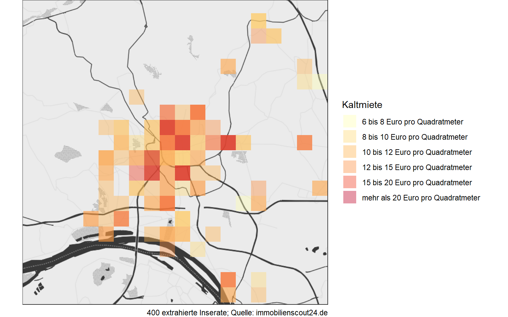
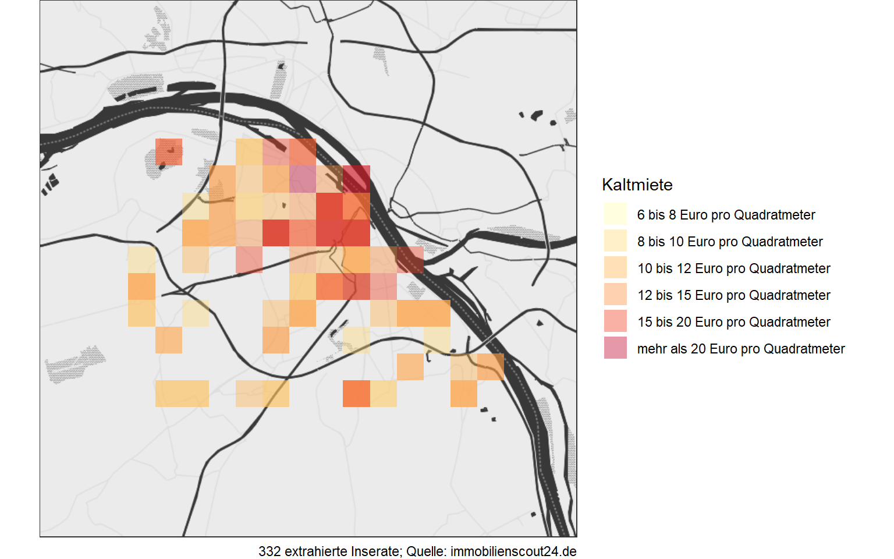

<script src="index_files/libs/kePrint-0.0.1/kePrint.js"></script>


Angebotsmieten spiegeln die gegenwärtige Mietpreissituation auf dem Wohnungsmarkt wider und können, je nach Region, von den Bestandsmieten deutlich abweichen. Befindet man sich gerade auf der Suche nach einer Wohnung, wird man schnell ein Gefühl dafür bekommen, in welchem Stadtteil Wohnraum teuer oder günstig zu haben ist. Bereits vor der Wohnungssuche kann man sich über die Mietsituation in einer Stadt oder Region mit öffentlich zugänglichen Informationen wie dem <a href="https://www.bbsr.bund.de/SiteGlobals/Forms/Suche/VeroeffentlichungsSuche_Formular.html?nn=2547954" target="_blank">Immobilienmarktbericht</a> auseinandersetzen, welcher vom Bundesinstitut für Bau-, Stadt- und Raumforschung erstellt wird. Auch Unternehmen wie die [IdN Immodaten GmbH](https://www.immodaten.net/) bieten ein umfangreiches Datenangebot zum Immobilienmarkt an und werten dabei *26 Quellen auf Inserate von Tageszeitungen und Online-Börsen nach ihren einzelnen Bestandteilen aus* (Stand Juni 2017), wobei hier die Nutzung kostenpflichtig ist.

Mit statistischer Software und dem Internet kann man sich auch selbst ein Bild der aktuellen Mietpreise verschaffen! Benötigt wird dazu RStudio, ein Internetbrowser und eine Webseite mit Wohnungsinseraten wie bspw. [immobilienscout24](https://www.immobilienscout24.de/). Mit dem [CSS Selector Gadget](http://selectorgadget.com) - ein Point-and-Click-Tool zum Identifizieren von sog. *HTML-Nodes* - und dem R-Paket `rvest` können Inhalte von Webseiten extrahiert und verarbeitet werden.

*Hinweis*: Da die Struktur einer Webseite im Zeitverlauf selten statisch ist, kann die fehlerfreie Funktion des Codes nur durch kontinuierliche Pflege gewährleistet werden. Außerdem kann der Betreiber der Webseite das (automatisierte) Extrahieren von Inhalten ausschließen. Nähere Informationen dazu findet man gewöhnlich in der Datei *robots.txt* der jeweiligen Webseite.

## **Datenbeschaffung**

Die Webseite immobilienscout24 bietet eine Suchleiste, mit welcher bspw. innerhalb einer Stadt oder einer Postleitzahl Wohnungsinserate gefunden werden können. Auf einer Ergebnisseite befinden sich dann mehrere Inserate mit den wichtigsten Informationen zur Wohnung (Preis, Größe, ...). Um eine Seite der Suchergebnisse anzusteuern, muss zunächst die `stadt` und das zugehörige `bundesland` definiert werden. Weiterhin ist es ratsam die Seitenanzahl der Suchergebnisse zu prüfen und festzulegen, damit das Extrahieren der Inserate nicht ins Leere läuft.

``` r
stadt <- "Wiesbaden" 

bundesland <- "Hessen"

seiten <- 20 
```

Als Nächstes werden die für die Suche relevanten URLs aus den vorherigen Eingaben generiert. Auch legt man Objekte fest, in denen die extrahierten Inhalte gespeichert werden sollen. Der gesamte Inhalt einer Seite der Suchergebnisse wird in der Liste `seite` gespeichert. Ich möchte später aus den Anzeigen Informationen über `titel`, `lage`, `miete` und `groesse` der Wohnung gewinnen und lege für jedes Merkmal eine leere Liste an.

``` r
# URL Vektor
url <- rep(0, seiten)

# Stamm Adresse
stamm <- "https://www.immobilienscout24.de/"

# Suchergebnisse Seite 1
url[1] <- paste0(stamm,"Suche/S-2/Wohnung-Miete/", bundesland, "/",stadt) 

# Suchergebnisse Seite 2 bis Seite 20
for (x in 2:seiten){
  url[x] <- paste0(stamm,"Suche/S-2/P-", x, "/Wohnung-Miete/", bundesland, "/",stadt)
}

# URL-Inhalt extrahieren und in Liste speichern 
seite <- list()
for (j in 1:seiten){
  seite[[j]] <- xml2::read_html(url[j])
}

# Zu extrahierende Merkmale festlegen
titel <- list()
lage <- list()
miete <- list()
groesse <- list()
```

Nun folgt eine Schleife, welche pro Durchlauf eine Seite der Suchergebnisse extrahiert. Ich habe vorher mit dem CSS Selector Gadget alle relevanten *HTML-Nodes* identifiziert, die ich nun gezielt ansteuere. Bspw. versteckt sich hinter der *Node* `.data-ng-non-bindable` der Titel des Wohnungsinserates.

``` r
for (i in 1:seiten) {
  
  # Titel des Inserats
  titel[[i]] <- seite[[i]] %>%
  html_nodes(".data-ng-non-bindable") %>%
  html_text()
  
  titel[[i]] <- gsub("NEU","", titel[[i]])
  
  # Adresse
  lage[[i]] <- seite[[i]] %>%
    html_nodes(".link-underline") %>%
    html_text()
  
  lage[[i]] <- gsub("\n","", lage[[i]])
  lage[[i]] <- trimws(lage[[i]])
  lage[[i]] <- lage[[i]][-c(1,2,3)]
  
  # Kaltmiete
  miete[[i]] <- seite[[i]] %>%
    html_nodes(".result-list-entry__primary-criterion:nth-child(1) .font-line-xs") %>%
    html_text() %>%
    strtrim(100)
  
  miete[[i]] <- gsub("\n","", miete[[i]])
  miete[[i]] <- trimws(miete[[i]])
  miete[[i]] <- gsub("€","", miete[[i]])
  miete[[i]] <- gsub("\\.","", miete[[i]])
  miete[[i]] <- gsub("\\,",".", miete[[i]])
  miete[[i]] <- as.numeric(miete[[i]])
  
  # Groesse
  groesse[[i]] <- seite[[i]] %>%
    html_nodes(".result-list-entry__primary-criterion:nth-child(2) .font-line-xs") %>%
    html_text() %>%
    strtrim(100)
  
  groesse[[i]] <- gsub("\n"," ", groesse[[i]])
  groesse[[i]] <- trimws(groesse[[i]])
  groesse[[i]] <- gsub("([0-9]+).*","\\1",groesse[[i]])
  groesse[[i]] <- as.numeric(groesse[[i]])
}
```

## **Datenaufbereitung**

Die Listen werden nun in Vektoren umgewandelt und dann in einem *Data Frame* zusammengefasst. Aus den Merkmalen `groesse` und `miete` bilde ich den Quotienten `preis_qm` und entferne, sofern vorhanden, fehlende Angaben. Anschließend erstelle ich das Merkmal `price_cat`, welches für jedes Inserat eine Preiskategorie angibt.

``` r
# Listen in Vektoren umwandeln
titel <-unlist(titel)
lage <- unlist(lage)
miete <- unlist(miete)
groesse <- unlist(groesse)

# Neues Merkmal
preis_qm <- miete/groesse

# Data Frame erstellen
daten <- data.frame(titel, lage, miete, groesse, preis_qm)

# Fehlende Werte entfernen
daten <- subset(daten, (!is.na(daten$preis_qm)))

# Preiskategorie
daten$pricecat[daten$preis_qm>=6  & daten$preis_qm < 8]  = 1
daten$pricecat[daten$preis_qm>=8  & daten$preis_qm < 10] = 2
daten$pricecat[daten$preis_qm>=10 & daten$preis_qm < 12] = 3
daten$pricecat[daten$preis_qm>=12 & daten$preis_qm < 15] = 4
daten$pricecat[daten$preis_qm>=15 & daten$preis_qm < 20] = 5
daten$pricecat[daten$preis_qm>=20] = 6

daten$pricecat <- factor(daten$pricecat, 
                         levels=c("1","2", "3","4","5","6"), 
                         labels=c("6 bis 8 Euro pro Quadratmeter",
                                  "8 bis 10 Euro pro Quadratmeter", 
                                  "10 bis 12 Euro pro Quadratmeter",
                                  "12 bis 15 Euro pro Quadratmeter",
                                  "15 bis 20 Euro pro Quadratmeter",
                                  "mehr als 20 Euro pro Quadratmeter"))
```

## **Datenanalyse**

Am 18.06.2017 konnte ich für Wiesbaden 400 Inserate extrahieren. Unten ist ein Auszug aus diesem Datensatz dargestellt.

<div style="border: 1px solid #ddd; padding: 0px; overflow-y: scroll; height:300px; overflow-x: scroll; width:100%; ">

| titel                                                                                    | lage                                       | miete | groesse |  preis_qm |
|:-----------------------------------------------------------------------------------------|:-------------------------------------------|------:|--------:|----------:|
| SCHÖNE EINLIEGERWOHNUNG in RUHIGER,STADTNAHER LAGE ( WI-SONNENBERG/EIGENHEIM)            | Sonnenberg, Wiesbaden                      |   900 |      57 | 15.789474 |
| 1-Zimmer-Wohnung Wiesbaden, sehr zentrale Lage                                           | Schiersteiner Str., Südost, Wiesbaden      |   700 |      22 | 31.818182 |
| Schöne zwei Zimmer Penthouse- Wohnung in Wiesbaden, Dotzheim                             | Greifstraße 7 a, Dotzheim, Wiesbaden       |   650 |      63 | 10.317460 |
| Von privat. Helle Zweizimmer-Wohnung in Wiesbaden-Biebrich, Straße der Republik          | Straße der Republik 2, Biebrich, Wiesbaden |   450 |      58 |  7.758621 |
| Möblierte, schöne, geräumige zwei Zimmer Altbau-Wohnung in Wiesbaden, Südost             | Raabestraße 1, Südost, Wiesbaden           |   920 |      70 | 13.142857 |
| Rheinufernähe, große 6 Zimmer Wohnung auf zwei Etagen                                    | Kastel, Wiesbaden                          |  1500 |     190 |  7.894737 |
| Total renovierte Singlewohnung                                                           | Biebrich, Wiesbaden                        |   505 |      44 | 11.477273 |
| Exclusive neu renovierte 2,5 Zimmer Wohnung am Kurpark                                   | Bierstadt, Wiesbaden                       |  1100 |      75 | 14.666667 |
| Helle und ruhig gelegene 2-Zimmer-Wohnung mit Balkon seitlich Otto-Suhr-Ring             | Steinernstraße, Kostheim, Wiesbaden        |   490 |      49 | 10.000000 |
| Helles Einzimmerappartement in Wiesbaden, Mitte                                          | Frankenstraße, Mitte, Wiesbaden            |   350 |      34 | 10.294118 |
| Loreleiring: Eine schicke 3 - ZKBB sucht nette Mieter.                                   | Rheingauviertel, Wiesbaden                 |   600 |      80 |  7.500000 |
| 720 \<U+0080\>, 67 m², 3 Zimmer                                                          | Biebrich, Wiesbaden                        |   720 |      67 | 10.746269 |
| \*\*Wunderbare Wohnung mit Terrasse und EBK\*\*                                          | Kostheim, Wiesbaden                        |   660 |      73 |  9.041096 |
| Altbau-Dachgeschosswohnung mit Blick über Wiesbaden                                      | Adelheidstraße, Mitte, Wiesbaden           |   650 |      62 | 10.483871 |
| Helle und geräumige 1-Zimmer Wohnung in Wiesbaden, Kastel                                | Römerstr., Kastel, Wiesbaden               |   425 |      50 |  8.500000 |
| Traumhafte 2-Zimmer-Wohnungen in Toplage mit Panoramablick - Erstbezug!                  | Schönbergstr., Dotzheim, Wiesbaden         |   695 |      53 | 13.113208 |
| 650 \<U+0080\>, 56 m², 2 Room(s)                                                         | Nußbaumstraße 1, Südost, Wiesbaden         |   650 |      56 | 11.607143 |
| großzügig geschnittene 4 Zimmer Wohnung mit Gartennutzung                                | Mitte, Wiesbaden                           |  1250 |     145 |  8.620690 |
| Mitten im Leben: Helle 4 Zimmer Wohnung im einem gepflegten Altbau fußläufig zum Zentrum | Mitte, Wiesbaden                           |   885 |     102 |  8.676471 |
| Nerotal - sanierte Wohnung mit Balkon und Garage                                         | Nordost, Wiesbaden                         |   920 |      83 | 11.084337 |

</div>

Für Mainz habe ich 332 Inserate erhalten.

<div style="border: 1px solid #ddd; padding: 0px; overflow-y: scroll; height:300px; overflow-x: scroll; width:100%; ">

| titel                                                                                          | lage                                                 | miete | groesse |  preis_qm |
|:-----------------------------------------------------------------------------------------------|:-----------------------------------------------------|------:|--------:|----------:|
| Schnuckeliges 2 Zimmer Haus mit Terrasse                                                       | Bretzenheim, Mainz                                   |   780 |      73 | 10.684931 |
| Schöne zwei Zimmer Wohnung in Mainz, Gonsenheim                                                | Gonsenheim, Mainz                                    |   640 |      64 | 10.000000 |
| Helle Einraumwohnung mit Sonnenterrassennutzung mitten in der City                             | Altstadt, Mainz                                      |   520 |      44 | 11.818182 |
| Ruhige Traum Wohnung mit Luxusausstattung und Loggia im 3.OG Zollhafen\.... Erstbezug          | Neustadt, Mainz                                      |  1750 |     119 | 14.705882 |
| Studenten aufgepasst \" Super WG. geeignete 2 Zimmerwohnung mit Gartennutzung                  | Gonsenheim, Mainz                                    |   675 |      61 | 11.065574 |
| Schöne zwei Zimmer Wohnung in Mainz, Oberstadt                                                 | Oberstadt, Mainz                                     |   690 |      60 | 11.500000 |
| Helles Studio Apartment, top saniert, möbliert & zentral                                       | Kaiserstr, Neustadt, Mainz                           |   650 |      40 | 16.250000 |
| Hochwertige Wohnung mit Blick ins Grüne in Haus mit vier Parteien in Mainz-Bretzenheim         | Bretzenheim, Mainz                                   |  1100 |      92 | 11.956522 |
| Für Stadtliebhaber!Gepflegtes Aparment mit Einbauküche,Gemeinschaftsdachterrasse & Tiefgarage. | Klarastraße, Altstadt, Mainz                         |   500 |      38 | 13.157895 |
| Attraktive, helle 2 Zimmer Wohnung mit 2 Balkone und Einbauküche                               | Hartenberg/Münchfeld, Mainz                          |   780 |      83 |  9.397590 |
| Schön möbliertes 1-Zi. Appartement in Mainz, Hartenberg/Münchfeld                              | Richard Schirrmann Str., Hartenberg/Münchfeld, Mainz |   350 |      22 | 15.909091 |
| In einem wunderschönen Neubauhaus, schöne 2KB, Einbauküche, Terrasse, Mainz-Neustadt           | Zollhafen, Neustadt, Mainz                           |   950 |      70 | 13.571429 |
| Wohnen im Grünen, stadtnah!                                                                    | Katzenberg, Finthen, Mainz                           |   500 |      61 |  8.196721 |
| 1.390 \<U+0080\>, 92 m², 3 Zimmer                                                              | An der Karlsschanze, Oberstadt, Mainz                |  1390 |      92 | 15.108696 |
| Helle sonnige Dachgeschoßwohnung im Zweifamilienhaus in Mainz-Laubenheim                       | Enggäßchen, Laubenheim, Mainz                        |   690 |      65 | 10.615385 |
| Schöne drei Zimmer Wohnung in Mainz, Altstadt                                                  | Walpodenstr., Altstadt, Mainz                        |   690 |      60 | 11.500000 |
| schöne helle 7-Zimme-Altbauwohnung, geeignet für Arbeiten u. Wohnen                            | Kaiserstraße, Altstadt, Mainz                        |  1800 |     180 | 10.000000 |
| Mainz-Mombach, sehr schönes helles Souterrain-Appartement                                      | An der Brunnenstube 15/6, Mombach, Mainz             |   376 |      28 | 13.428571 |
| 1-Zimmer Appartment - Nähe Uniklinik                                                           | Untere Zahlbacher Straße, Oberstadt, Mainz           |   350 |      30 | 11.666667 |
| Schöne, geräumige drei Zimmer Wohnung in Mainz, Ebersheim                                      | Ebersheim, Mainz                                     |   840 |      98 |  8.571429 |

</div>

Mit dem R Paket `ggmap` werde ich nun die Mietpreise visualisieren. Zunächst mussten die Adressen der Inserate mit der Geocoding API von Google georeferenziert werden. Zum Teil enthalten die Inserate nur ungenaue Adressangaben, wie den Stadtteil mit der zugehörigen Postleitzahl. An allen Punkten, die die API lediglich mit der Postleitzahl assoziiert, entsteht so eine zu hohe Konzentration von Angeboten.

Für die grafische Darstellung verwende ich die Funktion `stat_bin2d()` aus dem R-Paket `ggplot2`, welche Beobachtungen innerhalb von Rechtecken zusammenfasst und eine Hitzekarte erstellt. Eine Konzentration von Inseraten mit niedriger bzw. hoher Kaltmiete wird durch die Farbe Gelb bzw. Rot dargestellt.

Unten befindet sich eine Karte mit den Kaltmieten der Angebote innerhalb Wiesbadens. Besonders im Norden von Wiesbaden (Nordost, Sonnenberg) sowie im Süden (Künstlerviertel, Südost) ist Wohnraum relativ teuer. In zentraler Lage (Mitte, Westend) sind die Wohnungen hingegen durchschnittlich etwas günstiger.

``` r
# Karte von Wiesbaden
karte_wi = qmap("Wiesbaden", zoom = 12, color = "bw",
                source = "stadia", maptype = "stamen_toner_background",
                darken = c(.3, "#BBBBBB"))

# Heatmap
karte_wi + 
  stat_bin2d(
    aes(x = long, y = lati, fill = as.factor(pricecat)),
    size = 1, bins = 20, alpha = 0.4, data = daten_wi
    ) +
  scale_fill_brewer(type = "seq", palette = "YlOrRd") +
  labs(caption = paste0(
    dim(daten_wi)[1],
    " extrahierte Inserate; Quelle: immobilienscout24.de")
    ) + 
  guides(fill = guide_legend(title="Kaltmiete"))
```



------------------------------------------------------------------------

Es folgt die gleiche Darstellung für Mainz. Hier ist das Mietniveau in der Innenstadt (Neu- und Altstadt) besonders hoch. In den Randbezirken ist es dagegen im Durchschnit etwas günstiger.

``` r
# Karte von Mainz
karte_mz = qmap("Mainz", zoom = 12, color = "bw",
                source = "stadia", maptype = "stamen_toner_background",
                darken = c(.3, "#BBBBBB"))

# Heatmap
karte_mz + 
  stat_bin2d(
    aes(x = long, y = lati, fill = as.factor(pricecat)),
    size = 1, bins = 20, alpha = 0.4, data = daten_mz) +
  scale_fill_brewer(type = "seq", palette = "YlOrRd") +
  labs(caption = paste0(
    dim(daten_mz)[1],
    " extrahierte Inserate; Quelle: immobilienscout24.de")
    ) + 
  guides(fill = guide_legend(title="Kaltmiete"))
```


