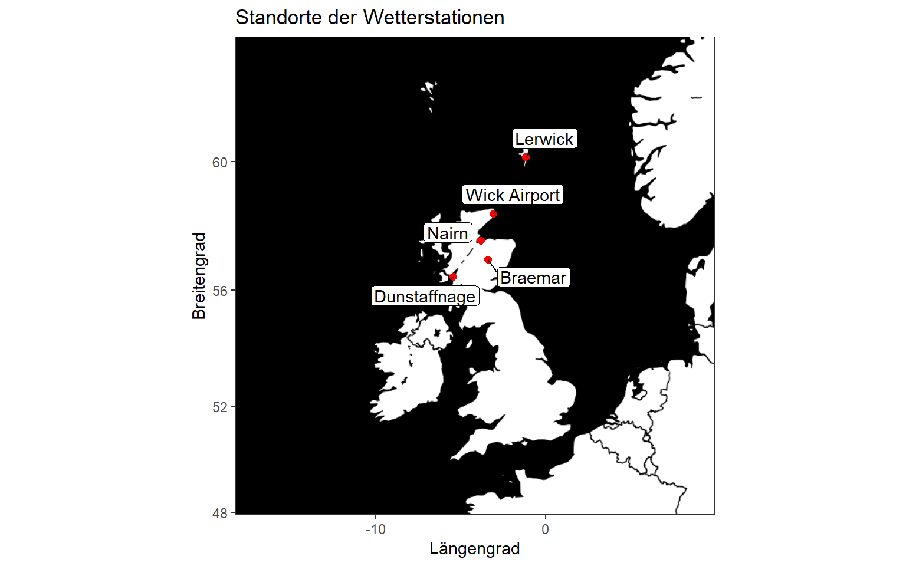
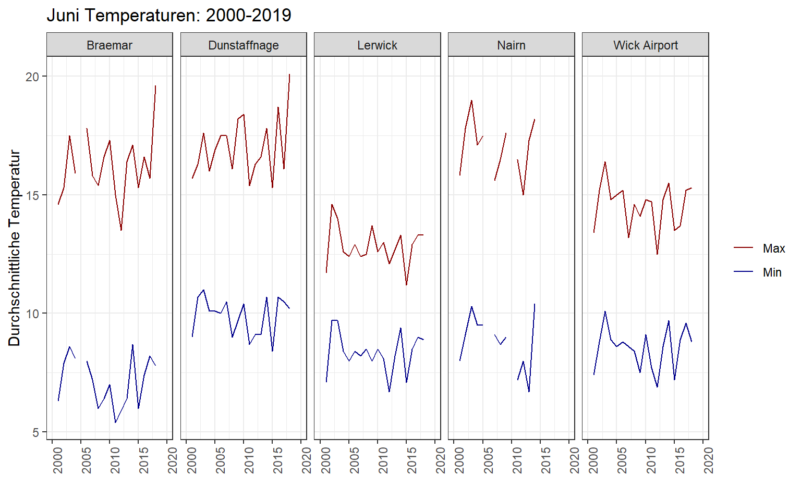
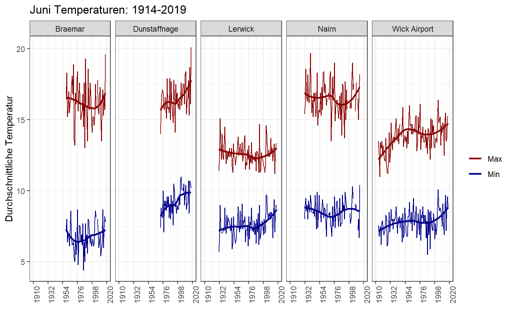
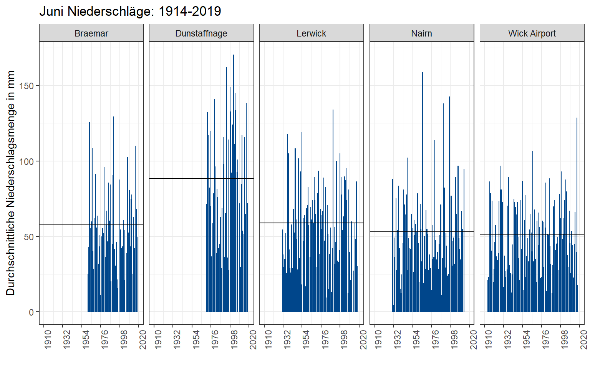

<script src="index_files/libs/kePrint-0.0.1/kePrint.js"></script>


Im Juni steht meine lang ersehnte Rucksackreise nach Schottland an; höchste Zeit sich etwas genauer mit dem dortigen Wetter auseinanderzusetzen. Einschlägige Tourismus-Webseiten verraten mir: *Scotland is famous for having four seasons in one day!* - die Regenkleidung muss also eingepackt werden. Auf meine Wintermütze würde ich dagegen schon gerne verzichten - es ist ja schließlich Sommer?!

## **Datenbeschaffung**

Auf der Webseite des nationalen meteorologischen Dienstes des Vereinigten Königreichs habe ich [historische Wetterdaten](https://www.metoffice.gov.uk/research/climate/maps-and-data/historic-station-data) ausfindig machen können. Ich habe dabei nur Stationen berücksichtigt, die sich in Schottland befinden.

## **Datenaufbereitung**

Pro Wetterstation gibt es eine *.txt* Datei mit historischen Daten. Diese werden mit der Funktion `read_table()` aus dem R-Paket `readr` eingelesen. Fehlende Werte identifziere ich mit dem Arumgent `na =`. Mit dem Argument `col_types =` können die Formate der Spalten vorab festgelegt werden. Da alle Dateien den gleichen Aufbau bzgl. der Spalten haben, verwende ich die Funktion `map_dfr()` aus dem R-Paket `purrr` um alle Dateien *in einem Rutsch* einzulesen. Damit die Daten unterscheidbar bleiben, erstelle ich einen Identifikator für jede Wetterstation.

``` r
data_weather <-
  map_dfr(
    c("dunstaffnage", "wickairport", 
      "nairn", "lerwick","braemar"),
    ~ read_table(paste0("data/",., "data.txt"), 
                 na = "---", col_types = "iiddid"), 
    .id = "source") %>%
  mutate(station = case_when(
    source == "1" ~ "Dunstaffnage",
    source == "2" ~ "Wick Airport",
    source == "3" ~ "Nairn",
    source == "4" ~ "Lerwick",
    source == "5" ~ "Braemar",
  )) %>%
  select(-c(source, af))
```

Der Datensatz enthält Angaben zum Datum der Aufzeichnung (Jahr und Monat), der durchschnittlichen Tiefst- und Höchsttemperatur sowie eine Angabe zur durchschnittlichen Niederschlagsmenge. Die verfügbaren Zeiträume der Wetterangaben unterscheiden sich von Station zu Station. Für die Wetterstation `Wick Airport` liegen bspw. Daten zurück bis 1914 vor. Damit dieser Umstand im Datensatz und bei der Analyse besser ersichtlich ist, verwende ich die Funktion `complete()` aus dem R-Paket `tidyr`, um nicht vorliegende Wetterangaben einer Station mit `NA` Werten zu füllen und so die verfügbaren Zeitangaben über alle Stationen hinweg zu harmonisieren.

``` r
data_weather <- complete(data_weather, station, nesting(yyyy, mm))
```

Unten findet man einen Ausschnitt des Datensatzes.

<div style="border: 1px solid #ddd; padding: 0px; overflow-y: scroll; height:300px; overflow-x: scroll; width:100%; ">

| station      | yyyy |  mm | tmax | tmin |  rain |
|:-------------|-----:|----:|-----:|-----:|------:|
| Wick Airport | 1914 |   1 |  5.9 |  0.9 |  48.3 |
| Wick Airport | 1914 |   2 |  7.7 |  2.3 |  66.0 |
| Wick Airport | 1914 |   3 |  6.4 |  1.1 |  76.7 |
| Wick Airport | 1914 |   4 | 10.8 |  4.4 |  27.9 |
| Wick Airport | 1914 |   5 | 10.7 |  4.4 |  61.0 |
| Wick Airport | 1914 |   6 | 13.5 |  7.6 |  21.1 |
| Wick Airport | 1914 |   7 | 14.4 | 10.2 |  91.9 |
| Wick Airport | 1914 |   8 | 15.2 | 10.2 |  40.6 |
| Wick Airport | 1914 |   9 | 13.4 |  7.9 |  58.9 |
| Wick Airport | 1914 |  10 | 11.8 |  6.1 |  48.8 |
| Wick Airport | 1914 |  11 |  8.8 |  3.0 | 105.2 |
| Wick Airport | 1914 |  12 |  5.7 |  0.5 |  84.1 |
| Wick Airport | 1915 |   1 |  5.6 |  1.3 |  58.4 |
| Wick Airport | 1915 |   2 |  5.5 |  0.9 |  63.5 |
| Wick Airport | 1915 |   3 |  6.7 |  1.0 |  50.8 |
| Wick Airport | 1915 |   4 |  8.7 |  2.4 |  58.4 |
| Wick Airport | 1915 |   5 |  9.4 |  3.6 |  12.7 |
| Wick Airport | 1915 |   6 | 12.6 |  6.8 |  22.9 |
| Wick Airport | 1915 |   7 | 14.3 |  8.9 |  63.5 |
| Wick Airport | 1915 |   8 | 14.6 | 10.3 |  22.9 |
| Wick Airport | 1915 |   9 | 13.2 |  8.7 |  86.4 |
| Wick Airport | 1915 |  10 | 10.9 |  5.2 |  27.9 |
| Wick Airport | 1915 |  11 |  6.3 |  1.2 |  96.5 |
| Wick Airport | 1915 |  12 |  5.4 |  0.2 | 111.8 |
| Wick Airport | 1916 |   1 |  7.7 |  2.8 |  76.2 |
| Wick Airport | 1916 |   2 |  5.3 |  1.0 |  33.0 |
| Wick Airport | 1916 |   3 |  4.7 |  0.6 |  53.3 |
| Wick Airport | 1916 |   4 |  8.7 |  3.0 |  43.2 |
| Wick Airport | 1916 |   5 |  9.7 |  5.1 |  78.7 |
| Wick Airport | 1916 |   6 | 11.0 |  7.3 |  86.4 |
| Wick Airport | 1916 |   7 | 13.8 |  9.6 |  33.0 |
| Wick Airport | 1916 |   8 | 13.5 |  8.8 |  30.5 |
| Wick Airport | 1916 |   9 | 13.4 |  8.1 |  33.0 |
| Wick Airport | 1916 |  10 | 11.1 |  5.4 |  94.0 |
| Wick Airport | 1916 |  11 |  9.0 |  4.3 |  66.0 |
| Wick Airport | 1916 |  12 |  6.3 |  1.0 |  86.4 |
| Wick Airport | 1917 |   1 |  4.6 |  0.8 |  94.0 |
| Wick Airport | 1917 |   2 |  5.3 |  0.4 |  17.8 |
| Wick Airport | 1917 |   3 |  5.4 |  0.2 |  53.3 |
| Wick Airport | 1917 |   4 |  6.8 |  0.0 |  58.4 |
| Wick Airport | 1917 |   5 | 10.1 |  4.7 |  20.3 |
| Wick Airport | 1917 |   6 | 13.4 |  7.5 |  78.7 |
| Wick Airport | 1917 |   7 | 14.4 |  9.5 |  35.6 |
| Wick Airport | 1917 |   8 | 14.9 | 10.7 |  63.5 |
| Wick Airport | 1917 |   9 | 14.3 |  8.3 |  81.3 |
| Wick Airport | 1917 |  10 |  9.2 |  3.1 | 127.0 |
| Wick Airport | 1917 |  11 |  9.0 |  3.6 | 124.5 |
| Wick Airport | 1917 |  12 |  5.5 |  1.1 |  40.6 |
| Wick Airport | 1918 |   1 |  4.3 | -1.8 |  48.3 |
| Wick Airport | 1918 |   2 |  7.2 |  2.8 |  58.4 |
| Wick Airport | 1918 |   3 |  7.3 |  1.8 |  35.6 |
| Wick Airport | 1918 |   4 |  7.4 |  2.4 |  30.5 |
| Wick Airport | 1918 |   5 | 11.7 |  6.9 |  35.6 |
| Wick Airport | 1918 |   6 | 13.0 |  6.2 |  40.6 |
| Wick Airport | 1918 |   7 | 13.6 |  9.7 | 139.7 |
| Wick Airport | 1918 |   8 | 15.0 | 10.3 | 127.0 |
| Wick Airport | 1918 |   9 | 11.5 |  5.3 | 101.6 |
| Wick Airport | 1918 |  10 | 10.8 |  5.6 |  48.3 |
| Wick Airport | 1918 |  11 |  8.5 |  3.1 |  53.3 |
| Wick Airport | 1918 |  12 |  6.9 |  2.7 |  96.5 |
| Wick Airport | 1919 |   1 |  5.8 |  2.4 |  81.3 |
| Wick Airport | 1919 |   2 |  4.3 | -1.1 |  38.1 |
| Wick Airport | 1919 |   3 |  4.9 | -0.4 |  86.4 |
| Wick Airport | 1919 |   4 |  9.2 |  2.7 |  50.8 |
| Wick Airport | 1919 |   5 | 10.8 |  6.3 |  15.2 |
| Wick Airport | 1919 |   6 | 13.5 |  7.7 |  73.7 |
| Wick Airport | 1919 |   7 | 13.7 |  8.3 |  20.3 |
| Wick Airport | 1919 |   8 | 14.7 |  8.8 |  86.4 |
| Wick Airport | 1919 |   9 | 13.3 |  6.7 |  96.5 |
| Wick Airport | 1919 |  10 | 10.2 |  4.7 |  71.1 |
| Wick Airport | 1919 |  11 |  5.7 |  0.2 | 124.5 |
| Wick Airport | 1919 |  12 |  5.7 |  0.5 | 124.5 |
| Wick Airport | 1920 |   1 |  5.8 |  0.2 |  83.8 |
| Wick Airport | 1920 |   2 |  7.4 |  1.7 |  60.2 |
| Wick Airport | 1920 |   3 |  7.7 |  1.9 |  80.5 |
| Wick Airport | 1920 |   4 |  7.8 |  2.9 |  50.8 |
| Wick Airport | 1920 |   5 | 10.9 |  5.1 |  72.6 |
| Wick Airport | 1920 |   6 | 12.6 |  7.9 |  19.8 |
| Wick Airport | 1920 |   7 | 14.8 |  8.6 |  48.0 |
| Wick Airport | 1920 |   8 | 14.0 |  8.4 |  24.1 |
| Wick Airport | 1920 |   9 | 13.3 |  7.1 |  62.0 |
| Wick Airport | 1920 |  10 | 11.8 |  8.6 |  15.7 |
| Wick Airport | 1920 |  11 |  9.9 |  5.0 |  84.6 |
| Wick Airport | 1920 |  12 |  7.0 |  2.3 |  60.7 |
| Wick Airport | 1921 |   1 |  7.2 |  1.7 |  71.6 |
| Wick Airport | 1921 |   2 |  7.9 |  3.1 |  28.7 |
| Wick Airport | 1921 |   3 |  7.9 |  1.6 |  40.9 |
| Wick Airport | 1921 |   4 |  9.6 |  3.7 |  25.9 |
| Wick Airport | 1921 |   5 | 11.9 |  5.1 |  43.2 |
| Wick Airport | 1921 |   6 | 13.2 |  7.3 |  28.4 |
| Wick Airport | 1921 |   7 | 14.9 |  9.3 |  61.5 |
| Wick Airport | 1921 |   8 | 14.1 |  8.6 |  47.2 |
| Wick Airport | 1921 |   9 | 13.7 |  8.5 |  80.8 |
| Wick Airport | 1921 |  10 | 12.2 |  7.4 |  58.7 |
| Wick Airport | 1921 |  11 |  7.1 |  3.4 |  49.5 |
| Wick Airport | 1921 |  12 |  7.2 |  3.3 | 105.2 |
| Wick Airport | 1922 |   1 |  4.9 |  1.9 |  83.1 |
| Wick Airport | 1922 |   2 |  5.8 |  1.7 |  45.7 |
| Wick Airport | 1922 |   3 |  6.7 |  1.9 |  42.7 |
| Wick Airport | 1922 |   4 |  6.9 |  1.4 |  86.6 |
| Wick Airport | 1922 |   5 | 11.8 |  5.2 |  46.5 |
| Wick Airport | 1922 |   6 | 12.5 |  6.9 |  46.0 |
| Wick Airport | 1922 |   7 | 13.3 |  7.8 |  80.3 |
| Wick Airport | 1922 |   8 | 13.6 |  8.3 |  52.1 |
| Wick Airport | 1922 |   9 | 12.6 |  7.2 |  71.4 |
| Wick Airport | 1922 |  10 | 10.2 |  5.9 |  39.1 |
| Wick Airport | 1922 |  11 |  8.1 |  3.8 |  67.8 |
| Wick Airport | 1922 |  12 |  7.1 |  3.6 |  60.5 |
| Wick Airport | 1923 |   1 |  7.1 |  3.1 | 100.8 |
| Wick Airport | 1923 |   2 |  5.7 |   NA |  62.0 |
| Wick Airport | 1923 |   3 |  6.9 |  3.9 |  18.3 |
| Wick Airport | 1923 |   4 |  7.0 |  3.8 |  69.6 |
| Wick Airport | 1923 |   5 |  9.3 |  3.9 |  93.2 |
| Wick Airport | 1923 |   6 | 12.2 |  7.0 |  57.4 |
| Wick Airport | 1923 |   7 | 15.2 | 10.1 |  69.9 |
| Wick Airport | 1923 |   8 | 14.3 |  9.3 |  91.4 |
| Wick Airport | 1923 |   9 | 12.8 |  7.3 |  84.8 |
| Wick Airport | 1923 |  10 | 10.2 |  5.4 | 112.3 |
| Wick Airport | 1923 |  11 |  5.9 |  2.0 | 111.0 |
| Wick Airport | 1923 |  12 |  5.4 |  1.9 | 110.5 |
| Wick Airport | 1924 |   1 |  6.1 |  3.4 |  49.5 |
| Wick Airport | 1924 |   2 |  5.7 |  2.7 |  57.2 |
| Wick Airport | 1924 |   3 |  4.9 |  0.9 |  39.9 |
| Wick Airport | 1924 |   4 |  8.2 |  2.6 |  26.2 |
| Wick Airport | 1924 |   5 |  9.4 |  5.1 |  58.4 |
| Wick Airport | 1924 |   6 | 12.1 |  7.4 |  36.6 |
| Wick Airport | 1924 |   7 | 14.8 |  9.6 |  97.8 |
| Wick Airport | 1924 |   8 | 14.8 | 10.3 |  58.4 |
| Wick Airport | 1924 |   9 | 13.2 |  8.1 | 103.1 |
| Wick Airport | 1924 |  10 | 11.1 |  6.9 |  59.7 |
| Wick Airport | 1924 |  11 |  9.2 |  6.2 |  37.8 |
| Wick Airport | 1924 |  12 |  8.2 |  5.1 |  37.6 |
| Wick Airport | 1925 |   1 |  6.6 |  3.7 |  39.6 |
| Wick Airport | 1925 |   2 |  5.7 |  1.7 |  77.2 |
| Wick Airport | 1925 |   3 |  6.7 |  1.7 |  58.7 |
| Wick Airport | 1925 |   4 |  8.2 |  3.1 |  41.9 |
| Wick Airport | 1925 |   5 | 10.4 |  6.5 |  53.6 |
| Wick Airport | 1925 |   6 | 13.7 |  8.3 |  34.5 |
| Wick Airport | 1925 |   7 | 15.4 | 10.8 |  77.5 |
| Wick Airport | 1925 |   8 | 14.1 |  9.5 |  47.0 |
| Wick Airport | 1925 |   9 | 11.5 |  7.4 |  47.0 |
| Wick Airport | 1925 |  10 | 10.4 |  6.7 |  73.9 |
| Wick Airport | 1925 |  11 |  6.7 |  2.5 |  47.5 |
| Wick Airport | 1925 |  12 |  4.1 |  0.2 |  65.8 |
| Wick Airport | 1926 |   1 |  6.3 |  3.6 |  56.4 |
| Wick Airport | 1926 |   2 |  6.7 |  3.3 |  53.3 |
| Wick Airport | 1926 |   3 |  7.6 |  3.1 |  70.6 |
| Wick Airport | 1926 |   4 |  9.2 |  5.0 |  68.8 |
| Wick Airport | 1926 |   5 |  9.8 |  5.0 |  48.0 |
| Wick Airport | 1926 |   6 | 11.9 |  8.2 |  39.1 |
| Wick Airport | 1926 |   7 | 14.9 | 10.1 |  39.6 |
| Wick Airport | 1926 |   8 | 15.1 | 10.3 |  51.3 |
| Wick Airport | 1926 |   9 | 13.4 |  8.4 |  76.2 |
| Wick Airport | 1926 |  10 |  8.7 |  3.6 | 158.5 |
| Wick Airport | 1926 |  11 |  7.9 |  3.7 |  62.2 |
| Wick Airport | 1926 |  12 |  6.7 |  2.8 |  89.7 |
| Wick Airport | 1927 |   1 |  6.2 |  1.9 |  62.5 |
| Wick Airport | 1927 |   2 |  6.8 |  2.9 |  50.3 |
| Wick Airport | 1927 |   3 |  8.2 |  3.9 |  40.9 |
| Wick Airport | 1927 |   4 |  8.0 |  2.1 | 106.9 |
| Wick Airport | 1927 |   5 |  8.9 |  4.3 |  52.6 |
| Wick Airport | 1927 |   6 | 11.3 |  6.1 |  73.4 |
| Wick Airport | 1927 |   7 | 14.4 | 10.1 |  32.5 |
| Wick Airport | 1927 |   8 | 14.6 | 10.3 |  50.8 |
| Wick Airport | 1927 |   9 | 12.1 |  7.6 |  83.3 |
| Wick Airport | 1927 |  10 | 10.7 |  5.8 | 101.6 |
| Wick Airport | 1927 |  11 |  7.6 |  3.8 |  92.2 |
| Wick Airport | 1927 |  12 |  5.3 |  2.1 |  22.4 |
| Wick Airport | 1928 |   1 |  5.7 |  2.0 | 119.4 |
| Wick Airport | 1928 |   2 |  6.6 |  2.2 |  42.9 |
| Wick Airport | 1928 |   3 |  6.2 |  3.4 |  42.9 |
| Wick Airport | 1928 |   4 |  8.1 |  4.2 |  40.6 |
| Wick Airport | 1928 |   5 |  9.4 |  6.0 |  36.6 |
| Wick Airport | 1928 |   6 | 11.2 |  6.3 |  81.0 |
| Wick Airport | 1928 |   7 | 13.8 |  9.4 |  55.1 |
| Wick Airport | 1928 |   8 | 13.1 |  9.6 |  53.1 |
| Wick Airport | 1928 |   9 | 12.8 |  7.9 |  60.7 |
| Wick Airport | 1928 |  10 | 11.1 |  6.6 |  64.5 |
| Wick Airport | 1928 |  11 |  8.6 |  4.5 | 116.3 |
| Wick Airport | 1928 |  12 |  6.2 |  3.3 |  88.1 |
| Wick Airport | 1929 |   1 |  4.8 |  0.9 |  32.5 |
| Wick Airport | 1929 |   2 |  4.3 |  1.4 |  35.6 |
| Wick Airport | 1929 |   3 |  9.1 |  3.5 |  22.4 |
| Wick Airport | 1929 |   4 |  6.6 |  1.9 |  42.9 |
| Wick Airport | 1929 |   5 | 10.9 |  5.8 |  49.3 |
| Wick Airport | 1929 |   6 | 12.0 |  7.4 |  96.8 |
| Wick Airport | 1929 |   7 | 14.4 |  9.0 |  33.3 |
| Wick Airport | 1929 |   8 | 14.3 |  9.4 | 121.7 |
| Wick Airport | 1929 |   9 | 14.4 |  9.2 |  89.4 |
| Wick Airport | 1929 |  10 | 10.2 |  5.3 | 112.0 |
| Wick Airport | 1929 |  11 |  7.9 |  4.3 |  81.3 |
| Wick Airport | 1929 |  12 |  6.5 |  3.8 | 142.5 |
| Wick Airport | 1930 |   1 |  5.9 |  2.6 |  51.1 |
| Wick Airport | 1930 |   2 |  5.3 |  1.1 |  31.0 |
| Wick Airport | 1930 |   3 |  5.4 |  0.7 |  40.6 |
| Wick Airport | 1930 |   4 |  8.2 |  4.4 |  53.8 |
| Wick Airport | 1930 |   5 |  9.8 |  5.6 |  38.4 |
| Wick Airport | 1930 |   6 | 14.1 |  8.5 |  81.0 |
| Wick Airport | 1930 |   7 | 14.4 |  9.9 |  34.5 |
| Wick Airport | 1930 |   8 | 14.9 | 10.7 | 141.5 |
| Wick Airport | 1930 |   9 | 13.5 |  9.8 |  98.3 |
| Wick Airport | 1930 |  10 | 10.4 |  7.0 |  92.5 |
| Wick Airport | 1930 |  11 |  6.9 |  2.8 |  97.8 |
| Wick Airport | 1930 |  12 |  7.2 |  3.0 |  51.8 |
| Wick Airport | 1931 |   1 |  5.5 |  0.6 |  79.5 |
| Wick Airport | 1931 |   2 |  5.2 |  0.2 |  73.8 |
| Wick Airport | 1931 |   3 |  4.7 | -0.5 |  29.7 |
| Wick Airport | 1931 |   4 |  8.3 |  2.9 |  46.2 |
| Wick Airport | 1931 |   5 | 10.6 |  6.0 | 124.6 |
| Wick Airport | 1931 |   6 | 12.0 |  7.1 |  72.8 |
| Wick Airport | 1931 |   7 | 14.2 | 10.1 |  74.5 |
| Wick Airport | 1931 |   8 | 13.2 |   NA |  27.1 |
| Wick Airport | 1931 |   9 | 12.8 |  7.7 |  23.8 |
| Wick Airport | 1931 |  10 | 10.9 |  4.8 |  74.4 |
| Wick Airport | 1931 |  11 |  9.7 |  6.1 |  67.0 |
| Wick Airport | 1931 |  12 |  8.2 |  3.1 |  71.1 |
| Wick Airport | 1932 |   1 |  8.2 |  2.6 |  86.5 |
| Wick Airport | 1932 |   2 |  7.6 |  3.0 |  13.8 |
| Wick Airport | 1932 |   3 |  6.6 |  1.9 |  52.0 |
| Wick Airport | 1932 |   4 |  7.6 |  1.6 |  75.4 |
| Wick Airport | 1932 |   5 | 10.1 |  5.5 |  35.5 |
| Wick Airport | 1932 |   6 | 12.6 |  7.8 |  16.6 |
| Wick Airport | 1932 |   7 | 15.5 |  9.9 |  76.3 |
| Wick Airport | 1932 |   8 | 15.6 | 10.4 |  69.0 |
| Wick Airport | 1932 |   9 | 13.5 |  7.4 |  97.1 |
| Wick Airport | 1932 |  10 |  9.8 |  4.6 | 125.3 |
| Wick Airport | 1932 |  11 |  8.4 |  3.0 |  74.3 |
| Wick Airport | 1932 |  12 |  7.7 |  2.9 |  51.1 |
| Wick Airport | 1933 |   1 |  5.7 |  0.8 |  44.6 |
| Wick Airport | 1933 |   2 |  5.3 |  0.5 |  86.8 |
| Wick Airport | 1933 |   3 |  8.5 |  3.4 |  47.4 |
| Wick Airport | 1933 |   4 |  9.2 |  3.9 |  34.4 |
| Wick Airport | 1933 |   5 | 10.3 |  5.7 |  18.4 |
| Wick Airport | 1933 |   6 | 14.8 |  8.7 |  37.2 |
| Wick Airport | 1933 |   7 | 17.3 | 11.5 |  56.2 |
| Wick Airport | 1933 |   8 | 17.0 | 10.7 |  65.4 |
| Wick Airport | 1933 |   9 | 14.6 |  8.3 |  29.8 |
| Wick Airport | 1933 |  10 | 11.4 |  5.9 |  98.8 |
| Wick Airport | 1933 |  11 |  8.8 |  4.2 |  74.7 |
| Wick Airport | 1933 |  12 |  7.3 |  2.9 |  27.8 |
| Wick Airport | 1934 |   1 |  7.2 |  2.5 |  46.7 |
| Wick Airport | 1934 |   2 |   NA |  2.1 |  41.1 |
| Wick Airport | 1934 |   3 |  7.1 |  0.8 |  53.3 |
| Wick Airport | 1934 |   4 |  8.0 |  2.8 | 134.4 |
| Wick Airport | 1934 |   5 | 11.9 |  4.6 |  44.6 |
| Wick Airport | 1934 |   6 | 13.3 |  7.9 |  26.9 |
| Wick Airport | 1934 |   7 | 16.0 | 10.5 |  58.4 |
| Wick Airport | 1934 |   8 | 15.8 | 10.3 | 103.9 |
| Wick Airport | 1934 |   9 | 14.8 |  8.9 |  58.5 |
| Wick Airport | 1934 |  10 | 11.5 |  5.0 | 124.2 |
| Wick Airport | 1934 |  11 |  8.6 |  2.6 |  51.0 |
| Wick Airport | 1934 |  12 |  8.8 |  5.7 |  63.6 |
| Wick Airport | 1935 |   1 |  7.4 |  3.0 |  90.7 |
| Wick Airport | 1935 |   2 |  6.4 |  0.6 |  65.3 |
| Wick Airport | 1935 |   3 |  8.5 |  3.2 |  48.9 |
| Wick Airport | 1935 |   4 |  8.3 |  3.0 |  72.7 |
| Wick Airport | 1935 |   5 |  9.9 |  4.8 |  14.1 |
| Wick Airport | 1935 |   6 | 12.9 |  8.0 |  23.3 |
| Wick Airport | 1935 |   7 | 16.3 |  9.3 |  66.2 |
| Wick Airport | 1935 |   8 | 16.0 | 10.4 |  74.4 |
| Wick Airport | 1935 |   9 | 13.8 |  8.0 | 104.0 |
| Wick Airport | 1935 |  10 | 10.4 |  4.2 | 115.9 |
| Wick Airport | 1935 |  11 |  8.8 |  4.2 | 115.9 |
| Wick Airport | 1935 |  12 |  5.7 |  0.4 |  78.2 |
| Wick Airport | 1936 |   1 |  5.0 |  0.0 | 103.1 |
| Wick Airport | 1936 |   2 |  5.2 |  0.4 |  37.7 |
| Wick Airport | 1936 |   3 |  7.1 |  2.5 |  34.9 |
| Wick Airport | 1936 |   4 |  8.3 |  1.8 |  32.5 |
| Wick Airport | 1936 |   5 | 10.2 |  5.8 |  49.7 |
| Wick Airport | 1936 |   6 | 13.7 |  7.3 |  28.1 |
| Wick Airport | 1936 |   7 | 15.4 | 10.5 | 121.2 |
| Wick Airport | 1936 |   8 | 16.1 | 10.5 |  64.2 |
| Wick Airport | 1936 |   9 | 13.8 |  9.3 |  69.6 |
| Wick Airport | 1936 |  10 | 11.4 |  4.8 |  88.0 |
| Wick Airport | 1936 |  11 |  8.9 |  2.9 |  67.2 |
| Wick Airport | 1936 |  12 |  7.3 |  1.8 |  83.1 |
| Wick Airport | 1937 |   1 |  6.6 |  2.5 |  99.1 |
| Wick Airport | 1937 |   2 |  5.3 |  0.6 |  88.1 |
| Wick Airport | 1937 |   3 |  4.7 | -0.2 |  49.8 |
| Wick Airport | 1937 |   4 |  8.7 |  3.9 |  29.1 |
| Wick Airport | 1937 |   5 | 11.4 |  6.4 |  17.5 |
| Wick Airport | 1937 |   6 | 13.8 |  8.0 |  70.4 |
| Wick Airport | 1937 |   7 | 15.2 | 10.6 |  49.7 |
| Wick Airport | 1937 |   8 | 15.4 |  9.9 |  78.5 |
| Wick Airport | 1937 |   9 | 14.3 |  7.6 |  44.4 |
| Wick Airport | 1937 |  10 | 12.2 |  6.5 |  63.8 |
| Wick Airport | 1937 |  11 |  8.3 |  3.5 |  37.2 |
| Wick Airport | 1937 |  12 |  6.1 |  1.0 |  56.0 |
| Wick Airport | 1938 |   1 |  7.2 |  2.3 |  89.9 |
| Wick Airport | 1938 |   2 |  7.2 |  1.9 |  52.0 |
| Wick Airport | 1938 |   3 | 11.0 |  4.3 |  53.7 |
| Wick Airport | 1938 |   4 | 10.0 |  3.4 |  39.6 |
| Wick Airport | 1938 |   5 | 10.9 |  5.3 |  66.4 |
| Wick Airport | 1938 |   6 | 13.4 |  7.9 |  89.2 |
| Wick Airport | 1938 |   7 | 15.0 |  9.7 |  87.9 |
| Wick Airport | 1938 |   8 | 15.6 |  9.3 |  60.3 |
| Wick Airport | 1938 |   9 | 14.3 |  8.4 |  74.5 |
| Wick Airport | 1938 |  10 | 11.9 |  6.3 | 113.1 |
| Wick Airport | 1938 |  11 |  9.3 |  4.3 |  71.2 |
| Wick Airport | 1938 |  12 |  6.9 |  2.5 |  49.9 |
| Wick Airport | 1939 |   1 |  5.4 | -0.4 |  93.6 |
| Wick Airport | 1939 |   2 |  7.8 |  2.9 |  31.8 |
| Wick Airport | 1939 |   3 |  7.5 |  2.6 |  49.5 |
| Wick Airport | 1939 |   4 |  9.0 |  3.4 |  25.2 |
| Wick Airport | 1939 |   5 | 11.4 |  6.7 |  19.9 |
| Wick Airport | 1939 |   6 | 14.5 |  8.2 |  31.2 |
| Wick Airport | 1939 |   7 | 14.2 |  9.7 | 118.3 |
| Wick Airport | 1939 |   8 | 15.4 | 10.6 |  40.3 |
| Wick Airport | 1939 |   9 | 14.6 |  9.4 |  40.5 |
| Wick Airport | 1939 |  10 | 10.5 |  5.1 |  39.7 |
| Wick Airport | 1939 |  11 |  9.4 |  4.3 | 104.5 |
| Wick Airport | 1939 |  12 |  6.7 |  2.6 |  85.0 |
| Wick Airport | 1940 |   1 |  4.3 | -1.1 |  36.3 |
| Wick Airport | 1940 |   2 |  5.1 |  0.9 |  18.0 |
| Wick Airport | 1940 |   3 |  6.8 |  0.7 |  45.1 |
| Wick Airport | 1940 |   4 |  8.2 |  3.5 |  74.1 |
| Wick Airport | 1940 |   5 | 11.9 |  7.0 |  44.3 |
| Wick Airport | 1940 |   6 | 15.1 |  8.9 |  25.4 |
| Wick Airport | 1940 |   7 | 14.1 |  9.9 | 114.6 |
| Wick Airport | 1940 |   8 | 15.2 |  8.6 |  64.3 |
| Wick Airport | 1940 |   9 | 13.4 |  7.1 |  57.7 |
| Wick Airport | 1940 |  10 | 11.1 |  6.7 |  57.3 |
| Wick Airport | 1940 |  11 |  8.8 |  3.3 |  99.2 |
| Wick Airport | 1940 |  12 |  6.8 |  2.0 |  49.6 |
| Wick Airport | 1941 |   1 |  3.9 | -0.6 |  29.8 |
| Wick Airport | 1941 |   2 |  4.6 | -0.4 |  69.0 |
| Wick Airport | 1941 |   3 |  5.7 |  0.3 |  38.3 |
| Wick Airport | 1941 |   4 |  7.0 |  2.3 |  36.7 |
| Wick Airport | 1941 |   5 |  9.4 |  4.2 |  23.1 |
| Wick Airport | 1941 |   6 | 13.6 |  7.8 |  12.8 |
| Wick Airport | 1941 |   7 | 15.5 |  9.9 |  50.4 |
| Wick Airport | 1941 |   8 | 15.0 |  9.6 | 104.8 |
| Wick Airport | 1941 |   9 | 15.2 |  9.8 |  39.5 |
| Wick Airport | 1941 |  10 | 11.8 |  5.2 |  88.2 |
| Wick Airport | 1941 |  11 |  9.0 |  4.6 |  81.6 |
| Wick Airport | 1941 |  12 |  7.7 |  2.7 |  52.6 |
| Wick Airport | 1942 |   1 |  4.5 |  0.0 | 111.0 |
| Wick Airport | 1942 |   2 |  4.7 | -0.6 |  58.1 |
| Wick Airport | 1942 |   3 |  5.9 |  1.1 |  31.1 |
| Wick Airport | 1942 |   4 |  9.5 |  3.4 |  24.5 |
| Wick Airport | 1942 |   5 | 11.3 |  4.3 |  49.8 |
| Wick Airport | 1942 |   6 | 13.5 |  7.0 |  24.8 |
| Wick Airport | 1942 |   7 | 15.9 |  9.0 |  98.1 |
| Wick Airport | 1942 |   8 | 15.5 | 10.2 |  43.5 |
| Wick Airport | 1942 |   9 | 14.4 |  7.4 |  81.7 |
| Wick Airport | 1942 |  10 | 11.0 |  5.1 | 109.1 |
| Wick Airport | 1942 |  11 |  8.6 |  3.2 |  34.4 |
| Wick Airport | 1942 |  12 |  7.9 |  3.0 |  91.3 |
| Wick Airport | 1943 |   1 |  6.4 |  1.8 |  58.9 |
| Wick Airport | 1943 |   2 |  8.7 |  2.2 |  83.1 |
| Wick Airport | 1943 |   3 |  9.1 |  3.0 |  26.8 |
| Wick Airport | 1943 |   4 | 11.3 |  4.2 |  63.5 |
| Wick Airport | 1943 |   5 | 11.8 |  5.3 |  56.4 |
| Wick Airport | 1943 |   6 | 14.4 |  8.1 |  44.7 |
| Wick Airport | 1943 |   7 | 15.4 |  8.9 |  89.0 |
| Wick Airport | 1943 |   8 | 14.9 |  8.2 |  84.7 |
| Wick Airport | 1943 |   9 | 14.2 |  8.0 |  90.0 |
| Wick Airport | 1943 |  10 | 12.9 |  7.6 |  43.1 |
| Wick Airport | 1943 |  11 |  8.1 |  3.2 | 103.8 |
| Wick Airport | 1943 |  12 |  7.2 |  2.3 |  51.6 |
| Wick Airport | 1944 |   1 |  7.1 |  1.5 |  92.9 |
| Wick Airport | 1944 |   2 |  6.6 |  1.0 |  50.6 |
| Wick Airport | 1944 |   3 |  7.2 |  1.1 |  67.9 |
| Wick Airport | 1944 |   4 | 10.1 |  4.5 |  51.9 |
| Wick Airport | 1944 |   5 | 11.3 |  5.9 |  60.9 |
| Wick Airport | 1944 |   6 | 13.3 |  7.7 |  75.0 |
| Wick Airport | 1944 |   7 | 14.7 | 10.4 |  34.8 |
| Wick Airport | 1944 |   8 | 16.8 | 10.2 |  40.2 |
| Wick Airport | 1944 |   9 | 13.6 |  7.0 |  77.9 |
| Wick Airport | 1944 |  10 | 11.2 |  5.5 |  76.1 |
| Wick Airport | 1944 |  11 |  6.9 |  1.7 | 107.4 |
| Wick Airport | 1944 |  12 |  6.2 |  1.4 |  79.5 |
| Wick Airport | 1945 |   1 |  3.7 | -2.5 |  93.1 |
| Wick Airport | 1945 |   2 |  8.1 |  2.3 |  48.9 |
| Wick Airport | 1945 |   3 | 10.4 |  4.4 |  29.2 |
| Wick Airport | 1945 |   4 | 10.7 |  4.1 |  44.7 |
| Wick Airport | 1945 |   5 | 11.5 |  5.8 |  64.3 |
| Wick Airport | 1945 |   6 | 14.5 |  8.2 |  72.9 |
| Wick Airport | 1945 |   7 | 16.7 | 10.9 |  73.9 |
| Wick Airport | 1945 |   8 | 16.1 |  9.5 |  59.3 |
| Wick Airport | 1945 |   9 | 15.2 |  8.4 |  63.5 |
| Wick Airport | 1945 |  10 | 13.2 |  7.3 |  95.1 |
| Wick Airport | 1945 |  11 | 10.3 |  6.0 |  31.7 |
| Wick Airport | 1945 |  12 |  8.1 |  2.5 | 137.4 |
| Wick Airport | 1946 |   1 |  6.5 |  1.6 |  34.1 |
| Wick Airport | 1946 |   2 |  6.4 |  0.4 |  82.8 |
| Wick Airport | 1946 |   3 |  8.0 |  1.9 |  40.8 |
| Wick Airport | 1946 |   4 | 11.4 |  3.6 |  31.6 |
| Wick Airport | 1946 |   5 | 11.5 |  5.0 |  35.6 |
| Wick Airport | 1946 |   6 | 14.7 |  7.4 |  69.3 |
| Wick Airport | 1946 |   7 | 16.6 | 10.5 |  87.8 |
| Wick Airport | 1946 |   8 | 16.1 |  8.7 |  50.4 |
| Wick Airport | 1946 |   9 | 15.0 |  8.8 |  54.7 |
| Wick Airport | 1946 |  10 | 11.3 |  6.1 |   9.7 |
| Wick Airport | 1946 |  11 |  9.3 |  3.9 | 107.0 |
| Wick Airport | 1946 |  12 |  6.9 |  1.3 |  48.2 |
| Wick Airport | 1947 |   1 |  5.9 |  1.6 |  75.1 |
| Wick Airport | 1947 |   2 |  2.2 | -2.9 |  36.4 |
| Wick Airport | 1947 |   3 |   NA | -2.5 |  43.9 |
| Wick Airport | 1947 |   4 |   NA |  2.9 |  46.0 |
| Wick Airport | 1947 |   5 |   NA |  6.1 |  31.4 |
| Wick Airport | 1947 |   6 |   NA |  8.0 |  64.4 |
| Wick Airport | 1947 |   7 |   NA | 10.0 |  22.4 |
| Wick Airport | 1947 |   8 | 18.3 | 11.0 |   1.4 |
| Wick Airport | 1947 |   9 | 15.0 |  8.3 |  98.9 |
| Wick Airport | 1947 |  10 | 12.5 |  7.4 |  41.1 |
| Wick Airport | 1947 |  11 |  7.6 |  2.3 | 128.3 |
| Wick Airport | 1947 |  12 |  7.1 |  2.3 |  89.7 |
| Wick Airport | 1948 |   1 |  5.2 |  0.6 | 100.3 |
| Wick Airport | 1948 |   2 |  6.4 |  1.8 |  58.2 |
| Wick Airport | 1948 |   3 | 10.4 |  3.4 |  27.2 |
| Wick Airport | 1948 |   4 | 10.2 |  3.5 |  41.2 |
| Wick Airport | 1948 |   5 | 11.6 |  4.5 |  42.8 |
| Wick Airport | 1948 |   6 | 13.8 |  8.1 |  72.9 |
| Wick Airport | 1948 |   7 | 15.5 |  9.5 |  44.1 |
| Wick Airport | 1948 |   8 | 14.2 |  9.9 |  74.6 |
| Wick Airport | 1948 |   9 | 14.4 |  8.0 |  78.7 |
| Wick Airport | 1948 |  10 | 10.6 |  4.7 | 110.0 |
| Wick Airport | 1948 |  11 |  9.8 |  3.9 |  55.8 |
| Wick Airport | 1948 |  12 |  8.0 |  4.1 |  75.7 |
| Wick Airport | 1949 |   1 |  7.2 |  1.1 | 101.4 |
| Wick Airport | 1949 |   2 |  8.1 |  1.4 |  53.1 |
| Wick Airport | 1949 |   3 |  6.8 |  1.5 |  88.5 |
| Wick Airport | 1949 |   4 | 11.4 |  3.6 |  44.4 |
| Wick Airport | 1949 |   5 | 12.2 |  5.5 |  50.3 |
| Wick Airport | 1949 |   6 | 14.5 |  6.4 |  35.5 |
| Wick Airport | 1949 |   7 | 16.6 |  9.5 |  17.4 |
| Wick Airport | 1949 |   8 | 15.9 | 10.2 | 100.0 |
| Wick Airport | 1949 |   9 | 15.3 | 10.1 |  60.4 |
| Wick Airport | 1949 |  10 | 12.8 |  7.4 |  29.3 |
| Wick Airport | 1949 |  11 |  9.6 |  3.9 |  72.2 |
| Wick Airport | 1949 |  12 |  6.4 |  0.9 |  98.9 |
| Wick Airport | 1950 |   1 |  7.0 |  2.8 |  88.0 |
| Wick Airport | 1950 |   2 |  6.0 | -0.1 |  48.2 |
| Wick Airport | 1950 |   3 |  9.2 |  3.3 |  66.3 |
| Wick Airport | 1950 |   4 |  9.1 |  2.2 |  62.0 |
| Wick Airport | 1950 |   5 | 11.7 |  5.0 |  18.4 |
| Wick Airport | 1950 |   6 | 15.9 |  8.4 |  49.7 |
| Wick Airport | 1950 |   7 | 15.8 | 10.2 |  90.3 |
| Wick Airport | 1950 |   8 | 16.6 | 10.9 |  87.3 |
| Wick Airport | 1950 |   9 | 13.8 |  8.0 | 122.2 |
| Wick Airport | 1950 |  10 | 11.8 |  6.0 |  44.4 |
| Wick Airport | 1950 |  11 |  7.1 |  2.1 | 104.3 |
| Wick Airport | 1950 |  12 |  3.8 | -1.1 | 115.7 |
| Wick Airport | 1951 |   1 |  5.0 |  1.0 |  66.4 |
| Wick Airport | 1951 |   2 |  5.6 |  0.6 |  88.1 |
| Wick Airport | 1951 |   3 |  6.0 |  0.6 |  92.7 |
| Wick Airport | 1951 |   4 |  7.9 |  1.3 |  62.3 |
| Wick Airport | 1951 |   5 | 10.1 |  4.7 |  11.6 |
| Wick Airport | 1951 |   6 | 13.1 |  6.7 |  21.2 |
| Wick Airport | 1951 |   7 | 16.0 | 10.0 |  94.2 |
| Wick Airport | 1951 |   8 | 15.4 |  9.7 |  75.4 |
| Wick Airport | 1951 |   9 | 14.6 |  9.3 |  36.6 |
| Wick Airport | 1951 |  10 | 12.6 |  7.9 |  48.6 |
| Wick Airport | 1951 |  11 |  9.4 |  4.5 | 129.6 |
| Wick Airport | 1951 |  12 |  6.7 |  1.8 |  61.9 |
| Wick Airport | 1952 |   1 |  3.9 | -1.6 |  93.3 |
| Wick Airport | 1952 |   2 |  5.7 |  0.0 |  61.8 |
| Wick Airport | 1952 |   3 |  7.6 |  2.6 |  71.2 |
| Wick Airport | 1952 |   4 | 10.9 |  4.5 |  12.4 |
| Wick Airport | 1952 |   5 | 12.0 |  7.0 |  46.0 |
| Wick Airport | 1952 |   6 | 13.6 |  6.9 |  74.2 |
| Wick Airport | 1952 |   7 | 15.7 |  9.3 |  40.7 |
| Wick Airport | 1952 |   8 | 15.1 |  9.9 |  88.4 |
| Wick Airport | 1952 |   9 | 11.9 |  6.0 |  62.1 |
| Wick Airport | 1952 |  10 | 10.3 |  5.4 |  88.6 |
| Wick Airport | 1952 |  11 |  6.2 |  0.7 |  90.6 |
| Wick Airport | 1952 |  12 |  5.5 |  0.6 |  92.0 |
| Wick Airport | 1953 |   1 |  7.0 |  2.4 |  71.2 |
| Wick Airport | 1953 |   2 |  7.5 |  2.0 |  39.6 |
| Wick Airport | 1953 |   3 |  9.4 |  2.4 |  32.1 |
| Wick Airport | 1953 |   4 |  8.5 |  1.7 |  54.4 |
| Wick Airport | 1953 |   5 | 12.3 |  6.1 |  65.0 |
| Wick Airport | 1953 |   6 | 13.9 |  8.8 |  41.7 |
| Wick Airport | 1953 |   7 | 15.1 |  9.8 | 104.6 |
| Wick Airport | 1953 |   8 | 16.4 |  9.7 |  73.1 |
| Wick Airport | 1953 |   9 | 15.2 | 10.1 |  53.1 |
| Wick Airport | 1953 |  10 | 12.4 |  7.8 |  29.8 |
| Wick Airport | 1953 |  11 |  9.9 |  4.7 |  62.8 |
| Wick Airport | 1953 |  12 |  8.1 |  3.7 |  58.5 |
| Wick Airport | 1954 |   1 |  5.8 |  1.5 |  47.2 |
| Wick Airport | 1954 |   2 |  5.1 |  0.6 |  47.8 |
| Wick Airport | 1954 |   3 |  7.0 |  2.2 |  53.9 |
| Wick Airport | 1954 |   4 | 10.2 |  3.1 |  28.0 |
| Wick Airport | 1954 |   5 | 11.5 |  5.8 |  69.4 |
| Wick Airport | 1954 |   6 | 13.5 |  8.1 |  86.7 |
| Wick Airport | 1954 |   7 | 15.0 |  9.2 |  78.9 |
| Wick Airport | 1954 |   8 | 15.0 |  9.5 |  59.7 |
| Wick Airport | 1954 |   9 | 13.3 |  6.8 |  69.6 |
| Wick Airport | 1954 |  10 | 11.7 |  5.6 | 143.9 |
| Wick Airport | 1954 |  11 |  8.4 |  3.2 | 113.6 |
| Wick Airport | 1954 |  12 |  7.4 |  2.3 | 139.4 |
| Wick Airport | 1955 |   1 |  4.3 | -0.5 |  94.1 |
| Wick Airport | 1955 |   2 |  3.1 | -2.4 |  79.4 |
| Wick Airport | 1955 |   3 |  6.2 |  0.6 |  41.6 |
| Wick Airport | 1955 |   4 | 11.3 |  4.1 |  33.5 |
| Wick Airport | 1955 |   5 | 10.2 |  3.5 |  64.9 |
| Wick Airport | 1955 |   6 | 13.8 |  7.1 |  14.5 |
| Wick Airport | 1955 |   7 | 18.1 |  9.8 |   9.0 |
| Wick Airport | 1955 |   8 | 17.3 | 11.1 |  14.6 |
| Wick Airport | 1955 |   9 | 15.9 |  9.1 |  82.6 |
| Wick Airport | 1955 |  10 | 10.7 |  4.8 | 103.7 |
| Wick Airport | 1955 |  11 |  9.7 |  4.4 |  58.6 |
| Wick Airport | 1955 |  12 |  5.9 |  0.3 | 123.5 |
| Wick Airport | 1956 |   1 |  4.8 | -0.8 | 138.2 |
| Wick Airport | 1956 |   2 |  5.0 | -1.0 |  46.8 |
| Wick Airport | 1956 |   3 |  6.6 |  2.0 |  41.3 |
| Wick Airport | 1956 |   4 |  8.5 |  1.2 |  42.9 |
| Wick Airport | 1956 |   5 | 13.2 |  6.1 |  36.2 |
| Wick Airport | 1956 |   6 | 13.0 |  6.8 |  60.6 |
| Wick Airport | 1956 |   7 | 14.8 |  9.2 |  91.9 |
| Wick Airport | 1956 |   8 | 13.8 |  7.7 |  70.0 |
| Wick Airport | 1956 |   9 | 13.8 |  9.1 |  48.0 |
| Wick Airport | 1956 |  10 | 11.3 |  5.8 |  69.4 |
| Wick Airport | 1956 |  11 |  8.8 |  3.7 |  93.1 |
| Wick Airport | 1956 |  12 |  7.9 |  2.7 |  87.0 |
| Wick Airport | 1957 |   1 |  7.6 |  1.9 |  78.1 |
| Wick Airport | 1957 |   2 |  6.0 |  0.3 |  30.4 |
| Wick Airport | 1957 |   3 |  9.2 |  4.2 |  88.3 |
| Wick Airport | 1957 |   4 | 10.8 |  3.4 |  26.2 |
| Wick Airport | 1957 |   5 | 10.9 |  4.6 |  33.7 |
| Wick Airport | 1957 |   6 | 14.2 |  6.8 |  77.1 |
| Wick Airport | 1957 |   7 | 14.2 |  9.9 | 102.2 |
| Wick Airport | 1957 |   8 | 14.7 |  9.7 | 130.2 |
| Wick Airport | 1957 |   9 | 12.7 |  7.3 |  82.6 |
| Wick Airport | 1957 |  10 | 12.2 |  5.7 |  51.4 |
| Wick Airport | 1957 |  11 |  8.8 |  3.9 |  54.6 |
| Wick Airport | 1957 |  12 |  6.4 |  1.7 | 102.6 |
| Wick Airport | 1958 |   1 |  5.2 | -0.9 | 104.1 |
| Wick Airport | 1958 |   2 |  5.1 | -1.1 | 127.2 |
| Wick Airport | 1958 |   3 |  4.7 | -0.2 |  74.5 |
| Wick Airport | 1958 |   4 |  9.6 |  2.6 |  37.6 |
| Wick Airport | 1958 |   5 | 10.5 |  4.1 |  82.6 |
| Wick Airport | 1958 |   6 | 13.3 |  8.2 |  23.1 |
| Wick Airport | 1958 |   7 | 15.7 |  9.5 |  54.4 |
| Wick Airport | 1958 |   8 | 15.1 | 10.2 |  81.1 |
| Wick Airport | 1958 |   9 | 15.2 | 10.4 |  21.4 |
| Wick Airport | 1958 |  10 | 12.7 |  6.9 |  88.4 |
| Wick Airport | 1958 |  11 |  9.8 |  3.5 |  34.2 |
| Wick Airport | 1958 |  12 |  6.3 |  1.5 |  87.2 |
| Wick Airport | 1959 |   1 |  3.6 | -2.3 | 192.9 |
| Wick Airport | 1959 |   2 |  7.8 |  1.4 |   8.5 |
| Wick Airport | 1959 |   3 |  8.6 |  3.3 |  42.5 |
| Wick Airport | 1959 |   4 | 10.2 |  4.0 |  49.2 |
| Wick Airport | 1959 |   5 | 12.3 |  6.5 |  38.5 |
| Wick Airport | 1959 |   6 | 15.1 |  8.2 |  37.0 |
| Wick Airport | 1959 |   7 | 16.6 | 10.9 |  68.8 |
| Wick Airport | 1959 |   8 | 17.1 | 10.7 |  50.3 |
| Wick Airport | 1959 |   9 | 15.8 |  8.9 |  26.3 |
| Wick Airport | 1959 |  10 | 13.1 |  8.3 | 101.8 |
| Wick Airport | 1959 |  11 |  9.6 |  4.4 | 108.5 |
| Wick Airport | 1959 |  12 |  7.3 |  3.1 |  79.7 |
| Wick Airport | 1960 |   1 |  5.9 |  0.5 |  93.1 |
| Wick Airport | 1960 |   2 |  5.1 | -1.0 | 135.4 |
| Wick Airport | 1960 |   3 |  6.8 |  2.8 |  27.2 |
| Wick Airport | 1960 |   4 | 10.5 |  4.8 |  46.2 |
| Wick Airport | 1960 |   5 | 13.2 |  6.8 |  15.1 |
| Wick Airport | 1960 |   6 | 16.0 |  9.2 |  48.6 |
| Wick Airport | 1960 |   7 | 15.8 | 10.0 |  73.5 |
| Wick Airport | 1960 |   8 | 15.0 |  9.2 |  98.6 |
| Wick Airport | 1960 |   9 | 14.3 |  8.2 |  62.4 |
| Wick Airport | 1960 |  10 | 11.0 |  8.0 |  76.5 |
| Wick Airport | 1960 |  11 |  8.8 |  4.2 |  64.1 |
| Wick Airport | 1960 |  12 |  5.6 |  1.0 |  68.8 |
| Wick Airport | 1961 |   1 |  5.5 |  0.9 |  61.8 |
| Wick Airport | 1961 |   2 |  7.9 |  2.3 |  56.2 |
| Wick Airport | 1961 |   3 | 10.5 |  3.6 |  51.3 |
| Wick Airport | 1961 |   4 |  9.4 |  3.6 |  55.1 |
| Wick Airport | 1961 |   5 | 11.5 |  5.5 |  32.4 |
| Wick Airport | 1961 |   6 | 14.6 |  7.8 |  33.4 |
| Wick Airport | 1961 |   7 | 14.7 |  9.4 |  62.5 |
| Wick Airport | 1961 |   8 | 15.8 |  9.3 |  73.9 |
| Wick Airport | 1961 |   9 | 15.1 |  9.1 |  65.0 |
| Wick Airport | 1961 |  10 | 11.8 |  7.6 |  68.7 |
| Wick Airport | 1961 |  11 |  7.5 |  1.6 |  48.8 |
| Wick Airport | 1961 |  12 |  4.6 | -1.1 |  73.3 |
| Wick Airport | 1962 |   1 |  6.1 |  0.9 |  75.1 |
| Wick Airport | 1962 |   2 |  6.8 |  1.2 |  64.5 |
| Wick Airport | 1962 |   3 |  4.8 | -1.3 |  74.6 |
| Wick Airport | 1962 |   4 |  8.6 |  2.1 |  62.5 |
| Wick Airport | 1962 |   5 | 10.3 |  4.8 |  50.7 |
| Wick Airport | 1962 |   6 | 14.7 |  7.7 |  54.6 |
| Wick Airport | 1962 |   7 | 13.7 |  8.7 |  33.1 |
| Wick Airport | 1962 |   8 | 14.2 |  7.9 | 119.5 |
| Wick Airport | 1962 |   9 | 12.7 |  7.4 |  55.9 |
| Wick Airport | 1962 |  10 | 12.1 |  7.2 |  37.1 |
| Wick Airport | 1962 |  11 |  7.2 |  2.7 |  69.8 |
| Wick Airport | 1962 |  12 |  6.0 |  1.0 | 104.6 |
| Wick Airport | 1963 |   1 |  3.2 | -2.3 |  38.2 |
| Wick Airport | 1963 |   2 |  4.1 | -1.1 |  20.9 |
| Wick Airport | 1963 |   3 |  7.7 |  2.9 |  59.2 |
| Wick Airport | 1963 |   4 |  9.6 |  3.6 |  27.9 |
| Wick Airport | 1963 |   5 | 11.5 |  4.7 |  52.5 |
| Wick Airport | 1963 |   6 | 14.0 |  8.5 |  64.8 |
| Wick Airport | 1963 |   7 | 14.9 |  8.7 |  38.2 |
| Wick Airport | 1963 |   8 | 14.1 |  9.2 | 135.4 |
| Wick Airport | 1963 |   9 | 14.0 |  8.2 |  70.0 |
| Wick Airport | 1963 |  10 | 12.0 |  6.2 |  47.8 |
| Wick Airport | 1963 |  11 |  7.9 |  3.2 | 125.8 |
| Wick Airport | 1963 |  12 |  5.9 |  1.6 |  29.1 |
| Wick Airport | 1964 |   1 |  7.5 |  2.5 |  28.7 |
| Wick Airport | 1964 |   2 |  6.4 |  2.4 |  55.0 |
| Wick Airport | 1964 |   3 |  6.7 |  2.3 |  32.5 |
| Wick Airport | 1964 |   4 | 10.6 |  3.7 |  27.3 |
| Wick Airport | 1964 |   5 | 12.2 |  6.7 |  41.0 |
| Wick Airport | 1964 |   6 | 14.7 |  7.2 |  52.4 |
| Wick Airport | 1964 |   7 | 15.9 |  8.7 |  40.2 |
| Wick Airport | 1964 |   8 | 14.8 |  8.6 | 139.9 |
| Wick Airport | 1964 |   9 | 13.5 |  7.6 | 117.6 |
| Wick Airport | 1964 |  10 | 11.2 |  5.5 |  47.3 |
| Wick Airport | 1964 |  11 |  9.1 |  3.5 |  63.5 |
| Wick Airport | 1964 |  12 |  5.6 |  0.2 |  74.7 |
| Wick Airport | 1965 |   1 |  5.1 | -0.2 |  90.7 |
| Wick Airport | 1965 |   2 |  6.4 |  1.7 |  44.6 |
| Wick Airport | 1965 |   3 |  6.7 |  0.7 |  23.8 |
| Wick Airport | 1965 |   4 |  9.8 |  2.7 |  69.9 |
| Wick Airport | 1965 |   5 | 10.5 |  5.8 |  59.6 |
| Wick Airport | 1965 |   6 | 14.0 |  8.5 |  40.0 |
| Wick Airport | 1965 |   7 | 12.9 |  7.7 |  98.4 |
| Wick Airport | 1965 |   8 | 15.0 |  8.8 |  56.1 |
| Wick Airport | 1965 |   9 | 13.5 |  8.6 | 103.1 |
| Wick Airport | 1965 |  10 | 12.1 |  7.6 |  55.7 |
| Wick Airport | 1965 |  11 |  6.1 |  0.9 |  86.7 |
| Wick Airport | 1965 |  12 |  4.5 | -0.3 |  96.1 |
| Wick Airport | 1966 |   1 |  5.1 |  1.3 |  45.5 |
| Wick Airport | 1966 |   2 |  5.4 |  1.2 |  67.1 |
| Wick Airport | 1966 |   3 |  8.3 |  2.2 |  80.7 |
| Wick Airport | 1966 |   4 |  7.5 |  2.0 |  13.2 |
| Wick Airport | 1966 |   5 | 11.9 |  5.0 |  68.1 |
| Wick Airport | 1966 |   6 | 14.3 |  9.5 | 106.5 |
| Wick Airport | 1966 |   7 | 15.6 |  8.5 |  86.5 |
| Wick Airport | 1966 |   8 | 14.8 |  8.9 |  86.2 |
| Wick Airport | 1966 |   9 | 14.6 |  8.9 |  76.0 |
| Wick Airport | 1966 |  10 | 11.2 |  6.1 | 136.0 |
| Wick Airport | 1966 |  11 |  6.8 |  2.1 | 102.0 |
| Wick Airport | 1966 |  12 |  5.7 |  0.8 | 137.8 |
| Wick Airport | 1967 |   1 |  5.9 |  2.3 | 101.3 |
| Wick Airport | 1967 |   2 |  7.2 |  2.8 |  57.3 |
| Wick Airport | 1967 |   3 |  8.3 |  1.8 |  87.6 |
| Wick Airport | 1967 |   4 |  9.9 |  2.6 |  43.9 |
| Wick Airport | 1967 |   5 | 10.5 |  5.1 |  60.8 |
| Wick Airport | 1967 |   6 | 14.4 |  7.6 |  33.3 |
| Wick Airport | 1967 |   7 | 16.6 |  9.7 |  33.9 |
| Wick Airport | 1967 |   8 | 15.5 |  9.7 |  68.0 |
| Wick Airport | 1967 |   9 | 14.3 |  9.7 |  90.6 |
| Wick Airport | 1967 |  10 | 10.9 |  5.4 |  91.2 |
| Wick Airport | 1967 |  11 |  8.6 |  2.5 |  80.7 |
| Wick Airport | 1967 |  12 |  6.2 |  1.1 | 121.5 |
| Wick Airport | 1968 |   1 |  5.5 |  0.1 |  77.5 |
| Wick Airport | 1968 |   2 |  4.2 | -1.0 |  52.1 |
| Wick Airport | 1968 |   3 |  7.7 |  1.7 |  55.4 |
| Wick Airport | 1968 |   4 |  8.7 |  3.1 |  65.4 |
| Wick Airport | 1968 |   5 |  9.1 |  3.8 |  53.1 |
| Wick Airport | 1968 |   6 | 14.1 |  7.8 |  67.9 |
| Wick Airport | 1968 |   7 | 14.2 |  8.9 |  74.4 |
| Wick Airport | 1968 |   8 | 15.1 |  9.1 |  56.7 |
| Wick Airport | 1968 |   9 | 13.7 |  9.0 |  43.9 |
| Wick Airport | 1968 |  10 | 12.2 |  7.6 | 105.3 |
| Wick Airport | 1968 |  11 |  8.1 |  3.4 |  34.0 |
| Wick Airport | 1968 |  12 |  6.3 |  2.1 |  55.6 |
| Wick Airport | 1969 |   1 |  6.7 |  2.2 | 140.0 |
| Wick Airport | 1969 |   2 |  3.1 | -2.4 |  50.1 |
| Wick Airport | 1969 |   3 |  5.7 |  0.0 |  18.7 |
| Wick Airport | 1969 |   4 |  9.1 |  2.5 |  56.0 |
| Wick Airport | 1969 |   5 | 10.3 |  5.0 |  50.2 |
| Wick Airport | 1969 |   6 | 15.2 |  8.2 |  35.1 |
| Wick Airport | 1969 |   7 | 17.4 |  9.9 |  40.6 |
| Wick Airport | 1969 |   8 | 16.2 | 11.1 |  59.4 |
| Wick Airport | 1969 |   9 | 14.6 |  7.9 |  89.1 |
| Wick Airport | 1969 |  10 | 13.7 |  7.8 |  73.3 |
| Wick Airport | 1969 |  11 |  5.6 | -0.1 |  83.1 |
| Wick Airport | 1969 |  12 |  5.9 |  1.5 |  93.0 |
| Wick Airport | 1970 |   1 |  5.2 |  1.4 |  51.8 |
| Wick Airport | 1970 |   2 |  4.0 | -2.1 |  97.7 |
| Wick Airport | 1970 |   3 |  5.9 | -0.2 |  69.0 |
| Wick Airport | 1970 |   4 |  8.5 |  1.5 |  59.9 |
| Wick Airport | 1970 |   5 | 12.2 |  6.4 |  37.2 |
| Wick Airport | 1970 |   6 | 15.3 |  8.9 |  19.7 |
| Wick Airport | 1970 |   7 | 14.4 |  8.5 |  68.3 |
| Wick Airport | 1970 |   8 | 16.1 | 10.7 |  96.9 |
| Wick Airport | 1970 |   9 | 14.4 |  8.7 |  68.5 |
| Wick Airport | 1970 |  10 | 11.3 |  5.5 | 105.0 |
| Wick Airport | 1970 |  11 |  7.8 |  2.8 | 168.2 |
| Wick Airport | 1970 |  12 |  6.7 |  1.9 |  50.2 |
| Wick Airport | 1971 |   1 |  6.7 |  2.8 |  75.2 |
| Wick Airport | 1971 |   2 |  7.5 |  2.3 |  29.5 |
| Wick Airport | 1971 |   3 |  7.9 |  1.8 |  71.6 |
| Wick Airport | 1971 |   4 |  9.5 |  3.2 |  22.1 |
| Wick Airport | 1971 |   5 | 13.2 |  6.7 |  57.9 |
| Wick Airport | 1971 |   6 | 12.8 |  6.7 |  60.3 |
| Wick Airport | 1971 |   7 | 15.8 |  8.7 |  57.0 |
| Wick Airport | 1971 |   8 | 15.4 |  9.1 |  50.2 |
| Wick Airport | 1971 |   9 | 15.4 |  9.1 |  33.2 |
| Wick Airport | 1971 |  10 | 13.1 |  6.5 |  53.8 |
| Wick Airport | 1971 |  11 |  8.2 |  2.5 |  90.4 |
| Wick Airport | 1971 |  12 |  9.3 |  4.1 |  39.0 |
| Wick Airport | 1972 |   1 |  6.2 |  2.4 |  63.2 |
| Wick Airport | 1972 |   2 |  6.4 |  2.6 |  68.8 |
| Wick Airport | 1972 |   3 |  7.9 |  3.0 |  21.7 |
| Wick Airport | 1972 |   4 | 10.1 |  3.6 |  52.4 |
| Wick Airport | 1972 |   5 | 11.5 |  6.1 |  37.1 |
| Wick Airport | 1972 |   6 | 13.3 |  7.2 |  65.7 |
| Wick Airport | 1972 |   7 | 15.7 |  9.4 |  47.0 |
| Wick Airport | 1972 |   8 | 15.0 |  8.8 |  34.9 |
| Wick Airport | 1972 |   9 | 13.2 |  6.4 |  24.5 |
| Wick Airport | 1972 |  10 | 12.5 |  6.9 |  22.9 |
| Wick Airport | 1972 |  11 |  8.2 |  2.1 |  96.6 |
| Wick Airport | 1972 |  12 |  7.5 |  2.5 |  27.5 |
| Wick Airport | 1973 |   1 |  7.4 |  2.8 |  31.2 |
| Wick Airport | 1973 |   2 |  6.0 | -0.6 |  67.2 |
| Wick Airport | 1973 |   3 |  9.4 |  2.4 |  14.1 |
| Wick Airport | 1973 |   4 |  7.9 |  1.6 |  95.8 |
| Wick Airport | 1973 |   5 | 11.1 |  5.1 |  49.0 |
| Wick Airport | 1973 |   6 | 15.2 |  8.4 |  44.3 |
| Wick Airport | 1973 |   7 | 15.6 |  9.6 |  54.3 |
| Wick Airport | 1973 |   8 | 15.9 |  9.1 | 102.8 |
| Wick Airport | 1973 |   9 | 14.1 |  8.2 |  81.9 |
| Wick Airport | 1973 |  10 | 11.1 |  4.0 |  57.3 |
| Wick Airport | 1973 |  11 |  7.5 |  1.8 | 161.9 |
| Wick Airport | 1973 |  12 |  6.3 |  0.6 | 103.0 |
| Wick Airport | 1974 |   1 |  7.5 |  2.9 |  51.2 |
| Wick Airport | 1974 |   2 |  7.1 |  2.1 |  69.2 |
| Wick Airport | 1974 |   3 |  7.3 |  2.4 |  35.0 |
| Wick Airport | 1974 |   4 |  9.4 |  3.6 |  15.3 |
| Wick Airport | 1974 |   5 | 11.7 |  6.6 |  51.1 |
| Wick Airport | 1974 |   6 | 14.0 |  7.7 |  56.2 |
| Wick Airport | 1974 |   7 | 15.7 |  8.8 |  55.7 |
| Wick Airport | 1974 |   8 | 16.3 |  9.5 |  66.8 |
| Wick Airport | 1974 |   9 | 13.3 |  6.5 |  65.5 |
| Wick Airport | 1974 |  10 | 10.0 |  4.6 |  71.7 |
| Wick Airport | 1974 |  11 |  8.3 |  3.4 | 114.0 |
| Wick Airport | 1974 |  12 |  7.5 |  2.6 |  81.2 |
| Wick Airport | 1975 |   1 |  7.2 |  0.9 |  80.5 |
| Wick Airport | 1975 |   2 |  7.0 |  2.3 |  14.9 |
| Wick Airport | 1975 |   3 |  6.8 |  1.2 |  40.2 |
| Wick Airport | 1975 |   4 |  8.8 |  2.5 |  58.8 |
| Wick Airport | 1975 |   5 | 10.1 |  4.3 |  33.2 |
| Wick Airport | 1975 |   6 | 14.9 |  6.9 |  22.2 |
| Wick Airport | 1975 |   7 | 16.1 | 10.0 |  46.2 |
| Wick Airport | 1975 |   8 | 17.6 | 11.0 |  58.6 |
| Wick Airport | 1975 |   9 | 14.2 |  7.4 |  92.1 |
| Wick Airport | 1975 |  10 | 12.4 |  7.5 |  22.4 |
| Wick Airport | 1975 |  11 |  8.7 |  3.7 |  70.6 |
| Wick Airport | 1975 |  12 |  8.0 |  3.0 |  82.6 |
| Wick Airport | 1976 |   1 |  5.9 |  1.0 | 134.4 |
| Wick Airport | 1976 |   2 |  7.0 |  2.7 |  57.2 |
| Wick Airport | 1976 |   3 |  6.5 |  2.1 |  75.2 |
| Wick Airport | 1976 |   4 |  9.9 |  3.8 |  14.5 |
| Wick Airport | 1976 |   5 | 12.0 |  6.3 |  29.5 |
| Wick Airport | 1976 |   6 | 16.1 |  8.7 |  23.3 |
| Wick Airport | 1976 |   7 | 17.8 | 10.9 |  34.1 |
| Wick Airport | 1976 |   8 | 17.3 |  9.5 |  20.8 |
| Wick Airport | 1976 |   9 | 13.3 |  9.1 |  93.5 |
| Wick Airport | 1976 |  10 | 11.9 |  7.4 |  84.1 |
| Wick Airport | 1976 |  11 |  8.6 |  3.1 |  32.9 |
| Wick Airport | 1976 |  12 |  4.5 | -0.7 |  63.9 |
| Wick Airport | 1977 |   1 |  5.2 |  0.2 |  77.7 |
| Wick Airport | 1977 |   2 |  5.3 |  0.6 |  60.6 |
| Wick Airport | 1977 |   3 |  7.9 |  3.1 |  46.2 |
| Wick Airport | 1977 |   4 |  8.3 |  2.4 |  74.4 |
| Wick Airport | 1977 |   5 | 11.1 |  4.8 |  70.4 |
| Wick Airport | 1977 |   6 | 12.9 |  6.5 |  60.3 |
| Wick Airport | 1977 |   7 | 15.1 |  9.3 |  33.2 |
| Wick Airport | 1977 |   8 | 15.0 |  9.6 |  83.3 |
| Wick Airport | 1977 |   9 | 13.1 |  7.6 |  62.4 |
| Wick Airport | 1977 |  10 | 12.4 |  7.8 |  31.3 |
| Wick Airport | 1977 |  11 |  7.4 |  2.1 | 111.2 |
| Wick Airport | 1977 |  12 |  7.6 |  2.5 |  41.6 |
| Wick Airport | 1978 |   1 |  5.1 | -0.2 |  92.4 |
| Wick Airport | 1978 |   2 |  4.1 | -1.6 |  72.2 |
| Wick Airport | 1978 |   3 |  8.1 |  2.0 |  94.6 |
| Wick Airport | 1978 |   4 |  7.6 |  2.1 |  35.3 |
| Wick Airport | 1978 |   5 | 12.1 |  6.0 |  21.2 |
| Wick Airport | 1978 |   6 | 13.9 |  8.3 |  29.9 |
| Wick Airport | 1978 |   7 | 14.0 |  8.9 |  50.6 |
| Wick Airport | 1978 |   8 | 14.8 |  9.8 |  41.8 |
| Wick Airport | 1978 |   9 | 13.9 |  7.6 | 113.7 |
| Wick Airport | 1978 |  10 | 12.7 |  6.6 |  55.5 |
| Wick Airport | 1978 |  11 |  9.2 |  3.4 |  69.3 |
| Wick Airport | 1978 |  12 |  5.8 |  3.3 |  63.4 |
| Wick Airport | 1979 |   1 |  3.4 | -2.1 |  66.5 |
| Wick Airport | 1979 |   2 |  3.7 | -1.0 |  23.9 |
| Wick Airport | 1979 |   3 |  5.9 |  0.1 |  71.6 |
| Wick Airport | 1979 |   4 |  8.6 |  3.1 |  87.0 |
| Wick Airport | 1979 |   5 | 10.5 |  3.6 |  67.8 |
| Wick Airport | 1979 |   6 | 13.7 |  8.1 |  59.7 |
| Wick Airport | 1979 |   7 | 15.2 |  9.3 |  86.9 |
| Wick Airport | 1979 |   8 | 14.7 |  9.2 |  72.0 |
| Wick Airport | 1979 |   9 | 14.4 |  7.4 |  56.9 |
| Wick Airport | 1979 |  10 | 11.7 |  8.3 | 104.5 |
| Wick Airport | 1979 |  11 |  7.7 |  2.3 | 131.1 |
| Wick Airport | 1979 |  12 |  6.1 |  2.2 | 107.1 |
| Wick Airport | 1980 |   1 |  5.1 |  1.7 |  76.3 |
| Wick Airport | 1980 |   2 |  6.4 |  1.6 |  58.2 |
| Wick Airport | 1980 |   3 |  5.9 |  1.5 |  71.8 |
| Wick Airport | 1980 |   4 | 10.0 |  3.7 |  15.3 |
| Wick Airport | 1980 |   5 | 11.0 |  4.8 |   9.5 |
| Wick Airport | 1980 |   6 | 14.5 |  8.9 |  55.7 |
| Wick Airport | 1980 |   7 | 14.4 |  9.5 |  58.6 |
| Wick Airport | 1980 |   8 | 15.0 | 10.2 |  65.8 |
| Wick Airport | 1980 |   9 | 14.8 |  9.3 |  98.7 |
| Wick Airport | 1980 |  10 | 10.0 |  5.1 | 116.2 |
| Wick Airport | 1980 |  11 |  7.7 |  3.1 | 134.6 |
| Wick Airport | 1980 |  12 |  7.0 |  2.0 | 111.3 |
| Wick Airport | 1981 |   1 |  6.2 | -0.5 |  97.6 |
| Wick Airport | 1981 |   2 |  5.7 |  1.4 |  58.5 |
| Wick Airport | 1981 |   3 |  7.3 |  2.0 |  72.8 |
| Wick Airport | 1981 |   4 |  9.1 |  2.2 |  30.5 |
| Wick Airport | 1981 |   5 | 11.3 |  6.2 |  43.4 |
| Wick Airport | 1981 |   6 | 13.6 |  7.8 |  85.5 |
| Wick Airport | 1981 |   7 | 15.8 |  9.9 |  63.9 |
| Wick Airport | 1981 |   8 | 15.9 |  9.9 |  61.9 |
| Wick Airport | 1981 |   9 | 14.7 |  9.4 | 103.2 |
| Wick Airport | 1981 |  10 |  8.9 |  2.6 | 130.9 |
| Wick Airport | 1981 |  11 |  8.1 |  2.8 | 125.3 |
| Wick Airport | 1981 |  12 |  3.9 | -1.7 |  71.6 |
| Wick Airport | 1982 |   1 |  4.8 |  0.1 |  80.8 |
| Wick Airport | 1982 |   2 |  6.8 |  2.3 |  26.1 |
| Wick Airport | 1982 |   3 |  8.0 |  2.2 |  92.4 |
| Wick Airport | 1982 |   4 |  9.8 |  3.9 |  36.3 |
| Wick Airport | 1982 |   5 | 12.1 |  4.3 |  61.7 |
| Wick Airport | 1982 |   6 | 13.4 |  8.3 |  13.8 |
| Wick Airport | 1982 |   7 | 16.7 | 10.3 |  49.4 |
| Wick Airport | 1982 |   8 | 16.0 |  9.9 |  73.3 |
| Wick Airport | 1982 |   9 | 14.1 |  7.9 | 102.9 |
| Wick Airport | 1982 |  10 | 11.6 |  7.4 |  70.9 |
| Wick Airport | 1982 |  11 |  8.3 |  2.8 | 117.4 |
| Wick Airport | 1982 |  12 |  5.9 |  0.5 | 115.8 |
| Wick Airport | 1983 |   1 |  7.0 |  1.8 | 104.3 |
| Wick Airport | 1983 |   2 |  4.7 | -0.6 |  47.6 |
| Wick Airport | 1983 |   3 |  8.3 |  2.7 |  71.9 |
| Wick Airport | 1983 |   4 |  7.6 |  1.3 |  41.5 |
| Wick Airport | 1983 |   5 |  9.8 |  5.2 |  34.1 |
| Wick Airport | 1983 |   6 | 13.5 |  7.7 |  51.4 |
| Wick Airport | 1983 |   7 | 16.7 |  9.8 |  23.7 |
| Wick Airport | 1983 |   8 | 16.7 | 10.4 |  24.9 |
| Wick Airport | 1983 |   9 | 13.4 |  8.5 |  88.1 |
| Wick Airport | 1983 |  10 | 11.6 |  5.5 |  92.6 |
| Wick Airport | 1983 |  11 |  8.9 |  4.4 |  31.7 |
| Wick Airport | 1983 |  12 |  8.0 |  2.6 | 114.8 |
| Wick Airport | 1984 |   1 |  3.9 | -1.9 | 136.9 |
| Wick Airport | 1984 |   2 |  6.5 |  1.9 |  58.8 |
| Wick Airport | 1984 |   3 |  6.5 |  2.0 |  56.2 |
| Wick Airport | 1984 |   4 |  9.3 |  3.1 |  47.6 |
| Wick Airport | 1984 |   5 | 11.2 |  4.2 |  11.8 |
| Wick Airport | 1984 |   6 | 14.3 |  8.3 |  50.9 |
| Wick Airport | 1984 |   7 | 16.3 | 10.3 |  34.9 |
| Wick Airport | 1984 |   8 | 17.4 | 10.1 |  16.9 |
| Wick Airport | 1984 |   9 | 13.2 |  7.7 |  99.0 |
| Wick Airport | 1984 |  10 | 12.0 |  5.3 | 176.1 |
| Wick Airport | 1984 |  11 |  9.3 |  5.1 | 137.3 |
| Wick Airport | 1984 |  12 |  7.8 |  3.0 |  85.9 |
| Wick Airport | 1985 |   1 |  4.4 | -1.0 |  83.2 |
| Wick Airport | 1985 |   2 |  6.4 |  1.1 |  30.4 |
| Wick Airport | 1985 |   3 |  6.3 |  1.0 |  76.9 |
| Wick Airport | 1985 |   4 |  9.1 |  3.0 |  87.7 |
| Wick Airport | 1985 |   5 | 11.0 |  5.3 |  76.2 |
| Wick Airport | 1985 |   6 | 13.0 |  6.7 |  88.5 |
| Wick Airport | 1985 |   7 | 15.5 | 10.3 |  90.8 |
| Wick Airport | 1985 |   8 | 14.7 |  9.8 | 127.0 |
| Wick Airport | 1985 |   9 | 13.4 |  7.8 |  98.0 |
| Wick Airport | 1985 |  10 | 12.6 |  6.9 |  20.3 |
| Wick Airport | 1985 |  11 |  6.0 |  0.3 | 140.2 |
| Wick Airport | 1985 |  12 |  6.6 |  1.1 |  81.3 |
| Wick Airport | 1986 |   1 |  5.0 |  0.5 |  77.6 |
| Wick Airport | 1986 |   2 |  3.8 | -1.4 |  21.5 |
| Wick Airport | 1986 |   3 |  7.5 |  1.8 |  57.2 |
| Wick Airport | 1986 |   4 |  7.5 |  1.3 |  42.6 |
| Wick Airport | 1986 |   5 | 12.2 |  6.1 |  62.7 |
| Wick Airport | 1986 |   6 | 13.8 |  7.9 |  43.5 |
| Wick Airport | 1986 |   7 | 15.6 |  9.7 |  66.8 |
| Wick Airport | 1986 |   8 | 13.5 |  7.9 |  72.8 |
| Wick Airport | 1986 |   9 | 13.1 |  6.2 |  67.8 |
| Wick Airport | 1986 |  10 | 11.8 |  6.6 |  66.0 |
| Wick Airport | 1986 |  11 |  9.1 |  3.3 |  41.5 |
| Wick Airport | 1986 |  12 |  6.2 |  1.3 | 114.6 |
| Wick Airport | 1987 |   1 |  4.8 |  0.4 |  50.0 |
| Wick Airport | 1987 |   2 |  5.3 |  0.1 |  67.4 |
| Wick Airport | 1987 |   3 |  5.9 |  0.6 | 117.1 |
| Wick Airport | 1987 |   4 | 10.9 |  4.2 |  42.1 |
| Wick Airport | 1987 |   5 | 10.8 |  4.9 |  41.8 |
| Wick Airport | 1987 |   6 | 12.6 |  5.5 |  31.8 |
| Wick Airport | 1987 |   7 | 14.8 |  9.9 |  99.4 |
| Wick Airport | 1987 |   8 | 15.0 |  9.6 |  54.2 |
| Wick Airport | 1987 |   9 | 14.0 |  8.1 |  62.5 |
| Wick Airport | 1987 |  10 | 10.9 |  5.8 | 114.1 |
| Wick Airport | 1987 |  11 |  8.4 |  3.4 |  69.4 |
| Wick Airport | 1987 |  12 |  7.7 |  2.0 |  58.2 |
| Wick Airport | 1988 |   1 |  6.2 |  1.3 |  86.4 |
| Wick Airport | 1988 |   2 |  6.4 |  1.4 |  60.1 |
| Wick Airport | 1988 |   3 |  7.0 |  1.1 |  79.7 |
| Wick Airport | 1988 |   4 |  9.3 |  3.2 |  49.8 |
| Wick Airport | 1988 |   5 | 11.4 |  6.3 |  54.9 |
| Wick Airport | 1988 |   6 | 14.4 |  8.7 |  12.5 |
| Wick Airport | 1988 |   7 | 15.3 | 10.0 |  86.7 |
| Wick Airport | 1988 |   8 | 15.6 | 10.0 |  91.0 |
| Wick Airport | 1988 |   9 | 14.9 |  8.9 |  62.7 |
| Wick Airport | 1988 |  10 | 11.4 |  6.6 | 102.0 |
| Wick Airport | 1988 |  11 |  8.6 |  3.3 |  76.5 |
| Wick Airport | 1988 |  12 |  8.9 |  3.9 |  67.4 |
| Wick Airport | 1989 |   1 |  9.4 |  3.8 |  24.5 |
| Wick Airport | 1989 |   2 |  7.2 |  1.0 |  86.0 |
| Wick Airport | 1989 |   3 |  8.3 |  1.6 |  42.5 |
| Wick Airport | 1989 |   4 |  8.3 |  2.5 |  50.0 |
| Wick Airport | 1989 |   5 | 12.5 |  5.5 |  33.6 |
| Wick Airport | 1989 |   6 | 14.3 |  6.9 |  30.9 |
| Wick Airport | 1989 |   7 | 16.9 | 10.1 |  57.1 |
| Wick Airport | 1989 |   8 | 16.0 |  9.5 |  65.5 |
| Wick Airport | 1989 |   9 | 14.5 |  7.7 |  47.1 |
| Wick Airport | 1989 |  10 | 11.8 |  6.5 |  74.2 |
| Wick Airport | 1989 |  11 |  8.7 |  4.3 |  43.2 |
| Wick Airport | 1989 |  12 |  6.6 |  0.9 |  49.4 |
| Wick Airport | 1990 |   1 |  7.6 |  2.1 |  39.5 |
| Wick Airport | 1990 |   2 |  7.5 |  2.1 | 115.1 |
| Wick Airport | 1990 |   3 |  9.5 |  3.0 |  70.4 |
| Wick Airport | 1990 |   4 |  9.9 |  2.7 |  53.8 |
| Wick Airport | 1990 |   5 | 12.2 |  6.1 |  25.6 |
| Wick Airport | 1990 |   6 | 13.6 |  8.5 |  69.8 |
| Wick Airport | 1990 |   7 | 16.2 |  9.6 |  44.5 |
| Wick Airport | 1990 |   8 | 17.1 | 10.9 |  83.2 |
| Wick Airport | 1990 |   9 | 13.7 |  7.0 |  95.2 |
| Wick Airport | 1990 |  10 | 12.0 |  7.2 |  71.3 |
| Wick Airport | 1990 |  11 |  8.3 |  3.7 |  89.1 |
| Wick Airport | 1990 |  12 |  6.7 |  1.8 |  76.7 |
| Wick Airport | 1991 |   1 |  5.8 |  0.5 |  44.7 |
| Wick Airport | 1991 |   2 |  5.1 |  0.5 |  44.8 |
| Wick Airport | 1991 |   3 |  8.9 |  3.4 |  89.2 |
| Wick Airport | 1991 |   4 |  9.5 |  3.9 |  24.0 |
| Wick Airport | 1991 |   5 | 11.7 |  5.8 |  49.6 |
| Wick Airport | 1991 |   6 | 12.2 |  5.9 |  74.1 |
| Wick Airport | 1991 |   7 | 16.0 | 10.9 |  63.8 |
| Wick Airport | 1991 |   8 | 17.8 | 10.7 |  35.1 |
| Wick Airport | 1991 |   9 | 14.4 |  7.5 |  44.8 |
| Wick Airport | 1991 |  10 | 11.2 |  6.5 |  72.1 |
| Wick Airport | 1991 |  11 |  8.6 |  3.1 | 128.0 |
| Wick Airport | 1991 |  12 |  7.6 |  2.0 |  51.2 |
| Wick Airport | 1992 |   1 |  7.5 |  2.0 |  46.8 |
| Wick Airport | 1992 |   2 |  7.7 |  2.1 |  64.3 |
| Wick Airport | 1992 |   3 |  7.7 |  1.9 |  87.5 |
| Wick Airport | 1992 |   4 |  9.4 |  3.9 |  61.7 |
| Wick Airport | 1992 |   5 | 12.6 |  6.1 |  43.7 |
| Wick Airport | 1992 |   6 | 15.1 |  8.6 |  41.0 |
| Wick Airport | 1992 |   7 | 15.7 | 10.0 |  65.2 |
| Wick Airport | 1992 |   8 | 15.1 |  9.6 | 151.2 |
| Wick Airport | 1992 |   9 | 13.5 |  8.4 |  96.1 |
| Wick Airport | 1992 |  10 |  9.7 |  3.9 |  97.3 |
| Wick Airport | 1992 |  11 |  8.3 |  2.5 |  79.8 |
| Wick Airport | 1992 |  12 |  5.9 |  0.6 |  49.6 |
| Wick Airport | 1993 |   1 |  6.0 |  0.9 |  93.7 |
| Wick Airport | 1993 |   2 |  7.9 |  3.5 |  31.2 |
| Wick Airport | 1993 |   3 |  8.2 |  2.7 |  56.5 |
| Wick Airport | 1993 |   4 |  9.1 |  3.8 |  34.2 |
| Wick Airport | 1993 |   5 | 10.4 |  5.0 |  65.8 |
| Wick Airport | 1993 |   6 | 13.0 |  7.7 |  44.8 |
| Wick Airport | 1993 |   7 | 14.0 |  8.5 |  85.8 |
| Wick Airport | 1993 |   8 | 14.5 |  8.7 |  63.6 |
| Wick Airport | 1993 |   9 | 13.0 |  7.8 |  31.1 |
| Wick Airport | 1993 |  10 |  9.3 |  5.2 |  84.6 |
| Wick Airport | 1993 |  11 |  7.6 |  3.0 |  41.4 |
| Wick Airport | 1993 |  12 |  4.7 | -0.3 |  75.0 |
| Wick Airport | 1994 |   1 |  5.3 |  0.8 |  82.9 |
| Wick Airport | 1994 |   2 |  4.5 |  1.2 |  30.4 |
| Wick Airport | 1994 |   3 |  7.0 |  1.1 |  70.5 |
| Wick Airport | 1994 |   4 |  9.3 |  2.6 |  47.4 |
| Wick Airport | 1994 |   5 | 11.3 |  3.8 |  19.6 |
| Wick Airport | 1994 |   6 | 15.0 |  7.4 |  45.6 |
| Wick Airport | 1994 |   7 | 16.2 | 10.5 |  47.0 |
| Wick Airport | 1994 |   8 | 15.5 |  9.7 |  53.0 |
| Wick Airport | 1994 |   9 | 13.7 |  7.2 |  86.4 |
| Wick Airport | 1994 |  10 | 10.9 |  5.2 |  61.0 |
| Wick Airport | 1994 |  11 | 10.2 |  5.8 |  95.0 |
| Wick Airport | 1994 |  12 |  6.8 |  1.9 |  62.6 |
| Wick Airport | 1995 |   1 |  5.5 |  0.2 |  98.0 |
| Wick Airport | 1995 |   2 |  6.2 |  0.2 |  73.6 |
| Wick Airport | 1995 |   3 |  6.5 |  0.3 |  67.2 |
| Wick Airport | 1995 |   4 |  9.1 |  3.0 |  74.4 |
| Wick Airport | 1995 |   5 | 11.2 |  4.7 |  73.8 |
| Wick Airport | 1995 |   6 | 14.1 |  7.2 |  49.4 |
| Wick Airport | 1995 |   7 | 16.6 |  9.7 |  46.9 |
| Wick Airport | 1995 |   8 | 18.4 | 10.3 |  16.8 |
| Wick Airport | 1995 |   9 | 13.8 |  8.6 | 160.4 |
| Wick Airport | 1995 |  10 | 13.1 |  7.4 |  59.6 |
| Wick Airport | 1995 |  11 |  9.5 |  4.4 |  69.6 |
| Wick Airport | 1995 |  12 |  4.9 | -0.3 |  38.3 |
| Wick Airport | 1996 |   1 |  6.4 |  4.1 |  22.6 |
| Wick Airport | 1996 |   2 |  5.4 |  0.4 | 106.8 |
| Wick Airport | 1996 |   3 |  5.7 |  2.1 |  63.6 |
| Wick Airport | 1996 |   4 |  9.6 |  4.2 |  58.2 |
| Wick Airport | 1996 |   5 | 10.2 |  3.4 |  69.4 |
| Wick Airport | 1996 |   6 | 14.6 |  8.4 |  27.6 |
| Wick Airport | 1996 |   7 | 16.0 |  8.7 |  33.0 |
| Wick Airport | 1996 |   8 | 16.5 | 10.9 |  29.9 |
| Wick Airport | 1996 |   9 | 14.5 |   NA |  35.6 |
| Wick Airport | 1996 |  10 | 12.1 |  6.8 | 114.2 |
| Wick Airport | 1996 |  11 |  6.7 |  0.7 | 164.4 |
| Wick Airport | 1996 |  12 |  5.4 |  0.8 |  98.0 |
| Wick Airport | 1997 |   1 |  5.9 |  0.6 |  35.8 |
| Wick Airport | 1997 |   2 |  7.2 |  1.1 | 102.2 |
| Wick Airport | 1997 |   3 |  9.4 |  3.2 |  93.6 |
| Wick Airport | 1997 |   4 | 10.4 |  3.7 |  60.6 |
| Wick Airport | 1997 |   5 | 10.8 |  5.4 |  81.4 |
| Wick Airport | 1997 |   6 | 13.1 |  7.8 |  78.0 |
| Wick Airport | 1997 |   7 | 16.8 | 10.4 |  42.8 |
| Wick Airport | 1997 |   8 | 18.1 | 11.8 |  38.6 |
| Wick Airport | 1997 |   9 | 14.9 |  7.7 |  49.0 |
| Wick Airport | 1997 |  10 | 11.8 |  5.9 |  32.8 |
| Wick Airport | 1997 |  11 |  9.8 |  6.6 |  81.0 |
| Wick Airport | 1997 |  12 |  7.7 |  3.2 |  71.8 |
| Wick Airport | 1998 |   1 |  6.6 |  2.1 | 101.8 |
| Wick Airport | 1998 |   2 |   NA |   NA |  87.9 |
| Wick Airport | 1998 |   3 |  8.6 |  1.8 |  85.8 |
| Wick Airport | 1998 |   4 |  8.4 |  3.2 |  51.6 |
| Wick Airport | 1998 |   5 | 12.2 |  5.6 |  29.6 |
| Wick Airport | 1998 |   6 | 13.0 |  6.6 |  61.8 |
| Wick Airport | 1998 |   7 | 14.9 |  9.5 | 121.0 |
| Wick Airport | 1998 |   8 | 15.3 |  9.7 |  64.2 |
| Wick Airport | 1998 |   9 | 14.5 |  9.8 |  87.0 |
| Wick Airport | 1998 |  10 | 10.3 |  5.0 | 167.9 |
| Wick Airport | 1998 |  11 |  8.0 |  2.5 | 106.3 |
| Wick Airport | 1998 |  12 |  7.4 |  2.1 |  67.6 |
| Wick Airport | 1999 |   1 |  5.6 |  1.3 |  80.2 |
| Wick Airport | 1999 |   2 |  5.4 |  0.0 |  90.8 |
| Wick Airport | 1999 |   3 |  8.4 |  2.4 |  47.4 |
| Wick Airport | 1999 |   4 |  9.9 |  4.0 |  59.6 |
| Wick Airport | 1999 |   5 | 11.5 |  6.4 |  64.7 |
| Wick Airport | 1999 |   6 | 13.6 |  7.7 |  93.0 |
| Wick Airport | 1999 |   7 | 16.4 | 10.0 |  30.2 |
| Wick Airport | 1999 |   8 | 15.9 |  9.4 |  57.6 |
| Wick Airport | 1999 |   9 | 15.4 | 10.0 |  80.0 |
| Wick Airport | 1999 |  10 | 12.0 |  7.4 |  78.4 |
| Wick Airport | 1999 |  11 |  9.3 |  4.0 |  70.6 |
| Wick Airport | 1999 |  12 |  5.2 |  0.1 | 117.0 |
| Wick Airport | 2000 |   1 |  6.9 |  1.9 |  71.0 |
| Wick Airport | 2000 |   2 |  6.7 |  1.1 |  66.4 |
| Wick Airport | 2000 |   3 |  8.8 |  2.4 |  73.4 |
| Wick Airport | 2000 |   4 |  8.4 |  2.9 |  86.6 |
| Wick Airport | 2000 |   5 | 12.1 |  5.3 |  47.2 |
| Wick Airport | 2000 |   6 | 13.7 |  6.9 |  48.4 |
| Wick Airport | 2000 |   7 | 14.5 |  9.1 |  26.2 |
| Wick Airport | 2000 |   8 | 16.3 |  9.7 |  64.6 |
| Wick Airport | 2000 |   9 | 14.6 |  9.9 |  60.0 |
| Wick Airport | 2000 |  10 | 12.1 |  6.7 |  93.8 |
| Wick Airport | 2000 |  11 |  8.2 |  2.5 | 113.3 |
| Wick Airport | 2000 |  12 |  6.7 |  3.3 |  97.3 |
| Wick Airport | 2001 |   1 |  5.5 |  0.3 |  27.2 |
| Wick Airport | 2001 |   2 |  5.2 | -0.4 |  78.8 |
| Wick Airport | 2001 |   3 |  6.4 |  0.3 |  38.4 |
| Wick Airport | 2001 |   4 |  9.4 |  2.9 |  33.1 |
| Wick Airport | 2001 |   5 | 12.9 |  5.7 |  42.4 |
| Wick Airport | 2001 |   6 | 13.4 |  7.4 |  51.4 |
| Wick Airport | 2001 |   7 | 15.7 |  9.8 |  81.4 |
| Wick Airport | 2001 |   8 | 16.5 |  9.9 | 102.2 |
| Wick Airport | 2001 |   9 | 13.2 |  8.4 | 105.8 |
| Wick Airport | 2001 |  10 | 13.3 |  9.5 | 129.8 |
| Wick Airport | 2001 |  11 |  9.0 |  3.2 |  88.4 |
| Wick Airport | 2001 |  12 |  6.1 |  0.8 |  94.0 |
| Wick Airport | 2002 |   1 |  7.6 |  2.9 |  84.2 |
| Wick Airport | 2002 |   2 |  6.3 |  0.4 | 117.0 |
| Wick Airport | 2002 |   3 |  8.5 |  2.4 |  54.4 |
| Wick Airport | 2002 |   4 | 10.8 |  4.7 |  42.6 |
| Wick Airport | 2002 |   5 | 12.9 |  6.2 |  25.4 |
| Wick Airport | 2002 |   6 | 15.2 |  8.8 |  62.0 |
| Wick Airport | 2002 |   7 | 16.1 |  9.7 | 104.6 |
| Wick Airport | 2002 |   8 | 16.6 | 10.9 |  34.9 |
| Wick Airport | 2002 |   9 | 15.4 |  9.1 |  29.6 |
| Wick Airport | 2002 |  10 | 10.6 |  5.0 | 117.8 |
| Wick Airport | 2002 |  11 |  9.3 |  5.6 | 107.0 |
| Wick Airport | 2002 |  12 |  7.1 |  3.9 |  64.4 |
| Wick Airport | 2003 |   1 |  6.5 |  1.3 | 103.2 |
| Wick Airport | 2003 |   2 |  6.4 |  1.6 |  31.4 |
| Wick Airport | 2003 |   3 | 10.0 |  3.2 |  30.6 |
| Wick Airport | 2003 |   4 | 10.7 |  5.7 |  50.6 |
| Wick Airport | 2003 |   5 | 12.9 |  6.2 |  78.6 |
| Wick Airport | 2003 |   6 | 16.4 | 10.1 |  73.8 |
| Wick Airport | 2003 |   7 | 18.0 | 12.0 |  36.0 |
| Wick Airport | 2003 |   8 | 18.1 | 10.8 |  29.4 |
| Wick Airport | 2003 |   9 | 15.9 |  8.6 |  55.2 |
| Wick Airport | 2003 |  10 | 10.9 |  4.2 |  95.6 |
| Wick Airport | 2003 |  11 |  9.9 |  4.6 |  62.8 |
| Wick Airport | 2003 |  12 |  7.0 |  1.2 |  94.6 |
| Wick Airport | 2004 |   1 |  6.0 |  1.2 |  96.0 |
| Wick Airport | 2004 |   2 |  6.8 |  0.3 |  48.6 |
| Wick Airport | 2004 |   3 |  8.9 |  3.0 |  36.6 |
| Wick Airport | 2004 |   4 | 10.8 |  5.1 |  64.4 |
| Wick Airport | 2004 |   5 | 13.0 |  6.2 |  26.6 |
| Wick Airport | 2004 |   6 | 14.8 |  8.9 |  87.6 |
| Wick Airport | 2004 |   7 | 16.1 |  9.7 |  48.8 |
| Wick Airport | 2004 |   8 | 16.1 | 11.0 |  58.4 |
| Wick Airport | 2004 |   9 | 15.2 |  8.1 |  66.4 |
| Wick Airport | 2004 |  10 | 11.6 |  6.5 | 111.2 |
| Wick Airport | 2004 |  11 |  9.2 |  3.6 |  80.2 |
| Wick Airport | 2004 |  12 |  7.9 |  1.8 |  54.8 |
| Wick Airport | 2005 |   1 |  7.2 |  2.0 |  96.4 |
| Wick Airport | 2005 |   2 |  6.2 |  1.1 |  65.0 |
| Wick Airport | 2005 |   3 |  8.5 |  3.1 |  58.2 |
| Wick Airport | 2005 |   4 | 10.3 |  4.4 |  36.6 |
| Wick Airport | 2005 |   5 | 11.7 |  4.5 |  57.6 |
| Wick Airport | 2005 |   6 | 15.0 |  8.6 |  79.8 |
| Wick Airport | 2005 |   7 | 15.8 | 10.2 |  40.4 |
| Wick Airport | 2005 |   8 | 16.0 | 10.0 |  81.8 |
| Wick Airport | 2005 |   9 | 15.2 |  9.1 |  50.2 |
| Wick Airport | 2005 |  10 | 13.0 |  7.8 |  80.6 |
| Wick Airport | 2005 |  11 |  8.9 |  2.9 |  92.2 |
| Wick Airport | 2005 |  12 |  7.9 |  3.6 |  67.8 |
| Wick Airport | 2006 |   1 |  7.3 |  2.2 |  22.6 |
| Wick Airport | 2006 |   2 |  6.8 |  1.7 |  30.6 |
| Wick Airport | 2006 |   3 |  5.6 |  0.7 |  56.2 |
| Wick Airport | 2006 |   4 |  9.6 |  2.4 |  56.1 |
| Wick Airport | 2006 |   5 | 11.8 |  4.7 |  53.2 |
| Wick Airport | 2006 |   6 | 15.2 |  8.8 |  37.6 |
| Wick Airport | 2006 |   7 | 18.5 | 11.4 |  37.8 |
| Wick Airport | 2006 |   8 | 16.0 | 11.2 |  83.4 |
| Wick Airport | 2006 |   9 | 16.4 | 10.8 |  63.2 |
| Wick Airport | 2006 |  10 | 12.9 |  8.1 | 234.6 |
| Wick Airport | 2006 |  11 |  9.5 |  4.4 |  95.6 |
| Wick Airport | 2006 |  12 |  7.8 |  2.2 |  58.4 |
| Wick Airport | 2007 |   1 |  7.5 |  2.2 |  76.4 |
| Wick Airport | 2007 |   2 |  7.5 |  2.8 |  87.2 |
| Wick Airport | 2007 |   3 |  9.0 |  3.4 |  50.6 |
| Wick Airport | 2007 |   4 | 12.9 |  5.6 |  36.8 |
| Wick Airport | 2007 |   5 | 12.0 |  5.4 |  67.8 |
| Wick Airport | 2007 |   6 | 13.2 |  8.6 |  29.6 |
| Wick Airport | 2007 |   7 | 14.9 |  9.6 |  93.6 |
| Wick Airport | 2007 |   8 | 15.4 |  9.6 |  89.8 |
| Wick Airport | 2007 |   9 | 14.1 |  7.7 |  51.4 |
| Wick Airport | 2007 |  10 | 13.0 |  7.4 |  32.4 |
| Wick Airport | 2007 |  11 |  8.7 |  3.9 | 106.8 |
| Wick Airport | 2007 |  12 |  7.3 |  1.8 |  62.0 |
| Wick Airport | 2008 |   1 |  6.9 |  1.0 | 117.8 |
| Wick Airport | 2008 |   2 |  8.5 |  1.3 |  37.0 |
| Wick Airport | 2008 |   3 |  7.3 |  0.9 |  58.4 |
| Wick Airport | 2008 |   4 |  9.4 |  3.9 |  58.8 |
| Wick Airport | 2008 |   5 | 12.8 |  7.0 |   9.2 |
| Wick Airport | 2008 |   6 | 14.6 |  8.4 |  67.0 |
| Wick Airport | 2008 |   7 | 15.9 | 10.8 |  29.8 |
| Wick Airport | 2008 |   8 | 16.4 | 11.0 |  58.6 |
| Wick Airport | 2008 |   9 | 14.9 |  9.7 |  67.0 |
| Wick Airport | 2008 |  10 | 11.3 |  4.8 |  89.0 |
| Wick Airport | 2008 |  11 |  8.5 |  3.4 |  53.2 |
| Wick Airport | 2008 |  12 |  6.9 |  1.4 |  73.4 |
| Wick Airport | 2009 |   1 |  6.6 |  2.0 |  36.6 |
| Wick Airport | 2009 |   2 |  6.5 |  1.2 |  71.2 |
| Wick Airport | 2009 |   3 |  8.8 |  2.6 |  75.8 |
| Wick Airport | 2009 |   4 | 10.9 |  5.3 |  34.2 |
| Wick Airport | 2009 |   5 | 12.9 |  6.2 |  52.2 |
| Wick Airport | 2009 |   6 | 14.1 |  7.5 |  45.3 |
| Wick Airport | 2009 |   7 | 16.7 | 10.8 | 104.8 |
| Wick Airport | 2009 |   8 | 16.8 | 11.1 |  89.8 |
| Wick Airport | 2009 |   9 | 15.6 |  9.5 |  93.6 |
| Wick Airport | 2009 |  10 | 12.2 |  7.1 | 126.8 |
| Wick Airport | 2009 |  11 |  9.5 |  4.6 | 127.6 |
| Wick Airport | 2009 |  12 |  6.2 |  0.5 |  63.4 |
| Wick Airport | 2010 |   1 |  4.7 |  0.5 |  49.9 |
| Wick Airport | 2010 |   2 |  4.9 | -1.0 |  73.0 |
| Wick Airport | 2010 |   3 |  8.4 |  2.1 |  53.4 |
| Wick Airport | 2010 |   4 | 10.4 |  3.6 |  43.2 |
| Wick Airport | 2010 |   5 | 11.5 |  4.4 |  54.2 |
| Wick Airport | 2010 |   6 | 14.8 |  9.1 |  25.6 |
| Wick Airport | 2010 |   7 | 16.2 | 10.4 |  88.2 |
| Wick Airport | 2010 |   8 | 15.8 |  9.9 |  65.4 |
| Wick Airport | 2010 |   9 | 13.8 |  8.7 |  82.6 |
| Wick Airport | 2010 |  10 | 11.4 |  7.1 |  48.8 |
| Wick Airport | 2010 |  11 |  6.8 |  1.3 |  67.8 |
| Wick Airport | 2010 |  12 |  3.5 | -2.9 |  58.4 |
| Wick Airport | 2011 |   1 |  5.8 |  1.0 |  67.8 |
| Wick Airport | 2011 |   2 |  7.0 |  2.8 |  51.8 |
| Wick Airport | 2011 |   3 |  8.4 |  2.4 |  50.0 |
| Wick Airport | 2011 |   4 | 12.7 |  5.9 |  28.4 |
| Wick Airport | 2011 |   5 | 12.6 |  6.4 |  86.6 |
| Wick Airport | 2011 |   6 | 14.7 |  7.7 |  53.6 |
| Wick Airport | 2011 |   7 | 15.2 |  9.7 |  22.8 |
| Wick Airport | 2011 |   8 | 15.1 |  9.7 | 180.2 |
| Wick Airport | 2011 |   9 | 15.2 |  9.7 |  59.2 |
| Wick Airport | 2011 |  10 | 12.5 |  7.7 |  74.2 |
| Wick Airport | 2011 |  11 | 11.2 |  7.2 |  39.0 |
| Wick Airport | 2011 |  12 |  6.2 |  0.6 |  95.8 |
| Wick Airport | 2012 |   1 |  6.3 |  1.3 |  91.6 |
| Wick Airport | 2012 |   2 |  8.4 |  2.8 |  43.0 |
| Wick Airport | 2012 |   3 | 11.2 |  4.6 |  16.0 |
| Wick Airport | 2012 |   4 |  8.7 |  2.5 |  78.2 |
| Wick Airport | 2012 |   5 | 11.4 |  4.3 |  26.8 |
| Wick Airport | 2012 |   6 | 12.5 |  6.9 |  44.4 |
| Wick Airport | 2012 |   7 | 14.8 |  9.2 |  55.0 |
| Wick Airport | 2012 |   8 | 16.0 | 10.6 |    NA |
| Wick Airport | 2012 |   9 | 14.1 |  7.7 |  84.4 |
| Wick Airport | 2012 |  10 | 10.2 |  3.6 |  95.8 |
| Wick Airport | 2012 |  11 |  8.2 |  2.9 |    NA |
| Wick Airport | 2012 |  12 |  5.9 |  1.0 |    NA |
| Wick Airport | 2013 |   1 |  6.2 |  2.5 |    NA |
| Wick Airport | 2013 |   2 |  6.3 |  0.2 |  48.4 |
| Wick Airport | 2013 |   3 |  5.4 |  0.1 |  33.8 |
| Wick Airport | 2013 |   4 |  9.1 |  2.0 |    NA |
| Wick Airport | 2013 |   5 | 11.4 |  5.0 |    NA |
| Wick Airport | 2013 |   6 | 14.8 |  8.6 |  22.6 |
| Wick Airport | 2013 |   7 | 18.2 | 11.3 |    NA |
| Wick Airport | 2013 |   8 | 17.2 | 10.6 |  42.8 |
| Wick Airport | 2013 |   9 | 15.1 |  8.7 |  52.8 |
| Wick Airport | 2013 |  10 | 12.6 |  8.2 |  85.4 |
| Wick Airport | 2013 |  11 |  8.5 |  2.7 | 108.6 |
| Wick Airport | 2013 |  12 |  8.0 |  3.3 |  60.8 |
| Wick Airport | 2014 |   1 |  6.8 |  3.7 |  82.8 |
| Wick Airport | 2014 |   2 |  7.4 |  2.8 |  78.2 |
| Wick Airport | 2014 |   3 |  9.2 |  3.9 |  35.6 |
| Wick Airport | 2014 |   4 | 10.2 |  5.0 |  32.6 |
| Wick Airport | 2014 |   5 | 12.2 |  6.8 |  46.4 |
| Wick Airport | 2014 |   6 | 15.5 |  9.7 |  45.2 |
| Wick Airport | 2014 |   7 | 17.1 | 11.1 |  48.6 |
| Wick Airport | 2014 |   8 | 15.6 | 10.0 | 122.2 |
| Wick Airport | 2014 |   9 | 15.3 |  9.9 |  38.8 |
| Wick Airport | 2014 |  10 | 12.6 |  7.4 |  95.4 |
| Wick Airport | 2014 |  11 | 10.4 |  6.7 |  93.0 |
| Wick Airport | 2014 |  12 |  6.5 |  1.3 |  69.2 |
| Wick Airport | 2015 |   1 |  5.9 |  1.2 | 100.0 |
| Wick Airport | 2015 |   2 |  7.1 |  1.9 |  28.6 |
| Wick Airport | 2015 |   3 |  8.3 |  2.8 |  62.0 |
| Wick Airport | 2015 |   4 | 10.5 |  2.8 |  37.2 |
| Wick Airport | 2015 |   5 | 11.0 |  4.7 |  83.0 |
| Wick Airport | 2015 |   6 | 13.5 |  7.2 |  66.0 |
| Wick Airport | 2015 |   7 | 15.1 |  8.8 |  80.8 |
| Wick Airport | 2015 |   8 | 16.3 | 10.9 |  83.0 |
| Wick Airport | 2015 |   9 | 14.4 |  9.3 |  24.8 |
| Wick Airport | 2015 |  10 | 13.0 |  7.3 |  67.4 |
| Wick Airport | 2015 |  11 |  9.1 |  3.9 |  72.4 |
| Wick Airport | 2015 |  12 |  8.6 |  3.5 |  52.6 |
| Wick Airport | 2016 |   1 |  6.4 |  1.6 | 141.6 |
| Wick Airport | 2016 |   2 |  6.1 |  0.4 |  75.6 |
| Wick Airport | 2016 |   3 |  8.4 |  2.6 |  34.2 |
| Wick Airport | 2016 |   4 |  8.8 |  2.8 |  64.0 |
| Wick Airport | 2016 |   5 | 12.1 |  6.3 |  35.4 |
| Wick Airport | 2016 |   6 | 13.7 |  8.9 |  39.4 |
| Wick Airport | 2016 |   7 | 16.7 | 10.3 | 112.1 |
| Wick Airport | 2016 |   8 | 16.2 | 10.6 |    NA |
| Wick Airport | 2016 |   9 | 15.9 | 10.8 |    NA |
| Wick Airport | 2016 |  10 | 12.5 |  7.7 |  48.6 |
| Wick Airport | 2016 |  11 |  7.9 |  2.2 |  52.6 |
| Wick Airport | 2016 |  12 |  9.6 |  4.1 |  59.0 |
| Wick Airport | 2017 |   1 |  7.4 |  2.4 |  96.4 |
| Wick Airport | 2017 |   2 |  7.8 |  2.8 |  56.9 |
| Wick Airport | 2017 |   3 |  9.2 |  3.2 |  63.6 |
| Wick Airport | 2017 |   4 | 10.3 |  3.9 |  39.8 |
| Wick Airport | 2017 |   5 | 13.7 |  7.4 |  25.8 |
| Wick Airport | 2017 |   6 | 15.2 |  9.6 | 128.6 |
| Wick Airport | 2017 |   7 | 16.2 |  9.7 |  72.8 |
| Wick Airport | 2017 |   8 | 16.3 | 10.4 |  80.0 |
| Wick Airport | 2017 |   9 | 14.5 |  9.9 |  87.6 |
| Wick Airport | 2017 |  10 | 13.1 |  7.9 |  87.6 |
| Wick Airport | 2017 |  11 |  7.4 |  2.5 | 139.0 |
| Wick Airport | 2017 |  12 |  6.7 |  1.6 |  71.6 |
| Wick Airport | 2018 |   1 |  5.5 |  1.0 |  56.4 |
| Wick Airport | 2018 |   2 |  5.5 |  0.5 |  34.1 |
| Wick Airport | 2018 |   3 |  6.1 |  1.3 |  67.0 |
| Wick Airport | 2018 |   4 | 10.2 |  3.8 |  39.2 |
| Wick Airport | 2018 |   5 | 13.6 |  6.8 |  32.8 |
| Wick Airport | 2018 |   6 | 15.3 |  8.8 |  17.8 |
| Wick Airport | 2018 |   7 |   NA |   NA |    NA |
| Wick Airport | 2018 |   8 |   NA |   NA |    NA |
| Wick Airport | 2018 |   9 | 14.5 |  8.0 |  86.6 |
| Wick Airport | 2018 |  10 | 11.9 |  6.2 |  94.8 |
| Wick Airport | 2018 |  11 | 10.1 |  6.3 |  53.0 |
| Wick Airport | 2018 |  12 |  7.7 |  3.1 |  32.8 |
| Wick Airport | 2019 |   1 |  6.1 |  1.3 |  62.6 |
| Wick Airport | 2019 |   2 |  9.1 |  3.3 |  44.4 |
| Wick Airport | 2019 |   3 |  9.1 |  3.3 |  64.2 |

</div>

## **Datenanalyse**

Bevor ich mit der Auswertung der Daten beginne, erstelle ich eine Karte mit den Standorten der Wetterstationen.

``` r
# Koordinaten der Stationen
stations <- tibble(
  station = unique(data_weather$station),
  longitude = c(-3.396, -5.439, -1.183, -3.821,-3.088),
  latitude = c(57.006, 56.451, 60.139, 57.593, 58.454)
)

# Basiskarte Schottland
Get_Map_Country <- get_map(location = "Scotland", zoom = 5, maptype = "stamen_toner_background", 
                           filename = "ggmapTemp", color = "bw", source = "stadia")

karte_schottland <- ggmap(ggmap = Get_Map_Country)


# Standorte einzeichnen
karte_schottland + 
  geom_point(data=stations, aes(x =longitude, y=latitude), 
             shape = 19 ,size = 2, color = "red") +
  labs(title = "Standorte der Wetterstationen", 
       x = "Längengrad", 
       y = "Breitengrad") + 
  geom_label_repel(data = stations, 
                   aes(x = longitude, y = latitude, label = station), 
                 fill = "white", box.padding = unit(.4, "lines"), 
                 label.padding = unit(.15, "lines"))
```



------------------------------------------------------------------------

Da wir uns im Juni in Schottland aufhalten, interessiert mich zunächst besonders das Wetter in diesem Monat. Zunächst schaue ich mir die Wetterdaten ab dem Jahr 2000 bis heute an. Auf Shetland (Lerwick) ist es ziemlich frisch im Juni - hier lohnt es sich wohl einen dickeren Pullover einzupacken!

``` r
data_weather %>%
  filter(mm == 6 & yyyy > 2000) %>%
  ggplot(data = ., aes(x = yyyy)) +
  geom_line(aes(y=tmax, color="tmax")) +
  geom_line(aes(y=tmin, color="tmin")) +
  scale_x_continuous(breaks = c(2000,2005,2010,2015,2020), limits = c(2000,2020)) +
  scale_color_manual(values=c("#8b0000", "#00008b"), labels=c("Max","Min")) + 
  facet_grid(. ~ station) +
  labs(y = "Durchschnittliche Temperatur",
       x = "",
       color = "",
       title = "Juni Temperaturen: 2000-2019") +
  theme(axis.text.x = element_text(angle = 90))
```



------------------------------------------------------------------------

Zur Sicherheit erstelle ich die Grafik erneut und verwende nun alle verfügbaren Zeiträume für den Monat Juni. Mit der Funktion `geom_smooth()` kann man eine Trendlinie einzeichnen. Nun ist es sicher - mit mehr als 20 Grad im Juni brauche ich in Schottland nicht rechnen. Die kurze Hose bleibt also zu Hause!

``` r
data_weather %>%
  filter(mm == 6) %>%
  ggplot(data = ., aes(x = yyyy)) +
  geom_line(aes(y=tmax, color="tmax")) +
  geom_line(aes(y=tmin, color="tmin")) +
  geom_smooth(aes(y=tmax, color="tmax"), se = F) +
  geom_smooth(aes(y=tmin, color="tmin"), se = F) +
  scale_x_continuous(breaks = c(1910,1932,1954,1976,1998,2020), limits = c(1910,2020)) +
  scale_color_manual(values=c("#8b0000", "#00008b"), labels=c("Max","Min")) + 
  facet_grid(. ~ station) +
  labs(y = "Durchschnittliche Temperatur",
       x = "",
       color = "",
       title = "Juni Temperaturen: 1914-2019") +
  theme(axis.text.x = element_text(angle = 90))
```



------------------------------------------------------------------------

Nun betrachte ich die durchschnittliche Niederschlagsmenge im Juni über den gesamten verfügbaren Zeitraum. Für jede Station berechne ich dabei auch den durchschnittlichen Niederschlagswert über alle verfügbaren Jahre und zeichne diesen als horizontale Linie in die Darstellung ein. Besonders an der schottischen Westküste gibt es im Juni viel Regen.

``` r
means <- 
  data_weather %>%
  filter(mm == 6) %>%
  group_by(station) %>%
  summarise(mean_rain = mean(rain, na.rm = T))

data_weather %>%
  filter(mm == 6) %>%
  ggplot(data = ., aes(x = yyyy, y = rain)) +
  geom_bar(stat="identity",fill = "#00468b") +
  geom_hline(data = means, aes(yintercept = mean_rain)) +
  facet_grid(. ~ station) +
  scale_x_continuous(breaks = c(1910,1932,1954,1976,1998,2020), limits = c(1910,2020)) +
  labs(x = "",
       y = "Durchschnittliche Niederschlagsmenge in mm",
       title = "Juni Niederschläge: 1914-2019") +
  theme(axis.text.x = element_text(angle = 90))
```


